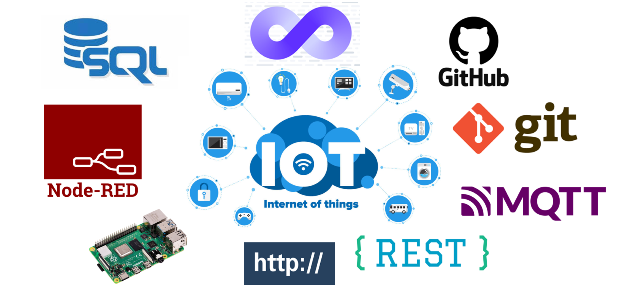

Автор і лектор: Олександр Пупена

доц. кафедри [АКСТУ НУХТ](http://www.iasu-nuft.pp.ua/) 

# [ПРОГРАМНА ІНЖЕНЕРІЯ В СИСТЕМАХ УПРАВЛІННЯ](https://pupenasan.github.io/ProgIngContrSystems) 

Дане сховище вміщує матеріали дисципліни "Програмна інженерія в системах управління" яка  дається студентам 1-го курсу спеціальності 174 «Автоматизація, комп’ютерно-інтегровані технології та робототехніка» освітньо-професійної програми «Комп’ютерні системи та програмна інженерія в автоматизації» Національного університету харчових технологій ([кафедра АКТСУ](http://www.iasu-nuft.pp.ua/)).

Також репозиторій містить додаткові матеріали для роботи в сфері LoCode/NoCode та IoT (Інтернеті речей). 

Матеріали постійно змінюються. Вітаються пропозиції і правки.

- [План на 2023 рік](план2023.md)

- [Лекції](Лекц)

- [Лабораторні](Лабор)

- [Курсове проектування](Курсовий)

- [Довідники](Довідники)

- [Матеріали суміжних курсів](othercourses/README.md)

[Репозиторій GitHub](https://github.com/pupenasan/ProgIngContrSystems)

