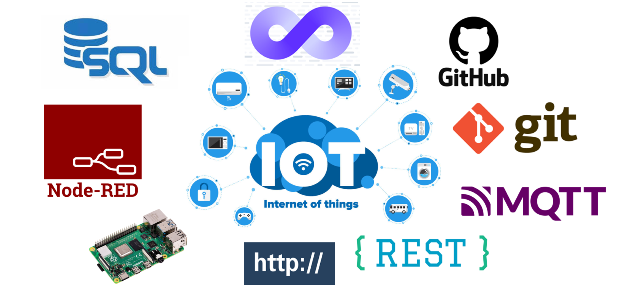

# [ПРОГРАМНА ІНЖЕНЕРІЯ В СИСТЕМАХ УПРАВЛІННЯ](https://pupenasan.github.io/ProgIngContrSystems) 

Дане сховище вміщує матеріали дисципліни "Програмна інженерія в системах управління" яка  дається студентам 1-го курсу спеціальності G7 "Автоматизація, комп’ютерно-інтегровані технології та робототехніка" освітньо-професійних програм "Комп’ютерні системи та програмна інженерія в автоматизації" та "Автоматизація, технічні та програмні засоби робототехніки" Національного університету харчових технологій ([кафедра АКТСУ](http://www.iasu-nuft.pp.ua/)).

## Структура та план курсу на 2026 рік

- Заняття: 02.02-24.05

- Підсумковий модульний контроль: 25.05-31.05

- Здача курсових робіт: 25.05-31.05

- Семестровий контроль: 1.06-21.06

### Тиждень 1-2 (2.02 - 15.02)

Лек 1. [Вступ до програмної інженерії в системах автоматизованого керування](Лекц/1_intro.md) (2 год) [Відеозапис](https://youtu.be/q602wNUgcDc)

Лек 2.1. [Створення документації на основі MarkDown: теоретична частина](https://github.com/asu-in-ua/atpv/blob/main/docs/md/teor.md) (1 год) [Відеозапис](https://youtu.be/B-s3QVcrIwM) 

Лек 2.2. [Вступ до GitHub: теоретична частина](https://github.com/asu-in-ua/atpv/blob/main/vercontrol/github/teor.md)  (1 год) [Відеозапис](https://youtu.be/nCP9IFAiHK4)

Лаб 1. [Основи роботи з MarkDown та GitHub](Лабор/v2lab1.md)  (4 год)

Лаб 2. [Основи роботи з Git, та віддаленим GitHub](Лабор/v2lab2.md) (4 год)

Курсова. Створення власного репозиторію для курсової роботи. Вибір теми. Створення опису рішення. 

### Тиждень 3-4 (16.02 - 1.03)

Лек 3.1. [Вступ до систем керування версіями та Git: теоретична частина](https://github.com/asu-in-ua/atpv/blob/main/vercontrol/git/teor.md) (1 год) [Відеозапис](https://youtu.be/dtGJrb7CDXQ)

Лек 3.2. [Від локального Git до GitHub: теоретична частина](https://github.com/asu-in-ua/atpv/blob/main/vercontrol/gitgithub/teor.md) (1 год) [Відеозапис](https://youtu.be/HWwfTd1iioE)

Лек 4. [Вступ до Node-RED: теоретична частина](https://github.com/asu-in-ua/atpv/blob/main/nodered/intro/teor.md) (2 год) [Відеозапис](https://youtu.be/0FcPIDgy6DY)

Лаб 3. [Основи роботи з Node-RED](Лабор/v2lab3.md) (4 год)

Лаб 4. [Основи роботи з користувацьким інтерфейсом в Node-RED](Лабор/v2lab4.md) (4 год)

Курсова. Створення проєкту для шлюза: відображення плинних вимірювальних даних на Dashboard. Розроблення розділу 1. 

### Тиждень 5-6 (2.03-15.03)

Лек 5. Апаратне забезпечення Raspberry PI:  [Відеозапис](https://youtu.be/5cXqtsjr3GQ)

- 5.1. [Знайомство з Raspberry PI : теоретична частина](https://github.com/asu-in-ua/atpv/blob/main/micropc/rpiinstall/teor.md) (1 год)
- 5.2. [Raspberry PI GPIO: теоретична частина](https://github.com/asu-in-ua/atpv/blob/main/micropc/rpigpiio/teor.md) (1 год)

Лек 6. Хмарні сервіси, віртуальні машини.

- 6.1. [Вступ до хмарних технологій: теоретична частина](https://github.com/asu-in-ua/atpv/blob/main/vm/cloudsintro/teor.md)
- 6.2. [Основи віртуалізації з використанням Virtual Box](https://github.com/asu-in-ua/atpv/blob/main/vm/vbox/teor.md)

Лаб 5. [Основи роботи з Raspberry PI](Лабор/v2lab5.md) (4 год)

Лаб 6. [Основи роботи з віртуальними машинами](Лабор/v2lab6.md) (4 год)

Курсова. Вибір апаратного забезпечення,  датчика та інших технічних засобів. Розроблення структурної схеми комплексу технічних засобів. Розроблення розділу 2.

### Тиждень 7-8 (16.03-29.03)

Лек 7. [Контейнери Docker](https://github.com/asu-in-ua/atpv/blob/main/vm/docker/teor.md).

Лек 8. Основи роботи з HTTP 

Лаб 7. [Основи роботи з контейнерами](Лабор/v2lab7.md)

Лаб 8. [Основи роботи з HTTP](Лабор/v2lab8.md)

Курсова. Створення віртуального середовища для тестування. Розроблення розділу 3.

### Тиждень 9-10 (30.03-12.04)

Лек 9. Основи HTTP API

Лек 10. Веб-автентифікація

Лаб 9. [Основи роботи з HTTP API](Лабор/v2lab9.md)

Курсова. Підготовка хмарної платформи. Віддалений користувацький інтерфейс.

### Тиждень 11-12 (13.04-26.04)

Лек 11. Протоколи IoT: MQTT

Лек 12. Бази даних та систем керування базами даних  

Лаб 10. [Протоколи IoT: MQTT](Лабор/v2lab10.md) 

Курсова. Відправка даних реального часу на смартфон. Розроблення розділу 4.

### Тиждень 13-14 (27.04-10.05)

Лек 13. Мова SQL.

Лек 14. Основи Java Script

Лаб 11. [Основи роботи з базами даних та SQL](Лабор/v2lab11.md) 

Курсова. Запис в локальну базу даних - системний журнал, дані датчиків. Запис даних на віддалену базу даних.  

### Тиждень 15-16 (11.05-24.05)

Лек 15. Функції та об'єкти Java Script та Node-RED

Лек 16. Моделі життєвого циклу

Лаб 12. [Інтегрування з хмарними застосунками та сервісами](Лабор/v2lab12.md)

Курсова. Реалізація сповіщення через Discord або Telegram. Дороблення усіх розділів. 

## Курсова робота

- [Курсова робота](Курсовий/README.md)

## Про дисципліну

Мета дисципліни «Програмна інженерія в системах управління» - формування знань з розробки програмного забезпечення, орієнтованого на автоматизовані системи управління, що відносяться до технологічного та виробничого рівня (АСУТП, IoT, MES та інші). Дисципліна направлена на вивчення методів та засобів програмної інженерії, розуміння основ побудов систем управління побудованих на основі архітектури Інтернету речей (IoT), поглиблення знання в програмуванні мови JavaScript, мережних технологіях Інтернету, використання СКБД та хмарних технологіях.

Вивчення даної дисципліни дасть можливість розробляти програмне та технічне забезпечення систем керування з використанням сучасних методів та засобів керування життєвим циклом. Програмна інженерія – це наука побудови комп'ютерних програмних систем на інженерній основі за методами, засобами і інструментами програмування, сучасними стандартами процесів життєвого циклу, менеджменту та керування якістю. Особливістю виробництва нових систем є технологія їх проектування від аналізу предметної області до утворення коду для виконання на комп'ютерах та інших засобах керування. 

Враховуючи особливість програмного забезпечення для систем автоматизованого керування, в дисципліні даються основи побудови АСКТП та архітектурні рішення на базі Інтернету речей (IoT). Рішення IoT базуються на програмній платформі Node-RED, що в свою чергу використовує JavaScript та підсистему Node.js. У даній дисципліні також приділяється велику увага роботі з хмарними платформами в контексті як засобів розробки так і засобів IoT.

## Компетентності та програмні результати навчання

Згідно з вимогами освітньо-професійної програми здобувачі повинні набути здатності отримувати компетентності:

- інтегральна: Здатність розв’язувати складні спеціалізовані задачі та практичні проблеми, що характеризуються комплексністю та невизначеністю умов, під час професійної діяльності у галузі автоматизації, що передбачає застосування теорій та методів галузі та комп’ютерних технологій.

загальні:

- ЗК01. Здатність застосовувати знання у практичних ситуаціях

- ЗК04. Навички використання інформаційних і комунікаційних технологій.

- ЗК08. Здатність працювати в команді.

фахові:

- ФК2. Здатність застосовувати знання фізики, електротехніки, електроніки і мікропроцесорної техніки, в обсязі, необхідному для розуміння процесів в системах автоматизації та комп'ютерно-інтегрованих технологіях.

- ФК5. Здатність обґрунтовувати вибір технічних засобів автоматизації на основі розуміння принципів їх роботи аналізу їх властивостей, призначення і технічних характеристик з урахуванням вимог до системи автоматизації і експлуатаційних умов; налагоджувати технічні засоби автоматизації та системи керування.

- ФК6. Здатність використовувати для вирішення професійних завдань новітні технології у галузі автоматизації та комп’ютерно-інтегрованих технологій, зокрема, проєктування багаторівневих систем керування, збору даних та їх архівування для формування бази даних параметрів процесу та їх візуалізації за допомогою засобів людино-машинного інтерфейсу.

- ФК7. Здатність використовувати для вирішення професійних завдань новітні технології у галузі автоматизації та комп’ютерно-інтегрованих технологій, зокрема, проєктування багаторівневих систем керування, збору даних та їх архівування для формування бази даних параметрів процесу та їх візуалізації за допомогою засобів людино-машинного інтерфейсу.

- ФК8. Здатність проєктування систем автоматизації з врахуванням вимог відповідних нормативно-правових документів та міжнародних стандартів.

- ФК9. Здатність вільно користуватись сучасними комп’ютерними та інформаційними технологіями для вирішення професійних завдань, програмувати та використовувати прикладні та спеціалізовані комп’ютерно-інтегровані середовища для вирішення задач автоматизації.

- ФК12. Здатність використовувати однокристальні мікропроцесорні контролери для розробки ефективних систем управління.

- ФК14. Здатність використовувати комп’ютерні мережі у розподілених системах управління.

- ФК15. Здатність розробляти ту супроводжувати системи автоматизації за галузями діяльності

Здобувачі повинні досягти таких програмних результатів навчання:

- ПРН 3. Вміти застосовувати сучасні інформаційні технології та мати навички розробляти алгоритми та комп’ютерні програми з використанням мов високого рівня та технологій обۥєктно-орієнтованого програмування, створювати бази даних та використовувати інтернет-ресурси.

- ПРН 10. Вміти обґрунтовувати вибір структури та розробляти прикладне програмне забезпечення для мікропроцесорних систем управління на базі локальних засобів автоматизації, промислових логічних контролерів та програмованих логічних матриць і сигнальних процесорів.

- ПРН 11. Вміти виконувати роботи з проєктування систем автоматизації, знати зміст і правила оформлення проєктних матеріалів, склад проєктної документації та послідовність виконання проєктних робіт з врахуванням вимог відповідних нормативно-правових документів та міжнародних стандартів.

- ПРН15. Вміти розробляти та використовувати засоби мультимедіа в сучасних інформаційних системах

- ПРН16. Вміти обґрунтовувати вибір технічних і програмних засобів для вибору структури систем автоматизації промислових приміщень та за галузями діяльності.

- ПРН 19. Вміти вибирати структуру, технічні та програмні засоби автоматизації для розробки, налагодження та експлуатації комп’ютерні мережі у розподілених системах управління.

## Контроль та оцінювання результатів навчання ДФ

(денна форма здобуття освіти) 2 семестр,  форма підсумкового контролю – диференційований залік

| Елементи змістового модуля | Мін  | Макс | Форма контролю                         |
| -------------------------- | ---- | ---- | -------------------------------------- |
| Лабораторна робота 1       | 3    | 5    | Виконання і захист лабораторної роботи |
| Лабораторна робота 2       | 3    | 5    | Виконання і захист лабораторної роботи |
| Лабораторна робота 3       | 3    | 5    | Виконання і захист лабораторної роботи |
| Лабораторна робота 4       | 3    | 5    | Виконання і захист лабораторної роботи |
| Лабораторна робота 5       | 3    | 5    | Виконання і захист лабораторної роботи |
| Лабораторна робота 6       | 3    | 5    | Виконання і захист лабораторної роботи |
| Лабораторна робота 7       | 3    | 5    | Виконання і захист лабораторної роботи |
| Лабораторна робота 8       | 3    | 5    | Виконання і захист лабораторної роботи |
| Лабораторна робота 9       | 3    | 5    | Виконання і захист лабораторної роботи |
| Лабораторна робота 10      | 3    | 5    | Виконання і захист лабораторної роботи |
| Лабораторна робота 11      | 3    | 5    | Виконання і захист лабораторної роботи |
| Лабораторна робота 12      | 3    | 5    | Виконання і захист лабораторної роботи |
| Лекційний курс теми 1-7    | 3    | 5    | Письмова контрольна робота 1           |
| Лекційний курс теми 9-16   | 3    | 5    | Письмова контрольна робота 2           |
| Підсумковий залік          | 18   | 30   | Усне опитування                        |
| Всього                     | 60   | 100  |                                        |

## Контроль та  оцінювання знань за виконання курсової роботи

2 семестр

| Елементи змістового модуля                                   | Мін  | Макс | Форма контролю         |
| ------------------------------------------------------------ | ---- | ---- | ---------------------- |
| Розділ 1. «Розробка вимог до системи та ПЗ».                 | 10   | 15   | Перевірка розділу      |
| Розділ 2. «Розробка архітектури та необхідної проектної документації». | 10   | 15   | Перевірка розділу      |
| Розділ 3. «Розробка методики перевірки та засобів тестування». | 10   | 15   | Перевірка розділу      |
| Розділ 4. «Розробка та налагодження програмного забезпечення та супровідної документації». | 12   | 25   | Перевірка розділу      |
| Захист курсової роботи                                       | 18   | 30   | Захист курсової роботи |
| Всього                                                       | 60   | 100  |                        |

## Навчально-методичне забезпечення

7.1. Пупена О.М. [Електронний ресурс]: Програмна інженерія в системах управління: курс лекцій для здобувачів освітнього ступеня "бакалавр" спеціальності 151 "Автоматизація та комп'ютерно-інтегровані технології" освітньо-професійної програми " Комп'ютерні системи та програмна інженерія в автоматизації" денної форми навчання. / О.М. Пупена, – К.: НУХТ, 2021. – 205 с.

7.2. Програмна інженерія в системах управління: [Електронний ресурс]: Методичні рекомендації до виконання курсової роботи  для здобувачів освітнього ступеня "бакалавр" спеціальності 151 "Автоматизація та комп'ютерно-інтегровані технології" освітньо-професійної програми "Комп'ютерні системи та програмна інженерія в автоматизації" денної форми навчання. / уклад.: О.М. Пупена, – К.: НУХТ, 2021.– 20 с.

7.3. Програмна інженерія в системах управління: [Електронний ресурс]: Лабораторний практикум для здобувачів освітнього ступеня "бакалавр" спеціальності 151 "Автоматизація та комп'ютерно-інтегровані технології" освітньо-професійної програми "Комп'ютерні системи та програмна інженерія в автоматизації" денної форми навчання. / уклад.: О.М. Пупена, – К.: НУХТ, 2021.– 151 с.

## Рекомендована література

### Базова

8.1. Пупена, О. М. Довідник з розроблення застосунків в середовищі NODE-RED [Електронний ресурс] : електронний довідник/О. М. Пупена; Національний університет харчових технологій. – Київ : НУХТ, 2021. – 170 с. – № 100.115

8.2. Лавріщева К.М. Технологія програмування інформаційних систем: методи, засоби, інструменти [Текст] / К. М. Лавріщева, М. С. Нікітченко, Л. Л. Омельчук ; підручник. — Київ. нац. ун-т ім. Т. Шевченка. — Київ : Київ. ун-т, 2015. — 367 с.

8.3. Основи програмування та алгоритмічні мови [Електронний ресурс]: навч. посіб. / С. В. Грибков, О. Л. Сєдих. — Київ: НУХТ, 2019. — 475 с.

8.4. Промислові мережі та інтеграційні технології в автоматизованих системах: навч. посіб./ О.М. Пупена, І.В.Ельперін, Н.М.Луцька, А.П.Ладанюк – К.: Ліра-К, 2016. – 552 с.

### Допоміжна

8.5. Алгоритмізація та програмування [Текст]: курс лекцій для студ. спец. 7.092501, 7.092502 "Автоматизоване управління технологічними процесами", "Комп'ютерно-інтегровані технологічні процеси та виробництва" заоч. форми навч. / Л. Ю. Маноха, Н. Н. Бровченко ; Нац. ун-т харч. технол. — К.: НУХТ, 2007. — 115 с. 

8.6. Основи програмування та алгоритмічні мови [Електронний ресурс]: лабораторний практикум для здобувачів освітнього ступеня «Бакалавр» спеціальності 122 «Комп’ютерні науки» денної та заочної форм навчання / уклад. С.В. Грибков, О.Л. Сєдих, К.Є. Бобрівник. – К.: НУХТ, 2018. – 443 с.

### Інформаційні ресурси

9.1. Репозиторій довідника з Node-RED https://github.com/pupenasan/NodeREDGuidUKR 

9.2. The entire Pro Git book https://git-scm.com/book/uk/v2

### Теми для додаткового вивчення

У цьому розділі можуть з'явитися будь які теми які стосуються введення в програмування в різні мови а також технології які стосуються програмної інженерії в системах керування. Зробіть форк репозиторію і пропонуйте зміни.

- [Мова Python](python.md)
- [Мова Lua](lua.md)
- [Мова Go](go.md)
- [Google Apps Script](gs.md)
- [Об'єктно-орієнтоване програмування в JavaScript](jsclass.md)
- [Керування ідентифікацією і доступом](secur.md)
- [yaml](yaml.md)

### Інші посилання

- [Довідники](Довідники)

- [Матеріали суміжних курсів](othercourses/README.md)

[Репозиторій GitHub](https://github.com/pupenasan/ProgIngContrSystems)

Автор і лектор: Олександр Пупена [доц. кафедри АКСТУ НУХТ](https://www.iasu-nuft.pp.ua/about-5) 

