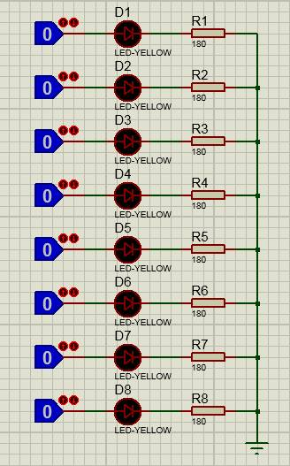
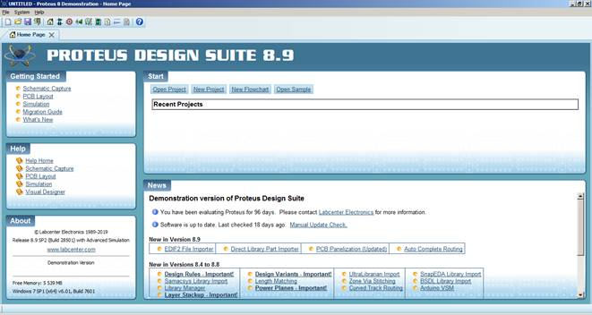
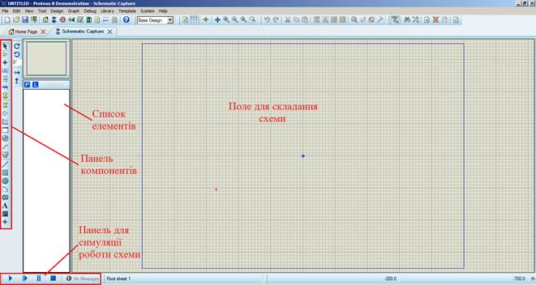
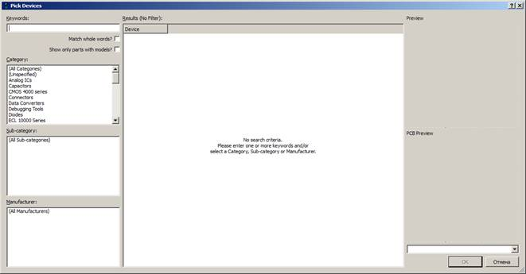
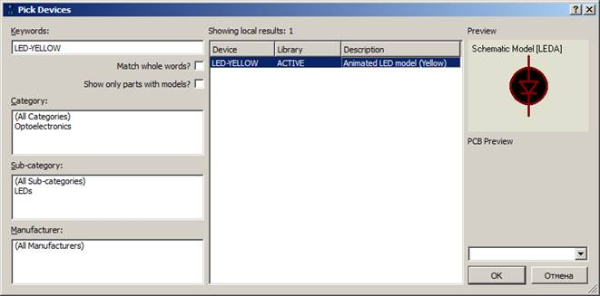
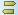
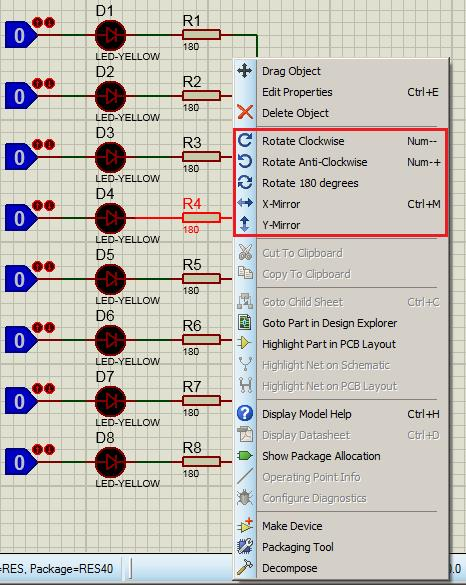
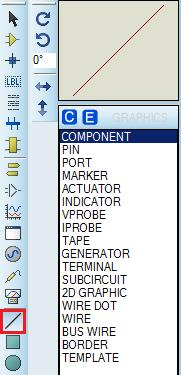
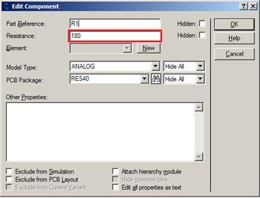

ПРОГРАМУВАННЯ ОДНОКРИСТАЛЬНИХ МІКРОПРОЦЕСОРНИХ КОНТРОЛЕРІВ, Євген Проскурка 

[Лаб1. Робота з програмним середовищем Proteus](lab1.md) <-- [Зміст](README.md) --> [Лаб2. Принцип роботи та управління семисегментними індикаторами](lab2.md)

# ЛР1 Робота з програмним середовищем Proteus 

**Мета роботи:** Ознайомитися з принципом роботи в програмному середовищі Proteus.

## 1.Завдання на виконання роботи

1.1.     Скласти схему для ознайомлення з принципом роботи в програмному середовищі Proteus (рис. 1.1). При складані схеми використати наступні компоненти представлені в таблиці 1.1. 

Рис. 1.1. Схема в програмному середовищі Proteus.

*Таблиця 1.1. Список елементів.*

| Найменування      | Кількість | Опис                      |
| ----------------- | --------- | ------------------------- |
| LOGICSTATE        | 8         | імітатори логічних рівнів |
| 7SEG-MPX2-CC-BLUE | 1         | світлодіод (жовтий)       |
| RES               | 8         | резистор (номінал 180 Ом) |

1.2.     Протестувати роботу схеми в програмному середовищі Proteus. 

1.3.     Результати роботи схеми в програмному середовищі Proteus навести в звіті лабораторної роботи у вигляді зображень.

## **2.**  Теоретичні відомості

### 2.1. Робота в програмному середовищі Proteus

Запускаємо Proteus: 

Пуск->Все программы->Proteus 8 Demonstration-> Proteus 8 Demonstration.

Відкривається головне вікно програми, вигляд якого представлено на рис. 1.2.

Рис. 1.2. Головне вікно програмного середовища Proteus.

Для запуску середовища в якому відбувається складання схеми необхідно натиснути на значок  на верхній панелі інструментів.

Запуститься вікно з виглядом що представлено на рис. 1.3.

Рис. 1.3. Вигляд вікна для складання схем.

Елементи, з яких складається схема знаходяться в бібліотеці. Для її виклику необхідно натиснути на значок  на панелі компонентів. Далі зверху вікна списку елементів натиснути на кнопку P. Відкриється вікно бібліотеки (рис 1.4).

Рис. 1.4. Вигляд вікна бібліотеки компонентів. 

​     Для вибору компоненту можна використовувати пошук, для цього треба написати назву елемента в рядку “Keywords” або вибирати з списку “Category” н “Sub-category” (рис. 1.5). Вибравши елемент натискаємо кнопку ОК і розміщаємо його на полі схеми.

Рис. 1.5. Пошук та вибір компонента в бібліотеці.

Для розміщення елементу  натискаємо на панелі компонентів значок  (рис. 1.6). В списку елементів вибираємо GROUND, переміщаємо курсор на поле схеми і натискаємо ліву кнопку миші. Курсор зміниться на значок  і вибираємо місце куди його поставити.

Рис. 1.6. Вибір елементу GROUND.

Для зміни кута повороту деталі на схемі необхідно виділити елемент і правою кнопкою миші визвати контекстне меню (рис. 1.7), де можливо повернути деталь (пункти Rotate…), змінити параметри деталі (Edit Properties) а також видалити деталь (Delete Object).

Рис. 1.7. Контекстне меню.

Для з’єднання деталей між собою використовують  на панелі компонентів (рис. 1.8) вибравши пункт COMPONENT в списку. З’єднання деталей на схемі проводиться вибравши контакт одного елементу і натиснувши ліву клавішу миші вести курсор до контакту другого елементу при цьому промальовується лінія на схемі. Для завершення з’єднання натиснути ліву клавішу миші на контакті другого елементу. 

Рис. 1.8. Елемент для з’єднання деталей між собою.

## **3.** Порядок виконання роботи

3.1. Запустити програмне середовище Proteus. Побудувати схему за рис. 1.1, при цьому використати елементи з таблиці 1.1.

3.2. В властивостях компонентів RES задати параметр Resistance значення 180:

3.3. За допомогою компонентів LOGICSTATE імітувати роботу пінів порту мікроконтролера (МК). Виставити на компонентах LOGICSTATE комбінацію 0 та 1 (натисканням на компонент), попередньо перевести числа відповідно до варіанту завдання (табл. 1.2) з 10-ої в 2-ву систему числення.

*Таблиця 1.2.*

| Варіант | Число 1 | Число 2 | Число 3 |
| ------- | ------- | ------- | ------- |
| 1       | 163     | 213     | 201     |
| 2       | 162     | 224     | 21      |
| 3       | 217     | 141     | 251     |
| 4       | 241     | 119     | 123     |
| 5       | 44      | 254     | 192     |
| 6       | 99      | 56      | 227     |
| 7       | 35      | 202     | 89      |
| 8       | 161     | 130     | 250     |
| 9       | 165     | 249     | 224     |
| 10      | 187     | 55      | 198     |
| 11      | 169     | 235     | 241     |
| 12      | 128     | 19      | 17      |
| 13      | 217     | 12      | 145     |
| 14      | 29      | 123     | 165     |
| 15      | 137     | 95      | 165     |
| 16      | 194     | 233     | 244     |
| 17      | 26      | 149     | 217     |
| 18      | 189     | 89      | 197     |
| 19      | 93      | 142     | 164     |
| 20      | 253     | 79      | 242     |
| 21      | 112     | 102     | 140     |
| 22      | 121     | 101     | 166     |

| 23   | 60   | 137  | 124  |
| ---- | ---- | ---- | ---- |
| 24   | 142  | 145  | 124  |
| 25   | 134  | 115  | 253  |
| 26   | 123  | 63   | 101  |
| 27   | 194  | 164  | 245  |
| 28   | 28   | 207  | 245  |
| 29   | 165  | 102  | 61   |
| 30   | 221  | 172  | 174  |

3.4.     В отриманому 2-му числі молодший біт відповідає за світлодіод D1, а старший за світлодіод D8. Наприклад число 20510=110011012 записується так:

| D8   | D7   | D6   | D5   | D4   | D3   | D2   | D1   |
| ---- | ---- | ---- | ---- | ---- | ---- | ---- | ---- |
| 1    | 1    | 0    | 0    | 1    | 1    | 0    | 1    |

1 – означає світлодіод ***світиться***; 0 – світлодіод ***не світиться***.

3.5.     Отримані результати представити в звіті у вигляді зображень.

3.6.     Оформити звіт про роботу.

## 4. Вміст звіту про роботу

4.1.     Назва, мета та завдання на виконання роботи.

4.2.     Представити в звіті зображення отриманих результатів в програмному середовище Proteus.

## 5. Контрольні питання

5.1.     Пояснити призначення компоненту LOGICSTATE.

5.2.     Пояснити призначення резисторів RES.

5.3.     Пояснити призначення компоненту GROUND.

[Лаб1. Робота з програмним середовищем Proteus](lab1.md) <-- [Зміст](README.md) --> [Лаб2. Принцип роботи та управління семисегментними індикаторами](lab2.md)