ПРОГРАМУВАННЯ ОДНОКРИСТАЛЬНИХ МІКРОПРОЦЕСОРНИХ КОНТРОЛЕРІВ, Євген Проскурка 

[Лаб9. Інтерфейс TWI (I2C) в мікроконтролерах сімейства megaAVR](lab9.md) <-- [Зміст](README.md) 

# ЛР10 Інтерфейс UART в мікроконтролерах сімейства megaAVR

**Мета роботи:** Ознайомитися з принципом роботи інтерфейсу UART в мікроконтролерах сімейства megaAVR при управлінні серводвигуном. 

## **1.** Завдання на виконання роботи

1.1.     Скласти схему підключення наведену на рис. 10.1 в програмному середовищі Proteus. При складані схеми використати наступні компоненти представлені в таблиці 10.1.

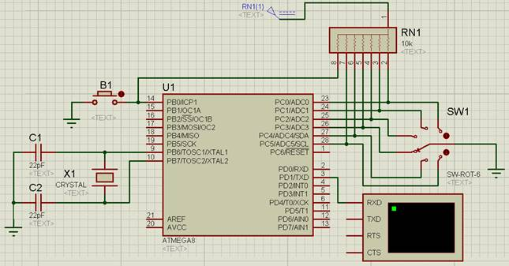

Рис. 10.1. Схема в програмному середовищі Proteus.

*Таблиця 10.1. Список елементів.*

| Найменування     | Кількість | Опис                                |
| ---------------- | --------- | ----------------------------------- |
| ATMEGA8          | 1         | мікроконтролер AVR ATmega8          |
| BUTTON           | 1         | кнопка B1                           |
| SW-ROT-6         | 1         | перемикач на 6 положень             |
| RES8SIPB         | 1         | блок резисторів номіналами 10 кОм   |
| CAP              | 2         | конденсатори, номіналами 22 пФ      |
| CRYSTAL          | 1         | кварцовий резонатор номіналом 8 MHz |
| VIRTUAL TERMINAL | 1         | віртуальний термінал                |

1.2.     Записати представлену програму в середовищі AVR Studio для функціонування схеми. Алгоритм функціонування схеми наступний: змінюючи положення ручки перемикача та натискаючи на кнопку B1 виводити на терміналі комбінацію цифр згідно варіанту завдання.

1.3.     Протестувати представленої програму в середовищі AVR Studio на схемі в програмному середовищі Proteus. 

1.4.     Пояснити принцип роботи представленої програми при захисті лабораторної роботи.

## **2.** Теоретичні відомості

### 2.1. Загальні відомості про інтерфейс UART 

Інтерфейс **UART** *(**Universal* *Asynchronous* *Receiver**-**Transmitter* *– універсальний асинхронний приймач/передавач)* в мікроконтролерах AVR ATmega призначений для взаємодії з зовнішньою периферією.

Даний протокол є послідовним, тобто дані передаються один за одним, що в деякій мірі обмежує швидкість роботи. Так як протокол є асинхронним, приймач і передавач повинні працювати строго на одній частоті, яку необхідно налаштувати ще до початку роботи.

При передачі байту передавач (пристрій, що передає інформацію) спочатку виставляє логічний 0 на вивід TX (Transmitter). Це так званий старт-біт, що означає початок передачі (біт Start, рис. 10.1). Після цього передавач виставляє біти переданого байту через певні проміжки часу, задані частотою. Далі може бути переданий біт парності (біт P, рис. 10.1), який служить для перевірки якості передачі. Коли передані всі біти, виставляється стоп-біт (біт Stop, рис. 10.1), тобто логічна 1 на лінії передачі. Число стоп-бітів може бути різним: 1; 1,5; 2. При відсутності на лінії передачі виставляється логічна 1 (біт NT (No Transmission), рис. 10.2).

Приймач (пристрій, що приймає інформацію) зчитує інформацію з виводу RX (*Receiver*), яка надходить від передавача.

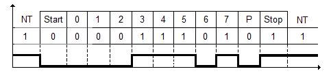

Рис. 10.2. Принцип передачі інформації за інтерфейсом UART. 

В мікроконтролері AVR ATmega8 піни, що призначені для роботи з інтерфейсом UART позначаються, як RXD та TXD (піни 2 та 3, рис. 10.3).  

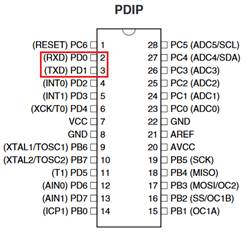

Рис. 10.3. Мікроконтролер ATmega8.

Для роботи інтерфейсом UART використовуються регістри: **UDR, UCSRA, UCSRB, UBRRL** та **UBRRH**. Розглянемо дані регістри детальніше:

Регістр **UDR** – регістр даних UART:

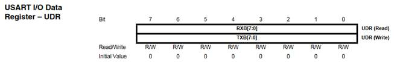

При передачі в нього ***записуються*** дані, які необхідно відправити, чи з нього ***зчитуються*** прийняті дані.

Регістр **UCSRA –** регістр контролю і статусу UART:

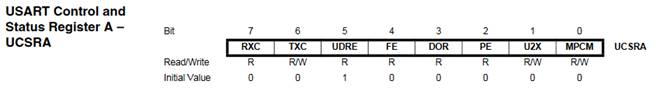

**Біт RXC (Receive** **Complete)** – прапорець закінчення прийому даних. Встановлюється в 1 при наявності незчитаних даних і скидається в 0 після закінчення прийому даних.

**Біт** **TXC (Transmit** **Complete)** – прапорець закінчення передачі даних. Скидається в 0 після закінчення передачі даних і встановлюється в 1 при наявності ненадісланих даних.

**Біт** **UDRE (Data** **Register** **Empty)** – прапорець, що означає готовність регістра **UDR** отримувати нові дані. Коли **UDRE** дорівнює 1, регістр **UDR** порожній і готовий до прийому нових даних.

**Біт** **FE** **(Frame** **Error)** – прапорець помилки фрейму.

**Біт** **DOR** **(Data** **OverRun)** – прапорець переповнення регістра даних.

**Біт** **PE** **(Parity** **Error)** – прапорець помилки парності.

**Біт** **U2X** – біт, що дозволяє збільшити швидкість передачі вдвічі. При запису 1 в даний біт подільник тактової частоти модуля UART зменшується вдвічі, що дозволяє вдвічі збільшити швидкість передачі даних.

**Біт** **MPCM** – мультипроцесорний режим комунікації.

Регістр **UCSRB** **–** регістр контролю і статусу UART:

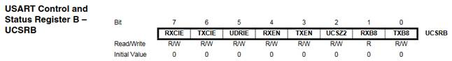

**Біт** **RXCIE** **(RX** **Complete** **Interrupt** **Enable)** – біт, що дозволяє або забороняє генерацію переривання після закінчення прийому. При записи 1 в даний біт переривання після закінчення прийому дозволено, при записі 0 – заборонено.

**Біт** **TXCIE** **(TX** **Complete** **Interrupt** **Enable)** – біт, що дозволяє або забороняє генерацію переривання після закінчення передачі. При записи 1 в даний біт переривання після закінчення передачі даних дозволено, при записі 0 – заборонено.

**Біт** **UDRIE** **(Data** **register** **empty** **Interrupt** **Enable)** – біт, що дозволяє або забороняє виникнення переривання по прапорцю **UDRE**.

**Біт** **RXEN** **(Receiver** **Enable)** – біт, що дозволяє або забороняє роботу приймача UART. Запис 1 в даний біт включає приймач UART модуля, запис 0 – вимикає.

**Біт** **TXEN** **(Transmitter** **Enable)** – біт, що дозволяє або забороняє роботу передавача UART. Запис 1 в даний біт включає передавач UART модуля, запис 0 – вимикає.

**Біт** **UCSZ2 (Character** **Size)** – біт, що у парі з бітами **UCSZ1** і **UCSZ0** регістра **UCSRC** задає число переданих біт. Тобто можливо передавати не тільки байт, а й по 5, 6, 7 та 9 біт.

**Біт** **RXB8 (Receive** **Data** **Bit** **8)** – 9-й біт даних, що приймається при передачі по 9 біт. Повинен бути зчитаний перед операціями з регістром **UDR**.

**Біт** **TXB8** **(Transmit** **Data** **Bit** **8)** – 9-й біт даних, що відсилається при передачі по 9 біт. Повинен бути записаний перед записом інших біт в **UDR**.

Регістр **UCSRC** **–** регістр контролю і статусу UART:

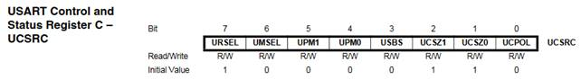

**Біти** **URSEL** **–** цей біт вибирається для доступу між регістром UCSRC або регістром UBRRH. Біт URSEL повинен 1 при записі бітів до регістру UCSRC.

**UMSEL** **(Mode** **Select)** – вибір режиму роботи UART.

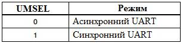

**Біти** **UPM0,** **UPM1 (Parity** **Mode)** – дані біти дозволяють налаштувати контроль парності переданих даних.

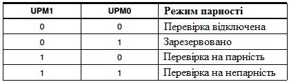

**Біт** **USBS** **(Stop** **Bit** **Select)** – даний біт дозволяє вибрати число стоп-бітів. При записи 1 в даний біт число стоп-бітів стане 2, а при записі 0 – число стоп-бітів стане 1.

**Біти** **UCSZ1,** **UCSZ0 (Character** **Size)** – у сукупності з бітом **UCSZ2** регістра **UCSRB** дані біти дозволяють вибрати число переданих біт.

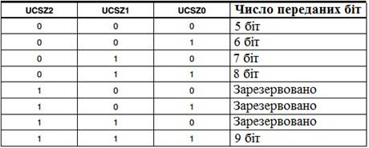

**Біт** **UCPOL** – даний біт дозволяє налаштувати, з якого фронту буде відбуватися обмін даними при синхронному режимі передачі. При роботі в асинхронному режимі передачі необхідно встановити даний біт в 0.

Регістр **UBRRL** та **UBRRH**:

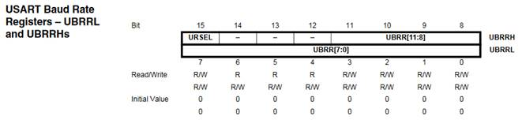

Регістри **UBRRL** та **UBRRH** відповідають за налаштування швидкості роботи приймача. Слід пам'ятати, що при роботі з регістром **UBRRH** біт **URSEL** має дорівнювати 0.

Для отримання необхідної швидкості роботи UART значення **UBRR** (пари регістрів **UBRRH** та **UBRRL**) розраховується за такою формулою:

```
UBRR = Fosc/B/16 - 1
```

де, Fosc – частота роботи мікроконтролера (Гц);

B – необхідна швидкість роботи UART (біт/сек).

Якщо необхідно налаштувати швидкість передачі 9600 біт/сек при роботі мікроконтролера на частоті 8 МГц (8000000 Гц).

```
UBRR = (8000000 / 9600 / 16) - 1 = 51.083
```

Округляємо до цілого числа, тобто до 51. Отримане число необхідно перевести в 16-ну систему числення – 0х33, та записати в регістри **UBRRL:UBRRH**.

## **3.** Порядок виконання роботи

3.1.     Запустити програмне середовище Proteus. Побудувати схему за рис. 10.1, при цьому використати елементи з таблиці 10.1.

3.2.     Розташування компоненту VIRTUAL TERMINAL представлено нижче (рис. 10.4).

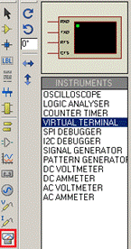

Рис. 10.4. Компонент VIRTUAL TERMINAL.

3.3.     Властивості компоненту VIRTUAL TERMINAL вказані на рис. 10.5.

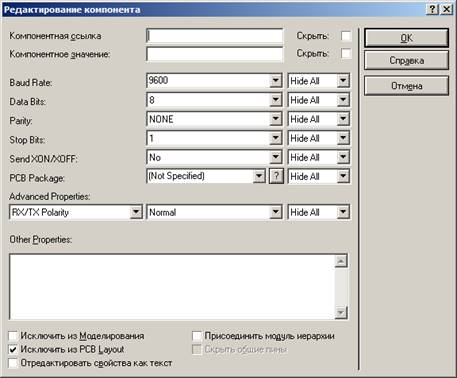

Рис. 10.5. Властивості компоненту VIRTUAL TERMINAL.

3.4.     Вказати в елементі ATMEGA8 шлях до hex-файлу та задати наступні настройки, що вказані на рис. 10.6.

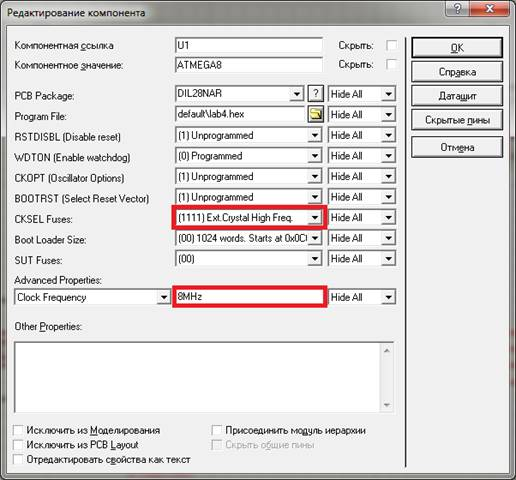

Рис. 10.6. Властивості компоненту ATMEGA8.

3.5.     Створити проєкт в AVR Studio 4. В налаштуваннях проєкту виберемо мікроконтролер ATMEGA8.

3.6.     Додати до файлу програму, яка необхідна для програмування заданого алгоритму та доповнити її згідно варіанту завдання:

```c
#define F_CPU 8000000UL
#include <avr/io.h>
#include <util/delay.h>

int main(void) {
     DDRC=0x00;
     PORTC=0x7F;
     DDRB=0x00;
     PORTB=0xFF;     
     UCSRB = (1<<TXEN);
     UCSRC = (1<<URSEL) | (0<<USBS) | (1<<UCSZ0) | (1<<UCSZ1);
     UBRRH=0x00;
     UBRRL=0x33;
	while (1) {
         // перевірка натиснення кнопки В1
		if (PINB == 0x…) {
        // перевірка положення перемикача
        if (PINC == 0x…) {
            while(!( UCSRA & (1<<UDRE)));
            UDR=0x…; // код 1-ї цифри числа
            while(!( UCSRA & (1<<UDRE)));
            UDR=0x…; // код 2-ї цифри числа
            while(!( UCSRA & (1<<UDRE)));
            UDR=0x…; // код 3-ї цифри числа
            while(!( UCSRA & (1<<UDRE)));
            UDR=0x…; // код 4-ї цифри числа              
            while(!( UCSRA & (1<<UDRE)));
            UDR=0x0D; // код нової строки
        }
            // перевірка положення перемикача
            if (PINC == 0x…) {
                // код передачі числа в термінал
            }
            // перевірка положення перемикача
            if (PINC == 0x…) {
                // код передачі числа в термінал
            }
            // перевірка положення перемикача
            if (PINC == 0x…) {
                // код передачі числа в термінал
            }
            // перевірка положення перемикача
            if (PINC == 0x…) {
                // код передачі числа в термінал
            }
            // перевірка положення перемикача
            if (PINC == 0x…) {
                // код передачі числа в термінал
            } 
            _delay_ms(1000);
        }
    }
}
```

Коди цифр з яких складається число береться з таблиці кодування символів ASCII, що представлена на рис. 10.7.

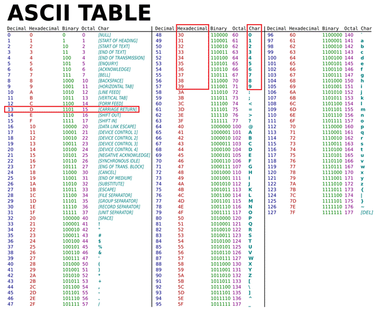

Рис. 10.7. Таблиця кодування символів ASCII.

Код символу повернення каретки (CARRIAGE RETURN), тобто нової строки також виділено в таблиці на рис. 10.7.

Варіанти завдання представлені в таблиці 10.2.

*Таблиця 10.2. Варіанти завдання.*

| № варіанту | Число №1 | Число №2 | Число №3 | Число №4 | Число №5 | Число №6 |
| ---------- | -------- | -------- | -------- | -------- | -------- | -------- |
| 1          | 1802     | 7639     | 4185     | 7694     | 1785     | 7195     |
| 2          | 2761     | 4527     | 9271     | 6798     | 9342     | 7514     |
| 3          | 1362     | 3210     | 8973     | 9165     | 3061     | 9485     |
| 4          | 7530     | 7459     | 7834     | 4251     | 5463     | 7524     |
| 5          | 4903     | 2064     | 1547     | 9843     | 4352     | 7249     |
| 6          | 1362     | 3428     | 5734     | 6342     | 2431     | 1305     |
| 7          | 7864     | 9814     | 8103     | 9156     | 8130     | 1423     |
| 8          | 3128     | 1975     | 4316     | 3495     | 2587     | 6908     |
| 9          | 7865     | 4716     | 7613     | 3412     | 4678     | 2831     |
| 10         | 6302     | 9297     | 6497     | 8096     | 7156     | 9562     |
| 11         | 4735     | 8217     | 1829     | 6185     | 2347     | 4698     |
| 12         | 5927     | 4730     | 8671     | 2498     | 6079     | 5987     |
| 13         | 9263     | 4170     | 6574     | 5987     | 3689     | 3968     |
| 14         | 7014     | 4710     | 4023     | 7958     | 8265     | 3452     |
| 15         | 2017     | 9821     | 5273     | 5615     | 9231     | 3769     |

*Продовження таблиці 10.2*

| 16   | 2834 | 8453 | 2174 | 6147 | 9654 | 8402 |
| ---- | ---- | ---- | ---- | ---- | ---- | ---- |
| 17   | 6143 | 4139 | 9612 | 7653 | 8674 | 9128 |
| 18   | 5106 | 1836 | 7632 | 3827 | 8973 | 4985 |
| 19   | 2974 | 8201 | 2193 | 5314 | 9048 | 4605 |
| 20   | 3827 | 1543 | 7689 | 6315 | 6172 | 9518 |
| 21   | 3465 | 8329 | 9405 | 2016 | 4902 | 4531 |
| 22   | 2984 | 3812 | 1348 | 2157 | 6314 | 3710 |
| 23   | 1097 | 9243 | 9742 | 7068 | 4856 | 8567 |
| 24   | 6395 | 4230 | 6052 | 3012 | 5367 | 3026 |
| 25   | 6847 | 7578 | 6123 | 6125 | 2703 | 3405 |
| 26   | 5734 | 3420 | 4860 | 2098 | 7570 | 8521 |
| 27   | 6031 | 9418 | 9869 | 3615 | 2870 | 6902 |
| 28   | 4863 | 1269 | 3046 | 2584 | 2546 | 1306 |
| 29   | 3176 | 4127 | 5497 | 2543 | 1728 | 1497 |
| 30   | 6058 | 3247 | 1572 | 7541 | 5163 | 7321 |

3.7.     Промоделювати роботу схеми. Впевнитися, що вона працює за заданим алгоритмом.

3.8.     Оформити звіт про роботу.

## 4. Вміст звіту про роботу.

4.1.     Назва, мета та завдання на виконання роботи.

4.2.     Зображення схеми зібраної в програмному середовище Proteus.

4.3.     Лістінг програми написаної в програмному середовищі AVR Studio.

## 5.  Контрольні питання.

5.1.     Пояснити, принцип розрахунку швидкості роботи інтерфейсу UART.

5.2.     Вказати регістр, що приймає отримані дані по інтерфейсу UART.

5.3.     Вказати біт, що відповідає за вибір режиму роботи UART.

5.4.     Вказати біт, що відповідає за кількість стопових бітів в роботі інтерфейсу UART.

5.5.     Вказати біти, що відповідають за вибір режиму парності в роботі інтерфейсу UART.

[Лаб9. Інтерфейс TWI (I2C) в мікроконтролерах сімейства megaAVR](lab9.md) <-- [Зміст](README.md) 