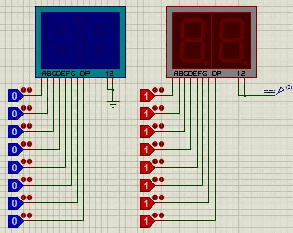
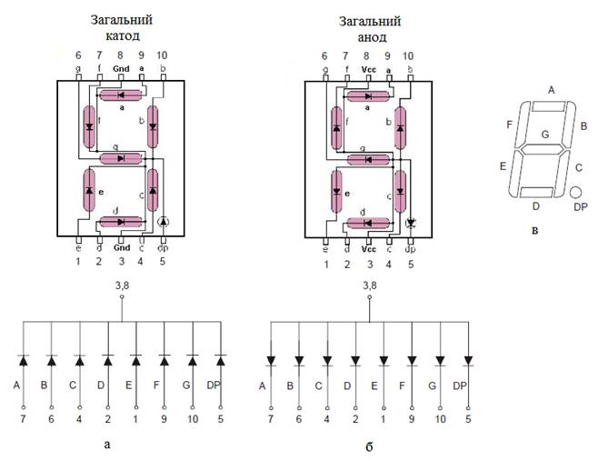
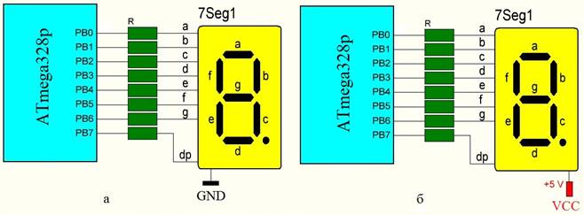
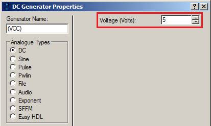
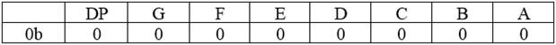

ПРОГРАМУВАННЯ ОДНОКРИСТАЛЬНИХ МІКРОПРОЦЕСОРНИХ КОНТРОЛЕРІВ, Євген Проскурка 

[Лаб1. Робота з програмним середовищем Proteus](lab1.md) <-- [Зміст](README.md) --> [Лаб3. Принцип роботи та управління серводвигуном](lab3.md)

# ЛР2 Принцип роботи та управління семисегментними індикаторами

**Мета роботи:** Ознайомитися з принципом роботи та управлінням семисегментними індикаторами.

## 1. Завдання на виконання роботи

1.1.  Скласти схему для ознайомлення з принципом управління семисегментними індикаторами в програмному середовищі Proteus (рис. 2.1). При складані схеми використати наступні компоненти представлені в таблиці 2.1.

Рис. 2.1. Схема в програмному середовищі Proteus.

*Таблиця 2.1. Список елементів.*

| Найменування      | Кількість | Опис                                                         |
| ----------------- | --------- | ------------------------------------------------------------ |
| LOGICSTATE        | 16        | імітатори логічних рівнів                                    |
| 7SEG-MPX2-CC-BLUE | 1         | 2-х знаковий семисегментний  індикатор з загальним катодом (синій) |
| 7SEG-MPX2-CA      | 1         | 2-х знаковий семисегментний  індикатор з загальним анодом (червоний) |

1.2. Протестувати роботу семисегментних індикаторів в програмному середовищі Proteus. 

1.3. Результати роботи семисегментних індикаторів в програмному середовищі Proteus навести в звіті лабораторної роботи у вигляді зображень та таблиць 2.2 та 2.3.

## 2. Теоретичні відомості

### 2.1. Загальні відомості про семисегментний індикатор

Семисегментний індикатор використовуються для виводу інформації у вигляді цифр. Семисегментний індикатор – це сукупність 7-ми світлодіодів розміщених у вигляді цифри 8, ще використовуються 8-й для зображення десяткової крапки. 

Розрізняють два види семисегментних індикаторів: з загальним катодом (рис 2.2 а) та з загальним анодом (рис 2.2 б). Кожен сегмент позначається літерою від A до G (рис 2.2 в). Десяткова крапка позначається DP, а іноді Н.

Рис. 2.2. Види семисегментних індикаторів.

При підключенні семисегментного індикатора до мікроконтролера (МК) використовують резистори, щоб обмежити струм, який протікатиме через світлодіоди: 

- підключення семисегментного індикатора з загальним катодом до МК за допомогою резисторів (рис 2.3 а); 
- підключення семисегментного індикатора з загальним анодом до МК за допомогою резисторів (рис 2.3 б). 

Рис. 2.3. Підключення резисторів до семисегментних індикаторів.

Управління сегментами семисегментного індикатора відбувається наступним чином:

- щоб загорілися відповідні сегменти семисегментного індикатора з ***загальним катодом*** необхідно відповідні піни порту МК виставити ***в логічну 1***;
- щоб загорілися відповідні сегменти семисегментного індикатора з ***загальним анодом*** необхідно відповідні піни порту МК виставити ***в логічний 0***.

## 3. Порядок виконання роботи

3.1.     Запустити програмне середовище Proteus. Побудувати схему за рис. 2.1, при цьому використати елементи з таблиці 2.1.

3.2.     Вибір компонентів GROUND та DC на схемі (2) здійснюється на панелі компонентів:

3.3.     В властивостях компоненту VCC задати параметру Voltage (Volts) значення 5:

3.4.     За допомогою компонентів LOGICSTATE імітувати роботу пінів порту МК. Виставити на семисегментних індикаторах цифри від 0 до 9 комбінацією 0 або 1 компонентів LOGICSTATE. Отримані коди цифр занести в таблиці 2.2 та 2.3 в 2-му та 16-му форматі.

*Таблиця 2.2.* *Загальний катод.*

| Цифра | 2-й код | 16-й код |
| ----- | ------- | -------- |
| 0     |         |          |
| 1     |         |          |
| 2     |         |          |
| 3     |         |          |
| 4     |         |          |
| 5     |         |          |
| 6     |         |          |
| 7     |         |          |
| 8     |         |          |
| 9     |         |          |

*Таблиця 2.**3**. Загальний анод.*

| Цифра | 2-й код | 16-й код |
| ----- | ------- | -------- |
| 0     |         |          |
| 1     |         |          |
| 2     |         |          |
| 3     |         |          |
| 4     |         |          |
| 5     |         |          |
| 6     |         |          |
| 7     |         |          |
| 8     |         |          |
| 9     |         |          |

 

3.5.     Запис в 2-му форматі представляти у вигляді ***0******b******00000000***:

3.6.     Отриманий код у 2-ву форматі перевести в 16-не та записати у наступному форматі: ***0******xFF***.

3.7.     Оформити звіт про роботу. 

## 4. Вміст звіту про роботу. 

4.1.     Назва, мета та завдання на виконання роботи.

4.2.     Представити в звіті зображення отриманих цифр на семисегментних індикаторах від 0 до 9 в програмному середовище Proteus.

4.3.     Заповнити та представити в звіті таблиці 2.2 та 2.3 з отриманими результатами.

## 5.   Контрольні питання. 

5.1.     Пояснити будову семисегментного індикатора.

5.2.     Пояснити принцип управління семисегментного індикатора при підключені за принципом загального катоду.

5.3.     Пояснити принцип управління семисегментного індикатора при підключені за принципом загального аноду.

[Лаб1. Робота з програмним середовищем Proteus](lab1.md) <-- [Зміст](README.md) --> [Лаб3. Принцип роботи та управління серводвигуном](lab3.md)