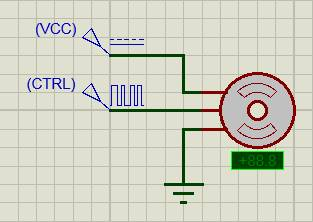
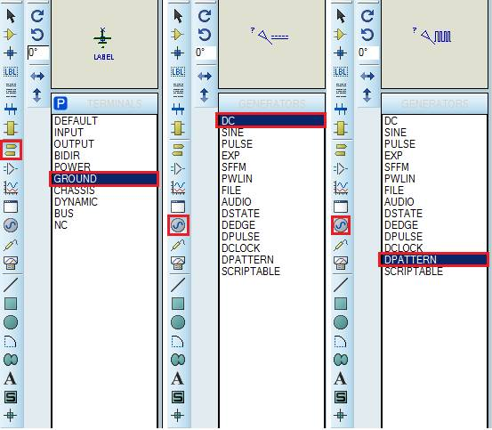
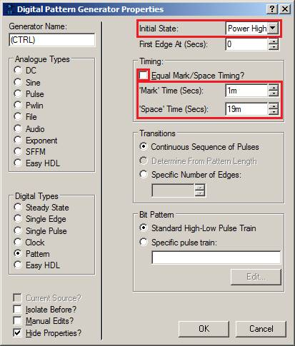

ПРОГРАМУВАННЯ ОДНОКРИСТАЛЬНИХ МІКРОПРОЦЕСОРНИХ КОНТРОЛЕРІВ, Євген Проскурка 

[Лаб2. Принцип роботи та управління семисегментними індикаторами](lab2.md)  <-- [Зміст](README.md) -->[Лаб4. Робота з входами та виходами мікроконтролера сімейства megaAVR](lab4.md)

# ЛР Принцип роботи та управління серводвигуном 

**Мета роботи:** Ознайомитися з принципом роботи та управління серводвигуном.

## 1. Завдання на виконання роботи

1.1. Скласти схему для ознайомлення з принципом управління серводвигуном в програмному середовищі Proteus (рис. 3.1). При складані схеми використати наступні компоненти представлені в таблиці 3.1.

Рис. 3.1. Схема в програмному середовищі Proteus.

*Таблиця 3.1. Список елементів.*

| Найменування   | Кількість | Опис        |
| -------------- | --------- | ----------- |
| MOTOR-PWMSERVO | 1         | серводвигун |

1.2.     Протестувати роботу серводвигуна в програмному середовищі Proteus, змінюючи настройки генератора імпульсів забезпечити поворот серводвигуна на певний кут, згідно варіанту в таблиці 3.2. 

1.3.     Настройки генератора імпульсів та отримані результати повороту серводвигуна на певний кут згідно варіанту, у вигляді зображень, навести в звіті лабораторної роботи.                                

## 2. Теоретичні відомості

### 2.1. Загальні відомості про серводвигун

**Серводвигун** – це двигун з управлінням через від’ємний зворотній зв’язок, що дозволяє точно керувати параметрами руху. Серводвигун є будь-який тип механічного двигуна, що має в складі датчик (положення, швидкості, зусилля) і блок управління двигуном, що автоматично отримує значення положення з датчику і повертає двигун відповідно до заданого положення, що задане зовнішнім сигналом. На рис. 3.2 представлено зовнішній вигляд серводвигуна. На рис. 3.3 представлено будову серводвигуна та його складові частини.

Рис. 3.2. Зовнішній вигляд серводвигуна.

Рис. 3.3. Будова серводвигуна та його складові частини.

Серводвигун має 3 проводи підключення:

- земля (коричневий/чорний);
- живлення +5 вольт (червоний); 
- керуючий сигнал (помаранчевий/жовтий/білий).

Керуючий сигнал можна подавати безпосередньо з піна мікроконтролера, а ось силове живлення (особливо якщо задіяно більше одного серводвигуна) потрібно подавати від зовнішнього джерела живлення.

Положення вихідного валу серводвигуна визначається довжиною імпульсу. Серводвигун повинен отримувати імпульси кожні 20 мс (мілісекунд). Якщо імпульс триває 1 мс то кут повороту серводвигуна буде дорівнює 0°. Якщо 1.5 мс то кут повороту серводвигуна буде дорівнює 90°, а якщо 2 мс то кут повороту серводвигуна буде дорівнює 180°. На рис. 3.4 представлена часова діаграма роботи серводвигуна.

Рис. 3.4. Часова діаграма роботи серводвигуна.

## **3.**  Порядок виконання роботи

3.1. Запустити програмне середовище Proteus. Побудувати схему за рис. 3.1, при цьому використати елементи з таблиці 3.1.

3.2. Вибір компонентів GROUND, DC на схемі (VCC) та DPATTERN на схемі (CTRL) здійснюється на панелі компонентів:

3.3. В властивостях компоненту VCC задати параметру Voltage (Volts) значення 5:

3.4. В властивостях компоненту MOTOR-PWMSERVO:

- задати параметру Minimum Angle значення 0; 
- задати параметру Maximum Angle значення +180:

 

3.5. В властивостях компоненту CTRL:

- параметру Initial State вибрати значення Power High; 
- зняти галочку з пункту Equal Mark/Space Timing?; 
- задати параметру ‘Mark’ Time Secs значення 1m;
- задати параметру ‘Space’ Time Secs значення 19m:

 3.6. Для забезпечення повороту серводвигуна на певний кут, згідно варіанту в таблиці 3.2, визначити та задати: 

- значення параметру ‘Mark’ Time Secs змінюючи його в діапазоні від 1m до 2m з кроком та 0.1m; 
- значення параметру ‘Space’ Time Secs змінюючи його в діапазоні від 19m до 18m з кроком та 0.1m.

**ЗВЕРНІТЬ УВАГУ:** сума параметрів ‘Mark’ Time Secs та ‘Space’ Time Secs повинна бути завжди рівною значенню 20m.

3.7. Отримані результати повороту серводвигуна на певний кут, згідно варіанту в таблиці 3.2, та значення параметрів ‘Mark’ Time Secs та ‘Space’ Time Secs, навести у вигляді зображень в звіт лабораторної роботи.

3.8. Оформити звіт про роботу.

*Таблиця 3.2. Варіанти завдання.*

| № ва-ріанту | Кут   повороту 1 | Кут   повороту 2 | Кут   повороту 3 |      | № ва-ріанту | Кут   повороту 1 | Кут   повороту 2 | Кут   повороту 3 |
| ----------- | ---------------- | ---------------- | ---------------- | ---- | ----------- | ---------------- | ---------------- | ---------------- |
| 1           | 72               | 36               | 108              |      | 16          | 126              | 18               | 36               |
| 2           | 144              | 90               | 126              |      | 17          | 162              | 108              | 54               |
| 3           | 54               | 18               | 36               |      | 18          | 126              | 54               | 90               |
| 4           | 126              | 90               | 72               |      | 19          | 18               | 126              | 36               |
| 5           | 18               | 162              | 54               |      | 20          | 90               | 72               | 54               |
| 6           | 72               | 144              | 108              |      | 21          | 180              | 90               | 18               |
| 7           | 126              | 90               | 18               |      | 22          | 72               | 36               | 90               |
| 8           | 162              | 126              | 108              |      | 23          | 108              | 126              | 36               |
| 9           | 18               | 108              | 54               |      | 24          | 90               | 108              | 144              |
| 10          | 180              | 36               | 90               |      | 25          | 54               | 36               | 72               |
| 11          | 36               | 162              | 72               |      | 26          | 162              | 144              | 18               |
| 12          | 144              | 180              | 108              |      | 27          | 108              | 126              | 54               |
| 13          | 18               | 126              | 72               |      | 28          | 72               | 90               | 126              |
| 14          | 54               | 90               | 36               |      | 29          | 36               | 180              | 126              |
| 15          | 180              | 144              | 162              |      | 30          | 90               | 54               | 108              |

## 4. Вміст звіту про роботу

4.1. Назва, мета та завдання на виконання роботи.

4.2. Зображення схеми зібраної в програмному середовище Proteus.

4.3. Зображення отриманих результатів згідно пункту 3.6.

## 5. Контрольні питання

5.1. Пояснити принцип роботи серводвигуна.

5.2. Пояснити призначення компонента DPATTERN.

5.3. Вказати діапазон кута повороту серводвигуна.

[Лаб2. Принцип роботи та управління семисегментними індикаторами](lab2.md)  <-- [Зміст](README.md) -->[Лаб4. Робота з входами та виходами мікроконтролера сімейства megaAVR](lab4.md)