ПРОГРАМУВАННЯ ОДНОКРИСТАЛЬНИХ МІКРОПРОЦЕСОРНИХ КОНТРОЛЕРІВ, Євген Проскурка 

[Лаб3. Принцип роботи та управління серводвигуном](lab3.md) <-- [Зміст](README.md) -->[Лаб5. Робота з перериваннями в мікроконтролерах сімейства megaAVR](lab5.md)

# ЛР4 Робота з входами та виходами мікроконтролера сімейства megaAVR

**Мета роботи:** Ознайомитися з принципом роботи з входами та виходами мікроконтролера (МК) сімейства megaAVR.

## 1. Завдання на виконання роботи

1.1. Скласти схему підключення до мікроконтролера AVR ATmega328P в програмному середовищі Proteus (рис. 4.1). При складані схеми використати наступні компоненти представлені в таблиці 4.1.


Рис. 4.1. Схема в програмному середовищі Proteus.

*Таблиця* *4.1. Список елементів.*

| Найменування | Кількість | Опис                                   |
| ------------ | --------- | -------------------------------------- |
| ATMEGA328p   | 1         | мікроконтролер AVR ATmega328p          |
| LED-RED      | 4         | D1-D4 –світлодіоди червоного кольору   |
| RES          | 4         | R1-R4 – резистори номіналами по 180 Ом |
| RES          | 3         | R5-R7 –резистори номіналами по 10 кОм  |
| BUTTON       | 3         | B1-B3 – кнопки                         |

1.2.Написати програму в середовищі AVR Studio для функціонування схеми за наступним алгоритмом.

**Алгоритм:** 

- при натисканні на кнопку “B1” загоряється світлодіод D1 на 1 секунду;
- при натисканні на кнопку “B2” загоряється світлодіод D2 на 1 секунду;
- при натисканні на кнопку “B3” загоряється світлодіод D3 на 1 секунду;
- коли жодна кнопка не натиснута світється світлодіоди D1-D4. 

1.3.Протестувати написану програму в середовищі AVR Studio на схемі складеної в програмному середовищі Proteus. 

## 2. Теоретичні відомості

### 2.1. Робота в програмному середовищі AVR Studio

Запускаємо AVR Studio: 

Пуск->Программы->Atmel AVR Tools->AVR Studio 4.

Запускається програма та відкривається вікно “Welcome to AVR Studio 4” (рис. 4.2).

Якщо вікно не запустилося, тоді Project->Project Wizard запустити в меню програми.

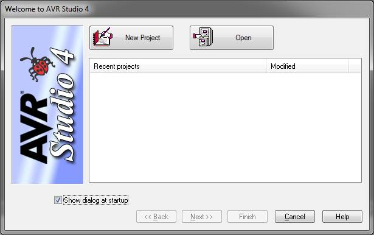

Рис. 4.2. Вікно “Welcome to AVR Studio 4”.

Створюємо новий проєкт - натискаємо кнопку “New Project”. Відкривається наступне вікно (рис. 4.3).

Вибираємо AVR GCC в списку Project type, задаємо ім’я проєкту в рядку Project name та вибираємо місце збереження проєкту в Location. Натискаємо кнопку “Next >>”. Запускається вікно де необхідно вибрати тип симулятора Debug platform та тип мікроконтролера Device (рис. 4.4). 

Вибираємо Debug platform: AVR Simulator та Device: ATmega328P.

На рис 4.5. зображено головне вікно програмного середовища AVR Studio та позначені вікна та панелі для роботи з програмним середовищем AVR Studio.

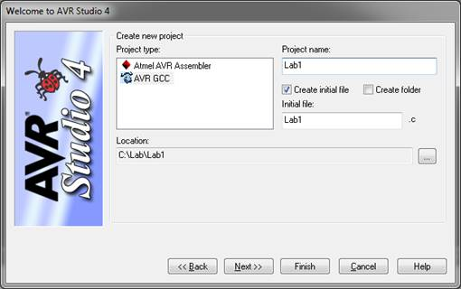

Рис. 4.3. Вікно для створення нового проєкту.

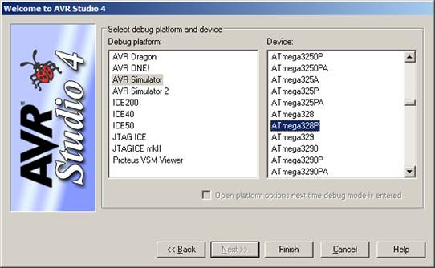

Рис. 4.4. Вікно вибору типу симулятора та типу мікроконтролера.

Нижче представлено структура програми, яка необхідна для програмування мікроконтролерів сімейства megaAVR:

```c
#define F_CPU 1000000UL // директива, що задає частоту роботи МК
#include <avr/io.h> // заголовний файл для роботи з входами та виходами
#include <util/delay.h> // заголовний файл для роботи з затримкою

int main()
{
// в цій частині програми іде настройка входів, виходів та периферії МК // та частина коду програми, яку не потрібно зациклювати.
while (1)
      {
           // частина коду програми, яку необхідно зациклювати.   
      }
}
```

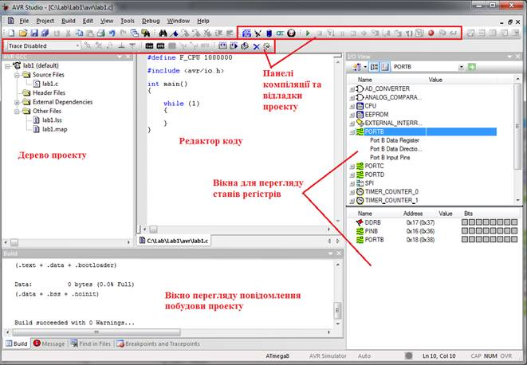

Рис. 4.5. Головне вікно програмного середовища AVR Studio.

Після написання програми необхідно побудувати проєкт для отримання hex-файлу. Для цього необхідно натиснути клавішу F7, або в меню програми: 

Build->Build, чи натиснути  на панелі меню зверху. Після побудови проєкту у вікні повідомлення повинен появитися напис: Build succeeded with 0 Warnings… що свідчить про успішність побудови проєкту.

В папці де розташованій проєкт існує папка default, в які знаходиться створений hex-файл. Цей файл необхідний для перевірки роботи написаної програми на зібраній схемі в середовищі Proteus.

### 2.2. Робота в програмному середовищі Proteus

Запускаємо Proteus: 

Пуск->Программы->Proteus 7 Professional->ISIS 7 Professional.

Відкривається головне вікно програми, вигляд якого представлено на рис. 4.6.

Елементи, з яких складається схема знаходяться в бібліотеці. Для її виклику необхідно натиснути на значок  на панелі компонентів. Далі зверху вікна списку елементів натиснути на кнопку P. Відкриється вікно бібліотеки (рис. 4.7).

​     Для вибору компоненту можна використовувати пошук, для цього треба написати назву елемента в рядку “Ключевое слово” або вибирати з списку “Категория” н “Подкатегория”. Вибравши елемент натискаємо кнопку ОК і розміщаємо його на полі схеми.

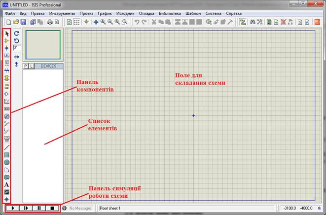

Рис. 4.6. Головне вікно програмного середовища Proteus.

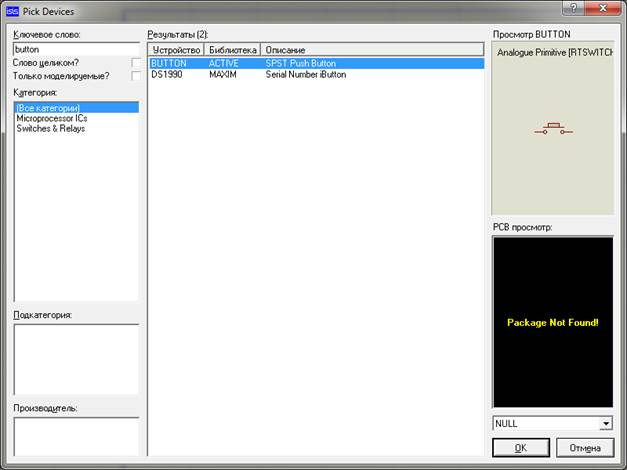

Рис. 4.7. Вікно бібліотеки компонентів.

Для розміщення елементу  натискаємо на панелі компонентів значок 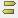. В списку елементів вибираємо GROUND, переміщаємо курсор на поле схеми і натискаємо ліву кнопку миші. Курсор зміниться на значок 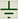 і вибираємо місце куди його поставити.

Для розміщення елементу жиллення натискаємо на панелі елементів значок . В списку елементів вибираємо DC, переміщаємо курсор на поле схеми і натискаємо ліву кнопку миші. Курсор зміниться на значок  і вибираємо місце куди його поставити. Двічі натиснувши на елемент відкривається вікно настройки (рис. 4.8). Тут можна задати тип сигналу, ім’я генератору та його напругу. 

Коли вставки на поле мікроконтролера сімейства megaAVR натиснувши двічі лівою клавішею мишки на його зображення відкривається вікно настройки МК (рис. 4.9). В параметрі CKSEL Fuses зі списку вибрати значення (Default).

За допомогою значка  біля рядка Program File вказати шлях до створеного hex-файлу.

Симуляція роботи схеми відбувається за допомогою вкладки: .

 

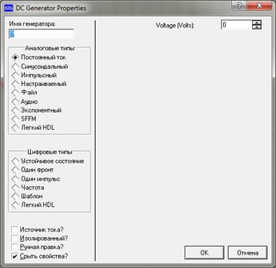

Рис. 4.8. Настройки елемента живлення.

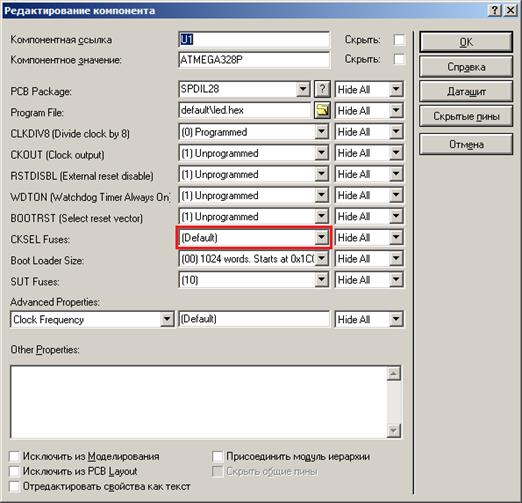

Рис. 4.9. Вікно настройки МК.

### 2.3. Теоретичні відомості про підключення світлодіодів

Розрізняють два види підключення світлодіодів: з загальним катодом (рис. 4.10а) та з загальним анодом (рис. 4.10б). При підключенні світлодіодів до МК використовують резистори, щоб обмежити струм, який протікатиме через світлодіоди. Щоб загорівся світлодіод необхідно біти портів виставити в логічну 1 (загальний катод), чи в логічний 0 (загальний анод).

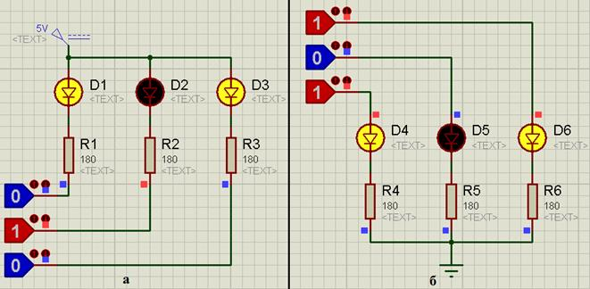

Рис. 4.10. Види підключення світлодіодів.

### 2.4. Теоретичні відомості про підтягуючі резистори та роботу з входами та виходами

При підключенні до контролера кнопок необхідно забезпечити наявність потенціалу логічної 1 чи 0 між кнопкою та ножкою МК. Це забезпечується використанням підтягуючих резисторів до землі (pull-down resistor) (рис. 4.11а) чи до живлення (pull-up resistor) (рис. 4.11б). При відсутності таких резисторів на ножці МК може бути не визначений стан (рис. 4.11в).

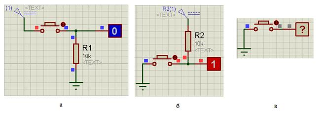

Рис. 4.11. Використання підтягуючих резисторів.

Для роботи з портами мікроконтролерів сімейства megaAVR призначені 3 регіста: DDRx, PORTx, PINx ­­– де х позначає літеру порту, порти МК позначаються через великі латинські літери, наприклад: A, B, C, D та ін.

В програмному забезпеченні Proteus 7 Professional піни портів позначаються, як Pxy, де x – літера порту, y – номер піну, зазвичай від 0 до 7. Наприклад: PB0 –  0-ий пін порту B.

​     Для прикладу розглянемо роботу з портом В. 8-ми бітний регістр DDRB відповідає за роботу кожного з 8-ми пінів порту. Якщо кожному біту регістру DDRB призначити значення 0, тоді піни порту В будуть працювати, як входи, тобто приймати інформацію. Якщо кожному біту регістру DDRB призначити значення 1, тоді піни порту В будуть працювати, як виходи, тобто передавати інформацію. Можливо настроїти частину пінів порту B, як входи, а іншу частину пінів, як виходи.

Регістр PINВ зчитує стан пінів порту В, якщо вони настроєні як вхідні піни. Біти даного регістру позначаються від PINB0 до PINB7. 

Регістр PORTВ записує значення в піни, якщо вони настроєні як вихідні піни. Біти даного регістру позначаються від PORTВ0 до PORTВ7.

Якщо піни порту В працюють, як входи то в регістрі PORTB необхідно встановити в ці ж піни, що призначені для входу, значення 1. 

Приклади роботи з портами:

1) Настройка порту В, як входу та перевірка або піна PINB1 порту В:

```c
PORTB = 0b11111111;
DDRB = 0b00000000;
//перевірка натиснення кнопки, що підключена до піну PB1 порту В
if (PINB == 0b11111101) {
     // виконати певні дії
}
```

2) Настройка порту В, як виходу та встановлення пінів порту B в 1:

```c
DDRB = 0b11111111;
PORTB = 0b11111111;
```

В МК ATMEGA328P порт C 7-ми бітний, тому біти регістру PINC позначаються від PINC0 до PINC6, а біти регістру PORTC позначаються від PORTC0 до PORTC6. Задання чи перевірка регістрів PORTC та PINC здійснюється 7-ми бітними числами, наприклад: 0b1111111 чи 0b0000000. 

## 3. Порядок виконання роботи  

3.1. Запустити програмне середовище AVR Studio. 

3.2. Написати програму за **Алгоритмом**. Нижче представлена частина програми, яку необхідно доповнити.

```c
#define F_CPU 1000000UL
#include <avr/io.h>
#include <util/delay.h>
int main(void) {
      DDRB = 0b11111111;
      DDRC = 0b0000000;
      PORTB = 0b11111111;
      PORTC = 0b1111111;
    while(1) {
        // перевірка натиснення кнопки B1 
        // та включення світлодіоду D1
        if (PINC == 0b1111101) {
            PORTB = 0b00011100;
            _delay_ms(1000); //функція затримки на 1 секунду
        }
        // написати фрагмент програми для перевірки натиснення 
         // кнопок В2 та В3 включення світлодіодів D2 та D3
         if () {

         }
         if () {

         }
        // включення світлодіодів D1-D4
        PORTB = 0b11000011;
   }
}
```

*Таблиця 4.2. Варіанти завдання.*

| Варіант | Кнопки | D1   | D2   | D3   | D4   |
| ------- | ------ | ---- | ---- | ---- | ---- |
| 1       | B1     | +    |      | +    |      |
| 1       | B2     |      | +    |      | +    |
| 1       | B3     | +    |      | +    | +    |
| 2       | B1     | +    | +    |      |      |
| 2       | B2     |      | +    | +    |      |
| 2       | B3     | +    |      |      | +    |
| 3       | B1     |      | +    | +    |      |
| 3       | B2     | +    |      |      | +    |
| 3       | B3     |      | +    | +    | +    |
| 4       | B1     | +    | +    |      | +    |
| 4       | B2     |      | +    | +    |      |
| 4       | B3     | +    |      | +    | +    |
| 5       | B1     | +    | +    |      | +    |
| 5       | B2     |      | +    | +    |      |
| 5       | B3     | +    |      |      | +    |
| 6       | B1     | +    |      |      | +    |
| 6       | B2     |      | +    | +    |      |
| 6       | B3     | +    |      | +    | +    |
| 7       | B1     | +    |      |      | +    |
| 7       | B2     | +    | +    |      | +    |
| 7       | B3     | +    |      | +    | +    |
| 8       | B1     | +    |      | +    |      |
| 8       | B2     | +    | +    |      | +    |
| 8       | B3     | +    |      | +    | +    |
| 9       | B1     | +    |      | +    |      |
| 9       | B2     |      | +    |      | +    |
| 9       | B3     | +    |      | +    |      |
| 10      | B1     |      | +    | +    |      |
| 10      | B2     | +    |      | +    | +    |
| 10      | B3     |      | +    |      | +    |
| 11      | B1     |      | +    | +    | +    |
| 11      | B2     | +    | +    |      |      |
| 11      | B3     |      | +    | +    | +    |
| 12      | B1     | +    |      | +    | +    |
| 12      | B2     | +    |      | +    |      |
| 12      | B3     |      | +    | +    |      |
| 13      | B1     |      | +    |      | +    |
| 13      | B2     | +    |      | +    |      |
| 13      | B3     |      | +    |      | +    |
| 14      | B1     | +    |      | +    |      |
| 14      | B2     | +    |      | +    | +    |
| 14      | B3     |      | +    | +    |      |
| 15      | B1     |      | +    | +    |      |
| 15      | B2     | +    |      | +    | +    |
| 15      | B3     | +    | +    |      | +    |
| 16      | B1     | +    |      |      | +    |
| 16      | B2     |      | +    | +    |      |
| 16      | B3     | +    | +    |      | +    |

*Продовження таблиці* *4.2.*

| Варіант | Кнопки | D1   | D2   | D3   | D4   |
| ------- | ------ | ---- | ---- | ---- | ---- |
| 17      | B1     | +    |      |      | +    |
| 17      | B2     |      | +    | +    |      |
| 17      | B3     | +    |      | +    |      |
| 18      | B1     |      | +    |      | +    |
| 18      | B2     | +    |      | +    |      |
| 18      | B3     | +    | +    |      | +    |
| 19      | B1     | +    |      | +    |      |
| 19      | B2     |      | +    |      | +    |
| 19      | B3     | +    |      | +    | +    |
| 20      | B1     |      | +    |      | +    |
| 20      | B2     | +    |      | +    |      |
| 20      | B3     |      | +    |      | +    |
| 21      | B1     | +    |      |      | +    |
| 21      | B2     |      | +    | +    |      |
| 21      | B3     |      | +    |      | +    |
| 22      | B1     | +    | +    |      | +    |
| 22      | B2     |      | +    | +    |      |
| 22      | B3     | +    |      | +    | +    |
| 23      | B1     | +    |      |      | +    |
| 23      | B2     | +    |      | +    |      |
| 23      | B3     | +    |      |      | +    |
| 24      | B1     | +    |      | +    |      |
| 24      | B2     | +    | +    |      | +    |
| 24      | B3     | +    | +    |      | +    |
| 25      | B1     | +    |      |      | +    |
| 25      | B2     |      | +    |      | +    |
| 25      | B3     | +    | +    |      | +    |
| 26      | B1     | +    | +    |      | +    |
| 26      | B2     | +    |      | +    |      |
| 26      | B3     |      | +    | +    | +    |
| 27      | B1     | +    |      | +    | +    |
| 27      | B2     | +    |      | +    |      |
| 27      | B3     |      | +    | +    | +    |
| 28      | B1     | +    | +    |      | +    |
| 28      | B2     | +    |      | +    |      |
| 28      | B3     | +    | +    |      | +    |
| 29      | B1     |      | +    | +    | +    |
| 29      | B2     | +    | +    |      |      |
| 29      | B3     | +    | +    |      | +    |
| 30      | B1     | +    | +    |      | +    |
| 30      | B2     |      | +    | +    |      |
| 30      | B3     | +    |      | +    | +    |

3.3.     Побудувати проєкт, отримати hex-файл.

3.4.     Запустити програмне середовище Proteus. Побудувати схему за рис. 4.1.

3.5.     Вказати в елементі ATMEGA328P шлях до hex-файлу.

3.6.     Промоделювати роботу схеми. Впевнитися, що вона працює за **Алгоритмом**.

3.7.     Оформити звіт про роботу.

## 4.   Вміст звіту про роботу.

4.1.     Назва, мета та завдання на виконання роботи.

4.2.     Зображення схеми зібраної в програмному середовище Proteus.

4.3.     Лістінг програми написаної в програмному середовищі AVR Studio.

## 5.   Контрольні питання.

5.1.     Пояснити принцип роботи з портами МК.

5.2.     Пояснити типи підключення світлодіодів.

5.3.     Пояснити призначення підтягуючих резисторів.

[Лаб3. Принцип роботи та управління серводвигуном](lab3.md) <-- [Зміст](README.md) -->[Лаб5. Робота з перериваннями в мікроконтролерах сімейства megaAVR](lab5.md)