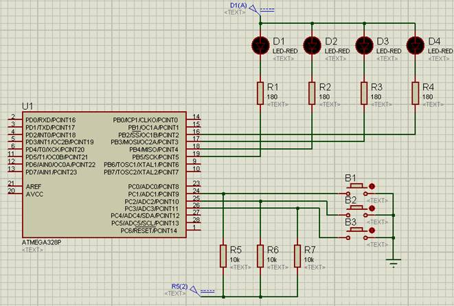
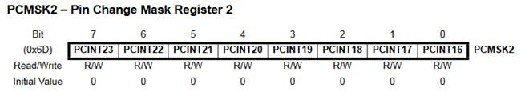
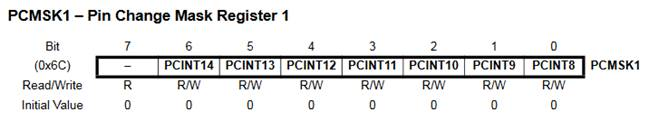
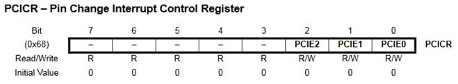

ПРОГРАМУВАННЯ ОДНОКРИСТАЛЬНИХ МІКРОПРОЦЕСОРНИХ КОНТРОЛЕРІВ, Євген Проскурка 

[Лаб4. Робота з входами та виходами мікроконтролера сімейства megaAVR](lab4.md) <-- [Зміст](README.md) --> [Лаб6. Робота таймерів/лічильників в мікроконтролерах сімейства megaAVR](lab6.md)

# ЛР5 Робота з перериваннями в мікроконтролерах сімейства megaAVR

**Мета роботи:** Ознайомитися з принципом роботи переривань в мікроконтролерах (МК) сімейства megaAVR.

## 1. Завдання на виконання роботи

1.1.     Скласти схему підключення до мікроконтролера AVR ATmega328P в програмному середовищі Proteus (рис. 5.1). При складані схеми використати наступні компоненти представлені в таблиці 5.1.



Рис. 5.1. Схема в програмному середовищі Proteus.

*Таблиця* *5.1. Список елементів.*

| Найменування | Кількість | Опис                                   |
| ------------ | --------- | -------------------------------------- |
| ATMEGA328p   | 1         | мікроконтролер AVR ATmega328p          |
| LED-RED      | 4         | D1-D4 –світлодіоди червоного кольору   |
| RES          | 4         | R1-R4 – резистори номіналами по 180 Ом |
| RES          | 3         | R5-R7 –резистори номіналами по 10 кОм  |
| BUTTON       | 3         | B1-B3 – кнопки                         |

1.2.     Написати програму в середовищі AVR Studio для функціонування схеми за завданням відповідно варіанту, що наведено в таблиці 5.2.

1.3.     Протестувати написану програму в середовищі AVR Studio на схемі складеної в програмному середовищі Proteus.

## **2.** Теоретичні відомості

### 2.1. Робота з перериваннями в мікроконтролерах сімейства megaAVR

**Переривання** (interrupts) – це виклики певних функцій, які генеруються, головним чином, апаратною частиною мікроконтролера. В результаті виникнення переривання виконання основної програми призупиняється і відбувається перехід до відповідної підпрограми обробки переривання.

В програмному середовищі AVR Studio підпрограми обробки переривань мають такий вигляд: 

ISR(вектор_переривання)

```c
{
//Програмний код обробки переривання
}
```

де вектор_переривання – це фіксоване умовне позначення типу переривання.

Майже на кожному піні Atmega328P є переривання, які називаються PCINT (Pin Change Interrupts). Ці переривання генеруються, коли змінюється стан піна. Всі такі переривання діляться на три групи, оскільки їх багато, а регістри для їх управління восьмибітні. 

1) Переривання групи PCIE0 генерується при зміні стану пінів PCINT0–PCINT7 (порт B: піни PB0–PB7). Вектор переривання в програмному середовищі AVR Studio позначається – PCINT0_vect.

2) Переривання групи PCIE1 генерується при зміні стану пінів PCINT8–PCINT14 (порт C: піни PC0–PC6). Вектор переривання в програмному середовищі AVR Studio позначається – PCINT1_vect.

3) Переривання групи PCIE2 генерується при зміні стану пінів PCINT16– PCINT23 (порт D: піни PD0–PD7). Вектор переривання в програмному середовищі AVR Studio позначається – PCINT2_vect.

Переривання генеруються за умови що дозволено переривання на цьому піні, коли змінюється стан піна. Для того, щоб дозволити переривання на піні, потрібно записати одиницю в відповідний біт регістра PCMSK0, PCMSK1 або PCMSK2, в залежності від того, до якої групи належить пін.

Регістр PCMSK2:



Регістр PCMSK1:



Регістр PCMSK0:


Для того, щоб дозволити переривання в групі, потрібно записати одиницю в відповідний біт регістра PCICR:



Для того, щоб дозволити переривання в МК необхідно установити біт глобального дозволу переривань за допомогою функції `sei()`.

Для роботи з перериваннями в програмному середовищі AVR Studio необхідно підключити заголовний файл: `#include <avr/interrupt.h>`

## 3. Порядок виконання роботи

3.1.     Запустити програмне середовище AVR Studio. 

3.2.     Написати програму за завданням відповідного варіанту за табл. 5.2 представленою нижче. Нижче представлена частина програми, яку необхідно доповнити.

```c
#include <avr/io.h>
#include <avr/interrupt.h>
ISR(PCINT1_vect) {
    // Умова перевірки натискання кнопки B1  
    if (!(PINC & (1 << PC1))) {
    // Засвітити світлодіоди D1-D4 згідно завдання    
    }

    // Дописати умову перевірки натискання кнопки B2  
    if () {
    // Засвітити світлодіоди D1-D4 згідно завдання    
    }

    // Дописати умову перевірки натискання кнопки B3  
    if () {
    // Засвітити світлодіоди D1-D4 згідно завдання    
    }
}

int main(void) {
    // Встановити порт В на вихід, а порт С на вхід
    sei();
    // Встановити значення регістрів PCICR та PCMSK1 для дозволу переривань 
    while(1);
}
```

*Таблиця 5.2. Варіанти завдання.*

| Варіант | Кнопки | D1   | D2   | D3   | D4   |
| ------- | ------ | ---- | ---- | ---- | ---- |
|         | B1     | +    |      | +    |      |
| 1       | B2     |      | +    |      | +    |
|         | B3     | +    |      | +    | +    |
|         | B1     | +    | +    |      |      |
| 2       | B2     |      | +    | +    |      |
|         | B3     | +    |      |      | +    |
|         | B1     |      | +    | +    |      |
| 3       | B2     | +    |      |      | +    |
|         | B3     |      | +    | +    | +    |
|         | B1     | +    | +    |      | +    |
| 4       | B2     |      | +    | +    |      |
|         | B3     | +    |      | +    | +    |
|         | B1     | +    | +    |      | +    |
| 5       | B2     |      | +    | +    |      |
|         | B3     | +    |      |      | +    |
|         | B1     | +    |      |      | +    |
| 6       | B2     |      | +    | +    |      |
|         | B3     | +    |      | +    | +    |
|         | B1     | +    |      |      | +    |
| 7       | B2     | +    | +    |      | +    |
|         | B3     | +    |      | +    | +    |
|         | B1     | +    |      | +    |      |
| 8       | B2     | +    | +    |      | +    |
|         | B3     | +    |      | +    | +    |
|         | B1     | +    |      | +    |      |
| 9       | B2     |      | +    |      | +    |
|         | B3     | +    |      | +    |      |
|         | B1     |      | +    | +    |      |
| 10      | B2     | +    |      | +    | +    |
|         | B3     |      | +    |      | +    |
|         | B1     |      | +    | +    | +    |
| 11      | B2     | +    | +    |      |      |
|         | B3     |      | +    | +    | +    |
|         | B1     | +    |      | +    | +    |
| 12      | B2     | +    |      | +    |      |
|         | B3     |      | +    | +    |      |
|         | B1     |      | +    |      | +    |
| 13      | B2     | +    |      | +    |      |
|         | B3     |      | +    |      | +    |
|         | B1     | +    |      | +    |      |
| 14      | B2     | +    |      | +    | +    |
|         | B3     |      | +    | +    |      |
|         | B1     |      | +    | +    |      |
| 15      | B2     | +    |      | +    | +    |
|         | B3     | +    | +    |      | +    |
|         | B1     | +    |      |      | +    |
| 16      | B2     |      | +    | +    |      |
|         | B3     | +    | +    |      | +    |

*Продовження таблиці 5.2.*

| Варіант | Кнопки | D1   | D2   | D3   | D4   |
| ------- | ------ | ---- | ---- | ---- | ---- |
|         | B1     | +    |      |      | +    |
| 17      | B2     |      | +    | +    |      |
|         | B3     | +    |      | +    |      |
|         | B1     |      | +    |      | +    |
| 18      | B2     | +    |      | +    |      |
|         | B3     | +    | +    |      | +    |
|         | B1     | +    |      | +    |      |
| 19      | B2     |      | +    |      | +    |
|         | B3     | +    |      | +    | +    |
|         | B1     |      | +    |      | +    |
| 20      | B2     | +    |      | +    |      |
|         | B3     |      | +    |      | +    |
|         | B1     | +    |      |      | +    |
| 21      | B2     |      | +    | +    |      |
|         | B3     |      | +    |      | +    |
|         | B1     | +    | +    |      | +    |
| 22      | B2     |      | +    | +    |      |
|         | B3     | +    |      | +    | +    |
|         | B1     | +    |      |      | +    |
| 23      | B2     | +    |      | +    |      |
|         | B3     | +    |      |      | +    |
|         | B1     | +    |      | +    |      |
| 24      | B2     | +    | +    |      | +    |
|         | B3     | +    | +    |      | +    |
|         | B1     | +    |      |      | +    |
| 25      | B2     |      | +    |      | +    |
|         | B3     | +    | +    |      | +    |
|         | B1     | +    | +    |      | +    |
| 26      | B2     | +    |      | +    |      |
|         | B3     |      | +    | +    | +    |
|         | B1     | +    |      | +    | +    |
| 27      | B2     | +    |      | +    |      |
|         | B3     |      | +    | +    | +    |
|         | B1     | +    | +    |      | +    |
| 28      | B2     | +    |      | +    |      |
|         | B3     | +    | +    |      | +    |
|         | B1     |      | +    | +    | +    |
| 29      | B2     | +    | +    |      |      |
|         | B3     | +    | +    |      | +    |
|         | B1     | +    | +    |      | +    |
| 30      | B2     |      | +    | +    |      |
|         | B3     | +    |      | +    | +    |

ПРИМІТКА: В таблиці в кожному варіанті знаком + вказано, які світлодіоди D1-D4 необхідно при натисканні відповідно кнопок B1-B4.

3.3.     Побудувати проєкт, отримати hex-файл.

3.4.     Запустити програмне середовище Proteus. Побудувати схему за рис. 5.1.

3.5.     Вказати в елементі ATMEGA328P шлях до hex-файлу.

3.6.     Промоделювати роботу схеми. Впевнитися, що вона працює відповідно завданню варіанта.

3.7.     Оформити звіт про роботу.

## 4.   Вміст звіту про роботу.

4.1.     Назва, мета та завдання на виконання роботи.

4.2.     Зображення схеми зібраної в програмному середовище Proteus та результати виконання за варіантом завдання.

4.3.     Лістінг програми написаної в програмному середовищі AVR Studio.

## 5.   Контрольні питання. 

5.1.     Пояснити принцип роботи переривань в МК.

5.2.     Вказати функцію, що дозволяє глобальні переривання.

5.3.     Пояснити призначення регістрів PCICR та PCMSK0-PCMSK2.

5.4.     Пояснити типи підключення світлодіодів.

5.5.     Пояснити призначення підтягуючих резисторів.

[Лаб4. Робота з входами та виходами мікроконтролера сімейства megaAVR](lab4.md) <-- [Зміст](README.md) --> [Лаб6. Робота таймерів/лічильників в мікроконтролерах сімейства megaAVR](lab6.md)