ПРОГРАМУВАННЯ ОДНОКРИСТАЛЬНИХ МІКРОПРОЦЕСОРНИХ КОНТРОЛЕРІВ, Євген Проскурка 

[Лаб5. Робота з перериваннями в мікроконтролерах сімейства megaAVR](lab5.md) <-- [Зміст](README.md) -->[Лаб7. Інтерфейс SPI та динамічна індикація](lab7.md)

# ЛР6 Робота таймерів/лічильників в мікроконтролерах сімейства megaAVR

**Мета роботи:** Ознайомитися з принципом роботи таймерів/лічильників в мікроконтролерах сімейства megaAVR при управлінні серводвигуном.

## **1.** Завдання на виконання роботи

1.1.     Скласти схему підключення серводвигуна до мікроконтролера AVR ATmega8 в програмному середовищі Proteus (рис. 6.1). При складані схеми використати наступні компоненти представлені в таблиці 6.1.

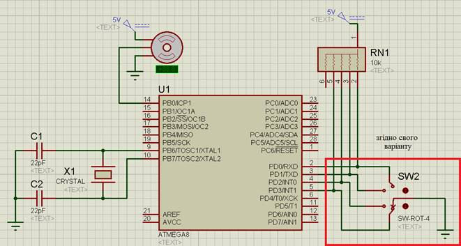

Рис. 6.1. Схема в програмному середовищі Proteus.

*Таблиця 6.1. Список елементів.*

| Найменування   | Кількість | Опис                                |
| -------------- | --------- | ----------------------------------- |
| ATMEGA8        | 1         | мікроконтролер AVR ATmega8          |
| MOTOR-PWMSERVO | 1         | серводвигун                         |
| SW-ROT-4       | 1         | перемикач на 4 положення            |
| RES6SIPB       | 1         | блок резисторів номіналами 10 кОм   |
| CAP            | 2         | конденсатори, номіналами 22 пФ      |
| CRYSTAL        | 1         | кварцовий резонатор номіналом 8 MHz |

1.2.     Записати представлену програму в середовищі AVR Studio для функціонування схеми. Алгоритм функціонування схеми наступний: змінюючи положення ручки перемикача серводвигун обертається на певний кут згідно варіанту таблиці 6.4.

1.3.     Протестувати представленої програму в середовищі AVR Studio на схемі в програмному середовищі Proteus. 

1.4.     Пояснити принцип роботи представленої програми при захисті лабораторної роботи.

## 2.Теоретичні відомості

### 2.1.Загальні відомості про серводвигун.

**Серводвигун** – це двигун з управлінням через негативний зворотній зв’язок, що дозволяє точно керувати параметрами руху. Серводвигун є будь-який тип механічного двигуна, що має в складі датчик (положення, швидкості, зусилля і т.п.) і блок управління двигуном, що автоматично отримує значення положення з датчику і повертає двигун відповідно до заданого положення, що задане зовнішнім сигналом. На рис. 6.2 представлено зовнішній вигляд серводвигуна. На рис. 6.3 представлено будову серводвигуна та його складові частини.


Рис. 6.2. Зовнішній вигляд серводвигуна.

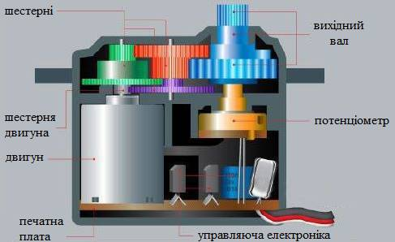

Рис. 6.3. Будова серводвигуна та його складові частини.

Серводвигун має 3 проводи підключення:

- земля (коричневий / чорний);
- живлення +5 вольт (червоний); 
- керуючий сигнал (помаранчевий / жовтий / білий).

Керуючий сигнал можна подавати безпосередньо з ноги МК, а ось силове живлення (особливо якщо задіяно більше одного серводвигуна) потрібно подавати від зовнішнього джерела живлення.

Положення вихідного валу серводвигуна визначається довжиною імпульсу. Серводвигун повинен отримувати імпульси кожні 20 мілісекунд. Якщо імпульс триває 1 мілісекунду то кут повороту серводвигуна буде дорівнює 0°. Якщо 1.5 мілісекунди то кут повороту серводвигуна буде дорівнює 90°, а якщо 2 мілісекунди то кут повороту серводвигуна буде дорівнює 180°. На рис. 6.4 представлена часова діаграма роботи серводвигуна.

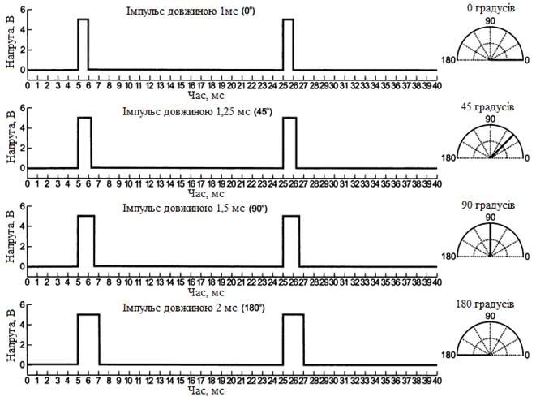

Рис. 6.4. Часова діаграма роботи серводвигуна.

### 2.2.Загальні відомості про роботу таймера/лічильника

Для роботи мікроконтролера з серводвигуном необхідно використовувати вбудований таймер/лічильник (далі в тексті таймер) ТС1 в мікроконтролері.

Таймер ТС1 шістнадцятирозрядний (216 = 65536) рахує імпульси від 0 до 65535 від внутрішнього джерела тактування та записує в регістр **TCNT1** (**TCNT1H** та **TCNT1L**). Частота імпульсів вибирається бітами **CS12-CS10** в регістрі **TCCR1B**. При переході від значення 65535 (FFFF) до 0 відбувається переривання по переповненню таймеру.

Також присутні регістри **OCR1A** (**OCR1AH** та **OCR1AL**) та **OCR1B** (**OCR1BH** та **OCR1BL**) в які записуються значення і при співпаданню з значенням регістру **TCNT1** відбувається переривання по співпаданню чи зміна стану на виводах мікроконтролера **OC1A** чи  **OC1B**. 

Таймер ТС1 може збільшувати значення регістру **TCNT1** коли імпульси приходять на вивід мікроконтролера **Т1**.

Також у мікроконтролера присутня ножка входу **ICP1** при поступанні на неї імпульсу відбувається переривання по захопленню.

Розглянемо настройку регістрів таймеру ТС1.

#### TCCR1A


Біти 7:6 - COM1A 1:0: контролюють поведінку виходу OC1A (табл. 6.2).
Біти 5:4 - COM1B 1:0: контролюють поведінку виходу OC1B (табл. 6.2).

*Таблиця 6.2*

| **COM1A1/**  **COM1B1** | **COM1A0/**  **COM1B0** | Опис поведінки виходу                    |
| ----------------------- | ----------------------- | ---------------------------------------- |
| 0                       | 0                       | Вимкнено                                 |
| 0                       | 1                       | Переключення стану виходу на протилежний |
| 1                       | 0                       | Переключення в “0”                       |
| 1                       | 1                       | Переключення в “1”                       |

 **Біти 3:2 – FOC1A, FOC1B:** слугують для примусового зміни стану виходів **OC1A** і **OC1B**.

**Біти 1:0 – WGM11, WGM10:** слугують для настройки ТС1 для роботи в якості широтно-імпульсного модулятора (ШІМ). У режимі ШІМ стан виходів **OC1A** і **OC1B** буде відрізнятися.

#### TCCR1B

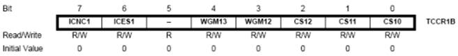

**Біт 7 – ICNC1:** придушення брязкоту контактів на вході **ICP1**. Якщо біт встановлено, то визначення події на вході **ICP1** відбувається із затримкою в 4 машинних циклу.

**Біт 6 - ICES1:** вибір фронту спрацьовування переривання по захопленню на вході ICP1. Якщо встановлено – на зростаючому фронті, якщо скинуто – на падаючому фронті.
 **Біт 5** – не використовується.

**Біти 4:3 – WGM1 3:2:** для настройки ШІМ.

**Біти 2:0 – CS12-CS10:** вибір частоти тактів таймеру ТС1 (табл. 6.3).

*Таблиця 6.3*

| CS12 | CS11 | CS10 | Опис                                           |
| ---- | ---- | ---- | ---------------------------------------------- |
| 0    | 0    | 0    | Таймер виключений                              |
| 0    | 0    | 1    | CLK                                            |
| 0    | 1    | 0    | CLK/8                                          |
| 0    | 1    | 1    | CLK/64                                         |
| 1    | 0    | 0    | CLK/256                                        |
| 1    | 0    | 1    | CLK/1024                                       |
| 1    | 1    | 0    | Зовнішнє джерело тактів на Т1. Задній фронт.   |
| 1    | 1    | 1    | Зовнішнє джерело тактів на Т1. Передній фронт. |

**TIMSK** – регістр маски переривання таймеру.

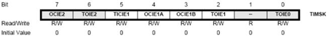

**Біт 7 – OCIE2:** переривання по співпаданню ТС2.

**Біт 6 – TOIE2:** переривання по переповненню ТС2

**Біт 5 – TICIE1:** переривання по захопленню ТС1.

**Біт 4 – OCIE1A:** переривання по співпаданню A ТС1.

**Біт 3 – OCIE1B:** переривання по співпаданню В ТС1.

**Біт 2 – TOIE1:** переривання по переповнення ТС1.

**Біт 1** – не використовується.

**Біт 0** **– TOIE0:** переривання по переповнення ТС0.

Якщо відповідний біт встановлений в "1" і біт **I** (7-й біт) регістра станів **SREG** встановлений в "1", тоді відповідне переривання буде спрацьовувати.

**TIFR** – регістр прапорців переривань таймерів.

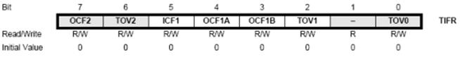

 

Прапорці відповідають перериванням в регістрі TIMSK. Встановлюються в "1" при виконанні умов відповідного переривання.

## 3. Порядок виконання роботи

3.1.     Запустити програмне середовище Proteus. Побудувати схему за рис. 4.1, при цьому використати елементи з таблиці 6.1 та підключення згідно свого варіанту вказане в таблиці *Варіанти завдання* нижче.

3.2.     В властивостях компоненту MOTOR-PWMSERVO задати наступні настройки, що вказані на рис. 6.5.


Рис. 6.5. Властивості компоненту MOTOR-PWMSERVO.

3.3.     Вказати в елементі ATMEGA8 шлях до hex-файлу та задати наступні настройки, що вказані на рис. 6.6.

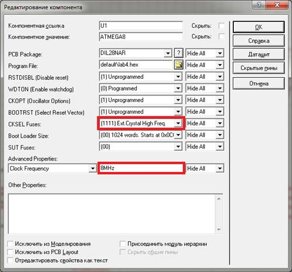

Рис. 6.6. Властивості компоненту ATMEGA8.

3.4.     Створити проєкт в AVR Studio 4. Налаштування проєкту виберемо такі як у попередній лабораторній роботі.

3.5.     Додати до файлу програму, яка необхідна для програмування заданого алгоритму:

```c
#include <avr/io.h>
#include <avr/interrupt.h>

ISR(TIMER1_OVF_vect) {
    TCNT1 = 45535;
    PORTB = 0x01;
}

ISR(TIMER1_COMPA_vect) {
	PORTB = 0x00;
}

int main(void) {
    DDRB = 0x01;
    PORTB = 0x00;
    DDRD = 0x00;
    PORTD = 0xFF;
    TCCR1A = 0x00;
    TCCR1B = (0 << CS12)| (1 << CS11) | (0 << CS10);
    TIMSK = (1 << OCIE1A)| (1 << TOIE1);
    sei();
    while(1) {
        if (PIND == …) {
             OCR1A = 45535+…;
        }

        if (PIND == …) {
             OCR1A = 45535+…;
        }

        if (PIND == …) {
             OCR1A = 45535+…;
        }

        if (PIND == …) {
             OCR1A = 45535+…;
        }
    }
}
```

В умовах if (PIND == …) необхідно порівнювати регістр PIND з натиснутою клавішею (задати число в двійковій системі числення), як це виконувалося в лабораторній роботі №4.

В регістрі OCR1A записується число, яке вказує на який кут повинен повернути серводвигун.

**Підказка:** Таймер ТС1 рахує від 0 до 65535 при частоті роботи МК 8 МГц і використання подільника частоти CLK/8 повний цикл таймера 65535 мкс (мікросекунд, 1 мілісекунда (мс) = 1000 мкс). Цикл роботи серводвигуна 20 мс. Для забезпечення циклу роботи серводвигуна роботу таймера починають з значення 45535 і пін PB0 виставляють в 1. В регістр OCR1A записують те значення після якого необхідно пін PB0 виставити в 0. Тобто до значення 45535 додати число в діапазоні від 1000 до 2000 (де 1000 – 0°, а 2000 – 180°).

*Таблиця 6.4. Варіанти завдання.*

| №   варіанту | № схеми | Кут повороту 1 | Кут повороту 2 | Кут повороту 3 | Кут повороту 4 |
| ------------ | ------- | -------------- | -------------- | -------------- | -------------- |
| 1            | 1       | 12             | 54             | 87             | 125            |
| 2            | 2       | 51             | 74             | 109            | 143            |
| 3            | 3       | 22             | 61             | 152            | 171            |
| 4            | 4       | 16             | 43             | 95             | 111            |
| 5            | 5       | 33             | 68             | 105            | 154            |
| 6            | 4       | 41             | 98             | 165            | 175            |
| 7            | 2       | 45             | 89             | 119            | 169            |
| 8            | 3       | 56             | 72             | 101            | 145            |
| 9            | 1       | 24             | 57             | 97             | 172            |
| 10           | 5       | 15             | 65             | 82             | 170            |
| 11           | 2       | 26             | 76             | 92             | 151            |
| 12           | 4       | 44             | 88             | 100            | 163            |
| 13           | 3       | 59             | 74             | 95             | 142            |
| 14           | 1       | 13             | 65             | 108            | 131            |
| 15           | 5       | 58             | 91             | 116            | 155            |
| 16           | 2       | 23             | 89             | 122            | 167            |
| 17           | 3       | 61             | 101            | 145            | 173            |
| 18           | 1       | 74             | 125            | 133            | 154            |
| 19           | 5       | 95             | 130            | 158            | 167            |
| 20           | 4       | 54             | 83             | 152            | 173            |
| 21           | 2       | 14             | 75             | 143            | 178            |
| 22           | 5       | 46             | 84             | 128            | 169            |
| 23           | 4       | 49             | 107            | 141            | 156            |
| 24           | 1       | 31             | 99             | 118            | 177            |
| 25           | 3       | 27             | 94             | 151            | 169            |
| 26           | 2       | 81             | 103            | 144            | 158            |
| 27           | 5       | 32             | 64             | 133            | 163            |
| 28           | 1       | 52             | 81             | 126            | 172            |
| 29           | 3       | 49             | 73             | 107            | 166            |
| 30           | 4       | 38             | 92             | 136            | 159            |

*Варіанти схем:*

*Схема 1*

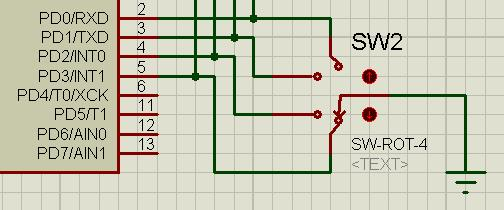

*Схема 2*

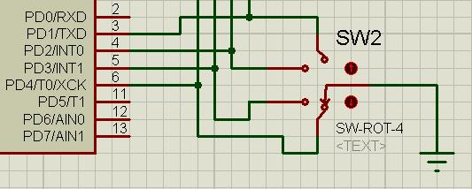

*Схема 3*

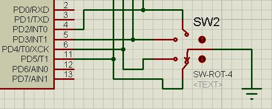 

*Схема 4*


 

*Схема 5*

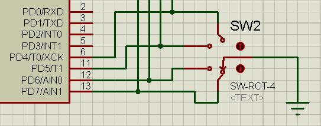

3.6.     Промоделювати роботу схеми. Впевнитися, що вона працює за заданим алгоритмом.

3.7.     Оформити звіт про роботу.

## 4. Вміст звіту про роботу.

4.1.     Назва, мета та завдання на виконання роботи.

4.2.     Зображення схеми зібраної в програмному середовище Proteus.

4.3.     Лістінг програми написаної в програмному середовищі AVR Studio.

## 5. Контрольні питання.

5.1.     Пояснити, принцип роботи серводвигуна.

5.2.     Пояснити принцип роботи таймера/лічильника ТС1.

5.3.     Перерахувати переривання, які підтримує таймер/лічильник ТС1.

5.4.     Вказати для чого призначені регістри **OC1A** та  **OC1B**.

5.5.     Пояснити розрядність таймера/лічильника ТС1.

5.6.     Вказати бітами якого регістру вибирається частота тактів від яких працює таймер/лічильник ТС1

[Лаб5. Робота з перериваннями в мікроконтролерах сімейства megaAVR](lab5.md) <-- [Зміст](README.md) -->[Лаб7. Інтерфейс SPI та динамічна індикація](lab7.md)