ПРОГРАМУВАННЯ ОДНОКРИСТАЛЬНИХ МІКРОПРОЦЕСОРНИХ КОНТРОЛЕРІВ, Євген Проскурка 

[Лаб6. Робота таймерів/лічильників в мікроконтролерах сімейства megaAVR](lab6.md) <-- [Зміст](README.md) --> [Лаб8. Робота з аналогово-цифровим перетворювачем мікроконтролерів сімейства megaAVR](lab8.md)

# ЛР7 Інтерфейс SPI та динамічна індикація

**Мета роботи:** ознайомитися з роботою інтерфейсу SPI та принципом роботи динамічної індикації.

## **1.** Завдання на виконання роботи

1.1.     Скласти схему наведену на рис. 7.1 в програмному середовищі Proteus. При складані схеми використати наступні компоненти представлені в таблиці 7.1.

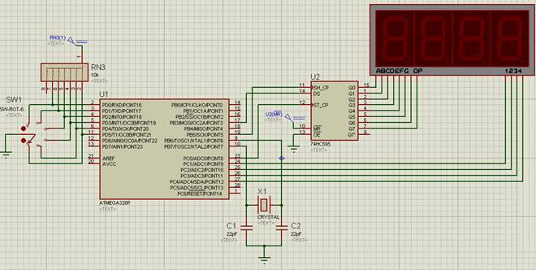

Рис. 7.1. Схема в програмному середовищі Proteus.

​           *Таблиця 7.1. Список елементів.*

| Найменування | Кількість | Опис                                                    |
| ------------ | --------- | ------------------------------------------------------- |
| RES8SIPB     | 1         | магазин резисторів,  номіналами по 10 кОм               |
| 74HC595      | 1         | здвиговий резистор                                      |
| SW-ROT6      | 1         | перемикач на 6 позицій                                  |
| 7SEG-MPX4-CC | 1         | семисегментний індикатор на  4 цифри,   загальний катод |
| ATMEGA328p   | 1         | мікроконтролер AVR ATmega328p                           |
| CAP          | 2         | конденсатори, номіналами 22 пФ                          |
| CRYSTAL      | 1         | кварцовий резонатор  номіналом 16 MHz                   |

1.2.     Доповнити написану програму в середовищі AVR Studio для функціонування схеми. Алгоритм функціонування схеми наступний: змінюючи положення перемикача виводити на семисегментний індикатор числа згідно варіанту таблиці 7.2.

1.3.     Протестувати написану програму в середовищі AVR Studio на схемі в програмному середовищі Proteus.

## **2.** Теоретичні відомості

### 2.1. Інтерфейс SPI

Інтерфейс **SPI** (**Serial Peripheral Bus**) – інтерфейс для обміну даними між мікросхемами. Розроблений компанією Motorola, але в даний час використовується в продукції багатьох виробників. Шина **SPI** організована як "ведучий-ведений" (“master”-“slave”). В якості ведучого найчастіше виступає мікроконтролер. Зовнішні пристрої підключені до ведучого є веденими (підлеглими). Якщо з'єднати два мікроконтролера по шині SPI, то вони можуть по черзі ставати ведучим або веденим. Головне, що в конкретний момент часу на шині SPI тільки один пристрій може бути ведучим. Розглянемо на прикладі AVR ATmega328p які ніжки в МК пов'язані з шиною SPI і що вони означають (рис. 7.2). 

Ніжка SS використовується для вибору ведучого/веденого; на ніжці SCK генерується тактовий сигнал; ніжка MOSI використовується для виводу даних; ніжка MISO використовується для прийому даних.

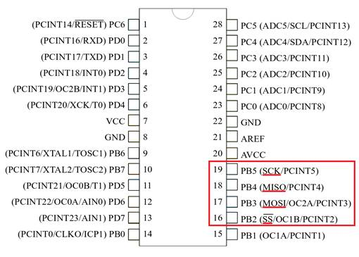

Рис. 7.2. Інтерфейс SPI в МК AVR ATmega328p.

При завантаженні значення в регістр даних SPI ведучого він відразу ж починає генерувати тактовий сигнал на ніжці SCK і побітно висувати дані на ніжку MOSI, яка з'єднана з входами ніжок MOSI ведених пристроїв. Ведений пристрій отримає дані, тільки якщо на ніжці веденого SS присутній низький рівень. Ми можемо підключити до шини SPI мікроконтролера кілька SPI пристроїв і використовуючи додаткові ніжки МК вибирати конкретний пристрій з яким ми хочемо в даний момент працювати. Ніжку SS ведучого можна конфігурувати як вихід і використовувати його як вихідний контакт. Якщо ж він налаштований як вхід, його необхідно підключити до шини живлення. Якщо на ніжці SS ведучого пристрою з'явиться низький рівень, то він перейде в режим веденого. На рис. 7.3 представлено приклад підключення пристроїв по шині SPI.

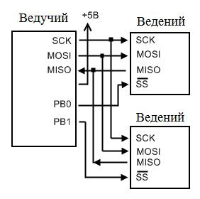

Рис. 7.3. Підключення пристроїв по шині SPI.

Взагалі, зручний цей інтерфейс тим, що з ним дуже просто працювати. Давайте розглянемо регістри МК, пов'язані з шиною SPI.

Регістр **SPDR** – регістр даних в якому зберігається байт, що відправляється чи зберігається.

Регістр **SPCR**

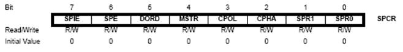

**Біт 7** – **SPIE**: дозвіл переривань. Переривання генерується, якщо цей біт встановлений і встановлений біт глобального дозволу переривань регістра **SREG** (6-й біт).

**Біт 6** – **SPE**: включення SPI. Перед будь-якими діями з SPI цей біт повинен бути встановлений в "1".

**Біт 5** – **DORD**: порядок передачі даних. Якщо цей біт встановлений в "1" то молодший біт даних передається першим. Якщо цей біт скинутий в "0" – старший біт даних передається першим.

**Біт 4** – **MSTR**: вибір режиму роботи. Якщо встановлений в "1", то обраний режим ведучого, якщо в "0" – режим веденого. Якщо SS налаштований як вхід і на нього подано низький рівень, в той час як біт **MSTR** встановлений в "1", тоді цей біт скинеться в "0" і біт **SPIF** регістра **SPSR** (див. нижче) встановиться в "1".

**Біт 3** ­– **CPOL**: полярність тактового сигналу. "0" – під час очікування на SCK присутній низький рівень. "1" – під час очікування на SCK присутній високий рівень. 

**Біт 2** – **CPHA**: фаза тактового сигналу. Якщо цей біт встановлений в "1", то дані зчитуються по задньому фронту SCK, якщо в "0" – по передньому фронту SCK.

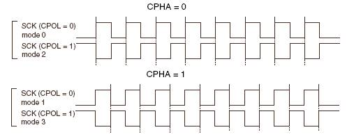

Таким чином установкою цих біт ми можемо вибирати один з чотирьох режимів роботи шини SPI.

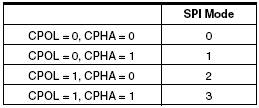

При з'єднанні МК з яким-небудь пристроєм, необхідно дивитися уважно в документації на пристрій режими які він підтримує. Ведучий і ведений пристрої працюючи в різних режимах не сумісні.

**Біти 1:0** – **SPR1:SPR0**: швидкість передачі (частота тактування). Тільки для пристроїв в режимі ведучого. Якщо МК налаштований на роботу в якості веденого, установка цих біт не матиме ніякого ефекту. У таблиці нижче можна подивитися які значення потрібно записати в ці біти, щоб встановити потрібну швидкість передачі (**Біт SPI2X** в регістрі **SPSR**).

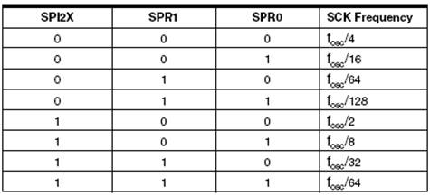

Регістр **SPSR**

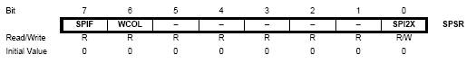

**Біт 7 – SPIF**: прапорець переривання. Встановлюється по завершенні передачі. Переривання генерується якщо встановлений біт **SPIE** регістру **SPCR** і біт **I** регістра **SREG**.

**Біт 6 – WCOL**: прапорець колізій запису. Встановлюється в "1" при спробі запису в регістр **SPDR** до закінчення передачі.

**Біт 0 – SPI2X**: біт подвійної швидкості SPI. Якщо SPI налаштований як ведучий, тоді ми можемо працювати з подвійною частотою. Але якщо SPI налаштований як ведений, то ми не можемо розраховувати на подвійну швидкість роботи SPI.

Вектор переривання в записується так – SPI_STC_vect. Якщо хочемо використовувати переривання, тоді повинні встановити відповідні біти в регістрах і викликати функцію обробника переривання:

```c
ISR (SPI_STC_vect) {}
```

### 2.2. Принцип роботи здвигового регістру

**Паралельно-послідовні регістри (здвигові регістри)** мають або паралельний вхід та послідовний вихід, або послідовний вхід та паралельний вихід. В перших регістрах інформація записується одночасно по паралельних входах, а зчитується почергово, в других – записується почергово, а зчитується одночасно.

Здвиговий регістр 74НС595 має послідовний вхід та паралельний 8-ми бітний вихід (рис. 7.4).

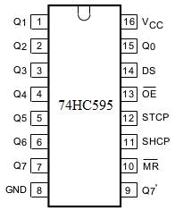

Рис. 7.4. Здвиговий регістр 74НС595.

Мікросхема перетворює вхідний послідовний сигнал на ніжці 1 (DS) в вихідний паралельний на 8 ніжках (Qx). Послідовна передача синхронна: для такту використовується додатковий пін, ніжка SHCP. Також окремим піном управляється регістр даних, ніжка STCP, що дозволяє змінювати сигнал на 8 виходах одноразово, коли всі дані передані.

Таким чином з трьох пінів (ніжок) мікроконтролера можна отримати 8 цифрових виходів. З регістрів 74HC595 можна робити каскади, підключаючи один за іншим (через пін Q7'), і таким чином з тих самих 3 вхідних ліній отримувати 16, 24, 32 і т.д. цифрових виходів.

Пін  – дозвіл виводу даних на паралельні виходи. Риска зверху означає, що активний рівень для цього входу – низький. Коли на цьому вході низький рівень, паралельні виходи будуть включені, коли високий – вимкнені. У більшості випадках контакт  підключений до землі, тому паралельні виходи постійно знаходяться у включеному стані. 

Пін  – це вхід скидання. Подача на нього напруги низького рівня очищає вміст регістра зсуву. У більшості випадках контакт підключений до шини 5 B, щоб запобігти очищення зсувного регістру.

### 2.3. Принцип роботи динамічної індикації

Динамічна індикація – це метод відображення цілісного зображення шляхом швидкого послідовного відображення його частин. Видимість цілісності при цьому досягається завдяки інерційності людського зору.

Звичайно, якщо нам потрібно виводити число в 1-2 розряда, то можна просто приєднати індикатори до портів МК посегментно. Проте, якщо розрядів, скажімо 6 (годинник наприклад), то необхідно використати 6*7=42 вивода портів. Таку кількість мають далеко не всі МК. Тут то і приходить на допомогу динамічна індикація. Суть її в даному випадку в тому, що ми з'єднуємо, припустимо усі однойменні аноди розрядів (для індикаторів зі спільним катодом), і заводимо на виводи одного порта, а катоди кожного з розрядів – на інший порт. Таким чином, використовується всього 8+6=14 виводів портів МК. Ще більше зменшити число задіяних виводів можна за допомогою регістрів здвигу, так часто роблять при великій кількості розрядів. Індикація відбувається шляхом швидкого циклічного показу кожного розряду числа з відповідно включеним в той момент катодом.

Припустимо нам треба вивести число **1234** на 4-х числовому семисегментному індикаторі:

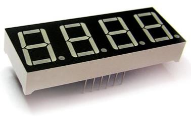

1.1. Подаємо сигнал лог.0 на перший катод (на інших лог. 1)

1.2. Подаємо на аноди комбінацію, що відповідає числу **1.** На першому індикаторі засвітиться **1**. решта будуть погашені.

1.3. Утримуємо вказаний стан на протязі певного часу, наприклад 0,01с.

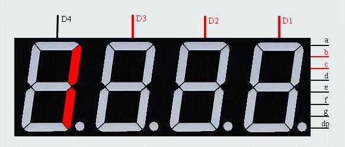

2.1. Подаємо сигнал лог. 0 на другий катод (на інших лог. 1)

2.2. Подаємо на аноди комбінацію, що відповідає числу **2.** На другому індикаторі засвітиться **2**, решта будуть погашені.

2.3. Утримуємо вказаний стан на протязі певного часу, наприклад 0,01с.


3.1. Подаємо сигнал лог. 0 на третій катод (на інших лог. 1)

3.2. Подаємо на аноди комбінацію, що відповідає числу **3.** На третьому індикаторі засвітиться **3**, решта будуть погашені.

3.3. Утримуємо вказаний стан на протязі певного часу, наприклад 0,01с.

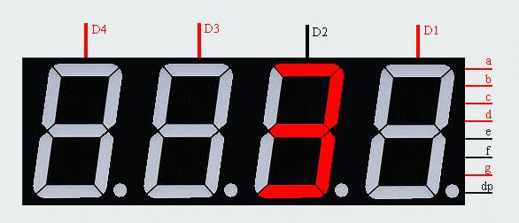

4.1. Подаємо сигнал лог.0 на 4-ий катод (на інших лог. 1)

4.2. Подаємо на аноди комбінацію, що відповідає числу **4.** На 4-му індикаторі засвітиться **4**, решта будуть погашені.

4.3. Утримуємо вказаний стан на протязі певного часу, наприклад 0,01с.

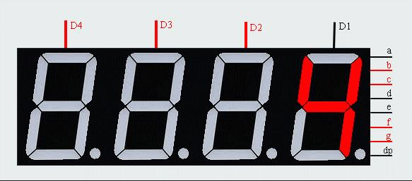

5.1. Переходимо до п.1.1.

## **3.**   Порядок виконання роботи

3.1.     Створити проєкт в AVR Studio 4. Налаштування проєкту виберемо такі як у попередній лабораторній роботі.

3.2.     Додати до файлу програму, яка необхідна для програмування заданого алгоритму:

```c
#define F_CPU 16000000UL
#include <avr/io.h>
#include <avr/interrupt.h>
#include <util/delay.h>

ISR(SPI_STC_vect) {
    PORTC |= (1 << PORTC0);
    PORTC &= ~(1 << PORTC0);
}

int number(int n) {
    int num = 0;
    switch(n) { 
        case 0: {
            num=0x …; // Вказати hex-код цифри 0
          break;
    } 

    case 1: {
          num=0x…; // Вказати hex-код цифри 1
          break;
    } 

    case 2: {
          num=0x…; // Вказати hex-код цифри 2
          break;
    } 

    case 3: {
          num=0x…; // Вказати hex-код цифри 3
          break;
    } 

    case 4: {
          num=0x…; // Вказати hex-код цифри 4
          break;
    } 

    case 5: {
          num=0x…; // Вказати hex-код цифри 5
          break;
    } 

    case 6: {
          num=0x…; // Вказати hex-код цифри 6
          break;
    } 

    case 7: {
          num=0x…; // Вказати hex-код цифри 7
          break;
    } 

    case 8: {
          num=0x…; // Вказати hex-код цифри 8
          break;
    } 

    case 9: {
          num=0x…; // Вказати hex-код цифри 9
          break;
    }

    default: break;

    }
      return num;
}

int main(void) {
    DDRD = 0x00;
    PORTD = 0xFF;
    DDRB = 0xFF;
    PORTB = 0xFF;
    DDRC = 0xFF;
    PORTC |= (1 << PORTC1) | (1 << PORTC2) | (1 << PORTC3) | (1 << PORTC4);
    SPCR |=(1 << SPIE) | (1 << SPE) | (0 << DORD) | (1 << MSTR) | (0 << CPHA) | (0 << SPR1) | (1 << SPR0);
    sei();
    while (1) {
        if (PIND == 0xFE) {
              SPDR = number(…); // Вказати цифру числа №1, яку треба вивести згідно варіант
              _delay_us(20);
              PORTC &= ~(1 << PORTC1);
              _delay_ms(1);
              PORTC |= (1 << PORTC1);
              SPDR = number(…); // Вказати цифру числа №1, яку треба вивести згідно варіанту
              _delay_us(20);
              PORTC &= ~(1 << PORTC2);
              _delay_ms(1);
              PORTC |= (1 << PORTC2);
              SPDR = number(…); // Вказати цифру числа №1, яку треба вивести згідно варіанту
              _delay_us(20);
              PORTC &= ~(1 << PORTC3);
              _delay_ms(1);
              PORTC |= (1 << PORTC3);
              SPDR = number(…); // Вказати цифру числа №1, яку треба вивести згідно варіанту
              _delay_us(20);
              PORTC &= ~(1 << PORTC4);
              _delay_ms(1);
              PORTC |= (1 << PORTC4);
        }
        if (PIND == 0x…) { // Вказати hex-код для зчитування положення перемикача
              // Вказати програмний код для виводу числа №2 згідно варіанту   
        }
        if (PIND == 0x…) { // Вказати hex-код для зчитування положення перемикача
              // Вказати програмний код для виводу числа №3 згідно варіанту   
        } 

        if (PIND == 0x…) { // Вказати hex-код для зчитування положення перемикача
              // Вказати програмний код для виводу числа №4 згідно варіанту   
        }

        if (PIND == 0x…) { // Вказати hex-код для зчитування положення перемикача
              // Вказати програмний код для виводу числа №5 згідно варіанту   
        }

        if (PIND == 0x…) { // Вказати hex-код для зчитування положення перемикача
              // Вказати програмний код для виводу числа №6 згідно варіанту
        }
    }
}
```

Функція-переривання ISR(SPI_STC_vect) виникає після завершення передачі числа по SPI і подає команду здвиговому регістру вивести отримане число на піни Q0-Q7.

*Таблиця 7.2. Варіанти завдання*

| №   варіанту | Число №1 | Число №2 | Число №3 | Число №4 | Число №5 | Число №6 |
| ------------ | -------- | -------- | -------- | -------- | -------- | -------- |
| 1            | 1802     | 7639     | 4185     | 7694     | 1785     | 7195     |
| 2            | 2761     | 4527     | 9271     | 6798     | 9342     | 7514     |
| 3            | 1362     | 3210     | 8973     | 9165     | 3061     | 9485     |
| 4            | 7530     | 7459     | 7834     | 4251     | 5463     | 7524     |
| 5            | 4903     | 2064     | 1547     | 9843     | 4352     | 7249     |
| 6            | 1362     | 3428     | 5734     | 6342     | 2431     | 1305     |
| 7            | 7864     | 9814     | 8103     | 9156     | 8130     | 1423     |
| 8            | 3128     | 1975     | 4316     | 3495     | 2587     | 6908     |
| 9            | 7865     | 4716     | 7613     | 3412     | 4678     | 2831     |
| 10           | 6302     | 9297     | 6497     | 8096     | 7156     | 9562     |
| 11           | 4735     | 8217     | 1829     | 6185     | 2347     | 4698     |
| 12           | 5927     | 4730     | 8671     | 2498     | 6079     | 5987     |
| 13           | 9263     | 4170     | 6574     | 5987     | 3689     | 3968     |
| 14           | 7014     | 4710     | 4023     | 7958     | 8265     | 3452     |
| 15           | 2017     | 9821     | 5273     | 5615     | 9231     | 3769     |
| 16           | 2834     | 8453     | 2174     | 6147     | 9654     | 8402     |
| 17           | 6143     | 4139     | 9612     | 7653     | 8674     | 9128     |
| 18           | 5106     | 1836     | 7632     | 3827     | 8973     | 4985     |
| 19           | 2974     | 8201     | 2193     | 5314     | 9048     | 4605     |
| 20           | 3827     | 1543     | 7689     | 6315     | 6172     | 9518     |
| 21           | 3465     | 8329     | 9405     | 2016     | 4902     | 4531     |
| 22           | 2984     | 3812     | 1348     | 2157     | 6314     | 3710     |
| 23           | 1097     | 9243     | 9742     | 7068     | 4856     | 8567     |
| 24           | 6395     | 4230     | 6052     | 3012     | 5367     | 3026     |
| 25           | 6847     | 7578     | 6123     | 6125     | 2703     | 3405     |
| 26           | 5734     | 3420     | 4860     | 2098     | 7570     | 8521     |
| 27           | 6031     | 9418     | 9869     | 3615     | 2870     | 6902     |
| 28           | 4863     | 1269     | 3046     | 2584     | 2546     | 1306     |
| 29           | 3176     | 4127     | 5497     | 2543     | 1728     | 1497     |
| 30           | 6058     | 3247     | 1572     | 7541     | 5163     | 7321     |

3.3.     Запустити програмне середовище Proteus. Побудувати схему за рис. 7.1, при цьому використати елементи з таблиці 7.1.

3.4.     Вказати в елементі ATMEGA328p шлях до hex-файлу та задати в меню настройку CKSEL Fuses і в ручну вписати частоту 16MHz, як вказано на рисунку:

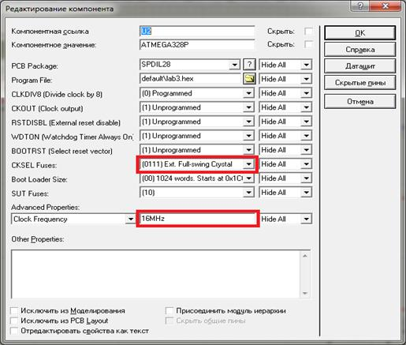

3.5.     Промоделювати роботу схеми. Впевнитися, що вона працює за заданим алгоритмом.

3.6.     Оформити звіт про роботу.

## 4.   Вміст звіту про роботу

4.1.     Назва, мета та завдання на виконання роботи.

4.2.     Зображення схеми зібраної в програмному середовище Proteus.

4.3.     Лістінг програми написаної в програмному середовищі AVR Studio.

## 5.   Контрольні питання

5.1.     Пояснити, принцип роботи динамічної індикації.

5.2.     Пояснити принцип роботи здвигового регістру.

5.3.     Пояснити принцип роботи інтерфейсу SPI.

[Лаб6. Робота таймерів/лічильників в мікроконтролерах сімейства megaAVR](lab6.md) <-- [Зміст](README.md) --> [Лаб8. Робота з аналогово-цифровим перетворювачем мікроконтролерів сімейства megaAVR](lab8.md)
