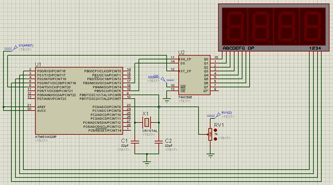
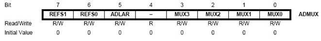
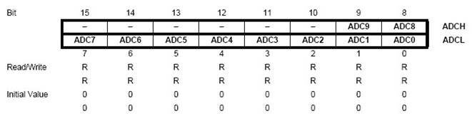
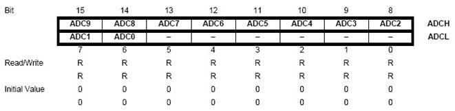
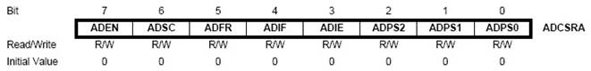
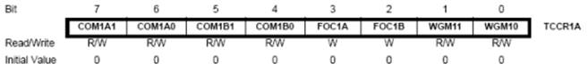
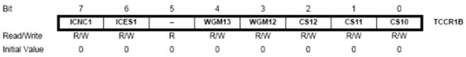
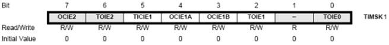
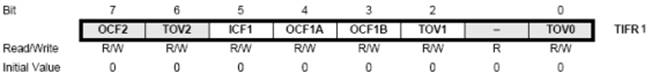

ПРОГРАМУВАННЯ ОДНОКРИСТАЛЬНИХ МІКРОПРОЦЕСОРНИХ КОНТРОЛЕРІВ, Євген Проскурка 

[Лаб7. Інтерфейс SPI та динамічна індикація](lab7.md) <-- [Зміст](README.md) -->[Лаб9. Інтерфейс TWI (I2C) в мікроконтролерах сімейства megaAVR](lab9.md)

# ЛР8 Робота з аналогово-цифровим перетворювачем мікроконтролерів сімейства megaAVR

**Мета роботи:** ознайомитися з принципом роботи аналогово-цифрового перетворювача (АЦП) в мікроконтролерах сімейства megaAVR.

## **1.** Завдання на виконання роботи 

1.1.     Скласти схему підключення наведену на рис. 8.1 в програмному середовищі Proteus. При складані схеми використати наступні компоненти представлені в таблиці 8.1.



Рис. 8.1. Схема в програмному середовищі Proteus.

​           *Таблиця 8.1. Список елементів.*

| Найменування | Кількість | Опис                                                    |
| ------------ | --------- | ------------------------------------------------------- |
| POT-HG       | 1         | потенціометр, для симуляції  термометр опору            |
| ATMEGA328p   | 1         | мікроконтролер AVR ATmega328p                           |
| CAP          | 2         | конденсатори, номіналами 22пФ                           |
| CRYSTAL      | 1         | кварцовий резонатор  номіналом 8 MHz                    |
| 74HC595      | 1         | здвиговий резистор                                      |
| 7SEG-MPX4-CC | 1         | семисегментний індикатор на  4 цифри,   загальний катод |

1.2.     Доповнити написану програму в середовищі AVR Studio для функціонування схеми. Алгоритм функціонування схеми наступний: ставлячи повзунок потенціометра в певні положення в діапазоні від 0 до 100% отримати значення на індикаторі в певному діапазоні (положення повзунка та діапазон значень для кожного варіанту вказані в табл. 8.2). 

1.3.     Протестувати написану програму в середовищі AVR Studio на схемі в програмному середовищі Proteus.

## **2.** Теоретичні відомості

### 2.1. Загальні відомості про роботу АЦП

**Аналого-цифровий перетворювач**, **АЦП** (англ. *Analog**-**to**-**digital* *converter**, ADC*) – пристрій, що перетворює вхідний аналоговий сигнал в дискретний код (цифровий сигнал). Як правило, АЦП – електронний пристрій, що перетворює електричну напругу в двійковий цифровий код.

АЦП мікроконтролера AVR ATmega328p 10-ти розрядний та працює з напругою 0-5 В. Розрядність вказує в якому діапазон чисел в мікроконтролері можливо представити напругу, тобто 210 = 1024, тому напруга в діапазоні 0-5 В в мікроконтролері буде представлена діапазоном чисел 0-1023.

АЦП мікроконтролера AVR ATmega328p має два режими роботи: одноразовий та неперервний. В неперервному режимі роботи мікроконтролер робить перетворення напруги на вході в числове значення через певний інтервал часу. При одноразовому режимі роботи програма робить запит до АЦП на початок перетворення. Відбувається одноразове перетворення, отримується результат та АЦП чекає наступного запиту програми.

 АЦП мікроконтролера записує значення перетворення в регістр **ADC**, що складається з **регістру** **ADCH** – старший байт результату перетворення та регістру **ADCL** – молодший байт результату перетворення.

Мікроконтролер AVR ATmega328p має 6 каналів АЦП. Вибір каналу задається регістром **ADMUX**. Регістр **ADMUX** має наступні біти:



Біти 7:6 – **REFS1**:**REFS0**. Біти вибору опорної напруги. Якщо змінювати ці біти під час перетворення, то зміни вступлять в силу тільки після поточного перетворення. В якості опорної напруги може бути обраний AVcc (напруга джерела живлення), AREF або внутрішнє джерело опорного напруги на 2.56 В.

Можливий вибір наступних джерел опорної напруги:

| **REFS0** | **REFS1** | Опис джерела опорної напруги                                 |
| --------- | --------- | ------------------------------------------------------------ |
| 0         | 0         | AREF                                                         |
| 0         | 1         | AVcc, з зовнішнім конденсатором на AREF                      |
| 1         | 0         | Резерв (не використовується)                                 |
| 1         | 1         | Внутрішнє джерело опорного напруги на 2.56 В з  зовнішнім конденсатором на AREF |

Біт 5 – **ADLAR**. Визначає як результат перетворення запишеться в регістри **ADCL** і **ADCH**.

При **ADLAR** = 0:



При **ADLAR** = 1:



Як можна бачити при **ADLAR** = 0 в **ADCH** записуються два старших біти (2 MSB), а інші в **ADCL**. А при **ADLAR** = 1 в **ADCH** записуються 8 старших бітів (8 MSB), а два молодших (2 LSB) в **ADCL**.

Біти 3:0 – **MUX3**:**MUX0** – біти вибору аналогового каналу:

| **MUX3** | **MUX2** | **MUX1** | **MUX0** | Канал |
| -------- | -------- | -------- | -------- | ----- |
| 0        | 0        | 0        | 0        | ADC0  |
| 0        | 0        | 0        | 1        | ADC1  |
| 0        | 0        | 1        | 0        | ADC2  |
| 0        | 0        | 1        | 1        | ADC3  |
| 0        | 1        | 0        | 0        | ADC4  |
| 0        | 1        | 0        | 1        | ADC5  |
| 0        | 1        | 1        | 0        | ADC6  |
| 0        | 1        | 1        | 1        | ADC7  |

Інші настройки АЦП знаходяться в регістрі **ADCSRA**:



Біт 7 – **ADEN**. Дозвіл роботи АЦП:

0 – АЦП вимкнений;

1 – АЦП включений.

Біт 6 – **ADSC**. Запуск перетворення (в режимі однократного перетворення):
0 – перетворення завершено;

1 – почати перетворення.

Біт 5 – **ADFR**. Вибір режиму роботи АЦП:

0 – режим одноразового перетворення;

1 – режим безперервного перетворення.

Біт 4 – **ADIF**. Прапорець переривання від АЦП. Біт встановлюється, коли перетворення закінчено.

Біт 3 – **ADIE**. Дозвіл переривання від АЦП:

0 – переривання заборонено;

1 – переривання дозволено.

Переривання від АЦП генерується (якщо дозволено) по завершенні перетворення.

Біти 2:0 **– ADPS2**:**ADPS0**. Тактова частота АЦП:

| **ADPS2** | **ADPS1** | **ADPS0** | Тактова частота (CK) |
| --------- | --------- | --------- | -------------------- |
| 0         | 0         | 0         | CK/2                 |
| 0         | 0         | 1         | CK/2                 |
| 0         | 1         | 0         | CK/4                 |
| 0         | 1         | 1         | CK/8                 |
| 1         | 0         | 0         | CK/16                |
| 1         | 0         | 1         | CK/32                |
| 1         | 1         | 0         | CK/64                |
| 1         | 1         | 1         | CK/128               |

При досягненні 10-бітної точності необхідно обирати частоти роботи АЦП менше 200 кГц.

### 2.2. Загальні відомості про роботу таймера/лічильника

Для відліку часу в мікроконтролері необхідно використовувати вбудований таймер/лічильник (далі в тексті таймер) ТС1 в мікроконтролері.

Таймер ТС1 шістнадцятирозрядний (216 = 65536) рахує імпульси від 0 до 65535 від внутрішнього джерела тактування та записує в регістр **TCNT1** (**TCNT1H** та **TCNT1L**). Частота імпульсів вибирається бітами **CS12-CS10** в регістрі **TCCR1B**. При переході від значення 65535 (FFFF) до 0 відбувається переривання по переповненню таймеру.

Також присутні регістри **OCR1A** (**OCR1AH** та **OCR1AL**) та **OCR1B** (**OCR1BH** та **OCR1BL**) в які записуються значення і при співпадінню з значенням регістру **TCNT1** відбувається переривання по співпадінню чи зміна стану на виводах мікроконтролера **OC1A** чи  **OC1B**. 

Таймер ТС1 може збільшувати значення регістру **TCNT1** коли імпульси приходять на вивід мікроконтролера **Т1**.

Також у мікроконтролера присутня ніжка входу **ICP1** коли приходить на неї імпульс відбувається переривання по захопленню.

Розглянемо настройку регістрів таймеру ТС1.

**TCCR1A**



**Біти 7:6 -** **COM1A** **1:0:** контролюють поведінку виходу **OC1A**.

Біти 5:4 - COM1B 1:0: контролюють поведінку виходу OC1B.

| **COM1A1/**  **COM1B1** | **COM1A0/**  **COM1B0** | Опис поведінки виходу                    |
| ----------------------- | ----------------------- | ---------------------------------------- |
| 0                       | 0                       | Вимкнено                                 |
| 0                       | 1                       | Переключення стану виходу на протилежний |
| 1                       | 0                       | Переключення в “0”                       |
| 1                       | 1                       | Переключення в “1”                       |

**Біти 3:2 – FOC1A, FOC1B:** слугують для примусового зміни стану виходів **OC1A** і **OC1B**.

**Біти 1:0 – WGM11, WGM10:** слугують для настройки ТС1 для роботи в якості широтно-імпульсного модулятора (ШІМ). У режимі ШІМ стан виходів **OC1A** і **OC1B** буде відрізнятися.

**TCCR1B**



**Біт 7 – ICNC1:** придушення брязкоту контактів на вході **ICP1**. Якщо біт встановлено, то визначення події на вході **ICP1** відбувається із затримкою в 4 машинних циклу.

**Біт 6 - ICES1:** вибір фронту спрацьовування переривання по захопленню на вході **ICP1**. Якщо встановлено – по зростаючому фронті, якщо скинуто – по спадаючому фронті.

**Біт 5** – не використовується.

**Біти 4:3 – WGM1 3:2:** для настройки ШІМ.

**Біти 2:0 – CS12-CS10:** вибір частоти тактів таймеру ТС1.

| CS12 | CS11 | CS10 | Опис                                           |
| ---- | ---- | ---- | ---------------------------------------------- |
| 0    | 0    | 0    | Таймер виключений                              |
| 0    | 0    | 1    | CLK                                            |
| 0    | 1    | 0    | CLK/8                                          |
| 0    | 1    | 1    | CLK/64                                         |
| 1    | 0    | 0    | CLK/256                                        |
| 1    | 0    | 1    | CLK/1024                                       |
| 1    | 1    | 0    | Зовнішнє джерело тактів на Т1. Задній фронт.   |
| 1    | 1    | 1    | Зовнішнє джерело тактів на Т1. Передній фронт. |

**TIMSK1** – регістр маски переривання таймеру.



**Біт 7 – OCIE2:** переривання по співпадінню ТС2.

**Біт 6 – TOIE2:** переривання по переповненню ТС2

**Біт 5 – TICIE1:** переривання по захопленню ТС1.

**Біт 4 – OCIE1A:** переривання по співпадінню A ТС1.

**Біт 3 – OCIE1B:** переривання по співпадінню В ТС1.

**Біт 2 – TOIE1:** переривання по переповненню ТС1.

**Біт 1** – не використовується.

**Біт 0** **– TOIE0:** переривання по переповненню ТС0.

Якщо відповідний біт встановлений в "1" і біт **I** (7-й біт) регістра станів **SREG** встановлений в "1", тоді відповідне переривання буде спрацьовувати.

**TIFR1** – регістр прапорців переривань таймерів.



​     

Прапорці відповідають перериванням в регістрі TIMSK1. Встановлюються в "1" при виконанні умов відповідного переривання.

## **3.**  Порядок виконання роботи

3.1.     Створити проєкт в AVR Studio 4. Налаштування проєкту виберемо такі як у попередній лабораторній роботі.

3.2.     Додати до файлу програму, яка необхідна для програмування заданого алгоритму:

```c
#define F_CPU 8000000UL
#include <avr/io.h>
#include <avr/interrupt.h>
#include <util/delay.h>

int flag;
ISR(SPI_STC_vect) {
  PORTD |= (1 << PORTD4);
  PORTD &= ~(1 << PORTD4);
}

ISR(TIMER1_OVF_vect) {
  flag = 1;
}

int number(int n) {
  int num = 0;
  switch(n) { 
        case 0: {
             num=…; // Вказати hex-код цифри 0
             break;
        } 
        case 1: {
             num=…; // Вказати hex-код цифри 1
             break;
        } 
        case 2: {
             num=…; // Вказати hex-код цифри 2
             break;
        } 
        case 3: {
             num=…; // Вказати hex-код цифри 3
             break;
        } 
		case 4: {
             num=…; // Вказати hex-код цифри 4
             break;
        } 
        case 5: {
             num=…; // Вказати hex-код цифри 5
             break;
        } 
        case 6: {
             num=…; // Вказати hex-код цифри 6
             break;
        } 
        case 7: {
             num=…; // Вказати hex-код цифри 7
             break;
        } 
        case 8: {
             num=…; // Вказати hex-код цифри 8
             break;
        } 
        case 9: {
             num=…; // Вказати hex-код цифри 9
             break;
        }
        default: break;
  }
  return num;
}

void ADC_init()
{
   ADCSRA |= (1<<ADEN) | (1<<ADPS2) | (1<<ADPS1) | (1<<ADPS0);
   ADMUX |= (0<<REFS0);
}

int ADC_result()
{  
   ADCSRA |= (1<<ADSC);
   while((ADCSRA & (1<<ADSC)));
   return ADC;
} 

int main(void) {
  int data, a, b, c, d;  
  DDRD = 0xFF;
  PORTD = 0x00;  
  DDRB = 0xFF;
  PORTB = 0xFF; 
  SPCR |=(1 << SPIE) | (1 << SPE) | (0 << DORD) | (1 << MSTR) | (0 << CPHA) | (0 << SPR1) | (1 << SPR0);  
  ADC_init(); 
  sei(); 
// Помножити результат на число для отримання певного діапазону
  data = ADC_result() * …; 
  a = data / 1000;
  b = (data % 1000) / 100;
  c = ((data % 1000) % 100) / 10;
  d = ((data % 1000) % 100) % 10;
 
  TCCR1B |= (0 << CS12) | (1 << CS11) | (0 << CS10);
  TIMSK1 |= (1 << TOIE1);
  while (1) {
        if (flag) {
             flag = 0;             
// Помножити результат на число для отримання певного діапазону
data = ADC_result() * …;
             a = data / 1000;
             b = (data % 1000) / 100;
             c = ((data % 1000) % 100) / 10;
             d = ((data % 1000) % 100) % 10;
        }
        SPDR = number(a);
        _delay_us(20);
        PORTD &= ~(1 << PORTD0);
        _delay_ms(1);
        PORTD |= (1 << PORTD0);
		SPDR = number(b);
        _delay_us(20);
        PORTD &= ~(1 << PORTD1);
        _delay_ms(1);
        PORTD |= (1 << PORTD1); 
        SPDR = number(c);
        _delay_us(20);
        PORTD &= ~(1 << PORTD2);
        _delay_ms(1);
        PORTD |= (1 << PORTD2); 
        SPDR = number(d);
        _delay_us(20);
        PORTD &= ~(1 << PORTD3);
        _delay_ms(1);
        PORTD |= (1 << PORTD3);
  }
}
```

Функція void ADC_init() дозволяє роботу АЦП. АЦП настроєний на частоту роботи CK/128, вибрано канал ADC0.

Функція int ADC_result() – перетворення АЦП. Функція запускає одноразове перетворення, чекає поки встановиться біт завершення перетворення, повертає з функції значення регістру **ADC**. Отримане значення необхідно помножити на певне число в діапазоні від 0 до 9 для отримання результату в діапазоні згідно варіанту завдання в таблиці 8.2.  

*Таблиця 8.2. Варіанти завдання.*

| №   варіанту | Діапазон зміни значень | Положення №1, % | Положення №2, % | Положення №3, % | Положення №4, % |
| ------------ | ---------------------- | --------------- | --------------- | --------------- | --------------- |
| 1            | 0-2046                 | 78              | 16              | 18              | 22              |
| 2            | 0-8184                 | 47              | 31              | 94              | 33              |
| 3            | 0-4092                 | 28              | 88              | 26              | 81              |
| 4            | 0-9207                 | 15              | 16              | 76              | 80              |
| 5            | 0-6138                 | 93              | 24              | 15              | 88              |
| 6            | 0-7161                 | 96              | 45              | 69              | 55              |
| 7            | 0-5115                 | 68              | 3               | 44              | 99              |
| 8            | 0-3069                 | 33              | 95              | 52              | 77              |
| 9            | 0-4092                 | 74              | 5               | 12              | 45              |
| 10           | 0-2046                 | 66              | 62              | 49              | 54              |
| 11           | 0-9207                 | 76              | 8               | 68              | 74              |
| 12           | 0-6138                 | 2               | 94              | 59              | 6               |
| 13           | 0-8184                 | 24              | 11              | 75              | 62              |
| 14           | 0-2046                 | 95              | 86              | 70              | 51              |
| 15           | 0-6138                 | 70              | 51              | 41              | 11              |
| 16           | 0-4092                 | 29              | 79              | 64              | 53              |
| 17           | 0-7161                 | 13              | 20              | 88              | 27              |
| 18           | 0-5115                 | 73              | 47              | 71              | 56              |
| 19           | 0-2046                 | 84              | 48              | 39              | 59              |
| 20           | 0-3069                 | 10              | 47              | 87              | 57              |
| 21           | 0-7161                 | 61              | 24              | 31              | 86              |
| 22           | 0-6138                 | 46              | 76              | 27              | 49              |
| 23           | 0-4092                 | 87              | 37              | 20              | 41              |
| 24           | 0-9207                 | 18              | 92              | 21              | 67              |
| 25           | 0-6138                 | 61              | 68              | 67              | 91              |
| 26           | 0-8184                 | 73              | 79              | 50              | 64              |
| 27           | 0-2046                 | 51              | 49              | 74              | 28              |
| 28           | 0-5115                 | 26              | 45              | 37              | 13              |
| 29           | 0-7161                 | 36              | 39              | 96              | 22              |
| 30           | 0-3069                 | 24              | 55              | 49              | 92              |

3.3.     Запустити програмне середовище Proteus. Побудувати схему за рис. 8.1, при цьому використати елементи з таблиці 8.1.

3.4.     Вказати в елементі ATMEGA328p шлях до hex-файлу та задати в меню настройку CKSEL Fuses і в ручну вписати частоту 8MHz, як вказано на рисунку:


3.5.     Промоделювати роботу схеми. Впевнитися, що вона працює за заданим алгоритмом.

3.6.     Оформити звіт про роботу.

## 4.   Вміст звіту про роботу. 

4.1.     Назва, мета та завдання на виконання роботи.

4.2.     Зображення схеми зібраної в програмному середовище Proteus.

4.3.     Лістінг програми написаної в програмному середовищі AVR Studio. 

## 5.   Контрольні питання.

5.1.     Пояснити, що собою являє розрядність АЦП.

5.2.     Вказати з якою частотою може працювати АЦП в мікроконтролері.

5.3.     Вказати з якою частотою може працювати таймер в мікроконтролері.

5.4.     Визначити з програми скільки раз в секунду відбувається перетворення в АЦП.

[Лаб7. Інтерфейс SPI та динамічна індикація](lab7.md) <-- [Зміст](README.md) -->[Лаб9. Інтерфейс TWI (I2C) в мікроконтролерах сімейства megaAVR](lab9.md)