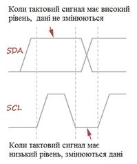
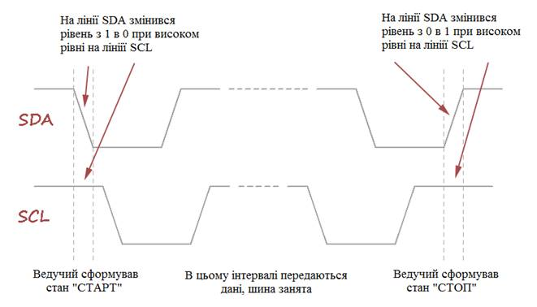
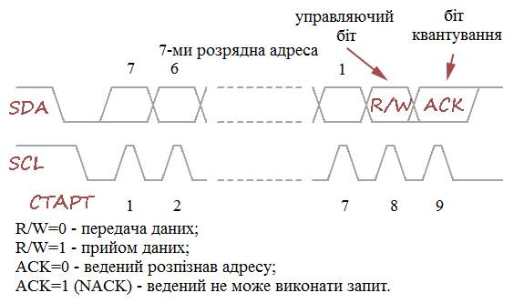
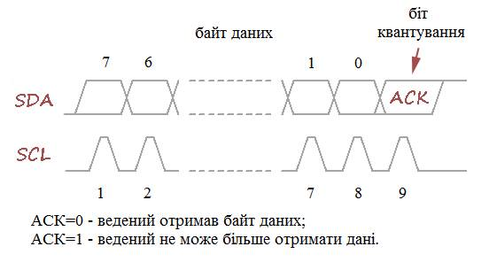
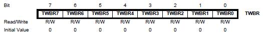
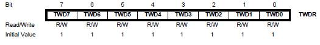
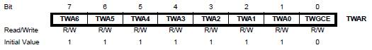
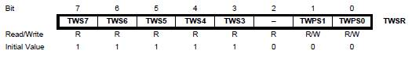
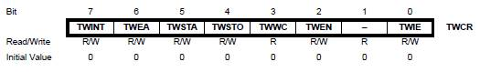
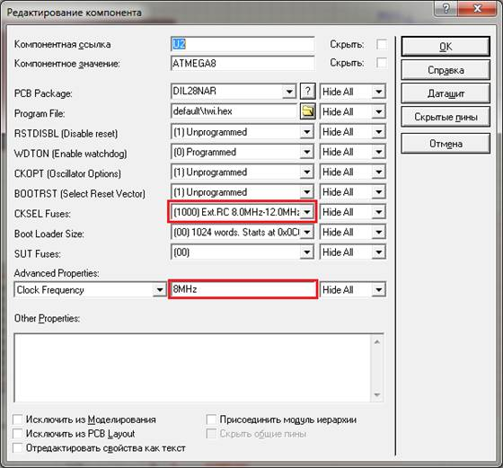

ПРОГРАМУВАННЯ ОДНОКРИСТАЛЬНИХ МІКРОПРОЦЕСОРНИХ КОНТРОЛЕРІВ, Євген Проскурка 

[Лаб8. Робота з аналогово-цифровим перетворювачем мікроконтролерів сімейства megaAVR](lab8.md) <-- [Зміст](README.md) --> [Лаб10. Інтерфейс UART в мікроконтролерах сімейства megaAVR](lab10.md)

# ЛР9 Інтерфейс TWI (I2C) в мікроконтролерах сімейства megaAVR

**Мета роботи:** ознайомитися з принципом роботи інтерфейсу TWI (I2C) в мікроконтролерах сімейства megaAVR.

## **1.** Завдання на виконання роботи

1.1.     Скласти схему наведену на рис. 9.1 в програмному середовищі Proteus. При складані схеми використати наступні компоненти представлені в таблиці 9.1.


Рис. 9.1. Схема в програмному середовищі Proteus.

​           *Таблиця 9.1. Список елементів.*

| Найменування | Кількість | Опис                                                 |
| ------------ | --------- | ---------------------------------------------------- |
| MCP3421      | 1         | аналогово-цифровий  перетворювач (АЦП)               |
| 74HC595      | 1         | здвиговий регістр                                    |
| RES          | 2         | резистори номіналами 4.7  кОм                        |
| POT-HG       | 1         | потенціометр номіналом 1  кОм                        |
| 7SEG-MPX4-CC | 1         | семисегментний індикатор на 4 цифри, загальний катод |
| ATMEGA8      | 1         | мікроконтролер AVR ATmega8                           |
| CAP          | 2         | конденсатори, номіналами 22 пФ                       |
| CRYSTAL      | 1         | кварцовий резонатор  номіналом 8 MHz                 |

**УВАГА!!! Напругу в елементі** **RV1(2) виставити 2.048 В.** 

**Напругу в елементах** **R1(1) та** **U3(MR) виставити 5 В.**

1.2.     Доповнити написану програму в середовищі AVR Studio для функціонування схеми. Алгоритм функціонування схеми наступний: змінюючи положення ручки потенціометра на семисегментний індикатор виводяться числа від 0 до 2047 отримані з АЦП з інтервалом 1 секунда.

1.3.     Протестувати написану програму в середовищі AVR Studio на схемі в програмному середовищі Proteus. Згідно свого варіанту (табл. 9.2) встановити ручку потенціометра в певну позицію та записати в протокол результати дослідів.

## **2.**   Теоретичні відомості

### 2.1. Інтерфейс TWI (I2C)

**I²C** – послідовна шина даних для зв'язку інтегральних схем, розроблена фірмою Philips на початку 1980-х, як проста шина внутрішнього зв'язку для створення керуючої електроніки. Використовується для з'єднання низькошвидкісних периферійних компонентів з материнською платою, вбудовуваними системами та мобільними телефонами. Назва є абревіатурою слів Inter-Integrated Circuit.

I²C використовує дві двонапрямлені лінії, підтягнуті до напруги живлення: послідовна лінія даних (SDA, англ. *Serial DAta*) і послідовна лінія тактування (SCL, англ. *Serial CLock*). Стандартні напруги +5 В або +3,3 В, проте допускаються й інші.

Дані передаються по двох проводах – проводу даних і проводу тактів. Є ведучий (master) і ведений (slave), такти генерує ведучий, ведений лише підтверджує прийом байту. 

Всього на одній двухпровідній шині може бути до 112 пристроїв (адресація включає 7-бітовий адресний простір (127 адрес), 16 адресів зарезервовано).

Основний режим роботи – 100 кбіт/с.

Дані передаються порозрядно, старшим розрядом вперед. Кожен розряд супроводжується тактовим сигналом (рис. 9.2).



Рис. 9.2. Принцип передачі даних.

Початок і закінчення передачі даних супроводжується спеціальними станами шини – “СТАРТ” і “СТОП”. Ці стани формує ведучий пристрій (рис. 9.3). Також ведучий може сформувати стан повторного старту до формування стану “СТОП”.



Рис. 9.3. Принцип формування станів “СТАРТ” та “СТОП”.

Дані передаються по I2C шині зі службовою інформацією. Всі разом це називається пакетом. Існують **адресні пакети** і **пакети даних**. 

**Адресні пакети складаються з 7-ми розрядної адреси, керуючого біта R/W і біта квітування (весь пакет – 9 біт).** Адресний пакет потрібен, щоб звернутися до конкретного пристрою (рис. 9.4).

Біт R/W – визначає подальший напрямок передачі даних. Біт квітування – це відповідь веденого пристрою на прийнятий адрес. Якщо адресу розпізнано, ведений видає на лінію SDA низький рівень. В іншому випадку на лінії утримується високий рівень. Під адресу відведено 7 розрядів.

**Пакети даних** складаються з байту даних і біту квітування, тобто теж мають довжину 9 біт (рис. 9.5). Після прийому кожного байту даних, приймаючий пристрій (ведений) відповідає передавальному пристрою (ведучому), встановлюючи на лінії SDА низький рівень (це і є біт квітування). Якщо приймаючий пристрій отримав останній байт або більше не може продовжувати прийом даних, він повинен "залишити" на лінії SDA високий рівень.



Рис. 9.4. Формат адресного пакету.

Рис. 9.5. Формат пакету даних.

У загальному випадку, повний цикл обміну по шині I2C складається з наступних кроків:

- формування стану “СТАРТ”;
- передача адресного пакета;
- передача пакетів даних;
- прийом пакетів даних;
- формування стану “СТОП”.

В мікроконтролерах AVR серії ATmega інтерфейс I2C реалізовано в модулі TWI. Розглянемо детально регістри модуля TWI.

Регістр швидкості передачі **TWBR (TWI Bit Rate Register):**



Будь-який апаратний модуль, який реалізує інтерфейс (SPI, UART, TWI, USB), має регістри, що задають швидкість передачі даних. У TWI модулі цю функцію виконує регістр **TWBR** і два молодших розряду статусного регістра **TWSR – TWPS1** і **TWPS0**.

Під швидкістю передачі в даному випадку мається на увазі частота SCL сигналу, коли мікроконтролер працює в режимі ведучого пристрою (master). У режимі веденого (slave) мікроконтролер "отримує" SCL сигнал ззовні – від іншого ведучого пристрою. (Тактова частота мікроконтролера в цьому випадку, повинна бути більше частоти зовнішнього SCL сигналу мінімум в 16 разів.)

Розрахунок швидкості передачі проводиться по формулі.

```
TWBR = ((Fcpu/Fscl) - 16)/(2*4^TWPS)
```

де Fcpu – частота роботи мікроконтролера;

Fscl – частота роботи модуля TWI;

TWPS – число, що утворюють біти **TWPS1** і **TWPS0**.

Регістр даних **TWDR (TWI Data Register):**



Функції регістра даних очевидні. У нього ми поміщаємо те, що хочемо передати і забираємо те, що отримали з шини.

Регістр адреси **TWAR (TWI Address Register):**



Мікроконтролер може виконувати функції як ведучого, так і веденого пристрою, по черзі, а не одночасно.

Якщо мікроконтролер виступає в ролі веденого, йому потрібно мати адресу, на яку він буде "відгукуватися". Регістр **TWAR** і призначений для зберігання 7-й розрядної адреси. Молодший розряд (**TWGCE**) цього регістра дозволяє або забороняє мікроконтролеру відгукуватися на спільні виклики, тобто на пакети з адресом 0x00.

Статусний регістр **TWSR (TWI Status Register):**



Статусний регістр TWSR відображає стан TWI модуля і двохпровідної шини, а також містить розряди, що задають коефіцієнт розподілу частоти SCL сигналу.

Біти **TWS7–TWS3** містять статусний код. Біти доступні тільки для читання, статусний код встановлюється TWI модулем апаратно, після виконання різних операцій. Наприклад, формування стану “СТАРТ”, передачі пакета даних і так далі. За значенням статусного коду можна судити про результат операції. Виконалася вона успішно чи ні.

Біти **TWPS1–TWPS0** задають подільник частоти для роботи модуля TWI: 

| TWPS1 | TWPS0 | Частота |
| ----- | ----- | ------- |
| 0     | 0     | SCL     |
| 0     | 1     | SCL/4   |
| 1     | 0     | SCL/16  |
| 1     | 1     | SCL/64  |

**Регістр управління** **TWCR (TWI Control Register):**

****

**Біт 7 – TWINT (TWI Interrupt Flag):** прапорець переривання TWI модуля. Цей біт встановлюється апаратно, коли TWI модуль завершує поточну операцію (формування стану “СТАРТ”, передачі адресного пакета і так далі). При цьому якщо встановлено біт глобального дозволу переривань (біт **I** регістра **SREG**) і дозволені переривання TWI модуля, то викликається відповідний обробник.

Біт TWINT очищається програмно, записом одиниці. При виконанні обробника переривання цей біт не скидається апаратно, як в інших модулях. Скидання прапорця TWINT запускає роботу TWI модуля, тому всі операції з регістром даних, статусу або адреси, повинні бути виконані до його скидання.

Поки біт TWINT встановлений, на лінії SCL утримується низький рівень.

**Біт 6 – TWEA (TWI Enable Acknowledge Bit):** дозвіл біта підтвердження. Якщо біт TWEA встановлений в 1, TWI модуль формує сигнал підтвердження (ACK), коли це потрібно. А потрібно це в трьох випадках: ведучий або ведений пристрій одержав байт даних, ведений пристрій одержав загальний виклик, ведений пристрій одержав свою адресу.

**Біт 5 – TWSTA (TWI START Condition Bit):** прапорець стану “СТАРТ”. Коли цей біт встановлюється в 1, TWI модуль перевіряє чи не зайнята шина і формує стан “СТАРТ”. Якщо шина зайнята, він буде чекати появи на ній стану “СТОП” і після цього видає стан “СТАРТ”. Біт **TWSTA** повинен бути очищений програмно, коли стан СТАРТ передано.

**Біт 4 – TWSTO (TWI STOP Condition Bit):** прапорець стану “СТОП”. Коли цей біт встановлюється в 1 в режимі ведучого, TWI модуль видає на шину стан “СТОП” і скидає цей біт. У режимі веденого установка цього біта може використовуватися для відновлення після помилки. При цьому стан “СТОП” не формується, але TWI модуль повертається до початкового не адресованого стану.

**Біт 3 – TWWC (TWI Write Collision Flag):** прапорець конфлікту запису. Цей прапорець встановлюється апаратно, коли виконується запис в регістр даних (**TWDR**) при низькому значенні біта **TWINT**. Тобто коли TWI модуль вже виконує якісь операції.

Прапорець **TWWC** скидається апаратно, коли запис в регістр даних виконується при встановленому прапорцю переривання **TWINT**.

**Біт 2 – TWEN (TWI Enable Bit):** біт дозволу роботи TWI модуля. Коли біт **TWEN** встановлюється в 1, TWI модуль включається і бере на себе управління лініями SCL і SDA. Коли біт **TWEN** скидається в 0, TWI модуль вимикається.

**Біт 0 – TWIE (TWI Interrupt Enable):** дозвіл переривання TWI модуля. Коли біт **TWIE** і біт **I** регістра **SREG** встановлені в 1 – переривання модуля TWI дозволені. Переривання будуть викликатися при установці біта **TWINT**.

## 3. Порядок виконання роботи

3.1.     Створити проєкт в AVR Studio 4. В налаштуваннях проєкту виберемо мікроконтролер ATMEGA8.

3.2.     Додати до файлу програму, яка необхідна для програмування заданого алгоритму та доповнити її згідно варіанту завдання:

```c
#define F_CPU 16000000UL
#include <avr/io.h>
#include <avr/interrupt.h>
#include <util/delay.h>

int f;
ISR(SPI_STC_vect) {
	PORTD |= (1 << PORTD0);
	PORTD &= ~(1 << PORTD0);
}

ISR(TIMER1_OVF_vect) {
	TCNT1 = 0x…; // Вказати hex-код для початкового значення лічильника
	f = 1;
}

int twi() {
	int data = 0, data1 = 0, data2 = 0;
	TWCR = (1<<TWINT)|(1<<TWSTA)|(1<<TWEN);
 	while(!(TWCR & (1<<TWINT)));
	TWDR = 0xD1;
	TWCR = (1<<TWINT)|(1<<TWEN); 
	while(!(TWCR & (1<<TWINT)));
	TWCR = (1<<TWINT)|(1<<TWEA)|(1<<TWEN);
 	while(!(TWCR & (1<<TWINT)));
 	data1 = TWDR;
	TWCR = (1<<TWINT)|(1<<TWEA)|(1<<TWEN);
 	while(!(TWCR & (1<<TWINT)));
    data2 = TWDR;
	TWCR = (1<<TWINT)|(1<<TWSTO)|(1<<TWEN);
	data = data1 * 256 + data2;
	return data;
}

int number(int n) {
int num = 0;
switch(n) { 
	case 0: {
	num=0x …; // Вказати hex-код цифри 0
      break;
} 

case 1: {
      num=0x…; // Вказати hex-код цифри 1
      break;
} 
case 2: {
      num=0x…; // Вказати hex-код цифри 2
      break;
} 
case 3: {
      num=0x…; // Вказати hex-код цифри 3
      break;
} 
case 4: {
      num=0x…; // Вказати hex-код цифри 4
      break;
} 
case 5: {
      num=0x…; // Вказати hex-код цифри 5
      break;
} 

case 6: {
      num=0x…; // Вказати hex-код цифри 6
      break;
} 

case 7: {
      num=0x…; // Вказати hex-код цифри 7
      break;
} 

case 8: {
      num=0x…; // Вказати hex-код цифри 8
      break;
} 

case 9: {
      num=0x…; // Вказати hex-код цифри 9
      break;
}

default: break;

}
    
return num;

}

int main(void) {
    int data = 0;
    int a = 0;
    int b = 0;
    int c = 0;
    int d = 0;

    DDRB = 0xFF;
    PORTB = 0xFF; 
    DDRD = 0xFF;
    PORTD |= (1 << PORTD1) | (1 << PORTD2) | (1 << PORTD3) | (1 << PORTD4); 
    SPCR |= (1 << SPIE) | (1 << SPE) | (0 << DORD) | (1 << MSTR) | (0 << CPHA) | (0 << SPR1) | (0 << SPR0);

    TCCR1B |= (1 << CS12) | (0 << CS11) | (0 << CS10);
    TIMSK |= (1 << TOIE1);
    sei();
    TWBR = 0x20; 
    TWSR = 0x00; 
    _delay_ms(10);
    data = twi();
    a = data / 1000;
    b = (data % 1000) / 100;
    c = ((data % 1000) % 100) / 10;
    d = ((data % 1000) % 100) % 10; 
    while(1) {
	    if (f) {
             f = 0;
             data = twi();
             a = data / 1000;
             b = (data % 1000) / 100;
             c = ((data % 1000) % 100) / 10;
             d = ((data % 1000) % 100) % 10;
        }
        SPDR = number(a);
        _delay_us(20);
        PORTD &= ~(1 << PORTD1);
        _delay_ms(1);
        PORTD |= (1 << PORTD1); 
        SPDR = number(b);
        _delay_us(20);
        PORTD &= ~(1 << PORTD2);
        _delay_ms(1);
        PORTD |= (1 << PORTD2); 
        SPDR = number(c);
        _delay_us(20);
        PORTD &= ~(1 << PORTD3);
        _delay_ms(1);
        PORTD |= (1 << PORTD3); 
        SPDR = number(d);
        _delay_us(20);
        PORTD &= ~(1 << PORTD4);
        _delay_ms(1);
        PORTD |= (1 << PORTD4);
	}
}
```

Функція-переривання `ISR(TIMER1_OVF_vect)` виникає після переповнення таймера-лічильника ТС1 і задає значення з якого необхідно починати новий відлік, та встановлює прапорець для дозволу роботи модуля TWI. 

Оскільки частота МК 8 МГц, подільник частоти на таймері CLK/256, а таймер рахує до 65535. 

Тоді регістр TCNT1 = 65535 – (8 000 000 / 256) = 34 285 – перевести це число в 16-не і вставити в код функції-переривання ISR(TIMER1_OVF_vect).

Функція-переривання ISR(SPI_STC_vect) виникає після завершення передачі числа по SPI і подає команду здвиговому регістру вивести отримане число на піни Q0-Q7.

Функція int twi() призначена для роботи з модулем TWI.

 Варіанти завдання представлені в таблиці 9.2.

*Таблиця 9.2. Варіанти завдання.*

| №   варіанту | Положення №1, % | Положення №2, % | Положення №3, % | Положення №4, % |
| ------------ | --------------- | --------------- | --------------- | --------------- |
| 1            | 78              | 16              | 18              | 22              |
| 2            | 47              | 31              | 94              | 33              |
| 3            | 28              | 88              | 26              | 81              |
| 4            | 15              | 16              | 76              | 80              |
| 5            | 93              | 24              | 15              | 88              |
| 6            | 96              | 45              | 69              | 55              |
| 7            | 68              | 3               | 44              | 99              |
| 8            | 33              | 95              | 52              | 77              |
| 9            | 74              | 5               | 12              | 45              |
| 10           | 66              | 62              | 49              | 54              |
| 11           | 76              | 8               | 68              | 74              |
| 12           | 2               | 94              | 59              | 6               |
| 13           | 24              | 11              | 75              | 62              |
| 14           | 95              | 86              | 70              | 51              |
| 15           | 70              | 51              | 41              | 11              |
| 16           | 29              | 79              | 64              | 53              |
| 17           | 13              | 20              | 88              | 27              |
| 18           | 73              | 47              | 71              | 56              |
| 19           | 84              | 48              | 39              | 59              |
| 20           | 10              | 47              | 87              | 57              |
| 21           | 61              | 24              | 31              | 86              |
| 22           | 46              | 76              | 27              | 49              |
| 23           | 87              | 37              | 20              | 41              |
| 24           | 18              | 92              | 21              | 67              |
| 25           | 61              | 68              | 67              | 91              |
| 26           | 73              | 79              | 50              | 64              |
| 27           | 51              | 49              | 74              | 28              |
| 28           | 26              | 45              | 37              | 13              |
| 29           | 36              | 39              | 96              | 22              |
| 30           | 24              | 55              | 49              | 92              |

3.3.     Запустити програмне середовище Proteus. Побудувати схему за рис. 9.1, при цьому використати елементи з таблиці 9.1.

3.4.     Вказати в елементі ATMEGA8 шлях до hex-файлу та задати в меню настройку CKSEL Fuses і в ручну вписати частоту 8MHz, як вказано на рисунку:



3.5.     Промоделювати роботу схеми. Провести досліди згідно варіанту.

3.6.     Оформити звіт про роботу. 

## 4.   Вміст звіту про роботу.

4.1.     Назва, мета та завдання на виконання роботи.

4.2.     Зображення схеми зібраної в програмному середовище Proteus.

4.3.     Лістінг програми написаної в програмному середовищі AVR Studio.

4.4.     Результати проведених дослідів згідно варіанту.

## 5.   Контрольні питання.

5.1.     Пояснити принцип розрахунку швидкості роботи інтерфейсу I2C.

5.2.     Пояснити принцип роботи здвигового регістру.

5.3.     Пояснити принцип динамічної індикації.

5.4.     Пояснити принцип АЦП (аналого-цифрового перетворювача).

[Лаб8. Робота з аналогово-цифровим перетворювачем мікроконтролерів сімейства megaAVR](lab8.md) <-- [Зміст](README.md) --> [Лаб10. Інтерфейс UART в мікроконтролерах сімейства megaAVR](lab10.md)