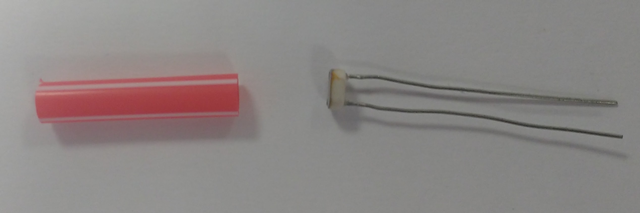
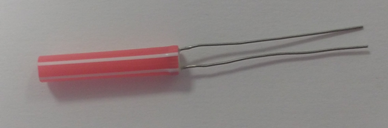
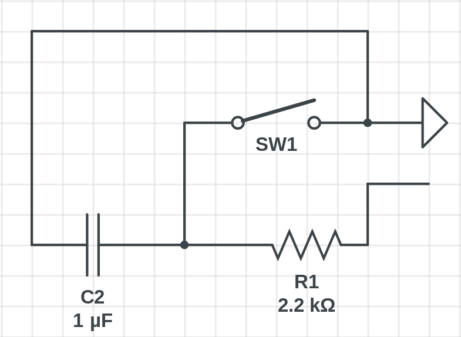
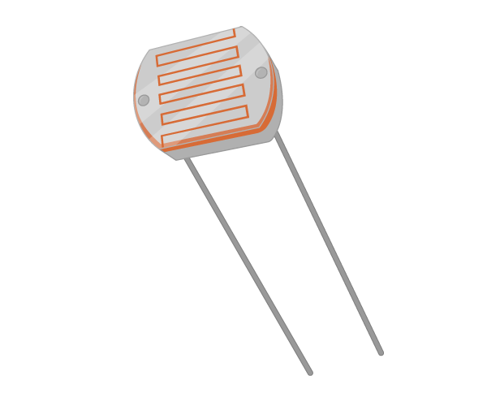
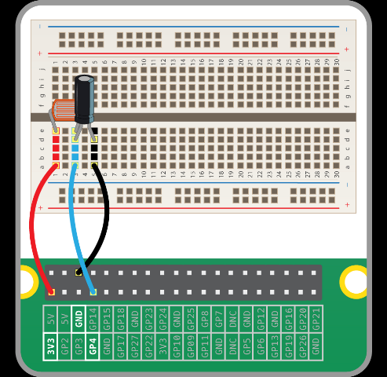
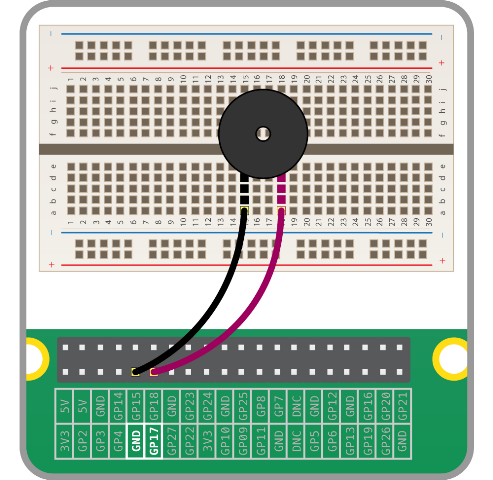
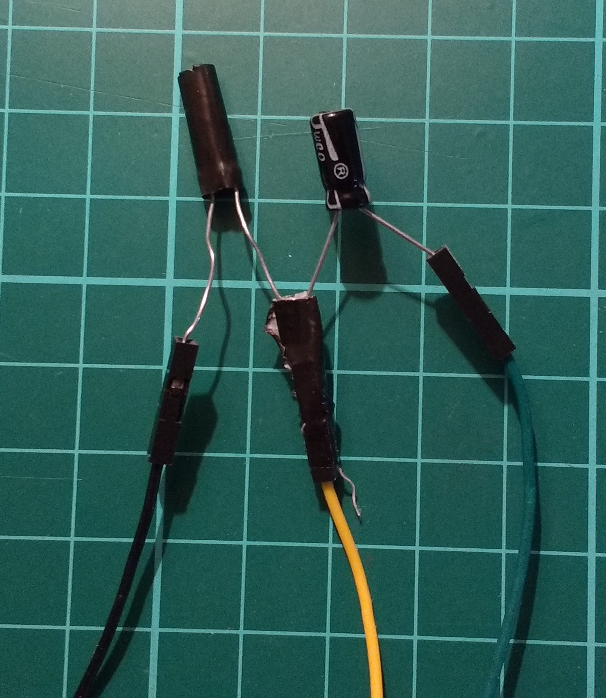
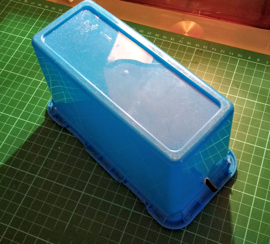
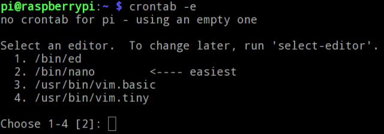
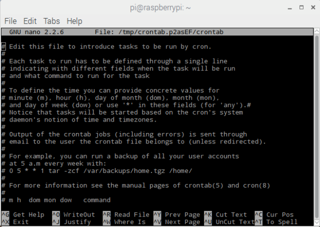

laser tripwire - лазерний детектор руху

[оригінал](https://projects.raspberrypi.org/en/projects/laser-tripwire) 

## Introduction

In this resource you will use a laser pointer, a few electronic components, and a Raspberry Pi to make a laser tripwire. Each time a stealthy intruder breaks the laser beam, the Raspberry Pi will sound the alarm via a buzzer or a speaker.

[Відео Youtube з демонстрацією роботи](https://www.youtube.com/watch?v=uzx3jpgcIsE&feature=emb_logo) 

By completing this project you will learn how to:

- Measure light levels with an LDR
- Control a buzzer
- Play sounds using the PyGame Python module
- Write and call simple lambda functions


## What you will need

### Hardware

- A Raspberry Pi
- A breadboard
- A 1µF capacitor
- A light-dependent resistor (LDR)
- 3 female-male jumper leads (for testing)
- 3 female-female jumper leads
- A laser pointer
- A drinking straw

### Software

- All required software is pre-installed on Raspbian

## Detecting a broken beam

Your first step will be to create a simple prototype on a breadboard to detect whether or not a beam of light is hitting the **l**ight-**d**ependent **r**esistor (LDR).

### Shielding the LDR

It’s a good idea to shield your LDR to make sure that only light from the laser pointer will trigger your program. You can do this with a small roll of paper, or even more easily with a section of a drinking straw.





### Building and coding your light sensor

Now you’re going to need to do a couple of things:

- Set up your circuit using a capacitor and an LDR wired to your Raspberry Pi. There’s an optional section below which explains how RC timing circuits work. The other section details how to use Python to detect light levels.

### RC timing theory

RC stands for **r**esistor and **c**apacitor. RC circuits have a variety of functions, one of which is to use them to help digital devices read analogue components.
In the timing circuit illustrated below, a 2.2kΩ resistor has been placed in series with a 1µF capacitor. They are connected to a 3.3V power supply. The switch in the circuit can be pushed to short the circuit and thereby **earth** both the capacitor and the resistor.



To understand what happens in this circuit, you can watch this video, or read the explanation below.

[Відео Youtube](https://www.youtube.com/watch?v=sNn3vjEU_H0&feature=emb_logo)

When the switch is open, current can flow though the resistor and the capacitor. The capacitor starts to store charge immediately. This causes the voltage across the capacitor to increase. Eventually, the capacitor is fully charged and the voltage across it will match that of the supply - in this case 3.3V.

Closing the switch shorts the circuit, and causes charge to flow straight to earth or ground. As a consequence, the capacitor rapidly discharges, which causes the voltage to drop to zero almost instantly. Opening the switch will start the process of charging the capacitor all over again.

The rate at which the capacitor charges is constant as long as the resistance is constant. Using a resistor with a larger resistance will case the charging process to slow down. Using a smaller resistance will make charging faster.

If you can measure the time it takes for the capacitor to charge, you can fairly accurately calculate the resistance of the resistor. This means that you could use this type of circuit to measure the resistance of a component such as a light-dependent resistor, a thermistor or a potentiometer. All these components have variable resistances.

### Using an LDR to measure light

In this resource, you will learn how to build a circuit using a **l**ight-**d**ependent **r**esistor (LDR, or photoresistor) and write a script on the Raspberry Pi to detect light.



The resistance of an LDR changes depending on the amount of light that is falling on it. The more light hits the LDR, the lower is its resistance. If you’re interested in the physics of how this works, you can have a look at [this resource](https://projects.raspberrypi.org/en/projects/laser-tripwire/generic-rc-charging-circuit).

The Raspberry Pi’s [GPIO](https://projects.raspberrypi.org/en/projects/laser-tripwire/rpi-gpio-pins) pins can be used with a variety of electronic components. Some components are [analogue, while others are digital](https://projects.raspberrypi.org/en/projects/laser-tripwire/generic-analogue-digital). Digital components are very easy to use with a Pi, because the Pi’s GPIO pins are only capable of being on or off, and in turn detecting whether another device is on or off. To use analogue components, for example LDRs, you need to do a little more work.

### Setting up the circuit

You are going to set up a **r**esistor-**c**apacitor circuit (RC circuit) using a 1µF capacitor and an LDR. The two components will need to be in series with each other. One leg of the LDR will be attached to a 3.3V pin (labeled **3V3**) of the Raspberry Pi. The negative leg of the capacitor will be attached to a ground pin (labeled **GND**). The positive leg of the capacitor will be connected to any of the standard GPIO pins on the Raspberry Pi. Here is one possible configuration of the circuit.



### The script on the Raspberry Pi

The code for the light sensor is fairly simple. It will provide you with a relative value of the light in the environment as a floating-point number between 0 and 1. The higher the value, the more light is falling on the LDR. In the example code below, it is assumed that the LDR has been wired to **GPIO 17**.

```
from gpiozero import LightSensor
ldr = LightSensor(17)
print(ldr.value)
```

### Other methods

The `LightSensor` class has the following other methods:

```
## Pause until no light is detected
wait_for_dark()
## Pause until light is detected
wait_for_light()
## Return True if light is detected
light_detected
## Function to run when it is dark
when_dark = my_function
## Function to run when it is light
when_light = my_function
```

Now you’re ready to write a script to detect when the laser beam is broken. You can use methods from the `gpiozero` module to do this. One of your options is to use a `while True` loop containing the `wait_for_dark` method. However, a better way might be to use the `when_dark` method. If you choose this method, you need to either create a function to print `'INTRUDER'`, or you could use a lambda function.

Using lambda expressions is a simple method of creating functions in Python in a single line. Although they are not essential in your programming, lambda expressions can be very helpful at times. They are particularly useful when you want to use a function as an argument in another function.

Here’s a simple example. Imagine you want to create a function that takes a number and adds `1` to it. You could write the following:

```python
def add_one(value):
	return value + 1

answer = add_one(100)
```

This could be rewritten using a lambda expression:

```python
add_one = lambda value: value + 1

answer = add_one(100)
```

The general syntax for a lambda expression is to use the keyword `lambda` followed by the function’s parameters and then a colon (`:`). After the colon come the values to be returned by the function. For instance, this lambda expression can add two numbers together:

```python
add_two = lambda a, b: a + b

add_two(10, 5)
```

You can write more complicated lambda expressions, and even add conditional statements into the return value. However, it’s best to keep lambdas simple, to make sure they remain readable.

If you need a little help, then have a look at the hints below.

### I need a hint

- Import the `LightSensor` class from `gpiozero`.
- Create an ‘ldr’ object for the GPIO pin to which you have connected the LDR.
- Use the `when_dark` method to trigger your `print`. The print command could either be inside another function, or called using a lambda function.

## Making some noise

There are two ways you can get you program to make some noise rather than just print ‘INTRUDER’. The first is to use a buzzer that is switched on when the laser beam is broken. The second is to use the PyGame module to play a sound through some speakers.

Have a look at the sections below that detail how to use buzzers and play sounds with PyGame. Choose the method your prefer, and then have a go at making some noise when the laser beam is broken. If you want to have a go at playing sounds through the speakers, then [this site](http://soundbible.com/royalty-free-sounds-1.html) has plenty of different ones to choose from. [This one in particular](http://soundbible.com/71-Dog-Growling-And-Barking.html) might be useful.

### Using a buzzer with a Raspberry Pi

A piezoelectric buzzer works by causing tiny and rapid vibrations of a ceramic disc when a voltage is applied to it. These vibrations in turn produce sound of a single frequency.

Piezoelectric buzzers are polarised components, so it is important to place them into your circuits the correct way around.

### Setting up a piezoelectric buzzer

Wiring a piezoelectric buzzer is very simple. Using a breadboard, you simply connect the positive leg of the buzzer to any **GPIO** pin on your Raspberry Pi, and the negative leg to a **Ground** pin. The positive leg is normally the longer of the two, and most buzzers are labelled to show which side is positive.



### Coding your buzzer

A piezoelectric buzzer is a very simple output device. You can use the `Buzzer` class in `gpiozero` to turn it on and off again. The code below assumes that the buzzer has been wired to **GPIO 17**.

```python
from gpiozero import Buzzer
buzzer = Buzzer(17)

buzzer.on()
```

### Other methods

The `Buzzer` class has the following methods:

```python
## Turn on the buzzer
buzzer.on()
## Turn off the buzzer
buzzer.off()
## Beep the buzzer (on and off for 1 second)
buzzer.beep()
## Beep the buzzer on and off for 0.1 seconds 10 times
buzzer.beep(0.1, 0.1, 10)
```

### Playing sound files with Python

To play a sound file with Python, you can use a module called `pygame`. It comes pre-installed on a Raspberry Pi, but if you are on another operating system you may need to use [pip](https://pip.pypa.io/en/stable/installing/) to install it.
On Linux and MacOS you can open a terminal and type:

```bash
sudo pip3 install pygame
```

On Windows you can open PowerShell and type:

```bash
pip3 install pygame
```

### Importing and initialising pygame

- First you will need to import the `pygame` module and initialise it.

```python
import pygame
pygame.init()
```

### Playing a sound

- Next you can create a `Sound` object and provide it with the path to your file.

```python
my_sound = pygame.mixer.Sound('path/to/my/soundfile.wav')
```

- Then you can play the sound.

```python
my_sound.play()
```

## Building your laser tripwire

Once the circuit has been tested, you can wire up the components directly to the Raspberry Pi as shown below.

1. Place one leg of the LDR and the long leg of the capacitor into a female-to-female jumper lead. Then tape it up to secure the legs.
2. Place the remaining legs into jumper leads, then plug it all back into the Raspberry Pi.



You can place the Raspberry Pi and components in a housing to conceal them if you wish. Here we have used a plastic box with a hole made in it for the straw:



1. Place your container near a doorway. Then affix the laser pointer to the wall so the beam is focused down the straw.
2. Now run the code and test your laser tripwire.
3. If you want to run your code as soon as the Raspberry Pi boots up, then have a look at the instructions below for automating tasks with **Cron**.

### Automate tasks with Cron

Sometime you don’t want to manually start a script that you have written. You may need the script to run once every hour, or maybe once every thirty seconds, or every time your computer starts. On *nix systems this is a fairly easy task, because you can use a program called **Cron**. Cron will run any command you tell it to run, whenever you have scheduled for it to do so. It will reference what is known as the **cron table**, which is normally abbreviated to **crontab**.

### Editing the crontab

- To open the crontab, you first need to open a terminal window. Then you can type:

  ```bash
  crontab -e
  ```

- The `-e` in this command is short for *edit*. If this is your first time opening your crontab, then you’ll be asked which text editor you would like to use.

  

- Unless you have plenty of experience using **ed** or **vim**, the simplest editor to use is **nano**, so type `2` to choose it and press `Enter`.

  

- nano is a simple command line text editor. If you want to learn more about using nano, you can have a look at [this resource](https://projects.raspberrypi.org/en/projects/laser-tripwire/nix-bash-using-nano).

### Syntax for Cron

The crontab contains all the basic information you need to get started. Each line that starts with a `#` is a comment, and therefore ignored by the computer. At the bottom of the crontab you should see a line that looks like this:

```bash
# m h  dom mon dow   command
```

- `m` is short for **minute**
- `h` is short for **hour**
- `dom` is short for **day of the month**
- `mon` is short for **month**
- `dow` is short for **day of the week**
- `command` is the bash command that you want to run

### Creating a new Cron job

To create a Cron job you need to decide under which circumstances you would like it to run. For instance, if you wanted to run a Python script on the 30th minute of every hour, you would write the following:

```bash
30 * * * * python3 /home/pi/my_cool_script.py
```

If you wanted it to run every 30 minutes you would use:

```bash
*/30 * * * * python3 /home/pi/my_cool_script.py
```

The `30` is telling the script to run every 30 minutes. The asterisks indicate that the script needs to run for all **legal values** for the other fields.

Here are a few more examples.

| What will happen…                                | crontab syntax                               |
| ------------------------------------------------ | -------------------------------------------- |
| Run a script at 11:59 every Tuesday              | `59 11 * * 2 python3 /home/pi/my_script.py`  |
| Run a script once a week on Monday               | `0 0 * * 1 python3 /home/pi/my_script.py`    |
| Run a script at 12:00 on the 1st of Jan and June | `0 12 1 1,6 * python3 /home/pi/my_script.py` |

### Run on boot

One incredibly useful feature of Cron is its ability to run a command when the computer boots up. To do this, you use the `@reboot` syntax. For instance:

```bash
@reboot python3 /home/pi/my_cool_script.py
```

### Edit and save the file

You can add in your cron job to the bottom of the crontab. Then save and exit nano by pressing `Ctrl+x` and then typing in ‘y’ when you are prompted to save.