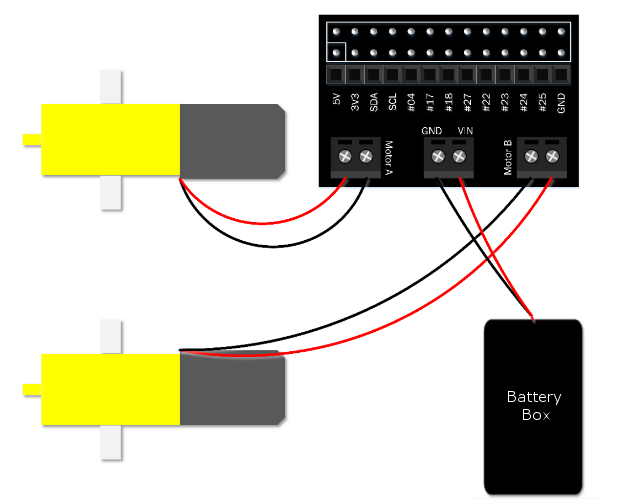

## Using motors

Motors are great for physical computing: they allow you to turn a wheel forwards and backwards, or make something spin around.

A motor can’t be controlled directly from the Raspberry Pi’s GPIO  pins, because it needs a variable supply of 5 volts. This means you need to power it separately. However, motor controller add-on boards can be  used to provide this functionality.

In this guide, you’ll be controlling two motors from your Raspberry  Pi using Python on the desktop. First, it’s best just to learn how to  control the motor. Then, once you have it working, you could easily use  your code to drive a Raspberry Pi-powered robot by detaching the  monitor, mouse, and keyboard and building a robot around a chassis.

### H bridge

A motor can be driven forwards or backwards depending on which way  around current flows through it. However, it would be awkward to have to rewire a motor, every time you want to change the direction it spins.  To overcome this issue, motor controller boards include an H bridge. An H bridge uses 4 transistors to allow digital control of which way current flows through the motor. Most H bridges also contain *flyback diodes*. A flyback diode prevents the voltage spike that is generated by the  motor when it is no longer powered (but still spinning) from damaging  delicate electronics.


*Image credit: [Wikipedia](https://en.wikipedia.org/wiki/H_bridge), CC BY-SA*

### Wiring

You’ll need to wire up two motors and your battery pack using the motor controller.

- With your Pi switched off, mount your motor controller board on the GPIO pins:

  

- Connect a battery pack to the power ports of the motor  controller, connecting the positive (red) battery wire to the positive  (+) power terminal on the motor controller, and the negative (black)  battery wire to the negative (-) power terminal on the motor controller, and connect two motors:

  

- You’ll need to know which GPIO pins your motor controller uses.  Refer to the board’s documentation. This will usually be described as  Motor A and Motor B, or MA1, MA2, MB1, and MB2. Make a note of these pin numbers. If you’re not sure which is which, you can investigate this  next.

### Motor class

You can use the built-in `Motor` class to control motors.

- Import the `Motor` class:

  ```python
  from gpiozero import Motor
  ```

- Now create a `Motor` instance using the pin numbers for each motor:

  ```python
  motor1 = Motor(4, 14)
  motor2 = Motor(17, 27)
  ```

  Note: to make it easier to see which pin is which, you can use `Motor(forward=4, backward=14)` for future reference.

- Now drive one of the motors forward using the following code:

  ```python
  motor1.forward()
  ```

- And the other backwards:

  ```python
  motor2.backward()
  ```

- Or try half speed:

  ```python
  motor1.forward(0.5)
  motor2.backward(0.5)
  ```

- The `Motor` class also allows you to reverse the motor’s direction. Try using this loop:

  ```python
  motor1.forward()
  motor2.backward()
  while True:
      sleep(5)
      motor1.reverse()
      motor2.reverse()
  ```

  This will make the motors spin in opposite directions, then switch every five seconds. Press **Ctrl + C** to exit the loop.

- Now stop the motors:

  ```python
  motor1.stop()
  motor2.stop()
  ```

### Robot class

If you had a robot with two wheels you would want to control the two  motors together, rather than separately, just like you did for the two  pins of each motor. Luckily, there’s also a `Robot` class in GPIO Zero.

- Import the `Robot` class:

  ```python
  from gpiozero import Robot
  ```

- Now create a `Robot` instance using the pin numbers for each motor:

  ```python
  robot = Robot((4, 14), (17, 27))
  ```

  Note: to make it easier to see which pin is which, you can use `Robot(left=(4, 14), right=(17, 27))` for future reference.

- Now drive one of the motors forward using the following code:

  ```python
  robot.forward()
  ```

  Both motors should now be driving forwards.

- And backwards:

  ```python
  robot.backward()
  ```

  Both motors should now be driving backwards.

- Try reverse a few times:

  ```python
  robot.reverse()
  robot.reverse()
  robot.reverse()
  ```

- Or try half speed:

  ```python
  robot.forward(0.5)
  ```

- That’s not all! What would happen if the left wheel went forwards and the right wheel went backwards? The robot would turn right. Try it:

  ```python
  robot.right()
  ```

- Then try this:

  ```python
  robot.left()
  ```

- Now stop the robot:

  ```python
  robot.stop()
  ```