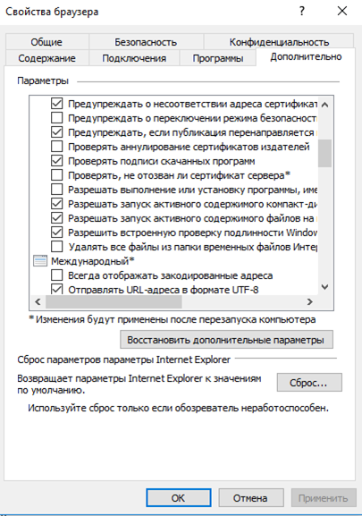
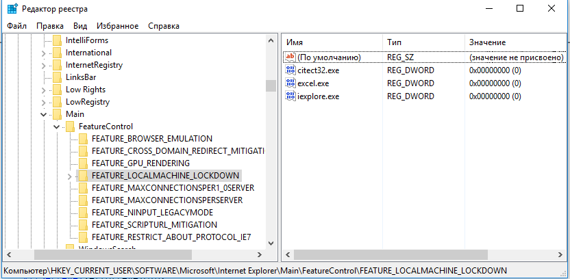
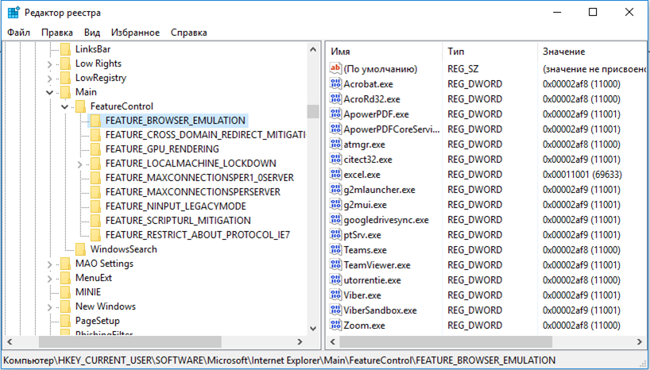

# WebBrowser (IE Explorer)

Посилання на форумі.

http://asu.in.ua/viewtopic.php?f=278&t=1951

Налаштування ActiveX WebBrowser відрізняється від тих, що виставлені в браузері. Налштування змінюються в реєстрі за допомогою ключів Internet Feature Control Keys, які описані [за посиланням](https://docs.microsoft.com/en-us/previous-versions/windows/internet-explorer/ie-developer/general-info/ee330720(v=vs.85))

Так, наприклад [Local Machine Lockdown](https://docs.microsoft.com/en-us/previous-versions/windows/internet-explorer/ie-developer/general-info/ee330732(v=vs.85)#local-machine-lockdown) аналогічний налаштуванню дозволу запуску активного змісту з на локальному комп'ютері.  

Для дозволу такого вмісту необхідно для конкретного застосунку, де використовується компонент поставити 0.

Слід зауважити що для можливості вступання в силу параметрів реєстру одразу треба виставити цю опцію для розділу реєстра CURRENT_USER, після чого перезавантажити програму.

Для коректної роботи усіх функцій компоненту, варто виставити опцію [Browser Emulation](https://docs.microsoft.com/en-us/previous-versions/windows/internet-explorer/ie-developer/general-info/ee330730(v=vs.85)#browser-emulation) де вказується конкретна версія емуляції.

