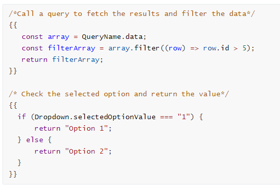
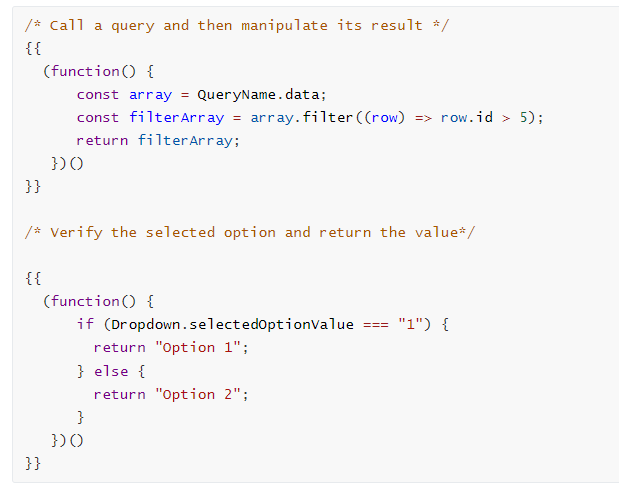

# Writing Code

https://docs.appsmith.com/core-concepts/writing-code

Appsmith дозволяє писати код JavaScript майже скрізь у графічному інтерфейсі у властивостях віджетів, прослуховувачах подій, запитах та інших налаштуваннях. За допомогою редактора JavaScript і інструментів налагодження ви можете писати складний багаторазовий код і створювати масштабовані програми.

Appsmith також надає можливість [імпортувати зовнішні бібліотеки](https://docs.appsmith.com/core-concepts/writing-code/ext-libraries#custom-javascript-libraries), допомагаючи вам розширити можливості ваших програм.

## Code in JavaScript

Ви можете написати JS-код у **синтаксисі moustache `{{ }}`**. Ви можете посилатися на сутності (віджети, запити, об’єкти JS) і пов’язані з ними дані та властивості як змінні JavaScript і виконувати над ними операції за допомогою вбудованих функцій.

Наразі Appsmith підтримує дві форми коду JavaScript для динамічно оцінюваних властивостей:

#### Single-line code

Appsmith підтримує написання однорядкового коду в `{{ }}` і інтерпретує все, що написано в дужках, як вираз JavaScript. Вихід виразу JS прив’язаний до відповідної властивості. Ви можете написати однорядковий код для таких випадків, як виконання перетворень над масивами або використання тернарних операторів для умовних виразів. Наприклад:

```javascript
/*Filter the data array received from a query*/
{{ QueryName.data.filter((row) => row.id > 5 ) }}

/*Ternary condition*/
{{SelectWidgetName.selectedOptionValue === "1" ? "Option 1" : "Option 2" }} 
```

Іноді вам може знадобитися об’єднати кілька операцій, таких як виконання запитів, виклик функцій/методів, використання умовних виразів тощо, в одному рядку, щоб досягти бажаного результату. 

У цьому прикладі показано, як виконати кілька дій для успішного виконання запиту `updateData`.


Якщо ваш вираз стає надто складним або складним, щоб вмістити його в один рядок, скористайтеся багаторядковим кодом, який описано в наступному розділі. Щоб зберегти код читабельним, ви також можете написати допоміжну функцію в [JS Object](https://docs.appsmith.com/core-concepts/writing-code/javascript-editor-beta#js-object).

#### Multi-line code

Як випливає з назви, ви можете розбити код на кілька рядків, щоб зробити його читабельним, а також використовувати **[вираз функції, що негайно викликається (IIFE - Immediately Invoked Function Expression)](https://developer.mozilla.org/en-US/docs/Glossary/IIFE). )** для написання функцій або блоків коду з операторами повернення.

У цьому прикладі показано, як закодувати обробник подій кнопки `onClick` для виконання набору дій.

```javascript
{{
  storeValue("userID", 42);  
  console.log(appsmith.store.userID); 
  showAlert("userID saved");
}}
```

У прикладі нижче показано, як реструктурувати недійсний блок коду за допомогою **IIFE**.

**Invalid code**



 **Valid code**



#### JS Objects

JS Objects зберігає колекцію змінних і функцій, і ви можете використовувати її для написання багаторазового коду в Appsmith. За допомогою нього ви можете маніпулювати даними, обробляти події, виконувати розширені операції, писати складну логіку та викликати їх у будь-якому місці програми, де це визначено. Ви можете створювати об’єкти JS у редакторі JavaScript. Щоб отримати додаткові відомості, перегляньте [Об’єкти JS](https://docs.appsmith.com/core-concepts/writing-code/javascript-editor-beta).

## Програмне оновлення віджетів

Під час роботи з [віджетами](https://docs.appsmith.com/reference/widgets) в Appsmith вам може знадобитися динамічно оновлювати значення у властивостях віджетів.

Appsmith дотримується **парадигми реактивного програмування**. Замість оновлення властивостей і станів віджетів через пряме призначення змінних (x = 5), віджети підключені та обмінюються даними один з одним. Коли значення оновлюється, усі віджети, які залежать від цього зміненого значення, також оновлюються автоматично. Наприклад:

Припустімо, у вас є два віджети введення з іменами `Input1` і `Input 2`.

У цьому прикладі показано, як оновити `Input2` значенням, введеним у `Input1`. Вставте наступний код у властивість `Default Value` Input2.

```javascript
{{Input1.text}}
```

Введіть значення у `Input1` і подивіться, як значення оновлюється у `Input2`.

------

Припустімо, у вас є два віджети введення та один віджет кнопки з іменами `Input1`, `Input2` і `Button1` відповідно. У цьому прикладі показано, як оновити `Input2` значенням у `Input1` після натискання кнопки. Тут використовується функція [storeValue()](https://docs.appsmith.com/reference/appsmith-framework/widget-actions/store-value).

Вставте наступний код у подію `onClick` кнопки `Button1`.

```javascript
{{storeValue('inputData',Input1.text)}}
```

Вставте наступний код у властивість `Default Value` Input2.

```javascript
{{appsmith.store.inputData}}
```

Enter a value in `Input1`. On button click, the value updates in `Input2`.

Введіть значення в `Input1`. Після натискання кнопки значення оновлюється у `Input2`.