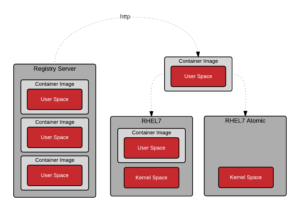
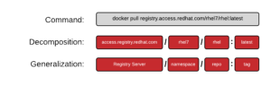
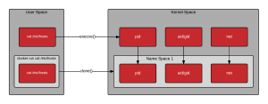
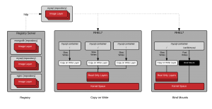
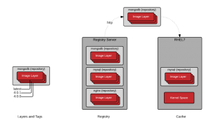

# A Practical Introduction to Container Terminology

https://developers.redhat.com/blog/2018/02/22/container-terminology-practical-introduction#

Ви можете подумати, що контейнери здаються досить простим поняттям, то чому мені потрібно читати про термінологію контейнерів? У моїй роботі як проповідника контейнерних технологій я стикався з неправильним використанням контейнерної термінології, через що люди спотикалися на шляху до оволодіння контейнерами. Такі терміни, як контейнери та зображення, використовуються як взаємозамінні, але існують важливі концептуальні відмінності. У світі контейнерів репозиторій має інше значення, ніж ви очікували. Крім того, ландшафт для контейнерних технологій є більшим, ніж просто докер. Без розуміння термінології може бути важко зрозуміти ключові відмінності між docker і (виберіть улюблені, CRI-O, rkt, lxc/lxd) або зрозуміти, що Open Container Initiative робить для стандартизації технології контейнерів.

## Background

Розпочати роботу з контейнерами Linux оманливо просто. Потрібно лише кілька хвилин, щоб встановити механізм контейнера, як-от докер, і запустити перші команди. За кілька хвилин ви створите свій перший образ контейнера та поділитеся ним. Далі ви починаєте знайомий процес створення архітектури контейнерного середовища, схожого на виробництво, і відчуваєте прозріння, що необхідно розуміти багато термінології та технологій за лаштунками. Гірше того, багато з наведених нижче термінів використовуються як синоніми... часто викликаючи чималу плутанину у новачків.

- Container
- Image
- Container Image
- Image Layer
- Registry
- Repository
- Tag
- Base Image
- Platform Image
- Layer

Розуміння термінології, викладеної в цьому технічному словнику, забезпечить вам глибше розуміння основних технологій. Це допоможе вам і вашим командам говорити однією мовою, а також дасть уявлення про те, як краще створити середовище контейнера для ваших цілей. Це глибше розуміння дасть нам змогу, як індустрії та ширшій спільноті, створювати нові архітектури та рішення. Зауважте, цей технічний словник передбачає, що читач уже має розуміння того, як запускати контейнери. Якщо вам потрібна підготовка, спробуйте почати з *[A ](http://developers.redhat.com/blog/2014/05/15/practical-introduction-to-docker-containers/)[Практичний вступ до контейнерів Docker](https://developers.redhat.com/blog/2014/05/15/practical-introduction-to-docker-containers)* у блозі розробників Red Hat.

## Containers 101

Щоб зрозуміти термінологію контейнерів, важливо точно розуміти, що таке контейнер, з технічною точністю. Контейнер - це насправді дві різні речі. Як і звичайна програма Linux, контейнери насправді мають два стани – стан спокою та роботу. У стані спокою контейнер — це файл (або набір файлів), який зберігається на диску. Це називається [образом контейнера (Container Image)](https://developers.redhat.com/blog/2018/02/22/container-terminology-practical-introduction#h.dqlu6589ootw) або [сховищем контейнерів (Container Repository)](https:/ /developers.redhat.com/blog/2018/02/22/container-terminology-practical-introduction#h.20722ydfjdj8). Коли ви вводите команду для запуску контейнера, [Container Engine](https://developers.redhat.com/blog/2018/02/22/container-terminology-practical-introduction#h.6yt1ex5wfo3l) розпаковує необхідний [ файли та метадані](https://docs.google.com/presentation/d/1OpsvPvA82HJjHN3Vm2oVrqca1FCfn0PAfxGZ2w_ZZgc/edit#slide=id.g2441f8cc8d_0_49), а потім передає їх ядру Linux. Запуск контейнера дуже схожий на запуск звичайного процесу Linux і вимагає виклику API до ядра Linux. Цей виклик API зазвичай ініціює додаткову ізоляцію та [монтує копію](https://docs.google.com/presentation/d/1fC9cKR2-kFW5l-VEk0Z5_1vriYpROXOXM_5rhyVnBi4/edit#slide=id.g206624ca32_0_1209) файлів, які були в контейнері образу. Після запуску [Контейнери](https://developers.redhat.com/blog/2018/02/22/container-terminology-practical-introduction#h.j2uq93kgxe0e) є лише процесом Linux. Процес запуску контейнерів, а також формат зображення на диску означується та регулюються стандартами.

Існує кілька конкуруючих форматів [Зображення контейнера](https://developers.redhat.com/blog/2018/02/22/container-terminology-practical-introduction#h.dqlu6589ootw) ([Docker](https://github .com/docker/docker/blob/master/image/spec/v1.md), [Appc](https://www.redhat.com/en/technologies/cloud-computing/openshift), [LXD](https ://ubuntu.com/blog/lxd-2-0-image-management-512)), але галузь рухається вперед із стандартом, який регулюється [Ініціативою відкритого контейнера](https://opencontainers.org/faq /) - іноді називають просто відкритими контейнерами або OCI. Обсяг OCI включає [специфікацію формату образу контейнера](https://github.com/opencontainers/image-spec/blob/master/README.md), яка визначає дисковий формат для зображень контейнера, а також метадані, які визначають такі речі, як архітектура обладнання та операційна система (Linux, Windows тощо). Формат образів-контейнерів для масштабів галузі дозволяє процвітати екосистемам програмного забезпечення – різні окремі учасники, проекти та постачальники можуть створювати сумісні образи та інструменти. Користувачі хочуть взаємодії між інструментами для підписання, сканування, створення, запуску, переміщення та керування зображеннями контейнерів.

Є також кілька конкуруючих [Container Engines](https://developers.redhat.com/blog/2018/02/22/container-terminology-practical-introduction#h.6yt1ex5wfo3l), зокрема [Docker](https://www .docker.com/), [CRI-O](http://cri-o.io/), [Railcar](https://github.com/oracle/railcar), [RKT](https:// github.com/coreos/rkt), [LXC](https://linuxcontainers.org/lxc/introduction/). Ці механізми контейнерів беруть [образ контейнера](https://developers.redhat.com/blog/2018/02/22/container-terminology-practical-introduction#h.dqlu6589ootw) і перетворюють його на [Контейнер](https ://developers.redhat.com/blog/2018/02/22/container-terminology-practical-introduction#h.j2uq93kgxe0e) (він же запущені процеси). Як це відбувається, регулюється [областю OCI](https://www.opencontainers.org/about/oci-scope-table), яка включає [Специфікацію середовища виконання контейнера](https://github.com/opencontainers /runtime-spec/blob/master/README.md) і [Довідкова реалізація середовища виконання](https://github.com/opencontainers/runc) під назвою [RunC](https://github.com/opencontainers/runc) . Ця еталонна реалізація є відкритим вихідним кодом, регулюється моделлю розвитку спільноти та зазвичай використовується багатьма механізмами контейнерів для зв’язку з ядром хоста під час створення контейнерів.

Інструменти, націлені на OCI [специфікацію формату образу контейнера](https://github.com/opencontainers/image-spec/blob/master/README.md) і [специфікацію середовища виконання контейнера](https://github.com/opencontainers /runtime-spec/blob/master/README.md) забезпечують переносимість між широкою екосистемою контейнерних платформ, контейнерних двигунів і допоміжних інструментів між хмарними провайдерами та локальними архітектурами. Розуміння номенклатури, стандартів контейнерів і архітектури будівельних блоків контейнерів гарантує, що ви зможете спілкуватися з іншими архітекторами для створення масштабованих і підтримуваних контейнерних додатків і середовищ для продуктивної роботи контейнерів на довгі роки.

## Basic Vocabulary

### Container Image

See also [Repository](https://developers.redhat.com/blog/2018/02/22/container-terminology-practical-introduction#h.20722ydfjdj8). 

Образ контейнера, у найпростішому визначенні, — це файл, який витягується з [сервера реєстру (Registry Server)](https://developers.redhat.com/blog/2018/02/22/container-terminology-practical-introduction#h.4cxnedx7tmvq)  і використовується локально як точка монтування під час запуску [Контейнерів](https://developers.redhat.com/blog/2018/02/22/container-terminology-practical-introduction#h.j2uq93kgxe0e). Спільнота контейнерів досить часто використовує «зображення контейнера», але ця номенклатура може бути досить заплутаною. Docker, RKT і навіть LXD працюють на основі концепції отримання віддалених файлів і запуску їх як контейнера. Кожна з цих технологій по-різному обробляє зображення контейнерів. LXD отримує єдине зображення контейнера ([один шар](https://developers.redhat.com/blog/2018/02/22/container-terminology-practical-introduction#h.epuvi2fkxbx2)), тоді як докер і RKT використовують OCI зображення, які можуть складатися з кількох шарів.

Технічно це набагато складніше, ніж один файл на [сервері реєстру](https://developers.redhat.com/blog/2018/02/22/container-terminology-practical-introduction#h.4cxnedx7tmvq). Коли люди використовують термін «образ контейнера», вони часто мають на увазі [репозиторій](https://developers.redhat.com/blog/2018/02/22/container-terminology-practical-introduction#h.20722ydfjdj8) і посилаючись на набір кількох контейнерів [Шарів образів](https://developers.redhat.com/blog/2018/02/22/container-terminology-practical-introduction#h.epuvi2fkxbx2), а також метадані, які надають додаткову інформацію про шари.

Концепція образу контейнера неявно містить концепцію [формату образу контейнера](https://developers.redhat.com/blog/2018/02/22/container-terminology-practical-introduction#h.dgn6r69i32gs).

### Container Image Format

See [Container Image](https://developers.redhat.com/blog/2018/02/22/container-terminology-practical-introduction#h.dqlu6589ootw) and [Background](https://developers.redhat.com/blog/2018/02/22/container-terminology-practical-introduction#h.61a70hm1gl8x).

Historically, each [Container Engine](https://developers.redhat.com/blog/2018/02/22/container-terminology-practical-introduction#h.6yt1ex5wfo3l) had its container images format. LXD, RKT, and Docker all had their own image formats. Some were made up of a [single layer](https://developers.redhat.com/blog/2018/02/22/container-terminology-practical-introduction#h.epuvi2fkxbx2), while others were made up of a bunch of layers in a tree structure. Today, almost all major tools and engines have moved to a format defined by the [Open Container Initiative (OCI)](https://opencontainers.org/faq/).This image format defines the[ layers and metadata](https://docs.google.com/presentation/d/1OpsvPvA82HJjHN3Vm2oVrqca1FCfn0PAfxGZ2w_ZZgc/edit#slide=id.g2441f8cc8d_0_49) within a container image. Essentially, the OCI image format defines a  container image composed of tar files for each layer, and a  manifest.json file with the metadata.

The [Open Container Initiative (OCI)](https://opencontainers.org/faq/), which was originally based on the [Docker V2 image format](https://blog.docker.com/2017/07/demystifying-open-container-initiative-oci-specifications/), has successfully unified a wide ecosystem of container engines, cloud  providers and tools providers (security scanning, signing, building and  moving). This will help protect users as the invest in knowledge, and  tooling in their environments.

### Container Engine

See also [Container Runtime](https://developers.redhat.com/blog/2018/02/22/container-terminology-practical-introduction#h.6yt1ex5wfo55).

Контейнерний рушій  — це частина програмного забезпечення, яка приймає запити користувачів, включаючи параметри командного рядка, витягує зображення та, з точки зору кінцевого користувача, запускає контейнер. Існує багато контейнерних рушіїв, включаючи Docker , RKT, CRI-O та LXD. Крім того, багато хмарних провайдерів, платформ як послуг (PaaS) і контейнерних платформ мають власні вбудовані механізми контейнерів, які використовують сумісні Docker або OCI [Образи контейнерів](https://developers.redhat.com/blog/2018/ 02/22/container-terminology-practical-introduction#h.dqlu6589ootw). Наявність галузевого стандарту [Формат образу контейнера](https://developers.redhat.com/blog/2018/02/22/container-terminology-practical-introduction#h.dgn6r69i32gs) забезпечує взаємодію між усіма цими різними платформами.

Переходячи на один рівень глибше, більшість механізмів контейнерів фактично не запускають контейнери, вони покладаються на OCI-сумісне середовище виконання, таке як runc. Як правило, рушій контейнера відповідає за:

- Handling user input
- Handling input over an API often from a [Container Orchestrator](https://developers.redhat.com/blog/2018/02/22/container-terminology-practical-introduction#h.6yt1ex5wfo66)
- Pulling the [Container Images](https://developers.redhat.com/blog/2018/02/22/container-terminology-practical-introduction#h.dqlu6589ootw) from the Registry Server
- Expanding decompressing and expanding the container image on disk using a Graph Driver (block, or file depending on driver)
- Preparing a container mount point, typically on copy-on-write storage (again block or file depending on driver)
- Preparing the metadata which will be passed to the container [Container Runtime](http://h.6yt1ex5wfo55) to start the [Container](https://developers.redhat.com/blog/2018/02/22/container-terminology-practical-introduction#h.j2uq93kgxe0e) correctly
  - Using some defaults from the container image (ex.[ArchX86](https://github.com/opencontainers/runc/blob/master/vendor/github.com/opencontainers/runtime-spec/specs-go/config.go))
  - Using user input to override defaults in the container image (ex. CMD, ENTRYPOINT)
  - Using defaults specified by the container image (ex. [SECCOM](https://github.com/opencontainers/runc/blob/master/vendor/github.com/opencontainers/runtime-spec/specs-go/config.go) rules)
- Calling the Container Runtime

For an even deeper understanding, please see [Understanding the Container Standards](https://docs.google.com/presentation/d/1OpsvPvA82HJjHN3Vm2oVrqca1FCfn0PAfxGZ2w_ZZgc/edit#slide=id.g2441f8cc8d_0_80). See also [Container Runtime](https://developers.redhat.com/blog/2018/02/22/container-terminology-practical-introduction#h.6yt1ex5wfo55).

### Container

Онтейнери існують в операційних системах досить довго. Контейнер — це екземпляр  [Container Image](https://developers.redhat.com/blog/2018/02/22/container-terminology-practical-introduction#h.dqlu6589ootw) чсу виконання. Контейнер — це стандартний процес Linux, який зазвичай створюється через системний виклик [clone() замість fork() або exec()](http://rhelblog.redhat.com/2015/09/17/architecting-containers-part- 2-чому-простір-користувача-важливий-2/). Крім того, контейнери часто додатково ізольовані за допомогою [cgroups](https://en.wikipedia.org/wiki/Cgroups), [SELinux](https://en.wikipedia.org/wiki/Security-Enhanced_Linux) або [AppArmor](https://en.wikipedia.org/wiki/AppArmor).

### Container Host

Хост контейнера — це система, яка запускає контейнеризовані процеси, які часто називають просто контейнерами. Це може бути, наприклад, [RHEL Atomic Host](https://access.redhat.com/articles/rhel-atomic-getting-started), що працює у віртуальній машині, як екземпляр у загальнодоступній хмарі або на голому металі у вашому центрі обробки даних. Після того, як образ контейнера (він же репозиторій) буде отримано з [сервера реєстру](https://developers.redhat.com/blog/2018/02/22/container-terminology-practical-introduction#h.4cxnedx7tmvq) до локального хост контейнера, кажуть, що він знаходиться в локальному кеші.

Визначити, які сховища синхронізовано з локальним кеш-пам’яттю, можна за допомогою такої команди:

```
[root@rhel7 ~]# docker images -a

REPOSITORY                             TAG                     IMAGE ID                CREATED                 VIRTUAL SIZE
registry.access.redhat.com/rhel7   latest                  6883d5422f4e            3 weeks ago             201.7 MB
```

### Registry Server

Сервер реєстру — це, по суті, фантастичний файловий сервер, який використовується для зберігання сховищ докерів. Як правило, сервер реєстру вказується як звичайне ім’я DNS і, за бажанням, номер порту для підключення. Велика частина цінності екосистеми докерів походить від можливості надсилати та витягувати репозиторії із серверів реєстру.



Якщо демон докерів не має локально кешованої копії репозиторію, він автоматично витягне її з сервера реєстру. Більшість дистрибутивів Linux мають демон докерів, налаштований на отримання даних із docker.io, але в деяких дистрибутивах Linux його можна налаштувати. Наприклад, Red Hat Enterprise Linux налаштовано на отримання репозиторіїв спочатку з registry.access.redhat.com, а потім спробує docker.io (Docker Hub).

Важливо підкреслити, що існує неявна довіра до сервера реєстру. Ви повинні визначити, наскільки ви довіряєте вмісту, наданому реєстром, і ви можете дозволити або заблокувати певні реєстри. Крім безпеки, існують інші проблеми, наприклад доступ користувачів до ліцензованого програмного забезпечення та проблеми з відповідністю. Простота, з якою докер дозволяє користувачам завантажувати програмне забезпечення, робить критично важливим, щоб ви довіряли вихідному вмісту.

У Red Hat Enterprise Linux стандартний реєстр докерів можна налаштувати. Певні сервери реєстру можна додати або заблокувати в RHEL7 і RHEL7 Atomic, [змінивши конфігурацію](http://rhelblog.redhat.com/2015/04/15/understanding-the-changes-to-docker-search-and- файл docker-pull-in-red-hat-enterprise-linux-7-1/):

```
vi /etc/sysconfig/docker
```

In RHEL7 and RHEL 7 Atomic, Red Hat’s registry server is configured out of the box:

```
ADD_REGISTRY='--add-registry registry.access.redhat.com'
```

As a matter of security, it may be useful to block public docker repositories such as DockerHub:

```
# BLOCK_REGISTRY='--block-registry'
```


Red Hat also offers an integrated Registry Server with [OpenShift Container Platform](https://docs.openshift.com/container-platform/3.7/install_config/registry/index.html), a standalone enterprise Registry Server with [Quay Enterprise](https://quay.io/plans/?tab=enterprise), as well as cloud based, public and private repositories on [Quay.io](https://quay.io/plans/).

## Container Orchestration

Часто команди починають із встановлення [контейнерного хосту](https://developers.redhat.com/blog/2018/02/22/container-terminology-practical-introduction#h.8tyd9p17othl), а потім витягують [зображення контейнерів]( https://developers.redhat.com/blog/2018/02/22/container-terminology-practical-introduction#h.dqlu6589ootw). Потім вони переходять до створення нових [зображень контейнерів](https://developers.redhat.com/blog/2018/02/22/container-terminology-practical-introduction#h.dqlu6589ootw) і надсилання їх до  [Registry Server](https://developers.redhat.com/blog/2018/02/22/container-terminology-practical-introduction#h.6yt1ex5wfo3l), щоб поділитися з іншими в їхній команді. Через деякий час вони хочуть з’єднати разом кілька контейнерів і розгорнути їх як єдине ціле. Нарешті, в якийсь момент вони хочуть підштовхнути цю одиницю до конвеєра (Dev/QA/Prod), що веде до виробництва. Це шлях до усвідомлення необхідності оркестровки.

A container orchestrator really does two things:

1. Dynamically schedules container workloads within a cluster of computers. This is often referred to as distributed computing.
2. Provides a standardized application definition file (kube yaml, docker compose, etc)

The above two features provide many capabilities:

1. Allows containers within an application to be scheduled completely separately. This is useful if: 
   - Allows the utilization of large clusters of [Container Hosts](https://developers.redhat.com/blog/2018/02/22/container-terminology-practical-introduction#h.8tyd9p17othl)
   - Individual containers fail (process hang, out of memory (OOM))
   - [Container Hosts](https://developers.redhat.com/blog/2018/02/22/container-terminology-practical-introduction#h.8tyd9p17othl) fail (disk, network, reboot)
   - [Container Engines](https://developers.redhat.com/blog/2018/02/22/container-terminology-practical-introduction#h.6yt1ex5wfo3l) fail (corruption, restart)
   - Individual containers need to be scaled up, or scaled down
2. It's easy to deploy new instances of the same application into new  environments. In a cloud native world, or traditional world, there are  many reasons why you might want to do this including: 
   - On developers laptop with a container orchestrator running
   - On a shared development environment in a private namespace
   - On a shared development environment in an internally public namespace for visibility and testing
   - On a quality assurance (QA) environment internally
   - On a load test environment dynamically provisioned and deprovisioned in the cloud
   - On a gold environment to test compatibility with production
   - On a production environment
   - On a disaster recovery environment
   - On a new production environment which has upgraded[ Container Hosts](https://developers.redhat.com/blog/2018/02/22/container-terminology-practical-introduction#h.8tyd9p17othl), [Container Engines](https://developers.redhat.com/blog/2018/02/22/container-terminology-practical-introduction#h.6yt1ex5wfo3l), or container orchestrators
   - On a new production environment with the same versions of [Container Host](https://developers.redhat.com/blog/2018/02/22/container-terminology-practical-introduction#h.8tyd9p17othl), [Container Engine](https://developers.redhat.com/blog/2018/02/22/container-terminology-practical-introduction#h.6yt1ex5wfo3l), and container orchestrator in a new geolocation (APAC, EMEA, etc)

There are many container schedulers being developed in the community and by vendors. Historically, [Swarm](https://docs.docker.com/engine/swarm/), [Mesos](http://mesos.apache.org/), and [Kubernetes](https://kubernetes.io/) were the big three, but recently even [Docker](https://www.docker.com/) and [Mesosphere](https://mesosphere.com/) have announced support for Kubernetes - as has almost every [major cloud service provider](https://kubernetes.io/partners/#kcsp). Kubernetes has become the defacto standard in container orchestration,  similar to Linux before it. If you are looking at container  orchestration, Red Hat recommends our enterprise distribution called [OpenShift](https://www.openshift.com/).

## Advanced Vocabulary

### Container Runtime

A container runtime a lower level component typically used in a [Container Engine](https://developers.redhat.com/blog/2018/02/22/container-terminology-practical-introduction#h.6yt1ex5wfo3l) but can also be used by hand for testing. The [Open Containers Initiative (OCI)](https://opencontainers.org/faq/) Runtime Standard reference implementation  is [runc](https://github.com/opencontainers/runc). This is the most widely used container runtime, but there are others OCI compliant runtimes, such as [crun](https://github.com/giuseppe/crun), [railcar](https://github.com/oracle/railcar), and [katacontainers](https://katacontainers.io/). Docker, CRI-O, and many other [Container Engines](https://developers.redhat.com/blog/2018/02/22/container-terminology-practical-introduction#h.6yt1ex5wfo3l) rely on [runc](https://github.com/opencontainers/runc).

The container runtime is responsible for:

- Consuming the container mount point provided by the [Container Engin](https://developers.redhat.com/blog/2018/02/22/container-terminology-practical-introduction#h.6yt1ex5wfo3l)e (can also be a plain directory for testing)
- Consuming the container metadata provided by the [Container Engine](https://developers.redhat.com/blog/2018/02/22/container-terminology-practical-introduction#h.6yt1ex5wfo3l) (can be a also be a manually crafted config.json for testing)
- Communicating with the kernel to start containerized processes (clone system call)
- Setting up cgroups
- Setting up SELinux Policy
- Setting up App Armor rules

To provide a bit of history, when the Docker engine was first  created it relied on LXC as the container runtime. Later, the Docker  team developed their own library called libcontainer to start  containers. This library was written in Golang, and compiled into the  original Docker engines. Finally, when the OCI was created, Docker  donated the libcontainer code and turned it into a standalone utility  called runc. Now, runc is the reference implementation and used by other [Container Engines](https://developers.redhat.com/blog/2018/02/22/container-terminology-practical-introduction#h.6yt1ex5wfo3l) such as CRI-O. At the lowest level, this provides the ability to start a container consistently, no matter the container engine. Runc is a very  terse utility and expects a mount point (directory) and meta-data  (config.json) to be provided to it. See this tutorial for more on [runc](https://github.com/opencontainers/runc/blob/master/README.md).

For an even deeper understanding, please see [Understanding the Container Standards](https://docs.google.com/presentation/d/1OpsvPvA82HJjHN3Vm2oVrqca1FCfn0PAfxGZ2w_ZZgc/edit#slide=id.g2441f8cc8d_0_80). See also [Container Runtime](https://developers.redhat.com/blog/2018/02/22/container-terminology-practical-introduction#h.6yt1ex5wfo55).

### Image Layer

Repositories are often referred to as images or container images, but actually they are made up of one or  more layers. Image layers in a repository are connected together in a  parent-child relationship. Each image layer represents changes between  itself and the parent layer.

Below, we are going to inspect the layers of a repository on the local container host. Since [Docker 1.7, there is no native tooling to inspect image layers](https://github.com/docker/docker/pull/5001) in a local repository (there are tools for online registries). With the help of a tool called [Dockviz](https://github.com/justone/dockviz), you can quickly inspect all of the layers. Notice that each layer has tag and a [Universally Unique Identifier (UUID)](https://en.wikipedia.org/wiki/Universally_unique_identifier). The following command will returned shortened versions of the UUID that are typically unique enough to work with on a single machine. If you  need to the full UUID, use the --no-trunc option.

```
docker run --rm --privileged -v /var/run/docker.sock:/var/run/docker.sock nate/dockviz images -t

├─2332d8973c93 Virtual Size: 187.7 MB
 │ └─ea358092da77 Virtual Size: 187.9 MB
 │   └─a467a7c6794f Virtual Size: 187.9 MB
 │         └─ca4d7b1b9a51 Virtual Size: 187.9 MB
 │           └─4084976dd96d Virtual Size: 384.2 MB
 │             └─943128b20e28 Virtual Size: 386.7 MB
 │               └─db20cc018f56 Virtual Size: 386.7 MB
 │                 └─45b3c59b9130 Virtual Size: 398.2 MB
 │                   └─91275de1a5d7 Virtual Size: 422.8 MB
 │                     └─e7a97058d51f Virtual Size: 422.8 MB
 │                       └─d5c963edfcb2 Virtual Size: 422.8 MB
 │                         └─5cfc0ce98e02 Virtual Size: 422.8 MB
 │                           └─7728f71a4bcd Virtual Size: 422.8 MB
 │                             └─0542f67da01b Virtual Size: 422.8 MB Tags: docker.io/registry:latest
```

Notice, that the “docker.io/registry” repository is actually made up of many images layers. More importantly, notice that a user could potentially “run” a container based off of any one of these layers. The following command is perfectly valid, though  not guaranteed to have been tested or actually even work correctly.  Typically, an image builder will tag (create a name for) specific layers that you should use:

```
docker run -it 45b3c59b9130 bash
```

Repositories are constructed this way  because whenever an image builder creates a new image, the differences  are saved as a layer. There are two main ways that new layers are  created in a repository. First, if [building an image manually](https://developers.redhat.com/blog/2014/05/15/practical-introduction-to-docker-containers/#manualcommit), each “commit” creates a new layer. If the image builder is [building an image with a Dockerfile](https://developers.redhat.com/blog/2014/05/15/practical-introduction-to-docker-containers/#dockerfilecommit), each directive in the file creates a new layer. It is useful to have  visibility into what has changed in a container repository between each  layer.

### Tag

Even though a user can designate that a container mount and start from any layer in a repository, they  shouldn’t necessarily do that. When an image builder creates a new  repository, they will typically label the best image layers to use.  These are called tags and are a tool for container image builders to  communicate to container image consumers which layers are best to  consume. Typically, tags are used to designate versions of software  within in the repository. This is by convention only - in reality, the  OCI nor any other standard mandates what tags can be used for, and they  can be abused for anything that a user wants. Be careful dong this  because it can create a lot of confusion in development, operations and  architecture teams, so document it it well if you use it for anything  other than software version.

There is one special tag - latest - which typically points to the  layer containing the latest version of software in the repository. This  special tag still just points to an image layer, like any other tag, so  it can be abused.

To remotely view the tags available in a repository, run the following command (the [jq utility](https://stedolan.github.io/jq/) makes the output a lot more readable):

```
curl -s registry.access.redhat.com/v1/repositories/rhel7/tags | jq
 {
 "7.0-21": "e1f5733f050b2488a17b7630cb038bfbea8b7bdfa9bdfb99e63a33117e28d02f",
 "7.0-23": "bef54b8f8a2fdd221734f1da404d4c0a7d07ee9169b1443a338ab54236c8c91a",
 "7.0-27": "8e6704f39a3d4a0c82ec7262ad683a9d1d9a281e3c1ebbb64c045b9af39b3940",
 "7.1-11": "d0a516b529ab1adda28429cae5985cab9db93bfd8d301b3a94d22299af72914b",
 "7.1-12": "275be1d3d0709a06ff1ae38d0d5402bc8f0eeac44812e5ec1df4a9e99214eb9a",
 "7.1-16": "82ad5fa11820c2889c60f7f748d67aab04400700c581843db0d1e68735327443",
 "7.1-24": "c4f590bbcbe329a77c00fea33a3a960063072041489012061ec3a134baba50d6",
 "7.1-4": "10acc31def5d6f249b548e01e8ffbaccfd61af0240c17315a7ad393d022c5ca2",
 "7.1-6": "65de4a13fc7cf28b4376e65efa31c5c3805e18da4eb01ad0c8b8801f4a10bc16",
 "7.1-9": "e3c92c6cff3543d19d0c9a24c72cd3840f8ba3ee00357f997b786e8939efef2f",
 "7.2": "6c3a84d798dc449313787502060b6d5b4694d7527d64a7c99ba199e3b2df834e",
 "7.2-2": "58958c7fafb7e1a71650bc7bdbb9f5fd634f3545b00ec7d390b2075db511327d",
 "7.2-35": "6883d5422f4ec2810e1312c0e3e5a902142e2a8185cd3a1124b459a7c38dc55b",
 "7.2-38": "6c3a84d798dc449313787502060b6d5b4694d7527d64a7c99ba199e3b2df834e",
 "latest": "6c3a84d798dc449313787502060b6d5b4694d7527d64a7c99ba199e3b2df834e"
 }
```

### Repository

When using the docker command, a  repository is what is specified on the command line, not an image. In  the following command, “rhel7” is the repository.

```
docker pull rhel7
```

This is actually expanded automatically to:

```
docker pull registry.access.redhat.com/rhel7:latest
```

This can be confusing, and many  people refer to this as an image or a container image. In fact, the  docker images sub-command is what is used to list the locally available  repositories. Conceptually, these repositories can be thought of as  container images, but it’s important to realize that these repositories  are actually made up of layers and include metadata about in a file  referred to as the manifest (manifest.json):

```
docker images

REPOSITORY                                  TAG                     IMAGE ID                CREATED                 VIRTUAL SIZE
 registry.access.redhat.com/rhel7            latest                  6883d5422f4e            4 weeks ago             201.7 MB
 registry.access.redhat.com/rhel             latest                  6883d5422f4e            4 weeks ago             201.7 MB
 registry.access.redhat.com/rhel6            latest                  05c3d56ba777            4 weeks ago             166.1 MB
 registry.access.redhat.com/rhel6/rhel       latest                  05c3d56ba777            4 weeks ago             166.1 MB
 ...
```

When we specify the repository on the command line, the [Container Engine](https://developers.redhat.com/blog/2018/02/22/container-terminology-practical-introduction#h.6yt1ex5wfo3l) is doing some extra work for you. In this case, the docker daemon (not  the client tool) is configured with a list of servers to search. In our  example above, the daemon will search for the “rhel7” repository on each of the configured servers.

In the above command, only the  repository name was specified, but it’s also possible to specify a full  URL with the docker client. To highlight this, let’s start with  dissecting a full URL.

[](https://developers.redhat.com/sites/default/files/breakdown_of_hot_to_specify_a_url.png)   

Another way you will often see this specified is:

```
REGISTRY/NAMESPACE/REPOSITORY[:TAG]
```

The full URL is made up of a standard server name, a namespace, and optionally a tag. There are actually many permutations of how to specify a URL and as you explore the docker  ecosystem, you will find that many pieces are optional. The following  commands are all valid and all pull some permutation of the same  repository:

```
 docker pull registry.access.redhat.com/rhel7/rhel:latest
 docker pull registry.access.redhat.com/rhel7/rhel
 docker pull registry.access.redhat.com/rhel7
 docker pull rhel7/rhel:latest
```

### Namespace

A namespace is a tool for separating groups of repositories. On the public [DockerHub](https://hub.docker.com/), the namespace is typically the username of the person sharing the image, but can also be a group name, or a logical name.

Red Hat uses the namespace to separate groups of repositories based on products listed on the [Red Hat Federated Registry](https://www.redhat.com/en/about/press-releases/red-hat-announces-pathway-enterprise-ready-linux-containers) server. Here are some example results returned by registry.access.redhat.com.  Notice, the last result is actually listed on another registry server.  This is because Red Hat works to also list repositories on our partner’s registry servers:

```
registry.access.redhat.com/rhel7/rhel
registry.access.redhat.com/openshift3/mongodb-24-rhel7
registry.access.redhat.com/rhscl/mongodb-26-rhel7
registry.access.redhat.com/rhscl_beta/mongodb-26-rhel7
registry-mariadbcorp.rhcloud.com/rhel7/mariadb-enterprise-server:10.0
```

Notice, that sometimes the full URL  does not need to be specified. In this case, there is a default  repository for a given namespace. If a user only specifies the fedora  namespace, the latest tag from the default repository will be pulled to  the local server. So, running the following commands is essentially the  same, each one more specific:

```
docker pull fedora
docker pull docker.io/fedora
docker pull docker.io/library/fedora:latest
```

### Kernel Namespace

A [kernel namespace](https://en.wikipedia.org/wiki/Linux_namespaces) is completely different than the namespace we are referring to when discussing [Repositories](https://developers.redhat.com/blog/2018/02/22/container-terminology-practical-introduction#h.20722ydfjdj8) and [Registry Servers](https://developers.redhat.com/blog/2018/02/22/container-terminology-practical-introduction#h.4cxnedx7tmvq). When discussing containers, Kernel namespaces are perhaps the most  important data structure, because they enable containers as we know them today. Kernel namespaces enable each container to have it's own mount  points, network interfaces, user identifiers, process identifiers, etc.

When you type a command in a Bash terminal and hit enter, Bash makes a request to the kernel to create a normal Linux process using a version  of the [exec()](http://man7.org/linux/man-pages/man3/exec.3.html) system call. A container is special because when you send a request to a container engine like docker, the docker daemon makes a request to the  kernel to create a containerized process using a different system call  called [clone()](http://man7.org/linux/man-pages/man2/clone.2.html). This [clone()](http://man7.org/linux/man-pages/man2/clone.2.html) system call is special because it can create a process with its own  virtual mount points, process ids, user ids, network interfaces,  hostname, etc

While, technically, there is no single data structure in Linux that represents a container, kernel namespaces and the [clone()](http://man7.org/linux/man-pages/man2/clone.2.html) system call are as close as it comes.



### Graph Driver

When the end user specifies the [Tag](https://developers.redhat.com/blog/2018/02/22/container-terminology-practical-introduction#h.mc246mlp25y6) of a container image to run - by default this is the latest [Tag](https://developers.redhat.com/blog/2018/02/22/container-terminology-practical-introduction#h.mc246mlp25y6) - the graph driver unpacks all of the dependent [Image Layers](https://developers.redhat.com/blog/2018/02/22/container-terminology-practical-introduction#h.epuvi2fkxbx2) necessary to construct the data in the selected [Tag](https://developers.redhat.com/blog/2018/02/22/container-terminology-practical-introduction#h.mc246mlp25y6). The graph driver is the piece of software that maps the necessary image layers in the [Repository](https://developers.redhat.com/blog/2018/02/22/container-terminology-practical-introduction#h.20722ydfjdj8) to a piece of local storage. The container image layers can be mapped  to a directory using a driver like Overlay2 or in block storage using a  driver like Device Mapper. Drivers include: aufs, devicemapper, btrfs,  zfs, and overlayfs.

When the container is started, the image layers are mounted read-only with a kernel namespace. The [Image Layers](https://developers.redhat.com/blog/2018/02/22/container-terminology-practical-introduction#h.epuvi2fkxbx2) from the [Repository](https://developers.redhat.com/blog/2018/02/22/container-terminology-practical-introduction#h.20722ydfjdj8) are *always* mounted read only but by default, a separate copy-on-write layer is  also set up. This allows the containerized process to write data within  the container. When data is written, it is stored in the copy-on-write  layer, on the underlying host. This copy-on-write layer can be disabled  by running the container with an option such as *--readonly*.

The docker daemon has it's own set of Graph Drivers and there are  other open source libraries which provide Graph Drivers such as [containers/images](https://github.com/containers/storage) which is used in tools like [CRI-O](https://github.com/kubernetes-incubator/cri-o), [Skopeo](https://github.com/projectatomic/skopeo) and other container engines.



Determining which graph driver you are using can be done with the docker info command:

```
[root@rhel7 ~]# docker info

...
 Storage Driver: devicemapper
 Pool Name: docker-253:1-884266-pool
 Pool Blocksize: 65.54 kB
 Backing Filesystem: xfs
 Data file: /dev/loop0
 Metadata file: /dev/loop1
 Data Space Used: 3.037 GB
 Data Space Total: 107.4 GB
 Data Space Available: 2.56 GB
 Metadata Space Used: 2.707 MB
 Metadata Space Total: 2.147 GB
 Metadata Space Available: 2.145 GB
 Udev Sync Supported: true
 Deferred Removal Enabled: false
 Data loop file: /var/lib/docker/devicemapper/devicemapper/data
 Metadata loop file: /var/lib/docker/devicemapper/devicemapper/metadata
 Library Version: 1.02.107-RHEL7 (2015-10-14)
```

## Container Use Cases

There are many types of [Container](https://www.google.com/url?q=https://rhelblog.wordpress.com/wp-admin/post.php?post%3D2813%26action%3Dedit%23h.j2uq93kgxe0e&sa=D&ust=1506025300441000&usg=AFQjCNHBBfZQGCIs8mcL8VJeRcEtMR9Vmg) design patterns forming. Since containers are the run time version of a  container image, the way it is built is tightly coupled to how it is  run.

Some [Container Images](https://www.google.com/url?q=https://rhelblog.wordpress.com/wp-admin/post.php?post%3D2813%26action%3Dedit%23h.dqlu6589ootw&sa=D&ust=1506025300441000&usg=AFQjCNHiJUkk9qUkWjXlxF_G4GbENDavtA) are designed to be run without privilege, while others are more specialized and require root-like privileges. There are many dimensions in which patterns can be evaluated and often users  will see multiple patterns or use cases tackled together in one  container image/container.

This section will delve into some of the common use cases that users are tackling with containers.

### Application Containers

Application containers are the most  popular form of container. These are what developers and application  owner's care about. Application containers contain the code that  developers work on. They also include things like MySQL, Apache,  MongoDB, and or Node.js.

There is a great ecosystem of application containers forming. Projects like Software  Collections are providing secure and supportable applications container  images for use with Red Hat Enterprise Linux. At the same time, Red Hat  community members are driving some great cutting edge applications  containers.

Red Hat believes that Application  Containers should not typically require special privileges to run their  workloads. That said, production container environments typically  require much more than just non-privileged application containers to  provide other supporting services.

### Operating System Containers

See also [System Containers](http://h.ufrqcl5t9y2i)

Operating System Containers are  containers which are treated more like a full virtual operating system.  Operating System Containers still share a host kernel, but run a full  init system which allows them to easily run multiple processes. LXC and  LXD are examples of Operating System Containers because they are treated much like a full virtual machine.

It is also possible to approximate an  Operating System Container with docker/OCI based containers, but  requires running systemd inside the container. This allows an end user  to install software like they normally would and treat the container  much more like a full operating system.

```
yum install mysql
systemctl enable mysql
```

This makes it easier to migrate existing  applications. Red Hat is working hard to make Operating System  Containers easier by enabling systemd to run inside a container and by  enabling management with machined. While many customers aren't (yet)  ready to adopt micro-services, they can still gain benefits from  adopting image based containers as a software delivery model.

### Pet Containers

While Red Hat certainly recommends, supports and evangelizes the use [cloud native patterns](https://www.redhat.com/en/explore/cloud-native-apps) for new application development, in reality not all existing applications  will be rewritten to take advantage of new patterns. Many existing  applications are one of a kind, and one of kind applications are often  referred to as [Pets](https://rhelblog.redhat.com/2016/02/08/container-tidbits-does-the-pets-vs-cattle-analogy-still-apply/). Containers built specifically to handle these pet applications are sometimes referred to as [Pet Containers](https://rhelblog.redhat.com/2016/09/01/in-defense-of-the-pet-container-part-3-puppies-kittens-and-containers/) 

Pet containers provide users with the  portability and convenience of a standardized container infrastructure  relying on registry servers, container images, and standard container  hosts for infrastructure, but provide the flexibility of a traditional  environment within the container. The idea is to make things easier to  containerize existing applications, such as using systemd in a  container. The goal is to reuse existing automation, installers, and  tools to easily create a container image that just runs.

### Super Privileged Containers

When building container infrastructure on dedicated container hosts such as Red Hat Enterprise Linux Atomic Host, systems administrators still need to perform administrative tasks.  Whether used with distributed systems, such as Kubernetes or OpenShift  or standalone container hosts,[ Super Privileged Containers (SPC)](https://www.google.com/url?q=https://developers.redhat.com/blog/2014/11/06/introducing-a-super-privileged-container-concept/&sa=D&ust=1506025300448000&usg=AFQjCNECN4PUbIfhkUKQLqnQZvYQQCwMPQ) are a powerful tool. SPCs can even do things like load specialized kernel modules, such as with systemtap.

In an infrastructure that is built to run containers, administrators will most likely need SPCs to do things like monitoring, backups, etc. It's important to realize that there is  typically a tighter coupling between SPCs and the host kernel, so  administrators need to choose a rock solid container host and  standardize on it, especially in a large clustered/distributed  environment where things are more difficult to troubleshoot. They then  need to select a user space in the SPC that is compatible with the host  kernel.

### Tools & Operating System Software

Linux distributions have always provided users with system software such as Rsyslogd, SSSD, sadc, etc.  Historically, these pieces of system software were installed through RPM or DEB packages. But with the advent of containers as a packaging  format, it has become both convenient and easy to install system  software through containers images. Red Hat provides some pre-packaged  containers for things like the Red Hat Virtualization tools, rsyslog,  sssd, and sadc.


## Architecture of Containers

New design patterns are forming as more and more people deliver software with containers.  Red  Hat engineering is leveraging and driving many of these patterns in the  community. The goal of this section is to help highlight and define some of these patterns.

The way a container is saved on disk  (i.e. its image format) can have a dramatic affect on how it is run. For example, a container which is designed to run sssd needs to have  special privileges whenever it's run, or it can't do its job. The  following is a short list of patterns that are forming in the container  community:

### Application Images

These images are what end users consume.  Use cases range from databases and web servers, to applications and  services buses. These can be built in house or delivered to a customer  from an ISV. Often end users will investigate and care about what bits  were used to create a standalone image. Standalone images are the  easiest kind of image to consume, but the hardest to design, build, and  patch.

### Base Images

A base image is one of the simplest types of images, but you will find a lot of definitions. Sometimes users will refer to corporate standard build, or even an application image as the  “base image.”  Technically this is not a base image. These are  Intermediate images.

Simply put, a base image is an image  that has no parent layer. Typically, a base image contains a fresh copy  of an operating system. Base images normally include the tools (yum,  rpm, apt-get, dnf, [microdnf](https://www.google.com/url?q=https://github.com/rpm-software-management/microdnf&sa=D&ust=1506025300450000&usg=AFQjCNHSjUmJW3vk82k_66ZcVoTOI_oA_g)) necessary to install packages / make updates to the image over time.  While base images can be “hand crafted”, in practice they are typically  produced and published by open source projects (like Debian, Fedora or  CentOS) and vendors (like Red Hat). The provenance of base images is  critical for security. In short, the sole purpose of a base image is to  provide a starting place for creating your derivative images. When using a dockerfile, the choice of which base image you are using is explicit:

```
FROM registry.access.redhat.com/rhel7-atomic
```

### Builder Images

These are a specialized form of  container image which produce application container images as offspring. They include everything but a developer's source code. Builder images  include operating system libraries, language runtimes, middleware, and  the[ source-to-image](https://www.google.com/url?q=https://github.com/openshift/source-to-image&sa=D&ust=1506025300451000&usg=AFQjCNHEJPtVf9RKO6KHAnnPxywSrHWZeg) tooling.

When a builder image is run, it injects  the developers source code and produces a ready-to-run offspring  application container image. This newly created application container  image can then be run in development or production.

For example, if a developer has PHP code  and they want to run it in a container, they can use a PHP builder image to produce a ready to run application container image. The developer  passes the GitHub URL where the code is stored and the builder image  does the rest of the work for them. The output of a Builder container is an Application container image which includes Red Hat Enterprise Linux, PHP from Software Collections, and the developer’s code, all together,  ready to run.

Builder images provide a powerful way to go from code to container quickly and easily, building off of trusted components.

### Containerized  Components

A container is meant to be deployed as part of a larger software system, not on its own. Two major trends are driving this.

First, microservices are driving the use  of best of breed components - this is also driving the use of more  components combined together to build a single application.  Containerized components are meeting the need to deploy an expanding  quantity of complex software more quickly and easily. Each of these  components can have different revisions, and container images help  enable this. Application definitions such as Kubernetes/OpenShift [deployments yaml/json](https://kubernetes.io/docs/concepts/workloads/controllers/deployment/), [open service broker](https://www.openservicebrokerapi.org/), [OpenShift Templates](https://docs.openshift.org/latest/dev_guide/templates.html), and [Helm Charts](https://helm.sh/) are all making it possible to define applications at a higher level.

Second, not all pieces of software are easy to deploy as containers. Sometimes, it makes sense to containerize only certain components which are easier to move to containers or provide more value to the  overall project. With multi-service application, some services may be  deployed as containers, while others may be deployed through traditional a traditional methodology such as an RPM or installer script - see [Pet Containers](http://h.def2e0bag2rr). But, other components might be difficult to put into containers because they are too tightly coupled to break up, need access to special  hardware, or perhaps requires lower level kernel APIs, etc. Within a  larger application there will likely be parts of the application that  can be containerized, and parts that can't. Containerized components  represent the parts that can and are containerized. Containerized  components are intended to be ran as part of a specific application, not standalone. It’s important to understand that  containerized components are not designed to function on their own.  They provide value to a larger piece of software, but provide very  little value on their own.

For example, when OpenShift Enterprise  3.0 was released, most of the core code was deployed using RPMs, but  after installation administrators deployed the router and registry as  containers. With the release of OpenShift 3.1 an option was added to the installer to deploy the master, node, openvswitch and etcd components  as containers - after installation, administrators were given the option to deploy elasticsearch, fluentd, and kibana as containers.

While the OpenShift installer still makes modifications to a server’s file system, all of the major  software components can now be installed using container images. What  makes these containerized components is that, for example, an instance  of the etcd image built into OpenShift should and would never be used to store data for your customer facing application code, because it is a  containerized component designed to be run as part of OpenShift  Container Platform.

With the latest releases of OpenShift,  there is a trend towards more and more containerized components. The  containerized component pattern is becoming more and more common and  other software vendors are seeing an advantage to deploying as  containerized components.

### Deployer Images

A deployer image is a specialized kind of container which, when run, deploys or manages other containers. This  pattern enables sophisticated deployment techniques such as mandating  the start order of containers, or first run logic such as populating  schema or data.

As an example, the “image/container type” pattern is used to deploy the logging and metrics in OpenShift. Deploying these  components with a deployer container allows the OpenShift engineering  team to control start order of the different components and make sure  they are all up and running together.

### Intermediate Images

An Intermediate image is any container  image that relies on a base image. Typically, core builds, middleware  and language runtimes are built as layers on “top of” a base image.  These images are then referenced in the FROM directive of another image. These images are not used on their own, they are typically used as a  building block to build a standalone image.

It is common to have different teams of  specialists own different layers of an image. Systems administrators may own the core build layer, while “developer experience” may own the  middleware layer. Intermediate Images are built to be consumed by other  teams building images, but can sometimes be run standalone too,  especially for testing.

### Intermodal Container Images

Intermodal container images, analogous to [intermodal shipping containers](http://www.worldshipping.org/about-the-industry/history-of-containerization/the-birth-of-intermodalism), are images that have hybrid architectures. For example, many Red Hat Software Collections images can be used in two ways. First, they can be used as simple Application Containers running a fully contained Ruby on Rails and Apache server. Second, they can be used as Builder Images inside of OpenShift Container  Platform. In this case, the output child images which contain Ruby on  Rails, Apache, and the application code which the [source to image](https://www.google.com/url?q=https://github.com/openshift/source-to-image&sa=D&ust=1506025300456000&usg=AFQjCNH6mW7P-0kgsW6TQjIc6fJZXlPY1Q) process was pointed towards during the build phase.

The [intermodal](http://www.worldshipping.org/about-the-industry/history-of-containerization/the-birth-of-intermodalism) pattern is becoming more and more common to solve two business problems with one container image.

### System Containers

When system software is distributed as a container, it often needs to run super privileged. To make this  deployment easier, and to allow these containers to start before the  container runtime or [orchestration](https://developers.redhat.com/blog/2018/02/22/container-terminology-practical-introduction#h.6yt1ex5wfo66), Red Hat developed a special container pattern called [System Containers](https://www.google.com/url?q=https://access.redhat.com/documentation/en-us/red_hat_enterprise_linux_atomic_host/7/html/managing_containers/running_system_containers&sa=D&ust=1506025300457000&usg=AFQjCNFdTAbrZJF0RVxRSjhXa_pJD-I4ZA). System Containers start early in the boot process and rely on the  atomic command and systemd to be started independent of any container  runtime or [orchestration](https://developers.redhat.com/blog/2018/02/22/container-terminology-practical-introduction#h.6yt1ex5wfo66). Red Hat provides System Containers for many pieces of software  including rsyslog, cockpit, etcd, and flanneld. In the future, Red Hat  will expand the list.

This design pattern will make it easier  for administrators to add these services to Red Hat Enterprise Linux and Atomic Host in a modular way.


## Conclusion

Containers are quite easy to consume, but when building a  production container environment, it shifts the complexity behind the  scenes. To be able to discuss architectures, and how you will build your environment, it's important to have shared nomenclature. There are a  lot of pitfalls as you dig deeper into building and architecting your  environment. We leave you with a couple of critical ones to remember.

People often use the words container  image and repository interchangeably and the docker sub-commands don’t  make a distinction between an image and a repository. The commands are  quite easy to use, but once architecture discussions start, it’s  important to understand that a repository is really the central data  structure.

It’s also quite easy to misunderstand the difference between a namespace, repository, image layer, and tag.  Each of these has an architectural purpose. While different vendors, and users are using them for different purposes, they are tools in our  toolbox.



The goal of this article is to leave  you with the ability to command this nomenclature so that more  sophisticated architectures can be created. For example, imagine that  you have just been charged with building an infrastructure that limits,  based on role, which namespaces, repositories, and even which image  layers and tags can be pushed and pulled based on business rules.  Finally, remember that how a container image is built will have profound effect on how it is to be run ([orchestrated](https://developers.redhat.com/blog/2018/02/22/container-terminology-practical-introduction#h.6yt1ex5wfo66), privileged, etc). 

For further reading, check out the Architecting Containers series:

- [Architecting Containers Part 1: Why Understanding User Space vs. Kernel Space Matters](https://rhelblog.redhat.com/2015/07/29/architecting-containers-part-1-user-space-vs-kernel-space/)
- [Architecting Containers Part 2: Why the User Space Matters](https://rhelblog.redhat.com/2015/09/17/architecting-containers-part-2-why-the-user-space-matters-2/)
- [Architecting Containers Part 3: How the User Space Affects Your Application](https://rhelblog.redhat.com/2015/11/10/architecting-containers-part-3-how-the-user-space-affects-your-application/)

As always, if you have comments or questions, please leave a message below.