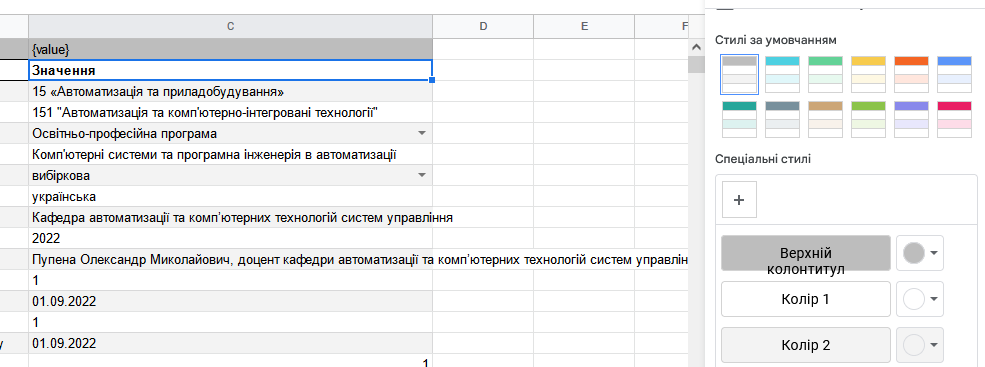

# Class Banding 

https://developers.google.com/apps-script/reference/spreadsheet/banding         

Переглядайте та змінюйте смуги, кольорові візерунки, застосовані до рядків або стовпців діапазону. Кожна смуга складається з діапазону та набору кольорів для рядків, стовпців, верхніх і нижніх колонтитулів.

### Methods

| Method                              | Return type | Brief description                                            |
| ----------------------------------- | ----------- | ------------------------------------------------------------ |
| `copyTo(range)`                     | `Banding`   | Copies this banding to another range.                        |
| `getFirstColumnColorObject()`       | `Color`     | Returns the first alternating column color in the banding, or `null` if no color is set. |
| `getFirstRowColorObject()`          | `Color`     | Returns the first alternating row color, or `null` if no color is set. |
| `getFooterColumnColorObject()`      | `Color`     | Returns the color of the last column in the banding, or `null` if no color is set. |
| `getFooterRowColorObject()`         | `Color`     | Returns the last row color in the banding, or `null` if no color is set. |
| `getHeaderColumnColorObject()`      | `Color`     | Returns the color of the first column in the banding, or `null` if no color is set. |
| `getHeaderRowColorObject()`         | `Color`     | Returns the color of the header row or `null` if no color is set. |
| `getRange()`                        | `Range`     | Returns the range for this banding.                          |
| `getSecondColumnColorObject()`      | `Color`     | Returns the second alternating column color in the banding, or `null` if no color is set. |
| `getSecondRowColorObject()`         | `Color`     | Returns the second alternating row color, or `null` if no color is set. |
| `remove()`                          | `void`      | Removes this banding.                                        |
| `setFirstColumnColor(color)`        | `Banding`   | Sets the first column color that is alternating.             |
| `setFirstColumnColorObject(color)`  | `Banding`   | Sets the first alternating column color in the banding.      |
| `setFirstRowColor(color)`           | `Banding`   | Sets the first row color that is alternating.                |
| `setFirstRowColorObject(color)`     | `Banding`   | Sets the first alternating row color in the banding.         |
| `setFooterColumnColor(color)`       | `Banding`   | Sets the color of the last column.                           |
| `setFooterColumnColorObject(color)` | `Banding`   | Sets the color of the last column in the banding.            |
| `setFooterRowColor(color)`          | `Banding`   | Sets the color of the last row.                              |
| `setFooterRowColorObject(color)`    | `Banding`   | Sets the color of the footer row in the banding.             |
| `setHeaderColumnColor(color)`       | `Banding`   | Sets the color of the header column.                         |
| `setHeaderColumnColorObject(color)` | `Banding`   | Sets the color of the header column.                         |
| `setHeaderRowColor(color)`          | `Banding`   | Sets the color of the header row.                            |
| `setHeaderRowColorObject(color)`    | `Banding`   | Sets the color of the header row.                            |
| `setRange(range)`                   | `Banding`   | Sets the range for this banding.                             |
| `setSecondColumnColor(color)`       | `Banding`   | Sets the second column color that is alternating.            |
| `setSecondColumnColorObject(color)` | `Banding`   | Sets the second alternating column color in the banding.     |
| `setSecondRowColor(color)`          | `Banding`   | Sets the second row color that is alternating.               |
| `setSecondRowColorObject(color)`    | `Banding`   | Sets the second alternating color in the banding.            |

