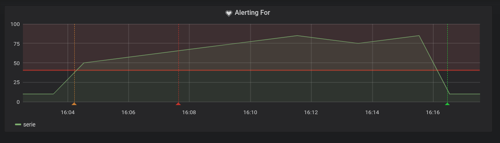
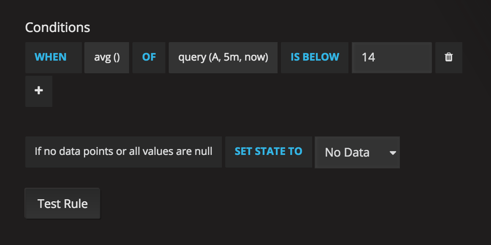

# Alerts overview

[Оригінальна стаття](https://grafana.com/docs/grafana/latest/alerting/)

Сповіщення дозволяють виявляти проблеми у вашій системі через кілька моментів після їх виникнення. Швидко виявляючи ненавмисні зміни у вашій системі, ви можете мінімізувати перешкоди у роботі ваших служб.

Сповіщення складається з двох частин:

- Alert rules (Правила попередження) - Коли спрацьовує попередження. Правила оповіщення визначаються однією або кількома умовами, які регулярно оцінює Grafana.
- Notification channel (Канал сповіщення) - Як доставляється попередження. Коли умови правила попередження виконуються, Grafana повідомляє канали, налаштовані для цього попередження.

В даний час лише візуалізація панелі графіків підтримує попередження.

## Alert tasks

You can perform the following tasks for alerts:

- [Add or edit an alert notification channel](https://grafana.com/docs/grafana/latest/alerting/notifications/)
- [Create an alert rule](https://grafana.com/docs/grafana/latest/alerting/create-alerts/)
- [View existing alert rules and their current state](https://grafana.com/docs/grafana/latest/alerting/view-alerts/)
- [Test alert rules and troubleshoot](https://grafana.com/docs/grafana/latest/alerting/troubleshoot-alerts/)

## Notifications

Ви також можете встановити сповіщення про правила попередження разом із докладним повідомленням про правило попередження. Повідомлення може містити що завгодно: інформацію про те, як ви можете вирішити проблему, посилання на runbook тощо.

Фактичні сповіщення налаштовуються та розподіляються між кількома попередженнями.

## Alert execution

Alert rules are evaluated in the Grafana backend in a scheduler and query execution engine that is part of core Grafana. Alert rules can query only backend data sources with alerting enabled. Such data sources are:

- builtin or developed and maintained by grafana, such as: `Graphite`, `Prometheus`, `Loki`, `InfluxDB`, `Elasticsearch`, `Google Cloud Monitoring`, `Cloudwatch`, `Azure Monitor`, `MySQL`, `PostgreSQL`, `MSSQL`, `OpenTSDB`, `Oracle`, and `Azure Data Explorer`
- any community backend data sources with alerting enabled (`backend` and `alerting` properties are set in the [plugin.json](https://grafana.com/docs/grafana/latest/developers/plugins/metadata/))

## Metrics from the alert engine

The alert engine publishes some internal metrics about itself. You can read more about how Grafana publishes [internal metrics](https://grafana.com/docs/grafana/latest/administration/view-server/internal-metrics/).

| Description                | Type    | Metric name                   |
| -------------------------- | ------- | ----------------------------- |
| Total number of alerts     | counter | `alerting.active_alerts`      |
| Alert execution result     | counter | `alerting.result`             |
| Notifications sent counter | counter | `alerting.notifications_sent` |
| Alert execution timer      | timer   | `alerting.execution_time`     |

# Create alerts

Grafana alerting allows you to attach rules to your dashboard panels. When you save the dashboard, Grafana extracts the alert rules into a  separate alert rule storage and schedules them for evaluation.


In the Alert tab of the graph panel you can configure how often the  alert rule should be evaluated and the conditions that need to be met  for the alert to change state and trigger its [notifications](https://grafana.com/docs/grafana/latest/alerting/notifications/).

Currently only the graph panel supports alert rules.

## Add or edit an alert rule

1. Navigate to the panel you want to add or edit an alert rule for, click the title, and then click **Edit**.
2. On the Alert tab, click **Create Alert**. If an alert already exists for this panel, then you can just edit the fields on the Alert tab.
3. Fill out the fields. Descriptions are listed below in [Alert rule fields](https://grafana.com/docs/grafana/latest/alerting/create-alerts/#alert-rule-fields).
4. When you have finished writing your rule, click **Save** in the upper right corner to save alert rule and the dashboard.
5. (Optional but recommended) Click **Test rule** to make sure the rule returns the results you expect.

## Delete an alert

To delete an alert, scroll to the bottom of the alert and then click **Delete**.

## Alert rule fields

This section describes the fields you fill out to create an alert.

### Rule

- **Name -** Enter a descriptive name. The name will be displayed in the Alert Rules list. This field supports [templating](https://grafana.com/docs/grafana/latest/alerting/add-notification-template/).
- **Evaluate every -** Specify how often the scheduler should evaluate the alert rule. This is referred to as the *evaluation interval*.
- **For -** Specify how long the query needs to violate the configured thresholds before the alert notification triggers.

You can set a minimum evaluation interval in the `alerting.min_interval_seconds` configuration field, to set a minimum time between evaluations. Refer to [Configuration](https://grafana.com/docs/grafana/latest/administration/configuration/#min-interval-seconds) for more information.

> **Caution:** Do not use `For` with the `If no data or all values are null` setting set to `No Data`. The triggering of `No Data` will trigger instantly and not take `For` into consideration. This may also result in that an OK notification not being sent if alert transitions from `No Data -> Pending -> OK`.

If an alert rule has a configured `For` and the query violates the configured threshold, then it will first go from `OK` to `Pending`. Going from `OK` to `Pending` Grafana will not send any notifications. Once the alert rule has been firing for more than `For` duration, it will change to `Alerting` and send alert notifications.

Typically, it’s always a good idea to use this setting since it’s  often worse to get false positive than wait a few minutes before the  alert notification triggers. Looking at the `Alert list` or `Alert list panels` you will be able to see alerts in pending state.

Below you can see an example timeline of an alert using the `For` setting. At ~16:04 the alert state changes to `Pending` and after 4 minutes it changes to `Alerting` which is when alert notifications are sent. Once the series falls back to normal the alert rule goes back to `OK`.

​	[ 		](https://grafana.com/static/img/docs/v54/alerting-for-dark-theme.png) 

​	[ 		](https://grafana.com/static/img/docs/v4/alerting_conditions.png) 

### Conditions

Currently the only condition type that exists is a `Query` condition that allows you to specify a query letter, time range and an aggregation function.

#### Query condition example

```sql
avg() OF query(A, 15m, now) IS BELOW 14
```

- `avg()` Controls how the values for **each** series should be reduced to a value that can be compared against the  threshold. Click on the function to change it to another aggregation  function.
- `query(A, 15m, now)` The letter defines what query to execute from the **Metrics** tab. The second two parameters define the time range, `15m, now` means 15 minutes ago to now. You can also do `10m, now-2m` to define a time range that will be 10 minutes ago to 2 minutes ago.  This is useful if you want to ignore the last 2 minutes of data.
- `IS BELOW 14` Defines the type of threshold and the threshold value. You can click on `IS BELOW` to change the type of threshold.

The query used in an alert rule cannot contain any template variables. Currently we only support `AND` and `OR` operators between conditions and they are executed serially. For example, we have 3 conditions in the following order: *condition:A(evaluates to: TRUE) OR condition:B(evaluates to: FALSE) AND condition:C(evaluates to: TRUE)* so the result will be calculated as ((TRUE OR FALSE) AND TRUE) = TRUE.

We plan to add other condition types in the future, like `Other Alert`, where you can include the state of another alert in your conditions, and `Time Of Day`.

#### Multiple Series

If a query returns multiple series, then the aggregation function and threshold check will be evaluated for each series. What Grafana does  not do currently is track alert rule state **per series**. This has implications that are detailed in the scenario below.

- Alert condition with query that returns 2 series: **server1** and **server2**
- **server1** series causes the alert rule to fire and switch to state `Alerting`
- Notifications are sent out with message: *load peaking (server1)*
- In a subsequent evaluation of the same alert rule, the **server2** series also causes the alert rule to fire
- No new notifications are sent as the alert rule is already in state `Alerting`.

So, as you can see from the above scenario Grafana will not send out  notifications when other series cause the alert to fire if the rule  already is in state `Alerting`. To improve support for queries that return multiple series we plan to track state **per series** in a future release.

> Starting with Grafana v5.3 you can configure reminders to be sent for triggered alerts. This will send additional notifications when an alert continues to fire. If other series (like server2 in the  example above) also cause the alert rule to fire they will be included  in the reminder notification. Depending on what notification channel  you’re using you may be able to take advantage of this feature for  identifying new/existing series causing alert to fire.

### No Data & Error Handling

Below are conditions you can configure how the rule evaluation engine should handle queries that return no data or only null values.

| No Data Option  | Description                                                  |
| --------------- | ------------------------------------------------------------ |
| No Data         | Set alert rule state to `NoData`                             |
| Alerting        | Set alert rule state to `Alerting`                           |
| Keep Last State | Keep the current alert rule state, whatever it is.           |
| Ok              | Not sure why you would want to send yourself an alert when things are okay, but you could. |

### Execution errors or timeouts

Tell Grafana how to handle execution or timeout errors.

| Error or timeout option | Description                                        |
| ----------------------- | -------------------------------------------------- |
| Alerting                | Set alert rule state to `Alerting`                 |
| Keep Last State         | Keep the current alert rule state, whatever it is. |

If you have an unreliable time series store from which queries sometime timeout or fail randomly you can set this option to `Keep Last State` in order to basically ignore them.

## Notifications

In alert tab you can also specify alert rule notifications along with a detailed message about the alert rule. The message can contain  anything, information about how you might solve the issue, link to  runbook, and so on.

The actual notifications are configured and shared between multiple alerts. Read [Alert notifications](https://grafana.com/docs/grafana/latest/alerting/notifications/) for information on how to configure and set up notifications.

- **Send to -** Select an alert notification channel if you have one set up.
- **Message -** Enter a text message to be sent on the  notification channel. Some alert notifiers support transforming the text to HTML or other rich formats. This field supports [templating](https://grafana.com/docs/grafana/latest/alerting/add-notification-template/).
- **Tags -** Specify a list of tags (key/value) to be included in the notification. It is only supported by [some notifiers](https://grafana.com/docs/grafana/latest/alerting/notifications/#all-supported-notifiers).

## Alert state history and annotations

Зміни стану попередження реєструються у внутрішній таблиці анотацій у базі даних Grafana. Зміни стану відображаються як анотації на графічній панелі правила попередження. Ви також можете зайти у підменю `State history` на вкладці попередження, щоб переглянути та очистити історію стану.