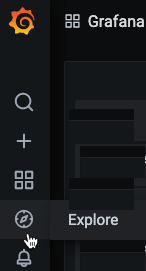
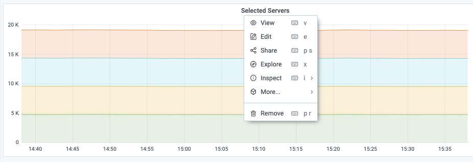
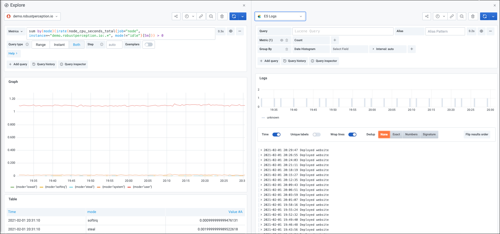
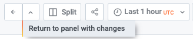
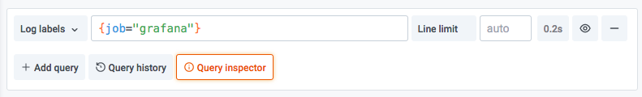
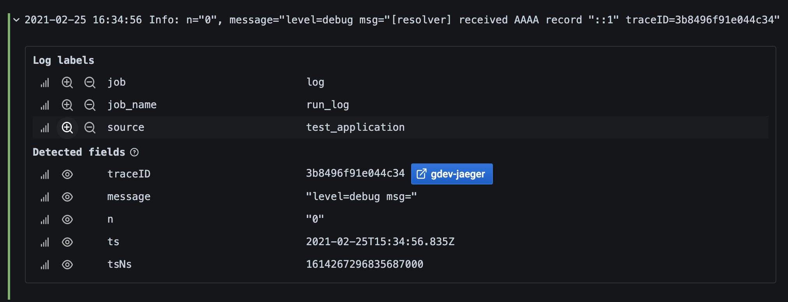
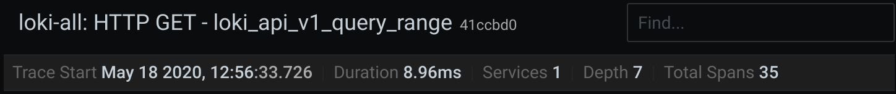
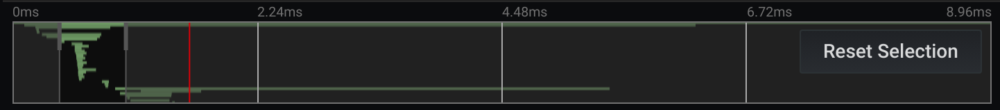
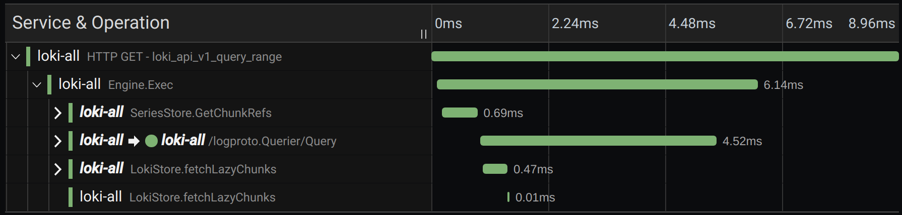
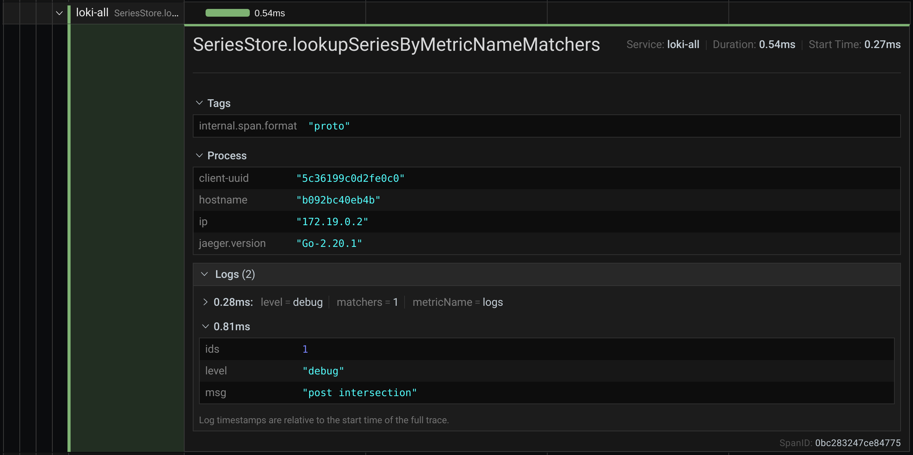

# Explore

[Оригінальна стаття](https://grafana.com/docs/grafana/latest/explore/)

Інтерфейс користувальницької панелі Grafana - це все про створення інформаційних панелей для візуалізації. Досліджуйте без панелей та dashboard, щоб ви могли зосередитись на запиті. Це допоможе вам виконати ітерацію, поки у вас не з’явиться робочий запит, а потім подумати про створення інформаційної панелі.

Якщо ви просто хочете дослідити свої дані і не хочете створювати інформаційну панель, то Explore робить це набагато простішим. Якщо ваше джерело даних підтримує дані графіків і таблиць, то Explore відображає результати як у вигляді графіку, так і таблиці. Це дозволяє одночасно бачити тенденції в даних та більше деталей. Дивитися також:

## Start exploring

In order to access Explore, you must have an editor or an administrator role. Refer to [Organization roles](https://grafana.com/docs/grafana/latest/permissions/organization_roles/) for more information on what each role has access to.

To access Explore:

1. Click on the Explore icon on the menu bar.

   ​	 	

   Відкриється порожня вкладка Огляд.

   Щоб почати з існуючого запиту на панелі, виберіть опцію Explore у меню Panel. Це відкриває вкладку "Explore " із запитом на панелі та дозволяє налаштувати або повторити запит за межами інформаційної панелі.

​	 

1. Choose your data source from the dropdown in the top left. [Prometheus](https://grafana.com/oss/prometheus/) has a custom Explore implementation, the other data sources use their standard query editor.
2. In the query field, write your query to explore your data. There are three buttons beside the query field, a clear button (X), an add query  button (+) and the remove query button (-). Just like the normal query  editor, you can add and remove multiple queries.

## Розбийте і порівняйте 

Розділений вигляд забезпечує простий спосіб порівняти графіки та таблиці поруч або переглянути спільні дані на одній сторінці.

Щоб відкрити розділений вигляд:

1. Клацніть кнопку розділення, щоб продублювати поточний запит і розділити сторінку на два паралельні запити.

Можна вибрати інше джерело даних для нового запиту, яке, наприклад, дозволяє порівняти один і той же запит для двох різних серверів або порівняти проміжне середовище із виробничим середовищем.

​	 		

У розділеному поданні підбирачі часу для обох панелей можна пов’язати (якщо змінити одну, зміниться і інша), натиснувши одну з кнопок синхронізації часу, прикріплену до вибору часу. Пов’язування часових інструментів допомагає синхронізувати час початку та закінчення запитів розділеного подання. Це гарантує, що ви дивитесь один і той же інтервал часу на обох розділених панелях.

Щоб закрити щойно створений запит, натисніть кнопку Закрити розділення.

## Навігація між Explore та dashboard

Щоб допомогти прискорити робочі процеси, які передбачають регулярне перемикання з Explore на інформаційну панель і навпаки, Grafana надає вам можливість повернутися до початкової інформаційної панелі після навігації до Explore зі спадного меню панелі.

Після переходу до Explore, ви повинні помітити кнопку "Назад" на панелі інструментів Explore. Просто клацніть на ньому, щоб повернутися до початкової інформаційної панелі. Щоб повернути зміни, внесені в Explore, назад на інформаційну панель, натисніть стрілку поруч із кнопкою, щоб відкрити пункт меню «Повернутися до панелі зі змінами».

​	[ 		](https://grafana.com/static/img/docs/explore/explore_return_dropdown-7-4.png) 

## Поділитися скороченим посиланням

Можливість спільного використання скороченого посилання дозволяє створювати менші та простіші URL-адреси формату /goto/:uid  замість використання довших URL-адрес із параметрами запиту. Щоб створити скорочене посилання, натисніть кнопку **Share** на панелі інструментів Explore . Усі скорочені посилання, які ніколи не використовуються, автоматично видаляються через 7 днів.

# Query management in Explore

To help with debugging queries, Explore allows you to investigate  query requests and responses, as well as query statistics, via the Query inspector. This functionality is similar to the panel inspector [Stats tab](https://grafana.com/docs/grafana/latest/panels/inspect-panel/#inspect-query-performance) and [Query tab](https://grafana.com/docs/grafana/latest/panels/inspect-panel/##view-raw-request-and-response-to-data-source).

Щоб допомогти з налагодженням запитів, Explore дозволяє досліджувати запити та відповіді на запити, а також статистику запитів за допомогою інспектора запитів. Ця функціональність подібна до інспектора панелі  [Stats tab](https://grafana.com/docs/grafana/latest/panels/inspect-panel/#inspect-query-performance)  та [Query tab](https://grafana.com/docs/grafana/latest/panels/inspect-panel/##view-raw-request-and-response-to-data-source).

 

## Query history

Query history is a list of queries that you have used in Explore. The history is local to your browser and is not shared. To open and  interact with your history, click the **Query history** button in Explore.

### View query history

Query history lets you view the history of your querying. For each individual query, you can:

- Run a query.
- Create and/or edit a comment.
- Copy a query to the clipboard.
- Copy a shortened link with the query to the clipboard.
- Star a query.

### Manage favorite queries

All queries that have been starred in the Query history tab are  displayed in the Starred. This allows you to access your favorite  queries faster and to reuse these queries without typing them from  scratch.

### Sort query history

By default, query history shows you the most recent queries. You can  sort your history by date or by data source name in ascending or  descending order.

1. Click the **Sort queries by** field.
2. Select one of the following options:
   - Newest first
   - Oldest first
   - Data source A-Z
   - Data source Z-A

> **Note:** If you are in split mode, then the chosen sorting mode applies only to the active panel.

### Filter query history

Filter query history in Query history and Starred tab by data source name:

1. Click the **Filter queries for specific data source(s)** field.
2. Select the data source for which you would like to filter your history. You can select multiple data sources.

In **Query history** tab it is also possible to filter queries by date using the slider:

- Use vertical slider to filter queries by date.
- By dragging top handle, adjust start date.
- By dragging top handle, adjust end date.

> **Note:** If you are in split mode, filters are applied only to your currently active panel.

### Search in query history

You can search in your history across queries and your comments.  Search is possible for queries in the Query history tab and Starred tab.

1. Click the **Search queries** field.
2. Type the term you are searching for into search field.

### Query history settings

You can customize the query history in the Settings tab. Options are described in the table below.

| Setting                                                      | Default value                           |
| ------------------------------------------------------------ | --------------------------------------- |
| Period of time for which Grafana will save your query history | 1 week                                  |
| Change the default active tab                                | Query history tab                       |
| Only show queries for data source currently active in Explore | True                                    |
| Clear query history                                          | Permanently deletes all stored queries. |

> **Note:** Query history settings are global, and applied to both panels in split mode.

# Logs in Explore

Along with metrics, Explore allows you to investigate your logs in the following data sources:

- [Elasticsearch](https://grafana.com/docs/grafana/latest/datasources/elasticsearch/)
- [InfluxDB](https://grafana.com/docs/grafana/latest/datasources/influxdb/)
- [Loki](https://grafana.com/docs/grafana/latest/datasources/loki/)

During an infrastructure monitoring and incident response, you can  dig deeper into the metrics and logs to find the cause. Explore also  allows you to correlate metrics and logs by viewing them side-by-side.  This creates a new debugging workflow:

1. Receive an alert.
2. Drill down and examine metrics.
3. Drill down again and search logs related to the metric and time interval (and in the future, distributed traces).

Поряд з метриками, Explore дозволяє досліджувати ваші журнали в таких джерелах даних:

- [Elasticsearch](https://grafana.com/docs/grafana/latest/datasources/elasticsearch/)
- [InfluxDB](https://grafana.com/docs/grafana/latest/datasources/influxdb/)
- [Локі](https://grafana.com/docs/grafana/latest/datasources/loki/)

Під час моніторингу інфраструктури та реагування на інциденти ви можете глибше вивчити показники та журнали, щоб знайти причину. Дослідження також дозволяє співвідносити показники та журнали, переглядаючи їх поруч. Це створює новий робочий процес налагодження:

1. Отримайте попередження.
2. Детально розгляньте та вивчіть показники.
3. Знову детально розгляньте журнали пошуку, пов’язані з метрикою та інтервалом часу (а в майбутньому - розподіленими слідами).

### Logs visualization

Results of log queries are shown as histograms in the graph and  individual logs are displayed below. If the data source does not send  histogram data for the requested time range, the logs model computes a  time series based on the log row counts bucketed by an automatically  calculated time interval and the start of the histogram is then anchored by the first log row’s timestamp from the result. The end of the time  series is anchored to the time picker’s **To** range.

#### Log level

For logs where a **level** label is specified, we use  the value of the label to determine the log level and update color  accordingly. If the log doesn’t have a level label specified, we parse  the log to find out if its content matches any of the supported  expressions (see below for more information). The log level is always  determined by the first match. In case Grafana is not able to determine a log level, it will be visualized with **unknown** log level.

**Supported log levels and mapping of log level abbreviation and expressions:**

| Supported expressions | Log level | Color      |
| --------------------- | --------- | ---------- |
| emerg                 | critical  | purple     |
| fatal                 | critical  | purple     |
| alert                 | critical  | purple     |
| crit                  | critical  | purple     |
| critical              | critical  | purple     |
| err                   | error     | red        |
| eror                  | error     | red        |
| error                 | error     | red        |
| warn                  | warning   | yellow     |
| warning               | warning   | yellow     |
| info                  | info      | green      |
| information           | info      | green      |
| notice                | info      | green      |
| dbug                  | debug     | blue       |
| debug                 | debug     | blue       |
| trace                 | trace     | light blue |
| *                     | unknown   | grey       |

### Visualization options

You can customize how logs are displayed and select which columns are shown.

#### Time

Shows or hides the time column. This is the timestamp associated with the log line as reported from the data source.

#### Unique labels

Shows or hides the unique labels column that includes only non-common labels. All common labels are displayed above.

#### Wrap lines

Set this to True if you want the display to use line wrapping. If set to False, it will result in horizontal scrolling.

#### Deduping

Log data can be very repetitive and Explore can help by hiding  duplicate log lines. There are a few different deduplication algorithms  that you can use:

- **Exact -** Exact matches are done on the whole line except for date fields.
- **Numbers -** Matches on the line after stripping out numbers such as durations, IP addresses, and so on.
- **Signature -** The most aggressive deduping, this strips all letters and numbers and matches on the remaining whitespace and punctuation.

#### Flip results order

You can change the order of received logs from the default descending order (newest first) to ascending order (oldest first).

### Labels and detected fields

Each log row has an extendable area with its labels and detected  fields, for more robust interaction. For all labels we have added the  ability to filter for (positive filter) and filter out (negative filter) selected labels. Each field or label also has a stats icon to display  ad-hoc statistics in relation to all displayed logs.

#### Derived fields links

By using Derived fields, you can turn any part of a log message into  an internal or external link. The created link is visible as a button  next to the Detected field in the Log details view.

​	 

#### Toggle detected fields

> **Note:** Available in Grafana 7.2 and later versions.

If your logs are structured in `json` or `logfmt`, then you can show or hide detected fields. Expand a log line and then click the eye icon to show or hide fields.

​	 	

### Loki-specific features

As mentioned, one of the log integrations is for the new open source log aggregation system from Grafana Labs - [Loki](https://github.com/grafana/loki). Loki is designed to be very cost effective, as it does not index the  contents of the logs, but rather a set of labels for each log stream.  The logs from Loki are queried in a similar way to querying with label  selectors in Prometheus. It uses labels to group log streams which can  be made to match up with your Prometheus labels. For more information  about Grafana Loki, refer to [Grafana Loki](https://github.com/grafana/loki) or the Grafana Labs hosted variant: [Grafana Cloud Logs](https://grafana.com/loki).

For more information, refer to Loki’s data source  documentation](/docs/grafana/latest/datasources/loki/) on how to query  for log data.

#### Switch from metrics to logs

If you switch from a Prometheus query to a logs query (you can do a  split first to have your metrics and logs side by side) then it will  keep the labels from your query that exist in the logs and use those to  query the log streams. For example, the following Prometheus query:

```
grafana_alerting_active_alerts{job="grafana"}
```

after switching to the Logs data source, the query changes to:

```
{job="grafana"}
```

This will return a chunk of logs in the selected time range that can be grepped/text searched.

#### Live tailing

Use the Live tailing feature to see real-time logs on supported data sources.

Click the **Live** button in the Explore toolbar to switch to Live tail view.

While in Live tail view new logs will come from the bottom of the  screen and will have fading contrasting background so you can keep track of what is new. Click the **Pause** button or scroll the logs view to pause the Live tailing and explore previous logs without interruption. Click **Resume** button to resume the Live tailing or click **Stop** button to exit Live tailing and go back to standard Explore view.

​	 		](htt

# Tracing in Explore

Explore allows you to visualize traces from tracing data sources. This is available in Grafana v7.0+.

Supported data sources are:

- [Jaeger](https://grafana.com/docs/grafana/latest/datasources/jaeger/)
- [Tempo](https://grafana.com/docs/grafana/latest/datasources/tempo/)
- [X-Ray](https://grafana.com/grafana/plugins/grafana-x-ray-datasource)
- [Zipkin](https://grafana.com/docs/grafana/latest/datasources/zipkin/)

For information on how to configure queries for the data sources  listed above, refer to the documentation for specific data source.

​	 

##### Header

​	 

- Header title: Shows the name of the root span and trace ID.
- Search: Highlights spans containing the searched text.
- Metadata: Various metadata about the trace.

##### Minimap

​	 

Shows condensed view or the trace timeline. Drag your mouse over the  minimap to zoom into smaller time range. Zooming will also update the  main timeline, so it is easy to see shorter spans. Hovering over the  minimap, when zoomed, will show Reset Selection button which resets the  zoom.

##### Timeline

​	 	

Shows list of spans within the trace. Each span row consists of these components:

- Expand children button: Expands or collapses all the children spans of selected span.
- Service name: Name of the service logged the span.
- Operation name: Name of the operation that this span represents.
- Span duration bar: Visual representation of the operation duration within the trace.

Clicking anywhere on the span row shows span details.

##### Span details

​	 

- Operation name
- Span metadata
- Tags: Any tags associated with this span.
- Process metadata: Metadata about the process that logged this span.
- Logs: List of logs logged by this span and associated key values. In case of Zipkin logs section shows Zipkin annotations.

##### Trace to logs

> **Note:** Available in Grafana 7.4 and later versions.

You can navigate from a span in a trace view directly to logs  relevant for that span. This is available for Tempo, Jaeger and Zipkin  data source at this moment.  their relevant documentation for  instruction how to configure this feature.

​	 

Click the document icon to open a split view in Explore with the configured data source and query relevant logs for the span.

## Data API

This visualization needs a specific shape of the data to be returned from the data source in order to correctly display it.

Data source needs to return data frame and set `frame.meta.preferredVisualisationType = 'trace'`.

### Data frame structure

Required fields:

| Field name   | Type                | Description                                                  |
| ------------ | ------------------- | ------------------------------------------------------------ |
| traceID      | string              | Identifier for the entire trace. There should be only one trace in the data frame. |
| spanID       | string              | Identifier for the current span. SpanIDs should be unique per trace. |
| parentSpanID | string              | SpanID of the parent span to create child parent relationship in the trace view. Can be `undefined` for root span without parent. |
| serviceName  | string              | Name of the service this span is part of.                    |
| serviceTags  | TraceKeyValuePair[] | List of tags relevant for the service.                       |
| startTime    | number              | Start time of the span in millisecond epoch time.            |
| duration     | number              | Duration of the span in milliseconds.                        |

Optional fields:

| Field name     | Type                | Description                                                  |
| -------------- | ------------------- | ------------------------------------------------------------ |
| logs           | TraceLog[]          | List of logs associated with the current span.               |
| tags           | TraceKeyValuePair[] | List of tags associated with the current span.               |
| warnings       | string[]            | List of warnings associated with the current span.           |
| stackTraces    | string[]            | List of stack traces associated with the current span.       |
| errorIconColor | string              | Color of the error icon in case span is tagged with `error: true`. |

For details about the types see [TraceSpanRow](https://grafana.com/docs/grafana/latest/packages_api/data/tracespanrow/), [TraceKeyValuePair](https://grafana.com/docs/grafana/latest/packages_api/data/tracekeyvaluepair/) and [TraceLog](https://grafana.com/docs/grafana/latest/packages_api/data/tracelog/)