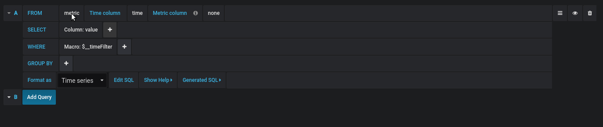
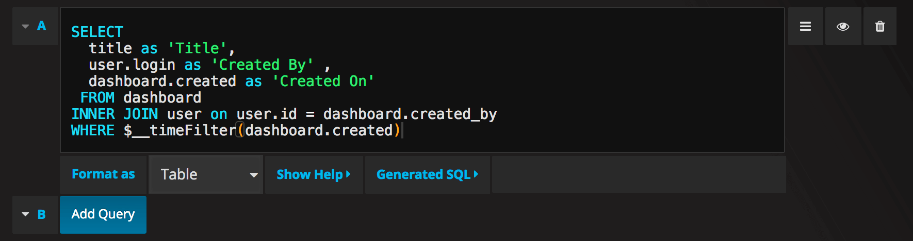

# Using MySQL in Grafana

[Оригінальна стаття](https://grafana.com/docs/grafana/latest/datasources/mysql/)

> Починаючи з Grafana v5.1, ви можете вказати стовпець часу *time* на додаток до раніше підтримуваних *time_sec*. З часом використання *time_sec* буде припинено.

Grafana постачається із вбудованим плагіном джерела даних MySQL, що дозволяє запитувати та візуалізувати дані із бази даних, сумісної з MySQL.

## Додавання джерела даних

1. Відкрийте бічне меню, клацнувши піктограму Grafana у верхньому заголовку.
2. У бічному меню під посиланням `Dashboards` ви повинні знайти посилання ` Data Sources`.
3. Натисніть кнопку `+ Add data source` у верхньому заголовку.
4. Виберіть *MySQL* зі спадного меню *Type*.

### Data source options

| Name           | Description                                                  |
| -------------- | ------------------------------------------------------------ |
| `Name`         | The data source name. This is how you refer to the data source in panels and queries. |
| `Default`      | Default data source means that it will be pre-selected for new panels. |
| `Host`         | The IP address/hostname and optional port of your MySQL instance. |
| `Database`     | Name of your MySQL database.                                 |
| `User`         | Database user’s login/username                               |
| `Password`     | Database user’s password                                     |
| `Max open`     | The maximum number of open connections to the database, default `unlimited` (Grafana v5.4+). |
| `Max idle`     | The maximum number of connections in the idle connection pool, default `2` (Grafana v5.4+). |
| `Max lifetime` | The maximum amount of time in seconds a connection may be reused, default `14400`/4 hours. This should always be lower than configured [wait_timeout](https://dev.mysql.com/doc/refman/8.0/en/server-system-variables.html#sysvar_wait_timeout) in MySQL (Grafana v5.4+). |

### Min time interval

Нижня межа для змінних [$__interval](https://grafana.com/docs/grafana/latest/variables/variable-types/#the-interval-variable) та  [$__interval_ms](https://grafana.com/docs/grafana/latest/variables/variable-types/#the-interval-ms-variable) . Рекомендується встановити частоту запису, наприклад `1m`, якщо ваші дані записуються щохвилини. Цей параметр також можна замінити/налаштувати на dashboard panel  під параметрами джерела даних. Важливо зазначити, що це значення **має бути** відформатовано як число, за яким йде дійсний ідентифікатор часу, наприклад `1m` (1 хвилина) або ` 30s` (30 секунд). Підтримуються такі ідентифікатори часу:

| Identifier | Description |
| ---------- | ----------- |
| `y`        | year        |
| `M`        | month       |
| `w`        | week        |
| `d`        | day         |
| `h`        | hour        |
| `m`        | minute      |
| `s`        | second      |
| `ms`       | millisecond |

### Database User Permissions (Important!)

The database user you specify when you add the data source should only be granted SELECT permissions on the specified database and tables you want to query. Grafana does not validate that the query is safe. The query could include any SQL statement. For example, statements like `USE otherdb;` and `DROP TABLE user;` would be executed. To protect against this we **Highly** recommend you create a specific mysql user with restricted permissions.

Example:

```sql
 CREATE USER 'grafanaReader' IDENTIFIED BY 'password';
 GRANT SELECT ON mydatabase.mytable TO 'grafanaReader';
```

You can use wildcards (`*`)  in place of database or table if you want to grant access to more databases and tables.

## Query Editor

> Only available in Grafana v5.4+.

                         

Редактор запитів MySQL можна знайти на вкладці метрик у режимі редагування панелі. Ви переходите в режим редагування, натискаючи заголовок панелі, а потім редагуйте.

У редакторі запитів є посилання `Generated SQL`, яке з'являється після виконання запиту в режимі редагування панелі. Клацніть на нього, і він розгорнеться і покаже виконаний інтерпольований рядок SQL, який був виконаний.

### Select table, time column and metric column (FROM)

Коли ви вперше входите в режим редагування або додаєте новий запит, Grafana спробує попередньо заповнити конструктор запитів першою таблицею, яка має стовпець із позначкою часу та числовий стовпець.

У полі FROM Grafana запропонує таблиці, які є у налаштованій базі даних. Щоб вибрати таблицю або подання в іншій базі даних, до якої користувач вашої бази даних має доступ, ви можете вручну ввести повністю кваліфіковане ім'я (database.table), наприклад `otherDb.metrics`.

Поле стовпця Time відноситься до назви стовпця, що містить ваші значення часу. Вибір значення для поля стовпця Metric не є обов'язковим. Якщо значення метрики вибрано, у якості назви ряду буде використано поле стовпця Metric.

Пропозиції метричних стовпців будуть містити лише стовпці з текстовим типом даних (text, tinytext, mediumtext, longtext, varchar, char). Якщо ви хочете використовувати стовпець з іншим типом даних як стовпець метрики, ви можете ввести ім'я стовпця з приводом: `CAST (numericColumn як CHAR)`. Ви також можете ввести довільні вирази SQL у поле стовпця метрики, які обчислюють текстовий тип даних, наприклад `CONCAT (column1," ", CAST (numericColumn as CHAR))`.

### Стовпці та функції агрегації (SELECT)

У рядку `SELECT` ви можете вказати, які стовпці та функції ви хочете використовувати. У поле стовпця ви можете писати довільні вирази замість назви стовпця, наприклад `column1 * column2 / column3`.

Якщо ви використовуєте агреговані функції, вам потрібно згрупувати ваш набір результатів. Редактор автоматично додасть `GROUP BY time`, якщо ви додасте функцію aggregate .

Ви можете додати інші стовпці значень, натиснувши кнопку плюса та вибравши в меню пункт `Column`. Кілька стовпців значень будуть побудовані як окремі ряди на графічній панелі.

### Фільтрування даних (WHERE)

Щоб додати фільтр, клацніть піктограму плюс праворуч від умови `WHERE`. Ви можете видалити фільтри, натиснувши на фільтр і вибравши `Remove`. Фільтр для поточного вибраного часового діапазону автоматично додається до нових запитів.

### Group By

Щоб згрупувати за часом або будь-якими іншими стовпцями, натисніть піктограму плюс у кінці рядка GROUP BY. У спадному меню пропозиції відображатимуться лише текстові стовпці вибраної вами таблиці, але ви можете вручну ввести будь-який стовпець. Ви можете видалити групу, натиснувши елемент та вибравши `Remove`.

Якщо ви додаєте будь-яке групування, до всіх вибраних стовпців потрібно застосувати функцію aggregate . Конструктор запитів автоматично додасть функції aggregate до всіх стовпців без таких функцій під час додавання групувань.

#### Gap Filling

Grafana може заповнювати відсутні значення при групуванні за часом. Функція часу приймає два аргументи. Перший аргумент - це тимчасове вікно, за яким ви хотіли б згрупуватись, а другий аргумент - значення, яким ви хочете, щоб Grafana заповнила відсутні елементи.

### Text Editor Mode (RAW)

Ви можете перейти в режим редактора необроблених запитів, клацнувши піктограму гамбургера та вибравши `Switch editor mode` або натиснувши ` Edit SQL` під запитом.

> Якщо ви використовуєте редактор необроблених запитів, переконайтесь, що ваш запит має як мінімум `ORDER BY time` та фільтр у поверненому діапазоні часу.

## Macros

Для спрощення синтаксису та врахування динамічних частин, таких як фільтри діапазону дат, запит може містити макроси.

| Macro example                                         | Description                                                  |
| ----------------------------------------------------- | ------------------------------------------------------------ |
| `$__time(dateColumn)`                                 | Буде замінено виразом для перетворення на позначку часу UNIX і перейменування стовпця на в `time_sec`. For example, *UNIX_TIMESTAMP(dateColumn) as time_sec* |
| `$__timeEpoch(dateColumn)`                            | Буде замінено виразом для перетворення на позначку часу UNIX і перейменування стовпця на  `time_sec`. For example, *UNIX_TIMESTAMP(dateColumn) as time_sec* |
| `$__timeFilter(dateColumn)`                           | Will be replaced by a time range filter using the specified column name. For example, *dateColumn BETWEEN FROM_UNIXTIME(1494410783) AND FROM_UNIXTIME(1494410983)* |
| `$__timeFrom()`                                       | Will be replaced by the start of the currently active time selection. For example, *FROM_UNIXTIME(1494410783)* |
| `$__timeTo()`                                         | Will be replaced by the end of the currently active time selection. For example, *FROM_UNIXTIME(1494410983)* |
| `$__timeGroup(dateColumn,'5m')`                       | Will be replaced by an expression usable in GROUP BY clause. For example, *cast(cast(UNIX_TIMESTAMP(dateColumn)/(300) as signed)*300 as signed),* |
| `$__timeGroup(dateColumn,'5m', 0)`                    | Same as above but with a fill parameter so missing points in that series will be added by grafana and 0 will be used as value. |
| `$__timeGroup(dateColumn,'5m', NULL)`                 | Same as above but NULL will be used as value for missing points. |
| `$__timeGroup(dateColumn,'5m', previous)`             | Same as above but the previous value in that series will be used as  fill value if no value has been seen yet NULL will be used (only  available in Grafana 5.3+). |
| `$__timeGroupAlias(dateColumn,'5m')`                  | Will be replaced identical to $__timeGroup but with an added column alias (only available in Grafana 5.3+). |
| `$__unixEpochFilter(dateColumn)`                      | Will be replaced by a time range filter using the specified column name with times represented as Unix timestamp. For example, *dateColumn > 1494410783 AND dateColumn < 1494497183* |
| `$__unixEpochFrom()`                                  | Will be replaced by the start of the currently active time selection as Unix timestamp. For example, *1494410783* |
| `$__unixEpochTo()`                                    | Will be replaced by the end of the currently active time selection as Unix timestamp. For example, *1494497183* |
| `$__unixEpochNanoFilter(dateColumn)`                  | Will be replaced by a time range filter using the specified column  name with times represented as nanosecond timestamp. For example, *dateColumn > 1494410783152415214 AND dateColumn < 1494497183142514872* |
| `$__unixEpochNanoFrom()`                              | Will be replaced by the start of the currently active time selection as nanosecond timestamp. For example, *1494410783152415214* |
| `$__unixEpochNanoTo()`                                | Will be replaced by the end of the currently active time selection as nanosecond timestamp. For example, *1494497183142514872* |
| `$__unixEpochGroup(dateColumn,'5m', [fillmode])`      | Same as $__timeGroup but for times stored as Unix timestamp (only available in Grafana 5.3+). |
| `$__unixEpochGroupAlias(dateColumn,'5m', [fillmode])` | Same as above but also adds a column alias (only available in Grafana 5.3+). |

Ми плануємо додати ще багато макросів. Якщо у вас є пропозиції щодо макросів, які ви хотіли б бачити, [open an issue](https://github.com/grafana/grafana)  у нашому репозиторії GitHub.

У редакторі запитів є посилання `Generated SQL`, яке з'являється після виконання запиту в режимі редагування панелі. Клацніть на нього, і він розгорнеться і покаже виконаний інтерпольований рядок SQL, який був виконаний.

## Запити таблиць

Якщо для параметра `Format as` встановлено значення  `Table` , ви можете в основному робити будь-який тип запитів SQL. На панелі таблиці автоматично відображатимуться результати будь-яких стовпців і рядків, які повертає ваш запит.

Query editor with example query: 

Запит:

```sql
SELECT
  title as 'Title',
  user.login as 'Created By' ,
  dashboard.created as 'Created On'
 FROM dashboard
INNER JOIN user on user.id = dashboard.created_by
WHERE $__timeFilter(dashboard.created)
```

Ви можете керувати назвою стовпців панелі Таблиця, використовуючи звичайний `as` синтаксис вибору стовпця SQL.

Отримана панель таблиці:


## Запити часових рядів

Якщо ви встановите `Format as` в `Time series`, наприклад, для використання на панелі Graph , тоді запит повинен повернути стовпець з ім’ям `time`, який повертає або дату-час SQL, або будь-який числовий тип даних, що представляє Unix epoch. Будь-який стовпець, крім  `time`  і  `metric` , розглядається як стовпець значень. Ви можете повернути стовпець з назвою `metric`, який використовується як ім'я метрики для стовпця значення. Якщо ви повертаєте кілька стовпців значень і стовпець з назвою `metric`, тоді цей стовпець використовується як префікс для назви серії (доступно лише в Grafana 5.3+).

Набори результатів запитів часових рядів потрібно сортувати за часом.

**Example with `metric` column:**

```sql
SELECT
  $__timeGroup(time_date_time,'5m'),
  min(value_double),
  'min' as metric
FROM test_data
WHERE $__timeFilter(time_date_time)
GROUP BY time
ORDER BY time
```

**Example using the fill parameter in the $__timeGroup macro to convert null values to be zero instead:**

```sql
SELECT
  $__timeGroup(createdAt,'5m',0),
  sum(value_double) as value,
  measurement
FROM test_data
WHERE
  $__timeFilter(createdAt)
GROUP BY time, measurement
ORDER BY time
```

**Example with multiple columns:**

```sql
SELECT
  $__timeGroup(time_date_time,'5m'),
  min(value_double) as min_value,
  max(value_double) as max_value
FROM test_data
WHERE $__timeFilter(time_date_time)
GROUP BY time
ORDER BY time
```

В даний час немає підтримки динамічної групи за часом на основі діапазону часу та ширини панелі. Це те, що ми плануємо додати.

## Templating

Замість жорстко кодованих речей, таких як сервер, програма та ім'я датчика у ваших метричних запитах, ви можете використовувати змінні замість них. Змінні відображаються як випадаючі поля вибору у верхній частині інформаційної панелі. Ці випадаючі меню дозволяють легко змінити дані, що відображаються на вашій інформаційній панелі.

Ознайомтеся з документацією [Шаблонування](https://grafana.com/docs/grafana/latest/variables/), щоб ознайомитись із функцією шаблонування та різними типами змінних шаблону.

### Query Variable

Якщо ви додаєте змінну шаблону типу `Query`, ви можете написати запит MySQL, який може повертати такі речі, як імена вимірювань, імена ключів або значення ключів, які відображаються як випадаюче поле вибору.

Наприклад, у вас може бути змінна, яка містить усі значення для стовпця `hostname` у таблиці, якщо ви вказали такий запит у налаштуваннях змінної *Query*.

```sql
SELECT hostname FROM my_host
```

Запит може повернути кілька стовпців, і Grafana автоматично створить з них список. Наприклад, запит нижче поверне список зі значеннями з `hostname` та ` hostname2`.

```sql
SELECT my_host.hostname, my_other_host.hostname2 FROM my_host JOIN my_other_host ON my_host.city = my_other_host.city
```

Щоб використовувати залежні від діапазону часу макроси, такі як `$ __ timeFilter(стовпець)` у вашому запиті, для режиму оновлення змінної шаблону потрібно встановити значення *On Time Range Change*.

```sql
SELECT event_name FROM event_log WHERE $__timeFilter(time_column)
```

Інший варіант - це запит, який може створити змінну ключ/значення. Запит повинен повернути два стовпці з іменами `__text` і` __value`. Значення стовпця `__text` має бути унікальним (якщо воно не є унікальним, то використовується перше значення). Параметри у випадаючому списку матимуть текст і значення, що дозволяє мати дружнє ім'я як текст та ідентифікатор як значення. Приклад запиту з текстом `namename` та значенням ` id`:

```sql
SELECT hostname AS __text, id AS __value FROM my_host
```

You can also create nested variables. For example if you had another variable named `region`. Then you could have the hosts variable only show hosts from the current selected region with a query like this (if `region` is a multi-value variable then use the `IN` comparison operator rather than `=` to match against multiple values):

```sql
SELECT hostname FROM my_host  WHERE region IN($region)
```

#### Using `__searchFilter` to filter results in Query Variable

> Available from Grafana 6.5 and above

Using `__searchFilter` in the query field will filter the query result based on what the user types in the dropdown select box. When nothing has been entered by the user the default value for `__searchFilter` is `%`.

> Important that you surround the `__searchFilter` expression with quotes as Grafana does not do this for you.

The example below shows how to use `__searchFilter` as part of the query field to enable searching for `hostname` while the user types in the dropdown select box.

Query

```sql
SELECT hostname FROM my_host  WHERE hostname LIKE '$__searchFilter'
```

### Using Variables in Queries

Якщо змінна є багатозначною змінною, тоді для порівняння з кількома значеннями використовуйте оператор порівняння `IN`, а не ` = `.

There are two syntaxes:

`$<varname>`  Example with a template variable named `hostname`:

```sql
SELECT
  UNIX_TIMESTAMP(atimestamp) as time,
  aint as value,
  avarchar as metric
FROM my_table
WHERE $__timeFilter(atimestamp) and hostname in($hostname)
ORDER BY atimestamp ASC
```

`[[varname]]`  Example with a template variable named `hostname`:

```sql
SELECT
  UNIX_TIMESTAMP(atimestamp) as time,
  aint as value,
  avarchar as metric
FROM my_table
WHERE $__timeFilter(atimestamp) and hostname in([[hostname]])
ORDER BY atimestamp ASC
```

#### Disabling Quoting for Multi-value Variables

Grafana automatically creates a quoted, comma-separated string for multi-value variables. For example: if `server01` and `server02` are selected then it will be formatted as: `'server01', 'server02'`. Do disable quoting, use the csv formatting option for variables:

```
${servers:csv}
```

Read more about variable formatting options in the [Variables](https://grafana.com/docs/grafana/latest/variables/#advanced-formatting-options) documentation.

## Annotations

[Annotations](https://grafana.com/docs/grafana/latest/dashboards/annotations/) allow you to overlay rich event information on top of graphs. You add  annotation queries via the Dashboard menu / Annotations view.

**Example query using time column with epoch values:**

```sql
SELECT
  epoch_time as time,
  metric1 as text,
  CONCAT(tag1, ',', tag2) as tags
FROM
  public.test_data
WHERE
  $__unixEpochFilter(epoch_time)
```

**Example region query using time and timeend columns with epoch values:**

> Only available in Grafana v6.6+.

```sql
SELECT
  epoch_time as time,
  epoch_timeend as timeend,
  metric1 as text,
  CONCAT(tag1, ',', tag2) as tags
FROM
  public.test_data
WHERE
  $__unixEpochFilter(epoch_time)
```

**Example query using time column of native SQL date/time data type:**

```sql
SELECT
  native_date_time as time,
  metric1 as text,
  CONCAT(tag1, ',', tag2) as tags
FROM
  public.test_data
WHERE
  $__timeFilter(native_date_time)
```

| Name      | Description                                                  |
| --------- | ------------------------------------------------------------ |
| `time`    | The name of the date/time field. Could be a column with a native SQL date/time data type or epoch value. |
| `timeend` | Optional name of the end date/time field. Could be a column with a  native SQL date/time data type or epoch value. (Grafana v6.6+) |
| `text`    | Event description field.                                     |
| `tags`    | Optional field name to use for event tags as a comma separated string. |

## Alerting

Time series queries should work in alerting conditions. Table formatted queries are not yet supported in alert rule conditions.

## Configure the data source with provisioning

It’s now possible to configure data sources using config files with  Grafana’s provisioning system. You can read more about how it works and  all the settings you can set for data sources on the [provisioning docs page](https://grafana.com/docs/grafana/latest/administration/provisioning/#datasources)

Here are some provisioning examples for this data source.

```yaml
apiVersion: 1

datasources:
  - name: MySQL
    type: mysql
    url: localhost:3306
    database: grafana
    user: grafana
    password: password
    jsonData:
      maxOpenConns: 0         # Grafana v5.4+
      maxIdleConns: 2         # Grafana v5.4+
      connMaxLifetime: 14400  # Grafana v5.4+
```

