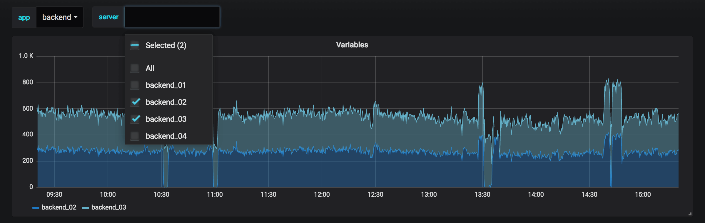

# Templates and variables

[Ориігнальна стаття](https://grafana.com/docs/grafana/latest/variables/)

Змінна - це заповнювач для значення. Ви можете використовувати змінні в метричних запитах та у заголовках панелей. Отже, коли ви змінюєте значення за допомогою спадного меню у верхній частині інформаційної панелі, показники запитів вашої панелі змінюватимуться, щоб відображати нове значення.

Змінні дозволяють створювати більш інтерактивні та динамічні інформаційні панелі. Замість жорстко кодованих речей, таких як імена серверів, програм та датчиків у ваших метричних запитах, ви можете використовувати змінні замість них. Змінні відображаються у спадному списку у верхній частині інформаційної панелі. Ці випадаючі меню дозволяють легко змінити дані, що відображаються на вашій інформаційній панелі.

 

Вони можуть бути особливо корисними для адміністраторів, які хочуть дозволити глядачам Grafana швидко регулювати візуалізації, але не хочуть надавати їм повні дозволи на редагування. Користувачі Grafana можуть використовувати змінні.

Змінні та шаблони також дозволяють використовувати інформаційні панелі з одним джерелом. Якщо у вас декілька однакових джерел даних або серверів, ви можете створити одну інформаційну панель і використовувати змінні, щоб змінити те, що ви переглядаєте. Це надзвичайно спрощує технічне обслуговування та утримання.

## Шаблони (Templates)

*Шаблон* - це будь-який запит, що містить змінну.

Наприклад, якщо ви б керували інформаційною панеллю для моніторингу декількох серверів, ви б *могли* зробити інформаційну панель для кожного сервера. Або ви можете створити одну інформаційну панель і використовувати панелі із запитами шаблону, як цей:

```
wmi_system_threads{instance=~"$server"}
```

Значення змінних завжди синхронізуються з URL-адресою за допомогою синтаксису `var-<varname>=value`.

## Приклади шаблонів та змінних

Щоб переглянути приклади змінних та шаблонів, перейдіть на будь-яку інформаційну панель, перелічену в [Приклади змінних](https://grafana.com/docs/grafana/latest/variables/variable-examples/).

Змінні перераховані у випадаючих списках у верхній частині екрана. Виберіть різні змінні, щоб побачити, як змінюються візуалізації.

Щоб переглянути налаштування змінних, перейдіть до **Dashboard Settings > Variables**. Клацніть змінну у списку, щоб побачити її налаштування.

Змінні можуть використовуватися в заголовках, описах, текстових панелях та запитах. Запити з текстом, який починається з `$`, є шаблонами. Не всі панелі матимуть шаблонні запити.

## Змінна найкраща практика

- Випадаючі списки змінних відображаються в тому порядку, в якому вони перелічені у списку змінних у налаштуваннях інформаційної панелі.
- Помістіть змінні, які ви часто будете змінювати, у верхній частині, щоб вони відображалися спочатку (вкрай ліворуч на інформаційній панелі).