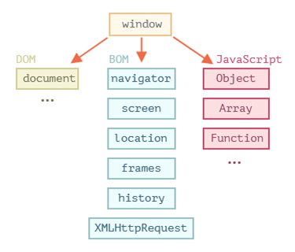

[До розділу](README.md)

# DOM

[Браузерное окружение, спецификации](https://learn.javascript.ru/browser-environment)

Сегодня JavaScript может использоваться в браузере, на веб-сервере  или в какой-то другой среде, даже в кофеварке. Каждая среда  предоставляет свою функциональность, которую спецификация JavaScript  называет *окружением*.

Окружение предоставляет свои объекты и дополнительные функции, в  дополнение базовым языковым. Браузеры, например, дают средства для  управления веб-страницами. Node.js делает доступными какие-то серверные  возможности и так далее.

На картинке ниже в общих чертах показано, что доступно для JavaScript в браузерном окружении:

Как мы видим, имеется корневой объект `window`, который выступает в 2 ролях:

1. Во-первых, это глобальный объект для JavaScript-кода, об этом более подробно говорится в главе [Глобальный объект](https://learn.javascript.ru/global-object).
2. Во-вторых, он также представляет собой окно браузера и располагает методами для управления им.

Например, здесь мы используем `window` как глобальный объект:

                                   

```javascript
function sayHi() {
  alert("Hello");
}

// глобальные функции доступны как методы глобального объекта:
window.sayHi();
```

А здесь мы используем `window` как объект окна браузера, чтобы узнать его высоту:

```javascript
alert(window.innerHeight); // внутренняя высота окна браузера
```

Существует гораздо больше свойств и методов для управления окном браузера. Мы рассмотрим их позднее.

## DOM (Document Object Model)

Document Object Model, сокращённо DOM – объектная модель документа, которая  представляет все содержимое страницы в виде объектов, которые можно  менять.

Объект `document` – основная «входная точка». С его помощью мы можем что-то создавать или менять на странице.

Например:

```javascript
// заменим цвет фона на красный,
document.body.style.background = "red";

// а через секунду вернём как было
setTimeout(() => document.body.style.background = "", 1000);
```

Мы использовали в примере только `document.body.style`, но на самом деле возможности по управлению страницей намного шире. Различные свойства и методы описаны в спецификации:

- **DOM Living Standard** на https://dom.spec.whatwg.org

Спецификация DOM  описывает структуру документа и предоставляет объекты для манипуляций со страницей. Существует и другие, отличные от браузеров, инструменты,  использующие DOM.

Например, серверные скрипты, которые загружают и обрабатывают  HTML-страницы, также могут использовать DOM. При этом они могут  поддерживать спецификацию не полностью.

Правила стилей CSS структурированы иначе чем HTML. Для них есть отдельная спецификация [CSSOM](https://www.w3.org/TR/cssom-1/), которая объясняет, как стили должны представляться в виде объектов, как их читать и писать.

CSSOM используется вместе с DOM при изменении стилей документа. В  реальности CSSOM требуется редко, обычно правила CSS статичны. Мы редко  добавляем/удаляем стили из JavaScript, но и это возможно.

## BOM (Browser Object Model)

Объектная модель браузера (Browser Object Model, BOM) – это дополнительные  объекты, предоставляемые браузером (окружением), чтобы работать со всем, кроме документа.

Например:

- Объект [navigator](https://developer.mozilla.org/ru/docs/Web/API/Window/navigator) даёт информацию о самом браузере и операционной системе. Среди множества его свойств самыми известными являются: `navigator.userAgent` – информация о текущем браузере, и `navigator.platform` – информация о платформе (может помочь в понимании того, в какой ОС открыт браузер – Windows/Linux/Mac и так далее).
- Объект [location](https://developer.mozilla.org/ru/docs/Web/API/Window/location) позволяет получить текущий URL и перенаправить браузер по новому адресу.

Вот как мы можем использовать объект `location`:      

```javascript
alert(location.href); // показывает текущий URL
if (confirm("Перейти на Wikipedia?")) {
  location.href = "https://wikipedia.org"; // перенаправляет браузер на другой URL
}
```

Функции `alert/confirm/prompt` тоже являются  частью BOM: они не относятся непосредственно к странице, но представляют собой методы объекта окна браузера для коммуникации с пользователем.

BOM является частью общей [спецификации HTML](https://html.spec.whatwg.org).

Да, вы всё верно услышали. Спецификация HTML по адресу https://html.spec.whatwg.org не только про «язык HTML» (теги, атрибуты), она также покрывает целое  множество объектов, методов и специфичных для каждого браузера  расширений DOM. Это всё «HTML в широком смысле». Для некоторых вещей  есть отдельные спецификации, перечисленные на https://spec.whatwg.org.

# DOM-дерево

Основой HTML-документа являются теги.

В соответствии с объектной моделью документа («Document Object  Model», коротко DOM), каждый HTML-тег является объектом. Вложенные теги  являются «детьми» родительского элемента. Текст, который находится  внутри тега, также является объектом.

Все эти объекты доступны при помощи JavaScript, мы можем использовать их для изменения страницы.

Например, `document.body` – объект для тега `<body>`.

Если запустить этот код, то `<body>` станет красным на 3 секунды:


```javascript

document.body.style.background = 'red'; // сделать фон красным

setTimeout(() => document.body.style.background = '', 3000); // вернуть назад
```

Это был лишь небольшой пример того, что может DOM. Скоро  мы изучим много способов работать с DOM, но сначала нужно познакомиться с его структурой.

## [Пример DOM](https://learn.javascript.ru/dom-nodes#primer-dom)

Начнём с такого, простого, документа:

​                      

​                      

```markup

<!DOCTYPE HTML>
<html>
<head>
  <title>О лосях</title>
</head>
<body>
  Правда о лосях.
</body>
</html>
```

DOM – это представление HTML-документа в виде дерева тегов. Вот как оно выглядит:


▾ HTML


▾ HEAD


\#text ↵␣␣␣␣


▾ TITLE


\#text О лосях


\#text ↵␣␣


\#text ↵␣␣


▾ BODY


\#text   Правда о лосях.

На рисунке выше узлы-элементы можно кликать, и их дети будут скрываться и раскрываться.

Каждый узел этого дерева – это объект.

Теги являются *узлами-элементами* (или просто элементами). Они образуют структуру дерева: `<html>` – это корневой узел, `<head>` и `<body>` его дочерние узлы и т.д.

Текст внутри элементов образует *текстовые узлы*, обозначенные как `#text`. Текстовый узел содержит в себе только строку текста. У него не может  быть потомков, т.е. он находится всегда на самом нижнем уровне.

Например, в теге `<title>` есть текстовый узел `"О лосях"`.

Обратите внимание на специальные символы в текстовых узлах:

- перевод строки: `↵` (в JavaScript он обозначается как `\n`)
- пробел: `␣`

Пробелы и переводы строки – это полноправные символы, как буквы и  цифры. Они образуют текстовые узлы и становятся частью дерева DOM. Так, в примере выше в теге `<head>` есть несколько пробелов перед `<title>`, которые образуют текстовый узел `#text` (он содержит в себе только перенос строки и несколько пробелов).

Существует всего два исключения из этого правила:

1. По историческим причинам пробелы и перевод строки перед тегом `<head>` игнорируются
2. Если мы записываем что-либо после закрывающего тега `</body>`, браузер автоматически перемещает эту запись в конец `body`, поскольку спецификация HTML требует, чтобы всё содержимое было внутри `<body>`. Поэтому после закрывающего тега `</body>` не может быть никаких пробелов.

В остальных случаях всё просто – если в документе есть пробелы (или  любые другие символы), они становятся текстовыми узлами дерева DOM, и  если мы их удалим, то в DOM их тоже не будет.

Здесь пробельных текстовых узлов нет:

```markup

<!DOCTYPE HTML>
<html><head><title>О лосях</title></head><body>Правда о лосях.</body></html>
```


▾ HTML


▾ HEAD


▾ TITLE


\#text О лосях


▾ BODY


\#text Правда о лосях.

Пробелы по краям строк и пробельные текстовые узлы скрыты в инструментах разработки

Когда мы работаем с  деревом DOM, используя инструменты разработчика в браузере (которые мы  рассмотрим позже), пробелы в начале/конце текста и пустые текстовые узлы (переносы строк) между тегами обычно не отображаются.

Таким образом инструменты разработки экономят место на экране.

В дальнейших иллюстрациях DOM мы также будем для краткости пропускать пробельные текстовые узлы там, где они не имеют значения. Обычно они не влияют на то, как отображается документ.

## [Автоисправление](https://learn.javascript.ru/dom-nodes#avtoispravlenie)

Если браузер сталкивается с некорректно написанным HTML-кодом, он автоматически корректирует его при построении DOM.

Например, в начале документа всегда должен быть тег `<html>`. Даже если его нет в документе – он будет в дереве DOM, браузер его создаст. То же самое касается и тега `<body>`.

Например, если HTML-файл состоит из единственного слова `"Привет"`, браузер обернёт его в теги `<html>` и `<body>`, добавит необходимый тег `<head>`, и DOM будет выглядеть так:


▾ HTML


▾ HEAD


▾ BODY


\#text Привет

При генерации DOM браузер самостоятельно обрабатывает ошибки в документе, закрывает теги и так далее.

Есть такой документ с незакрытыми тегами:

```markup

<p>Привет
<li>Мама
<li>и
<li>Папа
```

…Но DOM будет нормальным, потому что браузер сам закроет теги и восстановит отсутствующие детали:


▾ HTML


▾ HEAD


▾ BODY


▾ P


\#text Привет


▾ LI


\#text Мама


▾ LI


\#text и


▾ LI


\#text Папа

Таблицы всегда содержат `<tbody>`

Важный «особый случай» – работа с таблицами. По стандарту DOM у них должен быть `<tbody>`, но в HTML их можно написать (официально) без него. В этом случае браузер добавляет `<tbody>` в DOM самостоятельно.

Для такого HTML:

```markup

<table id="table"><tr><td>1</td></tr></table>
```

DOM-структура будет такой:


▾ TABLE


▾ TBODY


▾ TR


▾ TD


\#text 1

Видите? Из пустоты появился `<tbody>`, как будто документ и был таким. Важно знать об этом, иначе при работе с таблицами возможны сюрпризы.

## [Другие типы узлов](https://learn.javascript.ru/dom-nodes#drugie-tipy-uzlov)

Есть и некоторые другие типы узлов, кроме элементов и текстовых узлов.

Например, узел-комментарий:

```markup

<!DOCTYPE HTML>
<html>
<body>
  Правда о лосях.
  <ol>
    <li>Лось -- животное хитрое</li>
    <!-- комментарий -->
    <li>...и коварное!</li>
  </ol>
</body>
</html>
```


▾ HTML


▾ HEAD


▾ BODY


\#text   Правда о лосях.    


▾ OL


\#text ↵␣␣␣␣␣␣


▾ LI


\#text Лось -- животное хитрое


\#text ↵␣␣␣␣␣␣


\#comment комментарий


\#text ↵␣␣␣␣␣␣


▾ LI


\#text ...и коварное!


\#text ↵␣␣␣␣


\#text ↵␣␣↵

Здесь мы видим узел нового типа – *комментарий*, обозначенный как `#comment`, между двумя текстовыми узлами.

Казалось бы – зачем комментарий в DOM? Он никак не влияет на  визуальное отображение. Но есть важное правило: если что-то есть в HTML, то оно должно быть в DOM-дереве.

**Все, что есть в HTML, даже комментарии, является частью DOM.**

Даже директива `<!DOCTYPE...>`, которую мы ставим в начале HTML, тоже является DOM-узлом. Она находится в дереве DOM прямо перед `<html>`. Мы не будем рассматривать этот узел, мы даже не рисуем его на наших диаграммах, но он существует.

Даже объект `document`, представляющий весь документ, формально является DOM-узлом.

Существует [12 типов узлов](https://dom.spec.whatwg.org/#node). Но на практике мы в основном работаем с 4 из них:

1. `document` – «входная точка» в DOM.
2. узлы-элементы – HTML-теги, основные строительные блоки.
3. текстовые узлы – содержат текст.
4. комментарии – иногда в них можно включить информацию, которая не будет показана, но доступна в DOM для чтения JS.

## [Поэкспериментируйте сами](https://learn.javascript.ru/dom-nodes#poeksperimentiruyte-sami)

Чтобы посмотреть структуру DOM в реальном времени, попробуйте [Live DOM Viewer](http://software.hixie.ch/utilities/js/live-dom-viewer/). Просто введите что-нибудь в поле, и ниже вы увидите, как меняется DOM.

Другой способ исследовать DOM – это использовать инструменты  разработчика браузера. Это то, что мы каждый день делаем при разработке.

Для этого откройте страницу [elks.html](https://learn.javascript.ru/article/dom-nodes/elks.html), включите инструменты разработчика и перейдите на вкладку Elements.

Выглядит примерно так:


Вы можете увидеть DOM, понажимать на элементы, детально рассмотреть их и так далее.

Обратите внимание, что структура DOM в инструментах разработчика  отображается в упрощённом виде. Текстовые узлы показаны как простой  текст. И кроме пробелов нет никаких «пустых» текстовых узлов. Ну и  отлично, потому что большую часть времени нас будут интересовать  узлы-элементы.

Клик по этой  кнопке в левом верхнем углу инспектора позволяет при помощи мыши (или  другого устройства ввода) выбрать элемент на веб-странице и  «проинспектировать» его (браузер сам найдёт и отметит его во вкладке  Elements). Этот способ отлично подходит, когда у нас огромная  HTML-страница (и соответствующий ей огромный DOM), и мы хотим увидеть,  где находится интересующий нас элемент.

Есть и другой способ сделать это: можно кликнуть на странице по  элементу правой кнопкой мыши и в контекстном меню выбрать «Inspect».


В правой части инструментов разработчика находятся следующие подразделы:

- **Styles** – здесь мы видим CSS, применённый к текущему элементу: правило за правилом, включая встроенные стили (выделены  серым). Почти всё можно отредактировать на месте, включая размеры,  внешние и внутренние отступы.
- **Computed** – здесь мы видим итоговые CSS-свойства  элемента, которые он приобрёл в результате применения всего каскада  стилей (в том числе унаследованные свойства и т.д.).
- **Event Listeners** – в этом разделе мы видим обработчики событий, привязанные к DOM-элементам (мы поговорим о них в следующей части учебника).
- … и т.д.

Лучший способ изучить инструменты разработчика – это прокликать их.  Большинство значений можно менять и тут же смотреть результат.

## [Взаимодействие с консолью](https://learn.javascript.ru/dom-nodes#vzaimodeystvie-s-konsolyu)

При работе с DOM нам часто требуется применить к нему JavaScript. Например: получить узел и запустить какой-нибудь код для его изменения, чтобы  посмотреть результат. Вот несколько подсказок, как перемещаться между  вкладками Elements и Console.

Для начала:

1. На вкладке Elements выберите первый элемент `<li>`.
2. Нажмите Esc – прямо под вкладкой Elements откроется Console.

Последний элемент, выбранный во вкладке Elements, доступен в консоли как `$0`; предыдущий, выбранный до него, как `$1` и т.д.

Теперь мы можем запускать на них команды. Например `$0.style.background = 'red'` сделает выбранный элемент красным, как здесь:


Это мы посмотрели как получить узел из Elements в Console.

Есть и обратный путь: если есть переменная `node`, ссылающаяся на DOM-узел, можно использовать в консоли команду `inspect(node)`, чтобы увидеть этот элемент во вкладке Elements.

Или мы можем просто вывести DOM-узел в консоль и исследовать «на месте», как `document.body` ниже:


Это может быть полезно для отладки. В следующей главе мы рассмотрим доступ и изменение DOM при помощи JavaScript.

Инструменты разработчика браузера отлично помогают в разработке: мы  можем исследовать DOM, пробовать с ним что-то делать и смотреть, что  идёт не так.