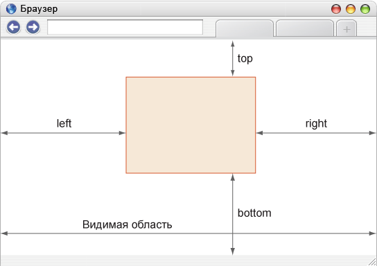
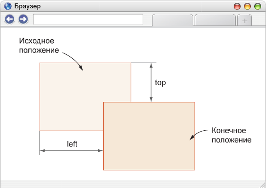
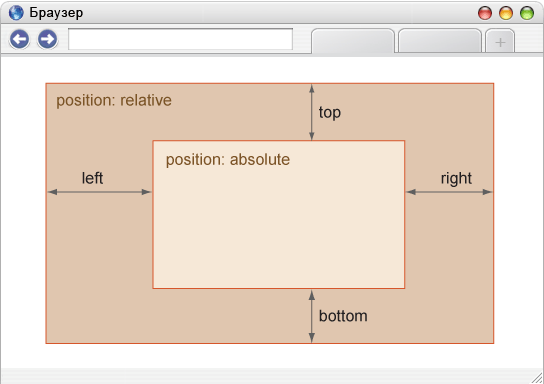

[До розділу](README.md)

# DIV

## Позиціонування

[Позиционирование элементов](http://htmlbook.ru/samlayout/blochnaya-verstka/pozitsionirovanie-elementov)

Позиціонуванням називається положення елемента в системі координат. Розрізняють чотири типи позиціонування: 

- нормальне, 
- абсолютне, 
- фіксоване 
- відносне. 

Залежно від типу, який встановлюється через властивість position, змінюється і система координат.

Завдяки комбінації властивостей `position`, `left`, `top`, `right` і `bottom` елемент можна накладати один на інший, виводити в точці з певними координатами, фіксувати в зазначеному місці, визначити положення одного елемента щодо іншого та ін. Подібно до інших властивостей CSS управління позиціонуванням доступно через скрипти. Таким чином, можна динамічно змінювати положення елементів без перезавантаження сторінки, створюючи анімацію і різні ефекти.

### Нормальне позиціонування

Якщо для елемента властивість `position` не задано або його значення `static`, елемент виводиться в потоці документа як зазвичай. Іншими словами, елементи відображаються на сторінці в тому порядку, як вони йдуть у вихідному коді HTML. Властивості `left`, `top`, `right`, `bottom` якщо визначені, ігноруються.

### Абсолютне позиціонування

При абсолютному позиціонуванні елемент не існує в потоці документа а його положення задається щодо країв браузера. Задати цей тип можна через властивість `position` вказавши значення `absolute` . Координати вказуються щодо країв вікна браузера, званого «видимою областю» (рис. 3.42).

Для режиму характерні наступні особливості.

- Ширина шару (слою), коли її не вказано явно, дорівнює ширині контенту плюс значення полів, меж і відступів.
- Шар не змінює своє початкове положення, якщо у нього немає властивостей `right`, `left`, `top` і `bottom`.
- Властивості `left` і `top` мають більш високий пріоритет у порівнянні з `right` і `bottom`. Якщо `left` і `right` суперечать один одному, то значення `right` ігнорується. Те ж саме стосується і `bottom`.
- Якщо `left` задати від'ємне значення, то шар піде за лівий край браузера, смуги прокрутки при цьому не виникне. Це один із способів заховати елемент від перегляду. Те саме можна сказати і до властивості `top`, тільки шар піде за верхній край.
- Якщо `left` задати значення більше ширини видимої області або вказати `right` з від'ємним значенням, з'явиться горизонтальна смуга прокрутки. Подібне правило працює і з `top`, тільки мова піде про вертикальну смугу прокрутки.
- Одночасно зазначені властивості `left` і `right` формують ширину шару, але тільки якщо `width` не вказано. Варто додати властивість `width` і значення `right` буде проігноровано. Аналогічно відбудеться і з висотою шару, тільки вже беруть участь властивості `top`, `bottom` і `height`.
- Елемент з абсолютним позиціонуванням переміщається разом з документом при його прокручуванні.

Властивість `position` зі значенням `absolute` можна використовувати для створення ефекту фреймів. Крім абсолютного позиціонування для елементів необхідно призначити властивість `overflow` із значенням `auto`. Тоді при перевищенні контентом висоти видимої області з'явиться смуга прокрутки. Висота і ширина «фреймів» формується автоматично шляхом одночасного використання властивостей `left`, `right` для ширини і `top`, `bottom` для висоти ([приклад](http://htmlbook.ru/samlayout/blochnaya-verstka/pozitsionirovanie-elementov)).

Абсолютне позиціонування також застосовується для створення різних ефектів, наприклад, підказки до фотографій. На відміну від атрибута `title` тега `` який також виводить текст підказки, через стилі можна управляти видом тексту виведеного за допомогою скрипта.

### Фіксоване положення

Фіксоване положення шару задається значенням `fixed` властивості `position` і за своєю дією схоже на абсолютне позиціонування. Але на відміну від нього прив'язується до зазначеної властивостями `left`, `top`, `right` і `bottom` точці на екрані і не змінює свого положення при прокручуванні веб-сторінки. Ще одна різниця від `absolute` полягає в тому, що при виході фіксованого шару за межі видимої області праворуч або знизу від неї, не виникає смуг прокрутки.

Застосовується такий тип позиціонування для створення меню, вкладок, заголовків, в загальному, будь-яких елементів, які повинні бути закріплені на сторінці і завжди видно відвідувачу. У прикладі 3.35 показано додавання підвалу, який залишається на одному місці незалежно від обсягу інформації на сайті.

### Відносне позиціонування

Якщо властивості `position` задати значення `relative`, то положення елемента встановлюється щодо його вихідного місця. Додавання властивостей `left`, `top`, `right` і `bottom` змінює позицію елемента і зрушує його в ту чи іншу сторону від первісного розташування. Позитивне значення `left` визначає зрушення вправо від лівої межі елемента, негативне - зрушення вліво. Позитивне значення `top` задає зсув елемента вниз (рис. 3.46), негативне - зрушення вгору.

Для відносного позиціонування характерні наступні особливості.

- Цей тип позиціонування не застосовний до елементам таблиці на зразок комірок, рядків, колонок та ін.
- При зміщенні елемента щодо вихідного положення, місце, яке займав елемент, залишається порожнім і не заповнюється нижче або встановленими вище елементами.

### Вкладені шари

Зазвичай відносне позиціонування саме по собі застосовується не часто, оскільки є ряд властивостей виконують фактично ту ж роль, наприклад, той же `margin`. Але поєднання різних типів позиціонування для вкладених шарів є одним із зручних і практичних прийомів верстки. Якщо для батьківського елемента задати `relative`, а для дочірнього `absolute`, то відбудеться зміна системи координат і положення дочірнього елемента при цьому вказується щодо його батька (рис. 3.49).

Відлік координат ведеться від внутрішнього краю кордону, значення полів не враховуються.

