[До розділу](README.md)

# Робота з таблицями

https://www.w3schools.com/html/html_tables.asp

Таблиці HTML дозволяють веб-розробникам упорядковувати дані в рядки та стовпці.

## Означення таблиці HTML

Таблиця в HTML складається з комірок таблиці всередині рядків і стовпців. Проста таблиця HTML:

```html
<table>
    <tr>    
    	<th>Company</th>     
    	<th>Contact</th>     
    	<th>Country</th>   
    </tr>
    <tr>    
        <td>Alfreds Futterkiste</td>
        <td>Maria    Anders</td>
        <td>Germany</td>
    </tr>  
    <tr>    
        <td>Centro    comercial Moctezuma</td>
        <td>Francisco    Chang</td>
        <td>Mexico</td>
    </tr>
</table>  
```

<table>  <tr>    <th>Company</th>     <th>Contact</th>     <th>Country</th>   </tr>  <tr>    <td>Alfreds Futterkiste</td>     <td>Maria    Anders</td>     <td>Germany</td>   </tr>  <tr>    <td>Centro    comercial Moctezuma</td>     <td>Francisco    Chang</td>     <td>Mexico</td>   </tr></table>  

[Спробувати](https://www.w3schools.com/html/tryit.asp?filename=tryhtml_table_intro)

## Клітинки таблиці

Кожна клітинка таблиці визначається тегами `<td>` і `</td>`. `td` означає дані таблиці (table data). Усе, що знаходиться між `<td>` і `</td>`, є вмістом клітинки таблиці.

```html
<table>
    <tr>
        <td>Emil</td>
        <td>Tobias</td>
        <td>Linus</td>
    </tr>
</table> 
```

<table>  <tr>    <td>Emil</td>     <td>Tobias</td>     <td>Linus</td>   </tr></table>  

Клітинка таблиці може містити будь-які елементи HTML: text, images, lists, links, інші таблиці і т.п.

## Рядки таблиці

Кожен рядок таблиці починається тегом `<tr>` і закінчується тегом `</tr>`. `tr` означає рядок таблиці (table row).

```html
<table>
    <tr>
        <td>Emil</td>
        <td>Tobias</td>
        <td>Linus</td>
    </tr>
    <tr>
        <td>16</td>
        <td>14</td>
        <td>10</td>
    </tr>
</table>  
```

<table>  <tr>    <td>Emil</td>     <td>Tobias</td>     <td>Linus</td>   </tr>  <tr>    <td>16</td>     <td>14</td>     <td>10</td>   </tr></table>  

Ви можете мати скільки завгодно рядків у таблиці; просто переконайтеся, що кількість клітинок однакова в кожному рядку. Бувають випадки, коли рядок може мати менше або більше клітинок, ніж інший. Ви дізнаєтеся про це в наступному розділі.

## Заголовки таблиці

Іноді потрібно, щоб клітинки були клітинками заголовків таблиці. У таких випадках використовуйте тег `<th>` замість тегу `<td>`.`th` означає заголовок таблиці. Нехай перший рядок буде клітинками заголовка таблиці:

```html
<table>
    <tr>
        <th>Person 1</th>
        <th>Person 2</th>
        <th>Person    3</th>
    </tr>
    <tr>
        <td>Emil</td>
        <td>Tobias</td>
        <td>Linus</td>
    </tr>
    <tr>
        <td>16</td>
        <td>14</td> 
        <td>10</td>
    </tr>
</table> 
```

<table>  <tr>    <th>Person 1</th>     <th>Person 2</th>     <th>Person    3</th>   </tr>  <tr>    <td>Emil</td>     <td>Tobias</td>     <td>Linus</td>   </tr>  <tr>    <td>16</td>     <td>14</td>     <td>10</td>   </tr></table>  

За замовчуванням текст в елементах `<th>` виділяється жирним шрифтом і вирівнюється по центру, але ви можете змінити це за допомогою CSS.

## HTML Table Tags

| Tag                                                          | Description                                                  |
| ------------------------------------------------------------ | ------------------------------------------------------------ |
| [`<table>`](https://www.w3schools.com/tags/tag_th.asp)       | Defines a table                                              |
| [`<th>`](https://www.w3schools.com/tags/tag_th.asp)          | Defines a header cell in a table                             |
| [`<tr>`](https://www.w3schools.com/tags/tag_tr.asp)          | Defines a row in a table                                     |
| [`<td>`](https://www.w3schools.com/tags/tag_td.asp)          | Defines a cell in a table                                    |
| [`<caption>`](https://www.w3schools.com/tags/tag_caption.asp) | Defines a table caption                                      |
| [`<colgroup>`](https://www.w3schools.com/tags/tag_colgroup.asp) | Specifies a group of one or more columns in a table for formatting |
| [`<col>`](https://www.w3schools.com/tags/tag_col.asp)        | Specifies column properties for each column within a <colgroup> element |
| [`<thead>`](https://www.w3schools.com/tags/tag_thead.asp)    | Groups the header content in a table                         |
| [`<tbody>`](https://www.w3schools.com/tags/tag_tbody.asp)    | Groups the body content in a table                           |
| [`<tfoot>`](https://www.w3schools.com/tags/tag_tfoot.asp)    | Groups the footer content in a table                         |

## Рамки таблиці HTML

Таблиці HTML можуть мати рамки різних стилів і форм. Коли ви додаєте рамку до таблиці, ви також додаєте рамки навколо кожної клітинки таблиці. Щоб додати рамку, використовуйте властивість CSS `border` для елементів `table`, `th` і `td`. 

```html
<head><style>
table, th, td {
  border: 1px solid black;
}
</style></head>

<body>
<table style="width:100%">
  <tr>
    <th>Firstname</th>
    <th>Lastname</th> 
    <th>Age</th>
  </tr>
</table>
</body>
```

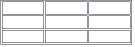

Приклад [за посиланням](https://www.w3schools.com/html/tryit.asp?filename=tryhtml_table_border) 

### Одинарні рамки

Щоб уникнути подвійних рамок, як у прикладі вище, встановіть для властивості CSS `border-collapse` значення `collapse`. Це призведе до того, що рамки згорнуться в одну рамку:

```css
 table, th, td {
 	border: 1px solid black;
 	border-collapse: collapse;
} 
```

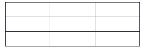

[Приклад](https://www.w3schools.com/html/tryit.asp?filename=tryhtml_table_collapse)

### Стиль рамок

Якщо ви встановите колір фону для кожної клітинки та надасте рамці білий колір (так само, як фон документа), ви отримаєте враження невидимої межі:

```css
table, th, td {
  border: 1px solid white;
  border-collapse: collapse;
}
th, td {
  background-color: #96D4D4;
}
```

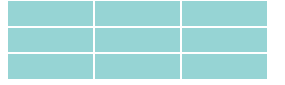

[Приклад](https://www.w3schools.com/html/tryit.asp?filename=tryhtml_table_border_style)

### Заокруглені рамки

За допомогою властивості `border-radius` межі отримують округлені кути:

```css
table, th, td {
  border: 1px solid black;
  border-radius: 10px;
}
```

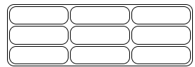

Пропустіть рамку навколо таблиці, виключивши `table` із селектора CSS:

```css
th, td {
  border: 1px solid black;
  border-radius: 10px;
}
```

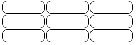

### Пунктирні та інші вигляди рамок

За допомогою властивості `border-style` ви можете встановити вигляд рамки.

```css
 th, td {
  border-style: dotted;
}
```

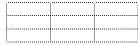

Допускаються такі значення:

- `dotted`   
- `dashed`   
- `solid`   
- `double`   
- `groove`    
- `ridge`    
- `inset`    
- `outset`    
- `none`   
- `hidden`   

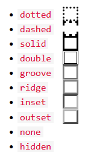

### Колір рамки

За допомогою властивості `border-color` ви можете встановити колір рамки.

```css
 th, td {
  border-style: dotted;
}
```

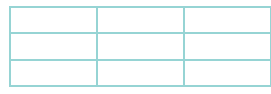

## Розміри таблиць HTML

Таблиці HTML можуть мати різні розміри для кожного стовпця, рядка або всієї таблиці. Використовуйте атрибут `style` із властивостями `width` або `height`, щоб вказати розмір таблиці, рядка або стовпця.

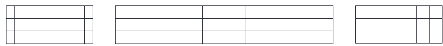

### Ширина таблиці

Щоб встановити ширину таблиці, додайте атрибут `style` до елемента `<table>`. Встановіть ширину таблиці на 100%.

```html
 <table style="width:100%">
  <tr>
    <th>Firstname</th>
    <th>Lastname</th>
    <th>Age</th>
  </tr>
  <tr>
    <td>Jill</td>
    <td>Smith</td>
    <td>50</td>
  </tr>
  <tr>
    <td>Eve</td>
    <td>Jackson</td>
    <td>94</td>
  </tr>
</table>  
```

Використання відсотка як одиниці розміру для ширини означає, наскільки широким буде цей елемент у порівнянні з його батьківським елементом, яким у даному випадку є елемент `<body>`.

### Ширина колонки

Щоб встановити розмір певного стовпця, додайте атрибут `style` до елемента `<th>` або `<td>`. Встановіть ширину першого стовпця на 70%:

```html
 <table style="width:100%">
  <tr>
    <th style="width:70%">Firstname</th>
    <th>Lastname</th>
    <th>Age</th>
  </tr>
  <tr>
    <td>Jill</td>
    <td>Smith</td>
    <td>50</td>
  </tr>
  <tr>
    <td>Eve</td>
    <td>Jackson</td>
    <td>94</td>
  </tr>
</table> 
```

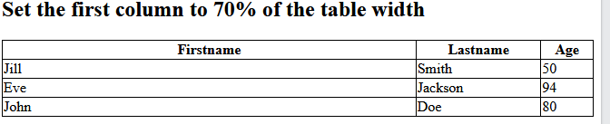

### Висота рядка

Щоб установити висоту певного рядка, додайте атрибут `style` до елемента рядка таблиці. Встановіть висоту другого рядка на 200 пікселів.

```html
 <table style="width:100%">
  <tr>
    <th>Firstname</th>
    <th>Lastname</th>
    <th>Age</th>
  </tr>
  <tr style="height:200px">
    <td>Jill</td>
    <td>Smith</td>
    <td>50</td>
  </tr>
  <tr>
    <td>Eve</td>
    <td>Jackson</td>
    <td>94</td>
  </tr>
</table> 
```

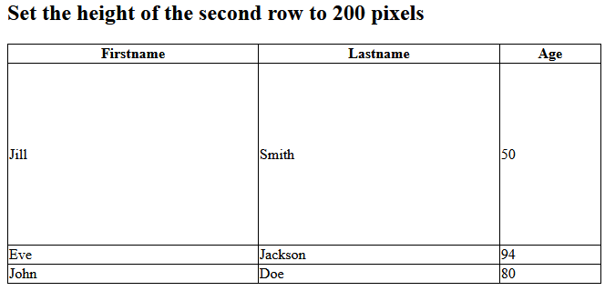

## Заголовки таблиць

https://www.w3schools.com/html/html_table_headers.asp

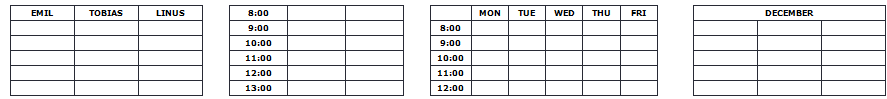

## Відступи та інтервали

https://www.w3schools.com/html/html_table_padding_spacing.asp

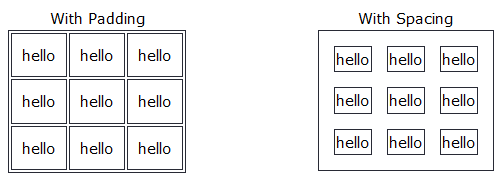

## Colspan & Rowspan

https://www.w3schools.com/html/html_table_colspan_rowspan.asp

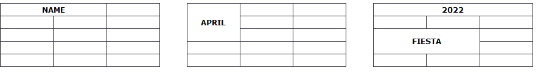

## Стилізація таблиць

https://www.w3schools.com/html/html_table_styling.asp

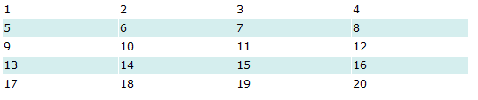

## Групування колонок

https://www.w3schools.com/html/html_table_colgroup.asp

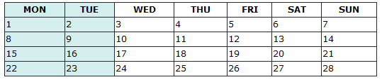
