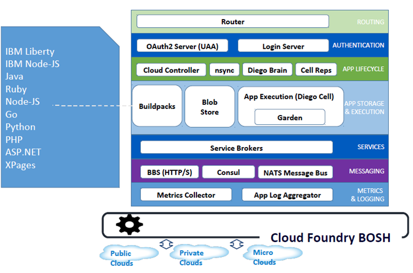
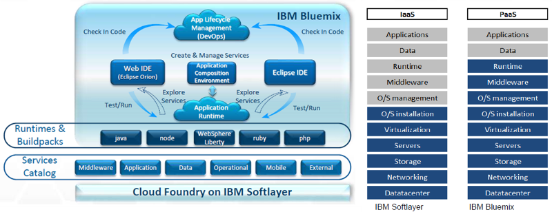
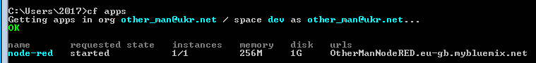
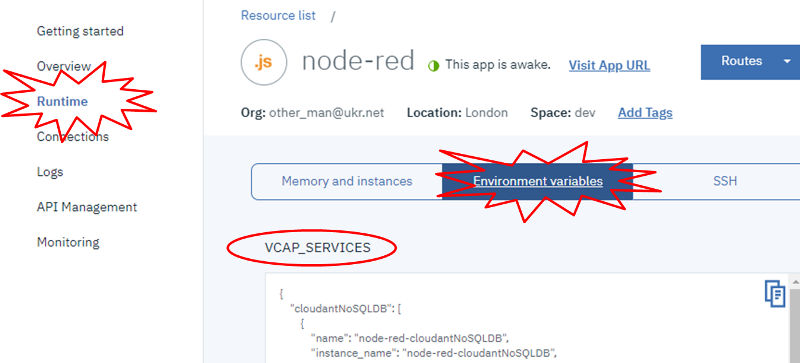
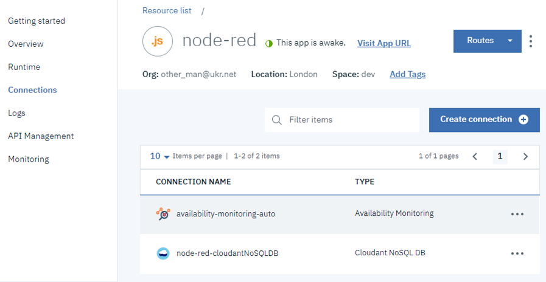
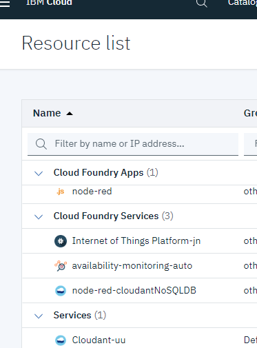
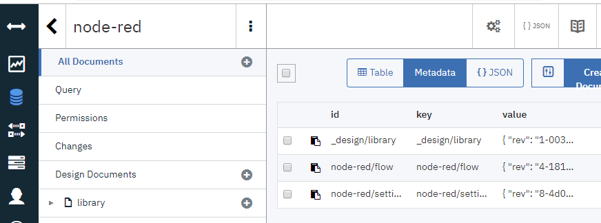
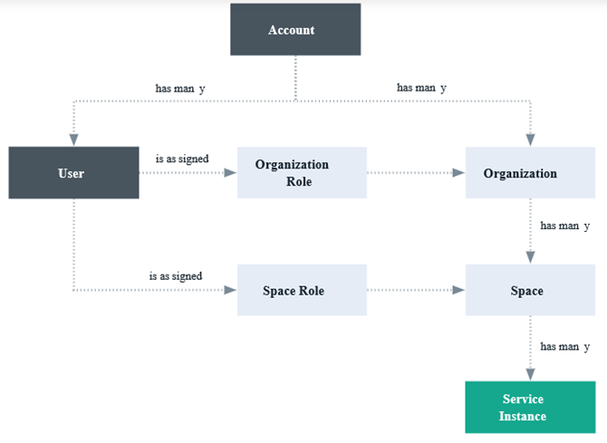
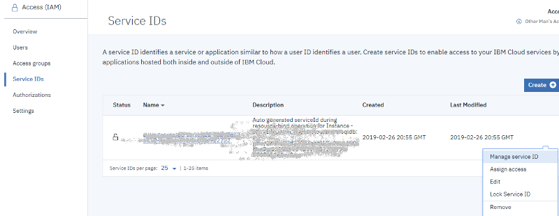
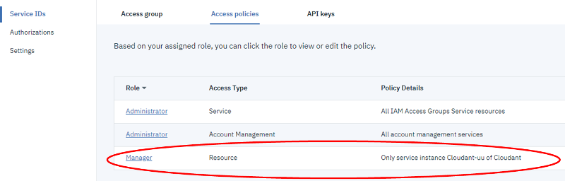

# Лабораторна робота №3. Xмарні сервіси для Індустрії 4.0

# Частина 3. Основи роботи з Cloud Foundry в IBM Cloud

**Мета**: навчитись керувати застосунками Cloud Foundry в IBM Cloud. 

Цілі: 

1. розібратися з механізмами роботи застосунків Cloud Foundry в IBM Cloud
2. встановити та навчитися працювати з Cloud Foundry Command Line Interface CLI

3. розібратися з механізмами взаємодії застосунків CF з сервісами IBM Cloud

4. розібратися з механізмами завантаження стартового пакету «Node-RED Starter» 


## 1. Механізми роботи застосунків Cloud Foundry в IBM Cloud 

SDK Node.js, що використовується в «Node-RED Starter», базується на **Cloud Foundry (CF),** який є провідним галузевим стандартом платформи як послуги (PaaS), що забезпечує швидке, просте та надійне розгортання хмарно-орієнтованих застосунків. Це платформа з відкритим вихідним кодом, яку можна розгортати для запуску своїх застосунків як на власній обчислювальній інфраструктурі, так і на існуючих IaaS (інфраструктура як послуга), таких як AWS, vSphere або OpenStack. 

Основні елементи CF показані на рис.1. Розроблені застосунки виконуються на віртуальних машинах **Diego Cell**.  Екземпляри застосунків (Application instances), прикладні задачі (application tasks) і задачі постановки (керування стадіями розгортання, staging tasks) виконуються як контейнери [Garden](https://docs.cloudfoundry.org/concepts/architecture/garden.html) на віртуальних машинах Diego Cell. Контейнер – це власне автономне середовище, в якому ізолюються процеси, пам'ять та файлова система, використовуючи функції операційної системи та характеристики віртуальної та фізичної інфраструктури, де розгортається CF. Ізоляція контейнерів досягається за допомогою використання окремих просторів імен ресурсів ядра (namespace). У кожному контейнері обмежується обсяг пам'яті, яку може використовувати контейнер, і кванти часу роботи CPU, доступ до яких потрібен також іншим контейнерам. Файлова система складається зі спільної для всіх контейнерів базової файлової системи (доступна тільки для читання), та контейнеро-залежної частини (доступний для читання/запису) унікальної для кожного контейнеру, розмір якої обмежений квотами проекту. 

                    

рис.1. Архітектура CF.

Установка Cloud Foundry виконує це на трьох рівнях:

1. [BOSH](https://bosh.io/docs/) - це ланцюг інструментів з відкритим кодом для розробки інженерних рішень, розгортання та управління життєвим циклом широкомасштабних розподілених сервісів. Для постачальників послуг Cloud Foundry, BOSH є платформою розгортання та керування за замовчуванням. BOSH створює і розгортає віртуальні машини (VM) поверх фізичної обчислювальної інфраструктури і розгортає і запускає Cloud Foundry поверх неї. Щоб налаштувати розгортання, BOSH слідує документу маніфесту. 
2. CF Cloud Controller запускає програми та інші процеси на віртуальних машинах хмари, балансуючи попит і керуючи життєвим циклом застосунків.
3. Маршрутизатор (router) направляє вхідний трафік з усього світу до віртуальних машин, які працюють з застосунками, зазвичай працюючи з балансувачем навантаження, наданим клієнтом.

Застосунки створюються для конкретної платформи, і вихідний код для них може знаходитися як в локальному сховищі (ПК розробника) так і на GitHub чи зовнішніх сховищах.  У Cloud Foundry для контролю версій вихідного коду, зборок (buildpacks), документації та інших ресурсів використовується git-система на GitHub. Однак для зберігання великих двійкових файлів, CF підтримує внутрішнє або зовнішнє блокове зберігання **Blob Store**.  У Blobstore міститься наступне:

- пакети вихідного програмного коду

- Buildpacks (збірки) 

- Droplets 


Пакети вихідного програмного коду створюються для конкретних програмних інструментів з використанням ряду мов. Зокрема, Node-RED базується на Node.js, тому пакет вихідного коду для «Node-RED Starter» розроблений з урахуванням вимог SDK Node.js. Для перетворення цього сирцевого коду в реальний застосунок використовується Buildpack. **Buildpack (збірка)** – це колекція коду, що відповідає за перетворення сирцевого коду застосунків в готові до запуску бінарні пакети (дроплети). Процеси, що відбуваються при такому перетворенні називаються **постановкою** (**staging**). Збірка містить всі мови, бібліотеки та служби, що використовує застосунок. Перш, ніж надсилати застосунок до віртуальної машини, контролер Хмари (Cloud Controller) перетворює її в образ, поєднуючи стек, buildpack та вихідний код у droplet, які VM може розпакувати, скомпілювати та запустити. **Droplet** (дроплет) – це пакет,  що містить усе необхідне для успішного запуску вашого застосунку (наприклад, JRE, Liberty, сам застосунок) однак без урахування операційної системи.

**Cloud Controller (Контролер хмари)** керує розгортанням застосунків з коду. Процес завантаження коду застосунку в хмару називається **push** (пуш) надалі по тексту буде використовуватися слово «**запушити**».  Щоб запушити код застосунку до Cloud Foundry, він спрямовується на Cloud Controller (через Router), який керує окремими комірками Diego для керування етапами та запусками застосунків. Щоб підтримувати доступність застсосунків, хмарні розгортання повинні постійно контролювати свої стани та узгоджувати їх з очікуваними станами, запускаючи та зупиняючи процеси за потребою. Компоненти nsync, BBS і Cell Rep співпрацюють разом по ланцюжку, щоб підтримувати роботу застосунків з необхідною кількістю екземплярів. 

Зазвичай програми залежать від таких сервісів, як бази даних або сторонні постачальники SaaS. Коли розробник передбачає та прив'язує сервіс до застсоунку, брокер сервісу (**Service Broker**) для цієї служби несе відповідальність за надання екземпляру сервісу.

Маршрутизатор (**router**)  направляє вхідний трафік на відповідний компонент - Cloud Controller, або розміщений застосунок, запущений в комірці Diego. Маршрутизатор періодично надсилає запит до системи дошки оголошень Diego (**BBS**), щоб визначити, в яких комірках і контейнерах зараз працює кожен застосунок. Використовуючи цю інформацію, маршрутизатор перераховує нові таблиці маршрутизації на основі IP-адрес кожної віртуальної машини (VM) і номера порту на стороні хоста для контейнерів комірки.

CF керує обліковими записами користувачів за допомогою двох серверів: автентифікації та авторизації користувачів. Для забезпечення керуванням ідентифікацією разом працюють сервери **OAuth2 server** (the [UAA](https://docs.cloudfoundry.org/concepts/architecture/uaa.html)) та **Login Server**. Один сервер UAA надає доступ до BOSH, і має аккаунти для операторів CF, які розгортають середовище виконання, сервіси та інше програмне забезпечення безпосередньо на слой BOSH. Інший сервер UAA керує доступом до Cloud Controller і визначає, хто може йому надавати команди. UAA Cloud Controller означує різні ролі користувачів, такі як адміністратор, розробник або аудитор, і надає їм різні набори привілеїв для запуску CF-команд

Компоненти Cloud Foundry спілкуються двома способами (**Messaging**):

- Надсилаючи повідомлення внутрішньо, використовуючи протоколи HTTP і HTTPS

- Надсилаючи повідомлення NATS один одному безпосередньо


Cloud Foundry створює системні журнали з компонентів Cloud Foundry та журналів програм із розміщених застосунків. Коли працює Cloud Foundry, його компонентні та хост-віртуальні машини генерують журнали та метрики. Застосунки Cloud Foundry також зазвичай генерують журнали. Система Loggregator об'єднує метрики компонентів і журнали застосунків у структуровану, корисну форму Firehose, яку можна переглянути у будь який момент постановки. 

​      **IBM** **Bluemix** є рішенням CF поверх IBM Cloud IaaS (рис.2). Доступ до конфігурування, керування та діагностування застосунками може відбуватися як через WEB IDE (консоль), що використовувався в частині 3.1 лабораторної роботи, так і через класичний клієнтський Cloud Foundry Command Line Interface (CLI). Доступне керування життєвим циклом застосунків через утиліти DevOps, також можлива інтеграція з Eclips IDE. В наступному пункті, для керування розгортуванням буде використовуватися утиліта CLI.    

 

рис.2.Функціонування Cloud Foundry в IBM Cloud

## 2. Інсталяція та знайомство з CLI (Cloud Foundry Command Line Interface) 

###### 2.1. Інсталяція CLI.

Завантажте **Cloud Foundry Command Line Interface** з цієї [сторінки ](https://docs.cloudfoundry.org/cf-cli/install-go-cli.html) . Для ОС Windows 64 bit пряме посилання для завантаження архіву знаходиться [за цим посиланням](https://cli.run.pivotal.io/stable?release=windows64&source=github). Для 32-х бітних версій Windows та інших ОС можна скористатися попередніми [версіями CLI](https://github.com/cloudfoundry/cli/releases), зокрема [звідси](https://packages.cloudfoundry.org/stable?release=windows32&version=6.43.0&source=github-rel) ставиться для Win32. 

Розпакуйте  архів і запустіть інсталяцію з файлу cf_installer.exe. 

###### 2.2. Виведення базових опцій команди CLI.

CLI є консольною утилітою. Запустіть командний рядок (cmd) в якому наберіть команду 

```
cf
```

Набір cf без аргументів виводить перелік найбільш вживаних глобальних опцій.

Перелік всіх опцій наведений [за цим посиланням](https://docs.cloudfoundry.org/cf-cli/cf-help.html).

###### 2.3. Конфігурування точки доступу консолі до хмари.

Для доступу для керування Cloud Foundry необхідно ввести точку доступу API. Для цього використовується опція api. Для отримання допомоги по даній опції в командному рядку наберіть: 

```
cf api -h
```

Введення опції передбачає вказівку URL в якості точки введення. Якщо URL не вказаний, команда виводить точку доступу API, яка зараз використовується.  Для керування хмарним застосунком Node-RED необхідно підключитися до [https://api.eu-gb.bluemix.net](https://api.eu-gb.bluemix.net), тобто ввести:

```
cf api https://api.eu-gb.bluemix.net
```

###### 2.4. Реєстрація користувача.

Після успішного задавання точки доступу необхідно залогуватися за допомогою опції login

```
cf login
```

після чого ввести

- ім’я користувача (пошта)

- і пароль (при введенні паролю символи не відображаються)


###### 2.5. Перегляд списку та стану застосунків

Для перегляду стану застосунків введіть команду 

```
cf apps
```

При нормальному стані список матиме вигляд як на рис.3. 

 

рис.3.

Однак, якщо після минулого запуску застосунок переходив у режим sleep (про це мало повідомлятися поштою), він можливо буде знаходитися в режимі помилки. Як виправити цю ситуацію буде розглянуто нижче. 

Більш детальну інформацію про застосунок можна отримати по команді

```
cf app app_name
```

де app_name – назва застосунку Node-RED.

Зробіть копію екрану для звіту.

###### 2.6. Перегляд значення змінних середовища

**Змінні середовища** (**Environment Variables**) - це засіб, за допомогою якого середовище виконання CF взаємодіє з розгорнутим застосунком. Змінні середовища можуть використовуватися для задавання параметрів роботи застосунків. Значення змінних середовища можна подивитися через IBM Cloud консоль.

Увійдіть у консоль вашого аккаунту IBM Cloud [https://cloud.ibm.com/login](https://cloud.ibm.com/login). Перейдіть до налаштування вашого застосунку Node-RED. Перейдіть на вкладку «Runtime» ->  «Environment variables» (рис.4) 

 

рис.4

Для перегляду змінних середовища можна скористатися командою CLI. Наберіть команду:

```
cf env  ap_name
```

де ap_name – назва застосунку Node-RED.

Перелік усіх змінних середовища CF доступний за [цим посиланням](https://docs.cloudfoundry.org/devguide/deploy-apps/environment-variable.html). Змінна [VCAP_SERVICES](https://docs.cloudfoundry.org/devguide/deploy-apps/environment-variable.html#VCAP-SERVICES) вміщує дані про ті сервіси, до яких відбувається під’єднання, і вона може бути використана на всіх стадіях розгортування та роботи застосунку. Згідно опису, ця змінна має JSON формат, який включає в себе об’єкти, кожен з яких відповідає за сервіс, який підключений до застосунку.

###### 2.7. Перегляд списку підключених сервісів

Подивіться на змінну VCAP_SERVICES, знайдіть, які сервіси підключені. Перелік цих сервісів також доступний у консолі на вкладці Connections (рис.5)  

   

рис.5

Також вони будуть доступними в переліку сервісів Cloud Foundry (Resource list) (рис.6).

 

рис.6

Також їх можна подивитися через CLI, у командному рядку введіть 

```
cf services
```

Зробіть копію екрану.

У таблиці 1 наведені поля сервісів. Проаналізуйте значення цих полів та знайдіть їх в налаштуваннях сервісу Cloudant з Cloud Foundry Services консолі. 

Таб.1 Призначення полів VCAP_SERVICES

| Attribute     | Description                                                  |
| ------------- | ------------------------------------------------------------ |
| binding_name  | Ім'я, присвоєне сервісу,  яке прив'язується користувачем     |
| instance_name | Ім'я, присвоєне  користувачем                                |
| name          | Ім'я binding_name, якщо  воно існує; інакше ім'я екземпляру  |
| label         | Назва мітки сервісу                                          |
| tags          | Масив рядків, які застосунок  може використовувати для ідентифікації екземпляра сервісу |
| plan          | План обслуговування,  вибраний під час створення екземпляра сервісу |
| credentials   | Об'єкт JSON, що  містить облікові дані, необхідні для доступу до екземпляра сервісу |

## 3. Зв'язок застосунку Node-RED з сервісом Cloudant 

###### 3.1. Робота застосунку Node-RED з сервісом Cloudant 

Хмарний застосунок Node-RED зі стартового набору Node-RED Starter побудований таким чином, що зберігає усі необхідні налаштування в Cloudant. Зокрема, це перелік встановлених модулів та потоки (програма користувача). Необхідність такого збереження пов’язана з тим, що при кожному розгортанні застосунку в droplet, весь його зміст замінюється, тому увесь довготривалий контент необхідно зберігати в зовнішньому сховищі. Cloudant для цього добре підходить, так як Node-RED увесь зміст зберігає в форматі JSON. Щоб переконатися в цьому, достатньо відкрити базу даних Cloudant, що відповідає за Node-RED. 

Використовуючи список ресурсів перейдіть на вікно керування сервісом Cloudant (Cloudant Dashboard). У вікні Manage, натисніть “Launch Cloudant Dashboard” для запуску сторінки адміністрування сервісу. У переліку баз даних знайдіть ту, що відповідає за Node-RED, як правило її назва відповідає назві застосунку Node-RED, або має назву «nodered». Структура БД повинна мати три документи (див.рис.7).  

 

рис.7

​      Відкрийте документ з назвою, що закнічується на «/settings». У ньому вміщуються налаштування модулів. Там також будуть модулі, які Ви встановлювали в минулій частині лабораторної роботи: "node-red-dashboard" та "node-red-contrib-cos".

Відкрийте документ з назвою, що закнічується на «/flow». У ньому вміщується зміст потоків, які Ви розробляли на минулій частині лабораторної роботи.

Нижче розглянемо як відбувається зв'язок застосунку Node-RED із сервісом Cloudant.  

###### 3.2. Доступ до сервісів Cloud Foundry

У частині 3.2 лабораторної роботи було показано, що доступ до сервісів IBM відбувається за схемою IAM (IBM Cloud Identity and Access Management). Однак з точки зору Cloud Foundry доступ до сервісів  відбувається за іншою схемою, яка показана на рис.8. 

 

 

рис.8

Ролі Cloud Foundry надають доступ до організацій (organizations) і просторів (spaces) у межах облікового запису. Ролі Cloud Foundry не дозволяють користувачам виконувати дії в контексті сервісу в обліковому записі, як це робиться в IAM. На рівні організації можна призначити такі ролі:

Таблиця 2. Ролі на рівні org.

| Organization  role | Permissions  (Дозволи)                                       |
| ------------------ | ------------------------------------------------------------ |
| Manager            | Керівники організацій можуть створювати, переглядати,  редагувати або видаляти spaces  в організації, переглядати використання організації та квоти,  запрошувати користувачів до організації, керувати тим, хто має доступ до  організації та їхні ролі в організації, а також керувати власними доменами  для організації . |
| Billing  manager   | Billing  managers можуть переглядати інформацію про час виконання та  використання служби для організації на сторінці "Інформаційна панель  використання". |
| Auditor            | Аудитори організації можуть переглядати вміст програми та  послуги в організації. Аудитори можуть також переглядати користувачів в  організації та їх призначені ролі, а також квоти для організації. |

На рівні space можна призначити такі ролі:

Таблиця 3. Ролі на рівні space.

| Space   role | Permissions   (Дозволи)                                      |
| ------------ | ------------------------------------------------------------ |
| Manager      | Space  managers можуть додавати існуючих користувачів і керувати ролями в  просторі. Менеджер простору може також переглядати кількість примірників,  прив'язки служб і використання ресурсів для кожного додатка в просторі. |
| Developer    | Розробники простору можуть створювати, видаляти та  керувати програмами та послугами в межах простору. Деякі з керуючих завдань  включають розгортання додатків, запуск або припинення додатків, перейменування  програми, видалення програми, перейменування простору, прив'язки або  роз'єднання служби до програми, перегляд кількості чи екземплярів, прив'язки  служб і використання ресурсів для кожного додатка в просторі. Крім того,  розробник простору може асоціювати внутрішню або зовнішню URL-адресу з  додатком у просторі. |
| Auditor      | Space аудитори  мають доступ тільки для читання до всієї інформації про простір, наприклад,  інформацію про кількість примірників, прив'язки служб і використання ресурсів  для кожного додатка в просторі. |

Користувачам, яким призначено роль менеджера або developer space, можна отримати доступ до змінної середовища VCAP_SERVICES. Однак користувачеві, якому призначено роль аудитора, не вдасться отримати доступ до VCAP_SERVICES.

Перейдіть на налаштування аккаунту [https://cloud.ibm.com/account](https://cloud.ibm.com/account). У переліку CF orgs буде один запис, який відповідає за ID вашої організації (по суті ваш поштовий ящик). Подивіться яка роль надана вашому обліковому запису і за таблицею 2 подивіться які в неї дозволи.  Зробіть клік по імені і зайдіть в налаштування org. Зайдіть на вкладку spaces і за таблицею 3 визначте ваші права на рівні space. Перегляньте зміст вкладок Users, Domains та Quotas.  

###### 3.3. Перегляд доступів до сервісів IAM із застосунків Cloud Foundry

Таким чином доступ застосунків CF до сервісів CF, проводиться за ідентифікацією користувача. Існуючий сервіс підключається до існуючого або нового застосунку IBM® Cloud на вкладці **Connections** інформаційної панелі сервісу. Підключення сервісу CF до застосунку Cloud Foundry створює прив'язку (**bind**) між ними. Однак при підключенні екземпляра сервісу, керованого IBM IAM до застосунку CF, у відповідному просторі Cloud Foundry автоматично створюється псевдонім (alias) сервісу, керованого IAM, з обов'язковою інформацією про доступ. Цей псевдонім представлений у вигляді екземпляра сервісу Cloud Foundry для відповідного сервісу, керованого IAM. Псевдонім (**alias**) - це з'єднання між сервісом, керованим IAM, в межах групи ресурсів і застосунком Cloud Foundry в межах org або простору(space). У консолі IBM Cloud з'єднання (псевдонім) представлено у вигляді екземпляра сервісу Cloud Foundry. Можна керувати своїм псевдонімом, змінюючи екземпляр сервісу, що представляє з'єднання. 

У консолі IBM Cloud перейдіть в список ресурсів Cloud Foundry Services знайдіть псевдонім ресурсу, що відповідає за з’єднання вашого CF застосунку Node-RED з сервісом Cloudant. Подивіться на значення “API key Name”, воно повинно співпадати з тим, що означено в змінній середовища VCAP_SERVICES.   

Перейдіть в налаштування доступу IAM: Manage->Access (IAM) [https://cloud.ibm.com/iam#/overview](https://cloud.ibm.com/iam#/overview). Перейдіть до вкладки Service ID, потім до пункту контекстного меню Manage Service ID (рис.9).  

 

рис.9

На вкладці Access policies знайдіть роль Manager, що базується на типі Resource (рис.10). Подвійним кліком зайдіть в редагування ролі. У даній ролі повинно бути налаштування доступу до сервісу Cloudant з правами Manager.   

 

 

рис.10

Таким чином, застосунок Node-RED, підключаючись до псевдоніму сервісу через означений Service ID, що записаний в змінній VCAP_SERVICES зможе підключитися до його екземпляру через IAM доступ.  

