# Рекомендації щодо брендингу та розробки успішних сервісів IFTTT

https://ifttt.com/docs/guidelines

Платформа IFTTT дає змогу інтегрувати понад 700 найкращих у світі програм і пристроїв, таких як [Twitter](https://ifttt.com/twitter), [Dropbox](https://ifttt.com/dropbox), [Evernote](https://ifttt.com/evernote), [Fitbit](https://ifttt.com/fitbit), [Amazon Alexa](https://ifttt.com/amazon_alexa) і [Google Асистент ](https://ifttt.com/google_assistant). На IFTTT ми називаємо ці інтеграції продуктів «[сервіси](https://help.ifttt.com/hc/articles/4411016949403#Service)». Перетворення вашого продукту на службу IFTTT дозволить вам об’єднати будь-яку з цих служб разом у [аплети](https://help.ifttt.com/hc/articles/4411016949403#Applet), спеціальні робочі процеси автоматизації, які дозволяють мільйонам користувачів робити те, що ваші програми та пристрої не можуть зробити самостійно.

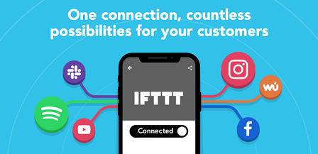

У цьому посібнику ми надамо вам усі наші поради, підказки та найкращі методи створення та проектування успішних служб IFTTT, зокрема:

- [How to design successful Triggers](https://ifttt.com/docs/guidelines#triggers)
- [How to design successful Authentication](https://ifttt.com/docs/guidelines#authentication)
- [How to design successful Actions](https://ifttt.com/docs/guidelines#actions)
- [How to design successful Queries](https://ifttt.com/docs/guidelines#queries)
- [How to design successful Applets](https://ifttt.com/docs/guidelines#building-successful-applets)
- [How to brand your IFTTT Service](https://ifttt.com/docs/guidelines#how-to-brand-your-ifttt-service)

## Як створювати успішні сервіси на IFTTT

Розуміння ідеальних варіантів використання, які принесуть найбільшу користь вашим користувачам, стане ключем до розробки вашого сервісу та надання тригерів, запитів і дій, які вони очікують.

### Автентифікація

Довіра користувачів є основою досвіду IFTTT, а автентифікація дає користувачам гарантію, що їхні служби та пристрої спілкуватимуться один з одним безпечним і надійним способом.

Більшість служб IFTTT вимагають автентифікації користувача. Автентифікація підключає обліковий запис користувача для вашої служби до IFTTT, щоб їхні аплети можна було персоналізувати за допомогою власної інформації про користувача.

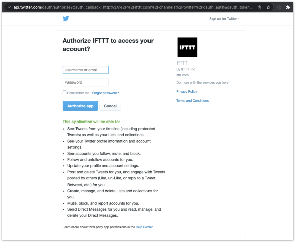

Будь-який сервіс, який керує даними або діями користувача, повинен здійснювати автентифікацію. Альтернативні форми ідентифікації, такі як прохання користувача ввести серійний номер свого пристрою, не будуть схвалені.

Сервіси, які не вимагають автентифікації, зазвичай надають загальнодоступні дані, як-от прогноз погоди, ціни на акції, послуги на основі каналів, ціни на енергоносії чи оголошення громадських сервісів.

Потік автентифікації починається тоді, коли користувач підключається до вашого сервісу вперше. Зазвичай це відбувається, коли користувач вмикає аплет, але це також можна зробити безпосередньо зі сторінки сервісу.

IFTTT відповідає стандарту OAuth2, а технічні вимоги та деталі описано в [розділі Service API нашої документації](https://ifttt.com/docs/api_reference#service-authentication). Фактичний метод автентифікації залежить від вас, якщо потік відповідає специфікаціям OAuth2. Постачальники автентифікації на основі пароля та єдиного входу є найпоширенішими стратегіями, але також можна реалізувати автентифікацію на основі програми, магічні посилання тощо.

Основна вимога до вашого процесу автентифікації полягає в тому, щоб ви чітко дали зрозуміти користувачеві, що він надає IFTTT певний рівень доступу та контролю над своїми обліковими записами за допомогою вашої служби. Це можна зробити за допомогою окремого екрана згоди в процесі автентифікації або повідомлення на самій сторінці входу. Переконайтеся, що в ньому чітко вказано обсяг інформації, якою обмінюються, і прямо згадується IFTTT.

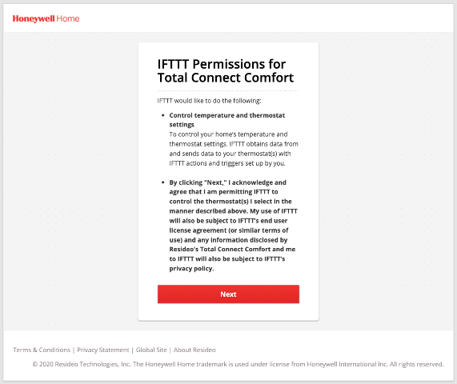

Окрім спеціально створених рішень, ми бачили, як багато сервісів покладаються на постачальників хмарних ідентифікаторів для обробки потоку OAuth2, зокрема Auth0, AWS Cognito та Microsoft Azure AD.

Найкраще, щоб ваші сервери автентифікації були зіставлені з доменами вашого бренду, де це можливо, незалежно від того, де розміщені сервери. Це додає рівень довіри, коли користувачі проходять ваш процес автентифікації.

Коли будете готові, скористайтеся інструментом перевірки автентифікації на вкладці «Тест» на інформаційній панелі вашої служби, щоб переконатися, що ваш процес автентифікації працює належним чином.

### Тригери

Тригери - це те, що ініціює аплет. Найкраще розглядати тригери як події, які є цінними для ваших користувачів.

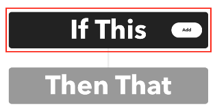

Наприклад, якщо ваш продукт — розумна лампочка, логічними тригерами будуть події, коли вмикається або вимикається світло. Для служби соціальних медіа потенційні тригерні події можуть включати новий вміст від творця або нового підписника на вашому каналі.

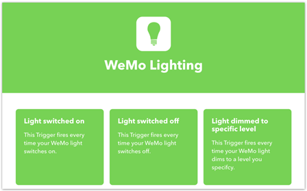

Для продуктів, які мають вихідні дані, такі як значення датчика температури або поточний режим роботи термостата, дещо складніше визначити, що є подією.

У цих випадках тригери на основі значень реалізуються таким чином, що події представляють зміну даних.

Ось кілька прикладів тригерів на основі значення:

- Ціна акції піднімається вище `{{PriceThreshold}}`
- Поточний режим двигуна змінюється на `Standby`
- Температура падає нижче `{{TemperatureThreshold}}`

Ви можете реалізувати тригер, який забезпечує нову подію при *будь-якій* зміні даних. Однак більш поширеним є наявність певної логіки, як-от порогове значення, яке значення має перетнути, щоб створити подію, вбудовану в тригер.

#### Тригерні поля

Хоча деякі тригери можуть надсилати події без будь-якої додаткової інформації (наприклад, [Надіслати будь-яку електронну пошту IFTTT](https://ifttt.com/email/triggers/send_ifttt_an_email)), більшості потрібен додатковий контекст. Цей контекст отримується через тригерні поля, які користувач заповнює під час увімкнення або створення аплету.

Наприклад, тригер погоди, який повертає події, коли зовнішня температура падає нижче порогового значення, потребує принаймні двох полів тригера.

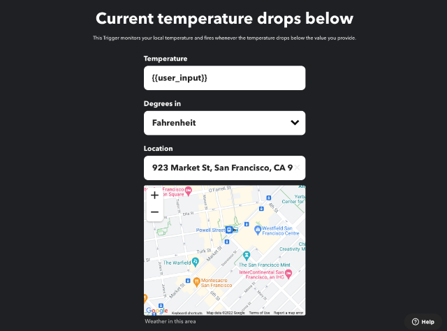

Перше поле просить користувача вказати місцезнаходження, а друге поле означує температурний поріг. Для цього тригера може навіть знадобитися третє поле для одиниці вимірювання температури залежно від реалізації, оскільки служба погоди може визначити одиницю виміру з налаштувань облікового запису погоди користувача.

Найпростішими тригерними полями є рядки, які може надати користувач, наприклад температурний поріг або хеш-тег для спостереження. Обидва є текстовими полями з використанням рядків.

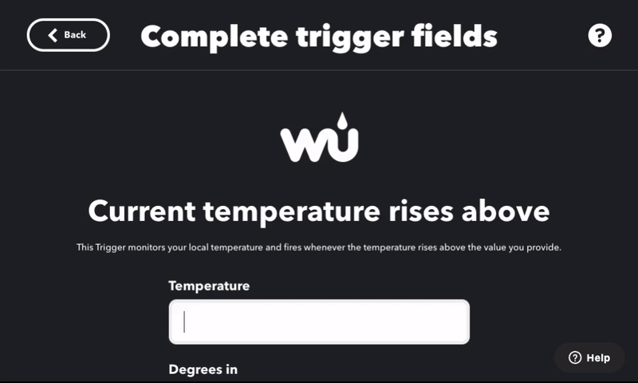

Ви також можете включити статичний розкривний список, щоб дозволити користувачеві вибирати зі встановленої кількості значень або параметрів. Одиниці вимірювання температури зазвичай вибираються за допомогою статичного спадного меню.


Поля на основі розташування надають вхідні дані, де користувач може вибрати точку на карті або вручну ввести адресу.


Динамічні поля, такі як спадні списки та прапорці, можуть відображати параметри користувача, доступні в поточному контексті. Динамічні поля покладаються на спеціальні кінцеві точки API від вашої служби, щоб отримати доступні для користувача параметри.

Найпоширенішим прикладом динамічного поля є спадне меню зі списком доступних пристроїв в обліковому записі користувача. Для інтелектуального тригера світла цей метод дозволяє користувачеві вказати, якими зі своїх світильників він хоче керувати. Для комунікаційної програми це дозволяє користувачеві вибирати зі списку своїх чатів.

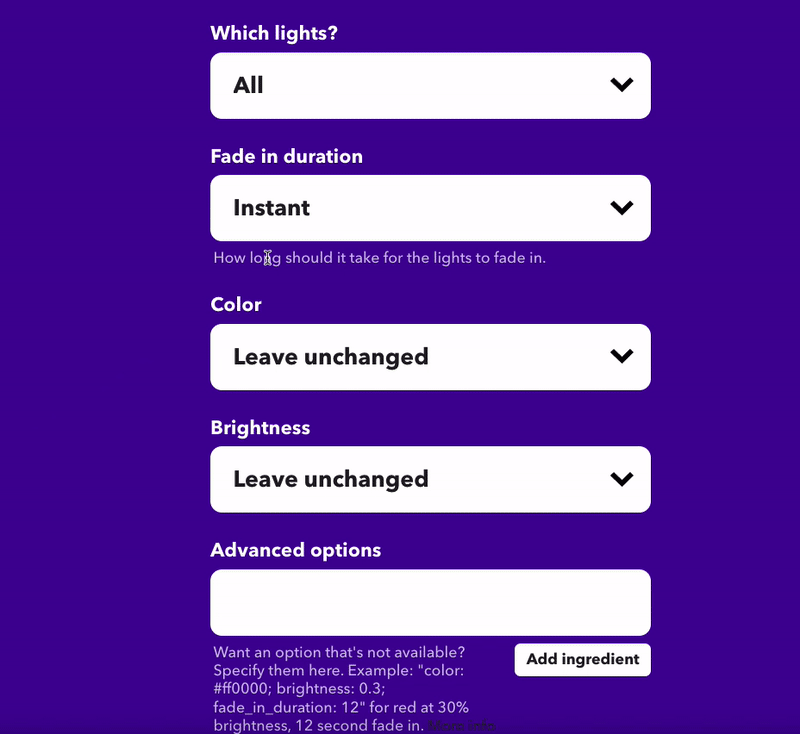

IFTTT дозволяє використовувати різні стратегії перевірки з полями тригерів, щоб забезпечити передачу правильних значень. Вони варіюються від простого зіставлення регулярних виразів до контекстної та динамічної перевірки, що виконується за допомогою вашого API.

#### Інгредієнти

Інгредієнти – це точки даних, які повертає ваш API з кожною подією тригера. Кожен тригер повинен мати принаймні один інгредієнт. Ви можете підійти до складових, запитавши себе, що користувач і аплет можуть захотіти знати про нову тригерну подію.

Якщо ініціатором є нова публікація чи блог, інгредієнти можуть включати назву, основний вміст, автора, час публікації, категорію або теги. У тригері від інтелектуального пристрою інгредієнтами можуть бути час події, тип події або інші додаткові точки даних (наприклад, колір світла).

Важливо розглянути можливість додавання інгредієнтів, які відображають значення полів тригера, щоб користувачі могли використовувати ці значення у своїх аплетах. Розглянемо приклад датчика температури. Користувача можуть попросити вибрати датчик із динамічного розкривного меню та встановити порогове значення температури для моніторингу в полях тригерів.

Якщо користувач створює аплет для сповіщення, коли температура падає нижче порогового значення, у сповіщенні можна буде повернути лише поле тригера. Якщо додати інгредієнти, до сповіщення буде додано більше інформації, як-от деталі пристрою та температура в реальному часі.

### Дії

Дія — це те, що відбувається в результаті запуску аплету через нову подію тригера. Дії є найбільш інтуїтивно зрозумілими та важливими компонентами послуг на IFTTT.

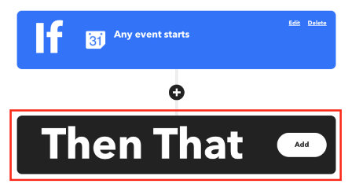

Увімкнути світло, опублікувати нову публікацію та запустити програму прибирання – все це приклади типових дій.

Аплет може містити кілька дій з різних служб або навіть використовувати ту саму дію кілька разів.

#### Action fields

Поля дії забезпечують "payload" для виконання дії. Це можуть бути статичні рядки, такі як вміст публікації, або динамічні події, які надаються під час створення аплета.

Інгредієнти з тригера аплета та запити можуть бути включені в поля дій за допомогою заповнювачів. Наприклад, поле дії push-сповіщення може відображати вміст у такому форматі:

```
Sensor {{sensorName}} detects temperature below {{tempThreshold}} at {{createdAt}}. Current temperature is {{tempCurrent}}.
```

Placeholders inside {{ }} will be replaced with relevant trigger ingredients when the Applet runs.

### Запити

Якщо тригери представляють часову шкалу подій, запити найкраще можна описати як поточний стан або історію події.

Запити використовуються в аплетах, щоб надати додатковий контекст аплету та інформувати про дії разом із даними тригера.

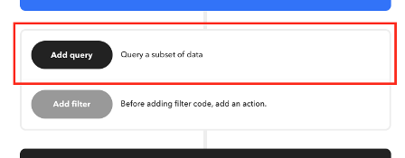

Хорошим практичним правилом є наявність відповідного запиту для кожного тригера. Для такого тригера, як «Світло ввімкнено», додатковим запитом може бути «Світло ввімкнено чи вимкнено зараз?». Тригер «Початок події календаря» можна перевести на запит «Список подій календаря на день».

Курси акцій, поточна погода, стан дверей гаража (тобто відкриті чи закриті) і нещодавно відтворені відео – все це корисні запити для покращення аплетів.

#### Поля запиту та інгредієнти

Здебільшого тут застосовуються ті самі правила, що й для полів тригерів. Одним помітним винятком є те, що інгредієнти тригера можуть бути включені в поля запиту. Тому не завжди можливо перевірити поля запиту, оскільки неочікувані дані від тригера можуть спричинити помилку запиту.

## Як створити успішні аплети

Аплети – це засоби автоматизації, які користувачі можуть створити або ввімкнути для підключення вашої служби IFTTT до однієї чи багатьох інших сервісів. Наприклад, аплет може [автоматично вмикати світло на заході сонця](https://ifttt.com/applets/PVkgiLYy) або [створювати події у вашому календарі iOS через Google Assistant](https://ifttt.com/ аплети/eX6zn2mD).

Користувачі можуть створювати власні аплети або активувати опубліковану автоматизацію. Щоб створити аплет, подумайте про варіант використання, який ваші користувачі вважатимуть цінним. Часто це те, що вони не можуть зробити, не підключившись до іншої служби. Якщо ваша служба вже запущена, вкладка аналітики у вашому обліковому записі платформи може надати чудову інформацію про те, як користувачі працюють із вашою службою та до яких інших служб вони підключаються. Публікація аплетів із популярними службами, послугами тієї ж категорії, що й популярні служби, або з новими службами – це чудові способи підвищити рівень залучення.

Ознайомившись із деякими випадками використання, перейдіть на сторінку [ifttt.com/developer_dashboard](https://ifttt.com/docs/guidelines) і перейдіть на вкладку «Аплети». Щоб створити аплет для користувачів, натисніть "New Applet" у верхньому правому куті вкладки Applets.

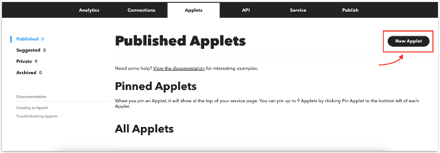

Як приклад, розглянемо створення аплету, який автоматично вмикає світло LIFX кожного разу, коли він входить у певне місце. ***Примітка. Для своїх аплетів ви захочете використовувати принаймні один тригер, запит або дію з вашої служби.***

Першим кроком є вибір сервісу запуску. Тригером є частина «If» оператора If This Then That. У цьому випадку ми будемо використовувати сервіс визначення місцезнаходження.

Після вибору тригерного сервісу з’явиться спадне меню з тригерами цього сервісу. Цей аплет використовуватиме тригер «You enter an area». Після вибору тригера нам будуть представлені поля тригера, які ми можемо встановити або налаштувати користувачем. Ми хочемо, щоб цей аплет працював на основі розташування, встановленого користувачем, тому ми залишимо ці поля як «customizable by the user».

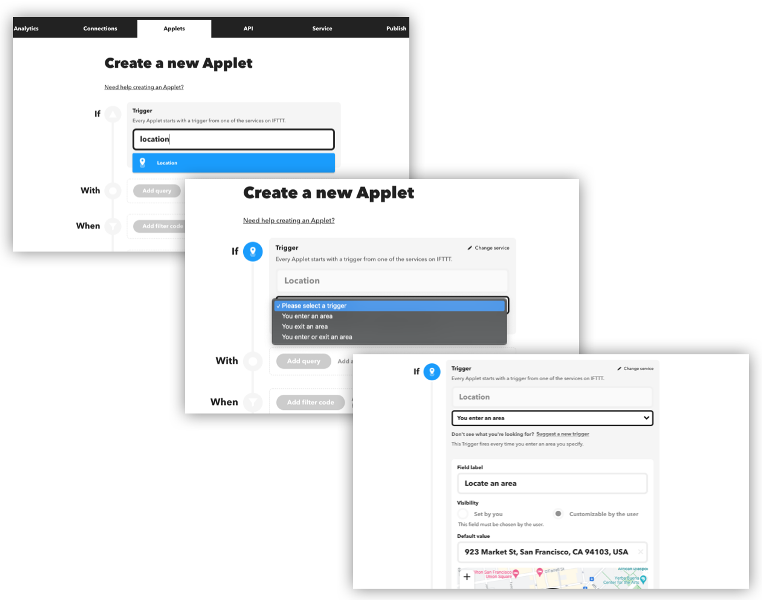

Тепер, коли наш тригер налаштовано, настав час додати дію. Дія — це "That" вислову «If This Then That». У цьому випадку ми скористаємося сервісом LIFX.

Натисніть кнопку «Add Action» і, як і раніше, знайдіть службу дії. Коли ми виберемо службу LIFX, з’явиться спадне меню з різними діями. Виберіть дію «Turn Lights On». Знову ж таки, ми дозволимо користувачеві налаштувати, які лампочки вони бажають увімкнути, у полі дії «Which lights».

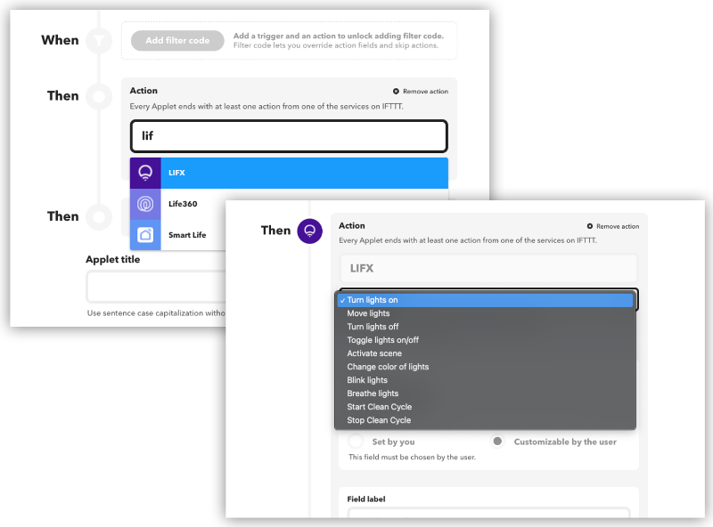

Наш аплет наразі містить лише один тригер і одну дію. Щоб створити більш просунутий аплет, ми можемо включити кілька дій, використовувати запити або додати код фільтра, щоб пропускати дії.

Докладніше про використання [коду фільтра та запитів у аплетах](https://ifttt.com/docs/applets#using-filter-code).

Останнім кроком створення аплету є надання йому назви та опису. Назва дозволяє користувачам швидко зрозуміти, що робить аплет. Опис допомагає користувачам зрозуміти деталі та цінність вашого аплета. Крім того, опис можна використовувати для інформування користувачів про будь-які додаткові кроки або поради щодо найкращого налаштування аплета. Зауважте, що назва аплету буде частиною URL-адреси вашого аплету. І назва, і опис будуть проіндексовані та сприятимуть оптимізації пошукових систем на сторінці аплету. Виберіть логічну та інтуїтивно зрозумілу назву зі словниковим запасом, який буде знайомий вашим користувачам, щоб їм було легше виявити та зрозуміти її призначення.

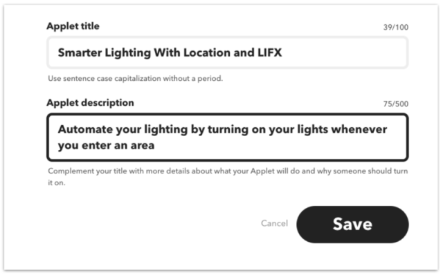

Нарешті натисніть «Save». Тепер аплет буде вказано на вашій приватній вкладці «Applet».

### Рекомендовані параметри для полів

Коли ви створюєте аплети, ви можете виявити, що певні тригери, запити та поля дій пропонують опцію видимості. Це дає вам можливість вибрати, чи може користувач редагувати поле, чи воно має бути заздалегідь визначеним.

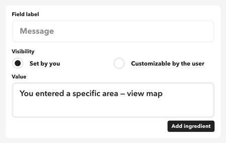

Якщо вибрати «set by you», користувач не побачить і не зможе налаштувати це поле під час увімкнення вашого аплета. Натомість у полі за замовчуванням буде вибрано значення. Якщо поле завжди має бути постійним для вашого випадку використання, тоді найкраще встановити видимість на «встановлено вами».

Крім того, надання користувачам гнучкості для налаштування поля відкриває нові можливості для способів використання аплета.

### Тестування вашої служби за допомогою аплетів

Аплети, які ви створюєте на платформі, не одразу доступні користувачам, доки ви їх не опублікуєте. Перш ніж публікувати аплет, важливо протестувати його, щоб переконатися, що він працює належним чином. Це особливо важливо для аплетів, які містять код фільтра.

Ви можете ввімкнути аплети на вкладці «Private » свого облікового запису Платформи. Просто натисніть Applet, а потім натисніть посилання «Preview».


### Публікація та просування аплетів

Наступним кроком є публікація та просування ваших аплетів. Публікація аплету робить його видимим на вашій сторінці служби, доступним на сторінці [Explore](https://ifttt.com/explore) і готовим для ввімкнення будь-яким користувачем IFTTT.

Вміст соціальних медіа, відео та кампанії електронною поштою – це чудові способи реклами ваших нещодавно опублікованих аплетів. Обов’язково позначайте облікові записи соціальних мереж IFTTT у своїх публікаціях, щоб ми могли збільшити охоплення опублікованих вами аплетів.

Щоб користувачі відображали ваші опубліковані аплети в центрі, закріпіть їх у верхній частині сторінки служби. Щоб закріпити аплет, перейдіть на вкладку «Аплети» на платформі, а потім натисніть значок «pin» в нижньому лівому куті аплету.

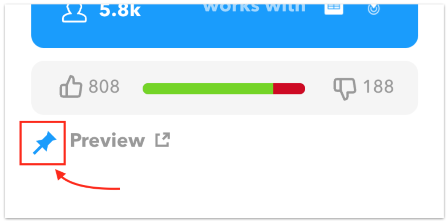

Під час запуску служби IFTTT вам потрібно опублікувати принаймні дванадцять аплетів. Але не зупиняйтеся на досягнутому - ви можете публікувати аплети в будь-який час! Сервіси, які часто публікують і рекламують нові аплети, зазвичай мають найвищий рівень залучення користувачів.

## How to brand your IFTTT service

Your brand will be displayed on IFTTT for millions of users to  discover and incorporate into their Applet automations. There are a few  ways for users to [find and connect your service on IFTTT](https://help.ifttt.com/hc/articles/1260805289130-Connecting-to-a-service-on-IFTTT), so ensuring branding consistency across them is key to your success.

For most IFTTT users, the search for new services and Applets is done primarily through the IFTTT [Explore](https://ifttt.com/explore) and [Search](https://ifttt.com/explore/services) pages. Users can easily filter through these pages with the provided search bars.


Every IFTTT service then has its own dedicated service page with your unique branding. This is often the first place users will engage with  your brand on IFTTT for the first time. Your service page will display  details on your integration's purpose and highlight how your service can work together with other popular services on IFTTT.

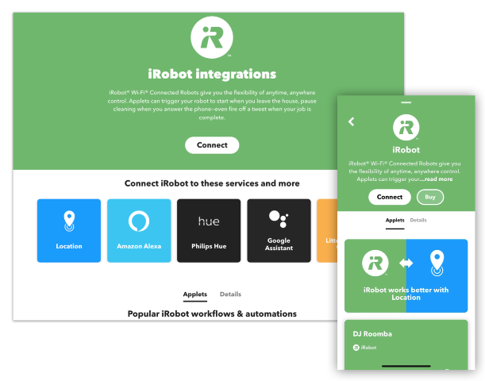

Service pages also include a sample list of [Applets](https://help.ifttt.com/hc/articles/115010361348-What-is-an-Applet-), predefined examples of popular automation use cases for your service  that users can enable in just a few clicks. Applets in this list include those that are published by you, other services, and users.

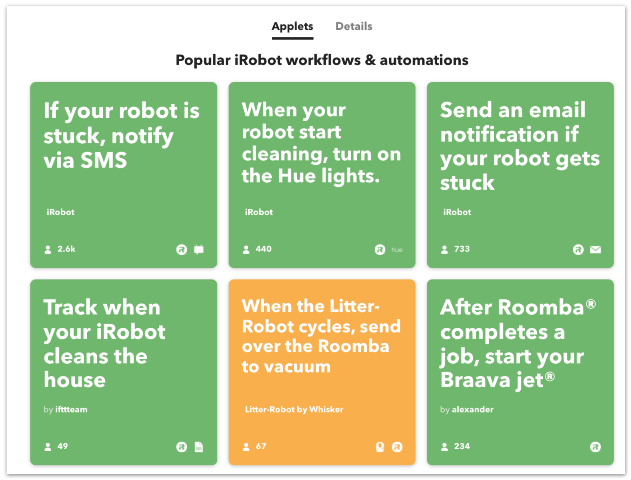

Your service page is where your branding will shine the brightest.  While setting up your service, we will prompt you to add a service name, logo, description, category, and brand colors.

### Service name

Your service name should be identical to your product's name, using  the same capitalization and spacing that your company uses so that it is easily recognizable to users.

***Pro tip: Avoid adding adjectives or phrases, but include  your company name if the company and service name are always used  together in your branding. You don't need to include "app" or "service"  unless you always include that in your product's branding.\***

Example:

- `SmartHours`, not `SmartHours Energy Saver Service`, not `Smart Hours`
- `Google Sheets`, not `Sheets` or `Google Spreadsheets`

### Applet logo

The Applet logo is a simplified version of your logo that will be  placed over your brand color. The Applet logo is featured on your  service page and Applets.

Requirements: Upload an SVG file of your Applet logo. Your Applet  logo should be exactly 620x620px in size, have a transparent background, and most importantly only contain the color ***white\*** so it can be rendered on both light and dark backgrounds. Your Applet  logo should be a vector image without an embedded raster image so it can be scaled correctly.

Example:


### Service description

Write a brief description (2-3 sentences) of your service's core  features and use cases. Include your service's name in the description  and state the integration's purpose. It's helpful to use proper grammar  and full sentences. IFTTT has millions of global users and this allows  non-native English speakers to translate the description to their native language.

We also allow non-English descriptions if your service's primary  audience is region-specific. However, we recommend that non-English  descriptions are supplemented with a brief English version so that users can see if your service is available in their market.

***Pro tip: Use simple and direct language. We advise  against using "IFTTT" or other service names in the description. Our  most successful service's have descriptions that are 25-50 words and are 2 sentences in length.\***

Examples:

- `Dropbox lets people bring their documents, photos, and videos everywhere and share them easily..`, not `Dropbox is the world's best document storage repository.`
- `The Honeywell Home family of smart products includes  thermostats (like the T-Series and Round), awareness (like Smart Home  Security), and water leak detection..`, not `A Home Automation Hub.`

### Service category

Choose a category from the options we provide that best fits your  service's core features and use case. If your service potentially  matches multiple categories, choose the category that best describes  what your service is most used and known for.

You may update your service's category at any time, allowing for  flexibility to move into another top category as your product evolves.

Example:

- [LinkedIn](https://ifttt.com/linkedin) is a  business-oriented social networking site where you can share the best  content, automatically, with your professional network, so it fits best  in the social network category like [Facebook](https://ifttt.com/facebook), not in the communications category with [Slack](https://ifttt.com/slack).

### Service color

Choose a color to represent your brand and product on IFTTT. This  color will serve as the background color on your service page and  Applets. Ask your marketing team for the 6-digit hex color code for your brand or product's primary color and enter it in the brand color field.

Avoid using white or really bright colors for your brand color, as  overlaid text would be unreadable. If your logo is black and white, use  the next most common color from your branding, e.g. gray. However, we  also recommend choosing a color intensity that considers contrast for  good visibility.

IFTTT will use the brand color you select to promote your service to  users through the Explore page, your service page, IFTTT's marketing  materials, and other parts of the IFTTT app.

## Maintaining your IFTTT integration

### Keeping tabs on the health of your service

It's important to keep an eye on the health of your service,  especially during the first weeks after launch or a major update. When  your service responds with errors, the users' Applets may not run as  expected. Some issues are transient and IFTTT can recover by retrying.  Persistent errors can result in Applets and services being disconnected.

IFTTT provides a health dashboard in the Analytics tab that shows the success rates across different types of requests. You can inspect the  details for each error in the logs. The logs are available for the last  48 hours.

***Pro tip: Use the health dashboard as a troubleshooting tool while developing the service and testing it prior to the launch.\***

Abnormalities, such as a sudden spike in error rates, will trigger  email alerts sent to service admins. In some cases, IFTTT may  automatically pause the service for a short time. A paused service will  not receive trigger checks. We do this to avoid the accumulation of  errors in users' Applets.

### Providing support documentation

You should take advantage of the trigger, query, and action  description fields, helper texts, and service description to provide  users with helpful information and support documentation where possible.

If your service requires specific steps by the user, the description  is a great place to include a link to an integration guide. Similarly, a link to a list of compatible devices in the dynamic dropdown's helper  text can help users better understand how to troubleshoot. One of the  most common support questions our team receives is why a user is not  seeing a device under a certain action.

Though not required, you are encouraged to provide the IFTTT team  with documentation that we can leverage when responding to user support  requests related to your service. This can be as simple as providing the best ways to get in touch with you if a user encounters an issue or  detailed troubleshooting steps we can provide for common issues.

### Migrating to a new version of your service

Healthy and popular services are adding new features all the time. We are happy to support you in updating and improving your published  service with no disruptions for existing users.

To make more substantial changes to your service, such as adding new  actions or triggers, first clone your existing service, make any  necessary changes or additions, and then submit that service for review. After the changes pass our team's review, they will be migrated to the  existing published service with no impact on existing integrations and  Applets.

Here are a few things to keep in mind when planning an update to your service:

- The cloned staging service will always have a unique service key  that is different from the published one. The published service's key is never updated with the staging one. This means that your API must  accept both keys for our tests to pass or the staging service must use a different (staging) version of your API.
- It's acceptable to submit a staging service for review if it's using a different version of your API URL. We will not update the published  service's API when we migrate the changes.
- You should avoid introducing changes to existing triggers, queries,  or actions. Where possible, a new trigger can add the missing  functionality while the original trigger is maintained for backward  compatibility. An example of a non-breaking change is a new trigger  ingredient. This update can be applied to enabled Applets. A breaking  change may be a new or updated trigger field. Such a change cannot be  applied because it will leave enabled Applets with an incomplete or  incorrect configuration that cannot be resolved without user input.
- If you want to submit the changes for review but do not want them to be migrated as soon as possible, please reach out to our Platform  support team. We will be happy to coordinate a migration time that suits your team.
- It's possible to seamlessly update API URLs, authentication URLs,  credentials, etc. For example, if you are moving your service to a new  infrastructure with no breaking changes, submit a staging service for  review with the updates and leave a note for our team on each change  that needs to be applied.
- The Applets you build in a staging service cannot be migrated to the published service. Once your updates go live, you can build and publish new Applets for your new functionality in the original service.

### Branding and other updates

You can make updates to your service's branding and settings at any time directly in the Platform.

If you need to update your brand's logo images or make copy changes  to individual items such as trigger descriptions, please follow the  process outlined above for submitting a staging service for review.