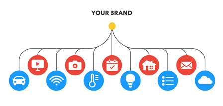
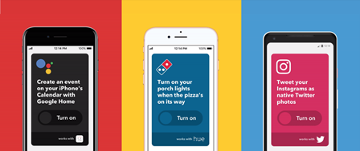
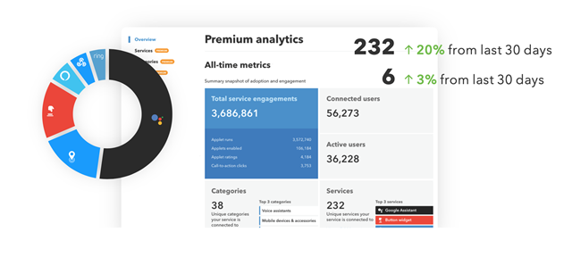
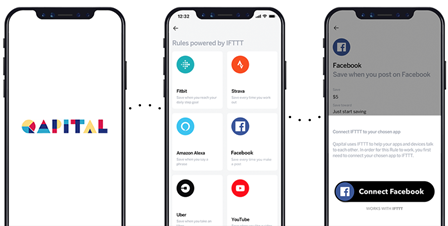

# Ласкаво просимо на платформу IFTTT

https://ifttt.com/docs

IFTTT допомагає організаціям підключати свої продукти до світу. Наша розгалужена екосистема API змінює спосіб використання вашого продукту, інтегруючи його з понад 700 іншими продуктами, програмами та сервісами з усього світу. Інтеграцію IFTTT легко налаштувати, підтримувати, і ми надаємо чітку аналітику.

Ми створили стандартний спосіб з низьким кодом для всіх програм, пристроїв і сервісів у всьому світі для зв’язку з вашими продуктами. Завдяки одній інтеграції з IFTTT ви матимете сотні нових функцій, які можна запропонувати своїм користувачам. Усе, що ваш продукт не може зробити сам, IFTTT допоможе вам.

## Навіщо створювати інтеграцію IFTTT

Створення інтеграції IFTTT — це найефективніший спосіб надати своїм продуктам функції, які шукають ваші користувачі. Незалежно від того, чи є ви бізнесменом, розробником чи любителем розумного дому, платформа IFTTT — це ваш набір інструментів для самообслуговування для інтеграції ваших продуктів із будь-якою іншою програмою, пристроєм чи послугою на IFTTT. Ми допомогли більш ніж 700 глобальним компаніям перетворити свої продукти на повністю інтегровані послуги, значно заощадивши час на розробку, одночасно збільшивши залучення, утримання та залучення клієнтів. Крім того, ви щодня отримуватимете доступ до нових клієнтів та інтеграцій.

## Що ви отримуєте

Як користувач платформи IFTTT ви матимете доступ до таких переваг:

### Отримайте доступ до нашої екосистеми

Скористайтеся понад [700 інтегрованими послугами в 35 галузях](https://ifttt.com/explore/services) і понад 25 мільйонами користувачів у всьому світі. Якщо він на IFTTT, ви маєте до нього доступ!

### Інтегруйте всі ваші продукти

Публікуйте послуги на IFTTT для будь-якого або всіх ваших продуктів.

### Опублікуйте підключені функції для своїх продуктів

Надайте користувачам можливість сумісності та контролю за допомогою функцій автоматизації одним дотиком.

### Звітність та аналітика

Сформулюйте дорожню карту свого продукту та прискоріть інновації за допомогою доступу до потужної інформації про ваші послуги та користувачів.

### IFTTT Connect

Хочете вивести свій бізнес на новий рівень? Вбудуйте потужні засоби інтеграції безпосередньо у свій мобільний додаток, веб-сайт і електронні листи клієнтів, використовуючи наш [API Connect](https://ifttt.com/docs/connect_api) і [SDK](https://ifttt.com/docs/ connect_api#ios-and-android-sdks).

## Who it's for

### For Businesses and Developers

All of the services on IFTTT that are available for public use were  built by developers at companies. If you're part of a business or  affiliated with an API for a product, app, or service that you want to  be on IFTTT, you'll be allowed to publicly launch your products as  services on IFTTT for all of your users and millions in the IFTTT  community to access.

### For Personal Use

Not affiliated with a product or API directly? That's okay. As an  individual, you can still use the IFTTT Platform to build custom  integrations for your own personal use. If there's a product you use but it's not on IFTTT, you can build it yourself with the IFTTT Platform.  Check first to see if the company that makes the product you want to  integrate offers an open API for you to develop with.

## Ready to get started?

Now that you understand what an IFTTT integration can do for your business and products, let's move on to [how to get started…](https://ifttt.com/docs/process_overview)

## Для кого це

### Для компаній і розробників

Усі сервіси на IFTTT, які доступні для загального використання, були створені розробниками компаній. Якщо ви є частиною компанії або пов’язані з API для продукту, програми чи сервісу, який ви хочете мати на IFTTT, вам буде дозволено публічно запускати свої продукти як служби на IFTTT для всіх ваших користувачів і мільйонів у спільноті IFTTT для доступу.

### Для особистого використання

Не пов’язані безпосередньо з продуктом або API? Нічого страшного. Як фізична особа ви все ще можете використовувати платформу IFTTT для створення власних інтеграцій для особистого користування. Якщо ви використовуєте продукт, але він не на IFTTT, ви можете створити його самостійно за допомогою платформи IFTTT. Спочатку перевірте, чи пропонує компанія, яка виробляє продукт, який ви хочете інтегрувати, відкритий API для розробки.

## Готові розпочати?

Тепер, коли ви розумієте, що може зробити інтеграція IFTTT для вашого бізнесу та продуктів, давайте перейдемо до [як розпочати…](process_overview.md)