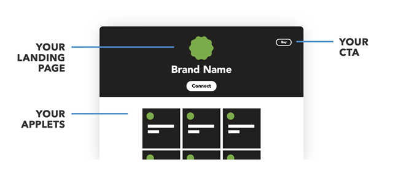
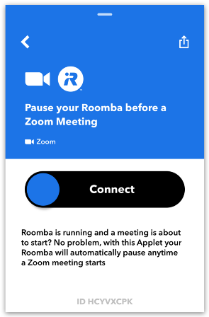
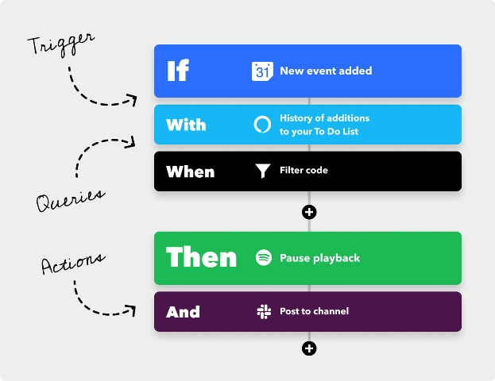
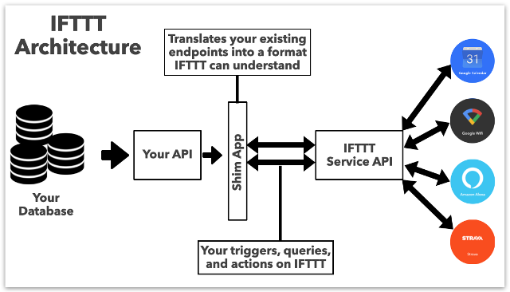
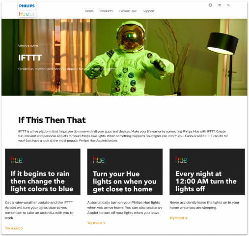
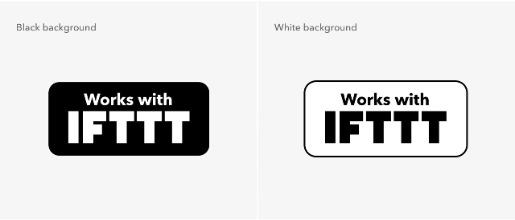
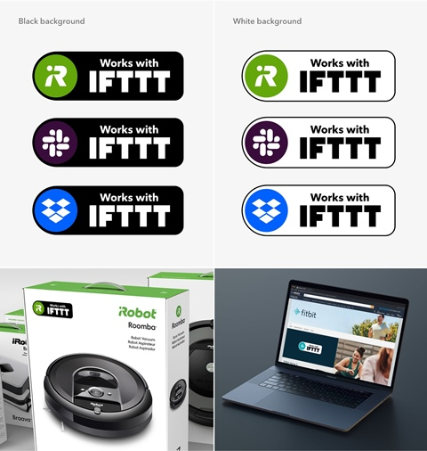
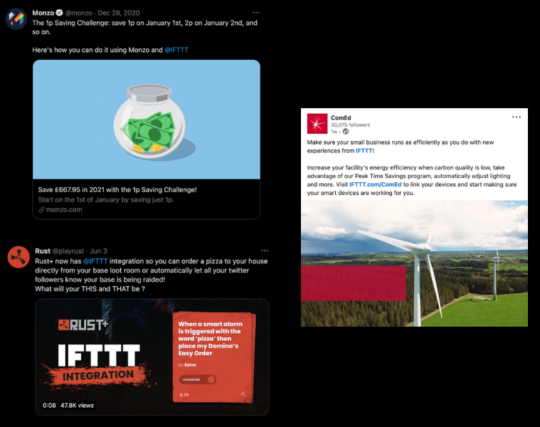
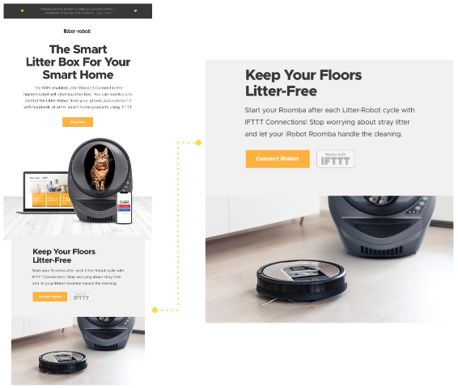

# Process Overview

https://ifttt.com/docs/process_overview

Перш ніж почати щось створювати, ви повинні спочатку звикнути до того, як працює IFTTT, щоб зрозуміти досвід користувача. Нижче наведено короткий вступ, і ми розглянемо ці теми більш детально пізніше в цьому посібнику.

Якщо ви вже знаєте, як працює IFTTT, ви можете [пропустити цей розділ](https://ifttt.com/docs/process_overview#1-plan-your-integration).

### Сервіси

Сервіси є основними будівельними блоками IFTTT. Деякі приклади сервісів: [Amazon Alexa](https://ifttt.com/amazon_alexa), [Twitter](https://ifttt.com/twitter), [Dropbox](https://ifttt.com/dropbox), [Fitbit](https://ifttt.com/fitbit) і [ecobee](https://ifttt.com/ecobee). Кожен ваш продукт буде представлений на IFTTT як послуга. Кожен із ваших сервісів матиме власну цільову сторінку на IFTTT, яку називають "service page." («сторінкою сервісу»).

### Аплети (Applets)

Сервіси обєднуються в аплети. Аплет (Applet ) — це автоматизований робочий процес, який з’єднує два або більше сервісів разом і дозволяє користувачам робити те, що ці сервіси не можуть зробити самостійно. Наприклад, ви можете використовувати аплет, щоб [увімкнути освітлення Philips Hue, коли камера безпеки Arlo виявляє рух](https://ifttt.com/applets/eX6zn2mD) або [призупинити роботу пилососа iRobot перед зустрічами Zoom](https://ifttt.com/applets/HcyvXCPK).

Аплети складаються з тригерів(triggers), запитів(queries) і дій(actions). Тригери повідомляють аплету про запуск, запити забезпечують додаткові умови, а дії є результатом запуску аплета. Аплети може публікувати адміністратор сервісу або самі користувачі.

### Тригери (Triggers), Дфї(Actions) і запити (Queries)

API вашого продукту складається з різних кінцевих точок, які використовуються для отримання, запису або надсилання даних. Кожна кінцева точка вашого API зіставлятиме 1-до-1 тригер, дію чи запит, які ви хочете додати до свого сервісу. Ваші тригери надсилатимуть дані в IFTTT, коли щось станеться з вашим продуктом (наприклад, увімкнеться термостат). Запити – це спосіб для IFTTT отримати додаткові дані про ваш продукт (наприклад, перелік поточних налаштувань температури). Ваші дії збиратимуть інструкції, які IFTTT надсилає вам, щоб зробити щось із вашим продуктом (наприклад, увімкнути пристрій).

Якщо ви новачок у IFTTT, ми рекомендуємо [створити безкоштовний обліковий запис](https://ifttt.com/), щоб самостійно випробувати кілька аплетів. Ось кілька простих аплетів, які варто спробувати зрозуміти:

- [Щоденний електронний лист із прогнозом погоди](https://ifttt.com/applets/Zv56ZXwR)
- [Отримайте сповіщення, коли МКС пролітає над вашим будинком, але лише за умови ясного неба та настання темряви](https://ifttt.com/applets/VDdNBmiE)

## 1. Сплануйте своє інтегрування

Тепер, коли ви розумієте досвід користувача IFTTT, настав час застосувати ваш продукт до цих основних понять. Подумайте про те, як ваші користувачі зазвичай взаємодіють із вашим пристроєм, програмою чи послугою:

- Які найпопулярніші та корисні функції чи функції?
- Які з них зараз підтримуються вашим API?

Це найкраще місце для початку, коли ви думаєте про те, як працюватиме ваша інтеграція IFTTT і які тригери, запити та дії слід включити. Почніть із кількох найочевидніших тригерів, запитів і дій, а потім розширте їх.

Завжди пам’ятайте про те, як виглядатиме взаємодія з користувачем і які випадки використання підтримуватиме ваша інтеграція через тригери, запити та дії, які у вас є.

***Порада професіонала: вчіться в інших подібних сервісів. Якщо вам потрібна допомога, щоб визначити, що може бути найбільш корисним для ваших користувачів, ви можете переглянути наш каталог сервісів для подібних продуктів і використовувати тригери, запити та дії, які вони підтримують, як те, що варто враховувати***

Деякі з найкращих інтеграцій IFTTT є результатом спільної роботи менеджерів із продуктів, команд маркетингу та інженерів. Ця командна робота гарантує, що те, що ви плануєте створити, узгоджується з користувальницьким досвідом, який ви хочете створити та рекламувати.

Під час планування обов’язково прочитайте наші вказівки та рекомендації щодо [розробки успішної інтеграції IFTTT](https://ifttt.com/docs/guidelines).

## 2. Інтегруйте

Створення вашої інтеграції IFTTT відбуватиметься в три етапи:

- розроблення
- тестування

### Розроблення

#### Налаштуйте своє середовище

Спочатку потрібно додати рівень сумісності IFTTT до свого API, щоб платформа IFTTT могла зрозуміти ваші кінцеві точки та перекласти їх у кожен тригер, запит і дію, які ви хочете включити як частину свого сервісу. Ми рекомендуємо дві стратегії для цього:

- **Найбільш поширений:** Розгорніть «shim app», який знаходиться між вашим API та IFTTT. Ця програма перетворюватиме ресурси з вашого API у відповіді, зрозумілі IFTTT. 

- Додайте специфічні для IFTTT кінцеві точки безпосередньо до свого API. Ці кінцеві точки можуть отримувати дані з вашого існуючого API та обслуговувати їх у відповідях, зрозумілих IFTTT. 

Якщо у вас немає API, наша [документація](https://ifttt.com/docs/api_reference) допоможе вам розробити його з чіткими вимогами.

#### Створіть свій сервіс на платформі IFTTT

Після того, як ваше середовище API буде належним чином налаштовано для спілкування з IFTTT, ви перейдете на інформаційну панель платформи, щоб створити новий сервіс. Якщо у вас є кілька унікальних продуктів (наприклад, термостат, посудомийна машина та очищувач повітря), радимо створити окремий сервіс для кожного з них.

Потім ви почнете створювати функції вашої інтеграції відповідно до нашого [посібника з розробки сервісу](https://ifttt.com/docs/guidelines) і [документації для розробників](https://ifttt.com/docs/api_reference).

### Тестування

Ви хочете переконатися, що те, що ви створюєте, працює за призначенням. Тому наполегливо рекомендуємо тестувати кожен компонент вашої інтеграції на кожному етапі її розробки.

Платформа IFTTT надає вам надійні інструменти тестування кінцевих точок і автентифікації, які допоможуть вам швидко розробляти тригери, запити та дії, не сумніваючись, що вони сумісні з IFTTT.

#### Наскрізне тестування за допомогою аплетів

Наближаючись до завершення розробки, виділіть деякий час для повного тестування новоствореної служби IFTTT. Створюйте та запускайте аплети, які використовують кожен тригер, запит і дію з вашої служби на IFTTT, щоб переконатися, що все працює належним чином і взаємодія з користувачем відповідає очікуванням.

#### Запросіть інших перевірити вашу інтеграцію

Після того, як ви самостійно протестували свою службу, покажіть, що ви створили, і зберіть відгуки, запросивши інших спробувати її. Інформаційна панель вашої служби містить URL-адресу запрошення, яка дозволяє надати до 25 осіб для спеціального попереднього доступу до вашого сервісу.

***Примітка. Ваші запрошені спочатку повинні мати власний обліковий запис IFTTT, щоб попередньо переглянути ваш сервіс та протестувати його за допомогою аплетів. Якщо вони ще не мають облікового запису IFTTT, вони можуть створити його безкоштовно за URL-адресою запрошення.***

Було б гарною ідеєю мати кілька готових аплетів, доступних для ваших запрошених, щоб легко їх увімкнути. Однак ваші запрошені особи все ще можуть перевірити ваш сервіс, створивши власні аплети з іншими сервісами на свій вибір. Обов’язково спочатку поінформуйте їх про те, як увімкнути або створити аплет, а потім зв’яжіться з ними, щоб почути їхній досвід і відгуки, які вони можуть мати.

### Надішліть свій сервіс на перевірку

Коли ви завершите розробку та тестування своєї інтеграції IFTTT і будете впевнені, що ваш сервіс сподобається користувачам, настав час надіслати його на розгляд IFTTT.

Ви можете знайти посилання для надсилання на вкладці «Опублікувати» на інформаційній панелі служби. IFTTT проводить внутрішню перевірку, перш ніж сервіс можна буде запустити у виробництво. Цей процес може тривати до тижня залежно від того, коли ми отримаємо ваше подання та скільки відгуків у нас є.

Якщо у нашої команди виникнуть відгуки чи зауваження, ми надішлемо вам електронний лист, і ви зможете переглянути наші коментарі на сторінці огляду біля кожного елемента. Не соромтеся повторно подати послугу після того, як ви розглянули відгук і відповіли через коментарі.

Нижче наведено типові причини, через які служби не проходять перевірку з першої спроби:

- Логотип аплету не є білим векторним зображенням на прозорому тлі.
- На момент перевірки тести автентифікації або кінцевих точок не проходять.
- Потік автентифікації не згадує IFTTT або не містить повідомлення згоди.
- Електронна адреса служби підтримки – це особиста адреса.
- Сервісна копія неповна, заплутана, містить заповнювачі, стилі або граматичні проблеми. Це охоплює все: від назви та опису служби до слів і допоміжного тексту для окремих тригерів, запитів або дій.
- Створений вами запит не має практичного застосування.

Щойно ваш сервіс буде схвалено, ми надішлемо вам електронний лист із проханням заповнити маркетингову форму перед запуском. У цій формі ми попросимо вказати дату, коли ви хочете опублікувати сервіс на IFTTT. Перш ніж опублікувати ваш сервіс, ми зробимо остаточну перевірку, щоб переконатися, що кінцева точка сервісу та тести автентифікації пройшли, і що у вас є принаймні дванадцять опублікованих аплетів, готових для того, щоб користувачі почали працювати з ними.

## 3. Запустіть і продайте свій сервіс

Щойно ваш сервіс схвалить IFTTT, настав час опублікувати його та поділитися ним зі світом! У день запуску ваша інтеграція буде активна та готова до використання.

Користувачі, які вже користуються IFTTT, можуть відкрити для себе ваші сервіси, але щоб отримати найкраще впровадження, вам слід поширити інформацію про те, що ви зараз користуєтеся IFTTT. Ефективний і частий маркетинг вашого сервісу є найкращим способом гарантувати його успіх.

Нижче наведено схему того, як успішно продавати свій сервіс. За потреби дотримуйтеся наших [правил бренду](https://ifttt.com/explore/brand-guidelines).

### Landing page

Show off your service on your website. This is one of the most  effective ways to showcase your new IFTTT integration to your users.  We're happy to help with the details, but a landing page on your own  website gives you the freedom to showcase your IFTTT service in your own style. You can use video, photos, and copy that make it clear that your IFTTT service is a natural extension of your brand.

From an SEO and discoverability perspective, these pages act as  important top-of-the-funnel tools and help people learn more about the  features of your service before they become customers. "Works with  IFTTT" is a powerful badge — wear it with pride on your site!

### Works with IFTTT badges

Make sure to tell the world that you work with IFTTT on your  packaging, website, digital properties, and trade show displays. Use  badges in marketing material to promote your integrations, too. You may  place these next to other *Works with* or *Download on* badges like Google Play, App Store, Google Assistant, and Amazon Alexa.

On request, we can also create customized *Works with IFTTT* badges that feature your service icon or logo.

### Social media

Shout about it! Social media is the perfect way to start a  conversation. Post about your service's launch, of course. But don't  stop there — share favorite Applets regularly along with the link to  your service page on IFTTT. People follow you for a reason — they want  to know more! Make sure to take advantage of this engaged audience  that's opted-in to hear from you regularly.

This is also an opportunity to collect user feedback. Ask questions,  and listen — which Applets do people want to see from you? What triggers or actions are you missing? The next game-changing idea may come to you in a Tweet.

Remember to tag @IFTTT in your posts so we can help spread the word — we've got an itchy RT finger!

### Email campaigns

Subject: We're on IFTTT :-). When it comes to email marketing your IFTTT integration, we recommend a two-part approach:

1. At launch time, send a one-off announcement to your user base, highlighting the new functionality and some amazing Applets.
2. Include IFTTT in your on-boarding email or email campaign, so  that new users can get up to speed on everything your service offers.

You'll also want to email users when you make improvements to your  service, such as adding new triggers and actions or building an exciting Applet with a new partner.

### Blog posts

Tell the story of your service. You may use your blog for major  product updates, heartfelt user stories, tips, thought leadership, SEO — or for all of the above. Whatever your publishing criteria, there's a  way to tell the story of your IFTTT service in a natural way. And you'll want to: a blog post is the perfect way to highlight the value of your  new integration and link to must-have Applets.

It will help you control the story on launch day, and will always be a place where people can go to get more context, straight from the  source.

The story shouldn't end at launch, either — if you make updates to  your service or uncover interesting data from your IFTTT users, it may  be time to write another post.

### Video

Your service is the star. Marketers have been investing in more video content year-over-year for one simple reason: it works. No need to hire Steven Spielberg — it's just about telling your story in an authentic  way.

Highlight some Applets, demo the in-app integration — even a screen  grab video can be engaging if it's showing the viewer something that  will make their life better/easier/cooler. Still stuck on what to film?  Mix this best practice with a contest and see if you can incentivize  your users to create their own videos showing off your service.

<iframe src="https://www.youtube-nocookie.com/embed/4CChLSXqS6k" title="YouTube video player" allow="accelerometer; autoplay; clipboard-write; encrypted-media; gyroscope; picture-in-picture" allowfullscreen="" width="560" height="315" frameborder="0"></iframe>

### Contests and giveaways

Harness your community's creativity. Run a contest or a giveaway to  get people excited about your service. Ask for Applet ideas in exchange  for the chance to win a product. Or ask people to spread the word about  your new service with a specific hashtag or referral link in order to  unlock a discount. You may be blown away by the creativity and  enthusiasm hiding in your community!

We're happy to help co-market these campaigns with social or blog support.

### Co-marketing with IFTTT

We're invested in your success so we're happy to help promote your  service and tell the world all about it. Contact our partnerships team  at [partnerships@ifttt.com](mailto:partnerships@ifttt.com) to learn more.