# Розуміння, встановлення та використання бази даних часових рядів InfluxDB 1.7

Переклад статті [Understanding, installing and using the time series database InfluxDB 1.7](https://www.sqlpac.com/en/documents/influxdb-v1.7-architecture-setup-configuration-usage.html)

## Introduction

При встановленні NetData, потужного інструменту моніторингу, часто задається питання: де зберігати та зберігати дані вимірювань?

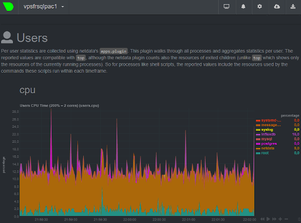

NetData дозволяє зберігати вимірювання у базі даних InfluxDB, базі даних часових рядів, за допомогою протоколу OpenTSDB (Open TimeSeries Database Protocol).

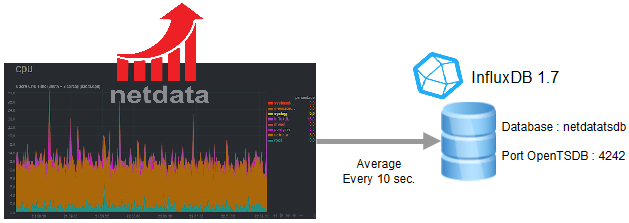

InfluxDB - це високопродуктивна база даних з ефективним стисненням, повністю написана на Go, вона не має зовнішніх залежностей. InfluxDB можна легко зв’язати з Grafana для цілей звітності. InfluxQL - це мова запитів для роботи з даними в базах даних InfluxDB і починаючи з версії 1.7, також введена мова Flux, яку можна активувати: Flux буде мовою в наступній великій версії InfluxDB, але, на жаль, остання сильно відрізняється від Мови SQL. Давайте подивимося архітектуру InfluxDB та способи її використання.

## Архітектура

### Термінологія: measurements, series, keys, values

Бази даних зберігають вимірювання (`measurements`). У наведеному нижче прикладі 2 вимірювання: `netdata.users.mem.root` та `netdata.users.cpu.root`.


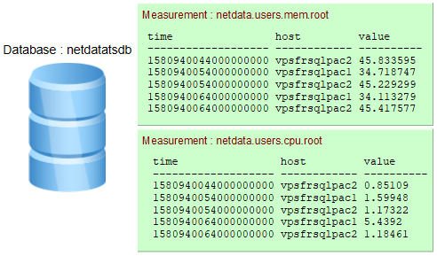

- Якщо під час вставки даних вимірювання не існує воно створюється.
- `Time` це час в Unix epoch(також називається "Unix time" або "POSIX time" або "Unix timestamp" - час в секундах з 1970-го року) але заданий в наносекундах: `1580940454000000000` ↔ `02/05/2020 @ 10:07pm (UTC)`. Існує багато [інструментів перетворення](https://www.unixtimestamp.com/index.php).


- Ключі тегів (`Tag keys`) можна визначити в одному рядку. У наведеному вище прикладі 1 ключ тегу: `host`

- У рядку можна визначити одне або декілька значень ключів поля (`field keys`). У наведеному вище прикладі 1 ключ поля: `value`

- Ряди (`Series`) - комбінація вимірювання/можливих ключів тегів: 

  ```influxdb
  measurement, tag key1=value1, tag key2=value2 [,...]
  ```

  У вищенаведеному вимірюванні `netdata.users.cpu.root` є два ряди:              

  ```
  netdata.users.cpu.root,host=vpsfrsqlpac1
  netdata.users.cpu.root,host=vpsfrsqlpac2
  ```

### InfluxDB Line protocol

Протокол рядків `InfluxDB line protocol` - це текстовий формат для написання точок на InfluxDB. Його формат дуже простий:

```influxdb
<measurement>[,<tag_key>=<tag_value>[,<tag_key>=<tag_value>]] <field_key>=<field_value>[,<field_key>=<field_value>] [<timestamp>]
```

За допомогою `influx` давайте створювати точки в базі даних `netdatatsdb` :

```bash
influxdb% influx -database 'netdatatsdb'> insert cpu_measurement,location=france,host=vpsfrsqlpac1 value=25.089878,description="low usage" 1580918550000000000
> insert cpu_measurement,location=germany,host=vpsfrsqlpac2 value=75.089878,description="high usage" 1580918550000000000

> select * from cpu_measurement;time                description host         location value
----                ----------- ----         -------- -----
1580918550000000000 high usage  vpsfrsqlpac2 germany  75.089878
1580918550000000000 low usage   vpsfrsqlpac1 france   25.089878
```

Коли мітку часу опущено, InfluxDB використовує локальну наносекундну мітку часу в UTC.

### Теги або поля? Загальні рекомендації

Теги індексуються, а поля не індексуються. Запити повинні визначати, що зберігається як тег, а що як поле.

- Зберігайте дані у тегах, якщо це метадані або якщо ви плануєте використовувати їх у запитах `GROUP BY`.

- Важливо: значення тегів завжди інтерпретуються як strings. Тож якщо вони нам потрібні, щоб вони були чимось іншим, ніж рядок потрібно використовувати поля.

- Зберігайте дані у полях, якщо вони використовуються з функціями SQL (`SUM`,` COUNT` ...).

- Не використовуйте однакові назви для тегу та поля.

- Не кодуйте дані в іменах вимірювань та значеннях тегів, наскільки це можливо, це дозволить уникнути використання регулярних виразів. Наприклад використовувати

  ```
  plot=1,region=north
  ```

  замість

  ```
  location=plot-1.north
  ```

  щоб уникнути таких регулярних виразів у запитах:            

  ```sql
  SELECT … FROM <measurement> WHERE location =~ /\.north$/
  ```

### Бази даних, політика збереження та фрагменти(shards) 

Для бази даних визначена політика збереження (`retention policy`), яка за замовченям є нескінченною (`autogen`). InfluxDB зберігає дані в фрагментарних групах (`shard groups`). Фрагментарні групи організовані за політикою збереження та зберігають дані з позначками часу, які потрапляють до певного часового інтервалу, який називається тривалістю фрагменту (`shard duration`).

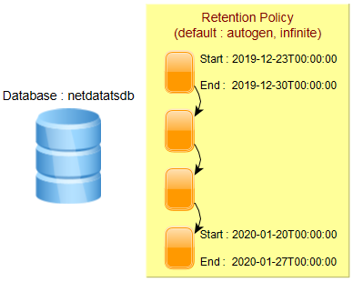

Тривалість фрагментів може бути визначена користувачем, інакше застосовуються наведені нижче значення за замовчуванням:

| Політика тривалості утримання (Retention policy duration) | Тривалість фрагментарної групи (Shard group duration) |
| --------------------------------------------------------- | ----------------------------------------------------- |
| < 2 days                                                  | 1 hour                                                |
| >= 2 days and <= 6 months                                 | 1 day                                                 |
| > 6 months                                                | 7 days                                                |

Тривалість групи фрагментів за замовчуванням добре працює в більшості випадків. Однак екземпляри з високою пропускною здатністю або тривалі роботи будуть корисними при використанні більшої тривалості фрагментарної групи. Рекомендації: 

| Retention policy duration | Shard group duration |
| ------------------------- | -------------------- |
| <= 1 day                  | 6 hours              |
| > 1 day and <= 7 days     | 1 day                |
| > 7 days and <= 3 months  | 7 days               |
| > 3 months                | 30 days              |
| infinite                  | 52 weeks or longer   |

### Індексація в пам'яті та Time-Structured Merge Tree (TSM)

У версії 1.7 за замовчуванням механізм зберігання даних - це "In Memory Index". Доступне нове сховище (TSI: Time Series Index), але воно не активоване за замовчуванням, про цей механізм зберігання йдеться в наступному параграфі.

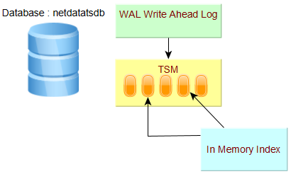

Кожна база даних має свою WAL (Write Ahead Log) та файли TSM.

- Сегменти WAL зберігають стислі блоки запису та видалення.
- Файли TSM зберігають стислі дані серії у стовпчастому форматі.
- Кеш - це представлення в пам'яті даних, що зберігаються в WAL. Він запитується під час виконання та об’єднується з даними, що зберігаються у файлах TSM.
- Індекс In-Memory - це спільний індекс для фрагментів, який забезпечує швидкий доступ до вимірювань, міток та серій.

### Time Series Index (TSI)

Починаючи з версії 1.3, випускається двигун TSI. Він все ще вимкнений за замовчуванням, оскільки для існуючих баз даних необхідна міграція.

Механізм індексування In memory - TSM рушій показав обмеження для систем, що використовують мільйони серій, і високу потужність: до TSI інвертований індекс був структурою даних в пам'яті, побудованою під час запуску бази даних на основі даних у TSM. Використання пам’яті продовжувало зростати, оскільки створювалися нові часові ряди.

Новий індекс часових рядів (TSI) переміщує індекс до файлів на диску, файли відображаються у пам’яті. У цьому контексті операційна система обробляє найменш недавно використовувану (LRU least recently used) пам’ять. Фонові процедури виконуються постійно, щоб ущільнити індекс у більші та більші файли, щоб уникнути необхідності робити занадто багато об’єднань індексу під час запиту.

### Підтримувані протоколи

Щодо передачі даних, InfluxDB підтримує наведені нижче протоколи, і можна визначити декількох слухачів:

- Collectd
- Graphite
- OpenTSDB
- Prometheus
- UDP

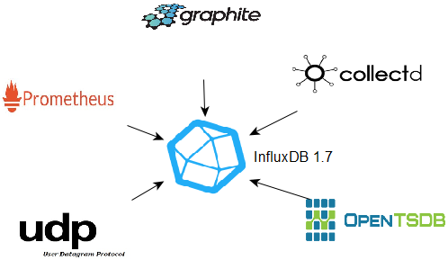

Починаючи з InfluxDB версії 2, фактично на стадії бета-тестування (лютий 2020 р.), Ці протоколи більше не підтримуватимуться безпосередньо: потрібно буде використовувати [telegraf](https://docs.influxdata.com/telegraf).

## Installation

Пакет debian доступний для Ubuntu, але в цій статті, оскільки це некорнева установка, 64-бітні бінарні файли Linux версії 1.7.9 завантажуються з [Веб-сайт InfluxDB](https://portal.influxdata.com/downloads/ ).

Встановлення здійснюється користувачем  `influxdb` в папці `/opt/influxdata`.

```unixdos
influxdb% cd /opt/influxdata
influxdb% wget https://dl.influxdata.com/influxdb/releases/influxdb-1.7.9_linux_amd64.tar.gz
influxdb% tar xvfz influxdb-1.7.9_linux_amd64.tar.gz
```

Отримана структура каталогів така:

```
/opt/influxdata/influxdb-1.7.9-1
                            |___etc
                            |___usr
                            |___var
```

Символічне посилання `influxdb-1.7` створено для зручності використання та управління оновленнями.

```unixdos
influxdb% ln -fs influxdb-1.7.9-1 influxdb-1.7
```

The environment variable `$IFXHOME` is set to the root installation directory and the variable `$IFXBIN` to the          directory where server and client binaries are located (`influxd`, `influx`…).          The directory `$IFXBIN` is added to the environment variable `$PATH`.

```unixdos
influxdb% export IFXHOME=/opt/influxdata/influxdb-1.7
influxdb% export IFXBIN=$IFXHOME/usr/bin
influxdb% export PATH=$IFXBIN:$PATH
```

3 custom environment variables, `$CFG`, `$LOG` and `$RUN`, are created for the log, configuration and pid files directories :

```unixdos
influxdb% export CFG=/opt/influxdata/dba/srvifxsqlpac/cfg
influxdb% export LOG=/opt/influxdata/dba/srvifxsqlpac/log
influxdb% export RUN=/opt/influxdata/dba/srvifxsqlpac/run
```

That’s all, no need to define other variables for librairies and so on…

### Preparing the configuration file

A template configuration file `influxdb.conf` is available in the directory `$IFXHOME/etc`

Create the configuration file from the template file and customize the values for the databases location (meta, data, wal) :

```
$CFG/srvifxsqlpac.conf
[meta]
  dir = "/sqlpac/influxdb/srvifxsqlpac/meta"

[data]
  dir = "/sqlpac/influxdb/srvifxsqlpac/data"
  wal-dir = "/sqlpac/influxdb/srvifxsqlpac/wal"
```

If it is planned to use the language Flux, language that  offers many new features (joins, pivot, external data sources access…),  this one must be activated in          the configuration file : 

```ini
[http]
  flux-enabled = true
```

The default port is 8086 and can be modified in the configuration file :

```ini
[http]
  bind-address = ":8086"
```

### Starting the server

To start the InfluxDB server, run `influxd` with the option `-config` giving the configuration file path :

```unixdos
nohup $IFXBIN/influxd -pidfile /tmp/srvifxsqlpac.pid -config $CFG/srvifxsqlpac.conf >> $LOG/srvifxsqlpac.log 2>&1 &
```

The option `-pidfile` is used to easier manage the shutdown procedure.

### Connection to the server

Run the client `influx` to connect and execute InfluxQL commands :

```unixdos
influxdb% influxConnected to http://localhost:8086 version 1.7.9
InfluxDB shell version: 1.7.9> SHOW DATABASES;name: databases
name
----
_internal
```

### Stopping the server

To stop the server :

```bash
influxdb% kill -s TERM <processid influxd>
influxdb% PIDFILE=$(cat $RUN/srvifxsqlpac.pid)
influxdb% kill -s TERM $PIDFILE
```


## Managing databases, retention policies and shards

### Creating a database

Easy : just run `CREATE DATABASE`

```unixdos
influxdb% influx> CREATE DATABASE netdatatsdb;
```

If the parameter `retention-autocreate` is not set to `false` in the configuration file,          the default retention policy `autogen` set to `infinite` is activated in the database :

```influxdb
USE netdatatsdb;

SHOW RETENTION POLICIES;name    duration shardGroupDuration replicaN default
----    -------- ------------------ -------- -------
autogen 0s       168h0m0s           1        true
```

Replication is set to 1. Replication is available only in the Enterprise Edition.

As the retention is infinite, the default shard group duration applied is 7 days (168 hours). The command `SHOW SHARDS`          gives more details about the existing shards :

```influxdb
SHOW SHARDS;id database    retention_policy shard_group start_time           end_time             expiry_time          owners
-- --------    ---------------- ----------- ----------           --------             -----------          ------
15 netdatatsdb autogen          15          2019-12-23T00:00:00Z 2019-12-30T00:00:00Z 2019-12-30T00:00:00Z
22 netdatatsdb autogen          22          2020-01-06T00:00:00Z 2020-01-13T00:00:00Z 2020-01-13T00:00:00Z
26 netdatatsdb autogen          26          2020-01-13T00:00:00Z 2020-01-20T00:00:00Z 2020-01-20T00:00:00Z
47 netdatatsdb autogen          47          2020-01-20T00:00:00Z 2020-01-27T00:00:00Z 2020-01-27T00:00:00Z
58 netdatatsdb autogen          58          2020-02-03T00:00:00Z 2020-02-10T00:00:00Z 2020-02-10T00:00:00Z
```

### Retention policies and shards

A retention policy `autogen` is created and predefined, obviously it can be modified creating or altering policies

```influxdb
CREATE RETENTION POLICY retention_infinite ON telegraf
DURATION inf REPLICATION 1 SHARD DURATION 52w DEFAULT;
USE telegraf;
SHOW RETENTION POLICIES;name               duration shardGroupDuration replicaN default
----               -------- ------------------ -------- -------
autogen            0s       168h0m0s           1        false
retention_infinite 0s       8736h0m0s          1        true
```

The clause `REPLICATION` is mandatory in the `CREATE` statement even if the community OSS edition is used.

```influxdb
ALTER RETENTION POLICY autogen ON netdatatsdb SHARD DURATION 52w;
ALTER RETENTION POLICY autogen ON netdatatsdb DEFAULT;

USE netdatatsdb;
SHOW RETENTION POLICIES;name    duration shardGroupDuration replicaN default
----    -------- ------------------ -------- -------
autogen 0s       8736h0m0s          1        true
```

About shards, the engine manages the pre-creation. The precreation can be controlled in the configuration file.

```ini
[shard-precreation]
  # Determines whether shard pre-creation service is enabled.
  enabled = true
  # The interval of time when the check to pre-create new shards runs.
  check-interval = "10m"
  # The default period ahead of the endtime of a shard group that its successor group is created.
  advance-period = "30m"
```


## Querying and writing data

### Metadata informations : measurements, series, tag and field keys

The command `SHOW` displays useful informations about metadata : measurements, series, tag keys, field keys…

Use `SHOW MEASUREMENTS` to list the measurements, regular expressions can be used :

```influxdb
SHOW MEASUREMENTS;…
netdata.users.vmem.alerta
netdata.users.vmem.apache
netdata.users.vmem.daemon
…
SHOW MEASUREMENTS WITH MEASUREMENT =~ /dbengines/;…
netdata.dbengines.cpu.influxd
netdata.dbengines.cpu.mysqld
netdata.dbengines.cpu.postgres
…
```

To list the series, `SHOW SERIES` : 

```influxdb
SHOW SERIES;…
netdata.users.vmem.mcs,host=vpsfrsqlpac1
netdata.users.vmem.mcs,host=vpsfrsqlpac2
netdata.users.vmem.messagebus,host=vpsfrsqlpac1
netdata.users.vmem.messagebus,host=vpsfrsqlpac2
netdata.users.vmem.mongodb,host=vpsfrsqlpac1
…
SHOW SERIES FROM "netdata.users.cpu.postgres";key
---
netdata.users.cpu.postgres,host=vpsfrsqlpac1
netdata.users.cpu.postgres,host=vpsfrsqlpac2
SHOW SERIES FROM "netdata.users.cpu.postgres"
WHERE host = 'vpsfrsqlpac1';key
---
netdata.users.cpu.postgres,host=vpsfrsqlpac1   
SHOW SERIES FROM "netdata.users.cpu.postgres"
WHERE host !~ /vpsfrsqlpac1/;key
---
netdata.users.cpu.postgres,host=vpsfrsqlpac2 
```

Tag and field keys can be also listed with `SHOW` commands, including the distinct values from tag keys :

```influxdb
SHOW TAG KEYS FROM "cpu_measurement";name: cpu_measurement
tagKey
------
host
location
SHOW TAG VALUES FROM "cpu_measurement"
WITH KEY=location;name: cpu_measurement
key      value
---      -----
location france
location germany
SHOW FIELD KEYS FROM "cpu_measurement";name: cpu_measurement
fieldKey    fieldType
--------    ---------
description string
value       float
```

### Queries

Specify the precision `rfc3339` to convert the Unix timestamps to human-readable time.

```influxdb
PRECISION rfc3339
SELECT MEAN(value) AS mean_value
FROM "netdata.users.cpu.postgres"
WHERE time > '2020-01-16T02:30:00.000Z' AND time < '2020-01-16T03:30:00.000Z'
  AND host = 'vpsfrsqlpac1'
GROUP BY time(10s)name: netdata.users.cpu.postgres
time                 mean_value
----                 ----------
2020-01-16T02:41:10Z 1.68414
2020-01-16T02:41:20Z 1.19909
2020-01-16T02:41:30Z 1.17531
```

Subqueries are allowed.

Numerous [InfluxQL functions](https://docs.influxdata.com/influxdb/v1.7/query_language/functions/) are available.

### Writing data

#### Enforcing data types

Let’s write a point : 

```influxdb
INSERT cpu_measurement,location=france,host=vpsfrsqlpac1 cpupct=32.887384,slot=1

SELECT * FROM cpu_measurementname: cpu_measurement
time                cpupct    host         location slot
----                ------    ----         -------- ----
1581037980496337504 32.887384 vpsfrsqlpac1 france   1
```

The column type is automatically defined when inserting the first point : 

```influxdb
SHOW FIELD KEYS FROM cpu_measurementname: cpu_measurement
fieldKey fieldType
-------- ---------
cpupct   float
slot     float
```

The datatype of the column `slot` has been automatically defined to `float`.          If you want to set the exact datatype : data type `integer` for the column `slot`,          add `i` after the value when inserting the first point. For boolean data types,          be sure to write `true` or `false` without quotes or double quotes:

```influxdb
INSERT cpu_measurement,location=france,host=vpsfrsqlpac1 cpupct=32.887384,slot=1i,active=true
SHOW FIELD KEYS FROM cpu_measurementname: cpu_measurement
fieldKey fieldType
-------- ---------
active   boolean
cpupct   float
slot     integer
```

Setting the right data type reduces memory and space consumptions and it enforces data integrity : wrong values will be rejected

```influxdb
INSERT cpu_measurement,location=france,host=vpsfrsqlpac1 cpupct=32.887384,slot=1.121212ERR: {"error":"partial write: field type conflict: input field \"slot\" on measurement \"cpu_measurement\" is type float,
already exists as type integer dropped=1"}
```

#### Bulk import

Bulk import is very easy, just create a file with the header containing `DDL/DML CONTEXT-DATABASE` clauses and then the          lines in InfluxDB Line protocol:

```
prices.txt
# DDL
CREATE DATABASE finance
          
# DML
# CONTEXT-DATABASE: finance

prices,type=NSDQ open=10.62,high=10.82,low=10.62,clot=10.65,capit=3.09 1580918400
prices,type=NSDQ open=10.65,high=10.95,low=10.64,clot=10.59,capit=3.09 1581004800
```

The database can already exists, otherwise it is created. The DML specifies which database to use.

The client `influx` is executed to import :

```unixdos
influxdb% influx -import -path=prices.txt -precision=s2020/02/07 13:12:53 Processed 1 commands
2020/02/07 13:12:53 Processed 1249 inserts
2020/02/07 13:12:53 Failed 0 inserts
influxdb% influx -database finance -precision rfc3339select * from prices limit 2name: prices
time                 capit clot  high  low   open  type
----                 ----- ----  ----  ---   ----  ----
2020-02-05T16:00:00Z 3.09  10.65 10.82 10.62 10.62 NSDQ
2020-02-06T16:00:00Z 3.09  10.59 10.95 10.64 10.65 NSDQ
```

#### SELECT INTO

Data and queries results can be copied, even in a cross database context, with the `SELECT INTO` statement.

```influxdb
USE finance;
SELECT * INTO mydb..prices from prices;name: result
time written
---- -------
0    2
```

Continuous queries can automate `SELECT INTO`  statements in order to compute/aggregate results and so on… But          this functionality is not covered here in this introduction,  it is a chapter apart, there are many things to point out.


## Listeners and data ingestion

InfluxDB 1.x supports natively the protocols below for data ingestion : 

- Graphite
- OpenTDS
- CollectD
- Prometheus
- UDP

With InfluxDB V2, it will not be possible anymore, telegraf will be mandatory for feeding the InfluxDB database through these  protocols.

Just one example here : Netdata sends its metrics with the  protocol OpenTDS, so an OpenTDS listener (port 4242) is defined in the  InfluxDB          server configuration file. A database is attached to the  listener, it will be created if it does not exist. Multiple listeners  can          be defined.

```
$CFG/srvifxsqlpac.conf
[[opentsdb]]
  enabled = true
  bind-address = ":4242"
  database = "netdatatsdb"
```

The InfluxDB server OpenTDS port is specified in the Netdata configuration file : 

```
netdata.conf
[backend]
        # host tags =
        enabled = yes
        data source = average
        type = opentsdb
        destination = tcp:vpsfrsqlpac1:4242
        prefix = netdata
        update every = 10
        buffer on failures = 10
        timeout ms = 20000
```


## Visualizing data

### Chronograf

A visualization tool is available for download : [Chronograf](https://portal.influxdata.com/downloads/). The installation is very easy.

```unixdos
influxdb% cd /opt/influxdata
influxdb% wget https://dl.influxdata.com/chronograf/releases/chronograf-1.7.16_linux_arm64.tar.gz
influxdb% tar xvfz  chronograf-1.7.16_linux_arm64.tar.gz

influxdb% ln -fs chronograf-1.7.16-1 chronograf-1.7
```

To start Chronograf on port 8087 : 

```unixdos
influxdb% cd /opt/influxdata
influxdb% nohup ./chronograf-1.7/usr/bin/chronograf --port 8087 --influxdb-url=http://vpsfrsqlpac1:8086  \
                                                    --bolt-path $CFG/chronograf/chronograf.db >> /dev/null  2>> $LOG/chronograf.log &time="2020-02-06T15:06:51+01:00" level=info msg="Serving chronograf at http://[::]:8087" component=server
```

The bolt database (`--bolt-path`), created when running Chronograf for the first time, store dashboards definitions…

The tool is very easy to use and intuitive.

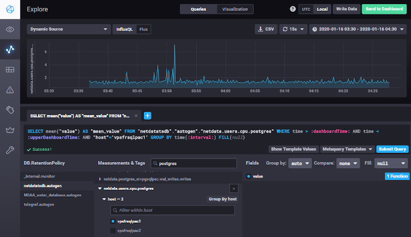 	  

Starting InfluxDB version 1.7.x and if the language Flux is enabled          in the configuration file (`flux-enabled = true`),  both InfluxQL and Flux languages are available in Chronograf : menu  buttons allow to switch from one          to another. This functionality will be helpful when preparing  the migration to InfluxDB v2, InfluxQL will be indeed removed in this  version and Flux          will be the unique language.

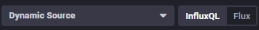

Further notice : starting version 2.0, Chronograf functionalities are fully integrated in InfluxDB,          it will not be anymore a separate standalone tool.

### Grafana

Grafana easily integrates dashboards with InfluxDB as a data source. In the menu, select ConfigurationData Sources, click the button "Add Data Source" and then choose "InfluxDB". Fill the datasource connection informations  (`http://<hostname>:<port InfluxDB>`…) and that’s all, then building dashboards is very intuitive.

​         						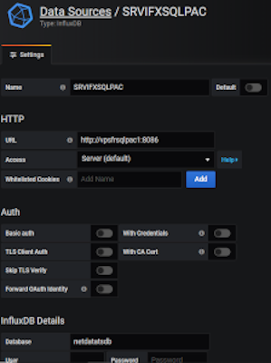 							

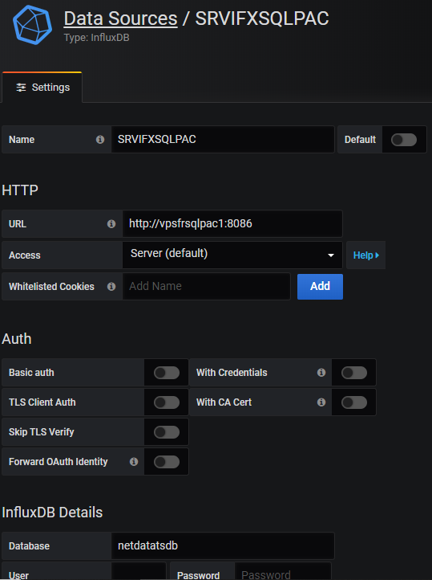 											

 							 						


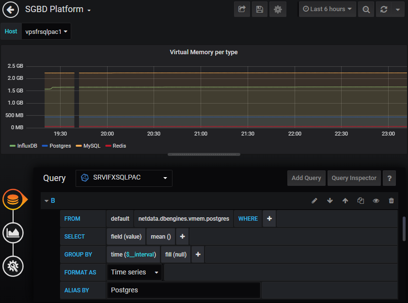 				

The plugin for the Flux language is in beta phase but available : [Flux (InfluxDB) DataSource plugin](https://grafana.com/plugins/grafana-influxdb-flux-datasource/installation). It requires Grafana 6.4 and onwards versions.


## Statistics and configuration

Use the command `SHOW STATS` to consult statistics. Without arguments, all statistics are displayed, except the in          memory index size.

### In Memory index size

```influxdb
SHOW STATS FOR 'indexes'name: indexes
memoryBytes
-----------
5438060
```

### Statistics per database

```influxdb
SHOW STATS FOR 'database'name: database
tags: database=_internal
numMeasurements numSeries
--------------- ---------
13              147

name: database
tags: database=netdatatsdb
numMeasurements numSeries
--------------- ---------
2727            4441
```

Getting database size is not trivial, one can use `SHOW STATS FOR 'shard'` but the output is not easy,          shards are not ordered by database name :

```influxdb
SHOW STATS FOR 'shard';name: shard
tags: database=netdatatsdb, engine=tsm1, id=15, indexType=inmem, path=/sqlpac/influxdb/srvifxsqlpac/data/netdatatsdb/autogen/15,
retentionPolicy=autogen, walPath=/sqlpac/influxdb/srvifxsqlpac/wal/netdatatsdb/autogen/15
diskBytes fieldsCreate seriesCreate writeBytes writePointsDropped writePointsErr writePointsOk writeReq writeReqErr writeReqOk
--------- ------------ ------------ ---------- ------------------ -------------- ------------- -------- ----------- ----------
36094696  0            2973         0          0                  0              0             0        0           0

name: shard
tags: database=netdatatsdb, engine=tsm1, id=22, indexType=inmem, path=/sqlpac/influxdb/srvifxsqlpac/data/netdatatsdb/autogen/22,
retentionPolicy=autogen, walPath=/sqlpac/influxdb/srvifxsqlpac/wal/netdatatsdb/autogen/22
diskBytes fieldsCreate seriesCreate writeBytes writePointsDropped writePointsErr writePointsOk writeReq writeReqErr writeReqOk
--------- ------------ ------------ ---------- ------------------ -------------- ------------- -------- ----------- ----------
17649537  0            3422         0          0                  0              0             0        0           0

name: shard
tags: database=netdatatsdb, engine=tsm1, id=26, indexType=inmem, path=/sqlpac/influxdb/srvifxsqlpac/data/netdatatsdb/autogen/26,
retentionPolicy=autogen, walPath=/sqlpac/influxdb/srvifxsqlpac/wal/netdatatsdb/autogen/26
diskBytes fieldsCreate seriesCreate writeBytes writePointsDropped writePointsErr writePointsOk writeReq writeReqErr writeReqOk
--------- ------------ ------------ ---------- ------------------ -------------- ------------- -------- ----------- ----------
110735177 0            3691         0          0                  0              0             0        0           0

name: shard
tags: database=netdatatsdb, engine=tsm1, id=47, indexType=inmem, path=/sqlpac/influxdb/srvifxsqlpac/data/netdatatsdb/autogen/47,
retentionPolicy=autogen, walPath=/sqlpac/influxdb/srvifxsqlpac/wal/netdatatsdb/autogen/47
diskBytes fieldsCreate seriesCreate writeBytes writePointsDropped writePointsErr writePointsOk writeReq writeReqErr writeReqOk
--------- ------------ ------------ ---------- ------------------ -------------- ------------- -------- ----------- ----------
28286352  0            3577         0          0                  0              0             0        0           0

name: shard
tags: database=netdatatsdb, engine=tsm1, id=58, indexType=inmem, path=/sqlpac/influxdb/srvifxsqlpac/data/netdatatsdb/autogen/58,
retentionPolicy=autogen, walPath=/sqlpac/influxdb/srvifxsqlpac/wal/netdatatsdb/autogen/58
diskBytes fieldsCreate seriesCreate writeBytes writePointsDropped writePointsErr writePointsOk writeReq writeReqErr writeReqOk
--------- ------------ ------------ ---------- ------------------ -------------- ------------- -------- ----------- ----------
46062999  234          3294         0          0                  0              5699051       7092     0           7092
```

Or a query can be issued directly in the database `_internal` to filter the database name.

```influxdb
USE _internal;

SELECT last("diskBytes")
FROM "monitor"."shard"
WHERE ("database" =~/netdatatsdb/)
    AND time >= now() -1m
GROUP BY "database", "path" fill(null);name: shard
tags: database=netdatatsdb, path=/sqlpac/influxdb/srvifxsqlpac/data/netdatatsdb/autogen/15
time                last
----                ----
1581030800000000000 36094696

name: shard
tags: database=netdatatsdb, path=/sqlpac/influxdb/srvifxsqlpac/data/netdatatsdb/autogen/22
time                last
----                ----
1581030800000000000 17649537

name: shard
tags: database=netdatatsdb, path=/sqlpac/influxdb/srvifxsqlpac/data/netdatatsdb/autogen/26
time                last
----                ----
1581030800000000000 110735177

name: shard
tags: database=netdatatsdb, path=/sqlpac/influxdb/srvifxsqlpac/data/netdatatsdb/autogen/47
time                last
----                ----
1581030800000000000 28286352

name: shard
tags: database=netdatatsdb, path=/sqlpac/influxdb/srvifxsqlpac/data/netdatatsdb/autogen/58
time                last
----                ----
1581030800000000000 44106795
```

### Statistics per input plugins (listeners)

When listeners are setup for data ingestion (opentsdb,  graphite, udp…), statistics per listener can be displayed : in the  example below,          opentsdb on port 4242 for data ingestion coming from netdata.

```influxdb
SHOW STATS for 'opentsdb';name: opentsdb
tags: bind=:4242
batchesTx batchesTxFail connsActive connsHandled droppedPointsInvalid httpConnsHandled pointsTx tlBadFloat tlBadLine tlBadTag tlBadTime
--------- ------------- ----------- ------------ -------------------- ---------------- -------- ---------- --------- -------- --------- 
7542      0             1           1            0                    0                6063674  0          0         0        0         

tlBytesRx tlConnsActive tlConnsHandled tlPointsRx tlReadErr
--------- ------------- -------------- ---------- ---------
462091571 1             1              6063674    0
```

### Running queries

Unoptimized queries may have unexpected behaviours in the InfluxDB engine (CPU…), use `SHOW QUERIES` and `KILL QUERY`          to kill high consuming resources queries :

```influxdb
SHOW QUERIES
qid query                                                                                                                                                                                                             
--- -----                                                                                                                                                                                                             
690 SELECT mean(value) AS mean_value FROM netdatatsdb.autogen."netdata.users.cpu.postgres" WHERE time > '1900-01-16T02:30:00.000Z' AND time < '2020-01-16T03:30:00.000Z' AND host = 'vpsfrsqlpac1' GROUP BY time(10s) 

database    duration status
--------    -------- ------
netdatatsdb 8m2s     runningKILL QUERY 690;
```

### Configuration

To view the current settings :

```influxdb
SHOW DIAGNOSTICS;name: build
Branch Build Time Commit                                   Version
------ ---------- ------                                   -------
1.7               23bc63d43a8dc05f53afa46e3526ebb5578f3d88 1.7.9

name: config
bind-address   reporting-disabled
------------   ------------------
127.0.0.1:8088 false

name: config-coordinator
log-queries-after max-concurrent-queries max-select-buckets max-select-point max-select-series query-timeout write-timeout
----------------- ---------------------- ------------------ ---------------- ----------------- ------------- -------------
0s                0                      0                  0                0                 0s            10s

name: config-cqs
enabled query-stats-enabled run-interval
------- ------------------- ------------
true    false               1s

name: config-data
cache-max-memory-size cache-snapshot-memory-size cache-snapshot-write-cold-duration compact-full-write-cold-duration
--------------------- -------------------------- ---------------------------------- -------------------------------- 
1073741824            26214400                   10m0s                              4h0m0s                            

dir                                 max-concurrent-compactions max-index-log-file-size max-series-per-database max-values-per-tag series-id-set-cache-size
---                                 -------------------------- ----------------------- ----------------------- ------------------ ------------------------
/sqlpac/influxdb/srvifxsqlpac/data  0                          1048576                 1000000                 100000             100                      

wal-dir                           wal-fsync-delay
-------                           ---------------
/sqlpac/influxdb/srvifxsqlpac/wal 0s


name: config-httpd
access-log-path bind-address enabled https-enabled max-connection-limit max-row-limit
--------------- ------------ ------- ------------- -------------------- -------------
                :8086        true    false         0                    0

name: config-meta
dir
---
/sqlpac/influxdb/srvifxsqlpac/meta

name: config-monitor
store-database store-enabled store-interval
-------------- ------------- --------------
_internal      true          10s

name: config-opentsdb
enabled bind-address database    retention-policy batch-size batch-pending batch-timeout
------- ------------ --------    ---------------- ---------- ------------- -------------
true    :4242        netdatatsdb                  1000       5             1s

name: config-precreator
advance-period check-interval enabled
-------------- -------------- -------
30m0s          10m0s          true

name: config-retention
check-interval enabled
-------------- -------
30m0s          true

name: config-subscriber
enabled http-timeout write-buffer-size write-concurrency
------- ------------ ----------------- -----------------
true    30s          1000              40

name: network
hostname
--------
vpsfrsqlpac1

name: runtime
GOARCH GOMAXPROCS GOOS  version
------ ---------- ----  -------
amd64  2          linux go1.12.6

name: system
PID  currentTime                    started                        uptime
---  -----------                    -------                        ------
1382 2020-02-06T23:37:16.912800481Z 2020-02-06T18:20:27.149884796Z 5h16m49.762915685s
```


## Conclusion

InfluxDB is a time series database with interesting performances and functionalities.

- Easy ingestion, natively or through common protocols (OpenTSDB, Graphite…).
- Queries SQL Like.
- Easy reporting and visualization with Grafana or Chronograf.

A useful functionality has not been covered in this introduction : the continuous queries. Too many things to point out.

Important note, actually in beta version (February 2020),  InfluxDB v2 will be released soon and maybe the migration will not be so easy :

- The InfluxQL language is replaced by the Flux language  in this release. Even if it contains interesting new features            compared to InfluxQL (joins, pivots, access to external  data…), the Flux language is more a no-SQL language not so obvious to  learn.
- Native support for the protocols Graphite, OpenTSDB… is removed. The tool telegraf will be mandatory.
- Continuous queries are replaced by tasks.

https://grafana.com/products/cloud/ 

https://www.influxdata.com/get-influxdb/

[Analysis of the Storage Mechanism in InfluxDB](https://medium.com/dataseries/analysis-of-the-storage-mechanism-in-influxdb-b84d686f3697) 