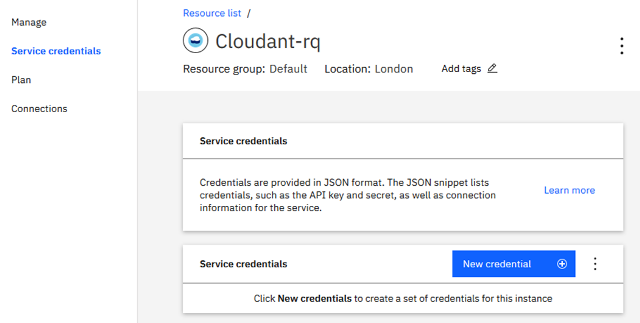
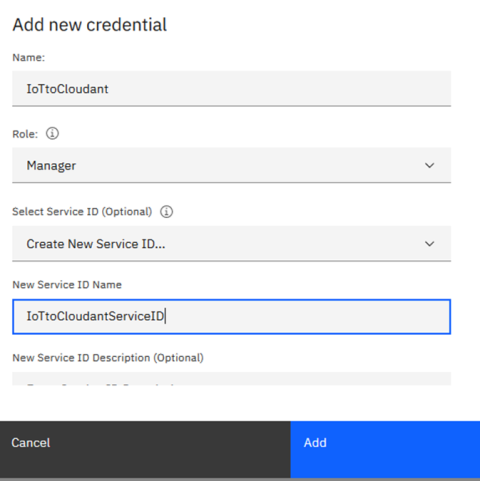
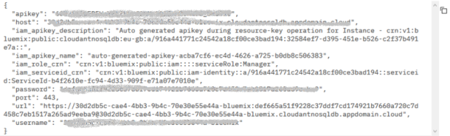
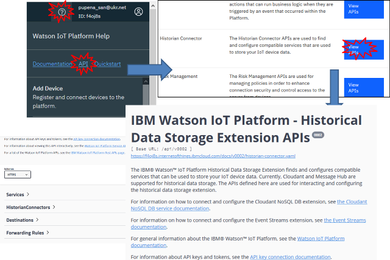
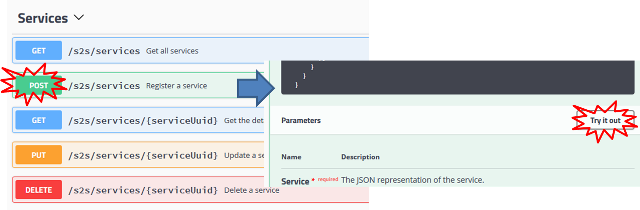
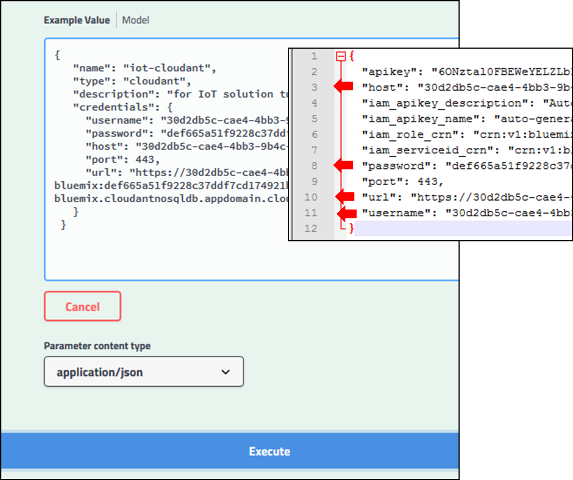
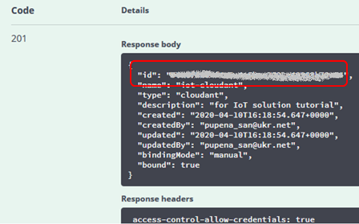
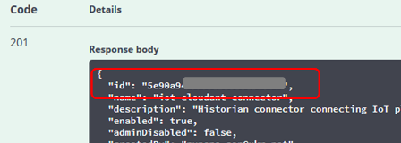
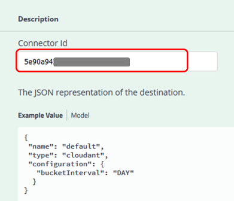

Олександр Пупена

# Рецепт: налаштування зберігання історичних даних  Watson IoT в IBM Cloudant

З кінця 2019-го року на дашбоардах "IBM Watson IoT Platform" зникла кнопка і вікно налаштування Extension, які давали можливість налаштувати запис даних з подій та змін станів пристроїв IoT.   


Проблему обговорювали на [stack overflow](https://stackoverflow.com/questions/60184990/watson-iot-extensions-entry-is-not-available-in-left-menu?fbclid=IwAR1GRkeJGaPYq7bfJtg5AwxvhWVrIWqcHR5uMgJrnwj3StRI5LwjEaA_ldk) де вказали один із способів, описаний в посібнику [Gather, visualize, analyze and detect anomalies in IoT data](https://cloud.ibm.com/docs/tutorials?topic=solution-tutorials-gather-visualize-analyze-iot-data#historical_data_cloudant). Більшість матеріалу статті взятий з цього посібника адаптовано для [лабораторної](https://pupenasan.github.io/TI40/%D0%9B%D0%B0%D0%B1%D0%BE%D1%80/lab4_2.html) з курсу "Технології Індустрії 4.0" . 

У цій статті-рецепті показано як прив'язати сервіс IBM Cloudant до платформи Watson IoT для зберігання історичних даних. Для кращого розуміння виконуваних тут налаштувань, рекомендую ознайомитися (або пригадати)  з наступними матеріалами:

- лекція по [налаштуванню доступу до різних сервісів IBM Cloud](../Лекц/ibmaccess.md) 
- лекція по [WEB API](https://pupenasan.github.io/TI40/%D0%9B%D0%B5%D0%BA%D1%86/HTTPAPI.html)
- довідник [інтерфейс API IBM Watson IoT Platform](ioitodbapi.md)

## Створення в IBM Cloudant  облікового запису для сервісу (Service credentials) 

1.Перейдіть до ресурсу Cloudant, який Ви хочете підключити до IoT сервісу.  



2.Натисніть `New credential` , заповніть поля імені облікового запису і імені ServiceID а потім натисніть `Add`.  



3.Натисніть `View credentials` для новоствореного запису, скопіюйте його в блокнот.  



## Підключення data connector IoT для збереження історичних даних 

Налаштування нового з’єднання - це чотиритактний процес:

1. створення прив’язки до сервісу (service binding), яка надає платформі Watson IoT необхідну інформацію для підключення до сервісу Cloudant.
2. створення екземпляру Historian connector для прив'язки до сервісу.
3. конфігурування одного або кілька пунктів призначення (destination) для підключень
4. встановлення одного або кількох правил пересилання (Forwarding Rule) для кожного пункту призначення.

Щоб налаштувати нове з'єднання, зробіть наступну послідовність. 

1.Передйть на Watson IoT Platform, натисніть іконку **Watson IoT Platform Help** (правому верхньому кутку), далі натисніть **API**, після чого натисніть **View APIs** у розділі **Historian Connector**  для перегляду  а також виконання запитів HTTP API .



Внизу сторінки `IBM Watson IoT Platform - Historical Data Storage Extension APIs` є кілька розділів, які показують які саме дії можна використати з HTTP API. 

###### Налаштування прив’язки до сервісу (service binding)

Тут налаштовується підлключення до сервісу Cloudant через обліковий запис, який був створений до цього. 

2.Перейдіть (розгорніть кліком) розділ  **Services**, виберіть **POST /s2s/services** і натисніть  **Try it out**. 



У вікні вводу **Example Value** замініть текст на наступний .

```json
 {
   "name": "iot-cloudant",
   "type": "cloudant",
   "description": "for IoT solution tutorial",
   "credentials": {
     "username": "CLOUDANT_USERNAME",
     "password": "CLOUDANT_PASSWORD",
     "host": "CLOUDANT_HOST",
     "port": 443,
     "url": "CLOUDANT_URL"
   }
 }
```

Замініть поля `username`, `password`, `host` та `url` на однойменні з облікового запису для Cloudant, який був тільки що створений.    



3.Натисніть **Execute** , повинна прийти відповідь `HTTP 201` . Скопіюйте`id` (serviceID) в блокнот для наступного пункту. 



###### Налаштування HistorianConnectors 

Тут налаштовується підключення до конкретного historian (бази даних). У випадку Cloudant достатньо вказати тільки ідентифікатор прив'язки до сервісу.  

4.Перейдіть (розгорніть кліком) розділ **HistorianConnectors**, виберіть  **POST /historianconnectors** та натисніть **Try it out**. Замініть текст в полі **Example Value** наступним текстом. 

```
 {
   "name": "iot-cloudant-connector",
   "description": "Historian connector connecting IoT platform to cloudant",
   "serviceId": "SERVICE_ID",
   "type": "cloudant",
   "enabled": true
 }
```

Замініть поле `SERVICE_ID` на `id` з попередньої відповіді.

5.Натисніть **Execute** для отримання відповіді  `HTTP 201` . Скопіюйте отриманий `id`(connectorID) з відповіді в блокнот для наступних використань.




###### Налаштування місця призначення (Destinations)

Тут налаштовуються конкретне місце (для Cloudnat це bucket) куди будуть зберігатися дані. 

6.Перейдіть (розгорніть кліком) розділ **Destinations**, виберіть  **POST/historianconnectors/{connectorId}/destinations** та натисніть **Try it out**. Впишіть в поле `connectorID`  раніше скопійоване значення `id` та замініть **Example Value**  наступним текстом.

```json
{
 "name": "default",
 "type": "cloudant",
 "configuration": {
   "bucketInterval": "DAY"
  }
}
```



7.Натисніть **Execute** для отримання відповіді    `HTTP 201` .

###### Налаштування правил пересилання (Forwarding Rules)

Тут налаштовуються правила за якими дані пересилаються у вказаний конектор. 

8.Перейдіть (розгорніть кліком) розділ **Forwarding Rules**, виберіть  **POST/historianconnectors/{connectorId}/forwardingrules** та натисніть **Try it out**. 

Впишіть скопійоване  значення `id` конектора (п.5) у поле `connectorID` та замініть **Example Value**  наступним текстом.

```json
 {
 "name": "iot-cloudant-rule",
 "destinationName": "default",
 "type": "event",
 "selector": {
   "deviceType": "*",
   "eventId": "*"
  }
 }
```

Зірочки (`*`) в `deviceType` та `eventId` вказує на те, що в Cloudant будуть писатися всі події для всіх типів пристроїв IoT.

9.Натисніть **Execute** для отримання відповіді `HTTP 201` .