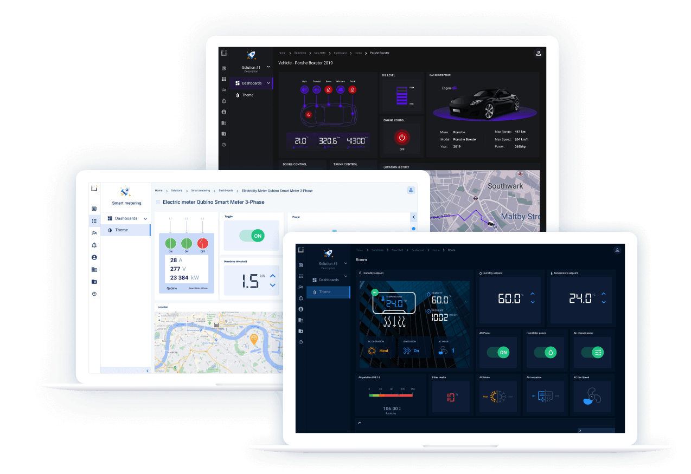
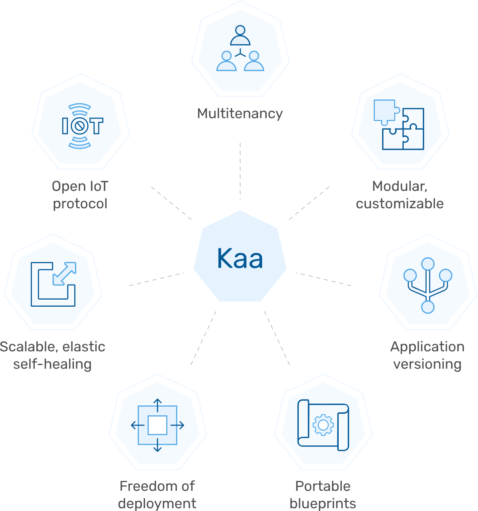

# Хмарний сервіс KaaIoT 

<https://cloud.kaaiot.com>

- [How to connect a device](https://docs.kaaiot.io/KAA/docs/v1.2.0/Tutorials/connect-device-to-iot-platform/?_ga=2.104485952.175941070.1594793132-2049732900.1594793132)

## Про Kaa cloud

<https://www.kaaproject.org/>

Kaa Cloud - це платформа як послуга IoT (PaaS), доступна для всіх зареєстрованих користувачів з KaaID. Це платформа Kaa Enterprise IoT у формі PaaS, яку ви можете почати використовувати за лічені секунди! Розроблений для спрощеного користувальницького досвіду, він дає вам доступ майже до всіх основних можливостей Kaa, без попередньої технічної експертизи. Ось чому ми вважаємо, що Kaa Cloud - це найпростіший спосіб підключити свої пристрої до хмари та насолодитися перевагами віддаленого управління пристроями та аналітики. Він ідеально підходить для корпоративних програм IoT, а також для власних проектів IoT та експериментів.

The Kaa Cloud basic plan includes unlimited access to all Kaa's features but is limited to 5 connected devices.

Базовий план Kaa Cloud (безкоштовний) включає необмежений доступ до всіх функцій Kaa, але обмежений 5 підключеними пристроями.

## IoT dashboards for popular use cases

We are adding purpose-built IoT  dashboards into Kaa so that you could use them as templates for your IoT solutions. We’ve already added dashboards for smart metering, smart  building, and fleet management use cases. More to come!

## Platform advantages

Платформа Kaa Enterprise IoT була розроблена з урахуванням надмірних рішень IoT корпоративного рівня. Це виключає монолітний підхід до архітектури на користь високопортативних мікросервісів, які дозволяють гнучко переставляти та налаштовувати навіть в середині життєвого циклу рішення. Це забезпечує масштабованість і стійкість, одночасно пропонуючи повну свободу щодо типу розгортання. У поєднанні з технологічно-агностичним ставленням до розробки та DevOps, Kaa Enterprise передає вам відповідальність за ваші інновації IoT, забезпечуючи широку свободу технологій, моделей розгортання та налаштування.

[Вартість](https://www.kaaproject.org/pricing?currentPlan=5#pricing-kaa-cloud)

# Kaa IoT Platform Features for Enterprise IoT Projects

# Industrial IoT Platform

<https://www.kaaproject.org/industrial-automation>

## Kaa enterprise solutions for Industrial Internet of Things

Промислова платформа IoT - це швидко зростаючий сегмент технології IoT, що включає набір функцій для управління edge пристроями, аналізу даних IoT, сучасних сенсорних технологій та рішень для підключення, що покращують промислове обладнання та промислові операції за допомогою віддаленого моніторингу, прогнозного обслуговування та аналітика великих даних пристрою .    

У більш широкому масштабі промислова платформа IoT є ключовим фактором, що сприяє [Industry 4.0](https://en.wikipedia.org/wiki/Industry_4.0), інакше відомій як smart factory, яка поєднує сучасні хмарні обчислення, IIoT та ШІ для створення інтелектуального, самооптимізуючогося промислового обладнання та виробничих потужностей.      

Розглядаючи Індустріальний Інтернет речей (IIoT) з практичної точки зору бізнесу, виробничі компанії, які впроваджують IIoT, користуються підвищеною **цінністю для споживачів** та покращеною **економічною ефективністю** внутрішніх операцій. Наприклад, пристрої з розумними функціями **мінімізують зусилля на місцях** і **зменшують загальну вартість власності (TCO (Total Cost of Ownership)**, дозволяючи віддалений моніторинг продуктивності, розслідування проблем та усунення несправностей. Крім того, на заводі з підтримкою IoT, де окремі, але взаємозалежні компоненти виробничої лінії знають про діяльність один одного майже в реальному часі, весь виробничий процес стає більш ефективним і набагато простішим для моніторингу та адміністрування.

Крім того, IIoT сприяє **гнучкості завдяки відкритим архітектурам, які підтримують налаштування та впорядковані оновлення програмного забезпечення** на десятках тисяч пристроїв. Усі ці переваги промислового IoT спонукали виробників обладнання виробляти нові моделі обладнання, які включають інтелектуальні функції нестандартно.

### What role does Kaa play in Industrial IoT implementation?

​     Kaa - це корпоративна платформа IoT, яка також широко використовується як промислова платформа IoT, яка функціонує як менеджер хмарних додатків для підключених промислових виробничих потужностей. Однією з ключових особливостей Kaa є те, що він **апаратно-транспортно-агностичний**, що дозволяє йому легко **інтегруватися з широким розмаїттям датчиків, контролерів, машин і шлюзів пристроїв**, щоб **легко підтримувати будь-які існуюча промислова інфраструктура**.

Після встановлення **Kaa може надавати нові пристрої, управляти їхнім життєвим циклом, отримувати та зберігати телематику та дані датчиків у хмарі, виконувати віддалені команди, виконувати оновлення в ефірі (OTA), аналізувати дані пристрою та створювати правила для розумних сповіщень**.        

Постійні можливості підключення та обробки даних Kaa використовують популярні протоколи, такі як **MQTT**, і їх можна використовувати разом із популярними системами управління даними та базами даних для інтеграції з вашим існуючим серверним кодом.    

Відкриті API Kaa спрощують завдання інтеграції та DevOps, дозволяючи швидко збирати наскрізні програми IoT для **автоматизації промислових систем, інтелектуального обслуговування та віддаленого моніторингу**. Kaa також має зручний веб-інструмент інформаційної панелі для налаштування **віджетів візуалізації даних**, які виконують процедури моніторингу виробництва.    

Останні інновації, такі як Industrial IoT, Big Data та AI, готуються до автоматизації фабрик за допомогою промислових роботів та інтелектуальних пристроїв. Технологія Kaa сприяє перетворенню автономних фабрик у реальність.

### Maxmized production uptime

​            Early detection mechanisms and fault prediction capabilities are crucial to prevent equipment from unnecessary            damage and shutdowns. Smart industrial systems equipped with IoT sensors make early fault detection possible.            In this scenario, Kaa collects detailed information  transmitted by sensors to keep track of equipment status,            efficiency, security, and much more. As soon as a fault is  detected an alert is sent to the operator, potentially            preventing a more serious fault from occurring. An  additional benefit is the collection of historic information about            your equipment, which with the help of machine learning and  AI, results in increased efficiency of equipment audits            and maintenance.          

With an Industrial IoT platform, a diverse list of production assets become accessible for conducting  remote inspections at any time.

- Performance and device health data monitoring
- Predictive maintenance
- Remote troubleshooting
- Smart alerts and notifications
- Perimeter security and access controls

### Efficient filed services

​            Field operations, in particular, stand to gain drastic  increases in efficiency by adopting IIoT. Telemetry data            collected from connected field equipment contains a wealth  of actionable information for technicians. Analysis of this            data eliminates much of the guesswork in the field, greatly  reducing inefficiency resulting from overservice and            excessive truck rolls.          

​            In cases when equipment does require physical service, efficiency is also improved from having precise and expedited            failure root cause analysis obtained from sensor data and the electronic service history record.          

​            An Industrial IoT platform can prevent failures before they  occur. In most cases, properly configured analysis of data feeds from  equipment            can flag likely future malfunctions so that appropriate  preemptive maintenance actions can be performed before the            malfunction actually occurs.          

- Remote monitoring and troubleshooting
- Predictive maintenance
- Continuous product improvement through identification of weak spots and typical usage scenarios
- Data-driven warranty extension and claim validation
- OTA updates, A / B testing of different device software

### Optimixed asset optimization

​            According to the World Economic Forum’s Industrial Internet  Survey, optimizing asset utilization ranked as the top            reason to adopt IIoT technology, with 79% of respondents  citing this as “extremely important” or “very important” for            near-term adoption.          

​            By enabling cloud capabilities for your equipment with Kaa, you’ll be able to monitor and control your workflows            remotely, as well as set up automation rules to optimize asset utilization. You can also take advantage of            comprehensive performance analytics to introduce timely adjustments to your production routines and use historical            data to optimize future planning.          

Additional cost savings can be gained by adopting dynamic energy use policies, managing energy             usage during peak, off-peak, and zero service periods.          

- Programmable automation for different kinds of industrial equipment
- Factory-wide performance analytics
- Device management via digital twins
- Smart lighting and smart metering

### Smart factory

​            A Smart Factory is the ultimate goal for manufacturing  operations. In simple terms this is accomplished by applying            Industrial IoT methods within your operation. However,  achieving this requires strategic adoption of several keystone            technology trends. One of them is known as the “intelligent  edge”. It is based on the paradigm of decentralized            networking within the Industrial IoT ecosystem - meaning  edge devices perform their part of data processing workloads            before transmitting results to the cloud. Such network  topology **enables sophisticated IoT workflows within limited            network resources, ensures devices can operate without interruption if they go offline, and reduces latency for            critical operations**.          

Another essential technology needed for smart factories is AI and machine learning. Currently the most popular AI            applications are **voice and image recognition, robotic process automation, quality control**, and            **autonomous robots**. As AI algorithms gain more traction, industrial systems continue to optimize operations and discover new possibilities            to achieve autonomy. AI is expected to be able - via automation - to program and configure millions of industrial            devices, thus accelerating the evolution of IIoT and smart factory innovations.

- Applications for intelligent edge
- Machine learning and AI applications
- Robotic process automation
- Smart factory system integration