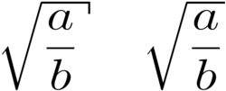
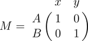
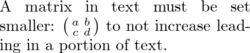

# LaTeX/Mathematics

Оригінал тексту - https://en.wikibooks.org/wiki/LaTeX/Mathematics

Корисні утиліти:

- Редактор формул - [MathLex - LaTeX math translator and equation builder](http://mathlex.org/latex) 
- Детектор літер з переведення в латекс http://detexify.kirelabs.org/

## Математичні середовища

LaTeX повинен знати, коли текст є математичним. Це тому, що LaTeX набирає математичні позначення інакше, ніж звичайний текст. Тому для цього були оголошені спеціальні середовища. Залежно від того, як вони представлені, їх можна розділити на дві категорії:

- *text* — текстові формули відображаються в рядку, тобто всередині тексту, де він оголошений, наприклад, я можу сказати, що   в межах цього речення.
- *displayed* — відображені формули знаходяться на рядку самі по собі.

Оскільки математика вимагає спеціальних середовищ, звичайно існують відповідні назви середовища, які ви можете використовувати стандартним способом. Однак, на відміну від більшості інших середовищ, є кілька зручних скорочень для оголошення ваших формул. У наступній таблиці їх підсумовано:

| Тип              | включені в середину тексту формули | відображені формули | Displayed and automatically numbered equations               |
| ---------------- | ---------------------------------- | ------------------- | ------------------------------------------------------------ |
| Середовище       | `math`                             | `displaymath`       | `equation`                                                   |
| LaTeX скорочення | `\(...\)`                          | `\[...\]`           |                                                              |
| TeX скорочення   | `$...$`                            | `$$...$$`           |                                                              |
| Comment          |                                    |                     | `equation*` (starred version) придушує нумерацію, але вимагає amsmath |

**Пропозиція**: слід уникати використання `$$...$$`, оскільки це може спричинити проблеми, особливо з макросами AMS-LaTeX. Крім того, якщо виникне проблема, повідомлення про помилки можуть бути не корисними.

Середовища `equation*` і `displaymath` функціонально еквівалентні.

Якщо ви вводите текст нормально, кажуть, що ви перебуваєте в *текстовому режимі*, але під час введення в одному з цих математичних середовищ ви перебуваєте в *математичному режимі*, який має деякі відмінності в порівнянні з *текстом режим*:

1. Більшість пробілів і розривів рядків не мають жодного значення, оскільки всі пробіли або випливають логічно з математичних виразів, або їх потрібно вказати спеціальними командами, такими як `\quad`
2. Порожні рядки не допускаються. Лише один абзац на формулу.
3. Кожна літера вважається іменем змінної і буде набрана як така. Якщо ви хочете набрати звичайний текст у формулі (звичайний вертикальний шрифт із звичайним інтервалом), вам потрібно ввести текст за допомогою спеціальних команд, які наведені ниже в розділі (Добавлення тексту в формули)

### Вставлення "Відображуваних" математичних даних у блоки тексту

Для того, щоб деякі оператори, такі як `\lim` або `\sum`, відображалися правильно в деяких математичних середовищах (читай `$......$`), може бути зручно написати `\displaystyle ` клас всередині середовища. Це може призвести до того, що лінія буде вищою, але призведе до правильного відображення експонент та індексів для деяких математичних операторів. Наприклад, `$\sum$` надрукує менший Σ, а `$\displaystyle \sum$` надрукує більший , як у рівняннях (це працює лише з пакетом AMSMATH). Цю поведінку можна примусити для всіх математичних середовищ, оголосивши `\everymath{\displaystyle}` на самому початку (тобто перед `\begin{document}`).

## Символи

У математики багато символів! Нижче наведено набір символів, доступ до яких можна отримати безпосередньо з клавіатури:

```
+ - = ! / ( ) [ ] < > | ' : *
```

Крім перерахованих вище, для відображення потрібних символів мають бути видані окремі команди. Існує багато прикладів, таких як грецькі літери, символи множин і відносин, стрілки, двійкові оператори тощо.

Наприклад:

```
\forall x \in X, \quad \exists y \leq \epsilon
```

виведе
$$
\forall x \in X, \quad \exists y \leq \epsilon
$$
На щастя, є інструмент, який може значно спростити пошук команди для певного символу - [Detexify](http://detexify.kirelabs.org/classify.html) . Можна також переглянути [Повний список символів LaTeX](https://mathvault.ca/wp-content/uploads/Comprehensive-List-of-Mathematical-Symbols.pdf).

## Грецькі літери

Грецькі літери зазвичай використовуються в математиці, і їх дуже легко вводити в *математичному режимі*. Вам просто потрібно ввести назву літери після зворотної косої риски: якщо перша літера мала, ви отримаєте грецьку літеру, якщо перша літера велика (і тільки перша), то ви отримаєте велику літеру. . Зауважте, що деякі великі грецькі літери виглядають як латинські, тому вони не надаються LaTeX (наприклад, великі *Alpha* і *Beta* - це лише "A" і "B" відповідно). Епсилон, тета, каппа, фі, пі, ро та сигма у нижньому регістрі надаються у двох різних версіях. Альтернативна, або *var*iant, версія створюється шляхом додавання "var" перед назвою літери:

```
\alpha, \Alpha, \beta, \Beta, \gamma, \Gamma, \pi, \Pi, \phi, \varphi, \mu, \Phi
```

матиме вигляд
$$
\alpha, \Alpha, \beta, \Beta, \gamma, \Gamma, \pi, \Pi, \phi, \varphi, \mu, \Phi
$$
Нижче наведений повний перелік грецких символів

## Оператори

Оператор — це функція, яка записується у вигляді слова: напр. тригонометричні функції (sin, cos, tan), логарифми та показники (log, exp), межі (lim), а також слід і визначник (tr, det). LaTeX має багато з них, визначених як команди:

```
\cos (2\theta) = \cos^2 \theta - \sin^2 \theta
```

виглядітиме:
$$
\cos (2\theta) = \cos^2 \theta - \sin^2 \theta
$$
Для деяких операторів, таких як [limits](https://en.wikipedia.org/wiki/Limit_(mathematics)), індекс розміщується під оператором:

```
\lim\limits_{x \to \infty} \exp(-x) = 0
```

$$
\lim\limits_{x \to \infty} \exp(-x) = 0
$$

Для модульного оператора є дві команди: `\bmod` і `\pmod`:

`a \bmod b` -> $a \bmod b$

`x \equiv a \pmod{b}` -> $x \equiv a \pmod{b}$

Щоб використовувати попередньо не означені оператори, наприклад [argmax](https://en.wikipedia.org/wiki/argmax), див. [користувацькі оператори](https://en.wikibooks.org/wiki/LaTeX /Advanced_Mathematics#Custom_operators)

## Піднесення до степеню і індекси

Піднесення до степеню та індекси еквівалентні верхнім і нижнім індексам у звичайному текстовому режимі. Символ каретки (`^`; [також відомий як циркумфлексний акцент](https://en.wikipedia.org/wiki/Caret)) використовується для підняття чогось, а символ підкреслення (`_`) для опускання. Якщо вираз, що містить більше одного символу, підвищується або опускається, його слід згрупувати за допомогою фігурних дужок (`{` та `}`).

`k_{n+1} = n^2 + k_n^2 - k_{n-1}` -> $k_{n+1} = n^2 + k_n^2 - k_{n-1}$

Для степенів з більш ніж однією цифрою, оточіть ступінь `{}`.

`n^{22}` -> $n^{22}$

Підкреслення (`_`) можна використовувати з вертикальною смугою (`|`) для позначення оцінки з використанням нижнього індексу в математиці:

`f(n) = n^5 + 4n^2 + 2 |_{n=17}` -> $f(n) = n^5 + 4n^2 + 2 |_{n=17}$

## Дроби та біноми

Дріб створюється за допомогою команди `\frac{numerator}{denominator}` (для тих, кому потрібно оновити спогади, це *зверху* і *знизу* відповідно!). Аналогічно, [біноміальний коефіцієнт](https://en.wikipedia.org/wiki/Binomial_coefficient) (він же функція Choose) можна записати за допомогою команди `\binom`[[3\]](https:// en.wikibooks.org/wiki/LaTeX/Mathematics#cite_note-amsmath-3):

`\frac{n!}{k!(n-k)!} = \binom{n}{k}` -> $\frac{n!}{k!(n-k)!} = \binom{n}{k}$

Ви можете вставляти дроби в дроби:

`\frac{\frac{1}{x}+\frac{1}{y}}{y-z}` -> $\frac{\frac{1}{x}+\frac{1}{y}}{y-z}$

Зауважте, що при появі всередині іншого дробу або у вбудованому тексті $\tfrac {a}{b}$ дріб помітно менший, ніж у відображеній математиці. Команди `\tfrac` і `\dfrac`[[3\]](https://en.wikibooks.org/wiki/LaTeX/Mathematics#cite_note-amsmath-3) змушують використовувати відповідні стилі, `\ textstyle` та `\displaystyle`. Аналогічно, команди `\tbinom` і `\dbinom` встановлюють біноміальний коефіцієнт.

Для відносно простих дробів, особливо в тексті, може бути більш естетично використовувати [powers and indices](https://en.wikibooks.org/wiki/LaTeX/Mathematics#Powers_and_indices) замість цього:

`^3/_7` -> $^3/_7$

If you use them throughout the document, usage of xfrac package is recommended. This package provides `\sfrac` command to create slanted fractions. Usage:

```
Take $\sfrac{1}{2}$ cup of sugar, \dots
  3\times\sfrac{1}{2}=1\sfrac{1}{2}
Take ${}^1/_2$ cup of sugar, \dots
  3\times{}^1/_2=1{}^1/_2
```

Якщо в якості експоненти використовуються дроби, навколо команди `\sfrac` необхідно використовувати фігурні дужки:

```
 $x^\frac{1}{2}$ % no error
 $x^\sfrac{1}{2}$ % error
 $x^{\sfrac{1}{2}}$ % no error
```

`$x^\frac{1}{2}$ % no error`  -> $x^\frac{1}{2}$ 

У деяких випадках використання окремого пакета призведе до помилок щодо недоступності певних форм шрифту. У цьому випадку також потрібно додати пакети lmodern і fix-cm.

Крім того, пакет nicefrac містить команду `\nicefrac`, використання якої подібне до `\sfrac`.

### Безперервні дроби

Безперервні дроби слід записувати за допомогою команди `\cfrac`[[3\]](https://en.wikibooks.org/wiki/LaTeX/Mathematics#cite_note-amsmath-3):

```
\begin{equation}
  x = a_0 + \cfrac{1}{a_1 
          + \cfrac{1}{a_2 
          + \cfrac{1}{a_3 + \cfrac{1}{a_4} } } }
\end{equation}
```

$$
\begin{equation}
  x = a_0 + \cfrac{1}{a_1 
          + \cfrac{1}{a_2 
          + \cfrac{1}{a_3 + \cfrac{1}{a_4} } } }
\end{equation}
$$

### Множення двох чисел

Щоб зробити множення візуально схожим на дріб, можна використовувати вкладений масив. Наприклад, множення чисел, записаних одне під одним, можна набрати так:

```
\begin{equation}
\frac{
    \begin{array}[b]{r}
      \left( x_1 x_2 \right)\\
      \times \left( x'_1 x'_2 \right)
    \end{array}
  }{
    \left( y_1y_2y_3y_4 \right)
  }
\end{equation}
```

$$
\begin{equation}
\frac{
    \begin{array}[b]{r}
      \left( x_1 x_2 \right)\\
      \times \left( x'_1 x'_2 \right)
    \end{array}
  }{
    \left( y_1y_2y_3y_4 \right)
  }
\end{equation}
$$

## Корені

Команда `\sqrt` створює квадратний корінь навколо виразу. Він приймає необов’язковий аргумент, зазначений у квадратних дужках (`[` і `]`), щоб змінити величину:

```
\sqrt{\frac{a}{b}}
```

$$
\sqrt{\frac{a}{b}}
$$

```
\sqrt[n]{1+x+x^2+x^3+\dots+x^n}
```

$$
\sqrt[n]{1+x+x^2+x^3+\dots+x^n}
$$

 Цей метод, можливо, робить більш зрозумілим, що входить до сфери дії кореневого знака. Ця звичка зазвичай не використовується під час письма за допомогою комп’ютера, але якщо ви все одно хочете змінити виведення квадратного кореня, LaTeX дає вам таку можливість. Просто додайте наступний код у преамбулу вашого документа:

```
% New definition of square root:
% it renames \sqrt as \oldsqrt
\let\oldsqrt\sqrt
% it defines the new \sqrt in terms of the old one
\def\sqrt{\mathpalette\DHLhksqrt}
\def\DHLhksqrt#1#2{
\setbox0=\hbox{$#1\oldsqrt{#2\,}$}\dimen0=\ht0
\advance\dimen0-0.2\ht0
\setbox2=\hbox{\vrule height\ht0 depth -\dimen0}
{\box0\lower0.4pt\box2}}
```



Новий стиль – ліворуч, старий – праворуч

Цей код TeX спочатку перейменовує команду `\sqrt` на `\oldsqrt`, потім переозначує `\sqrt` у термінах старого, додаючи щось більше. Новий квадратний корінь можна побачити на рис. зліва, порівняно зі старим праворуч. На жаль, цей код не працюватиме, якщо ви хочете використовувати кілька коренів: якщо ви спробуєте написати ![{\sqrt[{b}]{a}}](https://wikimedia.org/api/rest_v1/media/math/render/svg/3ceeccbbf1609652afdb8d84d33552cd2731bb0d) як `\sqrt[b]{a}` після використання коду вище, ви просто отримаєте неправильний результат. Іншими словами, ви можете переозначити квадратний корінь таким чином, лише якщо ви не збираєтеся використовувати кілька коренів у всьому документі.

Альтернативний фрагмент коду TeX, який допускає декілька коренів

```
\usepackage{letltxmacro}
\makeatletter
\let\oldr@@t\r@@t
\def\r@@t#1#2{
\setbox0=\hbox{$\oldr@@t#1{#2\,}$}\dimen0=\ht0
\advance\dimen0-0.2\ht0
\setbox2=\hbox{\vrule height\ht0 depth -\dimen0}
{\box0\lower0.4pt\box2}}
\LetLtxMacro{\oldsqrt}{\sqrt}
\renewcommand*{\sqrt}[2][\ ]{\oldsqrt[#1]{#2} }
\makeatother


$\sqrt[a]{b} \quad \oldsqrt[a]{b}$
```

Однак для цього потрібен пакет `\usepackage{letltxmacro}`.

## Суми та інтеграли

Команди `\sum` та `\int` вставляють символи суми та інтеграла відповідно, з обмеженнями, які вказуються за допомогою вставки (`^`) та символу підкреслення (`_`). Типове позначення сум:

```
\sum_{i=1}^{10} t_i
```

$$
\sum_{i=1}^{10} t_i
$$

або

```
\displaystyle\sum_{i=1}^{10} t_i
```

$$
\displaystyle\sum_{i=1}^{10} t_i
$$

Межі для інтегралів мають ті самі позначення. Також важливо представити змінні інтегрування за допомогою прямого `d`, який у математичному режимі отримується за допомогою команди `\mathrm{}`, і з невеликим пробілом, що відокремлює його від інтегрального виразу, який досягається за допомогою команди `\` .

```
\int_0^\infty \mathrm{e}^{-x}\,\mathrm{d}x
```

$$
\int_0^\infty \mathrm{e}^{-x}\,\mathrm{d}x
$$

Існує багато інших «великих» команд, які працюють подібним чином:

`\sum` -> $\sum$

`\prod` -> $\prod$

`\coprod` -> $\coprod$

`\bigoplus` -> $\bigoplus$

`\bigotimes` -> $\bigotimes$

`\bigcup` -> $\bigcup$

`\bigcap` -> $\bigcap$

`\bigvee` -> $\bigvee$

`\bigwedge` -> $\bigwedge$

`\bigsqcup` -> $\bigsqcup$

`\int` -> $\int$

`\iint` -> $\iint$

`\iiint` -> $\iiint$

`\iiiint` -> $\iiiint$

`\idotsint` -> $\idotsint$

`\oint` -> $\oint$

`\bigodot` -> $\bigodot$

`\biguplus` -> $\biguplus$

Щоб отримати більш цілісні символи, у тому числі ті, які не включені за замовчуванням у шрифт Computer Modern, спробуйте пакет esint.

Команда `\substack`[[3\]](https://en.wikibooks.org/wiki/LaTeX/Mathematics#cite_note-amsmath-3) дозволяє використовувати `\\` для запису обмежень у декілька рядків :

```
\sum_{\substack{
   0<i<m \\
   0<j<n
  }} 
 P(i,j)
```

$$
\sum_{\substack{
   0<i<m \\
   0<j<n
  }} 
 P(i,j)
$$

Якщо ви хочете, щоб межі інтеграла вказувалися над і під символом (наприклад, сума), використовуйте команду `\limits`:

```
\int\limits_a^b
```

$$
\int\limits_a^b
$$

Однак, якщо ви хочете, щоб це застосовувалося до всіх інтегралів, краще вказати параметр intlimits під час завантаження пакета amsmath:

```
\usepackage[intlimits]{amsmath}
```

Індекси та верхні індекси в інших контекстах, а також інші параметри пакета amsmath, пов’язані з ними, описані в розділі Advanced Mathematics.

Для більших інтегралів можна використовувати персональні декларації або пакет bigints [4].

## Круглі та квадратні дужки і роздільники 

Як використовувати дужки в багаторядкових рівняннях описано в розділі Advanced Mathematics.

Використання роздільників, таких як дужки, незабаром стає важливим, коли маєш справу з будь-чим, крім найтривіальних рівнянь. Без них формули можуть стати неоднозначними. Крім того, спеціальні типи математичних структур, такі як матриці, зазвичай покладаються на роздільники, щоб охопити їх.

Для використання в LaTeX доступні різноманітні роздільники:

```
( a ), [ b ], \{ c \}, | d |, \| e \|,
\langle f \rangle, \lfloor g \rfloor,
\lceil h \rceil, \ulcorner i \urcorner,
/ j \backslash
```

$$
( a ), [ b ], \{ c \}, | d |, \| e \|,
\langle f \rangle, \lfloor g \rfloor,
\lceil h \rceil, \ulcorner i \urcorner,
/ j \backslash
$$

де `\lbrack` та `\rbrack` можуть використовуватися замість `[` та `]`.

### Автоматичний розмір

Дуже часто математичні характеристики відрізняються за розміром, і в цьому випадку роздільники, що оточують вираз, повинні змінюватися відповідно. Це можна зробити автоматично за допомогою команд `\left`, `\right` та `\middle`. Будь-який з попередніх роздільників можна використовувати в поєднанні з ними:

```
\left(\frac{x^2}{y^3}\right)
```

$$
\left(\frac{x^2}{y^3}\right)
$$

```
P\left(A=2\middle|\frac{A^2}{B}>4\right)
```

$$
P\left(A=2\middle|\frac{A^2}{B}>4\right)
$$

Фігурні дужки означуються по-різному за допомогою `\left\{` і `\right\}`,

```
\left\{\frac{x^2}{y^3}\right\}
```

$$
\left\{\frac{x^2}{y^3}\right\}
$$

Якщо потрібний роздільник лише на одній стороні виразу, то невидимий роздільник з іншого боку може бути позначений крапкою (`.`).

```
\left.\frac{x^3}{3}\right|_0^1
```

$$
\left.\frac{x^3}{3}\right|_0^1
$$

### Задання розмірів вручну


У певних випадках розмір, створений командами `\left` та `\right`, може бути не бажаним, або ви можете просто захотіти краще контролювати розміри роздільників. У цьому випадку можна використовувати команди модифікаторів `\big`, `\Big`, `\bigg` та`\Bigg`:

```
( \big( \Big( \bigg( \Bigg(
```

$$
( \big( \Big( \bigg( \Bigg(
$$

Ці команди в першу чергу корисні при роботі з вкладеними роздільниками. Наприклад, при наборі

```
\frac{\mathrm d}{\mathrm d x} \left( k g(x) \right)
```

$$
\frac{\mathrm d}{\mathrm d x} \left( k g(x) \right)
$$

ми помічаємо, що команди `\left` та `\right` створюють такі ж роздільники розміру, що й ті, що вкладені в них. Це може бути важко читати. Щоб це виправити, ми пишемо

```
\frac{\mathrm d}{\mathrm d x} \big( k g(x) \big)
```

$$
\frac{\mathrm d}{\mathrm d x} \big( k g(x) \big)
$$

Задання розміру вручну також може бути корисним, коли рівняння занадто велике, завершується в кінці сторінки та має бути розділене на два рядки за допомогою команди вирівнювання. Хоча команди  `\left.`  і  `\right.` можна використовувати для балансування роздільників у кожному рядку, це може призвести до неправильних розмірів роздільників. Крім того, ручне налаштування розміру можна використовувати, щоб уникнути надмірно великих роздільників — якщо між роздільниками з’являється `\underbrace`  або подібна команда.

## Матриці та масиви


Базову матрицю можна створити за допомогою матричного середовища[3]: як і інші табличні структури, записи визначаються за рядками, зі стовпцями, розділеними за допомогою амперсанда (`&`), а нові рядки розділяються подвійною зворотною косою рискою (`\\`)

```
\begin{matrix}
  a & b & c \\
  d & e & f \\
  g & h & i
 \end{matrix}
```

$$
\begin{matrix}
  a & b & c \\
  d & e & f \\
  g & h & i
 \end{matrix}
$$

Щоб вказати вирівнювання стовпців у таблиці, використовуйте версію із зірочкою[5]:

```
\begin{matrix}
  -1 & 3 \\
  2 & -4
 \end{matrix}
 =
 \begin{matrix*}[r]
  -1 & 3 \\
  2 & -4
 \end{matrix*}
```

$$
\begin{matrix}
  -1 & 3 \\
  2 & -4
 \end{matrix}
 =
 \begin{matrix*}[r]
  -1 & 3 \\
  2 & -4
 \end{matrix*}
$$

Вирівнювання за замовчуванням — c, але це може бути будь-який тип стовпця, дійсний у середовищі масиву.

Однак матриці зазвичай укладені в певні роздільники, і хоча можна використовувати команди `\left` і `\right`, існують різні інші попередньо визначені середовища, які автоматично включають роздільники:

| Environment name                                             | Surrounding delimiter            | Notes                                                        |
| ------------------------------------------------------------ | -------------------------------- | ------------------------------------------------------------ |
| pmatrix[[3\]](https://en.wikibooks.org/wiki/LaTeX/Mathematics#cite_note-amsmath-3) | $\begin{pmatrix}\end{pmatrix}$   | центрує стовпці за замовчуванням                             |
| pmatrix*[[5\]](https://en.wikibooks.org/wiki/LaTeX/Mathematics#cite_note-mathtools-5) | $\begin{pmatrix*}\end{pmatrix*}$ | дозволяє вказати вирівнювання стовпців у необов'язковому параметрі |
| bmatrix[[3\]](https://en.wikibooks.org/wiki/LaTeX/Mathematics#cite_note-amsmath-3) | $\begin{bmatrix}\end{bmatrix}$   | центрує стовпці за замовчуванням                             |
| bmatrix*[[5\]](https://en.wikibooks.org/wiki/LaTeX/Mathematics#cite_note-mathtools-5) | $\begin{bmatrix*}\end{bmatrix*}$ | дозволяє вказати вирівнювання стовпців у необов'язковому параметрі |
| Bmatrix[[3\]](https://en.wikibooks.org/wiki/LaTeX/Mathematics#cite_note-amsmath-3) | $\begin{Bmatrix}\end{Bmatrix}$   | центрує стовпці за замовчуванням                             |
| Bmatrix*[[5\]](https://en.wikibooks.org/wiki/LaTeX/Mathematics#cite_note-mathtools-5) | $\begin{Bmatrix*}\end{Bmatrix*}$ | дозволяє вказати вирівнювання стовпців у необов'язковому параметрі |
| vmatrix[[3\]](https://en.wikibooks.org/wiki/LaTeX/Mathematics#cite_note-amsmath-3) | $\begin{vmatrix}\end{vmatrix}$   | центрує стовпці за замовчуванням                             |
| vmatrix*[[5\]](https://en.wikibooks.org/wiki/LaTeX/Mathematics#cite_note-mathtools-5) | $\begin{vmatrix*}\end{vmatrix*}$ | дозволяє вказати вирівнювання стовпців у необов'язковому параметрі |
| Vmatrix[[3\]](https://en.wikibooks.org/wiki/LaTeX/Mathematics#cite_note-amsmath-3) | $\begin{Vmatrix}\end{Vmatrix}$   | центрує стовпці за замовчуванням                             |
| Vmatrix*[[5\]](https://en.wikibooks.org/wiki/LaTeX/Mathematics#cite_note-mathtools-5) | $\begin{Vmatrix*}\end{Vmatrix*}$ | дозволяє вказати вирівнювання стовпців у необов'язковому параметрі |

Під час запису матриць довільного розміру зазвичай використовують горизонтальні, вертикальні та діагональні триплети точок (відомі як еліпси) для заповнення певних стовпців і рядків. Їх можна вказати за допомогою  `\cdots`, `\vdots` та `\ddots` відповідно:

```
A_{m,n} = 
 \begin{pmatrix}
  a_{1,1} & a_{1,2} & \cdots & a_{1,n} \\
  a_{2,1} & a_{2,2} & \cdots & a_{2,n} \\
  \vdots  & \vdots  & \ddots & \vdots  \\
  a_{m,1} & a_{m,2} & \cdots & a_{m,n} 
 \end{pmatrix}
```

$$
A_{m,n} = 
 \begin{pmatrix}
  a_{1,1} & a_{1,2} & \cdots & a_{1,n} \\
  a_{2,1} & a_{2,2} & \cdots & a_{2,n} \\
  \vdots  & \vdots  & \ddots & \vdots  \\
  a_{m,1} & a_{m,2} & \cdots & a_{m,n} 
 \end{pmatrix}
$$

У деяких випадках вам може знадобитися точніше керувати вирівнюванням в кожному стовпці або вставляти рядки між стовпцями чи рядками. Цього можна досягти за допомогою середовища масивів, яке, по суті, є версією табличного середовища в математичному режимі, що вимагає, щоб стовпці були заздалегідь означені:

```
\begin{array}{c|c}
  1 & 2 \\ 
  \hline
  3 & 4
 \end{array}
```

$$
\begin{array}{c|c}
  1 & 2 \\ 
  \hline
  3 & 4
 \end{array}
$$

Ви можете побачити, що матричний клас середовищ AMS не залишає достатньо місця при використанні разом із дробами, що призводить до виходу, подібного до цього:


Щоб подолати цю проблему, додайте до команди  `\\`  додатковий пробіл з додатковим параметром:

```
M = \begin{bmatrix}
       \frac{5}{6} & \frac{1}{6} & 0           \\[0.3em]
       \frac{5}{6} & 0           & \frac{1}{6} \\[0.3em]
       0           & \frac{5}{6} & \frac{1}{6}
     \end{bmatrix}
```

$$
M = \begin{bmatrix}
       \frac{5}{6} & \frac{1}{6} & 0           \\[0.3em]
       \frac{5}{6} & 0           & \frac{1}{6} \\[0.3em]
       0           & \frac{5}{6} & \frac{1}{6}
     \end{bmatrix}
$$

Якщо вам потрібні «межі» або «індекси» на вашій матриці, звичайний TeX надає макрос `\bordermatrix`

```
M = \bordermatrix{~ & x & y \cr
                  A & 1 & 0 \cr
                  B & 0 & 1 \cr}
```



### Матриці в поточному тексті 

Щоб вставити невелику матрицю без збільшення початку в рядку, що містить її, використовуйте середовище smallmatrix:

```
A matrix in text must be set smaller:
$\bigl(\begin{smallmatrix}
a&b \\ c&d
\end{smallmatrix} \bigr)$
to not increase leading in a portion of text.
```



## Додавання тексту до рівнянь


Математичне середовище відрізняється від текстового представленням тексту. Ось приклад спроби представити текст у математичному середовищі:

```
50 apples \times 100 apples = lots of apples^2
```

$$
50 apples \times 100 apples = lots of apples^2
$$

Є дві помітні проблеми: між словами чи цифрами немає пробілів, а букви виділені курсивом і більше, ніж зазвичай. Обидві проблеми є просто артефактами математичного режиму, оскільки він розглядає його як математичний вираз: пробіли ігноруються (LaTeX розставляє математику за своїми власними правилами), а кожен символ є окремим елементом (тому вони розташовані не так близько, як звичайний текст).

Існує кілька способів правильного додавання тексту. Типовим способом є обгортання тексту за допомогою команди `\text{...}` (подібна команда `\mbox{...}`, хоча це викликає проблеми з індексами та має менш описову назву). Давайте подивимося, що станеться, коли наведений вище код рівняння адаптувати:

```
50 \text{apples} \times 100 \text{apples} 
 = \text{lots of apples}^2
```

$$
50 \text{apples} \times 100 \text{apples} 
 = \text{lots of apples}^2
$$

Текст виглядає краще. Однак між цифрами і словами немає пробілів. На жаль, ви повинні явно додати їх. Існує багато способів додати пробіли між математичними елементами, але для простоти ми можемо просто вставити пробіли в команди `\text`.

```
50 \text{ apples} \times 100 \text{ apples}
 = \text{lots of apples}^2
```

$$
50 \text{ apples} \times 100 \text{ apples}
 = \text{lots of apples}^2
$$

### Відформатований текст


Використання `\text` цілком підходить і отримує основний результат. Проте є альтернатива, яка пропонує трохи більшу гнучкість. Ви можете згадати введення команд форматування шрифтів, таких як `\textrm`, `\textit`, `\textbf` тощо. Ці команди відповідно форматують аргумент, наприклад, `\textbf{bold text}` дає $\textbf{bold text}$. Ці команди однаково дійсні в середовищі математики, щоб включити текст. Додатковою перевагою є те, що ви можете краще керувати форматуванням шрифту, ніж стандартний текст, досягнутий за допомогою `\text`.

```
50 \textrm{ apples} \times 100
 \textbf{ apples} = \textit{lots of apples}^2
```

$$
50 \textrm{ apples} \times 100
 \textbf{ apples} = \textit{lots of apples}^2
$$

## Форматування математичних символів

Тепер ми можемо форматувати текст; як щодо форматування математичних виразів? Існує набір команд форматування, дуже схожих на ті, які щойно використовувалися для форматування шрифтів, за винятком того, що вони спеціально націлені на текст у математичному режимі (потрібні amsfonts). Деталі [тут](https://en.wikibooks.org/wiki/LaTeX/Mathematics#Formatting%20mathematics%20symbols)

Ці команди форматування можна обгорнути навколо всього рівняння, а не лише до текстових елементів: вони форматують лише літери, цифри та великі грецькі, а інші математичні команди не впливають.

Щоб виділити грецькі символи в нижньому регістрі або інші символи, використовуйте команду `\boldsymbol`; це працюватиме, лише якщо в поточному шрифті існує напівжирна версія символу. В крайньому випадку, є команда `\pmb`  (жирний шрифт бідняка): це друкує кілька версій символу, злегка зміщених один щодо одного.

```
\boldsymbol{\beta} = (\beta_1,\beta_2,\dotsc,\beta_n)
```

$$
\boldsymbol{\beta} = (\beta_1,\beta_2,\dotsc,\beta_n)
$$

### Акценти


Отже, що робити, коли у вас закінчилися символи та шрифти? Ну, наступний крок - використання акцентів:

`a'` or `a^{\prime}` - $a'$


## Колір

Пакет xcolor, описаний у розділі Colors, дозволяє нам додати колір до наших рівнянь. Наприклад,

```
k = {\color{red}x} \mathbin{\color{blue}-} 2
```

$$
k = {\color{red}x} \mathbin{\color{blue}-} 2
$$

Єдина проблема полягає в тому, що це порушує стандартне форматування LaTeX навколо оператора -. Щоб це виправити, ми вкладаємо його в середовище `\mathbin`, оскільки `-` є двійковим оператором. Цей процес описаний [тут](http://tex.stackexchange.com/questions/21598/how-to-color-math-symbols).

## Знаки плюс і мінус


LaTeX має справу зі знаками + і − двома можливими способами. Найпоширенішим є двійковий оператор. Коли два математичні елементи з’являються по обидва боки від знака, вважається, що це двійковий оператор, і як такий виділяє деякий простір по обидва боки знака. Альтернативний спосіб - позначення знака. Це коли ви вказуєте, чи є математична величина додатною чи від’ємною. Це є звичайним явищем для останнього, оскільки в математиці такі елементи вважаються додатними, якщо до нього не стоїть префікс a −. У цьому випадку ви хочете, щоб знак з’являвся поруч із відповідним елементом, щоб показати їх асоціацію. Якщо ви поставите + або − без нічого перед ним, але ви хочете, щоб він оброблявся як двійковий оператор, ви можете додати невидимий символ перед оператором, використовуючи `{}`. Це може бути корисно, якщо ви пишете формули з кількома рядками, і новий рядок може починатися з - або +, наприклад, тоді ви можете виправити деякі дивні вирівнювання, додавши невидимий символ, де це необхідно.

Знак плюс-мінус записується так:

`\pm` -> $\pm$

Так само існує також знак мінус плюс:

`\mp` -> $\mp$

## Контроль горизонтального інтервалу 

Очевидно, що LaTeX дуже добре вміє набирати математику — це була одна з головних цілей основної системи TeX, яку розширює LaTeX. Однак не завжди можна покладатися на нього, щоб точно інтерпретувати формули так, як це робили ви. Він повинен робити певні припущення, коли є неоднозначні вирази. Результатом, як правило, є злегка неправильний горизонтальний інтервал. У цих випадках результат все ще задовільний, але будь-які перфекціоністи, безсумнівно, захочуть точно налаштувати свої формули, щоб забезпечити правильний інтервал. Зазвичай це дуже тонкі коригування.

Існують інші випадки, коли LaTeX виконав свою роботу правильно, але ви просто хочете додати простір, можливо, додати якийсь коментар. Наприклад, у наступному рівнянні бажано забезпечити пристойний простір між математикою та текстом.

```
\[ f(n) =
  \begin{cases}
    n/2       & \quad \text{if } n \text{ is even}\\
    -(n+1)/2  & \quad \text{if } n \text{ is odd}
  \end{cases}
\]
```

$$
f(n) =
  \begin{cases}
    n/2       & \quad \text{if } n \text{ is even}\\
    -(n+1)/2  & \quad \text{if } n \text{ is odd}
  \end{cases}
$$

Цей код створює помилки з Miktex 2.9 і не дає результатів, показаних праворуч. Використовуйте `\mathrm` замість просто `\text`.


(Зауважте, що цей конкретний приклад може бути виражений у більш елегантному коді конструкцією case, наданою пакетом amsmath, описаним у розділі Advanced Mathematics.)

LaTeX означив дві команди, які можна використовувати в будь-якому місці в документах (не тільки в математиці), щоб вставити деякий горизонтальний простір. Вони є `\quad` і `\qquad`

`\quad` — це пробіл, що дорівнює поточному розміру шрифту. Отже, якщо ви використовуєте шрифт `11pt`, то простір, наданий `\quad`, також буде 11pt (звісно, по горизонталі). `\qquad` дає вдвічі більше. Як ви можете бачити з коду з наведеного вище прикладу, `\quad`s були використані для додавання деякого поділу між математикою та текстом.

Гаразд, повернемося до тонкого налаштування, як зазначено на початку документа. Хорошим прикладом може бути відображення простого рівняння для невизначеного інтеграла від `y` відносно `x`. Якщо ви спробуєте це, ви можете написати:

```
\int y \mathrm{d}x
```

$$
\int y \mathrm{d}x
$$

Однак це не дає правильного результату. LaTeX не поважає пробіли, залишені в коді, щоб означати, що `y` і `dx` є незалежними сутностями. Натомість це збиває їх у кучу. Очевидно, що `\quad` буде зайвим у цій ситуації — у цьому типі екземплярів потрібно використовувати невеликі простори, і саме це забезпечує LaTeX:

| Command | Description    | Size            |
| ------- | -------------- | --------------- |
| `\,`    | small space    | 3/18 of a quad  |
| `\:`    | medium space   | 4/18 of a quad  |
| `\;`    | large space    | 5/18 of a quad  |
| `\!`    | negative space | -3/18 of a quad |

Примітка. Ви можете використовувати більше однієї команди в послідовності, щоб отримати більший простір, якщо це необхідно.

Отже, щоб виправити поточну проблему:

```
\int y\, \mathrm{d}x
```

$$
\int y\, \mathrm{d}x
$$

```
\int y\: \mathrm{d}x
```

$$
\int y\: \mathrm{d}x
$$

```
\int y\; \mathrm{d}x
```

$$
\int y\; \mathrm{d}x
$$

Негативний простір може здатися дивним у використанні, проте його не було б, якби він не мав певної користі! Візьмемо такий приклад:

```
\left(
    \begin{array}{c}
      n \\
      r
    \end{array}
  \right) = \frac{n!}{r!(n-r)!}
```

$$
\left(
    \begin{array}{c}
      n \\
      r
    \end{array}
  \right) = \frac{n!}{r!(n-r)!}
$$

Матричний вираз для представлення біноміальних коефіцієнтів занадто доповнений. Забагато простору між дужками та фактичним вмістом всередині. Це можна легко виправити, додавши кілька негативних пробілів після лівої дужки та перед правою дужкою.

```
\left(\!
    \begin{array}{c}
      n \\
      r
    \end{array}
  \!\right) = \frac{n!}{r!(n-r)!}
```

$$
\left(\!
    \begin{array}{c}
      n \\
      r
    \end{array}
  \!\right) = \frac{n!}{r!(n-r)!}
$$

У будь-якому випадку, коли це можливо, слід уникати додавання деяких пробілів вручну: це робить вихідний код більш складним і суперечить основним принципам підходу «Те, що бачиш, те й маєш на увазі». Найкраще означити деякі команди, використовуючи всі потрібні пробіли, а потім, коли ви використовуєте свою команду, вам не доведеться додавати будь-який інший пробіл. Пізніше, якщо ви передумаєте щодо довжини горизонтального простору, ви можете легко змінити його, змінивши лише команду, яку ви означили раніше. Скористаємося прикладом: ви хочете, щоб `d` з `dx` в інтегралі був написаний латинським шрифтом і на невеликому просторі від інших. Якщо ви хочете ввести інтеграл на зразок `\int x \, \mathrm{d} x`, ви можете означити таку команду:

```
\newcommand{\dd}{\mathop{}\,\mathrm{d}}
```

у преамбулі вашого документа. Ми вибрали `\dd` лише тому, що він нагадує «d», який він замінює, і він швидко друкується. При цьому код вашого інтеграла стає `\int x \dd x`. Тепер, коли ви пишете інтеграл, вам просто потрібно використовувати `\dd` замість «d», і всі ваші інтеграли будуть мати однаковий стиль. Якщо ви передумаєте, вам просто потрібно змінити визначення в преамбулі, і всі ваші інтеграли будуть відповідно змінені.

## Означення стилю формули вручну 

Щоб вручну відобразити фрагмент формули за допомогою стилю тексту, оточіть фрагмент фігурними дужками і додайте до фрагмента префікс `\textstyle`. Дужки потрібні, оскільки макрос `\textstyle` змінює стан візуалізації, відображаючи всю наступну математику в стилі тексту. Дужки обмежують цю зміну стану лише фрагментом, укладеним усередині. Наприклад, щоб використовувати стиль тексту лише для символу підсумовування в сумі, потрібно ввести

```
\begin{equation}
   C^i_j = {\textstyle \sum_k} A^i_k B^k_j
\end{equation}
```

Те саме, що і команда, виглядатиме так:

```
\newcommand{\tsum}[1]{{\textstyle \sum_{#1}}}
```

Зверніть увагу на додаткові дужки. Одного набору навколо виразу буде недостатньо. Це призведе до того, що вся математика після `\tsum k` буде відображена за допомогою стилю тексту.

Щоб відобразити частину формули за допомогою стилю відображення, виконайте те ж саме, але замість цього використовуйте `\displaystyle`.

## Advanced Mathematics: AMS Math package

Математичний пакет AMS ([American Mathematical Society](https://en.wikipedia.org/wiki/American_Mathematical_Society)) — це потужний пакет, який створює більш високий рівень абстракції порівняно з математичною мовою LaTeX; якщо ви його використовуєте, це полегшить вам життя. Деякі команди, які вводить amsmath, зроблять інші прості команди LaTeX застарілими: щоб зберегти узгодженість кінцевого результату, вам краще використовувати команди amsmath, коли це можливо. Якщо ви це зробите, ви отримаєте елегантний результат, не турбуючись про вирівнювання та інші деталі, зберігаючи ваш вихідний код читабельним. Якщо ви хочете використовувати його, ви повинні додати це в преамбулі:

```
\usepackage{amsmath}
```

### Введення крапок у формули 

amsmath також означує команду `\dots`, тобто узагальнення існуючого `\ldots`. Ви можете використовувати `\dots` як у текстовому, так і в математичному режимі, і LaTeX замінить його трьома крапками "...", але він вирішить відповідно до контексту, чи розмістити його внизу (наприклад, `\ldots`) або по центру (наприклад, `\cdots`).

### Dots

LaTeX дає вам кілька команд для вставки крапок (еліпси) у ваші формули. Це може бути особливо корисно, якщо вам потрібно вводити великі матриці, пропускаючи елементи. Перш за все, ось основні команди, пов’язані з точками, які надає LaTeX:

| Code           | Output         | Comment                                                      |
| -------------- | -------------- | ------------------------------------------------------------ |
| `\dots`        | $\dots$        | generic dots (ellipsis), to be used in text (outside formulae as  well). It automatically manages whitespaces before and after itself  according to the context, it's a higher level command. |
| `\ldots`       | $\ldots$       | the output is similar to the previous one, but there is no automatic whitespace management; it works at a lower level. |
| `\cdots`       | $\cdots$       | These dots are centered relative to the height of a letter. There is also the binary multiplication operator, `\cdot`, mentioned below. |
| `\vdots`       | $\vdots$       | vertical dots                                                |
| `\ddots`       | $\ddots$       | diagonal dots                                                |
| `\iddots`      | $\iddots$      | inverse diagonal dots (requires the mathdots package)        |
| `\hdotsfor{n}` | $\hdotsfor{n}$ | to be used in matrices, it creates a row of dots spanning *n* columns. |

Замість використання `\ldots` і `\cdots`, ви повинні використовувати семантично орієнтовані команди. Це дає змогу на льоту адаптувати ваш документ до різних умов, якщо (наприклад) вам доведеться подати його видавцю, який наполягає на дотриманні домашньої традиції в цьому відношенні. Обробка за замовчуванням для різних видів відповідає конвенціям Американського математичного товариства.

| Code              | Output            | Comment                                    |
| ----------------- | ----------------- | ------------------------------------------ |
| `A_1,A_2,\dotsc,` | $A_1,A_2,\dotsc,$ | for "dots with commas"                     |
| `A_1+\dotsb+A_N`  | $A_1+\dotsb+A_N$  | for "dots with binary operators/relations" |
| `A_1 \dotsm A_N`  | $A_1 \dotsm A_N$  | for "multiplication dots"                  |
| `\int_a^b \dotsi` | $\int_a^b \dotsi$ | for "dots with integrals"                  |
| `A_1\dotso A_N`   | $A_1\dotso A_N$   | for "other dots" (none of the above)       |

### Напишіть рівняння з середовищем вирівнювання

Як написати рівняння з середовищем align за допомогою пакета amsmath, описано в [Advanced Mathematics](https://en.wikibooks.org/wiki/LaTeX/Advanced_Mathematics#align_and_align.2A).

## Список математичних символів 

All the pre-defined mathematical symbols from the \TeX\ package are listed  below. More symbols are available from extra packages.

| Symbol        | Script        |      | Symbol        | Script        |      | Symbol    | Script    |
| ------------- | ------------- | ---- | ------------- | ------------- | ---- | --------- | --------- |
| $<$           | `<`           |      | $>$           | `>`           |      | $=$       | `=`       |
| $\leq$        | `\leq`        |      | $\geq$        | `\geq`        |      | $\doteq$  | `\doteq`  |
| $\ll$         | `\ll`         |      | $\gg$         | `\gg`         |      | $\equiv$  | `\equiv`  |
| $\subset$     | `\subset`     |      | $\supset$     | `\supset`     |      | $\approx$ | `\approx` |
| $\subseteq$   | `\subseteq`   |      | $\supseteq$   | `\supseteq`   |      | $\cong$   | `\cong`   |
| $\nsubseteq$  | `\nsubseteq`  |      | $\nsupseteq$  | `\nsupseteq`  |      | $\simeq$  | `\simeq`  |
| $\sqsubset$   | `\sqsubset`   |      | $\sqsupset$   | `\sqsupset`   |      | $\sim$    | `\sim`    |
| $\sqsubseteq$ | `\sqsubseteq` |      | $\sqsupseteq$ | `\sqsupseteq` |      | $\propto$ | `\propto` |
| $\preceq$     | `\preceq`     |      | $\succeq$     | `\succeq`     |      | $\neq$    | `\neq`    |
| $\therefore$  | `\therefore`  |      | $\because$    | `\because`    |      |           |           |

| Symbol            | Script            |      | Symbol           | Script           |
| ----------------- | ----------------- | ---- | ---------------- | ---------------- |
| $\parallel$       | `\parallel`       |      | $\nparallel$     | `\nparallel`     |
| $\asymp$          | `\asymp`          |      | $\bowtie$        | `\bowtie`        |
| $\vdash$          | `\vdash`          |      | $\dashv$         | `\dashv`         |
| $\in$             | `\in`             |      | $\ni$            | `\ni`            |
| $\smile$          | `\smile`          |      | $\frown$         | `\frown`         |
| $\models$         | `\models`         |      | $\notin$         | `\notin`         |
| $\perp$           | `\perp`           |      | $\mid$           | `\mid`           |
| $\prec$           | `\prec`           |      | $\succ$          | `\succ`          |
| $\sphericalangle$ | `\sphericalangle` |      | $\measuredangle$ | `\measuredangle` |
|                   |                   |      |                  |                  |

| Sym        | Script     |      | Sym      | Script   |      | Sym                | Script             |      | Sym         | Script      |
| ---------- | ---------- | ---- | -------- | -------- | ---- | ------------------ | ------------------ | ---- | ----------- | ----------- |
| $\pm$      | `\pm`      |      | $\cap$   | `\cap`   |      | $\diamond$         | `\diamond`         |      | $\oplus$    | `\oplus`    |
| $\mp$      | `\mp`      |      | $\cup$   | `\cup`   |      | $\bigtriangleup$   | `\bigtriangleup`   |      | $\ominus$   | `\ominus`   |
| $\times$   | `\times`   |      | $\uplus$ | `\uplus` |      | $\bigtriangledown$ | `\bigtriangledown` |      | $\otimes$   | `\otimes`   |
| $\div$     | `\div`     |      | $\sqcap$ | `\sqcap` |      | $\triangleleft$    | `\triangleleft`    |      | $\oslash$   | `\oslash`   |
| $\ast$     | `\ast`     |      | $\sqcup$ | `\sqcup` |      | $\triangleright$   | `\triangleright`   |      | $\odot$     | `\odot`     |
| $\star$    | `\star`    |      | $\vee$   | `\vee`   |      | $\bigcirc$         | `\bigcirc`         |      | $\circ$     | `\circ`     |
| $\dagger$  | `\dagger`  |      | $\wedge$ | `\wedge` |      | $\bullet$          | `\bullet`          |      | $\setminus$ | `\setminus` |
| $\ddagger$ | `\ddagger` |      | $\cdot$  | `\cdot`  |      | $\wr$              | `\wr`              |      | $\amalg$    | `\amalg`    |

| Symbol     | Script     |      | Symbol               | Script                                                       |
| ---------- | ---------- | ---- | -------------------- | ------------------------------------------------------------ |
| $\exists$  | `\exists`  |      | $\to$                | `\rightarrow` or `\to`                                       |
| $\nexists$ | `\nexists` |      | $\gets$              | `\leftarrow` or `\gets`                                      |
| $\forall$  | `\forall`  |      | $\mapsto$            | `\mapsto`                                                    |
| $\neg$     | `\neg`     |      | $\implies$           | `\implies`                                                   |
| $\cap$     | `\cap`     |      |                      |                                                              |
| $\cup$     | `\cup`     |      | $\rightleftharpoons$ | `\rightleftharpoons`                                         |
| $\subset$  | `\subset`  |      | $\impliedby$         | `\impliedby`                                                 |
| $\supset$  | `\supset`  |      | $\implies$           | `\Rightarrow` or `\implies`                                  |
| $\in$      | `\in`      |      | $\leftrightarrow$    | `\leftrightarrow`                                            |
| $\notin$   | `\notin`   |      | $\iff$               | `\iff`                                                       |
| $\ni$      | `\ni`      |      | $\Leftrightarrow$    | `\Leftrightarrow` (preferred for equivalence (iff))          |
| $\land$    | `\land`    |      | $\top$               | `\top`                                                       |
| $\lor$     | `\lor`     |      | $\bot$               | `\bot`                                                       |
| $\angle$   | `\angle`   |      | $\emptyset$          | `\emptyset` and `\varnothing`[[1\]](https://en.wikibooks.org/wiki/LaTeX/Mathematics#endnote_symbolpackage) |

| Sym          | Script                                | Sym          | Script       | Sym       | Script    | Sym       | Script    |
| ------------ | ------------------------------------- | ------------ | ------------ | --------- | --------- | --------- | --------- |
| $\mid$       | `|` or `\mid` (difference in spacing) | $\|$         |              |           |           |           |           |
| $\{$         | `\{`                                  | $\}$         | `\}`         | $\langle$ | `\langle` | $\rangle$ | `\rangle` |
| $\uparrow$   | `\uparrow`                            | $\Uparrow$   | `\Uparrow`   | $\lceil$  | `\lceil`  | $\rceil$  | `\rceil`  |
| $\downarrow$ | `\downarrow`                          | $\Downarrow$ | `\Downarrow` | $\lfloor$ | `\lfloor` | $\rfloor$ | `\rfloor` |

Примітка. Щоб використовувати грецькі літери в LaTeX, які мають такий самий вигляд у латинському алфавіті, просто використовуйте латини: наприклад, A замість Alpha, B замість Beta тощо.

| Sym           | Script                             |      | Sym        | Script                             |
| ------------- | ---------------------------------- | ---- | ---------- | ---------------------------------- |
| $\alpha$      | `A` and `\alpha`                   |      | $\nu$      | `N` and `\nu`                      |
| $\beta$       | `B` and `\beta`                    |      | $\xi$      | `\Xi` and `\xi`                    |
| $\gamma$      | `\Gamma` and `\gamma`              |      | $o$        | `O` and `o`                        |
| $\delta$      | `\Delta` and `\delta`              |      | $\pi$      | `\Pi`, `\pi` and `\varpi`          |
| $\varepsilon$ | `E`, `\epsilon` and `\varepsilon`  |      | $\rho$     | `P`, `\rho` and `\varrho`          |
| $\zeta$       | `Z` and `\zeta`                    |      | $\sigma$   | `\Sigma`, `\sigma` and `\varsigma` |
| $\eta$        | `H` and `\eta`                     |      | $\tau$     | `T` and `\tau`                     |
| $\theta$      | `\Theta`, `\theta` and `\vartheta` |      | $\upsilon$ | `\Upsilon` and `\upsilon`          |
| $\iota$       | `I` and `\iota`                    |      | $\phi$     | `\Phi`, `\phi` and `\varphi`       |
| $\kappa$      | `K`, `\kappa` and `\varkappa`      |      | $\chi$     | `X` and `\chi`                     |
| $\lambda$     | `\Lambda` and `\lambda`            |      | $\psi$     | `\Psi` and `\psi`                  |
| $\mu$         | `M` and `\mu`                      |      | $\omega$   | `\Omega` and `\omega`              |

| Sym        | Script     |      | Sym      | Script   |      | Sym   | Script |
| ---------- | ---------- | ---- | -------- | -------- | ---- | ----- | ------ |
| $\partial$ | `\partial` |      | $\imath$ | `\imath` |      | $\Re$ | `\Re`  |
| $\eth$     | `\eth`     |      | $\jmath$ | `\jmath` |      | $\Im$ | `\Im`  |
| $\hbar$    | `\hbar`    |      | $\ell$   | `\ell`   |      | $\wp$ | `\wp`  |

| Sym      | Script   |      | Sym      | Script   |
| -------- | -------- | ---- | -------- | -------- |
| $\nabla$ | `\nabla` |      | $\aleph$ | `\aleph` |
| $\Box$   | `\Box`   |      | $\beth$  | `\beth`  |
| $\infty$ | `\infty` |      | $\gimel$ | `\gimel` |

Не означено в LATEX 2. Використовуйте один із пакетів latexsym, amsfonts, amssymb, txfonts, pxfonts або wasysym

| Sym    | Script |      | Sym       | Script    |      | Sym     | Script  |      | Sym    | Script |
| ------ | ------ | ---- | --------- | --------- | ---- | ------- | ------- | ---- | ------ | ------ |
| $\sin$ | `\sin` |      | $\arcsin$ | `\arcsin` |      | $\sinh$ | `\sinh` |      | $\sec$ | `\sec` |
| $\cos$ | `\cos` |      | $\arccos$ | `\arccos` |      | $\cosh$ | `\cosh` |      | $\csc$ | `\csc` |
| $\tan$ | `\tan` |      | $\arctan$ | `\arctan` |      | $\tanh$ | `\tanh` |      |        |        |
| $\cot$ | `\cot` |      | $\arccot$ | `\arccot` |      | $\coth$ | `\coth` |      |        |        |

Якщо Latex не включає команду для математичного оператора, який ви хочете використовувати, наприклад `\cis` (**c**osine plus **i** times **s**ine), додайте до своєї преамбули:

```
\DeclareMathOperator\cis{cis}
```

Потім ви можете використовувати `\cis` в документі, як ` \cos` або будь -який інший математичний оператор.

