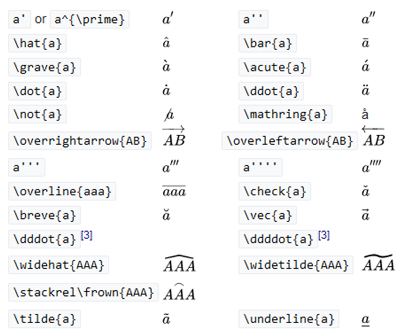

# LaTeX/Mathematics приклади

Детектор літер з переведення в латекс http://detexify.kirelabs.org/

`\cos (2\theta) = \cos^2 \theta - \sin^2 \theta` -> $\cos (2\theta) = \cos^2 \theta - \sin^2 \theta$

`\lim\limits_{x \to \infty} \exp(-x) = 0` -> $\lim\limits_{x \to \infty} \exp(-x) = 0$

`k_{n+1} = n^2 + k_n^2 - k_{n-1}` -> $k_{n+1} = n^2 + k_n^2 - k_{n-1}$

`n^{22}` -> $n^{22}$

`f(n) = n^5 + 4n^2 + 2 |_{n=17}` -> $f(n) = n^5 + 4n^2 + 2 |_{n=17}$

`\frac{n!}{k!(n-k)!} = \binom{n}{k}` -> $\frac{n!}{k!(n-k)!} = \binom{n}{k}$

`\frac{\frac{1}{x}+\frac{1}{y}}{y-z}` -> $\frac{\frac{1}{x}+\frac{1}{y}}{y-z}$

`^3/_7` -> $^3/_7$

```
\begin{equation}
  x = a_0 + \cfrac{1}{a_1 
          + \cfrac{1}{a_2 
          + \cfrac{1}{a_3 + \cfrac{1}{a_4} } } }
\end{equation}
```

$$
\begin{equation}
  x = a_0 + \cfrac{1}{a_1 
          + \cfrac{1}{a_2 
          + \cfrac{1}{a_3 + \cfrac{1}{a_4} } } }
\end{equation}
$$

```
\begin{equation}
\frac{
    \begin{array}[b]{r}
      \left( x_1 x_2 \right)\\
      \times \left( x'_1 x'_2 \right)
    \end{array}
  }{
    \left( y_1y_2y_3y_4 \right)
  }
\end{equation}
```

$$
\begin{equation}
\frac{
    \begin{array}[b]{r}
      \left( x_1 x_2 \right)\\
      \times \left( x'_1 x'_2 \right)
    \end{array}
  }{
    \left( y_1y_2y_3y_4 \right)
  }
\end{equation}
$$

`\sqrt{\frac{a}{b}}` -> $\sqrt{\frac{a}{b}}$

`\sqrt[n]{1+x+x^2+x^3+\dots+x^n}` -> $\sqrt[n]{1+x+x^2+x^3+\dots+x^n}$

`\sum_{i=1}^{10} t_i` -> $\sum_{i=1}^{10} t_i$

`\displaystyle\sum_{i=1}^{10} t_i` -> $\displaystyle\sum_{i=1}^{10} t_i$

`\int_0^\infty \mathrm{e}^{-x}\,\mathrm{d}x` ->$\int_0^\infty \mathrm{e}^{-x}\,\mathrm{d}x$

`\sum` -> $\sum$ `\prod` -> $\prod$ `\coprod` -> $\coprod$ `\bigoplus` -> $\bigoplus$ `\bigotimes` -> $\bigotimes$ `\bigcup` -> $\bigcup$ `\bigcap` -> $\bigcap$ `\bigvee` -> $\bigvee$ `\bigwedge` -> $\bigwedge$ `\bigsqcup` -> $\bigsqcup$ `\int` -> $\int$ `\iint` -> $\iint$ `\iiint` -> $\iiint$

`\iiiint` -> $\iiiint$ `\idotsint` -> $\idotsint$ `\oint` -> $\oint$ `\bigodot` -> $\bigodot$ `\biguplus` -> $\biguplus$

```
\sum_{\substack{
   0<i<m \\
   0<j<n
  }} 
 P(i,j)
```

$$
\sum_{\substack{
   0<i<m \\
   0<j<n
  }} 
 P(i,j)
$$

`\int\limits_a^b` -> $\int\limits_a^b$

```
( a ), [ b ], \{ c \}, | d |, \| e \|,
\langle f \rangle, \lfloor g \rfloor,
\lceil h \rceil, \ulcorner i \urcorner,
/ j \backslash
```

$$
( a ), [ b ], \{ c \}, | d |, \| e \|,
\langle f \rangle, \lfloor g \rfloor,
\lceil h \rceil, \ulcorner i \urcorner,
/ j \backslash
$$

`\left(\frac{x^2}{y^3}\right)` -> $\left(\frac{x^2}{y^3}\right)$

`P\left(A=2\middle|\frac{A^2}{B}>4\right)` -> $P\left(A=2\middle|\frac{A^2}{B}>4\right)$

`\left\{\frac{x^2}{y^3}\right\}` -> $\left\{\frac{x^2}{y^3}\right\}$

`\left.\frac{x^3}{3}\right|_0^1` -> $\left.\frac{x^3}{3}\right|_0^1$

`( \big( \Big( \bigg( \Bigg(` -> $( \big( \Big( \bigg( \Bigg($

`\frac{\mathrm d}{\mathrm d x} \left( k g(x) \right)` -> $\frac{\mathrm d}{\mathrm d x} \left( k g(x) \right)$

`\frac{\mathrm d}{\mathrm d x} \big( k g(x) \big)`-> $\frac{\mathrm d}{\mathrm d x} \big( k g(x) \big)$

```
\begin{matrix}
  a & b & c \\
  d & e & f \\
  g & h & i
 \end{matrix}
```

$$
\begin{matrix}
  a & b & c \\
  d & e & f \\
  g & h & i
 \end{matrix}
$$

```
\begin{matrix}
  -1 & 3 \\
  2 & -4
 \end{matrix}
 =
 \begin{matrix*}[r]
  -1 & 3 \\
  2 & -4
 \end{matrix*}
```

$$
\begin{matrix}
  -1 & 3 \\
  2 & -4
 \end{matrix}
 =
 \begin{matrix*}[r]
  -1 & 3 \\
  2 & -4
 \end{matrix*}
$$

```
A_{m,n} = 
 \begin{pmatrix}
  a_{1,1} & a_{1,2} & \cdots & a_{1,n} \\
  a_{2,1} & a_{2,2} & \cdots & a_{2,n} \\
  \vdots  & \vdots  & \ddots & \vdots  \\
  a_{m,1} & a_{m,2} & \cdots & a_{m,n} 
 \end{pmatrix}
```

$$
A_{m,n} = 
 \begin{pmatrix}
  a_{1,1} & a_{1,2} & \cdots & a_{1,n} \\
  a_{2,1} & a_{2,2} & \cdots & a_{2,n} \\
  \vdots  & \vdots  & \ddots & \vdots  \\
  a_{m,1} & a_{m,2} & \cdots & a_{m,n} 
 \end{pmatrix}
$$

```
\begin{array}{c|c}
  1 & 2 \\ 
  \hline
  3 & 4
 \end{array}
```

$$
\begin{array}{c|c}
  1 & 2 \\ 
  \hline
  3 & 4
 \end{array}
$$

```
M = \begin{bmatrix}
       \frac{5}{6} & \frac{1}{6} & 0           \\[0.3em]
       \frac{5}{6} & 0           & \frac{1}{6} \\[0.3em]
       0           & \frac{5}{6} & \frac{1}{6}
     \end{bmatrix}
```

$$
M = \begin{bmatrix}
       \frac{5}{6} & \frac{1}{6} & 0           \\[0.3em]
       \frac{5}{6} & 0           & \frac{1}{6} \\[0.3em]
       0           & \frac{5}{6} & \frac{1}{6}
     \end{bmatrix}
$$

```
50 \text{ apples} \times 100 \text{ apples}
 = \text{lots of apples}^2
```

$$
50 \text{ apples} \times 100 \text{ apples}
 = \text{lots of apples}^2
$$

```
50 \textrm{ apples} \times 100
 \textbf{ apples} = \textit{lots of apples}^2
```

$$
50 \textrm{ apples} \times 100
 \textbf{ apples} = \textit{lots of apples}^2
$$

```
\boldsymbol{\beta} = (\beta_1,\beta_2,\dotsc,\beta_n)
```

$$
\boldsymbol{\beta} = (\beta_1,\beta_2,\dotsc,\beta_n)
$$



```
k = {\color{red}x} \mathbin{\color{blue}-} 2
```

$$
k = {\color{red}x} \mathbin{\color{blue}-} 2
$$

`\pm` -> $\pm$

`\mp` -> $\mp$

```
f(n) =
  \begin{cases}
    n/2       & \quad \text{if } n \text{ is even}\\
    -(n+1)/2  & \quad \text{if } n \text{ is odd}
  \end{cases}
```

$$
f(n) =
  \begin{cases}
    n/2       & \quad \text{if } n \text{ is even}\\
    -(n+1)/2  & \quad \text{if } n \text{ is odd}
  \end{cases}
$$

`\int y\; \mathrm{d}x` -> $\int y\; \mathrm{d}x$

```
\left(
    \begin{array}{c}
      n \\
      r
    \end{array}
  \right) = \frac{n!}{r!(n-r)!}
```

$$
\left(
    \begin{array}{c}
      n \\
      r
    \end{array}
  \right) = \frac{n!}{r!(n-r)!}
$$

| Code              | Output            | Comment                                    |
| ----------------- | ----------------- | ------------------------------------------ |
| `A_1,A_2,\dotsc,` | $A_1,A_2,\dotsc,$ | for "dots with commas"                     |
| `A_1+\dotsb+A_N`  | $A_1+\dotsb+A_N$  | for "dots with binary operators/relations" |
| `A_1 \dotsm A_N`  | $A_1 \dotsm A_N$  | for "multiplication dots"                  |
| `\int_a^b \dotsi` | $\int_a^b \dotsi$ | for "dots with integrals"                  |
| `A_1\dotso A_N`   | $A_1\dotso A_N$   | for "other dots" (none of the above)       |

| Symbol        | Script        |      | Symbol        | Script        |      | Symbol    | Script    |
| ------------- | ------------- | ---- | ------------- | ------------- | ---- | --------- | --------- |
| $<$           | `<`           |      | $>$           | `>`           |      | $=$       | `=`       |
| $\leq$        | `\leq`        |      | $\geq$        | `\geq`        |      | $\doteq$  | `\doteq`  |
| $\ll$         | `\ll`         |      | $\gg$         | `\gg`         |      | $\equiv$  | `\equiv`  |
| $\subset$     | `\subset`     |      | $\supset$     | `\supset`     |      | $\approx$ | `\approx` |
| $\subseteq$   | `\subseteq`   |      | $\supseteq$   | `\supseteq`   |      | $\cong$   | `\cong`   |
| $\nsubseteq$  | `\nsubseteq`  |      | $\nsupseteq$  | `\nsupseteq`  |      | $\simeq$  | `\simeq`  |
| $\sqsubset$   | `\sqsubset`   |      | $\sqsupset$   | `\sqsupset`   |      | $\sim$    | `\sim`    |
| $\sqsubseteq$ | `\sqsubseteq` |      | $\sqsupseteq$ | `\sqsupseteq` |      | $\propto$ | `\propto` |
| $\preceq$     | `\preceq`     |      | $\succeq$     | `\succeq`     |      | $\neq$    | `\neq`    |
| $\therefore$  | `\therefore`  |      | $\because$    | `\because`    |      |           |           |

| Symbol            | Script            |      | Symbol           | Script           |
| ----------------- | ----------------- | ---- | ---------------- | ---------------- |
| $\parallel$       | `\parallel`       |      | $\nparallel$     | `\nparallel`     |
| $\asymp$          | `\asymp`          |      | $\bowtie$        | `\bowtie`        |
| $\vdash$          | `\vdash`          |      | $\dashv$         | `\dashv`         |
| $\in$             | `\in`             |      | $\ni$            | `\ni`            |
| $\smile$          | `\smile`          |      | $\frown$         | `\frown`         |
| $\models$         | `\models`         |      | $\notin$         | `\notin`         |
| $\perp$           | `\perp`           |      | $\mid$           | `\mid`           |
| $\prec$           | `\prec`           |      | $\succ$          | `\succ`          |
| $\sphericalangle$ | `\sphericalangle` |      | $\measuredangle$ | `\measuredangle` |
|                   |                   |      |                  |                  |

| Sym        | Script     |      | Sym      | Script   |      | Sym                | Script             |      | Sym         | Script      |
| ---------- | ---------- | ---- | -------- | -------- | ---- | ------------------ | ------------------ | ---- | ----------- | ----------- |
| $\pm$      | `\pm`      |      | $\cap$   | `\cap`   |      | $\diamond$         | `\diamond`         |      | $\oplus$    | `\oplus`    |
| $\mp$      | `\mp`      |      | $\cup$   | `\cup`   |      | $\bigtriangleup$   | `\bigtriangleup`   |      | $\ominus$   | `\ominus`   |
| $\times$   | `\times`   |      | $\uplus$ | `\uplus` |      | $\bigtriangledown$ | `\bigtriangledown` |      | $\otimes$   | `\otimes`   |
| $\div$     | `\div`     |      | $\sqcap$ | `\sqcap` |      | $\triangleleft$    | `\triangleleft`    |      | $\oslash$   | `\oslash`   |
| $\ast$     | `\ast`     |      | $\sqcup$ | `\sqcup` |      | $\triangleright$   | `\triangleright`   |      | $\odot$     | `\odot`     |
| $\star$    | `\star`    |      | $\vee$   | `\vee`   |      | $\bigcirc$         | `\bigcirc`         |      | $\circ$     | `\circ`     |
| $\dagger$  | `\dagger`  |      | $\wedge$ | `\wedge` |      | $\bullet$          | `\bullet`          |      | $\setminus$ | `\setminus` |
| $\ddagger$ | `\ddagger` |      | $\cdot$  | `\cdot`  |      | $\wr$              | `\wr`              |      | $\amalg$    | `\amalg`    |

| Symbol     | Script     |      | Symbol               | Script                                                       |
| ---------- | ---------- | ---- | -------------------- | ------------------------------------------------------------ |
| $\exists$  | `\exists`  |      | $\to$                | `\rightarrow` or `\to`                                       |
| $\nexists$ | `\nexists` |      | $\gets$              | `\leftarrow` or `\gets`                                      |
| $\forall$  | `\forall`  |      | $\mapsto$            | `\mapsto`                                                    |
| $\neg$     | `\neg`     |      | $\implies$           | `\implies`                                                   |
| $\cap$     | `\cap`     |      |                      |                                                              |
| $\cup$     | `\cup`     |      | $\rightleftharpoons$ | `\rightleftharpoons`                                         |
| $\subset$  | `\subset`  |      | $\impliedby$         | `\impliedby`                                                 |
| $\supset$  | `\supset`  |      | $\implies$           | `\Rightarrow` or `\implies`                                  |
| $\in$      | `\in`      |      | $\leftrightarrow$    | `\leftrightarrow`                                            |
| $\notin$   | `\notin`   |      | $\iff$               | `\iff`                                                       |
| $\ni$      | `\ni`      |      | $\Leftrightarrow$    | `\Leftrightarrow` (preferred for equivalence (iff))          |
| $\land$    | `\land`    |      | $\top$               | `\top`                                                       |
| $\lor$     | `\lor`     |      | $\bot$               | `\bot`                                                       |
| $\angle$   | `\angle`   |      | $\emptyset$          | `\emptyset` and `\varnothing`[[1\]](https://en.wikibooks.org/wiki/LaTeX/Mathematics#endnote_symbolpackage) |

| Sym          | Script                                | Sym          | Script       | Sym       | Script    | Sym       | Script    |
| ------------ | ------------------------------------- | ------------ | ------------ | --------- | --------- | --------- | --------- |
| $\mid$       | `|` or `\mid` (difference in spacing) | $\|$         |              |           |           |           |           |
| $\{$         | `\{`                                  | $\}$         | `\}`         | $\langle$ | `\langle` | $\rangle$ | `\rangle` |
| $\uparrow$   | `\uparrow`                            | $\Uparrow$   | `\Uparrow`   | $\lceil$  | `\lceil`  | $\rceil$  | `\rceil`  |
| $\downarrow$ | `\downarrow`                          | $\Downarrow$ | `\Downarrow` | $\lfloor$ | `\lfloor` | $\rfloor$ | `\rfloor` |

Примітка. Щоб використовувати грецькі літери в LaTeX, які мають такий самий вигляд у латинському алфавіті, просто використовуйте латини: наприклад, A замість Alpha, B замість Beta тощо.

| Sym           | Script                             |      | Sym        | Script                             |
| ------------- | ---------------------------------- | ---- | ---------- | ---------------------------------- |
| $\alpha$      | `A` and `\alpha`                   |      | $\nu$      | `N` and `\nu`                      |
| $\beta$       | `B` and `\beta`                    |      | $\xi$      | `\Xi` and `\xi`                    |
| $\gamma$      | `\Gamma` and `\gamma`              |      | $o$        | `O` and `o`                        |
| $\delta$      | `\Delta` and `\delta`              |      | $\pi$      | `\Pi`, `\pi` and `\varpi`          |
| $\varepsilon$ | `E`, `\epsilon` and `\varepsilon`  |      | $\rho$     | `P`, `\rho` and `\varrho`          |
| $\zeta$       | `Z` and `\zeta`                    |      | $\sigma$   | `\Sigma`, `\sigma` and `\varsigma` |
| $\eta$        | `H` and `\eta`                     |      | $\tau$     | `T` and `\tau`                     |
| $\theta$      | `\Theta`, `\theta` and `\vartheta` |      | $\upsilon$ | `\Upsilon` and `\upsilon`          |
| $\iota$       | `I` and `\iota`                    |      | $\phi$     | `\Phi`, `\phi` and `\varphi`       |
| $\kappa$      | `K`, `\kappa` and `\varkappa`      |      | $\chi$     | `X` and `\chi`                     |
| $\lambda$     | `\Lambda` and `\lambda`            |      | $\psi$     | `\Psi` and `\psi`                  |
| $\mu$         | `M` and `\mu`                      |      | $\omega$   | `\Omega` and `\omega`              |

| Sym        | Script     |      | Sym      | Script   |      | Sym   | Script |
| ---------- | ---------- | ---- | -------- | -------- | ---- | ----- | ------ |
| $\partial$ | `\partial` |      | $\imath$ | `\imath` |      | $\Re$ | `\Re`  |
| $\eth$     | `\eth`     |      | $\jmath$ | `\jmath` |      | $\Im$ | `\Im`  |
| $\hbar$    | `\hbar`    |      | $\ell$   | `\ell`   |      | $\wp$ | `\wp`  |

| Sym      | Script   |      | Sym      | Script   |
| -------- | -------- | ---- | -------- | -------- |
| $\nabla$ | `\nabla` |      | $\aleph$ | `\aleph` |
| $\Box$   | `\Box`   |      | $\beth$  | `\beth`  |
| $\infty$ | `\infty` |      | $\gimel$ | `\gimel` |

| Sym    | Script |      | Sym       | Script    |      | Sym     | Script  |      | Sym    | Script |
| ------ | ------ | ---- | --------- | --------- | ---- | ------- | ------- | ---- | ------ | ------ |
| $\sin$ | `\sin` |      | $\arcsin$ | `\arcsin` |      | $\sinh$ | `\sinh` |      | $\sec$ | `\sec` |
| $\cos$ | `\cos` |      | $\arccos$ | `\arccos` |      | $\cosh$ | `\cosh` |      | $\csc$ | `\csc` |
| $\tan$ | `\tan` |      | $\arctan$ | `\arctan` |      | $\tanh$ | `\tanh` |      |        |        |
| $\cot$ | `\cot` |      | $\arccot$ | `\arccot` |      | $\coth$ | `\coth` |      |        |        |

