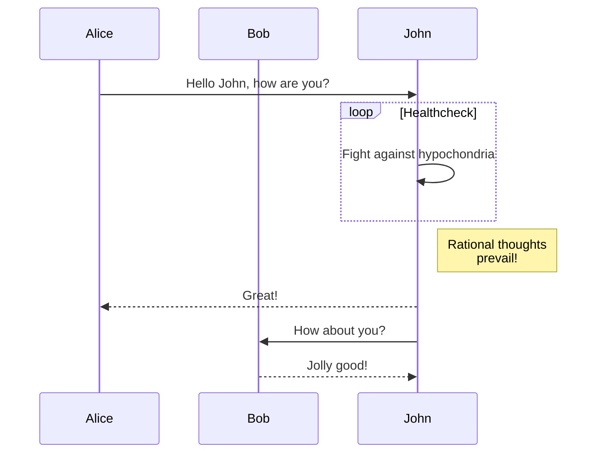
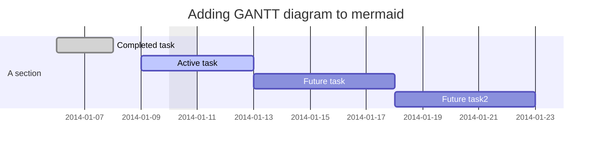
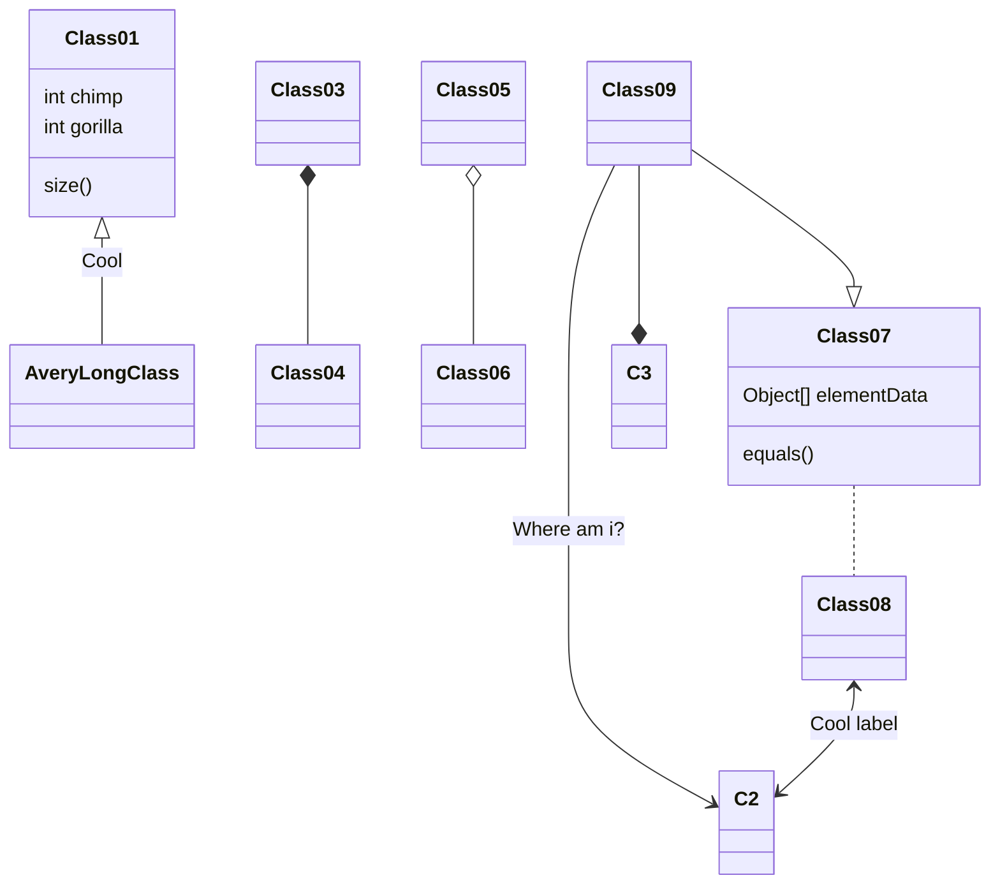
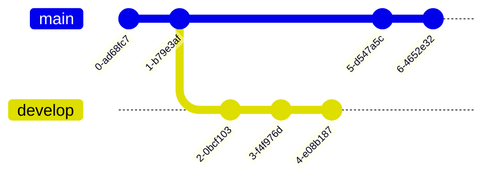
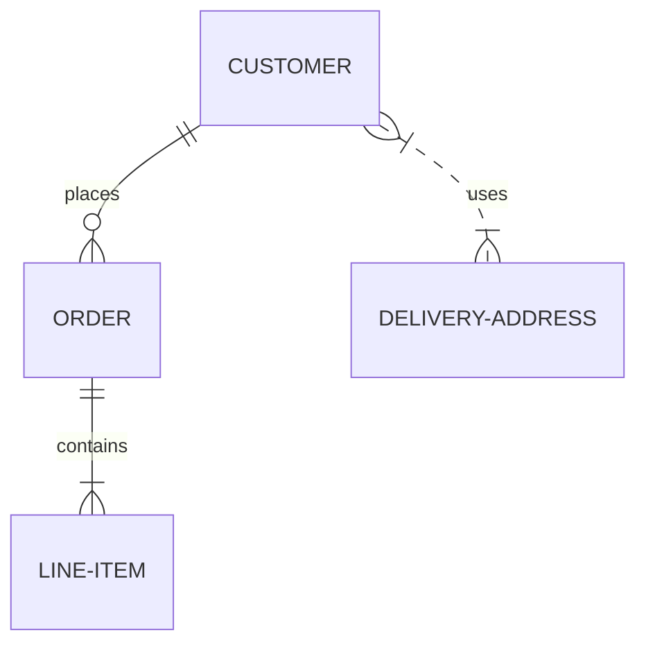
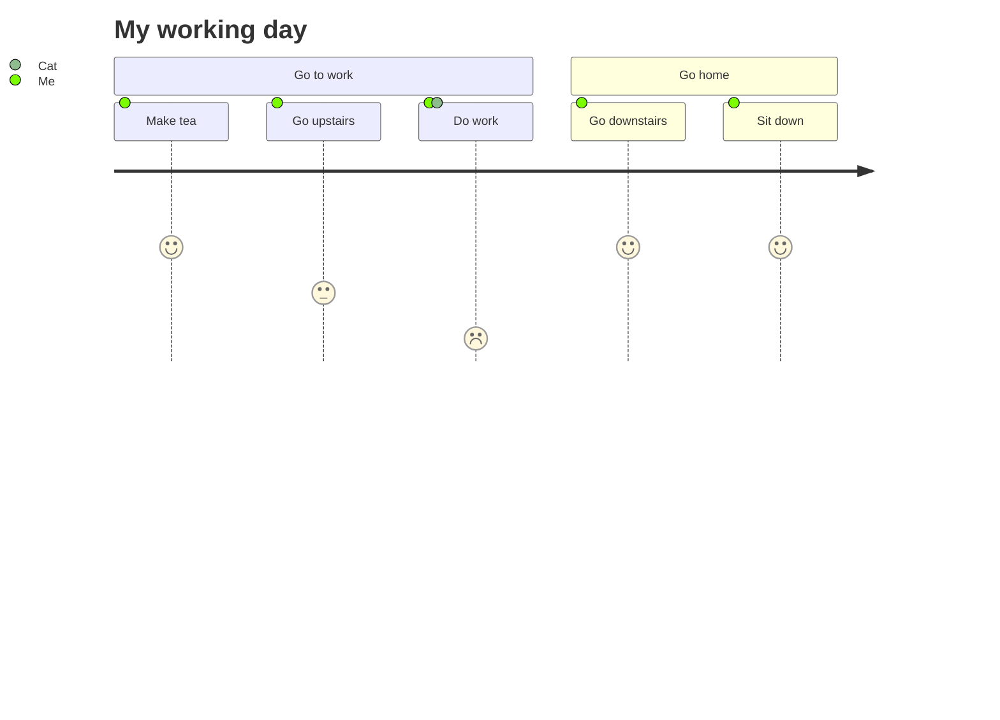

# Mermaid

https://mermaid.js.org

Це інструмент для створення схем і діаграм на основі JavaScript, який відтворює текстові означення на основі Markdown для динамічного створення та зміни діаграм. Синтаксис наведений  [за посиланням](https://mermaid.js.org/intro/n00b-syntaxReference.html).


[](https://github.com/mermaid-js/mermaid/actions/workflows/build.yml) [](https://www.npmjs.com/package/mermaid) [](https://bundlephobia.com/package/mermaid) [](https://coveralls.io/github/mermaid-js/mermaid?branch=master) [](https://www.jsdelivr.com/package/npm/mermaid) [](https://www.npmjs.com/package/mermaid) [](https://join.slack.com/t/mermaid-talk/shared_invite/enQtNzc4NDIyNzk4OTAyLWVhYjQxOTI2OTg4YmE1ZmJkY2Y4MTU3ODliYmIwOTY3NDJlYjA0YjIyZTdkMDMyZTUwOGI0NjEzYmEwODcwOTE) [](https://twitter.com/mermaidjs_)

[](https://mermaid-js.github.io/mermaid/landing/)

Mermaid — це інструмент для створення схем і діаграм на основі JavaScript, який використовує текстові означення на основі Markdown і засіб візуалізації для створення та зміни складних діаграм. Для того щоб відобразити діаграму в Mermaid використовується блок коду, тобто з обох боків береться в \`\`\`, з позначенням мови `Mermaid`

## Діаграми

Mermaid підтримує кілька типів діаграм. Нижче наведені приклади. 

#### [Flowchart](https://mermaid.js.org/syntax/flowchart.html?id=flowcharts-basic-syntax) 

```
graph TD;
    A-->B;
    A-->C;
    B-->D;
    C-->D
```


#### [Sequence diagram](https://mermaid.js.org/syntax/sequenceDiagram.html) 

```
sequenceDiagram
    participant Alice
    participant Bob
    Alice->>John: Hello John, how are you?
    loop Healthcheck
        John->>John: Fight against hypochondria
    end
    Note right of John: Rational thoughts <br/>prevail!
    John-->>Alice: Great!
    John->>Bob: How about you?
    Bob-->>John: Jolly good!
```




#### [Gantt diagram](https://mermaid.js.org/syntax/gantt.html) 

```
gantt
dateFormat  YYYY-MM-DD
title Adding GANTT diagram to mermaid
excludes weekdays 2014-01-10

section A section
Completed task            :done,    des1, 2014-01-06,2014-01-08
Active task               :active,  des2, 2014-01-09, 3d
Future task               :         des3, after des2, 5d
Future task2               :         des4, after des3, 5d
```



#### [Class diagram](https://mermaid.js.org/syntax/classDiagram.html) 

```
classDiagram
Class01 <|-- AveryLongClass : Cool
Class03 *-- Class04
Class05 o-- Class06
Class07 .. Class08
Class09 --> C2 : Where am i?
Class09 --* C3
Class09 --|> Class07
Class07 : equals()
Class07 : Object[] elementData
Class01 : size()
Class01 : int chimp
Class01 : int gorilla
Class08 <--> C2: Cool label
```



#### [Git graph](https://mermaid.js.org/syntax/gitgraph.html) 

```
    gitGraph
       commit
       commit
       branch develop
       commit
       commit
       commit
       checkout main
       commit
       commit
```



#### [Entity Relationship Diagram](https://mermaid.js.org/syntax/entityRelationshipDiagram.html) 

```
erDiagram
    CUSTOMER ||--o{ ORDER : places
    ORDER ||--|{ LINE-ITEM : contains
    CUSTOMER }|..|{ DELIVERY-ADDRESS : uses
```



#### [User Journey Diagram](https://mermaid.js.org/syntax/userJourney.html) 

```
journey
    title My working day
    section Go to work
      Make tea: 5: Me
      Go upstairs: 3: Me
      Do work: 1: Me, Cat
    section Go home
      Go downstairs: 5: Me
      Sit down: 5: Me
```



