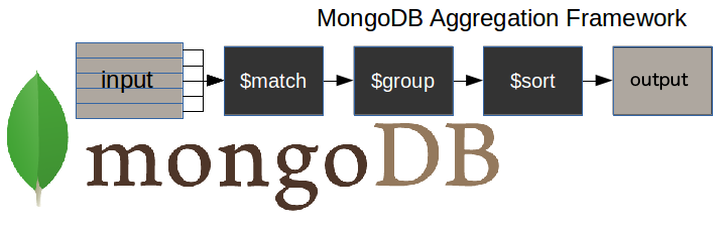
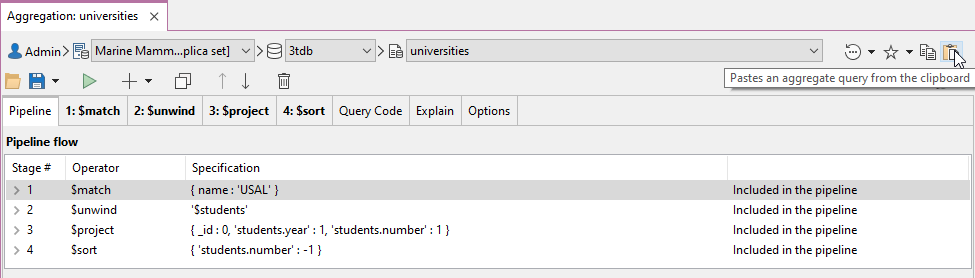
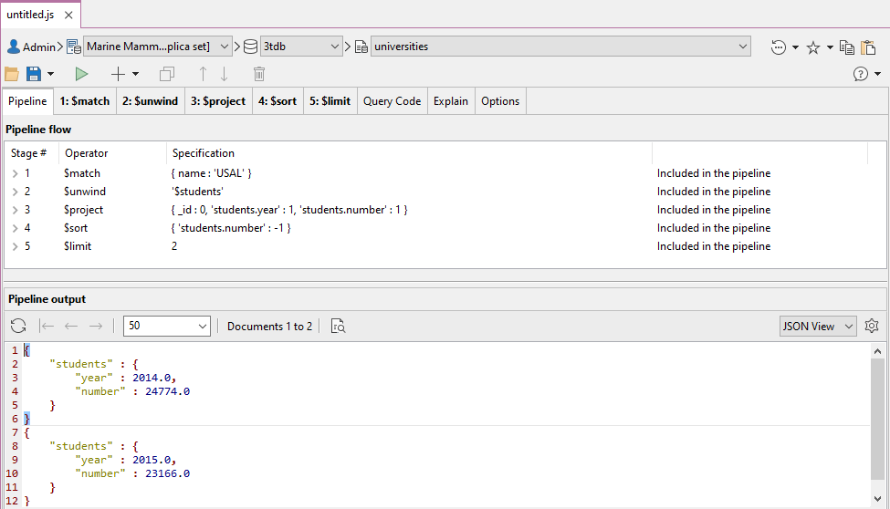
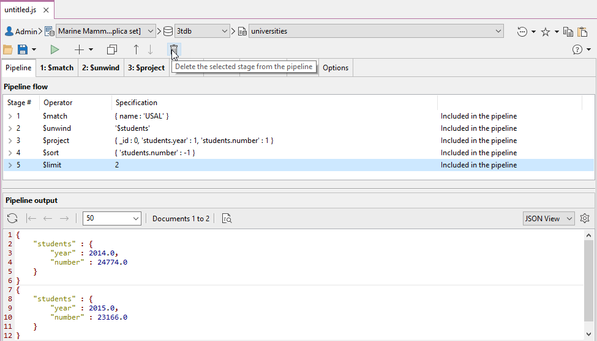
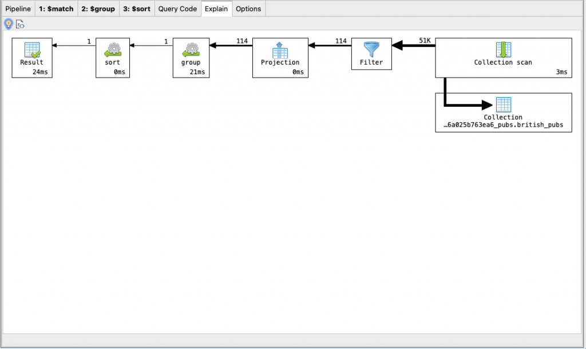

# Посібник для початківців з агрегації MongoDB (з вправами)

https://studio3t.com/knowledge-base/articles/mongodb-aggregation-framework/

Коли ви починаєте працювати з MongoDB, ви зазвичай використовуєте команду `find()` для широкого діапазону запитів. Однак, як тільки ваші запити стануть більш просунутими, вам знадобиться більше знати про агрегацію MongoDB.

У цій статті я поясню основні принципи побудови сукупних запитів у MongoDB і як скористатися перевагами індексів для їх прискорення.

Крім того, я познайомлю з найважливішими етапами конвеєра агрегації з короткими прикладами використання кожного з них і те, як їх застосувати до конвеєра.

## Що таке агрегація в MongoDB?

**Агрегація** — це спосіб обробки великої кількості документів у колекції шляхом проходження їх через різні етапи. Етапи складають те, що називається конвеєром. Етапи в конвеєрі можуть фільтрувати, сортувати, групувати, змінювати форму та змінювати документи, які проходять через конвеєр.

Одним із найпоширеніших випадків використання агрегації є обчислення сукупних значень для груп документів. Це схоже на базове агрегування, доступне в SQL, з пропозицією GROUP BY і функціями COUNT, SUM і AVG. Агрегація MongoDB йде далі і може також виконувати реляційні об’єднання, змінювати форму документів, створювати нові та оновлювати існуючі колекції тощо.

Незважаючи на те, що в MongoDB існують інші методи отримання зведених даних, рекомендованим підходом для більшості робіт є структура агрегування.

Існують так звані **одноцільові методи**, як-от `estimatedDocumentCount()`, `count()` і `distinct()`, які додаються до запиту `find()`, що робить їх швидкими у використанні, але обмеженими в сфера застосування.

**Map-reduce framework** на MongoDB є попередником aggregation framework та набагато складнішим у використанні. І в MongoDB є застарілою

## Як працює конвеєр агрегації MongoDB?

Ось діаграма для ілюстрації типового конвеєра агрегації MongoDB.



- Етап `$match` – фільтрує ті документи, з якими нам потрібно працювати, ті, які відповідають нашим потребам
- Етап `$group` – виконує роботу агрегації
- Етап `$sort` – сортує отримані документи так, як нам потрібно (за зростанням або спаданням)

Вхідними даними конвеєра може бути одна колекція, де інші можуть бути об’єднані пізніше по конвеєру.

Потім конвеєр виконує послідовні перетворення даних, доки наша мета не буде досягнута.

Таким чином ми можемо розбити складний запит на простіші етапи, на кожному з яких виконуємо різні операції з даними. Отже, до кінця конвеєра запитів ми досягнемо всього, чого хотіли.

Цей підхід дозволяє нам перевірити, чи правильно функціонує наш запит на кожному етапі, досліджуючи як його вхідні, так і вихідні дані. Вихід кожного етапу буде входом наступного**.**

Такі інструменти, як Studio 3T, дозволяють [перевіряти вхідні та вихідні дані етапу](https://studio3t.com/knowledge-base/articles/build-mongodb-aggregation-queries/#check-stage-inputs) під час створення запиту на агрегацію.

[Завантажте Studio 3T Free](https://studio3t.com/download/) для Mac, Windows або Linux!

Немає обмежень щодо кількості етапів, які використовуються в запиті, або того, як ми їх поєднуємо.

Щоб досягти оптимальної продуктивності запитів, необхідно взяти до уваги ряд найкращих практик. До них ми прийдемо далі в статті.

## Синтаксис агрегатного конвеєра MongoDB

Ось приклад створення агрегаційного запиту:

`db.*collectionName*.aggregate(*pipeline*, *options*)`,

- де *collectionName* – назва колекції,
- *pipeline* – це масив, який містить етапи агрегації,
- *options* – необов’язкові параметри для агрегації

Це приклад синтаксису конвеєра агрегації:

```json
pipeline = [
        { $match : { … } },
        { $group : { … } },
        { $sort : { … } }
       ]
```

## Обмеження етапу агрегації MongoDB

Агрегація працює в пам'яті. Кожен етап може використовувати до 100 МБ оперативної пам'яті. Ви отримаєте повідомлення про помилку з бази даних, якщо ви перевищите це обмеження.

Якщо це стане неминучою проблемою, ви можете вибрати сторінку на диск, з єдиним недоліком, що ви чекатимете трохи довше, оскільки це повільніше працювати на диску, ніж у пам’яті. Щоб вибрати метод сторінки на диск, вам просто потрібно встановити для параметра `allowDiskUse` значення true, як це:

```json
db.collectionName.aggregate(pipeline, { allowDiskUse : true })
```

Зауважте, що ця опція не завжди доступна для спільних служб. Наприклад, кластери Atlas M0, M2 і M5 вимикають цю опцію.

Документи, повернуті запитом на агрегацію, або як курсор, або збережені через [`$out`](https://studio3t.com/knowledge-base/articles/mongodb-out-aggregation-stage/) в іншій колекції, є обмежено 16 Мб. Тобто вони не можуть перевищувати максимальний розмір документа MongoDB.

Якщо ви, ймовірно, перевищите цей ліміт, тоді вам слід вказати, що результат агрегаційного запиту буде як курсор, а не як документ.

## Наші дані використовуються для прикладів агрегування MongoDB

Я покажу приклади агрегатів MongoDB для найважливіших етапів конвеєра.

Для ілюстрації прикладів я буду використовувати дві колекції. Перший називається `universities` і складається з таких документів (дані нереальні):

```json
{
  country : 'Spain',
  city : 'Salamanca',
  name : 'USAL',
  location : {
    type : 'Point',
    coordinates : [ -5.6722512,17, 40.9607792 ]
  },
  students : [
    { year : 2014, number : 24774 },
    { year : 2015, number : 23166 },
    { year : 2016, number : 21913 },
    { year : 2017, number : 21715 }
  ]
}
{
  country : 'Spain',
  city : 'Salamanca',
  name : 'UPSA',
  location : {
    type : 'Point',
    coordinates : [ -5.6691191,17, 40.9631732 ]
  },
  students : [
    { year : 2014, number : 4788 },
    { year : 2015, number : 4821 },
    { year : 2016, number : 6550 },
    { year : 2017, number : 6125 }
  ]
}
```

Якщо ви хочете перевірити ці приклади на власній установці, ви можете вставити їх за допомогою масової команди нижче або [імпортувати як файл JSON](https://studio3t.com/knowledge-base/articles/mongodb-import -json-csv-bson/#import-json-to-mongodb):

```json
use 3tdb
db.universities.insert([
{
  country : 'Spain',
  city : 'Salamanca',
  name : 'USAL',
  location : {
    type : 'Point',
    coordinates : [ -5.6722512,17, 40.9607792 ]
  },
  students : [
    { year : 2014, number : 24774 },
    { year : 2015, number : 23166 },
    { year : 2016, number : 21913 },
    { year : 2017, number : 21715 }
  ]
},
{
  country : 'Spain',
  city : 'Salamanca',
  name : 'UPSA',
  location : {
    type : 'Point',
    coordinates : [ -5.6691191,17, 40.9631732 ]
  },
  students : [
    { year : 2014, number : 4788 },
    { year : 2015, number : 4821 },
    { year : 2016, number : 6550 },
    { year : 2017, number : 6125 }
  ]
}
])
```

Друга і остання колекція називається `'courses'` і виглядає так:

```json
{
  university : 'USAL',
  name : 'Computer Science',
  level : 'Excellent'
}
{
  university : 'USAL',
  name : 'Electronics',
  level : 'Intermediate'
}
{
  university : 'USAL',
  name : 'Communication',
  level : 'Excellent'
}
```

Знову ж таки, ви можете вставити їх таким же чином, використовуючи наступний код або імпортувавши як файл JSON:

```json
db.courses.insert([
{
  university : 'USAL',
  name : 'Computer Science',
  level : 'Excellent'
},
{
  university : 'USAL',
  name : 'Electronics',
  level : 'Intermediate'
},
{
  university : 'USAL',
  name : 'Communication',
  level : 'Excellent'
}
])
```

[Перейдіть до розділу вкладень у кінці цієї статті](https://studio3t.com/knowledge-base/articles/mongodb-aggregation-framework/#conclusion), де ви знайдете файли JSON, доступні для завантаження.

## MongoDB aggregate examples

### [MongoDB $match](https://studio3t.com/knowledge-base/articles/mongodb-aggregation-framework/#mongodb-match)

Етап `$match` дозволяє нам вибрати лише ті документи з колекції, з якими ми хочемо працювати. Це робиться шляхом фільтрації тих, які не відповідають нашим вимогам.

У наступному прикладі ми хочемо працювати лише з тими документами, у яких зазначено, що `Spain` — це значення поля `country`, а `Salamanca` — це значення поля `city`.

Щоб отримати зрозумілий результат, я додам [`.pretty()`](https://docs.mongodb.com/manual/reference/method/cursor.pretty/) у кінці всіх команд .

```json
db.universities.aggregate([
  { $match : { country : 'Spain', city : 'Salamanca' } }
]).pretty()
```

Вихід є…

```json
{
"_id" : ObjectId("5b7d9d9efbc9884f689cdba9"),
"country" : "Spain","city" : "Salamanca",
"name" : "USAL",
"location" : {
      "type" : "Point",
      "coordinates" : [
            -5.6722512,
             17,
             40.9607792
       ]
},
"students" : [
		{
			"year" : 2014,
			"number" : 24774
		},
		{
			"year" : 2015,
			"number" : 23166
		},
		{
			"year" : 2016,
			"number" : 21913
		},
		{
			"year" : 2017,
			"number" : 21715
		}
	]
}
{
	"_id" : ObjectId("5b7d9d9efbc9884f689cdbaa"),
	"country" : "Spain",
	"city" : "Salamanca",
	"name" : "UPSA",
	"location" : {
		"type" : "Point",
		"coordinates" : [
			-5.6691191,
			17,
			40.9631732
		]
	},
	"students" : [
		{
			"year" : 2014,
			"number" : 4788
		},
		{
			"year" : 2015,
			"number" : 4821
		},
		{
			"year" : 2016,
			"number" : 6550
		},
		{
			"year" : 2017,
			"number" : 6125
		}
	]
}
```

### [MongoDB $project](https://studio3t.com/knowledge-base/articles/mongodb-aggregation-framework/#mongodb-project)

Рідко коли потрібно отримати всі поля в документах. Рекомендується повертати лише ті поля, які вам потрібні, щоб уникнути обробки більшої кількості даних, ніж необхідно.

Етап `$project` використовується для цього та додавання будь-яких обчислюваних полів, які вам потрібні.

У цьому прикладі нам потрібні лише поля `country`, `city` і `name`.

У наведеному нижче коді зауважте, що:

- Ми повинні явно написати `_id : 0`, коли це поле не є обов’язковим
- Окрім поля `_id`, достатньо вказати лише ті поля, які нам потрібно отримати в результаті запиту

Цей етап…

```json
db.universities.aggregate([
  { $project : { _id : 0, country : 1, city : 1, name : 1 } }
]).pretty()
```

..will give the result …

```json
{ "country" : "Spain", "city" : "Salamanca", "name" : "USAL" }
{ "country" : "Spain", "city" : "Salamanca", "name" : "UPSA" }
```

Ось ще один [приклад $проекту MongoDB](https://studio3t.com/knowledge-base/articles/mongodb-project-aggregation-stage/).

### [MongoDB $group](https://studio3t.com/knowledge-base/articles/mongodb-aggregation-framework/#mongodb-group)

За допомогою етапу `$group` ми можемо виконувати всі необхідні нам агрегаційні або підсумкові запити, такі як пошук підрахунків, підсумків, середніх чи максимумів.

У цьому прикладі ми хочемо знати кількість документів на університет у нашій колекції «університетів»:

Запит…

```json
db.universities.aggregate([
  { $group : { _id : '$name', totaldocs : { $sum : 1 } } }
]).pretty()
```

..приведе до такого результату...

```json
{ "_id" : "UPSA", "totaldocs" : 1 }
{ "_id" : "USAL", "totaldocs" : 1 }
```

#### [MongoDB $group aggregation operators](https://studio3t.com/knowledge-base/articles/mongodb-aggregation-framework/#mongodb-aggregation-operators)

Етап $group підтримує певні вирази (оператори), які дозволяють користувачам виконувати арифметичні, масивні, логічні та інші операції як частину конвеєра агрегації.

| **Operator** | **Meaning**                                                  |
| ------------ | ------------------------------------------------------------ |
| $count       | Calculates the quantity of documents in the given group.     |
| $max         | Displays the maximum value of a document’s field in the collection. |
| $min         | Displays the minimum value of a document’s field in the collection. |
| $avg         | Displays the average value of a document’s field in the collection. |
| $sum         | Sums up the specified values of all documents in the collection. |
| $push        | Adds extra values into the array of the resulting document.  |

Перегляньте, щоб побачити інші [оператори MongoDB](https://studio3t.com/knowledge-base/articles/mongodb-aggregation-operators-stages/)[ ](https://docs.mongodb.com/manual/reference/ operator/aggregation/) і дізнайтеся більше про цю тему.

### [MongoDB $out](https://studio3t.com/knowledge-base/articles/mongodb-aggregation-framework/#mongodb-out)

Це незвичайний тип стадії, оскільки він дозволяє вам переносити результати вашого агрегування до нової колекції або до існуючої після її видалення або навіть додавання їх до існуючих документів (нове у версії 4.1.2).

Етап `$out` має бути останнім етапом конвеєра.

Вперше ми використовуємо агрегацію з більш ніж одним етапом. Тепер у нас є два: `$group` і `$out`:

```json
db.universities.aggregate([
  { $group : { _id : '$name', totaldocs : { $sum : 1 } } },
  { $out : 'aggResults' }
])
```

Тепер ми перевіряємо вміст нової колекції ‘`aggResults`’:

```json
db.aggResults.find().pretty()
{ "_id" : "UPSA", "totaldocs" : 1 }
{ "_id" : "USAL", "totaldocs" : 1 }
>
```

Ось як ми використали [стадію $out](https://studio3t.com/knowledge-base/articles/mongodb-out-aggregation-stage/) у цьому прикладі з трьох частин.

Тепер ми створили багатоетапну агрегацію, і ми можемо продовжити створення конвеєра.

### [MongoDB $unwind](https://studio3t.com/knowledge-base/articles/mongodb-aggregation-framework/#mongodb-unwind)

Етап `$unwind` у MongoDB зазвичай зустрічається в конвеєрі, оскільки він є засобом досягнення мети.

Ви не можете працювати безпосередньо з елементами масиву в документі з такими етапами, як `$group`. Етап `$unwind` дозволяє нам працювати зі значеннями полів у масиві.

Якщо у вхідних документах є поле масиву, інколи потрібно вивести документ кілька разів, по одному для кожного елемента цього масиву.

У кожній копії документа поле масиву замінено наступним елементом.

У наступному прикладі я збираюся застосувати етап лише до документа, поле `name` якого містить значення `USAL`.

Це документ:

```json
{
  country : 'Spain',
  city : 'Salamanca',
  name : 'USAL',
  location : {
    type : 'Point',
    coordinates : [ -5.6722512,17, 40.9607792 ]
  },
  students : [
    { year : 2014, number : 24774 },
    { year : 2015, number : 23166 },
    { year : 2016, number : 21913 },
    { year : 2017, number : 21715 }
  ]
}
```

Тепер ми застосовуємо етап `$unwind` до масиву студента та перевіряємо, чи отримуємо документ для кожного елемента масиву.

Перший документ складається з полів у першому елементі масиву та решти загальних полів.

Другий документ складається з полів у другому елементі масиву та решти загальних полів і так далі.

```json
db.universities.aggregate([
  { $match : { name : 'USAL' } },
  { $unwind : '$students' }
]).pretty()
{
	"_id" : ObjectId("5b7d9d9efbc9884f689cdba9"),
	"country" : "Spain",
	"city" : "Salamanca",
	"name" : "USAL",
	"location" : {
		"type" : "Point",
		"coordinates" : [
			-5.6722512,
			17,
			40.9607792
		]
	},
	"students" : {
		"year" : 2014,
		"number" : 24774
	}
}
{
	"_id" : ObjectId("5b7d9d9efbc9884f689cdba9"),
	"country" : "Spain",
	"city" : "Salamanca",
	"name" : "USAL",
	"location" : {
		"type" : "Point",
		"coordinates" : [
			-5.6722512,
			17,
			40.9607792
		]
	},
	"students" : {
		"year" : 2015,
		"number" : 23166
	}
}
{
	"_id" : ObjectId("5b7d9d9efbc9884f689cdba9"),
	"country" : "Spain",
	"city" : "Salamanca",
	"name" : "USAL",
	"location" : {
		"type" : "Point",
		"coordinates" : [
			-5.6722512,
			17,
			40.9607792
		]
	},
	"students" : {
		"year" : 2016,
		"number" : 21913
	}
}
{
	"_id" : ObjectId("5b7d9d9efbc9884f689cdba9"),
	"country" : "Spain",
	"city" : "Salamanca",
	"name" : "USAL",
	"location" : {
		"type" : "Point",
		"coordinates" : [
			-5.6722512,
			17,
			40.9607792
		]
	},
	"students" : {
		"year" : 2017,
		"number" : 21715
	}
}
```

### [MongoDB $sort](https://studio3t.com/knowledge-base/articles/mongodb-aggregation-framework/#mongodb-sort)

Вам потрібен етап `$sort`, щоб сортувати результати за значенням певного поля.

Наприклад, відсортуємо документи, отримані в результаті етапу `$unwind`, за кількістю студентів у порядку спадання.

Щоб отримати менший результат, я буду проектувати лише рік і кількість студентів.

```json
db.universities.aggregate([
  { $match : { name : 'USAL' } },
  { $unwind : '$students' },
  { $project : { _id : 0, 'students.year' : 1, 'students.number' : 1 } },
  { $sort : { 'students.number' : -1 } }
]).pretty()
```

Це дає результат…

```json
{ "students" : { "year" : 2014, "number" : 24774 } }
{ "students" : { "year" : 2015, "number" : 23166 } }
{ "students" : { "year" : 2016, "number" : 21913 } }
{ "students" : { "year" : 2017, "number" : 21715 } }
```

Етап `$sort` можна використовувати з іншими етапами, щоб [зменшити дані в колекції MongoDB саме до того, що вам потрібно](https://studio3t.com/knowledge-base/articles/clean-up-mongodb-data- aggregation-regex/).

### [MongoDB $limit](https://studio3t.com/knowledge-base/articles/mongodb-aggregation-framework/#mongodb-limit)

Що робити, якщо вас цікавлять лише перші два результати вашого запиту? Це так просто:

```json
db.universities.aggregate([
  { $match : { name : 'USAL' } },
  { $unwind : '$students' },
  { $project : { _id : 0, 'students.year' : 1, 'students.number' : 1 } },
  { $sort : { 'students.number' : -1 } },
  { $limit : 2 }
]).pretty()
{ "students" : { "year" : 2014, "number" : 24774 } }
{ "students" : { "year" : 2015, "number" : 23166 } }
```

Зауважте, що коли вам потрібно обмежити кількість відсортованих документів, ви повинні використовувати етап `$limit` одразу **після** `$sort`.

Тепер ми маємо повний конвеєр.

Ми можемо вставити весь цей агрегатний запит MongoDB і всі його етапи прямо в [Редактор агрегації в Studio 3T](https://studio3t.com/mongodb-tools/#featureAggregationEditor).

Він вставляється шляхом копіювання та натискання кнопки вставки коду, як показано.



Дізнайтеся більше про редактор агрегації, [поетапний конструктор запитів агрегації MongoDB](https://studio3t.com/knowledge-base/articles/build-mongodb-aggregation-queries/) від Studio 3T.

Скопійовано та вставлено лише показану нижче частину

```json
db.universities.aggregate([
  { $match : { name : 'USAL' } },
  { $unwind : '$students' },
  { $project : { _id : 0, 'students.year' : 1, 'students.number' : 1 } },
  { $sort : { 'students.number' : -1 } }
])
```

На наступному скріншоті ми бачимо повний конвеєр у Studio 3T та його вихід.



Видалити етапи в Studio 3T можна легко за допомогою кнопки, показаної на наступному знімку екрана.



Редактор агрегації Studio 3T підтримує [ці оператори та етапи агрегації MongoDB](https://studio3t.com/knowledge-base/articles/mongodb-aggregation-operators-stages/).

### [$addFields](https://studio3t.com/knowledge-base/articles/mongodb-aggregation-framework/#addfields)

Можливо, вам знадобиться внести деякі зміни у вихідні дані щодо нових полів. У наступному прикладі ми хочемо додати рік заснування університету.

```json
db.universities.aggregate([
  { $match : { name : 'USAL' } },
  { $addFields : { foundation_year : 1218 } }
]).pretty()
```

Це дає результат…

```json
{
	"_id" : ObjectId("5b7d9d9efbc9884f689cdba9"),
	"country" : "Spain",
	"city" : "Salamanca",
	"name" : "USAL",
	"location" : {
		"type" : "Point",
		"coordinates" : [
			-5.6722512,
			17,
			40.9607792
		]
	},
	"students" : [
		{
			"year" : 2014,
			"number" : 24774
		},
		{
			"year" : 2015,
			"number" : 23166
		},
		{
			"year" : 2016,
			"number" : 21913
		},
		{
			"year" : 2017,
			"number" : 21715
		}
	],
	"foundation_year" : 1218
}
```

### [MongoDB $count](https://studio3t.com/knowledge-base/articles/mongodb-aggregation-framework/#mongodb-count)

Етап `$count` забезпечує простий спосіб перевірити кількість документів, отриманих на виході попередніх етапів конвеєра.

Давайте подивимося на це в дії:

```json
db.universities.aggregate([
  { $unwind : '$students' },
  { $count : 'total_documents' }
]).pretty()
```

Це підсумок тих років, за які ми знаємо кількість студентів в університеті.

```json
{ "total_documents" : 8 }
```

### [MongoDB $lookup](https://studio3t.com/knowledge-base/articles/mongodb-aggregation-framework/#mongodb-lookup)

Оскільки MongoDB базується на документах, ми можемо формувати наші документи так, як нам потрібно. Однак часто існує вимога використовувати інформацію з кількох колекцій.

Використовуючи `$lookup`, ось агрегований запит, який об’єднує поля з двох колекцій.

```json
db.universities.aggregate([
  { $match : { name : 'USAL' } },
  { $project : { _id : 0, name : 1 } },
  { $lookup : {
      from : 'courses',
      localField : 'name',
      foreignField : 'university',
      as : 'courses'
  } }
]).pretty()
```

Потрібен інший приклад `$lookup`? [Ось один](https://studio3t.com/knowledge-base/articles/mongodb-lookup-aggregation-stage/).

Якщо ви хочете, щоб цей запит виконувався швидко, вам потрібно буде проіндексувати поле `name` в колекції `universities` і поле `university` в колекції `courses`.

Іншими словами, не забудьте проіндексувати поля, які беруть участь у `$lookup`.

```json
{
	"name" : "USAL",
	"courses" : [
		{
			"_id" : ObjectId("5b7d9ea5fbc9884f689cdbab"),
			"university" : "USAL",
			"name" : "Computer Science",
			"level" : "Excellent"
		},
		{
			"_id" : ObjectId("5b7d9ea5fbc9884f689cdbac"),
			"university" : "USAL",
			"name" : "Electronics",
			"level" : "Intermediate"
		},
		{
			"_id" : ObjectId("5b7d9ea5fbc9884f689cdbad"),
			"university" : "USAL",
			"name" : "Communication",
			"level" : "Excellent"
		}
	]
}
```

Ось найшвидший спосіб [створити індекс у MongoDB](https://studio3t.com/knowledge-base/articles/create-mongodb-index/#add-a-mongodb-index).

### [MongoDB $sortByCount](https://studio3t.com/knowledge-base/articles/mongodb-aggregation-framework/#mongodb-sortbycount)

Цей етап є швидким способом для групування, підрахунку та сортування за спаданням кількості різних значень у полі.

Припустімо, ви хочете знати кількість курсів на рівень, відсортованих у порядку спадання. Нижче наведено запит, який вам потрібно створити:

```json
db.courses.aggregate([
  { $sortByCount : '$level' }
]).pretty()
```

This is the output:

```json
{ "_id" : "Excellent", "count" : 2 }
{ "_id" : "Intermediate", "count" : 1 }
```

### [MongoDB $facet](https://studio3t.com/knowledge-base/articles/mongodb-aggregation-framework/#mongodb-facet)

Іноді, створюючи звіт про дані, ви виявляєте, що вам потрібно виконати ту саму попередню обробку для кількох звітів, і вам доводиться створювати та підтримувати проміжну колекцію.

Ви можете, наприклад, зробити щотижневий підсумок торгів, який буде використовуватися в усіх наступних звітах. Можливо, ви хотіли б запустити більше одного конвеєра одночасно над виходом одного агрегаційного конвеєра.

Тепер ми можемо робити це в одному конвеєрі завдяки етапу `$facet`.

Подивіться на цей приклад:

```json
db.universities.aggregate([
  { $match : { name : 'USAL' } },
  { $lookup : {
      from : 'courses',
      localField : 'name',
      foreignField : 'university',
      as : 'courses'
  } },
  { $facet : {
      'countingLevels' :
      [
         { $unwind : '$courses' },
         { $sortByCount : '$courses.level' }
      ],
      'yearWithLessStudents' :
      [
         { $unwind : '$students' },
         { $project : { _id : 0, students : 1 } },
         { $sort : { 'students.number' : 1 } },
         { $limit : 1 }
      ]
  } }
]).pretty()
```

Ми створили два звіти з бази даних університетських курсів. **CountingLevels** і **YearWithLessStudents.**

Вони обидва використовували вихідні дані перших двох етапів, `$match` і `$lookup`.

З великою колекцією це може заощадити багато часу на обробку, уникаючи повторень, і нам більше не потрібно писати проміжну тимчасову колекцію.

```json
{
	"countingLevels" : [
		{
			"_id" : "Excellent",
			"count" : 2
		},
		{
			"_id" : "Intermediate",
			"count" : 1
		}
	],
	"yearWithLessStudents" : [
		{
			"students" : {
				"year" : 2017,
				"number" : 21715
			}
		}
	]
}
```

Докладніше про інші [випадки використання стадії $facet в агрегації MongoDB](https://studio3t.com/knowledge-base/articles/mongodb-facet-bucket-stages/).

### Вправи

А тепер спробуйте самостійно вирішити наступну вправу.

Як ми отримуємо загальну кількість студентів, які коли-небудь належали до кожного з університетів?

```json
db.universities.aggregate([
  { $unwind : '$students' },
  { $group : { _id : '$name', totalalumni : { $sum : '$students.number' } } }
]).pretty()
```

Результат:

```json
{ "_id" : "UPSA", "totalalumni" : 22284 }
{ "_id" : "USAL", "totalalumni" : 91568 }
```

Так, я поєднав два етапи. Але як створити запит, який сортує результати за полем totalalumni у порядку спадання?

```json
db.universities.aggregate([
  { $unwind : '$students' },
  { $group : { _id : '$name', totalalumni : { $sum : '$students.number' } } },
  { $sort : { totalalumni : -1 } }
]).pretty()
```

Правильно, нам потрібно застосувати етап `$sort()` на виході `$group()`.

## Перевірка нашого агрегаційного запиту

Раніше я згадував, що перевірити, чи виконуються етапи нашого запиту так, як нам потрібно, дуже легко і справді важливо.

У Studio 3T у вас є дві спеціальні панелі для [перевірки вхідних і вихідних документів для будь-якого конкретного етапу](https://studio3t.com/knowledge-base/articles/build-mongodb-aggregation-queries/#check-stage- входи).

## Продуктивність

Конвеєр агрегації автоматично змінює форму запиту з метою покращення його продуктивності.

Якщо у вас є як етапи `$sort`, так і `$match`, завжди краще використовувати `$match` перед `$sort`, щоб мінімізувати кількість документів, які має обробляти етап `$sort` з.

Щоб скористатися перевагами індексів, ви повинні зробити це на першому етапі конвеєра. І тут ви повинні використовувати етапи `$match` або `$sort`.

Ми можемо перевірити, чи запит використовує індекс, за допомогою методу `explain()`.

```json
pipeline = [...]
db.<collectionName>.aggregate( pipeline, { explain : true })
```

Ви завжди можете переглянути план `explain()` будь-якого запиту агрегації у вигляді діаграми або в JSON, клацнувши вкладку Explain.



## Висновок

Я представив конвеєр агрегації MongoDB і продемонстрував на прикладах, як використовувати лише деякі етапи.

Чим більше ви використовуєте MongoDB, тим важливішим стає конвеєр агрегації, який дозволяє вам виконувати всі ті завдання звітності, трансформації та розширених запитів, які є невід’ємною частиною роботи розробника бази даних.

З більш складними конвеєрними процесами стає все більш важливим перевіряти та налагоджувати вхідні та вихідні дані кожного етапу.

Завжди є момент, коли потрібно вставити зростаючий конвеєр агрегації в [IDE для MongoDB, наприклад Studio 3T](https://studio3t.com/download/) із вбудованим редактором агрегації, щоб ви могли налагоджувати кожен етап незалежно.