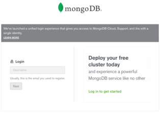
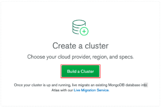
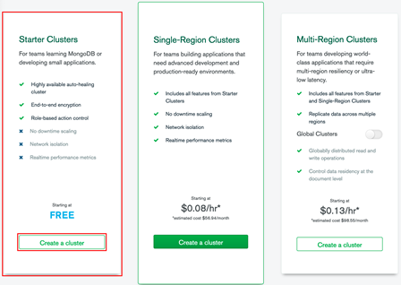
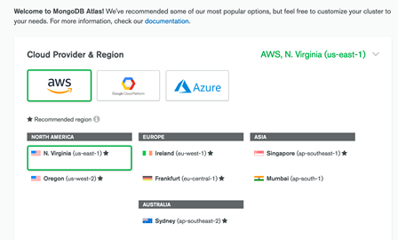
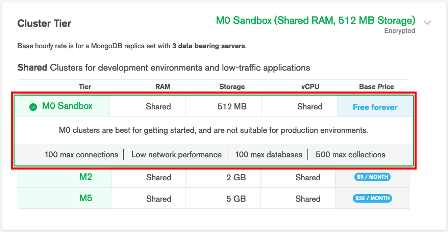
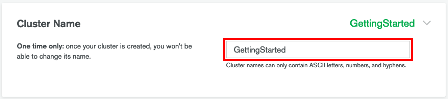
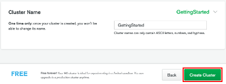

# Cloud MongoDB Atlas

https://cloud.mongodb.com

MongoDB Atlas — це багатохмарна служба баз даних, створена тими ж людьми, що створюють MongoDB. Atlas спрощує розгортання ваших баз даних і керування ними, водночас пропонуючи універсальність, необхідну для створення стійких і продуктивних глобальних додатків у хмарних постачальниках за вашим вибором.

## Швидкий старт

### 1. Створіть обліковий запис Atlas

 [Зареєструйте](https://www.mongodb.com/docs/atlas/tutorial/create-atlas-account/) обліковий запис Atlas за допомогою свого облікового запису Google або електронної адреси.

### 2. Розгорніть безкоштовний кластер

[Створіть і розгорніть безкоштовний кластер](https://www.mongodb.com/docs/atlas/tutorial/deploy-free-tier-cluster/). Ви можете використовувати безкоштовні кластери Atlas як невелике середовище розробки для розміщення своїх даних. Термін дії безкоштовних кластерів ніколи не закінчується, вони надають доступ до піднабору функцій Atlas.

1) Увійдіть в Atlas.

2) Натисніть Build a Cluster.

3) Виберіть Shared Clusters and click Create a Cluster.

4) Виберіть бажаного хмарного постачальника та регіон.

   Atlas підтримує безкоштовні кластери M0 на Amazon Web Services (AWS), Google Cloud Platform (GCP) і Microsoft Azure. Atlas відображає лише регіони, які підтримують вільні кластери M0 і спільні кластери M2/M5.

5) Виберіть M0 Sandbox для рівня кластера.

Вибір M0 автоматично блокує інші параметри конфігурації. Якщо ви не можете вибрати рівень кластера M0, поверніться до попереднього кроку та виберіть хмарного постачальника та регіон, який підтримує безкоштовні кластери M0.

6) Введіть назву свого кластера в поле «Cluster Name».

Ви можете ввести будь-яку назву для свого кластера. Назва кластера може містити літери ASCII, цифри та дефіси.

7) Натисніть «Create Cluster», щоб розгорнути кластер.

Після розгортання кластера може знадобитися до 10 хвилин, перш ніж кластер стане готовим до використання.

### 3. Додайте свою IP-адресу підключення до списку IP-доступу

[Додайте свою IP-адресу до списку надійних IP-адрес](https://www.mongodb.com/docs/atlas/security/add-ip-address-to-list/). IP-адреса унікально ідентифікує пристрій, який підключається до мережі. В Atlas ви можете підключитися до кластера лише з довіреної IP-адреси. В Atlas ви можете створити список надійних IP-адрес, який називається списком IP-доступу. Список IP-доступу визначає IP-адреси, які можуть підключатися до вашого кластера та отримувати доступ до ваших даних.

1. Натисніть Connect.

    - Клацніть Databases  у верхньому лівому куті Atlas.
    - У вікні «Database Deployments» клацніть «Connect » для кластера або безсерверного екземпляра, до якого потрібно підключитися.

    Atlas виділяє крок безпеки підключення до налаштування.

2. Натисніть « Add Your Current IP Address».

    - Щоб захистити свій кластер MongoDB Atlas, обмежте доступ до вказаних IP-адрес.

    - Меню розгорнеться, щоб показати модальне Додати IP-адресу підключення.

3. Натисніть Add IP Address

### 4. Створіть користувача бази даних для свого кластера 

[Створіть користувача бази даних для доступу до вашого кластера](https://www.mongodb.com/docs/atlas/tutorial/create-mongodb-user-for-cluster/). З міркувань безпеки Atlas вимагає від клієнтів автентифікації як користувачів бази даних MongoDB для доступу до кластерів.

### 5. Підключіться до свого кластера

 [Підключіться до свого кластера](https://www.mongodb.com/docs/atlas/tutorial/connect-to-your-cluster/) за допомогою [mongosh](https://www.mongodb.com/docs/mongodb-shell/#mongodb-binary-bin.mongosh), драйвера [Node.js](https://www.mongodb.com/docs/drivers/node/), [драйвера PyMongo](https://www.mongodb.com/docs/drivers/python/) або [Compass](https://www.mongodb.com/docs/compass/current/).

### 6. Вставте та перегляньте документ

 [Вставте документ у свій кластер](https://www.mongodb.com/docs/atlas/tutorial/insert-data-into-your-cluster/) за допомогою одного з підтримуваних [драйверів MongoDB](https://www.mongodb.com/docs/drivers/). Драйвери MongoDB дозволяють програмно взаємодіяти з базами даних за допомогою підтримуваної мови програмування.

### 7. Завантажити зразки даних.

 [Завантажте зразки даних у ваші кластери Atlas](https://www.mongodb.com/docs/atlas/sample-data/#std-label-sample-data). Atlas надає зразки даних, які можна завантажити у свої кластери Atlas. Ви можете використовувати ці дані, щоб швидко почати експериментувати з даними в MongoDB і використовувати такі інструменти, як [Atlas UI](https://www.mongodb.com/docs/atlas/atlas-ui/#std-label-atlas-ui) і [MongoDB Charts](https://www.mongodb.com/docs/charts/saas/).