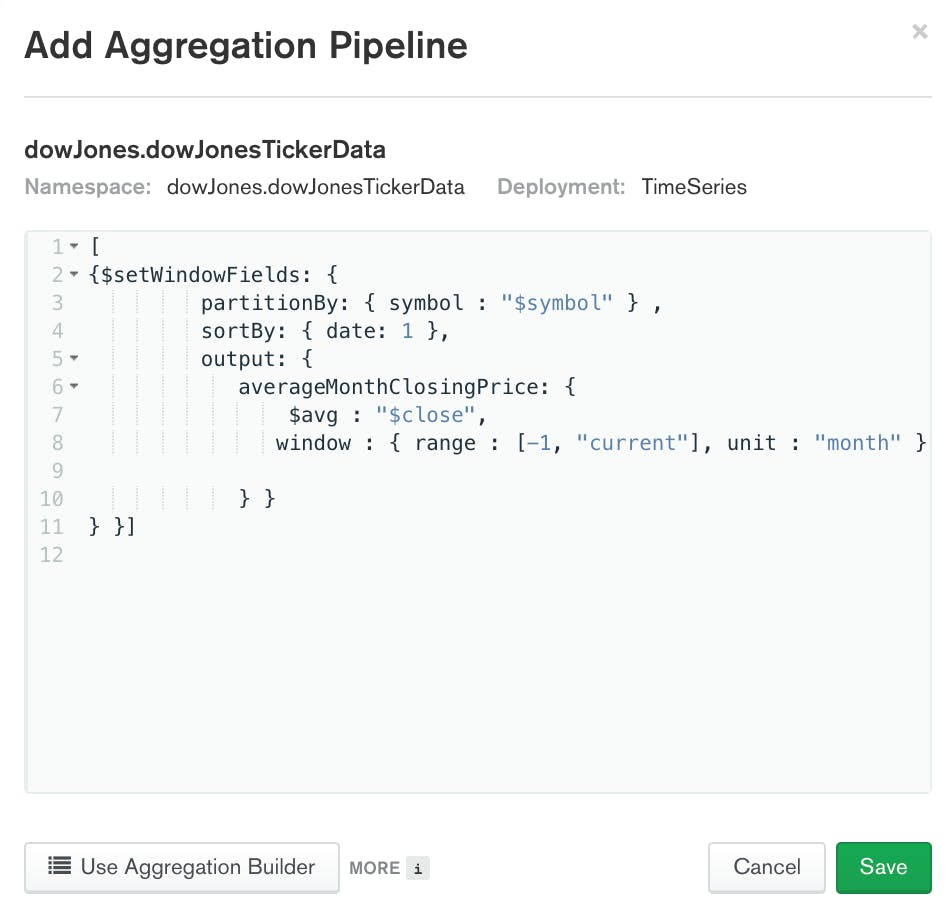
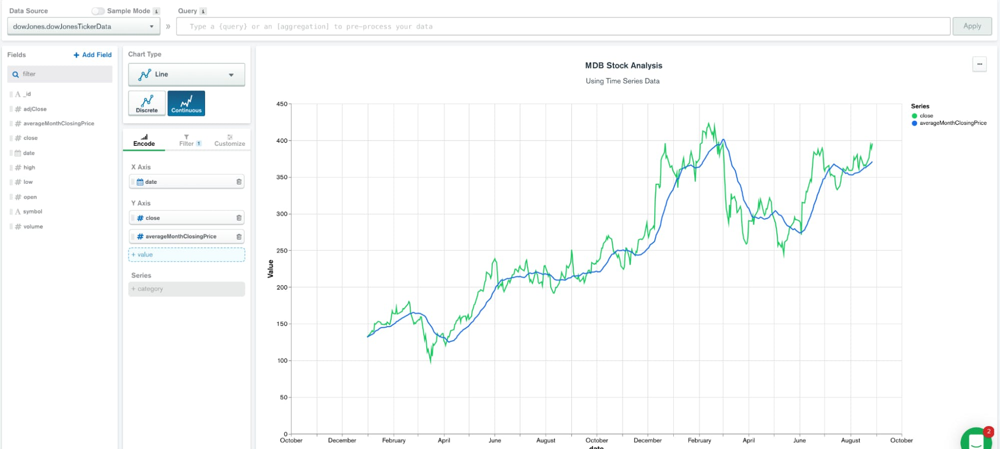
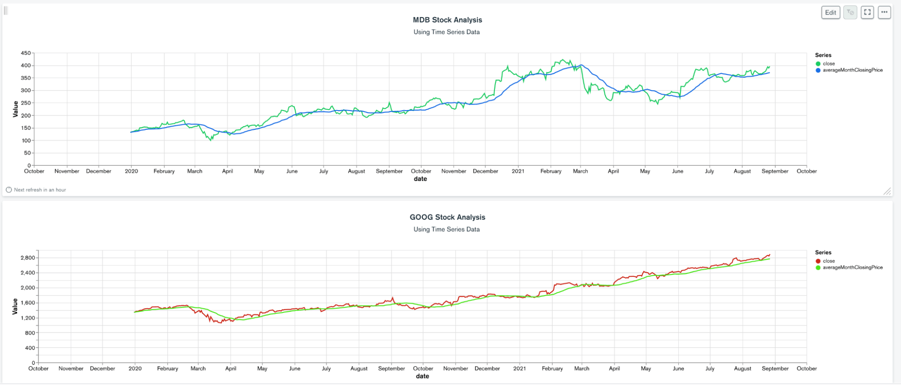

# MongoDB Time Series Data

https://www.mongodb.com/features/mongodb-time-series-data

[Дані часових рядів](https://www.mongodb.com/time-series) генеруються всюди, від соціальних мереж до біржових тикерів і пристроїв Інтернету речей. Аналіз даних часових рядів дозволяє організаціям виявляти, запобігати та прогнозувати події, випереджаючи конкурентів. Але де зберігати постійно зростаючий обсяг даних часових рядів? І як це можна проаналізувати?

MongoDB додав власну підтримку даних часових рядів у версії 5.0. У цій статті ви дізнаєтесь, що таке дані часових рядів, як ви можете зберігати та запитувати дані часових рядів у MongoDB, а також які найкращі методи роботи з даними часових рядів у MongoDB.

[Відео на YouTube](https://youtu.be/sVggwnVeqr4)

## Що таке дані часових рядів?

Дані часових рядів – це вимірювання, зроблені через проміжки часу з одного або кількох джерел.

Хоча не всі дані є часовими рядами за своєю природою, все більший відсоток їх можна класифікувати як часові ряди. Майже кожній компанії потрібно запитувати, аналізувати та звітувати про дані часових рядів. Уявімо, що біржовий трейдер постійно переглядає канали цін на акції з часом і запускає алгоритми для аналізу тенденцій для виявлення можливостей. Вони переглядають дані за проміжок часу з погодинними або добовими діапазонами. Іншим прикладом може бути те, як підключений пристрій для вимірювання погоди може отримати телеметричні дані, такі як рівень вологості та зміни температури, щоб прогнозувати погоду. Крім того, він міг би контролювати забруднення повітря, щоб виробляти попередження або аналізувати до виникнення кризи. Зібрану інформацію можна переглянути за часовий діапазон, щоб обчислити тенденції за часом.

Ось один приклад вимірювання біржової торгівлі в одному документі:

```js
{
    date: ISODate("2020-01-03T05:00:00.000Z"),
    symbol: 'AAPL',
    volume: 146322800,
    open: 74.287498,
    adjClose: 73.486023,
    high: 75.144997,
    low: 74.125,
    close: 74.357498
  }
```

Як правило, дані часових рядів включають час і вимірювання, а також іншу ідентифікаційну інформацію, таку як джерело даних. У цьому прикладі даних часових рядів, які фіксують інформацію про торгівлю акціями, ми маємо **дату (date)** як класифікатор часу та символ акції як поле **ідентифікації**, тоді як такі відомості, як ціни **відкриття (open)** та **закриття (close)** в даному випадку є вимірами.

## Дані часових рядів у MongoDB

Коли ви працюєте з даними часових рядів, ви часто стурбовані не лише збереженням даних, але також потребуєте високої продуктивності читання та запису та розширених можливостей запитів. MongoDB — це документна база даних загального призначення з гнучким дизайном схеми та розширеною мовою запитів. Починаючи з MongoDB 5.0, MongoDB нативно підтримує дані часових рядів.

Ви можете створити нову [колекцію часових рядів](https://docs.mongodb.com/manual/core/timeseries-collections/) за допомогою команди [`createCollection()`](https://docs.mongodb.com/ команда manual/reference/method/db.createCollection/). Якщо ви хочете створити колекцію часових рядів, ви повинні включити опцію `timeField`. `timeField` вказує назву поля, яке містить дату в кожному документі. Ви також повинні включити такі параметри:

- `metaField` вказує назву поля, яке містить метадані в кожному документі. MetaField служить міткою або тегом, що дозволяє колекціям часових рядів унікально ідентифікувати джерело часових рядів. Це поле ніколи або рідко змінюється з часом.

- Поле `granularity` вказує проміжок часу між документами з відповідним metaField, якщо вказано. Деталізація за замовчуванням – `"seconds"`, що вказує на частоту надходження з високою частотою, оскільки вона стосується кожного унікального часового ряду, визначеного metaField. Деталізацію можна встановити на `"секунди"`, `"minutes,"`  або `"hours"`, і її можна будь-коли змінити, щоб вона була грубішою. Однак ви не можете змінити деталізацію на дрібнішу, наприклад, «хвилини» на «секунди», тому рекомендується почати з дрібнішої деталізації та налаштувати на більш грубу.

Нарешті, ви можете включити цю опцію, якщо ви хочете видалити дані через певний час:

- Поле `expireAfterSeconds` вказує кількість секунд, після якої термін дії документів закінчується та їх автоматично видаляють.

У наведеному нижче прикладі створюється колекція часових рядів під назвою `dowJonesTickerData`, де `timeField` — це **date**, а `metaField` — **symbol**:

```js
db.createCollection("dowJonesTickerData", 
{ timeseries: { 
               timeField: "date", 
               metaField: "symbol",
               granularity: "minutes" } })
```

У кожному документі, який ви додаєте до колекції часових рядів, потрібно вказати принаймні `timeField`. У прикладі документа нижче `timeField` є `date`. Зауважте, що `timeField` можна назвати як завгодно, якщо воно має тип BSON  Date. Документ можна додати до колекції часових рядів за допомогою будь-якого методу, який можна використовувати для вставки документів в інші колекції MongoDB. Наведений нижче приклад додає документ до колекції `dowJonesTickerData` за допомогою [`insertOne()`](https://docs.mongodb.com/manual/reference/method/db.collection.insertOne/).

```js
db.dowJonesTickerData.insertOne({
    date: ISODate("2020-01-03T05:00:00.000Z"),
    symbol: 'AAPL',
    volume: 146322800,
    open: 74.287498,
    adjClose: 73.486023,
    high: 75.144997,
    low: 74.125,
    close: 74.357498
  })
```

Кожне вставлене вимірювання має бути єдиним вимірюванням у вигляді окремих документів або пакетів документів з одним вимірюванням на документ. MongoDB оптимізує ці дані, що зберігаються за часом, щоб зменшити розмір і оптимізувати шаблони доступу до часових рядів і пропускну здатність запису.

## Як мені отримати дані часових рядів у MongoDB?

Документи в колекціях часових рядів можна запитувати так само, як і документи в інших колекціях MongoDB. Наприклад, ми можемо зробити запит в MongoDB Shell, mongosh, для документа в колекції `dowJonesTickerData` за допомогою `findOne()`.

```js
db.dowJonesTickerData.findOne()
```

Оболонка MongoDB поверне один документ:

```js
{
    date: ISODate("2020-01-03T05:00:00.000Z"),
    symbol: 'AAPL',
    volume: 146322800,
    open: 74.287498,
    adjClose: 73.486023,
    high: 75.144997,
    low: 74.125,
    close: 74.357498,
    _id: ObjectId("60eea26373c4cdcb6356827d")
  }
```

MongoDB оптимізує дані, оскільки зберігає дані впорядковані за часом на відміну від [природного порядку](https://docs.mongodb.com/manual/reference/glossary/#std-term-natural-order) у звичайних колекціях. Ви можете покращити продуктивність запитів, додавши [вторинні індекси](https://docs.mongodb.com/manual/core/timeseries/timeseries-secondary-index/) у *metaField* та/або *timeField*.

```js
db.dowJonesTickerData.createIndex({ 
    symbol : 1, 
    date : 1});
```

Якщо ви хочете ввімкнути пошук у кількох полях метаданих (наприклад, символ і компанія), радимо оновити вашу модель даних. Замість того, щоб `metaField` було одним значенням (наприклад, символом), оновіть `metaField` до об’єкта, який містить кілька фрагментів метаданих.

Наприклад, давайте видалимо наявну колекцію `dowJonesTickerData` і створимо нову, яка має `metaField` під назвою `"meta"`.

```js
db.dowJonesTickerData.drop();

db.createCollection("dowJonesTickerData", 
{ timeseries: { 
               timeField: "date", 
               metaField: "meta",
               granularity: "minutes" } })
```

Далі давайте вставимо документ, який зберігає кілька фрагментів метаданих, у поле `meta`.

```js
db.dowJonesTickerData.insertOne({
  date: ISODate("2021-05-20T10:24:51.303Z"),
  meta : { symbol: 'ba', company: 'boeing'},
  price: 125
})
```

Тепер ми можемо створити вторинний індекс із кількома полями. У нашому випадку ми створимо вторинний індекс, який дозволить здійснювати ефективний пошук як за `symbol`, так і за `company`.

```js
db.dowJonesTickerData.createIndex({ "meta.symbol" :1, "meta.company" :1 , date : 1});
```

## Очищення документів

Часто дані часових рядів можуть бути нерелевантними через певний період часу. Очищення або архівування старих даних зберігає колекцію якомога меншою, тим самим покращуючи продуктивність і знижуючи витрати.

### Автоматичне видалення документів часових рядів

Рекомендований спосіб автоматичного видалення прострочених даних — установити TTL, [вираз Time To Live](https://docs.mongodb.com/manual/core/timeseries/timeseries-automatic-removal/), для колекції часових рядів у формі параметра *expireAfterSeconds*. Дані буде видалено, коли значення дати документа досягне значення «*now - expireAfterSeconds*».

```js
db.createCollection("dowJonesTickerData", 
{ timeseries: { 
               timeField: "date", 
               metaField: "meta" ,
               granularity : "minutes"
               },
expireAfterSeconds : 94608000 // 3 years 
})
```

У наведеному вище прикладі документ буде видалено після того, як значення, яке зберігається в полі дати, досягне трьох років.

Ви можете [встановити або змінити](https://docs.mongodb.com/manual/core/timeseries/timeseries-automatic-removal/#change-the-expireafterseconds-parameter) цей параметр у будь-який момент під час або після створення колекції, тому, якщо ваші вимоги зміняться протягом життєвого циклу даних, ви можете легко змінити або оновити час життя для своїх даних.

## Автоматичне архівування документів часових рядів

Іншим варіантом обробки старих даних є розміщення їх у оперативному та онлайн-архівному сховищі.
Ви можете використовувати [Online Archive](https://docs.atlas.mongodb.com/online-archive/manage-online-archive/) , щоб автоматично архівувати дані з вашого кластера Atlas до керованого MongoDB [озера даних]( https://www.mongodb.com/atlas/data-lake).

Онлайн-архів має багато переваг:

- Розділення гарячих даних, що зберігаються в робочій базі даних кластера Atlas, і холодних архівних даних, що зберігаються в сховищі онлайн-архіву
- Оптимізація витрат при збереженні значно великого набору даних для різних цілей, наприклад для відповідності та історії
- Максимальна продуктивність зберігання та запитів для архівованих даних часових рядів через Atlas Online * Archive і Atlas Data Lake MongoDB.
- [Об’єднані запити](https://docs.atlas.mongodb.com/online-archive/connect-to-online-archive/) дозволяють розробникам одночасно запитувати як гарячі дані в кластері Atlas, так і холодні дані в онлайн-архіві , що дозволяє легко поєднувати історичні дані з новими даними.


Дивіться офіційну документацію MongoDB про [налаштування онлайн-архівів](https://docs.atlas.mongodb.com/online-archive/configure-online-archive/), щоб отримати додаткові відомості.

## Аналіз даних часових рядів у MongoDB

MongoDB надає різноманітні [оператори конвеєра агрегації](https://docs.mongodb.com/manual/reference/operator/aggregation/) і [етапи конвеєра агрегації](https://docs.mongodb.com/manual/reference /operator/aggregation-pipeline/), щоб розробники могли аналізувати дані. Ці оператори та етапи доступні для всіх колекцій — часових рядів або регулярних. Давайте розглянемо деякі з нових операторів і етап, доданий у версії 5.0, щоб полегшити роботу з датами та часом.

### Нові оператори конвеєра агрегації: `$dateAdd`, `$dateDiff` і `$dateTrunc`

У версії 5.0 MongoDB додав такі оператори конвеєра агрегації:

- [$dateAdd](https://docs.mongodb.com/manual/reference/operator/aggregation/dateAdd/): додає вказану кількість часу до об’єкта Date
- [$dateDiff](https://docs.mongodb.com/manual/reference/operator/aggregation/dateDiff/): повертає різницю в часі між двома датами
- [$dateTrunc](https://docs.mongodb.com/manual/reference/operator/aggregation/dateTrunc/): повертає дату, яка була скорочена до вказаної одиниці

Ці нові оператори роблять роботу з даними часових рядів ще простішою. Відвідайте офіційну документацію MongoDB щодо [операторів конвеєра агрегації](https://docs.mongodb.com/manual/reference/operator/aggregation/), щоб дізнатися більше про всі доступні оператори. Також [тут](oper_date.md) доступна українська адаптована версія. 

#### Приклад $dateTrunc 

Розглянемо вихідний приклад біржових даних:

```js
{
    date: ISODate("2020-01-03T05:00:00.000Z"),
    symbol: 'AAPL',
    volume: 146322800,
    open: 74.287498,
    adjClose: 73.486023,
    high: 75.144997,
    low: 74.125,
    close: 74.357498
  } 
```

У цьому прикладі колекція `dowJonesTickerData` використовує `date` як timeField і `symbol` як metaField.

Припустімо, ми хочемо обчислити середню ціну акції на момент закриття за місяць для кожної акції в колекції. Ми можемо використати [`$dateTrunc`](https://docs.mongodb.com/manual/reference/operator/aggregation/dateTrunc/), щоб скоротити дати до відповідного місяця. Тоді ми можемо використати [`$group`](https://docs.mongodb.com/manual/reference/operator/aggregation/group/), щоб спочатку згрупувати документи за місяцями та символами, а по-друге, обчислити середнє для кожної групи.

```js
db.dowJonesTickerData.aggregate([{
    $group: {
        _id: {
            firstDayOfMonth: {
                $dateTrunc: {
                    date: "$date",
                    unit: "month"
                }
            },
            symbol: "$symbol"
        },
        avgMonthClose: {
            $avg: "$close"
        }
    }
}])
```

Результатом виконання вищезазначеного агрегування є набір документів. Кожен документ містить середню ціну закриття за місяць для певної акції. Нижче наведено приклади документів, які були отримані в результаті запуску вищевказаного агрегування.

```js
{
    _id: {
      firstDayOfMonth: ISODate("2020-06-01T00:00:00.000Z"),
      symbol: 'GOOG'
    },
    avgMonthClose: 1431.0477184545455
  },
  {
    _id: {
      firstDayOfMonth: ISODate("2021-07-01T00:00:00.000Z"),
      symbol: 'MDB'
    },
    avgMonthClose: 352.7314293333333
  },
  {
    _id: {
      firstDayOfMonth: ISODate("2021-06-01T00:00:00.000Z"),
      symbol: 'MSFT'
    },
    avgMonthClose: 259.01818086363636
  }
```

### Функції вікна з новою стадією конвеєра агрегації: `$setWindowFields`

Віконні функції дозволяють розробникам виконувати обчислення документів у певному вікні. MongoDB додала підтримку віконних функцій у версії 5.0 із запровадженням етапу конвеєра агрегації [$setWindowFields](https://docs.mongodb.com/manual/reference/operator/aggregation/setWindowFields/). Подібно до `$group`, `$setWindowFields` дозволяє застосовувати одну або більше операцій до визначеного вікна. У `$group` документи групуються разом, а потім обчислення виконуються для кожної групи. У `$setWindowFields` вікна відносяться до кожного документа, тому обчислення виконуються для кожного документа.

За допомогою нового оператора [$setWindowFields](https://docs.mongodb.com/manual/reference/operator/aggregation/setWindowFields/) ви можете обчислити *ковзне* середнє значення ціни закриття за останні 30 днів для кожного запас:

```js
db.dowJonesTickerData.aggregate( [
{$setWindowFields: {
         partitionBy: { symbol : "$symbol" } ,
         sortBy: { date: 1 },
         output: {
            averageMonthClosingPrice: {
                $avg : "$close",
               window : { range : [-1, "current"], unit : "month" }

            } } 
} }] )
)
```

Результатом виконання вищезазначеного агрегування є набір документів. Набір міститиме таку саму кількість документів, що й оригінальна колекція. Кожен документ у результатах міститиме нове поле: `$averageMonthClosingPrice`. Значення `$averageMonthClosingPrice` є середнім значенням ціни закриття попереднього місяця для вказаного символу акцій. Нижче наведено приклад документа, створеного в результаті виконання вищевказаного агрегування.

```js
 {
    date: ISODate("2020-01-29T05:00:00.000Z"),
    symbol: 'AAPL',
    volume: 216229200,
    adjClose: 80.014801,
    low: 80.345001,
    high: 81.962502,
    open: 81.112503,
    close: 81.084999,
    averageMonthClosingPrice: 77.63137520000001
  }
```

[Діаграми MongoDB](https://docs.mongodb.com/charts/saas/) є чудовим інструментом для візуалізації даних, обчислених вищенаведеним конвеєром агрегації.

Налаштуйте діаграму [Джерело даних](https://docs.mongodb.com/charts/saas/data-sources/), щоб використовувати той самий конвеєр, який ми робили вище:

```js
[
{$setWindowFields: {
         partitionBy: { symbol : "$symbol" } ,
         sortBy: { date: 1 },
         output: {
            averageMonthClosingPrice: {
                $avg : "$close",
               window : { range : [-1, "current"], unit : "month" }

            } } 
} }]
```



У результаті джерело даних відкриває всі поля, такі як *symbol*, *date*, *close* і *averageMonthClosingPrice*, які можна використовувати безпосередньо на лінійному графіку:



Складаючи ці дані на діаграму, ми можемо побачити безпосереднє значення цього аналізу:



На графіках вище показано ціну закриття та ковзний 30-денний середній графік кожної акції.

## Найкращі методи зберігання даних часових рядів у MongoDB

Нижче наведено список із шести найкращих методів роботи з даними часових рядів у MongoDB:

- Використовуйте колекції часових рядів із даними часових рядів, коли це можливо.
- При використанні колекції часових рядів зберігайте окремі вимірювання або групи вимірювань як один документ, вставлений у пакети (batches).
- Налаштуйте свої дані, щоб мати відповідні *metaField* і *timeField* з урахуванням характеристик даних і шаблонів запитів.
- Налаштуйте [гранулярність](https://docs.mongodb.com/manual/core/timeseries/timeseries-granularity/)  своїх даних відповідно до швидкості прийому даних, оскільки це пов’язано з потужністю вашого метаполя або унікальними комбінаціями вашого унікального метаполя. Наприклад, якщо ваше метаполе — це customerId, але ви отримуєте дані лише від унікального customerId кожні п’ять хвилин, вам слід змінити деталізацію на хвилини, незважаючи на те, що загалом ви потенційно отримуєте 10 тисяч вставок за хвилину. Стрибки даних для ваших значень metaField — це нормально. Це не повинно бути однаковим, але має бути якомога найкращим наближенням.
- Перевірте, чи знаєте ви про поточні обмеження за допомогою [колекцій часових рядів](https://docs.mongodb.com/manual/core/timeseries/timeseries-limitations/).

## Резюме

Дані часових рядів є всюди, але їх зберігання та запити можуть бути складними. MongoDB додав вбудовану підтримку даних часових рядів у версії 5.0, що робить роботу з даними часових рядів ще простішою, швидшою та дешевшою.