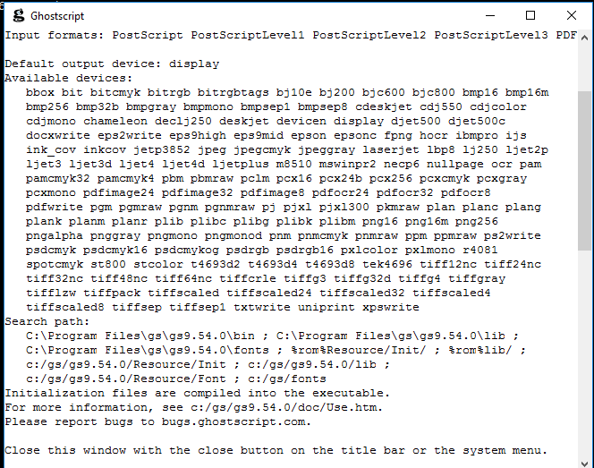

# Ghostscript

https://www.ghostscript.com/ 

https://www.ghostscript.com/doc/9.54.0/Readme.htm

## Ghostscript/GhostPDF

Ghostscript - це інтерпретатор файлів PostScript [®](https://www.ghostscript.com/doc/9.54.0/WhatIsGS.htm#foot1) та файлів Portable Document Format (PDF).

Ghostscript складається з рівня інтерпретатора PostScript та графічної бібліотеки. Графічна бібліотека надається спільно з усіма іншими продуктами сімейства Ghostscript, тому всі ці технології іноді називають Ghostscript, а не більш правильним GhostPDL.

GhostPDF - це інтерпретатор, побудований поверх Ghostscript для обробки файлів PDF. В даний час GhostPDF покладається на розширення до мови мови/моделі обробки зображень, тому не може використовуватися незалежно від компонента інтерпретатора Ghostscript PostScript. Таким чином, GhostPDF - загальний термін, що використовується як для цих розширень, так і для коду інтерпретатора.

Бінарні файли для Ghostscript та GhostPDF (включені до бінарних файлів Ghostscript) для різних систем можна завантажити з [тут](http://www.ghostscript.com/download). Джерело можна знайти як у Ghostscript, так і в GhostPDL із того самого сайту.

## GhostPDL

Історично ми використовували GhostPDL як загальний термін, який охоплює всю нашу лінійку продуктів. Тепер ми об’єднали всі ці різнорідні продукти в єдиний пакет, який, відповідно, називається GhostPDL.

Під час роботи на принтері (або сервері) GhostPDL тепер автоматично визначає тип даних, що надходять на нього, і обробляє їх відповідно. Всі окремі інтерпретатори підключаються до модуля верхнього рівня, який обробляє як автоматичне визначення мови, так і конфігурацію на основі мови завдання принтера (PJL).

Точний набір інтерпретаторів, присутніх в інсталяції, може бути налаштований інтегратором для їх конкретних випадків використання/продуктів.

На додаток до наших існуючих модулів PDL (PS, PDF, PCL, PXL та XPS), ми додали нові модулі для обробки ряду поширених форматів зображень. Після встановлення GhostPDL буде обробляти JPEG (як JFIF, так і EXIF), PWG, TIFF, PNG, JBIG2 та JPEG2000.

GhostPDL доступний як під [ліцензією GNU Affero GPL](http://www.gnu.org/licenses/agpl-3.0.html), так і для [комерційне ліцензування](http://www.artifex.com/page/ licesnsing-information.html) від [Artifex](http://www.artifex.com).

Вихідний код для GhostPDL можна знайти тут [тут](http://www.ghostscript.com/download).

## Виклик Ghostscript

Цей документ описує, як користуватися командним рядком клієнта Ghostscript. Ghostscript також використовується як загальний механізм в інших програмах (наприклад, для перегляду файлів). Будь ласка, зверніться до документації до цих програм для використання Ghostscript в інших контекстах.

Командний рядок для виклику Ghostscript, по суті, однаковий у всіх системах, хоча сама назва виконуваної програми може відрізнятися у різних системах. Наприклад, щоб викликати Ghostscript на Unix-подібних системах, введіть:

> ```
> gs [options] {filename 1} ... [options] {filename N} ...
> ```

Ось декілька основних прикладів. Подробиці того, як ці роботи описані нижче.

Щоб переглянути файл:

> ```
> gs -dSAFER -dBATCH document.pdf
> ```

Вам буде запропоновано натиснути *return* між сторінками.

Щоб перетворити фігуру у файл зображення:

> ```
> gs -dSAFER -dBATCH -dNOPAUSE -sDEVICE=png16m -dGraphicsAlphaBits=4 \
>     -sOutputFile=tiger.png tiger.eps
> ```

Щоб відтворити одне і те ж зображення зі швидкістю 300 dpi:

> ```
> gs -dSAFER -dBATCH -dNOPAUSE -sDEVICE=png16m -r300 \
>                 -sOutputFile=tiger_300.png tiger.eps
> ```

Щоб відобразити фігуру в градаціях сірого:

> ```
> gs -dSAFER -dBATCH -dNOPAUSE -sDEVICE=pnggray -sOutputFile=figure.png figure.pdf
> ```

Щоб растризувати цілий документ:

> ```
> gs -dSAFER -dBATCH -dNOPAUSE -sDEVICE=pgmraw -r150 \
>                 -dTextAlphaBits=4 -sOutputFile='paper-%00d.pgm' paper.ps
> ```

Існує також низка утилітних сценаріїв для загального перетворення документа PostScript у PDF:

> ```
> ps2pdf file.ps
> ```

Вихідні дані зберігаються як file.pdf.

Окрім `ps2pdf`, є й інші скрипти утиліти, включаючи ` pdf2ps`, `ps2epsi`,` pdf2dsc`, `ps2ascii`,` ps2ps` та `ps2ps2`. Вони просто викликають Ghostscript із відповідним (якщо складний) набором опцій. Ви можете використовувати набір 'ps2' з файлами eps.

Ghostscript здатний інтерпретувати PostScript, інкапсульований PostScript (EPS), DOS EPS (EPSF) та Adobe Portable Document Format (PDF). Інтерпретатор читає та виконує файли послідовно, використовуючи метод, описаний у "[Пошук файлів](https://www.ghostscript.com/doc/9.54.0/Use.htm#File_searching)", щоб знайти їх.

За замовчуванням інтерпретатор працює в інтерактивному режимі. Після обробки файлів, поданих у командному рядку (якщо такі є), він зчитує подальші рядки команд мови PostScript з основного потоку введення, як правило, клавіатури, інтерпретуючи кожен рядок окремо. Щоб вийти з інтерпретатора, введіть "` quit` ". Параметри `-dBATCH -dNOPAUSE` у наведених вище прикладах вимикають інтерактивну підказку. Інтерпретатор також виходить елегантно, якщо виявляє кінець файлу або через control-C.

Інтерпретатор розпізнає багато варіантів. Параметр може з'являтися де завгодно в командному рядку і застосовується до всіх файлів, названих після нього в рядку. Багато з них включають "` = `", за яким слід параметр. Найважливіші тут докладно описані. Будь ласка, перегляньте довідкові розділи щодо [опцій](https://www.ghostscript.com/doc/9.54.0/Use.htm#Options) та [пристроїв](https://www.ghostscript.com/doc/9.54 .0 / Devices.htm) для більш повного списку.

You can get a brief help message by invoking Ghostscript with the `-h` or `-?` switch, like this:

Ви можете отримати коротке довідкове повідомлення, запустивши Ghostscript за допомогою перемикача `-h` або ` -? `, Наприклад:

> ```
> gs -h
> gs -?
> ```



У повідомленні показано для цієї версії виконуваного файлу Ghostscript:

- інформація про версію та випуск
- загальний формат командного рядка
- кілька найбільш корисних опцій
- формати, які він може інтерпретувати
- доступні пристрої виводу
- шлях пошуку
- адреса звіту про помилку

В інших системах виконуваний файл може мати іншу назву:

> | System                  | Invocation Name |                |               |                |
> | ----------------------- | --------------- | -------------- | ------------- | -------------- |
> | Unix                    | `gs`            |                |               |                |
> | VMS                     | `gs`            |                |               |                |
> | MS Windows 95 and later | `gswin32.exe`   | `gswin32c.exe` | `gswin64.exe` | `gswin64c.exe` |
> | OS/2                    | `gsos2`         |                |               |                |

У Windows двоцифрове число вказує довжину слова системи, для якої був побудований двійковий файл (тому `gswin32.exe` стосується систем x86 Windows, тоді як` gswin64.exe` - систем x86_64 Windows). А суфікс "c" вказує двійковий файл на основі консолі Windows (зауважте, що вікно "пристрій відображення" все одно з'явиться).

Для запуску файлу треба вказувати повний шлях, або прописати його у змінну середовища PATH 

https://www.ghostscript.com/doc/9.54.0/Use.htm

## Вибір вихідного пристрою 

Ghostscript має поняття "пристрої виведення", які обробляють збереження або відображення результатів у певному форматі. Ghostscript постачається з різноманітною різноманітністю таких пристроїв, що підтримують виведення векторних та растрових файлів, відображення на екрані, керування різними принтерами та спілкування з іншими програмами.

Параметр командного рядка '`-sDEVICE=`*device*'  вибирає, який пристрій виведення повинен використовувати Ghostscript. Якщо ця опція не вказана, використовується пристрій за замовчуванням (зазвичай це пристрій відображення). У вбудованому довідковому повідомленні Ghostscript (`gs -h`) перелічені доступні пристрої виводу. Повний опис пристроїв, що розповсюджуються разом із Ghostscript, та їх варіанти див. У [розділі пристроїв](https://www.ghostscript.com/doc/9.54.0/Devices.htm) документації.

Зверніть увагу, що цей перемикач повинен передувати імені першого вхідного файлу, і лише його перше використання має ефект. Наприклад, для виводу принтера в конфігурації, що включає драйвер принтера Epson, замість просто  `'gs myfile.ps'`  ви можете використовувати

> `gs -sDEVICE=epson myfile.ps`

Вихідний пристрій також можна встановити за допомогою змінної середовища `GS_DEVICE`.

Після того, як ви запустите Ghostscript, ви також можете дізнатися, які пристрої доступні, набравши '`devicenames ==`'  в інтерактивному запиті. Ви також можете встановити пристрій виведення та обробити файл з інтерактивного запиту:

> ```
> (epson) selectdevice
> (myfile.ps) run
> ```

Потім усі вихідні дані надходять на принтер Epson замість дисплея, поки ви не зробите щось для зміни пристроїв. Ви можете будь-коли перемикати пристрої, використовуючи процедуру `selectdevice`, наприклад, як один із таких:

> ```
> (x11alpha) selectdevice
> (epson) selectdevice
> ```

### PNG file format

https://www.ghostscript.com/doc/9.54.0/Devices.htm#PNG

PNG (вимовляється як «пінг») означає «Портативна мережева графіка» і є рекомендованим форматом для високоякісних зображень. Він підтримує повноякісні кольори та прозорість, пропонує чудове стиснення даних без втрат та широко підтримується. Будь ласка, перегляньте [веб-сайт PNG](http://www.libpng.org/pub/png/pngintro.html), щоб отримати повний опис формату.

Ghostscript надає різноманітні пристрої для виводу PNG, що змінюються в бітовій глибині. Для звичайного використання ми рекомендуємо `png16m` для 24-бітового кольору RGB або ` pnggray` для відтінків сірого. Пристрої `png256`,` png16` та `pngmono` відповідно забезпечують 8-бітний колір, 4-бітний колір і чорно-білий для особливих потреб. Пристрій `pngmonod` також є чорно-білим пристроєм, але висновок формується із внутрішнього 8-бітного візуалізації сірого, який потім розсіюється з помилками і перетворюється на 1bpp.

Пристрій `pngalpha` має 32-бітний колір RGBA з прозорістю, що вказує на покриття пікселів. Фон прозорий, якщо він явно не заповнений. Прозорі файли PDF 1.4 не дають прозорого фону на цьому пристрої. Згладжування тексту та графіки ввімкнено за замовчуванням.

#### Options

The `pngmonod`, `png16m`, `pnggray` and `pngalpha` devices all respond to the following:

> - `-dDownScaleFactor=`***integer\***
>
>   Це призводить до зменшення внутрішнього візуалізації за заданим (ціле число <= 8) фактором перед виведенням. Наприклад, наступне створить вихідний png у форматі 200 dpi із внутрішнього візуалізації 600 dpi:

The `pngmonod` device responds to the following option:

> - `-dMinFeatureSize=`*state* (0 to 4; default = 1)
>
>   Цей параметр дозволяє встановити мінімальний розмір функції; якщо який-небудь вихідний піксель з'являється самостійно або як частина групи пікселів, менших за `MinFeatureSize` x ` MinFeatureSize`, він буде розширений, щоб переконатися, що він є. Це корисно для вихідних пристроїв із високою роздільною здатністю, але які мають проблеми з рендерингом ізольованих пікселів.
>
>   Хоча цей параметр приймає значення від 0 до 4, не всі реалізовані повністю. 0 та 1 не спричиняють змін у вихідних даних (як очікувалося). 2 роботи, як зазначено. Значення 3 і 4 приймаються для сумісності, але поводяться як для 2.

The `pngalpha` device responds to the following option:

> - `-dBackgroundColor=`***16#RRGGBB\*** (RGB color, default white = 16#ffffff)
>
>   For the `pngalpha` device only, set the suggested background color in the PNG bKGD chunk. When a program reading a PNG file does not support alpha transparency, the PNG library converts the image using either a background color if supplied by the program or the bKGD chunk. One common web browser has this problem, so when using `<body bgcolor="CCCC00">` on a web page you would need to use `-dBackgroundColor=16#CCCC00` when creating alpha transparent PNG images for use on the page.

#### Examples

Examples of how to use Ghostscript to convert postscript to PNG image files:

> ```
>  gs -dSAFER -dBATCH -dNOPAUSE -sDEVICE=png16m -dGraphicsAlphaBits=4 \
>       -sOutputFile=tiger.png examples/tiger.png
> 
>  gs -dSAFER -dBATCH -dNOPAUSE -r150 -sDEVICE=pnggray -dTextAlphaBits=4 \
>       -sOutputFile=doc-%02d.png doc.pdf
> ```

### Вихідна роздільна здатність

https://www.ghostscript.com/doc/9.54.0/Use.htm#Output_resolution

Деякі принтери можуть друкувати з різною роздільною здатністю, що дозволяє збалансувати роздільну здатність та швидкість друку. Щоб вибрати роздільну здатність на такому принтері, використовуйте перемикач `-r`:

>  `gs -sDEVICE=`*printer*` -r`*XRES*`x`*YRES*

де *XRES* та *YRES* - потрібна кількість точок (або пікселів) на дюйм. Там, де обидві роздільні здатності однакові, як це зазвичай трапляється, ви можете просто використовувати `-r` *res*.

Параметр `-r` також корисний для контролю щільності пікселів при растеризації у файл зображення. Це використовується у прикладах на початку цього документа.

### Виведення у файли

Ghostscript також дозволяє контролювати, куди він надсилає свої результати. Для пристрою відображення це не потрібно, оскільки пристрій обробляє виведення результатів на екран всередині. Деякі спеціалізовані драйвери принтера також працюють таким чином, але більшість пристроїв є загальними і їх потрібно спрямовувати на певний файл або принтер.

Щоб надіслати вихідні дані у файл, використовуйте перемикач `-sOutputFile =` або перемикач [`-o`](https://www.ghostscript.com/doc/9.54.0/Use.htm#o_option) (нижче ). Наприклад, щоб направити весь вихідний файл у файл `ABC.xyz`, використовуйте

> ```
>  gs -sOutputFile=ABC.xyz 
> ```

При друці в системах MS Windows вихід зазвичай надходить безпосередньо на принтер, `PRN`. У системах Unix та VMS він зазвичай переходить до тимчасового файлу, який надсилається на принтер окремим кроком. При використанні Ghostscript як файлового растеризатора (перетворення PostScript або PDF у формат растрового зображення), звичайно, ви хочете вказати файл із відповідним іменем для виводу.

Ghostscript також приймає спеціальне ім'я файлу `` -``, яке вказує, що вихід повинен бути записаний у стандартний вивід (командна оболонка).

Майте на увазі, що імена файлів, що починаються на символ `%`, мають особливе значення в PostScript. Якщо вам потрібно вказати ім'я файлу, яке насправді починається з `%`, вам слід явно додати файл `%os%` до файлового пристрою. Наприклад, для виведення у файл з назвою `%abc`, потрібно вказати

> ```
> gs -sOutputFile=%os%%abc
> ```

Будь ласка, див. [Ghostscript і мова PostScript](https://www.ghostscript.com/doc/9.54.0/Language.htm) та Довідковий посібник з мови PostScript, щоб отримати докладнішу інформацію про `%` та файлові пристрої.

Зверніть увагу, що в системах MS Windows символ `%` також має спеціальне значення для командного процесора (оболонки), тому вам доведеться його подвоїти. 

> `gs -sOutputFile=%%os%%%%abc` (on MS Windows)

Зверніть увагу, що деякі пристрої (наприклад, pdfwrite, ps2write, ...) записують вихідний файл лише при виході, але зміна параметра пристрою OutputFile призведе до того, що ці пристрої видадуть сторінки, отримані до цього моменту, а потім відкриють нову назву файлу надано OutputFile.

Наприклад, для створення двох файлів PDF з одного виклику ghostscript можна використовувати наступне:

> ```bash
> gs -sDEVICE=pdfwrite -o tiger.pdf examples/tiger.eps -c "<<  /OutputFile (colorcir.pdf) >> setpagedevice" -f  examples/colorcir.ps
> ```

#### Одна сторінка на файл

Вказівка одного вихідного файлу чудово підходить для друку та растеризації рисунків, але іноді потрібні зображення кожної сторінки багатосторінкового документа. Ви можете сказати Ghostscript помістити кожну сторінку виводу в серію файлів з однаковою назвою. Для цього в імені файлу розмістіть шаблон ``%d``, який Ghostscript замінить номером сторінки.

Примітка: Оскільки символ  `%` використовується перед передуванням специфікації формату номера сторінки, для представлення імені файлу, що містить  `%` , слід використовувати подвійні символи  `%` . Наприклад, для файлу `my%foo` рядок OutputFile повинен бути ` my%%foo`.

Формат насправді може бути задіяний більше, ніж простий `%d`. Специфікатор формату має форму, подібну до формату C  `printf`. Підтримується загальна форма:

```
%[flags][width][.precision][l]type
    where:  flags    is one of:  #+-
            type     is one of:  diuoxX
```

Для отримання додаткової інформації зверніться до документації щодо специфікацій формату C printf. Деякі приклади:

> - `-sOutputFile=ABC-%d.png`
>
>   produces '`ABC-1.png`', ... , '`ABC-10.png`', ..
>
> - `-sOutputFile=ABC-%03d.pgm`
>
>   produces '`ABC-001.pgm`', ... , '`ABC-010.pgm`', ...
>
> - `-sOutputFile=ABC_p%04d.tiff`
>
>   produces '`ABC_p0001.tiff`', ... , '`ABC_p0510.tiff`', ... , '`ABC_p5238.tiff`'

Однак зауважте, що одна сторінка на файл може підтримуватися не всіма пристроями. Крім того, оскільки деякі пристрої записують вихідні файли при відкритті, може бути записана зайва порожня сторінка (pdfwrite, ps2write, eps2write, pxlmono, pxlcolor, ...). 

Як зазначалося вище, при використанні консолі MS Windows (command.com або cmd.exe) вам доведеться подвоїти символ `%`, оскільки `%` використовується цією оболонкою для префікса змінних для заміни, наприклад,

> ```
>  gswin32c -sOutputFile=ABC%%03d.xyz 
> ```

#### -o option:

Як зручний скорочений текст ви можете використовувати опцію `-o`, за якою йде специфікація вихідного файлу, як обговорювалося вище. Параметр `-o` також встановлює параметри [` -dBATCH` та `-dNOPAUSE`](https://www.ghostscript.com/doc/9.54.0/Use.htm#Interaction_related_parameters). Це призначено для швидкого виклику ghostscript для перетворення одного або декількох вхідних файлів.

Наприклад, щоб перетворити somefile.ps у файли зображень JPEG, по одному на сторінку, використовуйте:

> ```
>  gs -sDEVICE=jpeg -o out-%d.jpg somefile.ps 
> ```

еквівалентно:

> ```
>  gs -sDEVICE=jpeg -sOutputFile=out-%d.jpg -dBATCH -dNOPAUSE somefile.ps 
> ```

### Вибір розміру паперу

Ghostscript розповсюджується з налаштуванням на використання паперу для листів U.S. letter як розміру сторінки за замовчуванням. Існує два способи вибрати інші розміри паперу з командного рядка:

- Якщо бажаний розмір паперу вказаний у розділі [Розміри паперу, відомі Ghostscript](https://www.ghostscript.com/doc/9.54.0/Use.htm#Known_paper_sizes) нижче, ви можете вибрати його за замовчуванням розмір паперу для одного виклику Ghostscript за допомогою перемикача `-sPAPERSIZE =`, наприклад
- > ` -sPAPERSIZE=a4 -sPAPERSIZE=legal `

- В іншому випадку ви можете встановити розмір сторінки за допомогою пари перемикачів 
- > `-dDEVICEWIDTHPOINTS=`*w* `-dDEVICEHEIGHTPOINTS=`*h*

- Де *w* - бажана ширина паперу, а *h* - бажана висота паперу в *точках* (одиниці 1/72 дюйма).

Окремі документи можуть (і часто роблять) вказати розмір паперу, який має перевагу над розміром за замовчуванням. Щоб примусити певний формат паперу та ігнорувати розмір паперу, зазначений у документі, виберіть формат паперу, як щойно описано, а також включіть перемикач  [`-dFIXEDMEDIA` switch](https://www.ghostscript.com/doc/9.54.0/Use.htm#FIXEDMEDIA) у командному рядку.

Набір розмірів паперу за замовчуванням буде включений до `currentpagedevice` словника ` InputAttributes` із кожним розміром паперу як один із записів. Останній запис у словнику (який має цифрові клавіші) є нестандартним (розширення Ghostscript) типом PageSize, де масив має чотири елементи, а не два стандартних елемента. Цей масив із чотирьох елементів представляє діапазон розміру сторінки, де перші два елементи є нижньою межею діапазону, а другі два - верхньою межею. За замовчуванням це [0, 0] для нижньої межі та [16#fffff, 16#fffff] для верхньої межі.

Тип діапазону PageSize призначений для гнучкого визначення розміру сторінки для форматів файлів, що не належать до принтерів, таких як JPEG, PNG, TIFF, EPS, ...

Для справжніх принтерів слід замінити або весь словник `InputAttributes`, або не вводити запис типу діапазону. Для спрощення використання розмірів сторінки за замовчуванням у словнику `InputAttributes` можна використовувати опцію командного рядка` -dNORANGEPAGESIZE`. Використання цієї опції призведе до автоматичного обертання сторінки документа, якщо запитуваний розмір сторінки відповідає одному із розмірів сторінки за замовчуванням.

Коли в командному рядку вказано перемикач [`-dFIXEDMEDIA`](https://www.ghostscript.com/doc/9.54.0/Use.htm#FIXEDMEDIA), словник ` InputAttributes` заповнюватиметься лише розмір однієї сторінки. Це дозволяє параметру `-dPSFitPage` відповідати розміру сторінки, який вимагається у файлі PostScript, обертати, масштабувати та центрувати для найкращого розміщення на вказаній сторінці.

### Зміна встановленого розміру паперу за замовчуванням 

Ви можете змінити встановлений розмір паперу за замовчуванням на встановленій версії Ghostscript, відредагувавши файл ініціалізації `gs_init.ps`. Цей файл зазвичай знаходиться в каталозі `Resource/Init` десь у шляху пошуку. Докладніше див. У розділі [пошук файлів](https://www.ghostscript.com/doc/9.54.0/Use.htm#Finding_files).

Знайдіть рядок

> ```
> % /DEFAULTPAPERSIZE (a4) def
> ```

Потім, щоб зробити формат А4 типовим розміром паперу, прокоментуйте рядок, щоб змінити його на

> ```
> /DEFAULTPAPERSIZE (a4) def
> ```

Для `a4` ви можете замінити будь-який [розмір паперу, який Ghostscript знає](https://www.ghostscript.com/doc/9.54.0/Use.htm#Known_paper_sizes).

Це передує попередньому методу коментування рядка `% (a4) ...`.

Іноді файли ініціалізації компілюються в Ghostscript і не можуть бути змінені.

У Windows та деяких збірках Linux типовий розмір паперу за замовчуванням буде вибраний як A4 або буква, залежно від локалі.

## Interacting with pipes

As noted above, input files are normally specified on the command line.  However, one can also "pipe" input into Ghostscript from another program by using the special file name '`-`' which is interpreted as standard input. Examples:

> {*some program producing ps*} `| gs` [options] `-` 
>  `zcat paper.ps.gz` `| gs` `-`

When Ghostscript finishes reading from the pipe, it quits rather than going into interactive mode.  Because of this, options and files after the '`-`' in the command line will be ignored.

On Unix and MS Windows systems you can send output to a pipe in the same way.  For example, to pipe the output to `lpr`, use the command

> ```
>         **gs -q -sOutputFile=- |** lpr 
> ```

In this case you must also use the [`-q` switch](https://www.ghostscript.com/doc/9.54.0/Use.htm#Quiet) to prevent Ghostscript from writing messages to standard output which become mixed with the intended output stream.

Also, using the **-sstdout=%stderr** option is useful, particularly with input from PostScript files that may print to stdout.

Similar results can be obtained with the `%stdout` and `%pipe%` filedevices. The example above would become

> ```
>         **gs -sOutputFile=%stdout -q |** lpr 
> ```

or

> ```
>         **gs -sOutputFile=%pipe%**lpr 
> ```

(again, doubling the `%` character on MS Windows systems.)

In the last case, `-q` isn't necessary since Ghostscript handles the pipe itself and messages sent to stdout will be printed as normal.

------

## Using Ghostscript with PDF files

https://www.ghostscript.com/doc/9.54.0/Use.htm#PDF

Ghostscript, як правило, побудований для інтерпретації файлів PostScript і PDF, вивчаючи кожен файл, щоб автоматично визначити, чи є його вміст PDF чи PostScript. Усі звичайні перемикачі та процедури інтерпретації файлів PostScript також застосовуються до файлів PDF, за деякими винятками. Крім того, утиліта `pdf2ps` використовує Ghostscript для конвертації PDF у (рівень 2) PostScript.

### Switches for PDF files

Ось деякі параметри командного рядка, характерні для PDF

- `-dPDFFitPage`

  Замість того, щоб вибрати PageSize , заданий PDF MediaBox, BleedBox (див. -DUseBleedBox), TrimBox (див. -DUseTrimBox), ArtBox (див. -DUseArtBox) або CropBox (див. -DUseCropBox), файл PDF буде масштабований відповідно до поточного розміру сторінки пристрою (зазвичай розмір сторінки за замовчуванням). Це корисно для створення зображень PDF-файлів із фіксованим розміром, які можуть мати різні розміри сторінок, наприклад, ескізів. Цей параметр також встановлюється параметром `-dFitPage`.

- `-dPrinted`

- `-dPrinted=false`

  Визначає, чи слід файл відображати або друкувати, використовуючи параметри "екран" або "принтер" для анотацій та зображень. З `-dPrinted`, на виході будуть використовуватися опції "друку" файлу; з `-dPrinted = false`, на виході будуть використовуватися опції "екрану" ("screen") файлу. Якщо жодне з них не вказане, у вихідному файлі будуть використовуватися параметри екрана для будь-якого пристрою виведення, який не має параметра `OutputFile`, а також параметри принтера для пристроїв, які мають цей параметр.

- `-dUseBleedBox`

  Встановлює розмір сторінки для BleedBox, а не MediaBox. визначає область, до якої слід відсікати вміст сторінки під час виведення у виробничому середовищі. Сюди може входити будь-яка додаткова площа пропуску, необхідна для задоволення фізичних обмежень обладнання для різання, складання та обрізки. Фактична надрукована сторінка може містити друковані знаки, що виходять за межі поля для видалення.

- `-dUseTrimBox`

  Встановлює розмір сторінки TrimBox, а не MediaBox. Обробна рамка визначає передбачувані розміри готової сторінки після обрізки. Деякі файли мають TrimBox, який менший за MediaBox і може містити пробіли, реєстраційні або вирізані знаки поза CropBox. Використання цієї опції імітує вигляд готової друкованої сторінки.

- `-dUseArtBox`

  Встановлює розмір сторінки ArtBox, а не MediaBox. Графа для мистецтва визначає обсяг змістовного вмісту сторінки (включаючи потенційні пробіли), як задумував її автор. Художня скринька, ймовірно, буде найменшою коробочкою. Це може бути корисно, коли хтось хоче обрізати сторінку якомога більше, не втрачаючи вмісту.

- `-dUseCropBox`

  Встановлює розмір сторінки CropBox, а не MediaBox. На відміну від інших полів "межі сторінки", CropBox не має визначеного значення, він просто надає прямокутник, до якого буде відсічено (обрізано) вміст сторінки. За домовленістю, він часто, але не виключно, використовується для позиціонування вмісту на (як правило, більших, у цих випадках) носіях.

- `-sPDFPassword=`*password*

  Sets the user or owner password to be used in decoding encrypted    PDF files. For files created with encryption method 4 or earlier, the    password is an arbitrary string of bytes; with encryption method 5 or    later, it should be text in either UTF-8 or your locale's character    set (Ghostscript tries both).

- `-dShowAnnots=false`

  ​    Don't enumerate annotations associated with the page    `Annots` key. Annotations are shown by default.

- `-dShowAcroForm=false`

  ​    Don't show annotations from the Interactive Form Dictionary (AcroForm dictionary).    By default, AcroForm processing is now enabled because Adobe Acrobat does this. This option    is provided to restore the previous behavior which corresponded to older Acrobat.

- `-dNoUserUnit`

  ​    Ignore `UserUnit` parameter. This may be useful for backward    compatibility with old versions of Ghostscript and Adobe Acrobat,    or for processing files with large values of `UserUnit`    that otherwise exceed implementation limits.

- `-dRENDERTTNOTDEF`

  ​    If a glyph is not present in a font the normal behaviour is to use the /.notdef    glyph instead. On TrueType fonts, this is often a hollow sqaure. Under some    conditions Acrobat does not do this, instead leaving a gap equivalent to the    width of the missing glyph, or the width of the /.notdef glyph if no /Widths    array is present. Ghostscript now attempts to mimic this undocumented feature    using a user parameter `RenderTTNotdef`. The PDF interpreter sets this    user parameter to the value of `RENDERTTNOTDEF` in  systemdict,    when rendering PDF files. To restore rendering of /.notdef glyphs  from TrueType fonts in PDF files, set this parameter to true.

Ці параметри командного рядка більше не стосуються PDF, але мають певні відмінності від файлів PDF

- `-dFirstPage=`*pagenumber*

  Почніть із зазначеної сторінки документа. Сторінки всіх документів у колекціях PDF нумеруються послідовно.

- `-dLastPage=`*pagenumber*

  Зупиніться після позначеної сторінки документа. Сторінки всіх документів у колекціях PDF нумеруються послідовно.

- `-sPageList=`*pagenumber*

  There are three possible values for this; even, odd or a list of pages to be processed. A list can include single pages or ranges of pages. Ranges of pages use the minus sign '-', individual pages and ranges of pages are separated by commas ','. A trailing minus '-' means process all remaining pages. For example; 

  ```bash
  -sPageList=1,3,5 indicates that pages 1, 3 and 5 should be processed.
  -sPageList=5-10 indicates that pages 5, 6, 7, 8, 9 and 10 should be processed.
  -sPageList=1,5-10,12- indicates that pages 1, 5, 6, 7, 8, 9, 10 and 12 onwards should be processed.
  ```

   Note: Use of PageList overrides FirstPage and/or LastPage, if you set  these as well as PageList they will be ignored. The list of pages should be given in increasing order, you cannot process  pages out of order and inserting higher numbered pages before lower  numbered pages in the list will generate an error.  

  The PDF interpreter and the other language interpreters handle these in slightly different ways. Because PDF files enable random access to pages in the document the PDF inerpreter only interprets and renders the required pages. PCL and PostScript cannot be handled in ths way, and so all the pages must be interpreted. However only the requested pages are rendered, which can still lead to savings in time. Be aware that using the '%d' syntax for OutputFile does not reflect the page number in the original document. If you chose (for example) to process even pages by using `-sPageList=even`, then the output of `-sOutputFile=out%d.png` would still be out0.png, out1.png, out2.png etc......  

  Because the PostScript and PCL interpreters cannot determine when a document terminates, sending multple files as input on the command line does not reset the PageList between each document, each page in the second and subsequent documents is treated as following on directly from the last page in the first document. The PDF interpreter, however, does not work this way. Since it knows about individual PDF files the PageList is applied to each PDF file separately. So if you were to set `-sPageList=1,2` and then send two PDF files, the result would be pages 1 and 2 from the first file, and then pages 1 and 2 from the second file. The PostScript interpreter, by contrast, would only render pages 1 and 2 from the first file. This means you must exercise caution when using this switch, and probably should not use it at all when processing a mixture of PostScript and PDF files on the same command line.  The XPS language like the PDF language allows random access to pages.  

  The XPS interpreter handles all the PageList cases discussed above.  It also handles cases such as:

  ```bash
  -sPageList=1,2,1,2 indicates repeated pages.  Pages processed in order 1, 2, 1, 2.
  -sPageList=10-5 indicates pages will be processed in the order 10, 9, 8, 7, 6, 5.
  -sPageList=1-,-1 indicates first processing from page 1 to end and then from end to page 1.
  ```

  In addition, the XPS interpreter allows the use of a -dLastPage < -dFirstPage.  In this case the pages will be processed backwards from LastPage to FirstPage.

### Problems interpreting a PDF file

Occasionally you may try to read or print a 'PDF' file that Ghostscript doesn't recognize as PDF, even though the same file ***can\*** be opened and interpreted by an Adobe Acrobat viewer. In many cases, this is because of incorrectly generated PDF. Acrobat tends to be very forgiving of invalid PDF files. Ghostscript tends to expect files to conform to the standard. For example, even though valid PDF files must begin with `%PDF`, Acrobat will scan the first 1000 bytes or so for this string, and ignore any preceding garbage.

In the past, Ghostscript's policy has been to simply fail with an error message when confronted with these files. This policy has, no doubt, encouraged PDF generators to be more careful. However, we now recognize that this behavior is not very friendly for people who just want to use Ghostscript to view or print PDF files. Our new policy is to try to render broken PDF's, and also to print a warning, so that Ghostscript is still useful as a sanity-check for invalid files.

### PDF files from standard input

The PDF language, unlike the PostScript language, inherently requires random access to the file. If you provide PDF to standard input using the special filename ['`-`'](https://www.ghostscript.com/doc/9.54.0/Use.htm#Pipes), Ghostscript will copy it to a temporary file before interpreting the PDF.