# PDF file format: Basic structure 

Це перелкад статті "PDF file format: Basic structure " від September 26, 2020 byDejan Lukan, оригінал доступний [за посиланням](https://resources.infosecinstitute.com/topic/pdf-file-format-basic-structure/) 

Ми всі знаємо, що існує ряд атак, коли зловмисник додає якийсь шелл-код у PDF-документ. Цей шелл-код використовує певну вразливість у тому, як PDF-документ аналізується та представляється користувачеві для виконання шкідливого коду в цільовій системі.

На наступному зображенні представлено кількість [уразливостей](https://www.infosecinstitute.com/skills/learning-paths/vulnerability-assessment/?utm_source=resources&utm_medium=infosec network&utm_campaign=skills pricing&utm_content=hyperlink), виявлених у популярній програмі читання PDF Adobe Acrobat Reader DC, який був випущений у 2015 році та став єдиною підтримуваною версією Acrobat Reader після припинення підтримки Acrobat XI у жовтні 2017 року. З роками кількість вразливостей зростає. Найважливішими вразливими місцями є уразливості виконання коду, які зловмисник може використати для виконання довільного коду в цільовій системі (якщо Acrobat Reader ще не виправлено).

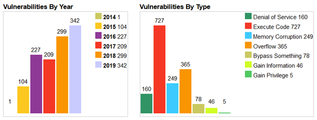

**Малюнок 1:** Уразливості Adobe Acrobat Reader DC

Це важливий показник того, що ми повинні регулярно оновлювати наш PDF Reader, оскільки кількість уразливостей, виявлених останнім часом, дуже лякає. 

## Структура файлу PDF

Щоразу, коли ми хочемо виявити нові вразливості в програмному забезпеченні, ми повинні спочатку зрозуміти протокол або формат файлу, у якому ми намагаємося виявити нові вразливості. У нашому випадку спочатку потрібно детально розібратися з форматом файлу PDF. У цій статті ми розглянемо формат PDF-файлу та його внутрішні особливості.

PDF — це портативний формат документа, який можна використовувати для представлення документів, які містять текст, зображення, мультимедійні елементи, посилання на веб-сторінки тощо. Він має широкий спектр функцій. Специфікація формату файлу PDF є загальнодоступною [тут](http://www.adobe.com/devnet/pdf/pdf_reference.html) і може використовуватися всіма, хто цікавиться форматом файлу PDF. Є майже 800 сторінок документації тільки для формату файлу PDF, тому читати це не те, що потрібно робити навмання.

PDF має більше функцій, ніж просто текст: він може містити зображення та інші мультимедійні елементи, бути захищеним паролем, виконувати JavaScript тощо. Основна структура PDF-файлу представлена на малюнку нижче:

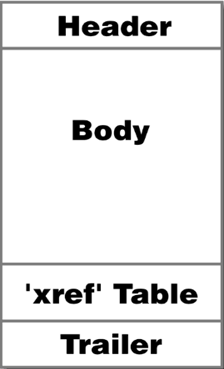

**Малюнок 2:** Структура PDF

Кожен PDF-документ містить такі елементи:

### Header

Це перший рядок PDF-файлу, у якому вказується номер версії використаної специфікації PDF, яку використовує документ. Якщо ми хочемо це з’ясувати, ми можемо скористатися шістнадцятковим редактором або просто використати команду **xxd**, як показано нижче:

```
# xxd temp.pdf | head -n 1
0000000: 2550 4446 2d31 2e33 0a25 c4e5 f2e5 eba7 %PDF-1.3.%……
```

PDF-документ temp.pdf використовує специфікацію PDF 1.3. Символ «%» є коментарем у PDF, тому наведений вище приклад фактично представляє перший і другий рядки як коментарі, що справедливо для всіх документів PDF. Наступні байти взято з вихідних даних нижче: 2550 4446 2d31 2e33 0a25 c4e5 і відповідають тексту ASCII «%PDF-1.3.%». Далі наведено деякі символи ASCII, які використовують недруковані символи (зверніть увагу на крапки «.»), які зазвичай є для того, щоб повідомити деяким програмним продуктам, що файл містить двійкові дані та не повинен розглядатися як 7-бітний ASCII текст. Наразі номери версій мають форму 1.N, де N відповідає діапазону 0-7.

### Body

У тілі PDF-документа є об’єкти, які зазвичай включають текстові потоки, зображення, інші мультимедійні елементи тощо. Розділ «Body  » використовується для зберігання всіх даних документа, які показуються користувачеві.

### xref table

Це таблиця перехресних посилань, яка містить посилання на всі об’єкти в документі. Призначення таблиці перехресних посилань полягає в тому, що вона забезпечує довільний доступ до об’єктів у файлі, тому нам не потрібно читати весь PDF-документ, щоб знайти певний об’єкт. Кожен об’єкт представлено одним записом у таблиці перехресних посилань, яка завжди має довжину 20 байт. Покажемо приклад:

```
 xref
 0 1
 0000000023 65535 f
 3 1
 0000025324 00000 n
 21 4
 0000025518 00002 n
 0000025632 00000 n
 0000000024 00001 f
 0000000000 00001 f
 36 1
 0000026900 00000 n
```

Ми можемо відобразити таблицю перехресних посилань PDF-документа, просто відкривши PDF-файл у текстовому редакторі та прокрутивши донизу документа. У прикладі вище ми бачимо, що у нас є чотири підрозділи (зверніть увагу на чотири рядки, які містять лише два числа). Перше число в цих рядках відповідає номеру об’єкта, а другий рядок – кількість об’єктів у поточному підрозділі. Кожен об’єкт представлений одним записом довжиною 20 байт (включаючи CRLF).

Перші 10 байтів — це зміщення об’єкта від початку документа PDF до початку цього об’єкта. Далі йде пробіл із іншим числом, що визначає номер покоління об’єкта. Після цього є інший роздільник пробілу, після якого йде літера «f» або «n», щоб вказати, чи об’єкт вільний чи використовується.

Перший об’єкт має ідентифікатор ID 0 і завжди містить один запис із номером покоління 65535, який знаходиться на початку списку вільних об’єктів (зверніть увагу на літеру «f», що означає вільний). Останній об’єкт у таблиці перехресних посилань використовує номер покоління 0.

Другий підрозділ має ідентифікатор об’єкта 3 і містить один елемент, об’єкт 3, який починається зі зміщенням 25324 байти від початку документа. Третій підрозділ містить чотири об’єкти, перший з яких має ідентифікатор 21 і починається зі зміщенням 25518 від початку файлу. Інші об'єкти мають наступні номери 22, 23 і 24.

Усі об’єкти позначені прапорцем «f» або «n». Прапорець «f» означає, що об’єкт все ще може бути присутнім у файлі, але позначений як вільний, тому його не слід використовувати. Ці об’єкти містять посилання на наступний вільний об’єкт і номер покоління, який буде використано, якщо об’єкт знову стане дійсним. Прапор «n» використовується для представлення дійсних і використаних об’єктів, які містять зміщення від початку файлу та номер покоління об’єкта.

Зауважте, що нульовий об’єкт вказує на наступний вільний об’єкт у таблиці, об’єкт 23. Оскільки об’єкт 23 також вільний, він сам вказує на наступний вільний об’єкт у таблиці, об’єкт 24. Але об’єкт 24 є останнім вільним об’єктом у таблиці. файл, тому він вказує на нульовий об’єкт. Якщо ми представимо наведену вище таблицю перехресних посилань з кожним номером об’єкта, вона виглядатиме наступним чином:

```
 xref
 0 1
 0000000023 65535 f
 3 1
 0000025324 00000 n
 21 1
 0000025518 00002 n
 22 1
 0000025632 00000 n
 23 1
 0000000024 00001 f
 24 1
 0000000000 00001 f
 36 1
 0000026900 00000 n
```

Номер покоління об’єкта збільшується, коли об’єкт звільняється, тому, якщо об’єкт знову стає дійсним (змінює позначку з «f» на «n»), номер покоління залишається дійсним без необхідності його збільшення. Номер покоління об’єкта 23 дорівнює 1, тому, якщо він знову стане дійсним, номер покоління все одно буде 1, але якщо його знову видалити, номер покоління збільшиться до 2.

Кілька підрозділів зазвичай присутні в PDF-документах, які поступово оновлювалися, інакше має бути лише один підрозділ, який починається з нуля.

### Trailer

Трейлер PDF визначає, як програма, яка читає PDF-документ, повинна знаходити таблицю перехресних посилань та інші спеціальні об’єкти. Усі програми для читання PDF мають починати читати PDF із кінця файлу. Приклад трейлера наведено нижче:

```
trailer
 &amp;amp;lt;&amp;amp;lt;
 /Size 22
 /Root 2 0 R
 /Info 1 0 R
 &amp;amp;gt;&amp;amp;gt;
 startxref
 24212
 %%EOF
```

Останній рядок документа PDF містить кінець рядка файлу «%%EOF». Перед закінченням тегу файлу є рядок із рядком **startxref**, який визначає зміщення від початку файлу до таблиці перехресних посилань. У нашому випадку таблиця перехресних посилань починається зі зсуву 24212 байт. Перед цим рядок **трейлера**, який визначає початок розділу трейлера. Вміст розділів трейлера вбудовано в символи `<<and >>` (це словник, який приймає пари ключ-значення).

Ми бачимо, що розділ трейлера визначає кілька ключів, кожен з яких для певної дії. У розділі трейлера можна вказати такі ключі:

- `/Size [integer]`: визначає кількість записів у таблиці перехресних посилань (також враховуючи об’єкти в оновлених розділах). Використаний номер не повинен бути непрямим посиланням.

- `/Prev [integer]`: визначає зміщення від початку файлу до попереднього розділу перехресного посилання, яке використовується, якщо є кілька розділів перехресного посилання. Номер має бути перехресним посиланням.
- `/Root [dictionary]`: вказує об’єкт посилання для об’єкта каталогу документів, який є спеціальним об’єктом, який містить різні покажчики на різні види інших спеціальних об’єктів (докладніше про це пізніше).
- `/Encrypt [dictionary]`: визначає словник шифрування документа.
- `/Info [dictionary]`: вказує об’єкт посилання для інформаційного словника документа.
- `/ID [array]`: визначає масив двобайтових незашифрованих рядків, які утворюють ідентифікатор файлу.
- `/XrefStm [integer]`: визначає зміщення від початку файлу до потоку перехресного посилання в декодованому потоці. Це присутнє лише у гібридних довідкових файлах, які вказуються, якщо ми також хочемо відкривати документи, навіть якщо програми не підтримують стислі довідкові потоки.

Ми повинні пам’ятати, що початкову структуру можна змінити, якщо ми оновимо PDF-документ пізніше. Оновлення зазвичай додає додаткові елементи в кінець файлу.

## Поступове оновлення

PDF-файл розроблено з урахуванням поступових оновлень, оскільки ми можемо додавати деякі об’єкти в кінець PDF-файлу, не переписуючи весь файл. Завдяки цьому зміни в документі PDF можна швидко зберегти. Нову структуру PDF-документа можна побачити на малюнку нижче:

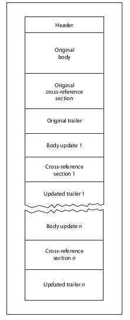

**Figure 3:** PDF structure

Ми бачимо, що PDF-документ все ще містить оригінальний заголовок, тіло, таблицю перехресних посилань і трейлер. Крім того, до PDF-документа додано інші основні розділи, розділи перехресних посилань і trailer . Додаткові розділи перехресних посилань міститимуть лише записи для об’єктів, які були змінені, замінені або видалені. Видалені об’єкти залишаться у файлі, але будуть позначені прапорцем «f». Кожен трейлер має закінчуватися тегом «%%EOF» і містити запис /Prev, який вказує на попередній розділ перехресного посилання.

У PDF версії 1.4 і вище ми можемо вказати запис версії в словнику каталогу документа, щоб замінити версію за замовчуванням із заголовка PDF.

## Приклад

Давайте наведемо простий приклад PDF і проаналізуємо його. Давайте завантажимо зразок PDF-документа [тут](http://http//www.stluciadance.com/prospectus_file/sample.pdf) і проаналізуємо його. Після відкриття цього PDF-документа він виглядає, як показано нижче:

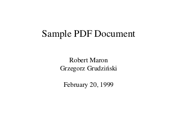

**Figure 4:** PDF document sample

Розділи перехресного посилання та трейлера представлені на малюнку нижче:

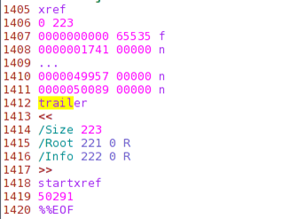

**Figure 5:** Cross-reference and trailer sections

Розділ перехресних посилань було зменшено для ясності. Розділ перехресних посилань містить один підрозділ, який сам містить 223 об’єкти. Розділ трейлера починається зі зміщення байтів 50291, включає 223 об’єкти, де кореневий елемент вказує на об’єкт 221, а елемент інформації вказує на об’єкт 222.

У наступному розділі ми розглянемо основні типи даних структури PDF.

## Типи даних PDF

PDF-документ містить вісім основних типів об’єктів, описаних нижче. Ці типи: booleans, numbers,  strings, names, arrays, dictionaries, streams and the null object Об’єкти можуть бути позначені таким чином, щоб на них могли посилатися інші об’єкти. Позначений (labeled) об’єкт також називають непрямим об’єктом.

### Booleans

There are two keywords: **true** and **false** that represent the boolean values.

### Numbers

There are two types of numbers in a  PDF document: integer and real. An integer consists of one or more  digits optionally preceded by a plus or minus sign. An example of  integer objects may be seen below:

- 123 +123 -123

The real value can be represented  with one or more digits, with an optional sign and a leading, trailing  or embedded decimal point (a period). An example of real numbers can be  seen below:

- 123.0 -123.0 +123.0 123. -.123

### Names

Назви (Names) в документах PDF представлені послідовністю символів ASCII у діапазоні 0x21 – 0x7E. Виняток становлять символи: %, (, ), <, >, [, ], {, }, / та #, перед якими має стояти коса риска. Альтернативним представленням символів є їх шістнадцятковий еквівалент, якому передує символ «#». Існує обмеження щодо довжини елемента імені, який може складати лише 127 байтів.

Під час написання назви для введення назви необхідно використовувати косу риску; скісна риска не є частиною назви, а є префіксом, який вказує на те, що далі є послідовність символів, що представляють назву. Якщо ми хочемо використовувати пробіл або будь-який інший спеціальний символ як частину назви, він повинен бути закодований двозначним шістнадцятковим числом.

Приклади назв можна побачити в таблиці нижче:

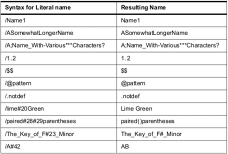

**Figure 6:** PDF names ([source](https://web.archive.org/web/20170830042410/http://wwwimages.adobe.com/www.adobe.com/content/dam/Adobe/en/devnet/pdf/pdfs/PDF32000_2008.pdf))

### Strings

Strings in a PDF document are  represented as a series of bytes surrounded by parenthesis or angle  brackets, but can be a maximum of 65535 bytes long. Any character may be represented by ASCII representation, and alternatively with octal or  hexadecimal representations. Octal representation requires the character to be written in the form ddd, where ddd is an octal number.  Hexadecimal representation required the character to be written in the  form <dd>, where dd is a hexadecimal number.

Рядки в PDF-документі представлені у вигляді серії байтів, оточених дужками або кутовими дужками, але можуть мати максимальну довжину 65535 байт. Будь-який символ може бути представлений у форматі ASCII, а також у вісімковому чи шістнадцятковому вигляді. Вісімкове подання вимагає, щоб символ був записаний у формі ddd, де ddd — вісімкове число. Шістнадцяткове представлення вимагало, щоб символ був записаний у формі `<dd>`, де dd — шістнадцяткове число.

Приклад представлення рядка, вкладеного в круглі дужки, можна побачити нижче:

- `(mystring)`

Приклад представлення рядка, вкладеного в кутові дужки, можна побачити нижче (шістнадцяткове представлення нижче таке ж, як і вище, і читається як «mystring»):

- `<6d79737472696e67>`

Ми також можемо використовувати спеціальні відомі символи, коли представляємо рядок. Це: n для нового рядка, r для повернення каретки, t для горизонтального табулятора, b для зворотного простору, f для подачі форми, ( для лівої дужки, ) для правої дужки та зворотної косої риски.

### Arrays

Arrays in PDF documents are  represented as a sequence of PDF objects, which may be of different  types and enclosed in square brackets. This is why an array in a PDF  document can hold any object types, like numbers, strings, dictionaries  and even other arrays. An array may also have zero elements. An array is presented with a square bracket. An example of an array is presented  below:

- 123 123.0 true (mystring) /myname]

### Dictionaries

Dictionaries in a PDF document are  represented as a table of key/value pairs. The key must be the name  object, whereas the value can be any object, including another  dictionary. The maximum number of entries in a dictionary is 4096  entries. A dictionary can be presented with the entries enclosed in  double angle brackets << and >>. An example of a dictionary  is presented below:

```
&lt;&lt; /mykey1 123

     /mykey2 0.123

     /mykey3 &lt;&lt; /mykey4 true

                         /mykey5 (mystring)

                    &gt;&gt;

&gt;&gt;
```

### Streams

Об’єкт потоку представлено послідовністю байтів і може мати необмежену довжину, тому зображення та інші великі блоки даних зазвичай представляють як потоки. Потоковий об’єкт представлений словниковим об’єктом, за яким ідуть ключові слова stream, за якими слід новий рядок і кінцевий потік.

Приклад об’єкта потоку можна побачити нижче:

```
&lt;&lt;

/Type /Page

     /Length 23 0 R

     /Filter /LZWDecode

&gt;&gt;

stream

…
```

Усі об’єкти потоку мають бути непрямими об’єктами, а словник потоку – прямим об’єктом. Словник потоку вказує точну кількість байтів потоку. Після даних має бути новий рядок і ключове слово endstream.

Загальні ключові слова, які використовуються в усіх словниках потоку, є наведеними нижче (зауважте, що запис «Length» є обов’язковим):

- Length:  How many bytes of the PDF file are used for the stream’s data. If the  stream contains a Filter entry, the Length shall specify the number of  bytes of encoded data.
- Type: The type of the PDF object that the dictionary describes.
- Filter:  The name of the filter that will be applied in processing the stream  data. Multiple filters can be specified in the order in which they shall be applied.
- DecodeParms: A dictionary or an array of dictionaries used by the filters specified  by Filter. This value specifies the parameters that need to be passed to the filters when they are applied. This isn’t necessary if the filters  use the default values.
- F: Specifies the file containing the stream data.
- FFilter: The name of the filter to be applied in processing the data found in the stream’s external file.
- FDecodeParms: A dictionary or an array of dictionaries used by the filters specified by FFilter.
- DL:  Specifies the number of bytes in the decoded stream. This can be used if enough disk space is available to write a stream to a file.
- N: The number of indirect objects stored in the stream.
- First: The offset in the decoded stream of the first compressed object.
- Extends: Specifies a reference to other object streams, which form an inheritance tree.

Дані потоку в потоці об’єктів міститимуть N пар цілих чисел, де перше ціле число представляє номер об’єкта, а друге ціле число представляє зсув у декодованому потоці цього об’єкта. Об’єкти в потоках об’єктів є послідовними, і їх не потрібно зберігати в порядку зростання відносно номера об’єкта. Перший запис у словнику ідентифікує перший об’єкт у потоці об’єктів.

We shouldn’t store the following information in an object stream:

- Stream objects
- Objects with a generation number that is not equal to zero
- Document’s encryption dictionary
- Indirect object of the Length entry in object stream dictionary
- Document catalog, linearization dictionary, page objects

In PDF 1.5, cross-reference  information may be stored in a cross-reference stream instead of in a  cross-reference table. Each cross-reference stream contains the  information equivalent to the cross-reference table and trailer.

### Null object

The null object is represented by a keyword “null.”

### Indirect objects

First of all, we must know that any  object in a PDF document can be labeled as an indirect object. This  gives the object a unique object identifier, which other objects can use to reference the indirect object. An indirect object is a numbered  object represented with keywords “obj” and “endobj.” The endobj must be  present in its own line, but the obj must occur at the end of the object ID line, which is the first line of the indirect object. The object ID  line consists of object number, generation number and keyword “obj.” An  example of an indirect object is as follows:

```
 2 1 obj
12345
endobj
```

 In the example above, we’re creating a  new indirect object, which holds the number 12345 object. By declaring  an object an indirect object, we are able to use it in the PDF document  cross-reference table and reuse it by any page, dictionary and so on in  the document. Since every indirect object has its own entry in the  cross-reference table, the indirect objects may be accessed very  quickly.

The object identifier of the indirect object consists of two parts; the first part is an object number of the current indirect object. The indirect objects don’t need to be numbered sequentially in the PDF document. The second part is the generation  number, which is set to zero for all objects in a newly-created file.  This number is later incremented when the objects are updated.

We can refer to the indirect objects  with indirect reference, which consists of the object number, the  generation number and the keyword R. To reference the above indirect  object, we must write something like below:

- 2 1 R

If we’re trying to reference an undefined object, we’re actually referring to a null object.

## Структура документа

PDF-документ складається з об’єктів, які містяться в основному розділі PDF-файлу. Більшість об’єктів у документі PDF є словниками. Кожна сторінка документа представлена об’єктом сторінки, який є словником, який містить посилання на вміст сторінки. Об’єкти сторінки з’єднані разом і утворюють дерево сторінок, яке оголошується з непрямим посиланням у каталозі документів.

Всю структуру PDF-документа можна представити на малюнку нижче [1]:

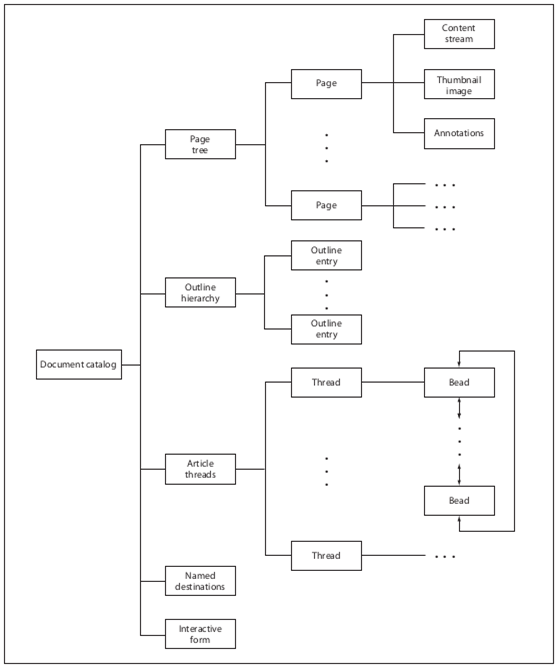

**Figure 7:** Structure of the PDF document ([source](https://www.cvedetails.com/product/32069/Adobe-Acrobat-Reader-Dc.html?vendor_id=53))

На зображенні вище ми бачимо, що каталог документів містить посилання на дерево сторінок, структурну ієрархію, гілки статей (article threads), іменовані місця призначення (named destinations) та інтерактивну форму. Ми не будемо вдаватися в подробиці роботи кожного з цих розділів, але ми представимо лише найважливіший розділ, дерево сторінок.

### Document catalog

На зображенні вище ми бачимо, що каталог документів є коренем об’єктів у документі PDF. Ми вже говорили, що це елемент /Root у розділі Trailer PDF, який визначає каталог документів. Каталог документів містить посилання на інші об’єкти, які визначають вміст документа. Він також містить інформацію, яка визначає, як документ буде відображатися на екрані. Записи в каталозі документів такі:

- /Type: The type of the PDF object the directory describes (in our case, this is  Catalog, since this is the document catalog object).
- /Version: The version of the PDF specification the document was built against.
- /Extensions: Information about the developer extensions in this document.
- /Pages: An indirect reference to the object that is the root of a document’s page tree.
- /Dests: an indirect reference to the object that is the root of the named destinations object.
- /Outlines: an indirect reference to the outline directory object that is the root of the document’s outline hierarchy.
- /Threads: an indirect reference to the array of thread dictionaries that represent the document’s article threads.
- /Metadata: an indirect reference to the metadata stream that contains metadata for the document.

There are many other entries that we  can see being part of the document catalog, but won’t describe them  here. The reader can take a look at our sources for details. An example  of the document catalog is presented below:

```
 1 0 obj

&lt;&lt; /Type /Catalog

/Pages 2 0 R

/PageMode /UseOutlines

/Outlines 3 0 R

&gt;&gt;

endobj
```

### Page tree

Доступ до сторінок документа здійснюється через дерево сторінок, яке визначає всі сторінки документа PDF. Дерево містить вузли, які представляють сторінки документа PDF, які можуть бути двох типів: проміжні intermediate  та листові leaf вузли. Проміжні вузли також називаються вузлами дерева сторінок, тоді як листові вузли називаються об’єктами сторінки.

Найпростіша структура дерева сторінок може складатися з одного вузла дерева сторінок, який безпосередньо посилається на всі об’єкти сторінки (тому всі об’єкти сторінки є листками).

Кожен вузол у дереві сторінок повинен мати такі записи:

- /Type: The type of the PDF object this object describes (in our case it’s **Pages**, since we’re talking about page tree nodes).
- /Parent:  Should be present in all page tree nodes except in root, where this  entry mustn’t be present. This entry specifies its parent.
- /Kids:  Should be present in all page tree nodes except in leafs and specifies  all the child elements directly accessible from the current node.
- /Count: Specifies the number of leaf nodes that are descendants of this node in the subsequent page tree.

Ми повинні пам’ятати, що дерево сторінок не пов’язане ні з чим у PDF-документі, як-от сторінки чи розділи.

Базовий приклад дерева сторінок можна побачити нижче:

```
 2 0 obj
<< /Type /Pages
/Kids [ 4 0 R
10 0 R
24 0 R
]
/Count 3
>>
endobj
4 0 obj
<< /Type /Page
…
>>
endobj
10 0 obj
<< /Type /Page
…
>>
endobj
24 0 obj
<< /Type /Page
…
>>
endobj
```

Дерево сторінок вище визначає об’єкт **Root** з ідентифікатором 2, який має три дочірні об’єкти, об’єкти 4, 10 і 20. Ми також бачимо, що листи дерева сторінок є словниками, які визначають атрибути однієї сторінки. документа. Є кілька атрибутів, які ми можемо використовувати, визначаючи їх для кожної сторінки документа.

Ми побачили основну структуру PDF-документа та його типи даних. Якщо ми хочемо розпочати пошук уразливостей у програмах для читання PDF, нам потрібно змінити PDF-документ таким чином, щоб програма для читання PDF не могла з цим впоратися та вийшла з ладу. Зазвичай, якщо ми можемо призвести до збою програми читання PDF, ми виявили вразливість безпеки, яку ми можемо використати для виконання довільного коду на цільовій машині.

## An example

In this article we’ll take a look at a very simple example of a PDF document. First we need to create the PDF  document so that we’ll then try to analyze it. To create a PDF document, let’s first create a very simple .tex document that contains what can  be seen in the picture below:

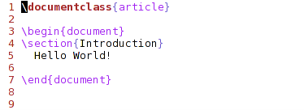

**Figure 8:** Simple document

We can see that the .tex document  doesn’t really contain much. First, we’re defining the document to be an article and then including the contents of the article inside the begin and end document. We’re including a new section with a title (Introduction) and including the static text “Hello World!”. 

We can compile the .tex document into the PDF document with the **pdflatex** command and specifying the name of the .tex file as an argument. The  resulting PDF then looks like this shown in the picture below:

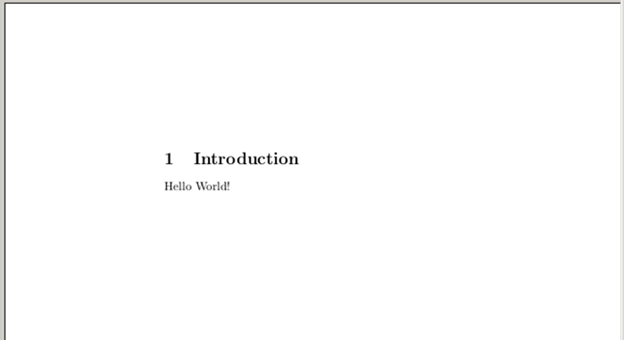

**Figure 9:** Result

We can see that the PDF document  really doesn’t contain very much, only the text we’ve actually included  and no pictures, JavaScript or other elements.

## Example 1

Let’s take a look at the PDF document structure, which is presented in the output below:

```
 %PDF-1.5

%ÐÔÅØ

3 0 obj &lt;&lt;

/Length 138

/Filter /FlateDecode

&gt;&gt;

stream

…

endstream

endobj

10 0 obj &lt;&lt;

/Length1 1526

/Length2 7193

/Length3 0

/Length 8194

/Filter /FlateDecode

&gt;&gt;

stream

…

endstream

endobj

12 0 obj &lt;&lt;

/Length1 1509

/Length2 9410

/Length3 0

/Length 10422

/Filter /FlateDecode

&gt;&gt;

stream

…

endstream

endobj

15 0 obj &lt;&lt;

/Producer (pdfTeX-1.40.12)

/Creator (TeX)

/CreationDate (D:20121012175007+02’00’)

/ModDate (D:20121012175007+02’00’)

/Trapped /False

/PTEX.Fullbanner (This is pdfTeX, Version 3.1415926-2.3-1.40.12 (TeX Live 2011) kpathsea version 6.0.1)

&gt;&gt; endobj

6 0 obj &lt;&lt;

/Type /ObjStm

/N 10

/First 65

/Length 761

/Filter /FlateDecode

&gt;&gt;

stream

…

endstream

endobj

16 0 obj &lt;&lt;

/Type /XRef

/Index [0 17]

/Size 17

/W [1 2 1]

/Root 14 0 R

/Info 15 0 R

/ID [&lt;1DC2E3E09458C9B4BEC8B67F56B57B63&gt; &lt;1DC2E3E09458C9B4BEC8B67F56B57B63&gt;]

/Length 60

/Filter /FlateDecode

&gt;&gt;

stream

…

endstream

endobj

startxref

20215

%%EOF
```

 There’s quite a lot of the necessary  elements to create such a simple PDF document, so we can imagine how a  really complicated PDF document would look. We also need to remember  that all the encoded data streams were removed and replaced with three  dots for clarity and brevity.

Let’s present each of the PDF sections. The header can be seen in the picture below:

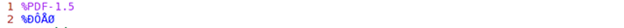

**Figure 10:** PDF header

The body can be seen in the picture below:

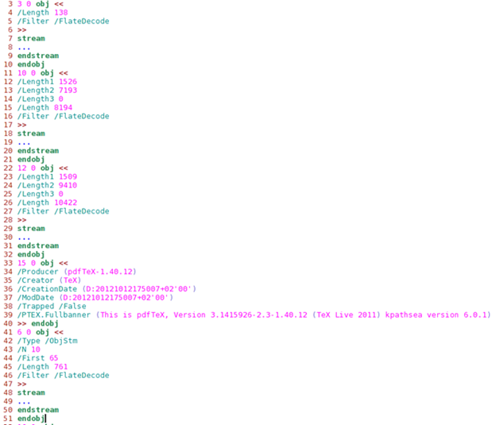

**Figure 11:** PDF body

The xref section can be seen in the picture below:

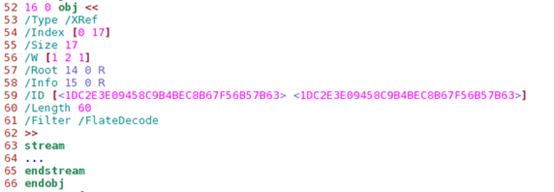

**Figure 11:** PDF xref

And last, the **Trailer** section is represented below:

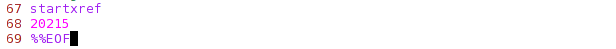

**Figure 12:** PDF trailer

We presented all of the sections of  the PDF document, but we still have to analyze them further. The header  of the PDF document is standard and we don’t really need to talk about  it, and let’s leave the body section for later. 

This is why we must first take a look at the xref section. We can see that the offset from the beginning of  the file to the xref table is 20215 bytes, which in hexadecimal form is  0x4ef7. If we take a look at the hexadecimal representation of the file  as we can get with the xxd tool, we can see what’s presented in the  picture below:

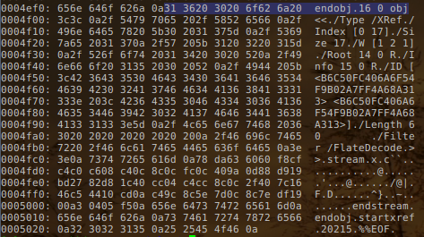

**Figure 13:** Hexadecimal representation of the file

The highlighted bytes lie exactly at  the start of the offset 20125 bytes from the beginning of the file. The  preceding 0x0a bytes is the new line and the current 0x31 bytes  represents the number 1, which is exactly the start of the xref table.  This is why the xref table is represented with an indirect object with  an ID 16 and generation number 0. (This should be the case for all  objects, since we just created the PDF document and none of the objects  have been changed yet. If we look at the whole PDF document we can see  that this is clearly true; all objects have a generation number zero.)

The /Type of the indirect object  classifies this as an xref table. The /Index array contains a pair of  integers for each subsection in this section. The first integer  specifies the first object number in the subsection and the second  integer specifies the number of entries in the subsection. In our  example, the object number is zero and there are 17 entries in this  subsection. This is also specified by the /Size directive. Note that  this number is one larger than the largest number of any object number  in the subsection. The /W attribute specifies an array of integers  representing the size of the fields in cross-reference entry means that  the fields are one byte, two bytes and one byte.

After that, there is the /Root  element that specifies the catalog directory for the PDF document to be  object number 14. The /Info is  the PDF document’s information directory that is contained in object  number 15. The /ID array is required because the Encrypt entry is  present and contains two strings that constitute a file identifier.  Those two strings are used as input to the encryption algorithm. 

The /Length specifies the length of  the encryption key in bits; the value should be multiple of 8 in the  range 40 t o128 (default value is 40). In our case, the length of the  encryption key is 60 bits. The /Filter specifies the name of the  security handler for this document; this is also the security handler  that was used to encrypt the document. In our case, this is FlateDecode, which encodes the data using zlib/deflate compression method.

We can see that the other part of the xref table is compressed, so we can’t really read that. We could, of  course, apply some zlib decompression algorithm over the compressed  data, but there’s a better option. Why would we write a program for that if a tool already exists? With pdftk, we can repair a PDF’s corrupted  xref table with the following command:

- \# pdftk in.pdf output out.pdf

After that, the out.pdf file contains the following xref and trailer sections:

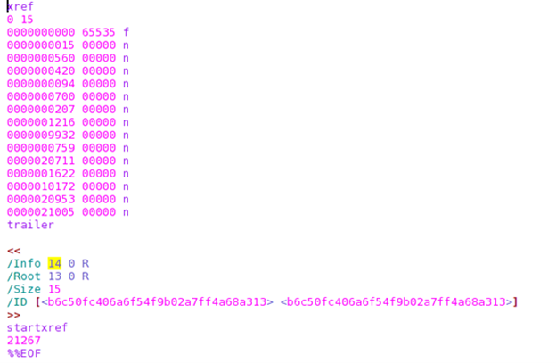

**Figure 14:** xref and trailer

Clearly, the /Root and /Info object  numbers have changed and other stuff as well, but we got the trailer and xref keywords that define the xref table. We can see that there are 14  objects in the xref table.

We could go on and try to decode  other sections as well, but this is out of the scope of this article.  Next, we’ll check the document that isn’t encoded.

## Example 2

Let’s take a look at the sample PDF document that is accessible [here](http://www.stluciadance.com/prospectus_file/sample.pdf). Some of the stream objects are encrypted, but aren’t so important now.  Since we already know how to handle PDF documents, we won’t lose too  many words on simple stuff. 

Let’s open that PDF in a text editor  like gvim and check out the trailer section. We must know by now that  all PDF documents should be read from the end to the start. The trailer  is represented in the picture below:


**Figure 15:** PDF trailer

Let’s also present the Xref with just a few objects (the rest of them were discarded for clarity):

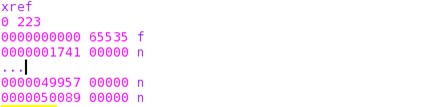

**Figure 16:** PDF xref

We can see that the /Root of the PDF  document is contained in the object with ID 221 and there is additional  information in object 222. The object 221 is the most important object  in the whole document, so let’s present it:

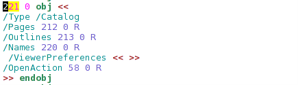

**Figure 17:** Object 221

We can see that the object is indeed  the Document Catalog. The Page Tree object is 212, the Outlines object  is 213, the Names object is 220 and the OpenAction object is 58. We  haven’t talked about any other types than the Page Tree object, so we’ll continue with the Page Tree talk only.

The Page Tree object with an ID 212 is represented in the picture below:


**Figure 18:** Page Tree object

So the 212 object contains the actual pages of the PDF document. It contains 10 pages, which is exactly right (we can check this out if we open the PDF file with any PDF reader and  check the number of pages). 

We know that the Kids attribute  specifies all the child elements directly accessible from the current  node. In our case, there are two direct child nodes with object IDs 66  and 135. Object 66 is presented below:

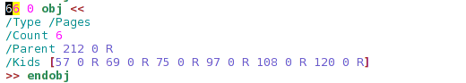

**Figure 19:** Object 66

Object 66 contains other child elements with ID 57, 69, 75, 97, 108 and 120.

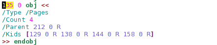

**Figure 20:** Object 135

Object 135 further defines objects 129, 138, 133 and 158.

If we count all the elements, we can  see that there are exactly 10 elements, which means 10 pages out of 10  pages. This further implies that all of the presented objects are in  fact the actual pages of the PDF document and don’t contain any further  children nodes. 

All of the presented objects are  declared similarly, so we won’t look at each of the objects in turn.  Instead, we’ll just take a look at one object, namely the object 57.  Object 57 contains is declared as follows:

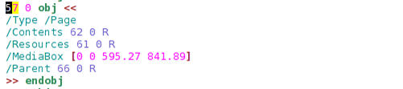

**Figure 21:** Object 57

We can see that the object’s type is  /Page, which directly implies that this is a leaf node that presents one of the pages of the PDF document. The contents of that PDF page can be  found in an object 62:

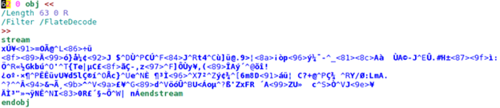

**Figure 22:** Object 62

We can see that the actual content of the PDF page is encoded with the FlateDecode, which is just a simple  zlib encoding algorithm.

## Conclusion

We’ve seen two examples of how PDF  documents can be constructed. With the knowledge we obtained, we can  start generating incorrect PDF documents and feeding them to the various PDF readers. In case that a certain PDF reader crashes while reading a  certain PDF document, that document contains something that the PDF  reader couldn’t handle. This implies the possibility of a vulnerability, which would need to be studied further.

At the end, if the vulnerability  proves to be present, we can even write a PDF document that contains  malicious code that is executed when the victim opens the PDF document  with the vulnerable PDF reader on their target machine. In such cases,  the whole machine might be compromised, since arbitrary malicious code  can be executed just by opening a malicious PDF document.