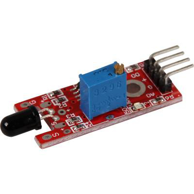

# Модуль контролю пламені KY-028

[Оригінальна інструкція](https://moviltronics.com/wp-content/uploads/2019/10/KY-026.pdf)

## Загальний опис

The connected photo diode is sensitive to the spectral range of light, which is created by open flames.
Digital Out: After detecting a flame, a signal will be outputted
Analoger Ausgang: Direct measurement of the sensor unit
LED1: Shows that the sensor is supplied with voltage
LED2: Shows that the sensor detects a flame

Підключений фотодіод чутливий до спектрального діапазону світла, яке створюється відкритим полум'ям.
Цифровий вихід: після виявлення полум’я буде виведений сигнал
Аналог Ausgang: Пряме вимірювання датчика
LED1: Показує, що на датчик подається напруга
LED2: Показує, що датчик виявляє полум'я

