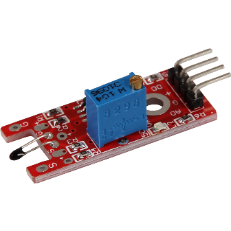
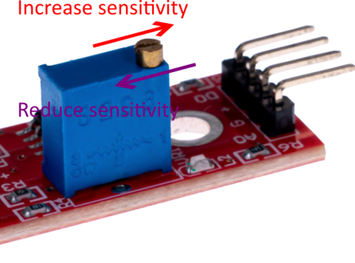
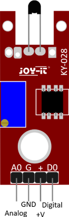
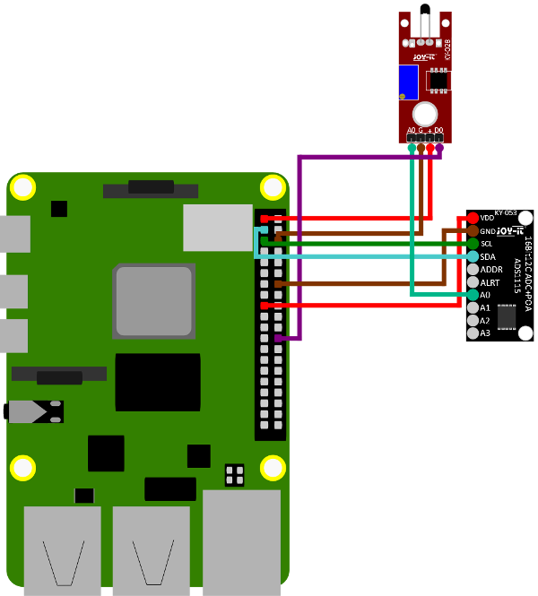
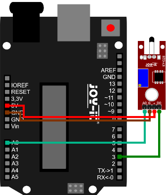

# Модуль вимірювання температури KY-028 з компаратором

[Оригінальна інструкція](https://sensorkit.joy-it.net/en/sensors/ky-028)

## Загальний опис

Цей модуль містить терморезистор NTC ([термістор](https://uk.wikipedia.org/wiki/%D0%A2%D0%B5%D1%80%D0%BC%D0%BE%D1%80%D0%B5%D0%B7%D0%B8%D1%81%D1%82%D0%BE%D1%80), значення опору термістора зменшується з підвищенням температури), який може вимірювати температури в діапазоні від -55°C до +125°C який формує на аналоговому виході. У модулі є вбудований компаратор (порівняння з уставкою), який при перевищені заданого значення видає сигнал на дискретний вихід. 

**Цифровий (дискретний) вихід:** Спрацьовує, якщо виміряна температура вище граничного значення. Граничне значення можна встановити за допомогою потенціометра.

**Аналоговий вихід:** Пряме вимірюване значення датчика

**Світлодіод 1:** Вказує, що на датчик подається напруга.

**Світлодіод 2:** Вказує на те, що граничне значення було перевищено

### Функціональність датчика

Цей датчик має три функціональні компоненти на друкованій платі: передній сенсорний блок, який фізично вимірює навколишнє середовище та виводить його як аналоговий сигнал до другого блоку, підсилювача. Це посилює сигнал залежно від опору, встановленого на поворотному потенціометрі, і посилає його на аналоговий вихід модуля.

Тут слід зазначити: сигнал інвертований. Якщо вимірюється високе значення, це призводить до нижчого значення напруги на аналоговому виході.

Третій блок являє собою компаратор, який перемикає цифровий вихід і світлодіод, коли сигнал падає нижче певного значення. Це значення (і, таким чином, чутливість модуля) можна налаштувати за допомогою поворотного потенціометра:

### Призначення контактів

## Приклади підключення 

### Raspberry PI

| Raspberry Pi     | Sensor         |
| ---------------- | -------------- |
| GPIO 24 [Pin 18] | Digital Signal |
| 3.3 V [Pin 1]    | +V             |
| Ground [Pin 6]   | GND            |
| KY-053 A0        | Analog signal  |

| Sensor        | KY-053         |
| ------------- | -------------- |
| Analog Signal | A0             |
| +V            | 3.3V [Pin 1]   |
| GND           | Ground [Pin 6] |

| Raspberry Pi   | KY-053 |
| -------------- | ------ |
| GPIO 3 [Pin 5] | SCL    |
| GPIO 2 [Pin 3] | SDA    |

**Аналоговий датчик, тому слід враховувати наступне:** Raspberry Pi, на відміну від Arduino, не має аналогових входів тобто немає АЦП (аналогово-цифрового перетворювача), вбудованого в мікросхему Raspberry Pi. Це обмежує Raspberry Pi, якщо ви хочете використовувати датчики, які виводять не цифрові значення, а значення, що постійно змінюється (наприклад: потенціометр -> різне положення = різне значення напруги).

Щоб уникнути цієї проблеми, набір датчиків X40 містить KY-053, модуль з 16-розрядним АЦП, який ви можете використовувати на Raspberry, щоб розширити його за допомогою 4 аналогових входів. Цей модуль підключається до Raspberry Pi через I2C, бере на себе аналогові вимірювання та передає значення в цифровому вигляді на Raspberry Pi.

Тому ми рекомендуємо підключати модуль KY-053 до згаданого АЦП між аналоговими датчиками цього комплекту. Додаткову інформацію можна знайти на [інформаційній сторінці аналогово-цифрового перетворювача KY-053](https://sensorkit.joy-it.net/sensors/ky-053).

The program uses the corresponding ADS1x15 and I2C Python libraries  from Adafruit to control the ADS1115 ADC. These have been published at  the following link https://github.com/adafruit/Adafruit_CircuitPython_ADS1x15 under the [MIT license](https://github.com/adafruit/Adafruit_CircuitPython_ADS1x15/blob/main/LICENSE). The required libraries are **not** included in the download package below.

**Зверніть увагу, що перед використанням цього прикладу вам потрібно ввімкнути I2C на вашому Raspberry Pi.**

### Arduino

| Arduino | Sensor         |
| ------- | -------------- |
| 5 V     | +V             |
| Ground  | GND            |
| Pin 3   | Digital Signal |
| Pin A0  | Analog Signal  |

