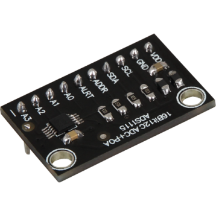
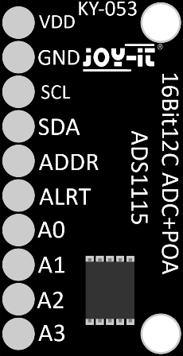
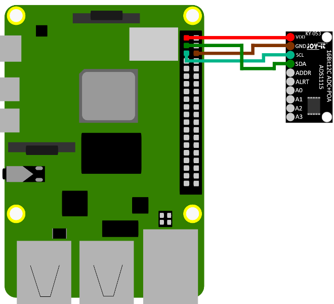
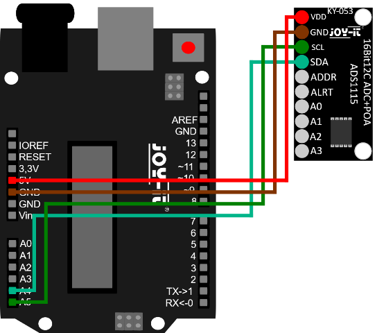

# Модуль АЦП (аналогово-цифрового перетворення) KY-053

[Оригінальна інструкція](https://sensorkit.joy-it.net/en/sensors/ky-053)

## Загальний опис

За допомогою відповідних команд на шині I2C можна вимірювати аналогові значення напруги на 4 входах з точністю до 16 біт. Результат вимірювання кодується на шині I2C.

## Технічні характеристики

| Назва                                    | Значення                   |
| ---------------------------------------- | -------------------------- |
| Interface                                | I2C                        |
| Каналів АЦП                              | 4                          |
| Роздільна здатність                      | 16 Bit                     |
| Програмована частота дискретизації       | 8 to 860 SPS               |
| Робоча напруга (Operating Voltage)       | від 2 V до 5.5 V           |
| Напруга аналогового входу                | від 0 V до робочої напруги |
| I2C логічна напруга                      | від 0 V до 5.5 V           |
| I2C Адреса (Налаштовується перемикачами) | від 0x48 до 0x4B           |
| Типовий робочий струм                    | 150 μA                     |

### Зміна адреси I2C

Цей аналого-цифровий перетворювач (або коротко АЦП) має не тільки одну адресу I2C. Це АЦП, який може мати 4 різні адреси I2C. Їх можна вибирати вільно, але в подальшому описі використовується стандартна адреса 0x48.

У наступній таблиці ви можете побачити всі можливі адреси та як до них можна отримати доступ. Тут головним чином слід зазначити, що за зміну адреси відповідає контакт ADDR АЦП.

Зміна адреси задається перемичкою:

| З        | На      | Address |
| -------- | ------- | ------- |
| ADDR Pin | GND Pin | 0x48    |
| ADDR Pin | VDD Pin | 0x49    |
| ADDR Pin | SDA Pin | 0x4A    |
| ADDR Pin | SCL Pin | 0x4B    |

### Призначення контактів

## Приклади підключення 

### Raspberry PI

| Raspberry Pi   | Sensor |
| -------------- | ------ |
| 3.3 V          | + V    |
| Ground         | GND    |
| GPIO 2 [pin 3] | SCL    |
| GPIO 3 [pin 5] | SDA    |
| -              | ADDR   |
| -              | ALRT   |
| -              | A0     |
| -              | A1     |
| -              | A2     |
| -              | A3     |

На відміну від Arduino, Raspberry Pi не має ні аналогових входів, ні вбудованого аналого-цифрового перетворювача. Це обмежує Raspberry Pi при використанні аналогових датчиків. Щоб продовжувати використовувати аналогові датчики на Raspberry Pi, Raspberry Pi можна розширити на 4 канали АЦП з 12-бітною точністю за допомогою модуля аналого-цифрового перетворювача KY-053.

### Arduino

| Arduino | Sensor |
| ------- | ------ |
| 5V      | + V    |
| Ground  | GND    |
| Pin A5  | SCL    |
| Pin A4  | SDA    |
| -       | ADDR   |
| -       | ALRT   |
| -       | A0     |
| -       | A1     |
| -       | A2     |
| -       | A3     |

Плати Arduino вже мають вбудований 10-розрядний АЦП з 6 каналами. Якщо потрібно більше каналів або вища точність, Arduino можна розширити на 4 канали АЦП з 12-бітною точністю за допомогою модуля аналогово-цифрового перетворювача KY-053.

Існує кілька способів керування цим модулем - бібліотеки ADS1X15 виявилися особливо доступними; вони доступні в Adafruit за адресою [ https: / /github.com/adafruit/Adafruit_ADS1X15 ](https://github.com/adafruit/Adafruit_ADS1X15) за [ліцензією BSD](https://github.com/adafruit/Adafruit_ADS1X15 /blob/master/license.txt).