https://telegram-bot-sdk.readme.io/reference

# Telegram API

[Bots: An introduction for developers](https://core.telegram.org/bots)

Боти-це сторонні програми, які працюють всередині Telegram. Користувачі можуть взаємодіяти з ботами, надсилаючи їм повідомлення, команди та [вбудовані запити](https://core.telegram.org/bots#inline-mode). Ви керуєте своїми ботами за допомогою запитів HTTPS до нашого [Bot API](https://core.telegram.org/bots/api).

### 1. Що я можу зробити з ботами?

​    [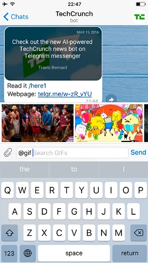](https://core.telegram.org/file/811140081/1/VldnlW70g2I/a140b0216e7d156ebc)

Щоб назвати лише кілька речей, ви можете використовувати ботів для:

- **Отримування індивідуальних сповіщень та новин**. Бот може виступати як розумна газета, надсилаючи вам відповідний вміст, як тільки він буде опублікований.
- **Інтеграція з іншими послугами**. Бот може збагатити чати Telegram вмістом із зовнішніх сервісів.
  [**Gmail -бот**](https://t.me/gmailbot), [**GIF -бот**](https://t.me/gif), [**IMDB -бот**](https : //t.me/imdb), [**Вікі -бот**](https://t.me/wiki), [**Музичний бот**](https://t.me/music), [**бот Youtube**](https://t.me/youtube), [**GitHubBot**](https://t.me/githubbot)
- **Приймайте платежі від користувачів Telegram**. Бот може запропонувати платні послуги або працювати як віртуальна вітрина. [Детальніше»](https://core.telegram.org/bots/payments)
  [**Demo Shop Bot**](https://t.me/shopbot), [**Demo Store**](https://t.me/teststore)
- **Створюйте власні інструменти**. Бот може надавати вам сповіщення, прогнози погоди, переклади, форматування чи інші послуги.
  [**бот Markdown**](https://t.me/Bold), [**бот-наклейка**](https://t.me/sticker), [**бот голосування**](https : //t.me/vote), [**Like bot**] (https://t.me/like)
- **Створюйте одиночні та багатокористувацькі ігри**. Бот може запропонувати багатий [HTML5 experiences](https://core.telegram.org/bots/games), від простих аркад та головоломок до 3D-шутерів та стратегічних ігор у реальному часі.
  [**GameBot**](https://t.me/gamebot), [**Gamee**](https://t.me/gamee)
- **Створення соціальних служб**. Бот може з'єднати людей, які шукають партнерів для розмов на основі спільних інтересів або близькості.
- **Робіть практично що-небудь ще** крім посуду - боти жахливо миють посуд.

### 2. Як працюють боти?

По суті, боти Telegram - це спеціальні облікові записи, для налаштування яких не потрібен додатковий номер телефону. Користувачі можуть взаємодіяти з ботами двома способами:

- Надсилати повідомлення та [команди](https://core.telegram.org/bots#commands) ботам, відкриваючи з ними чат або додаючи їх до груп.
- Надсилати запити безпосередньо з поля введення, ввівши @username бота та запит. Це дозволяє надсилати вміст із [вбудованих ботів (inline bots)](https://core.telegram.org/bots/inline) безпосередньо в будь-який чат, групу чи канал.

Повідомлення, команди та запити, надіслані користувачами, передаються програмному забезпеченню, яке працює на ваших серверах. Наш посередницький сервер обробляє за вас все шифрування та зв’язок із Telegram API. Ви спілкуєтесь з цим сервером за допомогою простого HTTPS-інтерфейсу, який пропонує спрощену версію API Telegram. Ми називаємо цей інтерфейс нашим [Bot API](https://core.telegram.org/bots/api).

> Детальний опис Bot API доступний на [цій сторінці »](https://core.telegram.org/bots/api)

### 3. Як я можу створити бота?

​    [](https://core.telegram.org/file/811140327/1/zlN4goPTupk/9ff2f2f01c4bd1b013)

Для цього є… бот. Просто поговоріть з [BotFather](https://t.me/botfather) (описано [нижче](https://core.telegram.org/bots#6-botfather)) і виконайте кілька простих кроків. Після того, як ви створили бота і отримали маркер авторизації, перейдіть до [посібника з Bot API](https://core.telegram.org/bots/api), щоб побачити, чого ви можете навчити свого бота.

> Ви також можете ознайомитися з деякими **прикладами коду** [тут »](https://core.telegram.org/bots/samples)

### 4. Чим боти відрізняються від людей?

- Боти не мають однайн статусу та не мають останніх побачених часових відміток, замість цього на інтерфейсі відображається мітка **"бот"**.

- Боти мають обмежену хмарну пам’ять - застарілі повідомлення можуть бути видалені сервером незабаром після їх обробки.
- Боти не можуть ініціювати розмову з користувачами. Користувач **повинен** або додати їх до групи, або надіслати їм спочатку повідомлення. Люди можуть використовувати посилання `t.me/<ім'я_бота>` або пошук імені користувача, щоб знайти свого бота.
- Імена користувачів ботів завжди закінчуються на "Bot" (наприклад, [@TriviaBot](https://t.me/triviabot), [@GitHub_bot](https://t.me/githubbot)).
- При додаванні до групи, боти не отримують усі повідомлення за замовчуванням (див. [Режим конфіденційності](https://core.telegram.org/bots#privacy-mode)).
- Боти ніколи не їдять, не сплять і не скаржаться (якщо чітко не запрограмовані на інше).

### 5. Бот-бонуси

Боти Telegram багато в чому унікальні-ми пропонуємо [два](https://core.telegram.org/bots#keyboards) [види](https://core.telegram.org/bots#inline-keyboards-and-on-the-fly-updating) клавіатур, додаткові інтерфейси для [команд за замовчуванням](https://core.telegram.org/bots#global-commands) та [deep linking](https://core.telegram.org /bots#deep-linking), а також [форматування тексту](https://core.telegram.org/bots/api#formatting-options), [інтегровані платежі](https://core.telegram.org/bots#payment-platform) тощо.

#### Inline mode

Користувачі можуть взаємодіяти з вашим ботом за допомогою [**вбудованих запитів (inline queries)**](https://core.telegram.org/bots/api#inline-mode) прямо з **поля введення тексту** у **будь-якому** чаті. Все, що їм потрібно зробити, - це створити повідомлення з ім’ям користувача вашого бота, а потім ввести запит.

Отримавши запит, ваш бот може повернути деякі результати. Як тільки користувач торкається одного з них, він надсилається до поточного відкритого чату користувача. Таким чином, люди можуть запитувати вміст у вашого бота в будь -якому своєму чаті, групі чи каналі.

Перегляньте цей [блог](https://telegram.org/blog/inline-bots), щоб побачити зразок вбудованого бота в дії. Ви також можете спробувати ботів [@sticker](https://t.me/sticker) та [@music](https://t.me/music), щоб переконатися в цьому.

[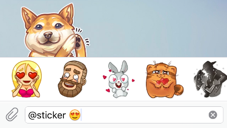](https://core.telegram.org/file/811140558/1/POjp00-nHqE/50d0312845a05e6da9)

Ми також реалізували простий спосіб для вашого бота [перемикатися між режимами вбудованого та PM-режиму](https://core.telegram.org/bots/inline#switching-inline-pm-modes).

> [Докладніше про вбудований режим »](https://core.telegram.org/bots/inline)

#### Payment platform

You can use bots to **accept payments** from Telegram users around the world.

- Send invoices to **any chat**, including to groups and channels.
- Create invoices that can be **forwarded** and used by **multiple buyers** to order things.
- Use [inline mode](https://core.telegram.org/bots/inline) to help users show your goods and services to their friends and communities.
- Allow **tips** from users with preset and custom amounts.
- Accept payments from users on mobile or **desktop apps**.
- Try [@ShopBot](https://t.me/shopbot) to create a test invoice – or start a message with `@ShopBot ...` in any chat for an **inline invoice**.
- Check out [Demo Shop](https://telegram.org/teststore) for an example of a [Telegram Channel](https://telegram.org/tour/channels) used as **virtual storefront**.

<video class="blog_video_player tl_blog_vid_autoplay" onclick="videoTogglePlay(this)" autoplay="autoplay" loop="" controls="controls" muted="muted" poster="/file/464001377/1/0o3vSvY22g8.123356/deb4ed6951d780f7b7" style="max-width: 400px;" title="If your pizza place can't deliver a clone army, you're buying pizza from the wrong shop." alt="Video: Ordering a pizza through a Telegram channel">

 </video>

> [Read more about the Payments Platform »](https://core.telegram.org/bots/payments)

#### Gaming platform

Боти можуть запропонувати своїм користувачам **ігри HTML5** пограти в одиночку або змагатися один з одним у групах та спілкуванні один на один. Платформа дозволяє вашому боту відстежувати **високі бали** за кожну гру, що грається в кожному чаті. Кожного разу, коли в грі з’являється новий лідер, інші учасники чату отримують повідомлення про необхідність посилити його.

​    [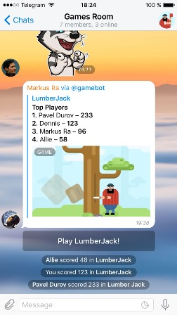](https://core.telegram.org/file/811140306/1/dkciuEDbpxU.193188/8a0a21b6e9d111be4c)    [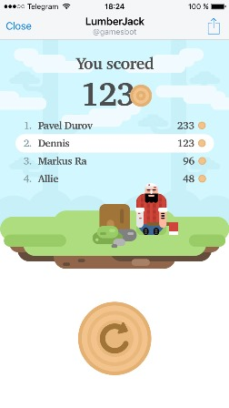](https://core.telegram.org/file/811140426/1/ZCw3vu_v8s0.109692/04efd9e88644939a4f)

Оскільки базовою технологією є HTML5, ігри можуть бути будь-якими-від простих аркад та головоломок до багатокористувацьких 3D-шутерів та стратегічних ігор у реальному часі. Наша команда створила для вас кілька простих демоверсій:

- [Math Battle](https://t.me/gamebot?game=MathBattle)
- [Lumberjack](https://t.me/gamebot?game=Lumberjack)
- [Corsairs](https://t.me/gamebot?game=Corsairs)

Ви також можете переглянути бота [**@gamee**](https://t.me/gamee), у якому є більше 20 ігор.

> [Докладніше про ігрову платформу »](https://telegram.org/blog/games)

#### Клавіатури

Звичайно, традиційних чат-ботів можна навчити розуміти людську мову. Але іноді вам потрібен більш офіційний ввід від користувача - і тут **користувацькі клавіатури** можуть стати надзвичайно корисними.

Щоразу, коли ваш бот надсилає повідомлення, він може передати спеціальну клавіатуру з попередньо визначеними параметрами відповіді (див. [ReplyKeyboardMarkup](https://core.telegram.org/bots/api/#replykeyboardmarkup)). Додатки Telegram, які отримають повідомлення, відображатимуть вашу клавіатуру користувачеві. Натискання будь-якої з кнопок негайно надішле відповідну команду. Таким чином ви можете значно спростити взаємодію користувача з вашим ботом.

Наразі ми підтримуємо текст та смайли для ваших кнопок. Ось кілька прикладів користувацької клавіатури:

​    [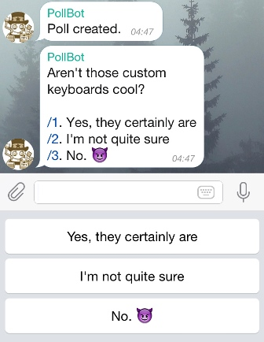](https://core.telegram.org/file/811140184/1/5YJxx-rostA/ad3f74094485fb97bd)     [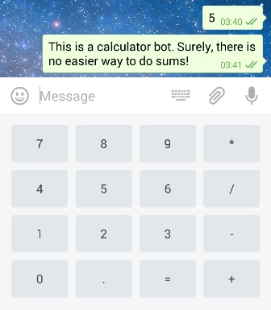](https://core.telegram.org/file/811140880/1/jS-YSVkDCNQ/b397dfcefc6da0dc70)     [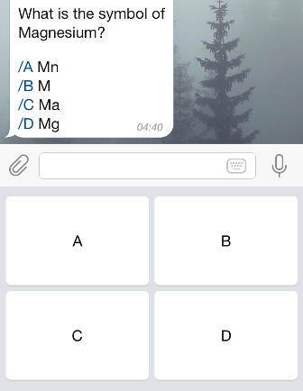](https://core.telegram.org/file/811140733/2/KoysqJKQ_kI/a1ee46a377796c3961)

> Для отримання додаткової технічної інформації про користувацькі клавіатури зверніться до [посібника з API Bot](https://core.telegram.org/bots/api) (див. [sendMessage](https://core.telegram.org/bots/api#sendmessage))).

#### Inline keyboards and on-the-fly updating

Бувають випадки, коли ти вважаєш за краще робити щось, не надсилаючи жодних повідомлень у чат. Наприклад, коли користувач змінює налаштування або гортає результати пошуку. У таких випадках можна використовувати вбудовані клавіатури, інтегровані безпосередньо в повідомлення, до яких вони належать.

На відміну від користувацьких клавіатур відповідей, натискання кнопок на вбудованих клавіатурах не призводить до надсилання повідомлень у чат. Натомість вбудовані клавіатури підтримують кнопки, які працюють за лаштунками:  [callback buttons](https://core.telegram.org/bots/2-0-intro#callback-buttons), [URL buttons](https://core.telegram.org/bots/2-0-intro#url-buttons) та [switch to inline buttons](https://core.telegram.org/bots/2-0-intro#switch-to-inline-buttons).

 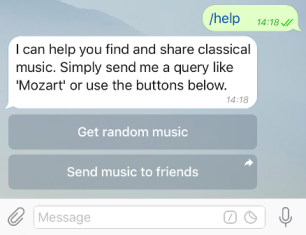  

 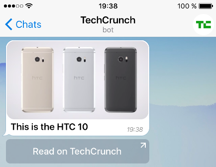

Коли використовуються кнопки зворотного виклику, ваш бот може оновити наявні повідомлення (або лише клавіатури), щоб чат залишався охайним. Перевірте ці зразки ботів, щоб побачити вбудовані клавіатури в дії: [@music](https://t.me/music), [@vote](https://t.me/vote), [@like](https : //t.me/like).

> [Докладніше про вбудовані клавіатури та редагування на ходу »](https://core.telegram.org/bots/2-0-intro#new-inline-keyboards)

#### Commands

Команди представляють більш гнучкий спосіб спілкування з вашим ботом. Може використовуватися такий синтаксис:

```
/command
```

Команда завжди повинна починатися з символу `/` і не може містити більше 32 символів. Команди можуть використовувати латинські літери, цифри та підкреслення. Ось кілька прикладів:

```
/get_messages_stats
/set_timer 10min Alarm!
/get_timezone London, UK
```

Повідомлення, які починаються з косою рискою, завжди передаються боту (разом із відповідями на його повідомлення та повідомленнями, які @згадують бота за іменем користувача). Додатки Telegram будуть:

- Пропонувати список підтримуваних команд з описами, коли користувач вводить `/` (щоб це працювало, вам потрібно надати список команд для [BotFather](https://core.telegram.org/bots#6 -батько)). Натискання на команду у списку негайно надсилає команду.
- Показувати додаткову кнопку **(/)** у полі введення у всіх чатах з ботами. При натисканні на нього вводиться `/` і відображається список команд.
- Виділяти **/команди ** у повідомленнях. Коли користувач натискає виділену команду, команда надсилається відразу.

​    [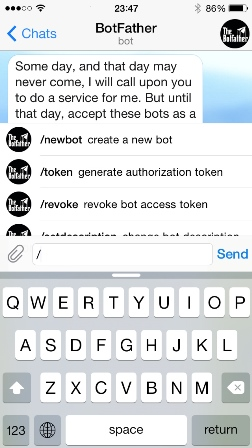](https://core.telegram.org/file/811140845/2/rNUxpcGDeQU/05eaaf20b0dbaf9cb3)     [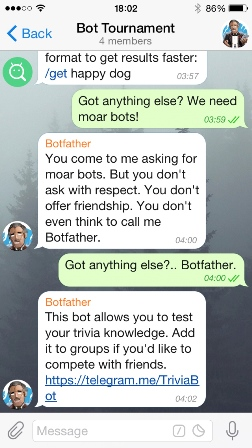](https://core.telegram.org/file/811140315/2/gf7_D2HbeyM/e3ca2de4de7918f826)     [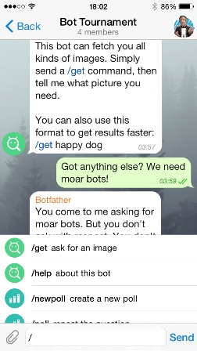](https://core.telegram.org/file/811140029/1/s5zv4fbWdhw/a04aefa0ee0557f16a)

Якщо в групі є кілька ботів, можна додати імена користувачів ботів до команд, щоб уникнути плутанини:

```
/start@TriviaBot
/start@ApocalypseBot
```

Це робиться автоматично, коли команди вибираються за допомогою списку пропозицій. Пам'ятайте, що ваш бот повинен вміти обробляти команди, за якими слідує його ім'я користувача.

##### Global commands

Щоб полегшити користувачам навігацію в бот-мультивсесвіті, ми просимо всіх розробників підтримати кілька основних команд. Додатки Telegram матимуть **ярлики інтерфейсу** для цих команд.

- **/start ** - розпочинає взаємодію з користувачем, наприклад, надсилаючи привітальне повідомлення. Цю команду також можна використовувати для передачі додаткових параметрів боту (див. [Глибоке зв'язування](https://core.telegram.org/bots#deep-linking))
- **/help** - повертає повідомлення довідки. Це може бути короткий текст про те, що може зробити ваш бот, і список команд.
- **/settings** - (якщо є) повертає налаштування бота для цього користувача та пропонує команди для редагування цих налаштувань.

Користувачі побачать кнопку **Start**, коли вони вперше відкриють розмову з вашим ботом. Посилання **Help** та **Settings** будуть доступні в меню на сторінці профілю бота.


​    [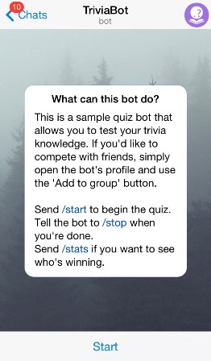](https://core.telegram.org/file/811140979/2/yD8AphHbahk/7662d14f4e0442ae3a)     [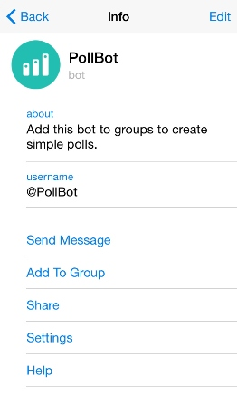](https://core.telegram.org/file/811140479/2/1c2zUWhR7sA/98889b2a45f8e42a35)

#### Formatting: bold, italic, fixed-width text and inline links

Ви можете використовувати жирний, курсивний або текст із фіксованою шириною, а також вбудовані посилання у повідомленнях своїх ботів. Клієнти Telegram нададуть їх відповідно.

> [Детальніше читайте в посібнику Bot API »](https://core.telegram.org/bots/api#formatting-options)

#### Privacy mode

Ботів часто додають до груп, щоб покращити спілкування між користувачами, наприклад надаючи новини, сповіщення від зовнішніх служб або додаткові функції пошуку. Особливо це стосується груп, пов’язаних з роботою. Тепер, коли ви ділитесь групою з ботом, ви, як правило, запитуєте себе: "Як я можу бути впевненим, що маленький негідник не продає мою історію чату моїм конкурентам?" Відповідь - **режим конфіденційності (privacy mode)**.

Бот, що працює в режимі конфіденційності, не буде отримувати всіх повідомлень, які люди надсилають до групи. Натомість він отримає лише:

- Повідомлення, які починаються з косої риски `/` (див. [Команди](https://core.telegram.org/bots#commands) вище)
- Відповіді на повідомлення власного бота
- Службові повідомлення (люди додані або видалені з групи тощо)
- Повідомлення з каналів, де він є учасником

З одного боку, це допомагає деяким з нас краще спати вночі (у нашому капюшоні з фольги), з іншого - дозволяє розробнику бота економити багато ресурсів, оскільки їм не потрібно обробляти десятки тисяч нерелевантних повідомлень кожен день.

Режим конфіденційності увімкнено за замовчуванням для всіх ботів, крім ботів, які були додані до групи як **адміністратори** (адміністратвині боти завжди отримують усі повідомлення). Його можна вимкнути, щоб бот отримував усі повідомлення, як звичайний користувач (бота потрібно буде **повторно додати** до групи, щоб ця зміна набула чинності). Ми рекомендуємо робити це лише у випадках, коли для роботи вашого бота вкрай необхідно - користувачі завжди можуть побачити поточні налаштування конфіденційності бота у списку учасників групи. У більшості випадків використання параметра [примусова відповідь](https://core.telegram.org/bots/api#forcereply) для повідомлень бота повинно бути більш ніж достатнім.

[Тож які саме повідомлення отримає мій бот?»](https://core.telegram.org/bots/faq#what-messages-will-my-bot-get)

#### Deep linking

Боти Telegram мають механізм [глибокого зв’язування](https://en.wikipedia.org/wiki/Deep_linking), який дозволяє передавати додаткові параметри боту при запуску. Це може бути команда, яка запускає бота, або маркер авторизації для підключення облікового запису Telegram користувача до його облікового запису на якійсь зовнішній службі.

Кожен бот має посилання, яке відкриває розмову з ним у Telegram - `https://t.me/<bot username>`. До цього посилання можна додати параметри **start** або **startgroup** зі значеннями до 64 символів. Наприклад:

```
https://t.me/triviabot?startgroup=test
```

Дозволені `A-Z`,` a-z`, `0-9`,` _` та `-`. Ми рекомендуємо використовувати [base64url](https://en.wikipedia.org/wiki/Base64#The_URL_applications) для кодування параметрів у двійковому та інших типах вмісту.

Перейшовши за посиланням з параметром **start**, ви відкриєте розмову один на один з ботом, на якій буде показано кнопку START на місці поля введення. Якщо використовується параметр **startgroup**, користувачеві буде запропоновано вибрати групу, до якої потрібно додати бота. Як тільки користувач підтверджує дію (натискає кнопку START у своєму додатку або вибирає групу, до якої потрібно додати бота), ваш бот отримає повідомлення від цього користувача у такому форматі:

```
/start PAYLOAD
```

`PAYLOAD` означає значення параметра **start** або **startgroup**, яке було передано у посиланні.

##### Deep linking Example

Припустимо, що веб-сайт example.com хоче надсилати сповіщення своїм користувачам через бота Telegram. Ось що вони можуть зробити, щоб увімкнути сповіщення для користувача з ID `123`.

1. [Створіть бота](https://core.telegram.org/bots#6-botfather) із відповідним ім’ям користувача, напр. @ExampleComBot
2. Налаштуйте [веб -хук](https://core.telegram.org/bots/api#setwebhook) для вхідних повідомлень
3. Створіть випадковий рядок достатньої довжини, напр. `$memcache_key = "vCH1vGWJxfSeofSAs0K5PA "`
4. Вставте значення `123` з ключем` $memcache_key` у Memcache на 3600 секунд (одна година)
5. Покажіть нашому користувачеві кнопку `https://t.me/ExampleComBot?Start = vCH1vGWJxfSeofSAs0K5PA`
6. Налаштуйте процесор webhook для запиту Memcached за допомогою параметра, який передається у вхідних повідомленнях, що починаються з `/start`. Якщо ключ існує, запишіть ідентифікатор chat_id, переданий вебхуку, як **telegram_chat_id** для користувача `123`. Видаліть ключ з Memcache.
7. Тепер, коли ми хочемо надіслати сповіщення користувачу `123`, перевірмо, чи є у нього поле **telegram_chat_id**. Якщо так, використовуйте метод [sendMessage](https://core.telegram.org/bots/api#sendmessage) у [Bot API](https://core.telegram.org/bots/api), щоб надіслати їх повідомлення в Telegram.

#### Location and Number

Деякі боти потребують додаткових даних від користувача, щоб працювати належним чином. Наприклад, знання розташування користувача допомагає отримати більш релевантні географічні результати. Номер телефону користувача може бути дуже корисним для інтеграції з іншими сервісами, такими як банки тощо.

Боти можуть запитувати у користувача **місцезнаходження** та **номер телефону** за допомогою спеціальних кнопок. Зауважте, що кнопки номера телефону та запиту на місцезнаходження працюватимуть лише у приватних чатах.

[](https://core.telegram.org/file/811140587/2/jaowDLZg2l0/5ba3f7d7fd5c6c28dc)

При натисканні цих кнопок клієнти Telegram відображатимуть сповіщення про підтвердження, яке повідомляє користувачеві, що станеться.

> [Manual: Number and location buttons »](https://core.telegram.org/bots/api#keyboardbutton)


### 6. BotFather

> Jump to top to learn everything about [Telegram bots »](https://core.telegram.org/bots#)

[BotFather](https://t.me/botfather) is the one bot to rule them all. It will help you create new bots and change settings for existing ones.

#### Creating a new bot

Use the **/newbot** command to create a new bot. The  BotFather will ask you for a name and username, then generate an  authorization token for your new bot. 

The **name** of your bot is displayed in contact details and elsewhere.

The **Username** is a short name, to be used in mentions and t.me links. Usernames are 5-32 characters long and are case  insensitive, but may only include Latin characters, numbers, and  underscores. Your bot's username **must** end in 'bot', e.g. 'tetris_bot' or 'TetrisBot'.

The **token** is a string along the lines of `110201543:AAHdqTcvCH1vGWJxfSeofSAs0K5PALDsaw` that is required to authorize the bot and send requests to the [Bot API](https://core.telegram.org/bots/api). Keep your token secure and store it safely, it can be used by anyone to control your bot.

#### Generating an authorization token

If your existing token is compromised or you lost it for some reason, use the **/token** command to generate a new one.

#### Botfather commands

The remaining commands are pretty self-explanatory:

- **/mybots** — returns a list of your bots with handy controls to edit their settings
- **/mygames** — does the same for your games

**Edit bots**

- **/setname** – change your bot's name.
- **/setdescription** — change the bot's **description**, a short text of up to 512 characters, describing your bot. Users will  see this text at the beginning of the conversation with the bot, titled  'What can this bot do?'.
- **/setabouttext** — change the bot's **about info**, an even shorter text of up to 120 characters. Users will see this text  on the bot's profile page. When they share your bot with someone, this  text is sent together with the link.
- **/setuserpic** — change the bot's profile pictures. It's always nice to put a face to a name.
- **/setcommands** — change the list of commands supported by your bot. Users will see these commands as suggestions when they type `/` in the chat with your bot. Each command has a name (must start with a  slash ‘/’, alphanumeric plus underscores, no more than 32 characters,  case-insensitive), parameters, and a text description. Users will see  the list of commands whenever they type '/' in a conversation with your  bot.
- **/deletebot** — delete your bot and free its username.

**Edit settings**

- **/setinline** — toggle [inline mode](https://core.telegram.org/bots/inline) for your bot.
- **/setinlinegeo** - request location data to provide [location-based inline results](https://core.telegram.org/bots/inline#location-based-results).
- **/setjoingroups** — toggle whether your bot can be  added to groups or not. Any bot must be able to process private  messages, but if your bot was not designed to work in groups, you can  disable this.
- **/setprivacy** — set which messages your bot will  receive when added to a group. With privacy mode disabled, the bot will  receive all messages. We recommend leaving [privacy mode](https://core.telegram.org/bots#privacy-mode) enabled. You will need to re-add the bot to existing groups for this change to take effect.

**Manage games**

- **/newgame** — create a new [game](https://core.telegram.org/bots/games).
- **/listgames** — get a list of your games.
- **/editgame** — edit a game.
- **/deletegame** — delete an existing game.

> Please note, that it may take **a few minutes** for changes to take effect.

#### Status alerts

Millions choose Telegram for its speed. To stay competitive in this  environment, your bot also needs to be responsive. In order to help  developers keep their bots in shape, Botfather will send status alerts  if it sees something is wrong.

We will be checking the number of replies and the request/response  conversion rate for popular bots (~300 requests per minute: but don't  write this down as the value may change in the future). If we get  abnormally low readings, you will receive a notification from Botfather.

##### Responding to alerts

By default, you will only get one alert per bot per hour. Each alert has the following buttons:

- **Fixed.** Use this if you found an issue with your bot and fixed it. If you press the fix button, we will resume sending  alerts in the regular way so that you can see if your fix worked within  5-10 minutes instead of having to wait for an hour.
- **Support.** Use this to open a chat with [@BotSupport](https://t.me/botsupport) if you don't see any issues with your bot or if you think the problem is on our side.
- **Mute for 8h/1w.** Use this if you can't fix your bot  at the moment. This will disable all alerts for the bot in question for  the specified period of time. We do not recommend using this option  since your users may migrate to a more stable bot. You can unmute alerts in your bot's settings via Botfather.

##### Monitored issues

We will currently notify you about the following issues:

**1.**

```
Too few **private messages** are sent compared to previous weeks: **{value}**
```

Your bot is sending much fewer messages than it did in the previous  weeks. This is useful for newsletter-style bots that send out messages  without prompts from the users. The larger the value, the more  significant the difference. 

**2.**

```
Too few replies to incoming **private messages**. Conversion rate: **{value}**
```

Your bot is not replying to all messages that are being sent to it  (the request/response conversion rate for your bot was too low for at  least two of the last three 5-minute periods). To provide a good user  experience, please respond to all messages that are sent to your bot.  Respond to *message* [updates](https://core.telegram.org/bots/api#update) by calling *send…* methods (e.g. [sendMessage](https://core.telegram.org/bots/api#sendmessage)).

**3.**

```
Too few answers to **inline queries**. Conversion rate: **{value}**
```

Your bot is not replying to all inline queries that are being sent to it, calculated in the same way as above. Respond to *inline_query* [updates](https://core.telegram.org/bots/api#update) by calling [answerInlineQuery](https://core.telegram.org/bots/api#answerinlinequery).

**4.**

```
Too few answers to **callback queries**. Conversion rate: **{value}**
Too few answers to **callback game queries**. Conversion rate: **{value}**
```

Your bot is not replying to all callback queries that are being sent  to it (with or without games), calculated in the same way as above.  Respond to *callback_query* [updates](https://core.telegram.org/bots/api#update) by calling [answerCallbackQuery](https://core.telegram.org/bots/api#answercallbackquery).

> Please note that the status alerts feature is still being tested and will be improved in the future.

------

That's it for the introduction. You are now definitely ready to proceed to the [**BOT API MANUAL**](https://core.telegram.org/bots/api).

If you've got any questions, please check out our [**Bot FAQ »**](https://core.telegram.org/bots/faq)