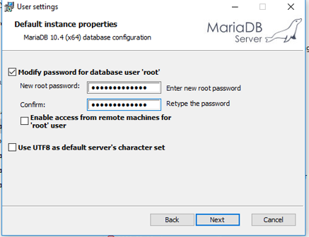
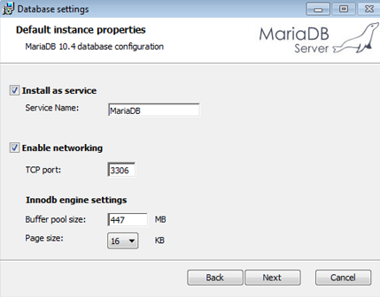
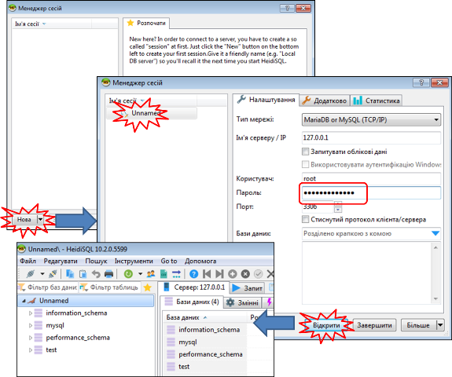

|      | [на сторінку курсу Програмна інженеія в системах управління](../README.md) |
| ---- | ------------------------------------------------------------ |
|      |                                                              |

# Довідник зі встановлення та налаштування пакетів у Windows

## Встановлення MariaDB

- Перейти на  [сторінку завнтаження](https://downloads.mariadb.org/mariadb/10.4.12/)

- Вибрати і завантажити версію для вашої платформи, наприклад `mariadb-10.4.12-win32.msi`

- Запустити інсталятор на виконання.

- Усе виставляти за замовченням, на сторінці встановлення паролю вказати пароль для користувача 'root'

  

- Залишити за замовченням налаштування запуску як сервісу. Це дасть можливість з'єднуватися не запускаючи СКБД. 

- всі інші налаштування залишити за замовченням

- Після інсталяції, запустити для перевірки клієнта `HeidiSQL`, який ставиться разом з MariaDB. Створити нову сесію, ввести пароль для `root`, після чого натиснути "Відкрити". Повинно з'явитися внутрішня структура з системними базами даних.  

  

-  

## Встановлення MySQL

1. Зайти на сторінку [дистрибутиви](https://dev.mysql.com/downloads/installer/)

2. Вибрати дистрибутив. При проханні зареєструватися можна вибрати "No thanks, just start my download".

3. Вибрати Developer defaults.

4. Усі опції за замовченням, ввести пароль для користувача `root`.

   

5. Встановити як Winodws Service.

   

6. Далі `Execute`.

   

7. 

|      | [на сторінку курсу Програмна інженеія в системах управління](../README.md) |
| ---- | ------------------------------------------------------------ |
|      |                                                              |