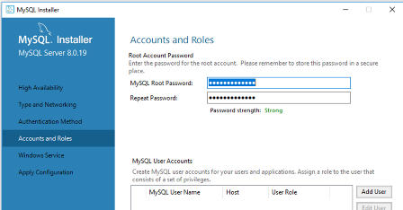
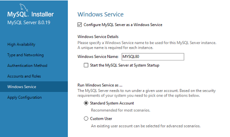
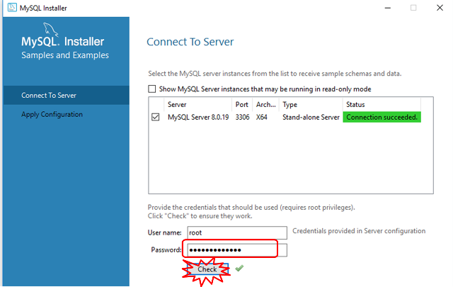

# Встановлення та налаштування пакетів Windows

## Встановлення MariaDB

1. Завантажити [звідси](https://downloads.mariadb.org/mariadb/10.4.12/)
2. Усе виставляти за замовченням, вказати пароль для root

## Встановлення MySQL

1. Зайти на сторінку [дистрибутиви](https://dev.mysql.com/downloads/installer/)

2. Вибрати дистрибутив. При проханні зареєструватися можна вибрати "No thanks, just start my download".

3. Вибрати Developer defaults.

4. Усі опції за замовченням, ввести пароль для користувача `root`.

   

5. Встановити як Winodws Service.

   

6. Далі `Execute`.

   

7. 

