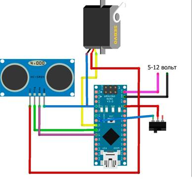

**Тема. Розумний будинок.** **Автоматичний смітник.**

**Розділ 1. Розробка вимог до системи та ПЗ.**

**Загальний опис проектованої системи.**

Сконструйований смітник із підручних матеріалів, в якому відкивається кришка за допомогою жесту руки; працює за допомогою батарейок та має режим енергозбереження

**Вимоги до функцій та задач.**

Система повинна передбачати виконання наступних функцій:

1. неперервне     вимірювання руху з періодичністю не більше ніж 2 секунди
2. відстеження рівня інфрачервоного випромінювання     в полі зору датчика

**Бібліотеки**

Low-Power - https://www.arduino.cc/reference/en/libraries/low-power/

### Вимоги до видів забезпечення.

#### Вимоги до апаратного забезпечення

Буде використано наступні засоби
 *(список може бути доповнений чи змінений в процесі розробки):

- Arduino Nano, або     аналогічі
- датчики     наближення від 0 до 2 метрів або сонар
- Батарейний     відсік
- Серво-привід
- Корпус
- Резистор

**Приблизна схема проекту**

**Учасники бригади****:**

*Ioнов Олeксандр*