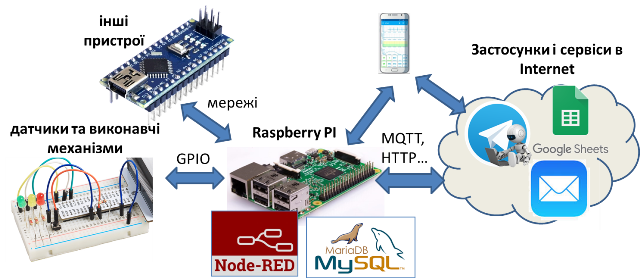
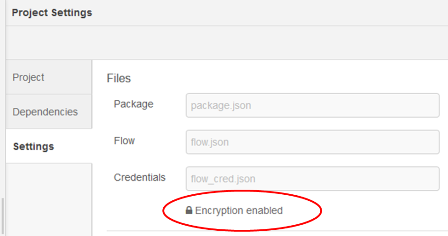
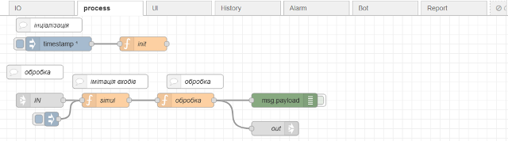
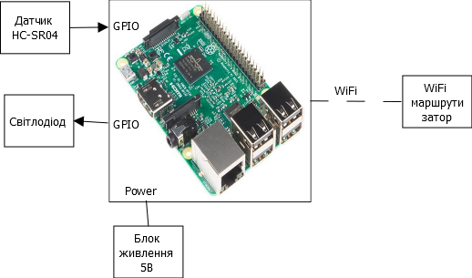
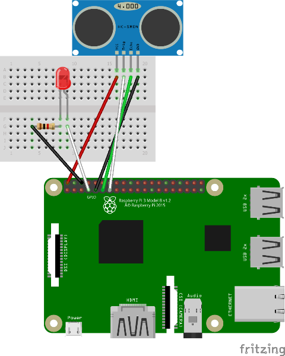
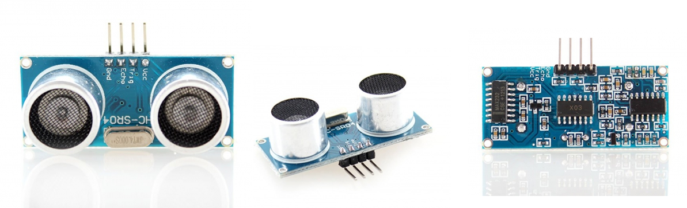

| [Курсовий](README.md) | [на сторінку курсу Програмна інженерія в системах управління](../README.md) |
| --------------------- | ------------------------------------------------------------ |
|                       |                                                              |

# Методичні вказівки до виконання курсової роботи з дисципліни "Програмна інженерія в системах управління" 

# Вступ

Частиною життєвого циклу будь якої системи керування є доопераційні стадії, які завершуються введенням в дію на об'єкті. Ці стадії як правило включають розробку вимог, створення проекту, реалізацію та введення в дію. Саме процесами цих стадій більшою мірою займаються інженери.    

У даному курсі програмна інженерія передбачає різноманітні діяльності в процесах життєвого циклу програмного забезпечення систем керування. Але для таких систем великою, а навіть більшою мірою характерні діяльності по розробці, впровадженню та експлуатації апаратних засобів. Системи на базі Інтернету речей не є виключенням і передбачають як роботи над програмною, так і апаратною частиною. Курсова робота є певним наближенням до такої проектної діяльності, так як відтворює основні процеси доопераційних стадій життєвого циклу, хоч і не в повному обсязі. Слід відмітити, що на старших курсах проектуванню систем керування приділяється велика увага як на рівні бакалаврату так і в магістратутрі, а кваліфікаційна робота бакалавра передбачає розробку проекту для автоматизованих системи керування технологічними процесами (АСКТП). Тому там будуть розглядатися методи, інструменти та стандарти, які характерні саме для розробки АСКТП. Для даного ж проекту характерне суттєве спрощення процесів проектної діяльності.      

# 1. Мета і завдання курсового проектування

**Мета курсової роботи** – зміцнення і поглиблення теоретичних знань з дисципліни “Програмна інженерія в системах управління” а також набуття практичних навичок в розробці проектів IoT-рішень та впровадженні їх частин в умовах командної роботи.  

Курсова робота передбачає розробку проекту та впровадження його частин для IoT рішення в різноманітних областях життєдіяльності людини, у тому числі автоматизація будинків, будівель, ЖКХ, транспорті, торгівлі, дозвіллі і т.д. У якості класичного прототипу структури IoT-рішення розглядається система, яка включає в себе наступні апаратні частини:

- Raspberry PI у якості центрального компоненту системи
- підключену до GPIO периферію - датчики, виконавчі механізми, інші елементи
- за необхідності інші пристрої, підключені через цифрові шини GPIO, USB або Ethernet
- додаткові матеріали та монтажні компоненти
- мобільні пристрої (смартфони, планшети, тощо)
- шлюзи, маршрутизатори для виходу в Інтернет
- інші компоненти за необхідності     

рис.1. Типова структура системи IoT для курсового проекту

Передбачається, що в класичній структурі будуть застосовуватися наступні програмні компоненти:

- Node-RED у якості середовища програмування для Raspberry PI та надання Веб-інтерфейсу
- MariaDB у якості реляційної бази даних для збереження інформації
- Google Sheet або віддалену базу даних (наприклад MongoDB) у якості зберігання даних для звітності в Інтернеті
- Telegram у якості месенжера для взаємодії з системою
- мобільні браузери та застосунки для роботи з MQTT 
- поштові сервіси   

Структура у курсовій роботі може відрізнятися від наведеної на рис.1 і включати інші апаратні та програмні компоненти. Рішення про структуру приймає керівник команди проекту (тімлід) за узгодженням з викладачем.   

Передбачається що над одним проектом IoT-рішення працює команда здобувачів з 3-х або 4-х осіб. Усі стадії життєвого циклу повинні проводитися через репозиторій у GitHub з доступом до нього викладача.

# 2. Тематика курсових робіт

Умовно теми курсових робіт можна розділити на кілька типів:

- розробка системи віддаленого контролю та керування об'єктом
- розробка прототипу установки керування
- спеціальна тема що стосується розробки програмного компоненту або комплексу 

Також можлива тема що стосується підготовки нового компоненту для навчального курсу.

Передбачається що тема придумується студентами самостійно. Якщо тема не була придумана вчасно, викладач формує її самостійно.  

Нижче наведені приклади тем для орієнтування . Якщо тема була вибрана раніше, викладач може відмовити у виборі вказаної теми.

- Дистанційне (через Інтернет) керування побутовим кондиціонером.
- Контроль присутності та переміщення осіб в кімнатах.
- Контроль відвідування студентами аудиторій.
- Керування поливом ґрунту в залежності від його вологості.

- Розробка електронного гіда по лабораторії з використанням доповненої реальності
- Розробка розподіленої системи голосової взаємодії з користувачем для гіда
- Менеджер приймання/обліку на складі 
- Домашній менеджер 
- Керування конвеєром з селектуванням яблук за кольором
- Автоматичне фотографування об'єктів на відстані з вказаним діапазоном температури.
- Розумна тележка: контроль переміщення тележки з використанням RFID
- Керування нахилом платформи по слідкуванні за об'єктом

Приклад додаткових теми за профілем:

- Використання MarkDown та pandoc для автоматизації створення документів великими командами. 
- Використання MarkDown для автоматизації створення файлів Moodle
- Конвертування історичних даних з файлів історії систем супервізорного керування в InfluxDB.
- Організація відображення таблиць в Node-RED з використанням `UI-table` 
- Конвертування мнемосхем з систем супервізорного керування в формат SVG
- Створення людино-машинного інтерфейсу з використанням SVG
- Створення застосунку що автоматизує розділення відеофайлів на кілька частин за вказаними тайм-кодами. 
- Створення теми для GitHub pages
- Робота Node.js з OLEAutomation/ActiveX (з прикладом реалізації проекту)
- Інтеграція Node.js з Excel (з прикладом реалізації проекту)
- Інтеграція Node.js з ODBC (з прикладом реалізації проекту)
- імітаційна модель об'єкту керування (різної складності і призначення) для виконання в хмарному середовищі

Тему можна вибрати попередньо провівши аналіз існуючих наробок. **У проекті дозволяється використовувати загальнодоступні наробки за умови посилання на джерела і вказівки об'єму використаної інформації.**  У випадку вибору існуючого рішення, необхідно визначитися з вдосконаленнями або добавленнями до вибраної теми.  

# 3. Порядок видачі завдання на курсову роботу

Протягом перших двох тижнів семестру студенти організуються в команди по 3-4 особи, вибирають собі технічного керівника (**тімліда**) та тему. Ця тема обговорюється з викладачем - керівником проекту та затверджується. Якщо команда та тема протягом цього терміну не була придумана їх формує викладач. Студент може відмовитися від роботи в команді, тоді він отримує (вибирає) індивідуальне завдання. Команда може складатися з більшої кількості осіб, якщо проект буде надто великим для малої команди. У будь якому випадку кількість людей в команді і тема узгоджується з викладачем 

# 4. Зміст курсової роботи та послідовність виконання

## 4.1. Зміст курсової роботи по розробці IoT рішень

Структура роботи по розробці IoT рішень має наступний вигляд:

Вступ

1) Розробка вимог до системи та ПЗ.
   1.1. Загальний опис проектованої системи.
   1.2. Вимоги до функцій та задач.
   1.3. Вимоги до видів забезпечення. 

2) Розробка архітектури та необхідної проектної документації.
   2.1. Технічна структура системи (структура комплексу технічних засобів).
   2.2. Принципові схеми та схеми підключення. 
   2.3. Відомість та опис апаратних засобів.
   2.4. Програмна структура системи.

3) Методика перевірки та засоби тестування.
   3.1. Методика перевірки підсистеми Edge-рівня.
   3.2. Методика перевірки функцій архівування.
   3.3. Методика перевірки аналітичних сервісів.
   3.4. Методика перевірки діалогових сервісів. 
4) Розробка та налагодження програмного забезпечення та супровідної документації.
   4.1. ПЗ для Edge-рівня.
   4.2. Схеми інформаційної взаємодії 
   4.3. ПЗ для хмарних рішень
   4.4. WEB-інтерфейси (локальний для Edge та глобальний)

5) Список використаних джерел.

Структура для інших типів тем узгоджується індивідуально. У будь якому випадку вона має мати вступну частину, та кілька розділів. 

## 4.2. Послідовність виконання роботи

Орієнтовний календарний графік для виконання курсових робіт по розробці IoT рішень має вигляд як в таблиці 1.

Таблиця 1. Календарний графік виконання курсової роботи

| Опис робіт                                                   | Терміни виконання (тижні семестру) | Примітки                          |
| ------------------------------------------------------------ | ---------------------------------- | --------------------------------- |
| Формування команди. Формування та уточнення теми. Формування репозиторію проекту на GitHub. | 1,2                                | Вся команда.                      |
| Пошук існуючих рішень в Інтернеті. Розробка та формування першого варіанту технічних вимог. | 3,4                                | Вся команда.                      |
| Формування першого варіанту переліку необхідних засобів.  Розробка методик перевірки ПЗ для Edge-рівня. | 5,6                                | Розділення   робіт за напрямками. |
| Розробка першого варіанту схем підключення технічних засобів. Розробка та тестування першого варіанту ПЗ для Edge-рівня. Розробка локального Веб-інтерфейсу. Правки по вимогам. | 7,8                                | Розділення   робіт за напрямками. |
| Розробка методик перевірки функцій архівування. Реалізація функцій збереження в локальній БД. Правки по вимогам. Реалізація функцій збереження у віддаленій БД. Синхронізація локальної та віддаленої БД. Правки по вимогам. | 9,10                               | Розділення   робіт за напрямками. |
| Розробка методик перевірки аналітичних сервісів. Реалізація функцій звітності. Правки по вимогам. | 11,12                              | Розділення   робіт за напрямками. |
| Методика перевірки діалогових сервісів. Розробка та перевірка чат-ботів. Розробка ВЕБ-сервісів для віддаленого контролю та керування.  Правки по вимогам. | 13,14                              | Розділення   робіт за напрямками. |
| Доробка проекту. Доробка вимог. Доробка документації.        | 15-18                              | Вся команда.                      |
| Захист проекту.                                              | 19, 20                             | Вся команда.                      |

Після формування теми та команди, тімлід створює приватний або публічний репозиторій у GitHUB. Рішення про тип репозиторію вибирає команда. До репозиторію власник у співавтори (collaborator) приєднує усіх учасників команди. У випадку приватного репозиторію, до нього крім виконавців команди добавляються викладачі та ментори (якщо такі є).

У файлі README.md кореня репозиторію описується загальна інформація про проект, команду і вихідні джерела. Також там вказується загальний план роботи. Далі усі обговорення з керівником проекту відбуваються через Issue. 

Далі послідовність робіт може відбуватися в тому порядку, який наведено в таб.1. Роботи можуть виконуватися усіма учасниками паралельно над різними частинами проекту або одночасно над кожною.

Варто нотувати усі ідеї а також знайдені рішення або в окремих файлах розділу або в Issue, щоб ці матеріали були доступні усім членам команди. 

**Увага! При створенні проекту Node-RED що доступний в GitHub обов'язково зробіть його шифрування, інакше усі налаштування доступу будуть доступні усім, хто має доступ до читання репозиторію.**   

рис.2. Налаштування шифрування в проекті Node-RED

## 4.3. Керування проектом з використанням засобів GitHub  

Для кожного розділу проекту у GitHub створюється `Projects`, у межах якого створюється карта `card`, яка формує завдання на певний період часу в межах розділу; це завдання може ставити тім-лід проекту; рекомендується завдання давати на термін не більше одного тижня, і робити щотижневий контроль;

При запуску завдання на виконання, рекомендується створювати з нього `Issue` (питання для обговорень), у цьому випадку процес проходження завдання по етапам автоматизується

Після завершення завдання, або при необхідності обговорення, черговий коміт завантажується (push) в глобальний репозиторій, де створюється запит на пул (pull request); до issue чіпляється конкретний запит на пул. Після виконання усіх необхідних змін і обговорень, коміт мерджиться. Після мерджа в глобальному репозиторію усі співавтори мають зробити вивантаження (fetch) і локальний мердж, щоб їх локальні репозиторії були синхронні з локальними.      

Для ефектинового керування рекомендується використовувати `Milestones` (відмітки часу) та `Labels` (мітки) 

## 4.4. Послідовність роботи за шаблоном  

Можна скористатися готовим шаблоном курсового проекту, для того щоб спростити діяльність по розробці проекту. Нижче описано як це можна зробити.

Кожен із співавторів має створити власну гілку у локальних репозиторіях, у межах якої буде працювати  над виконанням конкретного завдання. Далі тімлід (хто створив проект) у локальному репозиторію створює папки:

- `code` для розміщення там усіх файлів коду (з Node-RED)
- `project` для розміщення там файлів записки
- у кожній з цих папок створюється файл README.md, де описується зміст папки

Тімлід робить наступні дії:

-  у локальному репозиторію у папку `code`  добавляє файл flow.json з [прикладу](https://github.com/pupenasan/pikursexmpl) 
- у локальному репозиторію у папку `project` добавляє 4 файли по одному для кожного розділу проекту `rozd1.md` ... `rozd4.md`, і 4 папки для розміщення файлів рисунків `media1` ... `media4`

- у кожен файл розділу вставляє відповідний зміст з [прикладу](https://pupenasan.github.io/ProgIngContrSystems/Курсовий/kursexample.html)
- у файлі README записує:
  - назву проекту
  - членів команди
  - опис проекту

- робить `commit` і `push` в гілку `master` репозиторію на ГітХаб

Усі учасники роблять `fetch` і `merge` з локальними файлами.

Також Ви можете подивитися запис відео консультації щодо рекомендації до послідовності розробки [за посиланням](https://youtu.be/UlS5FfCuYiQ).

## 4.5. Декомпозиція (розбивання на частини) функцій   

Для того щоб спростити реалізацію складних функцій та задач і розділити їх між кількома учасниками, варто розділити їх на дрібніші (зробити декомпозицію). 

Так, наприклад, вибір апаратних засобів та розробку архітектури варто виділити як окрему діяльність (окремий процес), якою буде займатися одна особа. Це дасть змогу зосередитися на цій діяльності і зробити окремі вимоги для її перевірки.    

Розробку програмної частини також можна поділити на умовно-незалежні частини. Наприклад:

- робота з входами/виходами (датчики/ВМ)
- реалізація алгоритмів (керування, контролю, перетворення і т.ін)  
- робота з базами даних
- фронт-енд (реалізація ВЕБ-інтерфейсу для користувача)
- взаємодія з месенжерами
- взаємодія з віддаленими клієнтами  

Однак при декомпозиції треба враховувати, що компоненти повинні взаємодіяти між собою для вирішення загальних задач. Тому, окрім самого виділення програмних компонентів необхідно визначитися з їх інтерфейсною частиною і методикою перевірки (див.5.4).

На рис.3 показано як можна зробити декомпозицію програмних функцій на частини в Node-RED. Для цього можна використати кілька механізмів. По перше, окремий набір функцій можна винести в окремий потік. Тоді при необхідності зв'язку між потоками можна скористатися вузлами типу `link`. У цьому випадку треба наперед визначити який формат повідомлень буде передаватися між потоками. По-друге, можна скористатися глобальними контекстами, куди з одних потоків буде записуватися інформація, а з інших зчитуватися.      

  

рис.3. Приклад декомпозиції програми в Node-RED на частини. 

# 5. Вказівки до виконання окремих розділів роботи

## 5.1. Вступна частина та список використаних джерел

У вступі необхідно вказати загальну ідею проекту і коротко описати існуючі подібні рішення, які доступні в загальному доступі в Інтернеті. Також треба описати загальні рішення які були використані в проекті та спосіб організації роботи. При командній роботі вказується члени команди та їх діяльність. Кожен член команди вписує у свій екземпляр проекту детальну інформацію про його місце в проекті. 

У списку використаних джерел необхідно перерахувати тільки ті посилання на ресурси, з яких була використана інформація при розробці проекту. Слід зазначити, що якщо в роботі є запозичення без вказівки на першоджерело, то це вважається плагіатом і у випадку виявлення такого здобувачу може бути поставлена незадовільна оцінка. У випадку використання запозичення то в місці його використання  необхідно вказувати посилання на джерело.  

## 5.2. Розробка вимог до системи та ПЗ

Вимоги до проектованої системи - це той опис який означує кінцеву систему з точки зори замовника. Тобто тут необхідно перерахувати усі функції, які очікуються від проектованої системи та обмеження. 

За формування вимог до системи і за кінцеву її роботу відповідає тімлід. На скільки він деталізовано продумає вимоги і їх означить залежить їх реалізація.     

Вимоги до проектованої системи включають три підрозділи.

1. Загальний опис проектованої системи.
2. Вимоги до функцій та задач.
3. Вимоги до видів забезпечення. 

У загальному описі  проектованої системи вказується кілька речень для того щоб описати функціональність системи без деталізації. Наприклад:

> Система повинна забезпечувати відображення в реальному часі, архівування та звітування відстані до об'єкту з можливістю онлайн контролю та керування. Контроль та керування повинно відбуватися через Телеграм-бот. Відстань повинна фіксуватися в архівах з можливістю подальшого їх перегляду.      

У вимогах до функцій і задач деталізується функціональність до рівня, достатнього щоб видавати завдання виконавцю конкретної функції з можливістю її подальшої перевірки. Наприклад: 

> Система повинна передбачати виконання наступних функцій:
>
> 1. неперервне вимірювання відстані до об'єкту (в сантиметрах) з періодичністю не більше ніж 1 секунда
> 2. індикація відстані через інтенсивність світіння світлодіоду
> 3. відображення плинного значення відстані до об'єкту на локальному WEB-інтерфейсі та віддалено за допомогою Телеграм-бота та мобільного застосунку:
>    - на локальному WEB-інтерфейсі та мобільному застосунку періодично, 1 раз/сек у вигляді кругової діаграми і числового значення в сантиметрах;
>    - у Телеграм-боті передбачити режими: відображення по запиту плинного значення; включення/відключення періодичного оповіщення 1 раз/5 секунд за командою;
> 4. архівування значень відстані до об'єкту в локальну базу даних середнє за останні 10 секунд
> 5. відображення розміщення об'єкту у вигляді трендів за останні 60 секунд на:
>    - локальному ВЕБ-інтерфейсі
>    - мобільному застосунку
>    - Google Worksheet
> 6. оповіщення через Телеграм-бот та пошту, якщо відстань менше заданої уставки
> 7. формування звітів на Веб-сайті раз/годину або за запитом з відображенням:
>    - у табличному та графічному вигляді відстань за останню годину
>    - показники мінімальної/максимальної та середньої відстані до об'єкту  

У вимогах до видів забезпечення вказуються обмеження, які накладаються на створювану систему та умови її роботи в навколишньому середовищі. У реальному житті ці обмеження можуть диктуватися умовами роботи, вимогами замовника, бюджетом і т.ін. Вимоги вказуються для апаратного та програмного забезпечення.     

Приклад вимог до апаратного забезпечення:

> Необхідно використання наступних засобів: 
>
> - Raspberry PI3 (або RPI4), або аналогічний
> - датчики наближення від 0 до 2 метрів
> - наявне підключення RPI до мережі Internet через мережу WiFi або Ethernet
> - смартфон або планшет з Android > V5
> - прототип буде знаходитися у кімнатних умовах 

Приклад вимог до програмного забезпечення та Інтернет-сервісів:

> Необхідне використання наступних програмних засобів:
>
> - Node-RED як база для розробки ПЗ + dashboard для локального веб-інтерфейсу
> - система керування базами даних, розгорнута на  RPI (MariaDB)
> - хмарний застосунок Google Sheets для аналітики  
> - веб-сайт для онлайн доступу для звітів на базі Google Sites
> - Telegram-бот для віддаленого контролю та керування 
> - `IoT MQTT Panel` для віддаленого контролю та керування 

Для класичного варіанту проекту є перелік апаратних засобів, **обов'язкових** для використання в розроблювальній системі (один комплект на всю команду):

- Raspberry PI3 (або RPI4), або аналогічний
- фізичні датчики, що передбачається підключати до RPI (у залежності від завдання)
- підключення до мережі Internet
- смартфон або планшет з Android > V5 

Перелік можливих додаткових апаратних засобів (не обмежено списком):

- Arduino або аналогічні
- мережні компоненти (адаптери, шлюзи, мости, перетворювачі, маршрутизатори)
- спеціалізовані засоби керування, моніторингу, сигналізації, тощо 
- засоби віртуальної та доданої реальності

Для класичного варіанту проекту є перелік програмних засобів, **обов'язкових** для використання в розроблювальній системі:

- Node-RED як база для розробки ПЗ + dashboard для локального веб-інтерфейсу
- система керування базами даних, розгорнута на  RPI (MariaDB/MySQL або інша)
- хмарний сервіс для збереження даних для онлайн-звітів (пропонується на базі Google Sheets)  
- веб-сайт для онлайн доступу для звітів (Google Sites або розгорнутий в `heroku`)
- сервіси онлайн доступу для керування та контролю, один або обидва з запропонованих варіантів:
  - Telegram-бот (можна інші боти, наприклад Facebook) з доступом `Telegram Bot API` 
  - App на Android/iOS (наприклад `IoT MQTT Panel` або `MQTTool`) з доступом до RPI по MQTT 
- веб-сторінки GitHub

Перелік можливих додаткових програмних засобів (не обмежено списком):

- інші сервіси в Інтернеті, доступні по HTTP API 

- сервіс [IFTTT](https://ifttt.com/)
- VNC для локального та віддаленого доступу до RPI
- віртуальна машина з Raspbian для перевірки
- хмарні сховища (пропонується Dropbox, Google складніше) 

## 5.3. Розробка архітектури та необхідної проектної документації

Усі рішення які стосуються вибору технічних та програмних компонентів та їх взаємодії описуються саме в цьому розділі. За детальні технічні рішення може відповідати окрема особа, яка добре орієнтується в апаратній частині. Але загальні структура розробляється усією командою на чолі з тімлідом.   

У класичному варіанті роботи розділ складається з 4-х підрозділів:  

   2.1. Технічна структура системи (структура комплексу технічних засобів).
   2.2. Принципові схеми та схеми підключення. 
   2.3. Відомість та опис апаратних засобів.
   2.4. Програмна структура системи.

На початкових стадіях проектування підбирають основні технічні та програмні компоненти. Велика частина з них вже сформована у вигляді вимог до апаратного та програмного забезпечення. Інші визначаються у процесі створення структур та розробки схем.    

Для початку розробляють технічну структуру системи. Приклад дуже простої технічної структури показаний на рис.4.

рис.4. Приклад технічної структури системи

На структурній схемі показують апаратні компоненти системи та їх зв'язок звичайними лініями або стрілками. У випадку необхідності вказівки напрямку передачі інформації його показують стрілками. У місці підключення каналу зв'язку (підведення лінії або стрілки) вказується тип підключення. Наприклад `GPIO` вказує на те, що це один з вбудованих каналів GPIO. 

У описі структурної схеми деталізується призначення кожного компоненту та вибраний спосіб зв'язку. Також описуються технічні характеристики кожного компоненту. Перелік компонентів іде у відомість апаратних та програмних засобів де вказуються технічні деталі.      

Структурна схема слугує тільки для вибору компонентів і представлення загального технічного рішення. Для реалізації системи необхідні деталі підключення, які проробляються з використанням принципових схем. Принципові схеми показують яким чином з'єднані елементи формують електричні ланюцги. За принциповими електричними схемами можна зрозуміти як працює той чи інший контур вимірювання чи керування та живлення. Також в процесі розробки принципових схем визначаються додаткові матеріали та елементи, такі як (але не обмежено переліком) провідники, резистори, діоди, монтажні плати, кабелі та інше.      

Приклад принципової схеми підключення датчиків та виконавчих механізмів до RPI3 показана на рис.5.  

рис.5. Приклад принципової електричної схеми. 

У описі принципової схеми пояснюється кожний контур та вибрані елементи.

За принциповими електричними схемами розробляють монтажні схеми, за якими виконується підключення. Приклад монтажної схеми підключення плати з прототипом показана на рис.6.

рис.6. Приклад монтажної схеми

Усі необхідні компоненти та матеріали вписуються у відомість апаратних засобів з посиланням на місце їх опису в доступних інформаційних ресурсах. 

Таб.2. Приклад відомості апаратних засобів

| Найменування                           | Кількість | Опис                                                         | Примітка                                                  |
| -------------------------------------- | --------- | ------------------------------------------------------------ | --------------------------------------------------------- |
| Raspberry PI 3                         | 1         | https://arduino.ua/prod1449-raspberry-pi-3-b                 | У комплекті з корпусом, блоком живлення та картою пам'яті |
| Макетна плата 170                      | 1         | https://arduino.ua/prod238-maketnaya-plata-mikro-bespaechnaya-syb-170-170-tochek |                                                           |
| Ультразвуковий датчик відстані HC-SR04 | 1         | https://arduino.ua/prod182-yltrazvykovoi-datchik-rasstoyaniya-hc-sr04 |                                                           |
| Світлодіод                             | 1         |                                                              |                                                           |
| Резистор 1 кОм                         | 1         |                                                              |                                                           |
| Провід dupont (мама-тато)              | 6         |                                                              | 2 чорні, червоний, зелений і білий                        |

Усі основні компоненти, зокрема Raspberry PI, кожен датчик, виконавчий механізм, монтажні плати та інша периферія та спосіб його використання необхідно описати у цьому розділі. Наприклад, нижче наведений опис ультразвукового датчика відстані HC-SR04.

> **Ультразвуковий датчик HC-SR04** - це стабільний та  точний ultrasonic sonar (сонар) датчик відстані який не має "сліпих  зон". Може вимірювати відстань від 0 см до 1500мм, точність досягає 3  мм.

рис.7. Зовнішній вигляд датчика HC-SR04 з різних боків

> ​	**Характеристики**
>
> - Робоча напруга: 3.8 - 5.5В
> - Тип: HC-SR04
> - Струм: 8 мА
> - Частота: 40 кГц
> - Максимальна дистанція: 1500 мм
> - Мінімальна дистанція: 0 см
> - Роздільна здатність: 3 мм
> - Ширина імпульсів: 10 мкс
> - Кут: 15 градусів
> - Зовнішні габарити: 37x20x15 мм
>
> ​	Рекомендується додатково [кронштейн для кріплення](https://arduino.ua/prod1244-kronshtein-dlya-krepleniya-yltrazvykovogo-datchika).
>
> ​	**Принцип роботи**
>
> 1. На вихід trig (тригер) посилаємо високий рівень протягом як мінімум 10мкс
>
> 2. Модуль починає посилати ультразвукові імпульси з частотою 40 кГц і  приймає їх назад, якщо в зоні видимості є будь-які перешкоди
>
> 3. Якщо сигнал повертається, модуль встановлює низький рівень на виході echo на 150мс. За часом, який минув з п.1 до низького рівня на виході  echo можна розрахувати відстань до перешкоди за формулою:
>
>  **Відстань = (time \* sound velocity)/2**
>
>  де **time** - виміряний час імпульсу, **sound velocity** - швидкість звуку (340 м/с)

У цьому розділі також наводиться перелік програмного забезпечення для кожного апаратного компонента та опис його призначення. Нижче наведений приклад такого переліку: 

> **ПЗ Raspberry PI**
>
> - операційна система: Raspbian
> - VNC Server
> - СКБД MariaDB
> - середовище Node.JS
> - середовище Node-RED
> - модулі Node-RED: ...
>
> **Хмарні застосунки та сервіси**
>
> - Google Sites
> - Telegram
> - Google Sheet
>
> **ПЗ для Android (для смартфона користувача)**
>
> - `IoT MQTT Panel`
> - будь-який браузер
> - Телеграм-клієнт

У переліку вказуються модулі Node-RED, які необхідно встановлювати для даного рішення.

Для кожного застосунку необхідно зробити стислий огляд його функцій з посиланням на опис у відкритому джерелі.

## 5.4. Методика перевірки та засоби тестування

При розробці системи IoT ще до впровадження в дію на об'єкті виникає необхідність перевірки його роботи. Процеси формальної перевірки називаються верифікацією. Перевірку варто робити спочатку для окремих компонентів а потім для всієї системи. У даному розділі необхідно описувати тільки методику перевірки функцій всієї системи. 

Методика може включати кілька частин:     

1. Методика перевірки підсистеми Edge-рівня.
2. Методика перевірки функцій архівування.
3. Методика перевірки аналітичних сервісів.
4. Методика перевірки діалогових сервісів. 

Методика перевірки підсистеми Edge-рівня передбачає перевірку роботи усіх функцій, які не стосуються взаємодії з Інтернетом. 

Слід зауважити, що при перевірці можуть бути відсутні усі або частина апаратних засобів. Наприклад може бути відсутній Raspberry PI або датчики. У цьому випадку, в програмі повинен бути передбачений особливий режим роботи для тестування, а в методиці повинен бути описаний механізм його використання.  

Нижче наведений приклад методики:

> Методика перевірки Edge-рівня передбачає окрему перевірку функцій:
>
> - функцій вводу/виводу
> - функцій відображення та керування на локальному Веб-інтерфейсі
> - функцій архівування в локальну базу даних
> - функцій взаємодії з зовнішніми сервісами за застосунками
>
> Перевірка функцій архівування описана в наступному підрозділі. Перевірка функцій взаємодії з зовнішніми сервісами за застосунками проводиться разом з перевіркою відповідних функцій. 

> Перевірка функцій вводу виводу
>
> - використовуючи вивід в налагоджувач перевіряється, що при зміні положення об'єкту у вікні Node-RED відображається коректні значення з періодичністю 1 секунда
> - використовуючи вузол `inject` задаючи необхідну потужність перевіряється чи змінюється інтенсивність світіння індикаторного світлодіоду
>
> Перевірка функцій відображення та керування на локальному Веб-інтерфейсі
>
> - використовуючи вузол `inject` задаючи необхідне значення відстані, воно повинно відображатися у полі 
> - повинна бути передбачена окрема закладка у локальному Веб-інтерфейсі для налагодження:
>   - перемикач імітація/реальний об'єкт для можливості вибору джерела даних (з датчиків або імітоване)
>   - повзунками для імітації значення наближення, або задаванням значення в полі, необхідно задати імітоване значення, яке повинно відобразитися на полі відображення відстані
> - при зміні значення уставки мінімального значення наближення нижче дійсного повинно з'явитися повідомлення "Об'єкт надто близько!", при поверненні в норму, напис повинен щезнути
> - імітуючи зміну значення наближення проконтролювати що графік (тренд реального часу)  правильно показує цю зміну     

## 5.5. Розробка та налагодження програмного забезпечення та супровідної документації

У цьому розділі варто описати програмне забезпечення та усі програмні компоненти. Він  може включати наступні частини:

1. ПЗ для Edge-рівня.
2. Схеми інформаційної взаємодії 
3. ПЗ для хмарних рішень
4. WEB-інтерфейси (локальний для Edge та глобальний)

Приклад деяких фрагментів наведений нижче. 

> **ПЗ для Edge-рівня**
>
> ПЗ розроблено в середовищі Node-RED, яке запускається автоматично з запуском Raspberry PI.
>
> Застосунок включає кілька потоків (`Flow`):
>
> - `IO` для обробки значень входів та керування виходами
> - `process` для обробки і імітації змінних 
> - `History` для роботи з локальною базою даних для збереження даних 
> - `Alarm` для роботи з тривогами
> - `UI` для роботи з локальним ВЕБ-інтерфейсом 
> - `Bot` для роботи з чат-ботом Telegram
> - `Report` для формування звітів та взаємодії з `Google Sheet`
>
> Система передбачає взаємодію через глобальні контексти Noe-RED. Передбачено наступні глобальні контексти:
>
> - `RTDB` - для збереження конфігураційних та плинних даних вимірювання та керування та трендів на останню хвилину
> - `ALM` - для збереження конфігураційних даних для налаштування тривог та стану тривог
> - `RPRT` - для збереження буферу для формування звітів
>
> **ПЗ для хмарних рішень**
>
> - Налаштування Google Sheet
> - Налаштування Telegram
>
> **WEB-інтерфейси (локальний для Edge та глобальний)**
>
> - зовнішній вигляд локального WEB-інтерфейсу
> - опис потоку `UI`  
> - зовнішній вигляд та опис інтерфейсу глобального Веб-інтерфейсу

# 6. Вимоги до оформлення розрахунково-пояснювальної записки і графічної частини роботи

- усі проекті файли оформлюються у форматі MarkDown, у якості редактору пропонується [Typora](https://typora.io/) 
- рисунки надаються в PNG (схеми), JPG (малюнки) або SVG, редагувати схеми підключення пропонується у `Fritzing` , інші у [DIA](https://sourceforge.net/projects/dia-installer/) - редакторі для створення схем
- усі частини проекту повинні бути завантажені на GitHub
- після підтвердження, проект оформлюється в один файл формату PDF або DOCX
- кожен студент в команді завантажує один і той самий проект, але вказує у вступі, яку саме частину роботи він виконав.  

# 7. Порядок захисту курсової роботи

Після здачі проекту на перевірку, назначається час захисту. Команда захищає проект разом, однак починає захист тімлід. Він пояснює в чому призначення розроблювальної системи і які функції вона повинна виконувати. Також тімлід демонструє роботу всієї системи і відповідає на запитання з точки зору її функціональності. Усі інші члени команди підключаються за необхідністю. Робота тімліда оцінюється за працездатністю всієї системи і демонстрацією її функціональності. Усі інші члени команди захищають свої розділи з точки зору розробників. 

Нижче наведений орієнтовний перелік питань до захисту.

Питання до тімліда:

1. Як організовувалася робота в проекті?
2. Розкажіть про декомпозицію функцій та задач у вашому проекті.
3. Як передбачений механізм внесення змін в проект?
4. Які зовнішні ресурси були використані і в якому об'ємі?
5. Які інструменти використовувалися на різних етапах проектної діяльності?
6. Як організоване керування версіями?

Питання до інших членів команди:

1. Поясніть роботу системи за технічною та програмною структурою.
2. Поясніть вибір саме цих технічних засобів.
3. Поясніть принцип роботи пристрою (вказати).
4. Поясніть принципи роботи програмного компоненту.
5. Як відбувається зв'язок між програмними компонентами?
6. Які є функції інформаційного захисту в проекті і як вони реалізовані?
7. Як функціонує протокол (вказати)?
8. Які бібліотечні компоненти використані і чому саме вони?
9. Як реалізована взаємодія між різними апаратними засобами?   

# 8. Рекомендована література

## Базова 

1. Пупена, О. М. Довідник з розроблення застосунків в середовищі NODE-RED [Електронний ресурс] : електронний довідник/О. М. Пупена; Національний університет харчових технологій. – Київ : НУХТ, 2021. – 170 с. – № 100.115

2. Лавріщева К.М. Технологія програмування інформаційних систем: методи, засоби, інструменти [Текст] / К. М. Лавріщева, М. С. Нікітченко, Л. Л. Омельчук ; підручник. — Київ. нац. ун-т ім. Т. Шевченка. — Київ : Київ. ун-т, 2015. — 367 с.

3. Основи програмування та алгоритмічні мови [Електронний ресурс]: навч. посіб. / С. В. Грибков, О. Л. Сєдих. — Київ: НУХТ, 2019. — 475 с.

4. Промислові мережі та інтеграційні технології в автоматизованих системах: навч. посіб./ О.М. Пупена, І.В.Ельперін, Н.М.Луцька, А.П.Ладанюк – К.: Ліра-К, 2011. – 552 с.

## Допоміжна

5. Алгоритмізація та програмування [Текст]: курс лекцій для студ. спец. 7.092501, 7.092502 "Автоматизоване управління технологічними процесами", "Комп'ютерно-інтегровані технологічні процеси та виробництва" заоч. форми навч. / Л. Ю. Маноха, Н. Н. Бровченко ; Нац. ун-т харч. технол. — К.: НУХТ, 2007. — 115 с. 

6. Основи програмування та алгоритмічні мови [Електронний ресурс]: лабораторний практикум для здобувачів освітнього ступеня «Бакалавр» спеціальності 122 «Комп’ютерні науки» денної та заочної форм навчання / уклад. С.В. Грибков, О.Л. Сєдих, К.Є. Бобрівник. – К.: НУХТ, 2018. – 443 с.

| [Курсовий](README.md) | [на сторінку курсу Програмна інженеія в системах управління](../README.md) |
| --------------------- | ------------------------------------------------------------ |
|                       |                                                              |

