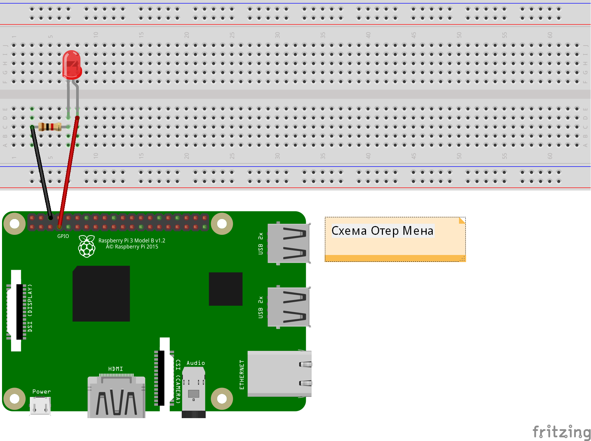
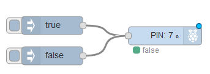

# Звіт з лабораторної роботи №4

## Частина 2.

### 1. Установка з діодом.

#### Перелік елементів схеми.

Перелік елементів показаний за [посиланням](Schemas/Diod_bom.html).

 <iframe src="Schemas/Diod_bom.html" align="left">
   Даний зміст відоражається тільки в редакторі MarkDown.
 </iframe>

#### Принципова схема установки.


#### Монтажна схема установки.



#### Програма керування.

Зовнішній вигляд програми керування показаний на рисунку.



Код:

```json
[
    {
        "id": "dbdfb75.8e3dec8",
        "type": "tab",
        "label": "Flow 3",
        "disabled": false,
        "info": ""
    },
    {
        "id": "ce121661.21922",
        "type": "rpi-gpio out",
        "z": "dbdfb75.8e3dec8",
        "name": "",
        "pin": "7",
        "set": true,
        "level": "0",
        "freq": "",
        "out": "out",
        "x": 306.5,
        "y": 84,
        "wires": []
    },
    {
        "id": "5ed60680.ba259",
        "type": "inject",
        "z": "dbdfb75.8e3dec8",
        "name": "",
        "topic": "",
        "payload": "true",
        "payloadType": "bool",
        "repeat": "",
        "crontab": "",
        "once": false,
        "onceDelay": 0.1,
        "x": 122.5,
        "y": 67,
        "wires": [
            [
                "ce121661.21922"
            ]
        ]
    },
    {
        "id": "97c33163.cf2d68",
        "type": "inject",
        "z": "dbdfb75.8e3dec8",
        "name": "",
        "topic": "",
        "payload": "false",
        "payloadType": "bool",
        "repeat": "",
        "crontab": "",
        "once": false,
        "onceDelay": 0.1,
        "x": 122.5,
        "y": 117,
        "wires": [
            [
                "ce121661.21922"
            ]
        ]
    }
]
```

