**Програмна інженерія в системах управління. Лабораторний практикум.** Автор і лектор: Олександр Пупена 

| [<- до лабораторних робіт](README.md) | [на основну сторінку курсу](../README.md) |
| ------------------------------------- | ----------------------------------------- |
|                                       |                                           |

# Лабораторна робота №10. Командна робота в GitHub

**Тривалість**: 4 акад. години.

**Мета:** Навчитися працювати з сервісами GitHub, що призначені для командної роботи

**Лабораторна установка**

- Апаратне забезпечення: ПК
- Програмне забезпечення: Git, GitHub

## Порядок виконання роботи 

Повторіть лекцію за темою лабораторної роботи [за посиланням](../Лекц/GitHub.md)

### 1. Створення форку та синхронізація з оригінальним сховищем

У даній частині лабораторної роботи необхідно створити форк репозиторію та навичитися синхронізувати репозиторії: локальний <-> форк <-> оригінальний (upstream)  

#### 1.1.Створення форку з репозиторію дисципліни

- [ ] Перейдіть на репозиторій дисципліни "Програмна інженерія в системах управління" за [посиланням](https://github.com/pupenasan/ProgIngContrSystems).

- [ ] Якщо Ви не увійшли в систему GitHub, зайдіть через кнопку  `SignIn`

- [ ] У правому верхньому кутку натисніть `Fork` для створення форку репозиторію. Після цього форк створиться у вашому списку репозиторіїв (процедура в один клік)

- [ ] Проаналізуйте структуру та зміст репозиторію, зокрема елементи, що показані на рисунку.  

    

  рис.10.1. Перегляд властивостей форку

Тепер у Вашому форку репозиторію Ви можете вносити будь які зміни і за необхідності пропонувати їх в оригінальне сховище, або синхронізуватися з ним.

#### 1.2. Створення локальнго клону з репозиторію форку

- [ ] натисніть на кнопку `Clone or download` скопіюйте SSH посилання

- [ ] зробіть клон репозиторію на локальному ПК за допомогою GitGui або GitBash. Як це робиться через GitBash було показано на лабораторній роботі по Git. На рисунку показано як це робиться через GitGui. Зверніть увагу, що папки `repo`, яка буде робочою папкою, у даному прикладі не повинно існувати до клонування

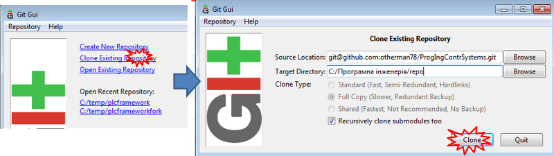

рис.10.2. Створення локальнго клону з репозиторію форку

Повинно появитися вікно для вводу Вашого паролю доступу до GitHub, куди необхідно ввести пароль, який Ви створили на лабораторній роботі по Git.  

- [ ] перевірте створення клону репозиторію, перейшовши до робочої папки 

#### 1.3. Внесення змін до локальнго репозиторію форку

- [ ] у робочій папці відкрийте папку `Курсовий\20xx` (де `20xx` - навчальний рік)

- [ ] створіть файл за форматом

`Прізвище_Імя.md`

- [ ] відкрийте редактором Markdown, внесіть туди деякі дані про себе, зокрема:

- ім'я на GitHub
- інші контактні дані за бажанням 

- [ ] збережіть файл

- [ ] зробіть комміт в локальному репозиторію з поміткою "Про Прізвище Ім'я", де вкажіть своє прізвище та ім'я 

#### 1.4. Внесення змін у віддалений репозиторій форку

- [ ] зробіть push в віддалений репозиторій (форк) 
- [ ] перевірте, що зміни відображаються в GitHub
- [ ] перейдіть на оригінальний репозиторій, перевірте що там зміни не були внесені

#### 1.5. Відправлення запиту на пул (pull request) до оригінального (upstreem) репозиторію

- [ ] перейдіть в GitHub до Вашого форку (кнопка `Fork` у даному випадку не створить повторно новий форк, а перейде до вже створеного). Оскільки Ви зробили зміни в ньому, GitHub повідомляє що тепер оригінальний та форк репозиторії відрізняються і запропонує порівняти (`Compare`) або запропонувати злиття через запит на пул (`pull request`)  (рис.10.3)

  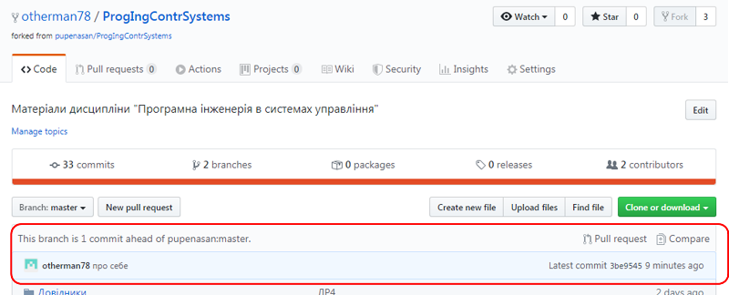   

  рис.10.3. Відправлення pull request до upstreem репозиторію

- [ ] натисніть `Compare`, щоб подивитися чим саме відрізняються репозиторії. Ви перейдете на оригінальний репозиторій, де будуть показані зміни відносно вашого форку (рис.10.4) 

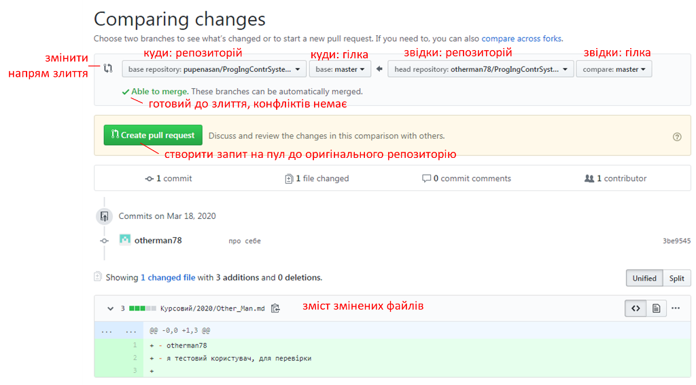

рис.10.4. Перегляд змін в коміті

- [ ] якщо зміни сумісні з зливанням (`Able to merge`) зробіть запит на пул кнопкою `Create pull request` , якщо ні - зверніться до викладача

- [ ] з'явиться вікно налаштування запиту на пул, де необхідно внести текст запиту (Write) та натиснути `Create pull request` знову  

  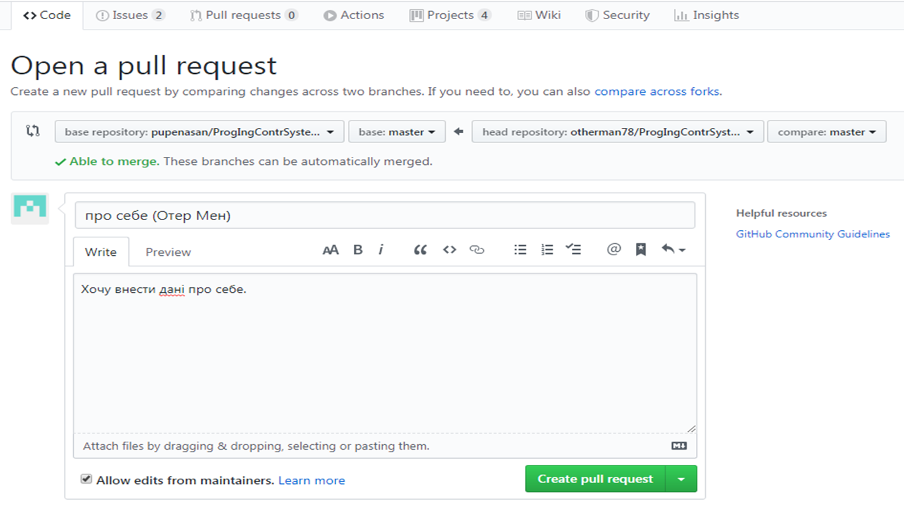

  рис.10.5. Відкриття  `pull request`

У результаті у оригінальному репозиторії створиться новий запит на пул, який Ви не можете підтвердити, так як права на зміни у цьому репозиторії у Вас немає (рис.10.6). У Вашому форку цього запиту не буде. 

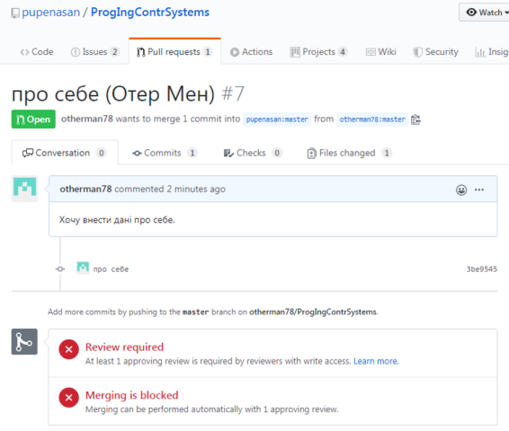

рис.10.6. Вигляд `pull request` що не може бути виконаний

- [ ] наступний пункт слід робити після очікування відповіді на запит від викладача, поки перейдіть до виконання пункту 2.1.  

#### 1.6. Робота з запитом на пул

Після перегляду викладачем (співавтором) репозиторію Вашого запиту на пул, він зробить певний коментар і попросить добавити якусь додаткову інформацію в файл. Ця відповідь прийде Вам на пошту, десь приблизно  в такому вигляді:

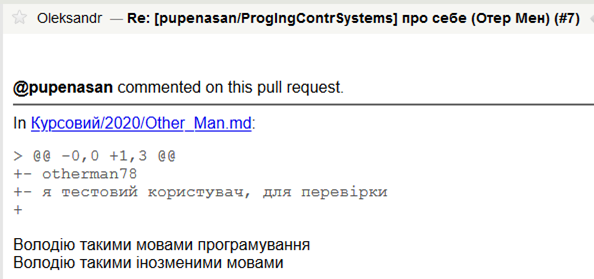 

рис.10.7. Лист з коментарями до запиту 

У даному випадку вказується що треба зробити.

- [ ] відкрийте в локальному репозиторію файл з інформацією про себе, внесіть туди зміни, що попросив викладач та збережіть
- [ ] зробіть комміт з поміткою ("правки про прізвище та ім'я") та push
- [ ] після затвердження викладачем запиту Вам прийде на пошту повідомлення
- [ ] після злиття (merge) Вам прийде на пошту повідомлення  

#### 1.7.  Перегляд історії та результатів запиту на пул

- [ ] перейдіть на оригінальний репозиторій і впевніться, що файл дійсно з'явився 

- [ ] перейдіть на список запитів на пул (`Pull requests`). За замовченням там відображаються тільки відкриті (`Open`) запити, але можна використати інші фільтри

  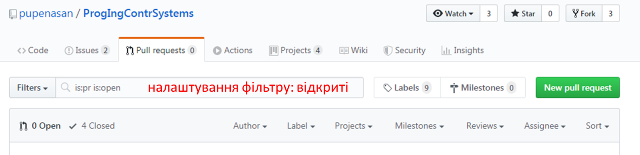

  рис.10.8. Перегляд активних запитів на пул

- [ ] зайдіть у меню `Author`і виберіть своє ім'я зі списку, далі натисніть `Closed` якщо ваш запит вже закрито. Повинен з'явитися Ваш запит

   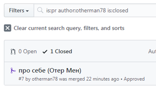

   рис.10.9. Перегляд закритих запитів на пул

-   [ ] натисніть по запиту, щоб відкрити його історію

-  [ ] передивіться історію даного запиту (коміти, зміни і т.п.)

#### 1.8. Налаштування відображення кирилічних шрифтів

Для коректного відображення текстового змісту в `Git Gui` необхідно налаштувати кодування тексту. 

- [ ] відкрийте  `Git Gui` у Вашій робочій папці
- [ ] зайдіть в меню `Edit->Options` і вкажіть для локального і для всіх репозиторіїв кодування `Utf-8`. 

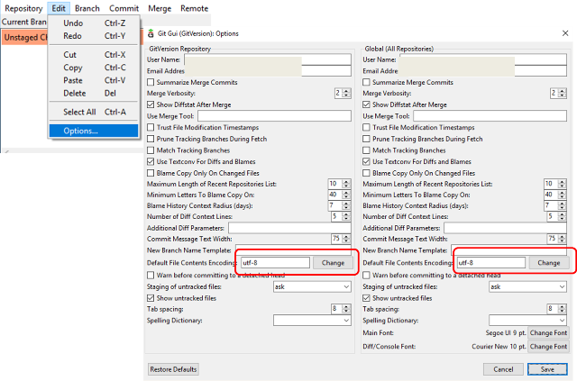

рис.10.10. Налаштування відображення шрифтів utf-8 

#### 1.9. Синхронізація з оригінальним репозиторієм   

Разом зі зливанням з основною гілкою викладач внесе певні зміни в папку курсового проекту. Крім того за цей час оригніальний (uplink) репозиторій може змінитися. Щоб синхронізувати ці зміни з локальним репозиторієм, який посилається на форк, необхідно його прописати в конфігуванні.     

- [ ] відкрийте  `Git Gui` у Вашій робочій папці, якщо вона ще не відкрита

- [ ] добавте посилання на новий віддалений репозиторій з іменем `upstream`, який буде посилатися на оригінальне сховище, з якого був зроблений форк 

  

  рис.10.11. Добавлення посилання на новий віддалений репозиторій 

- [ ] отримайте нові дані з віддаленого `upstream` сховища через команду `fetch`

- [ ] зайдіть в меню `Repository -> Vizualise All Branch History` і передивіться наступну інформацію

  - на якому коміті знаходиться `Head` (показано жовтим)
  - які зміни зроблені в останніх комітах, що знаходяться в `upstream`, проаналізуйте, що саме добавив викладач та інші користувачі після того, як ви зробили форк 
  - усю іншу інформацію

- [ ] зробіть зливання (merge) з гілкою `upstream/master` 

  

  рис.10.12. Зливання (merge) з гілкою `upstream/master` 

- [ ] передивіться чи з'явилися ці зміни у вашій робочій директорії

- [ ] зробіть `Push` проекту для його завантаження в віддалений форк 


## 2. Сумісна робота з одним репозиторієм

У даній частині лабораторної роботи необхідно підключити кілька співавторів до репозиторію і навчитися працювати в одному проекті. 

#### 2.1. Добавлення колег з команди до форку

- [ ] Зайдіть в папку курсового проекту ("Курсовий")  локального репозиторію, відкрийте файл `варіанти.md `та знайдіть своїх колег з команди по курсовому проекту. Дізнайтеся їх облікові дані GitHub.

- [ ] Зайдіть на Git Hub до репозиторію форку. Зайдіть в налаштування доступу, при проханні вести пароль - введіть пароль доступу до аккаунта. 

  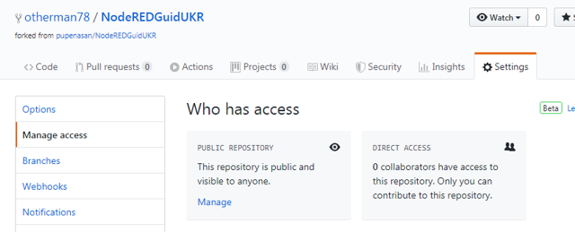

  рис.10.13. Добавлення користувача до команди

- [ ] натисніть `Invait Collaborator` і запросіть колегу до співавторів репозиторію

- [ ] зробіть запрошення для усіх інших колег з команди по курсовому проекту

#### 2.2. Створення власної гілки в репозиторію

При роботі в команді варто створювати власні тематичні гілки в репозиторію, які при необхідності будуть зливатися з основними гілками, типу `master`. Зливання може проводитися шляхом запитів на пул (pull request). 

- [ ] створіть власну гілку в локальному репозиторію (клона форку) з іменем `my_nic`, де my_nic - це Ваше ім'я аккаунта, 

  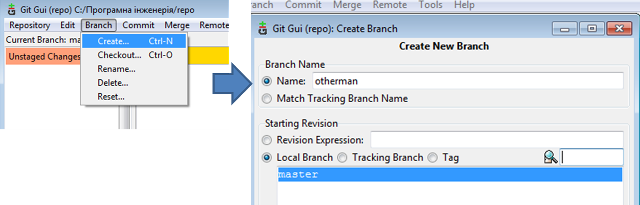

  рис.10.14. Створення власної гілки в репозиторію

- [ ] добавте рядок в файл, що створювали в п 1.3 (в папці `Курсовий\20xx`) 

  ```
  Добавив до власного форку користувачів:
  - Прізвище Імя і Нік користувача
  - ...
  ```

- [ ] зробіть коміт та  `push` до репозиторію форка (remote=origin) та впевніться, що гілка появилася в ньому на GitHub

#### 2.3. Підключення віддаленого репозиторію форка іншого користувача

Даний пункт робиться тоді, коли користувач з Вашої групи відправив запрошення до свого форку і Ви його підтвердили.

- [ ] добавте посилання на віддалений репозиторій з іменем `nicname` (де nicname - ім'я користувача, до чийого репозиторію ви підключаєтеся), аналогічно як це зроблено в п.1.9
- [ ] зробіть  `push` до репозиторію форка (remote=origin) та впевніться, що гілка появилася в ньому на GitHub
- [ ] подивіться на вкладку `Code` в репозиторії GitHub, він пропонує зробити запит на пул  (pull request) для злиття з гілкою master

#### 2.4. Змінити дозволи для гілки `master`

Усі співавтори репозиторію мають за замовченням дозвіл на завантаження змін у будь-яку гілку репозиторію (push). Для того, щоб випадково не зробити зміни в гілці `master` необхідно зробити налаштування обмежень доступу на гілку.

- [ ] зайдіть в налаштування правил доступу до гілки та натисніть `Add rule` для добавлення нового правила

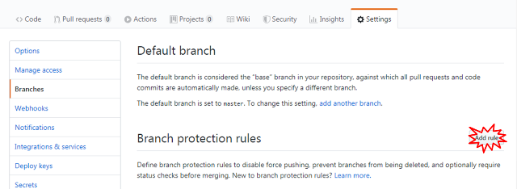

рис.10.15. Налаштування правил доступу до гілки 

- [ ] в налаштуваннях паттерну (шаблону) назви гілки вкажіть `master` та означте правила що потребують 2-х підтверджень запиту на пул (pull request) від співавторів перед будь яким зливанням з гілкою `master`. 

- [ ] Підтвердіть створення правила кнопкою `create`.

  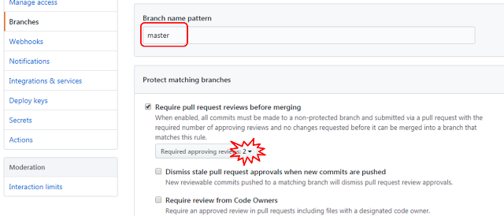
  
  рис.10.16. Налаштування вимоги кількох підтверджень 

#### 2.5. Створення папки для курсового проекту

Даний та наступні пункти виконуються тоді, коли більша частина користувачів команди зареєструвалися в форках. Виконується тімлідом але перевіряється усіми. 

У вашій команді є `тімлід`, який буде координувати дії усієї команди. У даному випадку він також буде адміністратором основного форку, через який усі зміни в проекті будуть передаватися через запит на пул. 

- [ ] Якщо Ви є тімлідом, створіть в папці `Курсовий\20xx` (де `20xx` - це навчальний рік), папку проекту з іменем, однойменним для команди (ім'я команди треба до цього часу придумати); саме в цю папку будуть добавлятися усі проектні документи та код;

- [ ] Якщо Ви є тімлідом, добавте в папку проекту файл README.MD куди вписати:

  - назву курсового проекту;
  - короткий опис проекту;
  - роль кожного члену в команді; 

#### 2.6. Наповнення папки для курсового проекту

  Виконується усіми членами команди, в тому числі тімлідом.

- [ ] Якщо Ви не є тімлідом, після створення папки, та файлу зробіть push з форку тімліда і злийте з вашою гілкою (ця процедура буде часто відбуватися, так як і синхронізація з оригінальним (upstream) репозиторієм) 
- [ ] У папці, що створив тімлід створіть файл у форматі MarkDown з назвою `Прізвище Імя`, у якому напишіть резюме про себе. Зробіть коміт та push до **форку тімліда**.
- [ ] Кожен член команди, окрім тімліда повинен зробити запит на пул.         

#### 2.7. Зливання гілок в одну гілку

- [ ] зроблені запити на пул повинні бути підтверджені двома членами команди (approve)
- [ ] після цього тімлід має зробити зливання (мердж) в гілку master 

#### 2.8. Запит на пул до оригінального(upstream) репозиторію

-  [ ] після внесення усіх правок відправте запит на пул з гілки `master` командного репозиторію (форка) на `master` оригінального
- [ ] в процесі обговорення дочекайтеся, щоб мердж вашої гілки форка з оригінальним репозиторієм відбувся       

## Питання до захисту

1. Які моделі сумісної роботи з репозиторієм надає Git та GitHub?
2. Розкажіть що таке "форк"?
3. Яким чином відбувається синхронізація форку з оригінальним сховищем?
4. Поясніть що таке `pull request`.
5. Які можливості надає GitHub для перевірки змін в комітах?
6. Яким чином відбувається налаштування захисту від внесення змін неавторизованих користувачів в репозиторій?
7. Яким чином відбувається обговорення запитів  `pull request`?
8. Розкажіть як можна використовувати гілки репозиторію для сумісної роботи? 